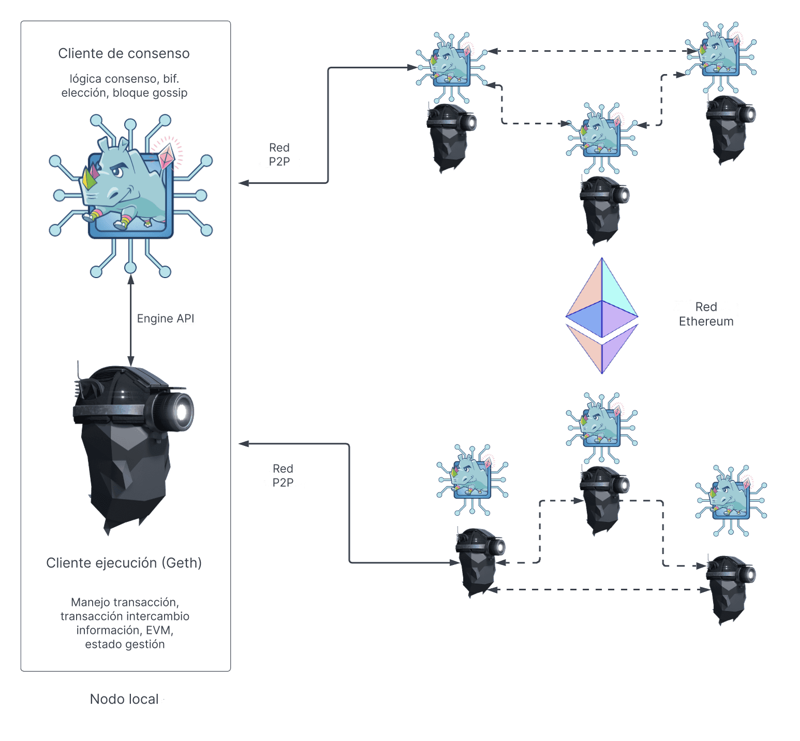

Un nodo de Ethereum está compuesto por dos clientes: un [cliente de ejecución](/developers/docs/nodes-and-clients/#execution-clients) y un [cliente de consenso](/developers/docs/nodes-and-clients/#consensus-clients). Para que un nodo proponga un nuevo bloque, también debe ejecutar un [cliente validador](#validators).

Cuando Ethereum utilizaba la [prueba de trabajo (PoW)](/developers/docs/consensus-mechanisms/pow/), un cliente de ejecución era suficiente para ejecutar un nodo completo de Ethereum. Sin embargo, desde la implementación de la [prueba de participación (PoS)](/developers/docs/consensus-mechanisms/pos/), el cliente de ejecución debe utilizarse junto con otro software llamado [cliente de consenso](/developers/docs/nodes-and-clients/#consensus-clients).

El siguiente diagrama muestra la relación entre los dos clientes de Ethereum. Los dos clientes se conectan a sus respectivas redes entre pares (P2P). Se necesitan redes P2P separadas, ya que los clientes de ejecución difunden transacciones a través de su red P2P, lo que les permite gestionar su pool de transacciones local, mientras que los clientes de consenso difunden bloques a través de su red P2P, lo que permite el consenso y el crecimiento de la cadena.

_Existen varias opciones para el cliente de ejecución, incluyendo Erigon, Nethermind y Besu_.

Para que esta estructura de dos clientes funcione, los clientes de consenso deben pasar paquetes de transacciones al cliente de ejecución. El cliente de ejecución ejecuta las transacciones localmente para validar que no violen ninguna regla de Ethereum y que la actualización propuesta al estado de Ethereum sea correcta. Cuando se selecciona un nodo para ser productor de bloques, su instancia de cliente de consenso solicita paquetes de transacciones al cliente de ejecución para incluirlos en el nuevo bloque y ejecutarlos para actualizar el estado global. El cliente de consenso controla al cliente de ejecución a través de una conexión RPC local utilizando la [API Engine](https://github.com/ethereum/execution-apis/blob/main/src/engine/common.md).

## ¿Qué hace el cliente de ejecución? {#execution-client}

El cliente de ejecución es responsable de la validación, el manejo y la difusión de transacciones, junto con la gestión del estado y el soporte de la Máquina Virtual de Ethereum ([EVM](/developers/docs/evm/)). **No** es responsable de la construcción de bloques, la difusión de bloques ni el manejo de la lógica de consenso. Estas tareas son competencia del cliente de consenso.

El cliente de ejecución crea cargas útiles de ejecución: la lista de transacciones, el trie de estado actualizado y otros datos relacionados con la ejecución. Los clientes de consenso incluyen la carga útil de ejecución en cada bloque. El cliente de ejecución también es responsable de volver a ejecutar las transacciones en los nuevos bloques para garantizar que sean válidas. La ejecución de transacciones se realiza en la computadora integrada del cliente de ejecución, conocida como la [Máquina Virtual de Ethereum (EVM)](/developers/docs/evm).

El cliente de ejecución también ofrece una interfaz de usuario para Ethereum a través de [métodos RPC](/developers/docs/apis/json-rpc) que permiten a los usuarios consultar la cadena de bloques de Ethereum, enviar transacciones y desplegar contratos inteligentes. Es común que las llamadas RPC sean manejadas por una biblioteca como [Web3js](https://docs.web3js.org/), [Web3py](https://web3py.readthedocs.io/en/v5/), o por una interfaz de usuario como una billetera de navegador.

En resumen, el cliente de ejecución es:

- una puerta de enlace de usuario a Ethereum
- el hogar de la Máquina Virtual de Ethereum, el estado de Ethereum y el pool de transacciones.

## ¿Qué hace el cliente de consenso? {#consensus-client}

El cliente de consenso se encarga de toda la lógica que permite a un nodo mantenerse en sincronización con la red Ethereum. Esto incluye recibir bloques de sus pares y ejecutar un algoritmo de elección de bifurcación para garantizar que el nodo siempre siga la cadena con la mayor acumulación de certificaciones (ponderadas por los saldos efectivos de los validadores). Al igual que el cliente de ejecución, los clientes de consenso tienen su propia red P2P a través de la cual comparten bloques y certificaciones.

El cliente de consenso no participa en la certificación ni en la propuesta de bloques; esto lo hace un validador, un complemento opcional para un cliente de consenso. Un cliente de consenso sin un validador solo se mantiene al día con la cabeza de la cadena, lo que permite que el nodo se mantenga sincronizado. Esto permite a un usuario realizar transacciones con Ethereum utilizando su cliente de ejecución, con la confianza de que está en la cadena correcta.

## Validadores {#validators}

Hacer staking y ejecutar el software del validador hace que un nodo sea elegible para ser seleccionado para proponer un nuevo bloque. Los operadores de nodos pueden agregar un validador a sus clientes de consenso depositando 32 ETH en el contrato de depósito. El cliente validador viene incluido con el cliente de consenso y se puede agregar a un nodo en cualquier momento. El validador maneja las certificaciones y las propuestas de bloques. También permite que un nodo acumule recompensas o pierda ETH a través de penalizaciones o recortes.

[Más sobre el staking](/staking/).

## Comparación de los componentes de un nodo {#node-comparison}

| Cliente de ejecución                               | Cliente de consenso                                                                                                                                       | Validador                    |
| -------------------------------------------------- | --------------------------------------------------------------------------------------------------------------------------------------------------------- | ---------------------------- |
| Difunde transacciones a través de su red P2P       | Difunde bloques y certificaciones a través de su red P2P                                                                                                  | Propone bloques              |
| Ejecuta/vuelve a ejecutar transacciones            | Ejecuta el algoritmo de elección de bifurcación                                                                                                           | Acumula recompensas/penalizaciones |
| Verifica los cambios de estado entrantes           | Realiza un seguimiento de la cabeza de la cadena                                                                                                          | Realiza certificaciones      |
| Gestiona los tries de estado y recibos             | Gestiona el estado de la cadena de baliza (contiene información de consenso y ejecución)                                                                  | Requiere hacer staking de 32 ETH |
| Crea la carga útil de ejecución                    | Realiza un seguimiento de la aleatoriedad acumulada en RANDAO (un algoritmo que proporciona aleatoriedad verificable para la selección de validadores y otras operaciones de consenso) | Puede sufrir recortes        |
| Expone la API JSON-RPC para interactuar con Ethereum | Realiza un seguimiento de la justificación y finalización                                                                                                 |                              |

## Lecturas adicionales {#further-reading}

- [Prueba de participación (PoS)](/developers/docs/consensus-mechanisms/pos)
- [Propuesta de bloques](/developers/docs/consensus-mechanisms/pos/block-proposal)
- [Recompensas y penalizaciones de los validadores](/developers/docs/consensus-mechanisms/pos/rewards-and-penalties)