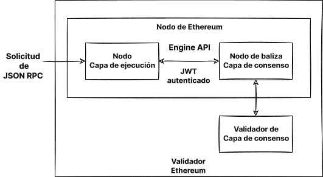

Ejecutar su propio nodo le aporta diferentes beneficios, le abre nuevas posibilidades y ayuda a apoyar el ecosistema. Esta página le guiará durante la ejecución de su propio nodo y durante la participación en la validación de las transacciones de Ethereum.

Ten en cuenta que después de [La Fusión](/roadmap/merge), se necesitan dos clientes para ejecutar un nodo de Ethereum: un cliente de la **capa de ejecución (EL)** y un cliente de la **capa de consenso (CL)**. Esta página mostrará cómo instalar, configurar y conectar estos dos clientes para ejecutar un nodo de Ethereum.

## Requisitos previos {#prerequisites}

Debería entender qué es un nodo de Ethereum y por qué puede que tenga que ejecutar un cliente. Esto se trata en [Nodos y clientes](/developers/docs/nodes-and-clients/).

Si es nuevo en el tema de ejecutar un nodo, o si busca una vía menos técnica, le recomendamos que primero consulte nuestra sencilla introducción sobre [cómo ejecutar un nodo de Ethereum](/run-a-node).

## Elegir un enfoque {#choosing-approach}

El primer paso para ejecutar su nodo es elegir su enfoque. Basado en requisitos y diversas posibilidades, debe seleccionar la implementación del cliente (de ejecución y de conceso), el entorno (hardware, sistema) y los parámetros para la configuración del cliente.

Esta página le guiará a través de estas decisiones y le ayudará a encontrar la forma más adecuada de ejecutar su instancia de Ethereum.

Para elegir entre las implementaciones de clientes, consulte todos los [clientes de ejecución](/developers/docs/nodes-and-clients/#execution-clients) y los [clientes de consenso](/developers/docs/nodes-and-clients/#consensus-clients) listos para la red principal (Mainnet) y obtenga información sobre la [diversidad de clientes](/developers/docs/nodes-and-clients/client-diversity).

Decida si ejecutar el software en su propio [hardware o en la nube](#local-vs-cloud), teniendo en cuenta los [requisitos](#requirements) de los clientes.

Después de preparar el entorno, instale los clientes elegidos con una [interfaz para principiantes](#automatized-setup) o [manualmente](#manual-setup) usando una terminal con opciones avanzadas.

Cuando el nodo se esté ejecutando y sincronizando, estará listo para [usarlo](#using-the-node), pero asegúrese de prestar atención a su [mantenimiento](#operating-the-node).



### Entorno y hardware {#environment-and-hardware}

#### Local o en la nube {#local-vs-cloud}

Los clientes de Ethereum pueden ejecutarse en ordenadores para uso de usuarios y no requieren hardware especial, como, por ejemplo, las máquinas para minado. Por lo tanto, tiene varias opciones para desplegar el nodo en función de sus necesidades.
Para simplificar, vamos a pensar en ejecutar un nodo en una máquina física local y en un servidor en la nube:

- En la nube
  - Los proveedores ofrecen un elevado tiempo de actividad del servidor, direcciones IP públicas estáticas.
  - Obtener un servidor dedicado o virtual puede ser más cómodo que construir el suyo propio
  - La contrapartida es confiar en un tercero: el proveedor del servidor
  - Debido al tamaño de almacenamiento requerido para el nodo completo, el precio de un servidor alquilado podría llegar a ser alto.
- Hardware propio
  - Un enfoque más soberano y fiable
  - Inversión única
  - Una opción para comprar máquinas preconfiguradas
  - Tiene que preparar físicamente, mantener y potencialmente solucionar problemas a la máquina y a la red

Ambas opciones tienen diferentes ventajas, resumidas arriba. Si está buscando una solución en la nube, además de los numerosos proveedores tradicionales de computación en la nube, también existen servicios enfocados al despliegue de nodos. Consulte los [nodos como servicio](/developers/docs/nodes-and-clients/nodes-as-a-service/) para ver más opciones de nodos alojados.

#### Hardware {#hardware}

Sin embargo, una red descentralizada, resistente a la censura, no debería depender de proveedores en la nube. En su lugar, ejecutar su nodo en su propio hardware local es más saludable para el ecosistema. Las [estimaciones](https://www.ethernodes.org/networkType/cl/Hosting) muestran que una gran parte de los nodos se ejecutan en la nube, lo que podría convertirse en un único punto de fallo.

Los clientes de Ethereum pueden ejecutarse en su ordenador, portátil, servidor o incluso en un ordenador de una sola placa. Si bien es posible ejecutar clientes en su ordenador personal, tener una máquina específica solo para su nodo puede mejorar significativamente su rendimiento y seguridad al tiempo que minimiza el impacto en su ordenador principal.

Usar su propio hardware puede ser muy fácil. Hay muchas opciones sencillas así como configuraciones avanzadas para personas más técnicas. Así que veamos los requisitos y medios para ejecutar clientes de Ethereum en su máquina.

#### Requisitos {#requirements}

Los requisitos de hardware difieren según el cliente, pero por lo general no son tan altos, ya que el nodo solo necesita mantenerse sincronizado. No se debe confundir con el minado, que necesita mucha más potencia computacional. Sin embargo, el tiempo de sincronización y el rendimiento mejoran si se dispone de hardware más potente.

Antes de instalar un cliente, asegúrese de que su equipo dispone de los recursos suficientes para ejecutarlo. Puede encontrar los requisitos mínimos y recomendados a continuación.

La limitación para su hardware es principalmente espacio en disco. La sincronización de la cadena de bloques de Ethereum es muy intensiva en entrada/salida y requiere mucho espacio. Lo mejor es tener una **unidad de estado sólido (SSD)** con cientos de GB de espacio libre de sobra, incluso después de la sincronización.

El tamaño de la base de datos y la velocidad de la sincronización inicial dependen del cliente elegido, de su configuración y de la [estrategia de sincronización](/developers/docs/nodes-and-clients/#sync-modes).

Asegúrese también de que su conexión a Internet no esté limitada por un [límite de ancho de banda](https://wikipedia.org/wiki/Data_cap). Se recomienda utilizar una conexión ilimitada, ya que la sincronización inicial y los datos transmitidos a la red podrían superar su límite.

##### Sistema operativo

Todos los clientes son compatibles con los principales sistemas operativos: Linux, MacOS y Windows. Esto implica que puede ejecutar nodos en equipos de escritorio o servidores normales con el sistema operativo (SO) que mejor le convenga. Asegúrese de que su sistema operativo está actualizado para evitar posibles problemas y puntos débiles de seguridad.

##### Requisitos mínimos

- CPU con dos o más núcleos
- 8 GB de RAM
- SSD de 2 TB
- 10 o más MBit/s de banda ancha

##### Especificaciones recomendadas

- CPU rápida con cuatro o más núcleos
- 16 GB o más de RAM
- SSD rápida con 2 o másTB
- 25 o más MBit/s de banda ancha

El modo de sincronización que elija afectará a los requisitos de espacio. No obstante, hemos calculado a continuación el espacio que necesitará en el disco para cada cliente.

| Cliente    | Tamaño del disco (sincronización rápida) | Tamaño del disco (archivo completo) |
| ---------- | ----------------------------------------------------------- | ------------------------------------------------------ |
| Besu       | 800 GB o más                                                | 12 TB o más                                            |
| Erigon     | N/P                                                         | 2,5 TB o más                                           |
| Geth       | 500 GB o más                                                | 12 TB o más                                            |
| Nethermind | 500 GB o más                                                | 12 TB o más                                            |
| Reth       | N/P                                                         | 2,2 TB o más                                           |

- Nota: Erigon y Reth no ofrecen sincronización snap, pero la poda completa es posible (~2 TB para Erigon, ~1,2 TB para Reth).

Para los clientes de consenso, el requisito de espacio también depende de la implementación del cliente y de las funciones habilitadas (p. ej., «validator slasher»), pero por lo general, se necesitan otros 200 GB para los datos de la baliza. Con un gran número de validadores, la carga de ancho de banda también crece. Puede encontrar [detalles sobre los requisitos del cliente de consenso en este análisis](https://mirror.xyz/0x934e6B4D7eee305F8C9C42b46D6EEA09CcFd5EDc/b69LBy8p5UhcGJqUAmT22dpvdkU-Pulg2inrhoS9Mbc).

#### Soluciones «plug-and-play» {#plug-and-play}

La opción más fácil para ejecutar un nodo con su propio hardware es usar cajas listas para conectar y usar. Las máquinas preconfiguradas de los proveedores ofrecen la experiencia más sencilla: pida, conecte y ejecute. Todo está preconfigurado y funciona automáticamente con una guía intuitiva y un panel de control para supervisar y controlar el software.

- [DappNode](https://dappnode.io/)
- [Avado](https://ava.do/)

#### Ethereum en un ordenador de placa única {#ethereum-on-a-single-board-computer}

La manera más práctica y barata de ejecutar un nodo de Ethereum es usar un ordenador de placa única con estructura ARM como Raspberry Pi. [Ethereum on ARM](https://ethereum-on-arm-documentation.readthedocs.io/en/latest/) proporciona imágenes fáciles de ejecutar de múltiples clientes de ejecución y de consenso para Raspberry Pi y otras placas ARM.

Los dispositivos pequeños, asequibles y eficientes como estos son ideales para ejecutar un nodo en el inicio, pero tenga en cuenta que su rendimiento es limitado.

## Puesta en marcha del nodo {#spinning-up-node}

La configuración real del cliente se puede realizar con lanzadores automatizados o manualmente, configurando el software del cliente directamente.

Para los usuarios menos avanzados, el enfoque recomendado es utilizar un lanzador, es decir, un software que le guíe a través de la instalación y que automatiza el proceso de configuración del cliente. Sin embargo, si tiene alguna experiencia en el uso de una terminal, los pasos para la configuración manual deberían ser sencillos de seguir.

### Configuración guiada {#automatized-setup}

Los múltiples proyectos fáciles de usar pretenden mejorar la experiencia de la creación de un cliente. Estos lanzadores proporcionan la instalación y configuración automáticas del cliente. Algunos ofrecen incluso una interfaz gráfica para la instalación guiada y el seguimiento de los clientes.

A continuación se presentan algunos proyectos que pueden ayudarle a instalar y controlar clientes con unos pocos clics:

- [DappNode](https://docs.dappnode.io/docs/user/getting-started/choose-your-path) - DappNode no solo viene con una máquina de un proveedor. El software, el lanzador de nodos real y el centro de control con muchas funciones pueden utilizarse en hardware arbitrario.
- [EthPillar](https://www.coincashew.com/coins/overview-eth/ethpillar): la forma más rápida y sencilla de configurar un nodo completo. Herramienta de configuración de una sola línea y gestión de nodos TUI. Gratis. Código abierto. Bienes públicos para Ethereum por participantes individuales. Soporte ARM64 y AMD64.
- [eth-docker](https://eth-docker.net/): configuración automatizada mediante Docker, centrada en un staking fácil y seguro. Requiere conocimientos básicos de terminal y Docker, recomendado para usuarios un poco más avanzados.
- [Stereum](https://stereum-dev.github.io/ethereum-node-web-docs): lanzador para instalar clientes en un servidor remoto mediante conexión SSH, con una guía de configuración de la GUI, un centro de control y muchas otras funciones.
- [NiceNode](https://www.nicenode.xyz/): un lanzador con una experiencia de usuario sencilla para ejecutar un nodo en su ordenador. Sólo tiene que elegir a los clientes y empezar con unos pocos clics. Aún está en fase de desarrollo.
- [Sedge](https://docs.sedge.nethermind.io/docs/intro): herramienta de configuración de nodos que genera automáticamente una configuración de Docker mediante el asistente de la CLI. Escrito en Go por Nethermind.

### Configuración manual de clientes {#manual-setup}

La otra opción es descargar, verificar y configurar el software de cliente manualmente. Incluso si algunos clientes ofrecen una interfaz gráfica, una configuración manual requiere habilidades básicas con la terminal pero ofrece mucha más versatilidad.

Como se explicó anteriormente, configurar su propio nodo de Ethereum requerirá ejecutar un par de clientes de consenso y ejecución. Algunos clientes pueden incluir un cliente ligero de otro tipo y sincronizar sin necesidad de ningún otro software. Sin embargo, la verificación total sin confianza requiere ambas implementaciones.

#### Obtener el software del cliente {#getting-the-client}

En primer lugar, necesita obtener el software de su [cliente de ejecución](/developers/docs/nodes-and-clients/#execution-clients) y [cliente de consenso](/developers/docs/nodes-and-clients/#consensus-clients) preferidos.

Puede simplemente descargar una aplicación ejecutable o instalar un paquete que se adapte a su arquitectura y sistema operativo. Verifique siempre las firmas y sumas de comprobación de los paquetes descargados. Algunos clientes también ofrecen repositorios o imágenes Docker para facilitar su instalación y actualizaciones. Todos los clientes son de código abierto, así que también puede crearlos desde el código fuente. Este es un método más avanzado, pero en algunos casos podría ser necesario.

Las instrucciones para instalar cada cliente se proporcionan en la documentación relacionada, en las listas de clientes anteriores.

He aquí las páginas de publicación de los clientes donde puede encontrar sus binarios precompilados o instrucciones sobre la instalación:

##### Clientes de ejecución

- [Besu](https://github.com/hyperledger/besu/releases)
- [Erigon](https://github.com/ledgerwatch/erigon/releases)
- [Geth](https://geth.ethereum.org/downloads/)
- [Nethermind](https://downloads.nethermind.io/)
- [Reth](https://reth.rs/installation/installation.html)

También vale la pena señalar que la diversidad de clientes es un [problema en la capa de ejecución](/developers/docs/nodes-and-clients/client-diversity/#execution-layer). Se recomienda que los lectores tengan en cuenta la opción de ejecutar un cliente de ejecución minoritario.

##### Clientes de consenso

- [Lighthouse](https://github.com/sigp/lighthouse/releases/latest)
- [Lodestar](https://chainsafe.github.io/lodestar/run/getting-started/installation#build-from-source) (no proporciona un binario precompilado, solo una imagen de Docker o debe compilarse desde el código fuente)
- [Nimbus](https://github.com/status-im/nimbus-eth2/releases/latest)
- [Prysm](https://github.com/prysmaticlabs/prysm/releases/latest)
- [Teku](https://github.com/ConsenSys/teku/releases)

La [diversidad de clientes](/developers/docs/nodes-and-clients/client-diversity/) es fundamental para los nodos de consenso que ejecutan validadores. Si la mayoría de los validadores están ejecutando una implementación de un solo cliente, la seguridad de la red está en riesgo. Por lo tanto, se recomienda considerar la elección de un cliente minoritario.

[Vea el uso más reciente del cliente de red](https://clientdiversity.org/) y obtenga más información sobre la [diversidad de clientes](/developers/docs/nodes-and-clients/client-diversity).

##### Verificación del software

Al descargar software desde Internet, se recomienda verificar su integridad. Este paso es opcional, pero especialmente con una pieza de infraestructura crucial como el cliente de Ethereum, es importante estar al tanto de los posibles vectores de ataque y evitarlos. Si ha descargado un binario precompilado, debe confiar en él y correr el riesgo de que un atacante pueda cambiar el ejecutable por uno malicioso.

Los desarrolladores han liberado binarios con sus claves PGP para que puedas verificar criptográficamente que estás ejecutando exactamente el software que creaban. Sólo necesita obtener las claves públicas utilizadas por los desarrolladores, que se pueden encontrar en las páginas de publicación del cliente o en la documentación. Después de descargar la versión del cliente y su firma, puede utilizar una implementación PGP, p. ej., [GnuPG](https://gnupg.org/download/index.html) para verificarlos fácilmente. Consulte un tutorial sobre la verificación de software de código abierto utilizando `gpg` en [linux](https://www.tecmint.com/verify-pgp-signature-downloaded-software/) o [Windows/MacOS](https://freedom.press/training/verifying-open-source-software/).

Otra forma de verificación es asegurarse que el hash, una huella criptográfica única, del software que ha descargado coincide con el proporcionado por los desarrolladores. Esto es incluso más fácil que usar PGP, y algunos clientes sólo ofrecen esta opción. Sólo tiene que ejecutar la función hash en el software descargado y compararla con la de la página de lanzamiento. Por ejemplo:

```sh
sha256sum teku-22.6.1.tar.gz

9b2f8c1f8d4dab0404ce70ea314ff4b3c77e9d27aff9d1e4c1933a5439767dde
```

#### Configuración del cliente {#client-setup}

Después de instalar, descargar o compilar el software del cliente, está listo para ejecutarlo. Esto sólo significa que tiene que ser ejecutado con la configuración adecuada. Los clientes ofrecen opciones de configuración ricas que pueden habilitar varias características.

Empecemos con opciones que pueden influir significativamente en el rendimiento del cliente y el uso de datos. Los [modos de sincronización](/developers/docs/nodes-and-clients/#sync-modes) representan diferentes métodos de descarga y validación de los datos de la cadena de bloques. Antes de empezar el nodo, debería decidir qué red y modo de sincronización usar. Los aspectos más importantes que se deben tener en cuenta son el espacio del disco y el tiempo de sincronización que necesitará el cliente. Lea con atención la documentación del cliente o la página de ayuda para descubrir cuál es el modo de sincronización predeterminado. Si eso no le conviene, elija otro basado en el nivel de seguridad, datos disponibles y costes. Además del algoritmo de sincronización, también puede configurar la limpieza de datos desactualizados. La poda (pruning) permite eliminar datos obsoletos, es decir, eliminar los nodos del trie de estado que son inalcanzables desde los bloques recientes.

Otras opciones de configuración básicas son, por ejemplo, elegir una red (Mainnet o redes de prueba), habilitar un punto de conexión HTTP para RPC o WebSockets, etc. Puede encontrar todas las características y opciones en la documentación del cliente. Se pueden establecer distintas configuraciones de cliente mediante la ejecución del cliente con los parámetros correspondientes. Cada cliente es un poco diferente; por favor, consulte siempre su documentación oficial o página de ayuda para obtener detalles sobre las opciones de configuración.

Con fines de prueba, puede que prefiera ejecutar un cliente en una de las redes testnet. [Consulte la descripción general de las redes compatibles](/developers/docs/nodes-and-clients/#execution-clients).

En la siguiente sección, encontrará ejemplos de ejecución de clientes con configuración básica.

#### Iniciar el cliente de ejecución {#starting-the-execution-client}

Antes de iniciar el software del cliente de Ethereum, realice una última comprobación para verificar que su entorno está listo. Por ejemplo, asegúrese de que:

- Hay suficiente espacio en el disco teniendo en cuenta la red elegida y el modo de sincronización.
- La memoria y la CPU no están interrumpidas por otros programas.
- El sistema operativo está actualizado a la última versión.
- El sistema tiene la hora y fecha correctos.
- Su enrutador y su cortafuegos aceptan conexiones en puertos de escucha. Por defecto, los clientes de Ethereum usan un puerto de escucha (TCP) y un puerto de descubrimiento (UDP), ambos en 30303 por defecto.

Ejecutar un cliente primero en una red de prueba ayuda a garantizar que todo funciona correctamente.

Debe declarar cualquier configuración de cliente que no esté predeterminada al inicio. Puede usar indicadores o el archivo de configuración para declarar su configuración preferida. El conjunto de características y la sintaxis de configuración de cada cliente varía. Consulte las especificaciones en la documentación de su cliente.

Los clientes de ejecución y de consenso se comunican a través de un punto de conexión autenticado especificado en la [API del motor](https://github.com/ethereum/execution-apis/tree/main/src/engine). Para conectarse a un cliente de consenso, el cliente de ejecución debe generar un [`jwtsecret`](https://jwt.io/) en una ruta conocida. Por razones de seguridad y estabilidad, los clientes deben funcionar en la misma máquina, y ambos clientes deben conocer esta ruta, ya que se utiliza para autenticar una conexión RPC local entre ellos. El cliente de ejecución también debe definir un puerto de escucha para API autenticadas.

Este token lo genera automáticamente el software del cliente, pero en algunos casos, puede que necesite hacerlo usted mismo. Puede generarlo usando [OpenSSL](https://www.openssl.org/):

```sh
openssl rand -hex 32 > jwtsecret
```

#### Ejecutar un cliente de ejecución {#running-an-execution-client}

Esta sección le guiará y ayudará en sus comienzos con los clientes de ejecución. Sólo sirve como ejemplo de una configuración básica, que iniciará el cliente con estos ajustes:

- Especifica la red a la que conectarse, la Red principal de Ethereum en nuestros ejemplos.
  - Como alternativa, puede elegir [una de las redes de prueba](/developers/docs/networks/) para las pruebas preliminares de su configuración
- Define el directorio de datos, donde se almacenarán todos los datos, incluida la cadena de bloques.
  - Asegúrese de sustituir la ruta por una real, por ejemplo, que apunte a su unidad externa
- Permite interfaces para comunicarse con el cliente.
  - Incluyendo API de JSON-RPC y Engine para la comunicación con el cliente de consenso
- Define la ruta al `jwtsecret` para la API autenticada
  - Asegúrese de sustituir la ruta de ejemplo por una real a la que puedan acceder los clientes, p. ej., `/tmp/jwtsecret`

Tenga en cuenta que este es sólo un ejemplo básico, todas las demás configuraciones se establecerán por defecto. Preste atención a la documentación de cada cliente para conocer los valores por defecto, ajustes y características. En la documentación del cliente específico, podrá consultar más características, como por ejemplo para validadores de ejecución, supervisión, etc.

> Tenga en cuenta que las barras invertidas `\` en los ejemplos son solo para fines de formato; las banderas de configuración se pueden definir en una sola línea.

##### Cómo ejecutar Besu

Este ejemplo inicia Besu en la red principal (Mainnet), almacena los datos de la cadena de bloques en formato predeterminado en `/data/ethereum` y habilita JSON-RPC y Engine RPC para conectar el cliente de consenso. La API del motor (Engine API) se autentica con el token `jwtsecret` y solo se permiten las llamadas desde `localhost`.

```sh
besu --network=mainnet \
    --data-path=/data/ethereum \
    --rpc-http-enabled=true \
    --engine-rpc-enabled=true \
    --engine-host-allowlist="*" \
    --engine-jwt-enabled=true \
    --engine-jwt-secret=/path/to/jwtsecret
```

Besu también incluye una opción de lanzador que hará una serie de preguntas y generará el archivo de configuración. EjecutE el lanzador interactivo utilizando:

```sh
besu --Xlauncher
```

La [documentación de Besu](https://besu.hyperledger.org/public-networks/get-started/start-node/) contiene opciones y detalles de configuración adicionales.

##### Cómo ejecutar Erigon

Este ejemplo inicia Erigon en la red principal (Mainnet), almacena los datos de la cadena de bloques en `/data/ethereum`, habilita JSON-RPC, define qué espacios de nombres están permitidos y habilita la autenticación para conectar el cliente de consenso que se define mediante la ruta `jwtsecret`.

```sh
erigon --chain mainnet \
    --datadir /data/ethereum  \
    --http --http.api=engine,eth,web3,net \
    --authrpc.jwtsecret=/path/to/jwtsecret
```

Erigon realiza por defecto una sincronización completa con 8 GB de HDD que ocasionará más de 2 TB de datos de archivo. Asegúrese de que `datadir` apunte a un disco con suficiente espacio libre o examine la bandera `--prune`, que puede recortar diferentes tipos de datos. Consulte `--help` de Erigon para obtener más información.

##### Cómo ejecutar Besu

Este ejemplo inicia Geth en la red principal (Mainnet), almacena los datos de la cadena de bloques en `/data/ethereum`, habilita JSON-RPC y define qué espacios de nombres están permitidos. También habilita la autenticación para conectar el cliente de consenso, lo que requiere la ruta a `jwtsecret` y también la opción que define qué conexiones están permitidas, en nuestro ejemplo, solo desde `localhost`.

```sh
geth --mainnet \
    --datadir "/data/ethereum" \
    --http --authrpc.addr localhost \
    --authrpc.vhosts="localhost" \
    --authrpc.port 8551
    --authrpc.jwtsecret=/path/to/jwtsecret
```

Consulte los [documentos para ver todas las opciones de configuración](https://geth.ethereum.org/docs/fundamentals/command-line-options) y obtenga más información sobre [cómo ejecutar Geth con un cliente de consenso](https://geth.ethereum.org/docs/getting-started/consensus-clients).

##### Cómo ejecutar Nethermind

Nethermind ofrece varias [opciones de instalación](https://docs.nethermind.io/get-started/installing-nethermind). El paquete viene con varios binarios, incluido un lanzador con una configuración guiada, que le ayudará a crear la configuración interactivamente. Asimismo, se encuentra Runner que es el archivo ejecutable en sí y que se puede ejecutar con parámetros de configuración. JSON-RPC está habilitado de forma predeterminada.

```sh
Nethermind.Runner --config mainnet \
    --datadir /data/ethereum \
    --JsonRpc.JwtSecretFile=/path/to/jwtsecret
```

Los documentos de Nethermind ofrecen una [guía completa](https://docs.nethermind.io/get-started/running-node/) sobre cómo ejecutar Nethermind con un cliente de consenso.

Un cliente de ejecución iniciará sus funciones básicas, las terminales elegidas seleccionados y comenzará a buscar pares. Al encontrar pares correctamente, el cliente inicia la sincronización. El cliente de ejecución esperará una conexión desde el cliente de consenso. Los datos actuales de la cadena de bloques estarán disponibles una vez que el cliente se sincronice correctamente al estado actual.

##### Ejecutar Reth

Este ejemplo inicia Reth en la Red principal utilizando la ubicación de datos predeterminada. Habilita la autenticación de JSON-RPC y Engine RPC para conectar el cliente de consenso, que está definido por la ruta `jwtsecret`, y solo se permiten las llamadas desde `localhost`.

```sh
nodo reth \
    --authrpc.jwtsecret /path/to/jwtsecret \
    --authrpc.addr 127.0.0.1 \
    --authrpc.port 8551
```

Consulte [Configurar Reth](https://reth.rs/run/config.html?highlight=data%20directory#configuring-reth) para obtener más información sobre los directorios de datos predeterminados. La [documentación de Reth](https://reth.rs/run/mainnet.html) contiene opciones y detalles de configuración adicionales.

#### Iniciar el cliente de consenso {#starting-the-consensus-client}

El cliente de consenso debe iniciarse con la configuración correcta del puerto para establecer una conexión RPC local al cliente de ejecución. Los clientes de consenso deben ejecutarse con el puerto de ejecución expuesto como argumento de configuración.

El cliente de consenso también necesita la ruta al `jwt-secret` del cliente de ejecución para autenticar la conexión RPC entre ellos. Al igual que los ejemplos de ejecución anteriores, cada cliente de consenso tiene una bandera de configuración que toma la ruta del archivo de token jwt como argumento. Esta debe ser coherente con la ruta `jwtsecret` proporcionada al cliente de ejecución.

Si planea ejecutar un validador, asegúrese de agregar una bandera de configuración especificando la dirección de Ethereum del destinatario de la comisión. Aquí es donde se acumulan recompensas de ether para su validador. Cada cliente de consenso tiene una opción, p. ej., `--suggested-fee-recipient=0xabcd1`, que toma una dirección de Ethereum como argumento.

Al iniciar un nodo baliza en una red de prueba, puede ahorrar un tiempo de sincronización considerable utilizando un punto de conexión público para la [sincronización desde punto de control](https://notes.ethereum.org/@launchpad/checkpoint-sync).

#### Ejecutar un cliente de consenso {#running-a-consensus-client}

##### Cómo ejecutar Lighthouse

Antes de ejecutar Lighthouse, obtenga más información sobre cómo instalarlo y configurarlo en el [Libro de Lighthouse](https://lighthouse-book.sigmaprime.io/installation.html).

```sh
lighthouse beacon_node \
    --network mainnet \
    --datadir /data/ethereum \
    --http \
    --execution-endpoint http://127.0.0.1:8551 \
    --execution-jwt /path/to/jwtsecret
```

##### Cómo ejecutar Lodestar

Instale el software Lodestar compilándolo o descargando la imagen de Docker. Obtenga más información en la [documentación](https://chainsafe.github.io/lodestar/) y en la [guía de configuración](https://hackmd.io/@philknows/rk5cDvKmK) más completa.

```sh
lodestar beacon \
    --dataDir="/data/ethereum" \
    --network=mainnet \
    --eth1.enabled=true \
    --execution.urls="http://127.0.0.1:8551" \
    --jwt-secret="/path/to/jwtsecret"
```

##### Cómo ejecutar Nimbus

Nimbus viene con clientes de consenso y ejecución. Se puede ejecutar en varios dispositivos, aunque tengan potencia computacional muy moderada.
Después de [instalar las dependencias y el propio Nimbus](https://nimbus.guide/quick-start.html), puede ejecutar su cliente de consenso:

```sh
nimbus_beacon_node \
    --network=mainnet \
    --web3-url=http://127.0.0.1:8551 \
    --rest \
    --jwt-secret="/path/to/jwtsecret"
```

##### Cómo ejecutar Prysm

Prysm viene con un script que permite una fácil instalación automática. Puede encontrar los detalles en la [documentación de Prysm](https://prysm.offchainlabs.com/docs/install-prysm/install-with-script/).

```sh
./prysm.sh beacon-chain \
    --mainnet \
    --datadir /data/ethereum  \
    --execution-endpoint=http://localhost:8551  \
    --jwt-secret=/path/to/jwtsecret
```

##### Cómo ejecutar Teku

```sh
teku --network mainnet \
    --data-path "/data/ethereum" \
    --ee-endpoint http://localhost:8551 \
    --ee-jwt-secret-file "/path/to/jwtsecret"
```

Cuando un cliente de consenso se conecta al cliente de ejecución para leer el contrato de depósito e identificar validadores, también se conecta a otros pares del nodo de baliza y comienza a sincronizar las ranuras de consenso originales. Una vez que el nodo de baliza alcanza la época actual, la API de baliza se vuelve utilizable para sus validadores. Obtenga más información sobre las [API de nodo baliza](https://eth2docs.vercel.app/).

### Añadir validadores {#adding-validators}

Un cliente de consenso sirve como un nodo de baliza para que los validadores se conecten. Cada cliente de consenso tiene su propio software de validador descrito en detalle en su respectiva documentación.

Ejecutar su propio validador permite hacer [staking en solitario](/staking/solo/), el método de mayor impacto y sin confianza para apoyar la red de Ethereum. Sin embargo, esto requiere un depósito de 32 ETH. Para ejecutar un validador en su propio nodo con una cantidad menor, podría interesarle un fondo descentralizado con operadores de nodos sin permisos, como [Rocket Pool](https://rocketpool.net/node-operators).

La forma más sencilla de empezar con el staking y la generación de claves de validador es utilizar la [plataforma de lanzamiento de staking de la red de pruebas de Hoodi](https://hoodi.launchpad.ethereum.org/), que le permite probar su configuración [ejecutando nodos en Hoodi](https://notes.ethereum.org/@launchpad/hoodi). Cuando esté listo para la red principal (Mainnet), puede repetir estos pasos utilizando la [plataforma de lanzamiento de staking para la red principal](https://launchpad.ethereum.org/).

Consulte la [página de staking](/staking) para obtener una visión general de las opciones de staking.

### Usar el nodo {#using-the-node}

Los clientes de ejecución ofrecen [puntos de conexión de la API RPC](/developers/docs/apis/json-rpc/) que puede utilizar para enviar transacciones, interactuar con contratos inteligentes o implementarlos en la red de Ethereum de varias maneras:

- Llamándolos manualmente con un protocolo adecuado (p. ej., usando `curl`)
- Adjuntando una consola proporcionada (p. ej., `geth attach`)
- Implementándolos en aplicaciones que usan librerías de web3, p. ej., [web3.py](https://web3py.readthedocs.io/en/stable/overview.html#overview), [ethers](https://github.com/ethers-io/ethers.js/)

Según el tipo de cliente, existen diferentes implementaciones de terminales RPC. Pero existe un modelo estándar JSON-RPC que se puede usar con todos los clientes. Para una visión general, [lea la documentación de JSON-RPC](/developers/docs/apis/json-rpc/). Las aplicaciones que necesitan información de la red de Ethereum pueden usar este RPC. Por ejemplo, la popular cartera MetaMask le permite [conectarse a su propio punto de conexión RPC](https://metamask.zendesk.com/hc/en-us/articles/360015290012-Using-a-Local-Node), lo que tiene grandes ventajas de privacidad y seguridad.

Todos los clientes de consenso exponen una [API de baliza](https://ethereum.github.io/beacon-APIs) que puede utilizarse para comprobar el estado del cliente de consenso o para descargar bloques y datos de consenso mediante el envío de solicitudes con herramientas como [Curl](https://curl.se). Puede encontrar más información al respecto en la documentación de cada cliente de consenso.

#### Acceder a la RPC {#reaching-rpc}

El puerto predeterminado para el cliente de ejecución JSON-RPC es `8545`, pero puede modificar los puertos de los puntos de conexión locales en la configuración. Por defecto, la interfaz de RPC solamente es accesible en el servidor local de su ordenador. Para que sea accesible de forma remota, es posible que desee exponerlo al público cambiando la dirección a `0.0.0.0`. Así, será accesible desde direcciones IP locales y públicas. En la mayoría de los casos, también deberá establecer un puerto de reenvío en su enrutador.

Debería proceder con precaución, ya que esto le permitirá a cualquier persona conectada a Internet controlar su nodo. Los actores maliciosos podrían acceder a su nodo para atacar su sistema o robar sus fondos si está usando su cliente como cartera.

Una forma de evitarlo es prevenir que los métodos RPC potencialmente dañinos sean modificables. Por ejemplo, con Geth, puede declarar métodos modificables con una bandera: `--http.api web3,eth,txpool`.

El acceso a la interfaz RPC se puede extender a través del desarrollo de API de capa de borde o aplicaciones de servidor web, como Nginx, y conectándolos con la dirección y el puerto local de su cliente. Aprovechar una capa intermedia también puede permitir a los desarrolladores la posibilidad de configurar un certificado para conexiones `https` seguras a la interfaz RPC.

Configurar un servidor web, un proxy o la API de Rest externa no es la única manera de proporcionar acceso al extremo RPC del nodo. Otra forma de preservar la privacidad para configurar un punto de conexión de acceso público es alojar el nodo en su propio servicio cebolla de [Tor](https://www.torproject.org/). Esto le permitirá acceder al RPC fuera de su red local sin una dirección IP pública estática o puertos abiertos. Sin embargo, usando esta configuración sólo puede permitir que se acceda a la terminal RPC a través de la red Tor que no es compatible con todas las aplicaciones y puede dar problemas de conexión.

Para ello, tiene que crear su propio [servicio cebolla](https://community.torproject.org/onion-services/). Consulte [la documentación](https://community.torproject.org/onion-services/setup/) sobre la configuración del servicio cebolla para alojar el suyo propio. Puede apuntarlo a un servidor web con proxy al puerto RPC o directamente al RPC.

Por último, y una de las formas más populares de proporcionar acceso a las redes internas es a través de una conexión VPN. Dependiendo de su caso de uso y de la cantidad de usuarios que necesitan acceso a su nodo, una conexión VPN segura podría ser una opción. [OpenVPN](https://openvpn.net/) es una VPN SSL con todas las funciones que implementa la extensión de red segura de la capa 2 o 3 de OSI utilizando el protocolo estándar de la industria SSL/TLS, admite métodos flexibles de autenticación de clientes basados en certificados, tarjetas inteligentes y/o credenciales de nombre de usuario/contraseña, y permite políticas de control de acceso específicas para usuarios o grupos mediante reglas de cortafuegos aplicadas a la interfaz virtual de la VPN.

### Operar el nodo {#operating-the-node}

Deberá supervisar regularmente su nodo para asegurarse de que está funcionando de manera apropiada. Puede que necesite realizar un mantenimiento ocasional.

#### Mantener un nodo en línea {#keeping-node-online}

Su nodo no necesita estar en línea todo el tiempo, no obstante debería mantenerlo en línea tanto tiempo como sea posible para que esté sincronizado con la red. Puede apagarlo para reiniciarlo, pero debe tener en cuenta que:

- Puede tardar hasta unos minutos en apagarse, si el último estado se sigue grabando en el disco.
- Los apagados forzados pueden dañar la base de datos que requiere resincronizar todo el nodo.
- Su cliente no se sincronizará con la red y tendrá que resincronizarlo cuando lo reinicie. Mientras que el nodo puede comenzar la útima sincronización antes del apagado, el proceso puede llevar tiempo dependiendo del periodo que haya estado fuera de línea.

_Esto no se aplica a los nodos validadores de la capa de consenso._ Desconectar su nodo afectará a todos los servicios que dependen de él. Si está ejecutando un nodo con fines de _staking_, debe tratar de minimizar el tiempo de inactividad tanto como sea posible.

#### Crear servicios de cliente {#creating-client-services}

Considere la opción de crear un servicio para ejecutar su cliente automáticamente al iniciar. Por ejemplo, en los servidores Linux, una buena práctica sería crear un servicio, p. ej., con `systemd`, que ejecute el cliente con la configuración adecuada, bajo un usuario con privilegios limitados y que se reinicie automáticamente.

#### Actualizar clientes {#updating-clients}

Debe mantener el software de su cliente actualizado con los últimos parches de seguridad, funciones y [EIPs](/eips/). Especialmente antes de las [bifurcaciones duras](/ethereum-forks/), asegúrese de que está ejecutando las versiones de cliente correctas.

> Antes de las actualizaciones importantes de la red, la EF publica una entrada en su [blog](https://blog.ethereum.org). Puede [suscribirse a estos anuncios](https://blog.ethereum.org/category/protocol#subscribe) para recibir una notificación por correo cuando su nodo necesite una actualización.

Actualizar clientes es muy sencillo. Cada cliente tiene instrucciones específicas en su documentación, aunque el proceso suele cubrir únicamente la descarga de la última versión y el reinicio del cliente con el nuevo archivo ejecutable. El cliente debería reanudarlo donde lo dejó, pero con las actualizaciones ya instaladas.

Cada implementación de cliente tiene una cadena de versión legible por el ser humano usada en el protocolo entre pares, aunque también es accesible desde la línea de comandos. Esta cadena de versión permite a los usuarios comprobar que están ejecutando la versión correcta y permite que los exploradores de bloques y otras herramientas analíticas interesadas en cuantificar distribuyan los clientes específicos a través de la red. Le sugerimos que consulte la documentación individual del cliente para obtener más información acerca de la versión de las cadenas.

#### Ejecutar servicios adicionales {#running-additional-services}

Ejecutar su propio nodo le permite usar servicios que requieren acceso directo al cliente RCP de Ethereum. Estos son servicios construidos sobre Ethereum como las [soluciones de capa 2](/developers/docs/scaling/#layer-2-scaling), el backend para las carteras, los exploradores de bloques, las herramientas para desarrolladores y otras infraestructuras de Ethereum.

#### Supervisar el nodo {#monitoring-the-node}

Para poder supervisar apropiadamente su nodo, considere la recopilación de valores. Los clientes proporcionan puntos finales de valores con el objeto de que usted pueda obtener datos completos sobre su nodo. Utilice herramientas como [InfluxDB](https://www.influxdata.com/get-influxdb/) o [Prometheus](https://prometheus.io/) para crear bases de datos que puede convertir en visualizaciones y gráficos en software como [Grafana](https://grafana.com/). Hay muchas configuraciones para usar este software y diferentes paneles Grafana para que usted visualice su nodo y la red en su conjunto. Por ejemplo, consulte el [tutorial sobre la monitorización de Geth](/developers/tutorials/monitoring-geth-with-influxdb-and-grafana/).

Como parte de su control, asegúrese de estar atento al funcionamiento de sus máquinas. Durante la sincronización inicial de su nodo, el software de cliente puede ser muy pesado para la CPU y la RAM. Además de Grafana, puede utilizar las herramientas que ofrece su sistema operativo, como `htop` o `uptime`, para hacerlo.

## Lecturas adicionales {#further-reading}

- [Guías de staking de Ethereum](https://github.com/SomerEsat/ethereum-staking-guides): _Somer Esat, actualizado con frecuencia_
- [Guía | Cómo configurar un validador para el staking de Ethereum en la red principal (mainnet)](https://www.coincashew.com/coins/overview-eth/guide-or-how-to-setup-a-validator-on-eth2-mainnet) _– CoinCashew, actualizado con frecuencia_
- [Guías de ETHStaker para ejecutar validadores en redes de prueba](https://github.com/remyroy/ethstaker#guides): _ETHStaker, actualizado regularmente_
- [Aplicación de muestra AWS Blockchain Node Runner para nodos de Ethereum](https://aws-samples.github.io/aws-blockchain-node-runners/docs/Blueprints/Ethereum): _AWS, actualizado con frecuencia_
- [Preguntas frecuentes sobre La Fusión para operadores de nodos](https://notes.ethereum.org/@launchpad/node-faq-merge): _julio de 2022_
- [Análisis de los requisitos de hardware para ser un nodo validado completo de Ethereum](https://medium.com/coinmonks/analyzing-the-hardware-requirements-to-be-an-ethereum-full-validated-node-dc064f167902) _– Albert Palau, 24 de septiembre de 2018_
- [Ejecutando nodos completos de Ethereum: una guía para los poco motivados](https://medium.com/@JustinMLeroux/running-ethereum-full-nodes-a-guide-for-the-barely-motivated-a8a13e7a0d31) _– Justin Leroux, 7 de noviembre de 2019_
- [Ejecutar un nodo de Hyperledger Besu en la red principal (Mainnet) de Ethereum: beneficios, requisitos y configuración](https://pegasys.tech/running-a-hyperledger-besu-node-on-the-ethereum-mainnet-benefits-requirements-and-setup/) _– Felipe Faraggi, 7 de mayo de 2020_
- [Implementación del cliente Nethermind de Ethereum con pila de monitorización](https://medium.com/nethermind-eth/deploying-nethermind-ethereum-client-with-monitoring-stack-55ce1622edbd) _– Nethermind.eth, 8 de julio de 2020_

## Temas relacionados {#related-topics}

- [Nodos y clientes](/developers/docs/nodes-and-clients/)
- [Bloques](/developers/docs/blocks/)
- [Redes](/developers/docs/networks/)
