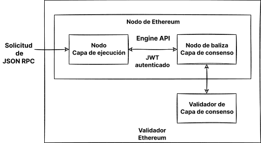

Ejecutar tu propio nodo te proporciona varios beneficios, abre nuevas posibilidades y ayuda a apoyar el ecosistema. Esta página te guiará para poner en marcha tu propio nodo y participar en la validación de transacciones de [Ethereum](/).

Ten en cuenta que después de [La Fusión](/roadmap/merge), se requieren dos clientes para ejecutar un nodo de Ethereum; un cliente de la **capa de ejecución (EL)** y un cliente de la **capa de consenso (CL)**. Esta página mostrará cómo instalar, configurar y conectar estos dos clientes para ejecutar un nodo de Ethereum.

## Requisitos previos {#prerequisites}

Deberías entender qué es un nodo de Ethereum y por qué podrías querer ejecutar un cliente. Esto se cubre en [Nodos y clientes](/developers/docs/nodes-and-clients/).

Si eres nuevo en el tema de ejecutar un nodo, o buscas un camino menos técnico, te recomendamos consultar primero nuestra introducción fácil de usar sobre [cómo ejecutar un nodo de Ethereum](/run-a-node).

## Elegir un enfoque {#choosing-approach}

El primer paso para poner en marcha tu nodo es elegir tu enfoque. Según los requisitos y las diversas posibilidades, debes seleccionar la implementación del cliente (tanto de los clientes de ejecución como de consenso), el entorno (hardware, sistema) y los parámetros para la configuración del cliente.

Esta página te guiará a través de estas decisiones y te ayudará a encontrar la forma más adecuada de ejecutar tu instancia de Ethereum.

Para elegir entre las implementaciones de clientes, consulta todos los [clientes de ejecución](/developers/docs/nodes-and-clients/#execution-clients) y [clientes de consenso](/developers/docs/nodes-and-clients/#consensus-clients) disponibles listos para la Red principal y aprende sobre la [diversidad de clientes](/developers/docs/nodes-and-clients/client-diversity).

Decide si ejecutar el software en tu propio [hardware o en la nube](#local-vs-cloud), teniendo en cuenta los [requisitos](#requirements) de los clientes.

Después de preparar el entorno, instala los clientes elegidos ya sea con una [interfaz amigable para principiantes](#automatized-setup) o [manualmente](#manual-setup) usando una terminal con opciones avanzadas.

Cuando el nodo esté en funcionamiento y sincronizando, estarás listo para [usarlo](#using-the-node), pero asegúrate de vigilar su [mantenimiento](#operating-the-node).



### Entorno y hardware {#environment-and-hardware}

#### Local o en la nube {#local-vs-cloud}

Los clientes de Ethereum pueden ejecutarse en computadoras de nivel de consumidor y no requieren ningún hardware especial, como máquinas de minería, por ejemplo. Por lo tanto, tienes varias opciones para desplegar el nodo según tus necesidades.
Para simplificar, pensemos en ejecutar un nodo tanto en una máquina física local como en un servidor en la nube:

- En la nube
  - Los proveedores ofrecen un alto tiempo de actividad del servidor y direcciones IP públicas estáticas
  - Obtener un servidor dedicado o virtual puede ser más cómodo que construir el tuyo propio
  - La desventaja es confiar en un tercero: el proveedor del servidor
  - Debido al tamaño de almacenamiento requerido para un nodo completo, el precio de un servidor alquilado podría ser alto
- Hardware propio
  - Un enfoque más soberano y sin necesidad de confianza
  - Inversión única
  - Una opción para comprar máquinas preconfiguradas
  - Tienes que preparar físicamente, mantener y potencialmente solucionar problemas de la máquina y la red

Ambas opciones tienen diferentes ventajas resumidas anteriormente. Si buscas una solución en la nube, además de muchos proveedores tradicionales de computación en la nube, también hay servicios enfocados en desplegar nodos. Consulta los [nodos como servicio](/developers/docs/nodes-and-clients/nodes-as-a-service/) para obtener más opciones sobre nodos alojados.

#### Hardware {#hardware}

Sin embargo, una red descentralizada y resistente a la censura no debería depender de proveedores en la nube. En su lugar, ejecutar tu nodo en tu propio hardware local es más saludable para el ecosistema. Las [estimaciones](https://www.ethernodes.org/networkType/cl/Hosting) muestran que una gran parte de los nodos se ejecutan en la nube, lo que podría convertirse en un único punto de fallo.

Los clientes de Ethereum pueden ejecutarse en tu computadora, computadora portátil, servidor o incluso en una computadora de placa única. Si bien es posible ejecutar clientes en tu computadora personal, tener una máquina dedicada solo para tu nodo puede mejorar significativamente su rendimiento y seguridad, al tiempo que minimiza el impacto en tu computadora principal.

Usar tu propio hardware puede ser muy fácil. Hay muchas opciones simples, así como configuraciones avanzadas para personas más técnicas. Así que veamos los requisitos y los medios para ejecutar clientes de Ethereum en tu máquina.

#### Requisitos {#requirements}

Los requisitos de hardware difieren según el cliente, pero generalmente no son tan altos, ya que el nodo solo necesita mantenerse sincronizado. No lo confundas con la minería, que requiere mucha más potencia de cálculo. Sin embargo, el tiempo de sincronización y el rendimiento mejoran con un hardware más potente.

Antes de instalar cualquier cliente, asegúrate de que tu computadora tenga suficientes recursos para ejecutarlo. Puedes encontrar los requisitos mínimos y recomendados a continuación.

El cuello de botella para tu hardware es principalmente el espacio en disco. Sincronizar la cadena de bloques de Ethereum es muy intensivo en entrada/salida y requiere mucho espacio. Lo mejor es tener una **unidad de estado sólido (SSD)** con cientos de GB de espacio libre de sobra incluso después de la sincronización.

El tamaño de la base de datos y la velocidad de la sincronización inicial dependen del cliente elegido, su configuración y la [estrategia de sincronización](/developers/docs/nodes-and-clients/#sync-modes).

También asegúrate de que tu conexión a Internet no esté limitada por un [límite de ancho de banda](https://wikipedia.org/wiki/Data_cap). Se recomienda usar una conexión no medida, ya que la sincronización inicial y los datos transmitidos a la red podrían exceder tu límite.

##### Sistema operativo {#plug-and-play}

Todos los clientes son compatibles con los principales sistemas operativos: Linux, macOS, Windows. Esto significa que puedes ejecutar nodos en máquinas de escritorio o servidores normales con el sistema operativo (SO) que mejor se adapte a ti. Asegúrate de que tu SO esté actualizado para evitar posibles problemas y vulnerabilidades de seguridad.

##### Requisitos mínimos {#ethereum-on-a-single-board-computer}

- CPU con 2 o más núcleos
- 8 GB de RAM
- SSD de 2 TB
- Ancho de banda de 10+ MBit/s

##### Especificaciones recomendadas {#spinning-up-node}

- CPU rápida con 4 o más núcleos
- 16 GB o más de RAM
- SSD rápido con 2 o más TB
- Ancho de banda de 25+ MBit/s

El modo de sincronización y el cliente que elijas afectarán los requisitos de espacio, pero hemos estimado el espacio en disco que necesitarás para cada cliente a continuación.

| Cliente    | Tamaño en disco (sincronización rápida) | Tamaño en disco (archivo completo) |
| ---------- | --------------------------------------- | ---------------------------------- |
| Besu       | 800 GB+                                 | 12 TB+                             |
| Erigon     | N/A                                     | 2.5 TB+                            |
| Geth       | 500 GB+                                 | 12 TB+                             |
| Nethermind | 500 GB+                                 | 12 TB+                             |
| Reth       | N/A                                     | 2.2 TB+                            |

- Nota: Erigon y Reth no ofrecen sincronización rápida (snap sync), pero es posible la poda completa (~2 TB para Erigon, ~1.2 TB para Reth)

Para los clientes de consenso, el requisito de espacio también depende de la implementación del cliente y las características habilitadas (por ejemplo, el penalizador del validador), pero generalmente cuenta con otros 200 GB necesarios para los datos de la baliza. Con un gran número de validadores, la carga de ancho de banda también crece. Puedes encontrar [detalles sobre los requisitos del cliente de consenso en este análisis](https://mirror.xyz/0x934e6B4D7eee305F8C9C42b46D6EEA09CcFd5EDc/b69LBy8p5UhcGJqUAmT22dpvdkU-Pulg2inrhoS9Mbc).

#### Soluciones plug-and-play {#automatized-setup}

La opción más fácil para ejecutar un nodo con tu propio hardware es usar cajas *plug-and-play* (conectar y usar). Las máquinas preconfiguradas de los proveedores ofrecen la experiencia más sencilla: pedir, conectar, ejecutar. Todo está preconfigurado y se ejecuta automáticamente con una guía intuitiva y un panel de control para monitorear y controlar el software.

- [DAppNode](https://dappnode.io/)
- [Avado](https://ava.do/)

#### Ethereum en una computadora de placa única {#manual-setup}

Una forma fácil y barata de ejecutar un nodo de Ethereum es usar una computadora de placa única, incluso con una arquitectura ARM como la Raspberry Pi. [Ethereum on ARM](https://ethereum-on-arm-documentation.readthedocs.io/en/latest/) proporciona imágenes fáciles de ejecutar de múltiples clientes de ejecución y consenso para Raspberry Pi y otras placas ARM.

Dispositivos pequeños, asequibles y eficientes como estos son ideales para ejecutar un nodo en casa, pero ten en cuenta su rendimiento limitado.

## Poner en marcha el nodo {#getting-the-client}

La configuración real del cliente se puede hacer con lanzadores automatizados o manualmente, configurando el software del cliente directamente.

Para los usuarios menos avanzados, el enfoque recomendado es usar un lanzador, un software que te guía a través de la instalación y automatiza el proceso de configuración del cliente. Sin embargo, si tienes algo de experiencia usando una terminal, los pasos para la configuración manual deberían ser fáciles de seguir.

### Configuración guiada {#client-setup}

Múltiples proyectos fáciles de usar tienen como objetivo mejorar la experiencia de configurar un cliente. Estos lanzadores proporcionan instalación y configuración automática del cliente, y algunos incluso ofrecen una interfaz gráfica para la configuración guiada y el monitoreo de los clientes.

A continuación se muestran algunos proyectos que pueden ayudarte a instalar y controlar clientes con solo unos pocos clics:

- [DAppNode](https://docs.dappnode.io/docs/user/getting-started/choose-your-path): DAppNode no solo viene con una máquina de un proveedor. El software, el lanzador de nodos real y el centro de control con muchas características se pueden usar en hardware arbitrario.
- [EthPillar](https://www.coincashew.com/coins/overview-eth/ethpillar): La forma más rápida y fácil de configurar un nodo completo. Herramienta de configuración de una sola línea y TUI de gestión de nodos. Gratis. Código abierto. Bienes públicos para Ethereum por parte de quienes hacen staking en solitario. Soporte para ARM64 y AMD64.
- [eth-docker](https://eth-docker.net/): Configuración automatizada usando Docker enfocada en un staking fácil y seguro, requiere conocimientos básicos de terminal y Docker, recomendado para usuarios un poco más avanzados.
- [Stereum](https://stereum-dev.github.io/ethereum-node-web-docs): Lanzador para instalar clientes en un servidor remoto a través de una conexión SSH con una guía de configuración GUI, centro de control y muchas otras características.
- [Sedge](https://docs.sedge.nethermind.io/docs/intro): Herramienta de configuración de nodos que genera automáticamente una configuración de Docker usando un asistente CLI. Escrito en Go por Nethermind.
- [Chainstack Self-Hosted](https://docs.chainstack.com/docs/self-hosted/introduction): Interfaz de usuario web y CLI para desplegar clientes de ejecución y consenso en Kubernetes. Incluye arranque de instantáneas y monitoreo integrado. Gratis. No se requiere cuenta de Chainstack. Creado por Chainstack.

### Configuración manual de clientes {#starting-the-execution-client}

La otra opción es descargar, verificar y configurar el software del cliente manualmente. Incluso si algunos clientes ofrecen una interfaz gráfica, una configuración manual todavía requiere habilidades básicas con la terminal, pero ofrece mucha más versatilidad.

Como se explicó anteriormente, configurar tu propio nodo de Ethereum requerirá ejecutar un par de clientes de consenso y ejecución. Algunos clientes pueden incluir un cliente ligero del otro tipo y sincronizarse sin necesidad de ningún otro software. Sin embargo, la verificación completa sin necesidad de confianza requiere ambas implementaciones.

#### Obtener el software del cliente {#running-an-execution-client}

Primero, necesitas obtener el software de tu [cliente de ejecución](/developers/docs/nodes-and-clients/#execution-clients) y [cliente de consenso](/developers/docs/nodes-and-clients/#consensus-clients) preferido.

Simplemente puedes descargar una aplicación ejecutable o un paquete de instalación que se adapte a tu sistema operativo y arquitectura. Verifica siempre las firmas y las sumas de comprobación de los paquetes descargados. Algunos clientes también ofrecen repositorios o imágenes de Docker para facilitar la instalación y las actualizaciones. Todos los clientes son de código abierto, por lo que también puedes compilarlos desde el código fuente. Este es un método más avanzado, pero en algunos casos, podría ser necesario.

Las instrucciones para instalar cada cliente se proporcionan en la documentación enlazada en las listas de clientes anteriores.

Aquí están las páginas de lanzamiento de los clientes donde puedes encontrar sus binarios precompilados o instrucciones de instalación:

##### Clientes de ejecución {#starting-the-consensus-client}

- [Besu](https://github.com/hyperledger/besu/releases)
- [Erigon](https://github.com/ledgerwatch/erigon/releases)
- [Geth](https://geth.ethereum.org/downloads)
- [Nethermind](https://downloads.nethermind.io/)
- [Reth](https://reth.rs/installation/installation.html)

También vale la pena señalar que la diversidad de clientes es un [problema en la capa de ejecución](/developers/docs/nodes-and-clients/client-diversity/#execution-layer). Se recomienda que los lectores consideren ejecutar un cliente de ejecución minoritario.

##### Clientes de consenso {#running-a-consensus-client}

- [Lighthouse](https://github.com/sigp/lighthouse/releases/latest)
- [Lodestar](https://chainsafe.github.io/lodestar/run/getting-started/installation#build-from-source/) (No proporciona un binario precompilado, solo una imagen de Docker o para ser compilado desde el código fuente)
- [Nimbus](https://github.com/status-im/nimbus-eth2/releases/latest)
- [Prysm](https://github.com/prysmaticlabs/prysm/releases/latest)
- [Teku](https://github.com/ConsenSys/teku/releases)

La [diversidad de clientes](/developers/docs/nodes-and-clients/client-diversity/) es fundamental para los nodos de consenso que ejecutan validadores. Si la mayoría de los validadores ejecutan una sola implementación de cliente, la seguridad de la red está en riesgo. Por lo tanto, se recomienda considerar la elección de un cliente minoritario.

[Consulta el uso más reciente de clientes en la red](https://clientdiversity.org/) y aprende más sobre la [diversidad de clientes](/developers/docs/nodes-and-clients/client-diversity).

##### Verificar el software {#adding-validators}

Al descargar software de Internet, se recomienda verificar su integridad. Este paso es opcional, pero especialmente con una pieza de infraestructura crucial como el cliente de Ethereum, es importante ser consciente de los posibles vectores de ataque y evitarlos. Si descargaste un binario precompilado, debes confiar en él y arriesgarte a que un atacante pueda cambiar el ejecutable por uno malicioso.

Los desarrolladores firman los binarios publicados con sus claves PGP para que puedas verificar criptográficamente que estás ejecutando exactamente el software que crearon. Solo necesitas obtener las claves públicas utilizadas por los desarrolladores, que se pueden encontrar en las páginas de lanzamiento del cliente o en la documentación. Después de descargar la versión del cliente y su firma, puedes usar una implementación de PGP, por ejemplo, [GnuPG](https://gnupg.org/download/index.html) para verificarlos fácilmente. Consulta un tutorial sobre cómo verificar software de código abierto usando `gpg` en [Linux](https://www.tecmint.com/verify-pgp-signature-downloaded-software/) o [Windows/macOS](https://freedom.press/training/verifying-open-source-software/).

Otra forma de verificación es asegurarse de que el hash, una huella criptográfica única, del software que descargaste coincida con el proporcionado por los desarrolladores. Esto es incluso más fácil que usar PGP, y algunos clientes solo ofrecen esta opción. Simplemente ejecuta la función hash en el software descargado y compáralo con el de la página de lanzamiento. Por ejemplo:

```sh
sha256sum teku-22.6.1.tar.gz

9b2f8c1f8d4dab0404ce70ea314ff4b3c77e9d27aff9d1e4c1933a5439767dde
```

#### Configuración del cliente {#using-the-node}

Después de instalar, descargar o compilar el software del cliente, estás listo para ejecutarlo. Esto solo significa que debe ejecutarse con la configuración adecuada. Los clientes ofrecen ricas opciones de configuración, que pueden habilitar varias características.

Comencemos con las opciones que pueden influir significativamente en el rendimiento del cliente y el uso de datos. Los [modos de sincronización](/developers/docs/nodes-and-clients/#sync-modes) representan diferentes métodos para descargar y validar los datos de la cadena de bloques. Antes de iniciar el nodo, debes decidir qué red y modo de sincronización usar. Las cosas más importantes a considerar son el espacio en disco y el tiempo de sincronización que necesitará el cliente. Presta atención a la documentación del cliente para determinar qué modo de sincronización es el predeterminado. Si eso no se adapta a ti, elige otro según el nivel de seguridad, los datos disponibles y el costo. Aparte del algoritmo de sincronización, también puedes configurar la poda de diferentes tipos de datos antiguos. La poda permite eliminar datos obsoletos, es decir, eliminar nodos del trie de estado que son inalcanzables desde bloques recientes.

Otras opciones de configuración básicas son, por ejemplo, elegir una red (Red principal o redes de prueba), habilitar el punto de conexión HTTP para RPC o WebSockets, etc. Puedes encontrar todas las características y opciones en la documentación del cliente. Varias configuraciones del cliente se pueden establecer ejecutando el cliente con las banderas correspondientes directamente en la CLI o en el archivo de configuración. Cada cliente es un poco diferente; por favor, consulta siempre su documentación oficial o página de ayuda para obtener detalles sobre las opciones de configuración.

Para fines de prueba, es posible que prefieras ejecutar un cliente en una de las redes de prueba. [Consulta la descripción general de las redes compatibles](/developers/docs/nodes-and-clients/#execution-clients).

En la siguiente sección se pueden encontrar ejemplos de ejecución de clientes de ejecución con configuración básica.

#### Iniciar el cliente de ejecución {#reaching-rpc}

Antes de iniciar el software del cliente de Ethereum, realiza una última comprobación de que tu entorno está listo. Por ejemplo, asegúrate de que:

- Haya suficiente espacio en disco considerando la red y el modo de sincronización elegidos.
- La memoria y la CPU no estén detenidas por otros programas.
- El sistema operativo esté actualizado a la última versión.
- El sistema tenga la hora y fecha correctas.
- Tu enrutador y cortafuegos acepten conexiones en los puertos de escucha. Por defecto, los clientes de Ethereum usan un puerto de escucha (TCP) y un puerto de descubrimiento (UDP), ambos en el 30303 por defecto.

Ejecuta tu cliente en una red de prueba primero para ayudar a asegurarte de que todo funciona correctamente.

Necesitas declarar cualquier configuración del cliente que no sea la predeterminada al inicio. Puedes usar banderas o el archivo de configuración para declarar tu configuración preferida. El conjunto de características y la sintaxis de configuración de cada cliente difieren. Consulta la documentación de tu cliente para conocer los detalles.

Los clientes de ejecución y consenso se comunican a través de un punto de conexión autenticado especificado en la [API del motor (Engine API)](https://github.com/ethereum/execution-apis/tree/main/src/engine). Para conectarse a un cliente de consenso, el cliente de ejecución debe generar un [`jwtsecret`](https://jwt.io/) en una ruta conocida. Por razones de seguridad y estabilidad, los clientes deben ejecutarse en la misma máquina, y ambos clientes deben conocer esta ruta, ya que se utiliza para autenticar una conexión RPC local entre ellos. El cliente de ejecución también debe definir un puerto de escucha para las API autenticadas.

Este token es generado automáticamente por el software del cliente, pero en algunos casos, es posible que debas hacerlo tú mismo. Puedes generarlo usando [OpenSSL](https://www.openssl.org/):

```sh
openssl rand -hex 32 > jwtsecret
```

#### Ejecutar un cliente de ejecución {#operating-the-node}

Esta sección te guiará a través del inicio de los clientes de ejecución. Solo sirve como ejemplo de una configuración básica, que iniciará el cliente con estos ajustes:

- Especifica la red a la que conectarse, la Red principal en nuestros ejemplos
  - En su lugar, puedes elegir [una de las redes de prueba](/developers/docs/networks/) para realizar pruebas preliminares de tu configuración
- Define el directorio de datos, donde se almacenarán todos los datos, incluida la cadena de bloques
  - Asegúrate de sustituir la ruta por una real, por ejemplo, apuntando a tu unidad externa
- Habilita interfaces para comunicarse con el cliente
  - Incluyendo JSON-RPC y la API del motor para la comunicación con el cliente de consenso
- Define la ruta a `jwtsecret` para la API autenticada
  - Asegúrate de sustituir la ruta de ejemplo por una real a la que puedan acceder los clientes, por ejemplo, `/tmp/jwtsecret`

Ten en cuenta que este es solo un ejemplo básico, todos los demás ajustes se establecerán en sus valores predeterminados. Presta atención a la documentación de cada cliente para conocer los valores predeterminados, la configuración y las características. Para obtener más características, por ejemplo, para ejecutar validadores, monitoreo, etc., consulta la documentación del cliente específico.

> Ten en cuenta que las barras invertidas `\` en los ejemplos son solo para fines de formato; las banderas de configuración se pueden definir en una sola línea.

##### Ejecutar Besu {#keeping-node-online}

Este ejemplo inicia Besu en la Red principal, almacena los datos de la cadena de bloques en el formato predeterminado en `/data/ethereum`, habilita JSON-RPC y Engine RPC para conectar el cliente de consenso. La API del motor se autentica con el token `jwtsecret` y solo se permiten llamadas desde `localhost`.

```sh
besu --network=mainnet \
    --data-path=/data/ethereum \
    --rpc-http-enabled=true \
    --engine-rpc-enabled=true \
    --engine-host-allowlist="*" \
    --engine-jwt-enabled=true \
    --engine-jwt-secret=/path/to/jwtsecret
```

Besu también viene con una opción de lanzador que hará una serie de preguntas y generará el archivo de configuración. Ejecuta el lanzador interactivo usando:

```sh
besu --Xlauncher
```

La [documentación de Besu](https://besu.hyperledger.org/public-networks/get-started/start-node/) contiene opciones adicionales y detalles de configuración.

##### Ejecutar Erigon {#creating-client-services}

Este ejemplo inicia Erigon en la Red principal, almacena los datos de la cadena de bloques en `/data/ethereum`, habilita JSON-RPC, define qué espacios de nombres están permitidos y habilita la autenticación para conectar el cliente de consenso que está definido por la ruta `jwtsecret`.

```sh
erigon --chain mainnet \
    --datadir /data/ethereum  \
    --http --http.api=engine,eth,web3,net \
    --authrpc.jwtsecret=/path/to/jwtsecret
```

Erigon por defecto realiza una sincronización completa con 8 GB de HDD, lo que resultará en más de 2 TB de datos de archivo. Asegúrate de que `datadir` apunte a un disco con suficiente espacio libre o investiga la bandera `--prune` que puede recortar diferentes tipos de datos. Consulta el `--help` de Erigon para obtener más información.

##### Ejecutar Geth {#updating-clients}

Este ejemplo inicia Geth en la Red principal, almacena los datos de la cadena de bloques en `/data/ethereum`, habilita JSON-RPC y define qué espacios de nombres están permitidos. También habilita la autenticación para conectar el cliente de consenso, lo que requiere la ruta a `jwtsecret` y también la opción que define qué conexiones están permitidas, en nuestro ejemplo solo desde `localhost`.

```sh
geth --mainnet \
    --datadir "/data/ethereum" \
    --http --authrpc.addr localhost \
    --authrpc.vhosts="localhost" \
    --authrpc.port 8551
    --authrpc.jwtsecret=/path/to/jwtsecret
```

Consulta la [documentación para ver todas las opciones de configuración](https://geth.ethereum.org/docs/fundamentals/command-line-options) y aprende más sobre cómo [ejecutar Geth con un cliente de consenso](https://geth.ethereum.org/docs/getting-started/consensus-clients).

##### Ejecutar Nethermind {#running-additional-services}

Nethermind ofrece varias [opciones de instalación](https://docs.nethermind.io/get-started/installing-nethermind). El paquete viene con varios binarios, incluido un lanzador con una configuración guiada, que te ayudará a crear la configuración de forma interactiva. Alternativamente, encontrarás Runner, que es el ejecutable en sí y puedes simplemente ejecutarlo con banderas de configuración. JSON-RPC está habilitado por defecto.

```sh
Nethermind.Runner --config mainnet \
    --datadir /data/ethereum \
    --JsonRpc.JwtSecretFile=/path/to/jwtsecret
```

La documentación de Nethermind ofrece una [guía completa](https://docs.nethermind.io/get-started/running-node/) sobre cómo ejecutar Nethermind con un cliente de consenso.

Un cliente de ejecución iniciará sus funciones principales, los puntos de conexión elegidos y comenzará a buscar pares. Después de descubrir pares con éxito, el cliente inicia la sincronización. El cliente de ejecución esperará una conexión del cliente de consenso. Los datos actuales de la cadena de bloques estarán disponibles una vez que el cliente se sincronice con éxito con el estado actual.

##### Ejecutar Reth {#monitoring-the-node}

Este ejemplo inicia Reth en la Red principal, usando la ubicación de datos predeterminada. Habilita la autenticación JSON-RPC y Engine RPC para conectar el cliente de consenso que está definido por la ruta `jwtsecret`, y solo se permiten llamadas desde `localhost`.

```sh
reth node \
    --authrpc.jwtsecret /path/to/jwtsecret \
    --authrpc.addr 127.0.0.1 \
    --authrpc.port 8551
```

Consulta [Configuración de Reth](https://reth.rs/run/config.html?highlight=data%20directory#configuring-reth) para obtener más información sobre los directorios de datos predeterminados. La [documentación de Reth](https://reth.rs/run/mainnet.html) contiene opciones adicionales y detalles de configuración.

#### Iniciar el cliente de consenso {#further-reading}

El cliente de consenso debe iniciarse con la configuración de puerto correcta para establecer una conexión RPC local con el cliente de ejecución. Los clientes de consenso deben ejecutarse con el puerto expuesto del cliente de ejecución como argumento de configuración.

El cliente de consenso también necesita la ruta al `jwt-secret` del cliente de ejecución para autenticar la conexión RPC entre ellos. De manera similar a los ejemplos de ejecución anteriores, cada cliente de consenso tiene una bandera de configuración que toma la ruta del archivo del token jwt como argumento. Esto debe ser consistente con la ruta `jwtsecret` proporcionada al cliente de ejecución.

Si planeas ejecutar un validador, asegúrate de agregar una bandera de configuración que especifique la dirección de Ethereum del destinatario de la tarifa. Aquí es donde se acumulan las recompensas de ether para tu validador. Cada cliente de consenso tiene una opción, por ejemplo, `--suggested-fee-recipient=0xabcd1`, que toma una dirección de Ethereum como argumento.

Al iniciar un nodo baliza en una red de prueba, puedes ahorrar un tiempo de sincronización significativo utilizando un punto de conexión público para la [sincronización de punto de control](https://notes.ethereum.org/@launchpad/checkpoint-sync).

#### Ejecutar un cliente de consenso {#related-topics}

##### Ejecutar Lighthouse

Antes de ejecutar Lighthouse, aprende más sobre cómo instalarlo y configurarlo en el [Libro de Lighthouse](https://lighthouse-book.sigmaprime.io/installation.html).

```sh
lighthouse beacon_node \
    --network mainnet \
    --datadir /data/ethereum \
    --http \
    --execution-endpoint http://127.0.0.1:8551 \
    --execution-jwt /path/to/jwtsecret
```

##### Ejecutar Lodestar

Instala el software de Lodestar compilándolo o descargando la imagen de Docker. Aprende más en la [documentación](https://chainsafe.github.io/lodestar/) y en la [guía de configuración](https://hackmd.io/@philknows/rk5cDvKmK) más completa.

```sh
lodestar beacon \
    --dataDir="/data/ethereum" \
    --network=mainnet \
    --eth1.enabled=true \
    --execution.urls="http://127.0.0.1:8551" \
    --jwt-secret="/path/to/jwtsecret"
```

##### Ejecutar Nimbus

Nimbus viene con clientes tanto de consenso como de ejecución. Se puede ejecutar en varios dispositivos incluso con una potencia de cálculo muy modesta.
Después de [instalar las dependencias y el propio Nimbus](https://nimbus.guide/quick-start.html), puedes ejecutar su cliente de consenso:

```sh
nimbus_beacon_node \
    --network=mainnet \
    --web3-url=http://127.0.0.1:8551 \
    --rest \
    --jwt-secret="/path/to/jwtsecret"
```

##### Ejecutar Prysm

Prysm viene con un script que permite una fácil instalación automática. Los detalles se pueden encontrar en la [documentación de Prysm](https://prysm.offchainlabs.com/docs/install-prysm/install-with-script/).

```sh
./prysm.sh beacon-chain \
    --mainnet \
    --datadir /data/ethereum  \
    --execution-endpoint=http://localhost:8551  \
    --jwt-secret=/path/to/jwtsecret
```

##### Ejecutar Teku

```sh
teku --network mainnet \
    --data-path "/data/ethereum" \
    --ee-endpoint http://localhost:8551 \
    --ee-jwt-secret-file "/path/to/jwtsecret"
```

Cuando un cliente de consenso se conecta al cliente de ejecución para leer el contrato de depósito e identificar validadores, también se conecta a otros pares de nodos baliza y comienza a sincronizar las ranuras de consenso desde el bloque génesis. Una vez que el nodo baliza alcanza la época actual, la API de la baliza se vuelve utilizable para tus validadores. Aprende más sobre las [API del nodo baliza](https://eth2docs.vercel.app/).

### Agregar validadores

Un cliente de consenso sirve como un nodo baliza para que los validadores se conecten. Cada cliente de consenso tiene su propio software de validador descrito en detalle en su respectiva documentación.

Ejecutar tu propio validador permite el [staking en solitario](/staking/solo/), el método más impactante y sin necesidad de confianza para apoyar la red Ethereum. Sin embargo, esto requiere un depósito de 32 ETH. Para ejecutar un validador en tu propio nodo con una cantidad menor, podría interesarte un grupo descentralizado con operadores de nodos sin permisos, como [Rocket Pool](https://rocketpool.net/node-operators).

La forma más fácil de comenzar con el staking y la generación de claves de validador es usar el [Launchpad de Staking de la red de prueba Hoodi](https://hoodi.launchpad.ethereum.org/), que te permite probar tu configuración [ejecutando nodos en Hoodi](https://notes.ethereum.org/@launchpad/hoodi). Cuando estés listo para la Red principal, puedes repetir estos pasos usando el [Launchpad de Staking de la Red principal](https://launchpad.ethereum.org/).

Consulta la [página de staking](/staking) para obtener una descripción general de las opciones de staking.

### Usar el nodo

Los clientes de ejecución ofrecen [puntos de conexión de la API RPC](/developers/docs/apis/json-rpc/) que puedes usar para enviar transacciones, interactuar con o desplegar contratos inteligentes en la red Ethereum de varias maneras:

- Llamándolos manualmente con un protocolo adecuado (por ejemplo, usando `curl`)
- Adjuntando una consola proporcionada (por ejemplo, `geth attach`)
- Implementándolos en aplicaciones usando bibliotecas Web3, por ejemplo, [Web3.py](https://web3py.readthedocs.io/en/stable/overview.html#overview), [ethers](https://github.com/ethers-io/ethers.js/)

Diferentes clientes tienen diferentes implementaciones de los puntos de conexión RPC. Pero hay un JSON-RPC estándar que puedes usar con cada cliente. Para obtener una descripción general, [lee la documentación de JSON-RPC](/developers/docs/apis/json-rpc/). Las aplicaciones que necesitan información de la red Ethereum pueden usar este RPC. Por ejemplo, la popular billetera MetaMask te permite [conectarte a tu propio punto de conexión RPC](https://metamask.zendesk.com/hc/en-us/articles/360015290012-Using-a-Local-Node), lo que tiene grandes beneficios de privacidad y seguridad.

Todos los clientes de consenso exponen una [API de baliza](https://ethereum.github.io/beacon-APIs) que se puede usar para verificar el estado del cliente de consenso o descargar bloques y datos de consenso enviando solicitudes usando herramientas como [Curl](https://curl.se). Se puede encontrar más información sobre esto en la documentación de cada cliente de consenso.

#### Acceder al RPC

El puerto predeterminado para el JSON-RPC del cliente de ejecución es `8545`, pero puedes modificar los puertos de los puntos de conexión locales en la configuración. Por defecto, la interfaz RPC solo es accesible en el localhost de tu computadora. Para hacerla accesible de forma remota, es posible que desees exponerla al público cambiando la dirección a `0.0.0.0`. Esto la hará accesible a través de la red local y las direcciones IP públicas. En la mayoría de los casos, también necesitarás configurar el reenvío de puertos en tu enrutador.

Aborda la exposición de puertos a Internet con precaución, ya que esto permitirá que cualquier persona en Internet controle tu nodo. Los actores maliciosos podrían acceder a tu nodo para derribar tu sistema o robar tus fondos si estás usando tu cliente como una billetera.

Una forma de evitar esto es evitar que los métodos RPC potencialmente dañinos sean modificables. Por ejemplo, con Geth, puedes declarar métodos modificables con una bandera: `--http.api web3,eth,txpool`.

El acceso a la interfaz RPC se puede extender a través del desarrollo de API de capa perimetral o aplicaciones de servidor web, como Nginx, y conectándolas a la dirección y puerto locales de tu cliente. Aprovechar una capa intermedia también puede permitir a los desarrolladores la capacidad de configurar un certificado para conexiones `https` seguras a la interfaz RPC.

Configurar un servidor web, un proxy o una API Rest orientada al exterior no es la única forma de proporcionar acceso al punto de conexión RPC de tu nodo. Otra forma de preservar la privacidad para configurar un punto de conexión accesible públicamente es alojar el nodo en tu propio servicio onion de [Tor](https://www.torproject.org/). Esto te permitirá acceder al RPC fuera de tu red local sin una dirección IP pública estática o puertos abiertos. Sin embargo, el uso de esta configuración solo puede permitir que el punto de conexión RPC sea accesible a través de la red Tor, lo cual no es compatible con todas las aplicaciones y podría resultar en problemas de conexión.

Para hacer esto, tienes que crear tu propio [servicio onion](https://community.torproject.org/onion-services/). Consulta [la documentación](https://community.torproject.org/onion-services/setup/) sobre la configuración del servicio onion para alojar el tuyo propio. Puedes apuntarlo a un servidor web con proxy al puerto RPC o simplemente directamente al RPC.

Por último, y una de las formas más populares de proporcionar acceso a redes internas es a través de una conexión VPN. Dependiendo de tu caso de uso y la cantidad de usuarios que necesiten acceso a tu nodo, una conexión VPN segura podría ser una opción. [OpenVPN](https://openvpn.net/) es una VPN SSL con todas las funciones que implementa una extensión de red segura de capa 2 o 3 de OSI utilizando el protocolo SSL/TLS estándar de la industria, admite métodos flexibles de autenticación de clientes basados en certificados, tarjetas inteligentes y/o credenciales de nombre de usuario/contraseña, y permite políticas de control de acceso específicas de usuario o grupo utilizando reglas de cortafuegos aplicadas a la interfaz virtual de la VPN.

### Operar el nodo

Debes monitorear regularmente tu nodo para asegurarte de que funciona correctamente. Es posible que debas realizar un mantenimiento ocasional.

#### Mantener un nodo en línea

Tu nodo no tiene que estar en línea todo el tiempo, pero debes mantenerlo en línea tanto como sea posible para mantenerlo sincronizado con la red. Puedes apagarlo para reiniciarlo, pero ten en cuenta que:

- El apagado puede tardar unos minutos si el estado reciente todavía se está escribiendo en el disco.
- Los apagados forzados pueden dañar la base de datos, lo que requerirá que vuelvas a sincronizar todo el nodo.
- Tu cliente se desincronizará de la red y necesitará volver a sincronizarse cuando lo reinicies. Si bien el nodo puede comenzar a sincronizarse desde donde se apagó por última vez, el proceso puede llevar tiempo dependiendo de cuánto tiempo haya estado fuera de línea.

_Esto no se aplica a los nodos validadores de la capa de consenso._ Desconectar tu nodo afectará a todos los servicios que dependan de él. Si estás ejecutando un nodo con fines de _staking_, debes intentar minimizar el tiempo de inactividad tanto como sea posible.

#### Crear servicios de cliente

Considera crear un servicio para ejecutar tus clientes automáticamente al inicio. Por ejemplo, en servidores Linux, una buena práctica sería crear un servicio, por ejemplo, con `systemd`, que ejecute el cliente con la configuración adecuada, bajo un usuario con privilegios limitados y se reinicie automáticamente.

#### Actualizar clientes

Necesitas mantener el software de tu cliente actualizado con los últimos parches de seguridad, características y [EIP](/eips/). Especialmente antes de las [bifurcaciones fuertes (hard forks)](/ethereum-forks/), asegúrate de estar ejecutando las versiones correctas del cliente.

> Antes de actualizaciones importantes de la red, la Fundación Ethereum (EF) publica una entrada en su [blog](https://blog.ethereum.org). Puedes [suscribirte a estos anuncios](https://blog.ethereum.org/category/protocol#subscribe) para recibir una notificación en tu correo cuando tu nodo necesite una actualización.

Actualizar los clientes es muy simple. Cada cliente tiene instrucciones específicas en su documentación, pero el proceso generalmente es solo descargar la última versión y reiniciar el cliente con el nuevo ejecutable. El cliente debería continuar donde lo dejó, pero con las actualizaciones aplicadas.

Cada implementación de cliente tiene una cadena de versión legible por humanos que se usa en el protocolo entre pares, pero también es accesible desde la línea de comandos. Esta cadena de versión permite a los usuarios comprobar que están ejecutando la versión correcta y permite a los exploradores de bloques y otras herramientas analíticas interesadas cuantificar la distribución de clientes específicos en la red. Consulta la documentación individual del cliente para obtener más información sobre las cadenas de versión.

#### Ejecutar servicios adicionales

Ejecutar tu propio nodo te permite usar servicios que requieren acceso directo al RPC del cliente de Ethereum. Estos son servicios construidos sobre Ethereum como [soluciones de capa 2 (l2)](/developers/docs/scaling/#layer-2-scaling), backend para billeteras, exploradores de bloques, herramientas para desarrolladores y otra infraestructura de Ethereum.

#### Monitorear el nodo

Para monitorear adecuadamente tu nodo, considera recopilar métricas. Los clientes proporcionan puntos de conexión de métricas para que puedas obtener datos completos sobre tu nodo. Usa herramientas como [InfluxDB](https://www.influxdata.com/get-influxdb/) o [Prometheus](https://prometheus.io/) para crear bases de datos que puedes convertir en visualizaciones y gráficos en software como [Grafana](https://grafana.com/). Hay muchas configuraciones para usar este software y diferentes paneles de Grafana para que visualices tu nodo y la red en su conjunto. Por ejemplo, consulta el [tutorial sobre el monitoreo de Geth](/developers/tutorials/monitoring-geth-with-influxdb-and-grafana/).

Como parte de tu monitoreo, asegúrate de vigilar el rendimiento de tu máquina. Durante la sincronización inicial de tu nodo, el software del cliente puede ser muy pesado para la CPU y la RAM. Además de Grafana, puedes usar las herramientas que ofrece tu SO como `htop` o `uptime` para hacer esto.

## Lecturas adicionales

- [Guías de staking de Ethereum](https://github.com/SomerEsat/ethereum-staking-guides): _Somer Esat, actualizado con frecuencia_
- [Guía | Cómo configurar un validador para el staking de Ethereum en la red principal](https://www.coincashew.com/coins/overview-eth/guide-or-how-to-setup-a-validator-on-eth2-mainnet) _– CoinCashew, actualizado con frecuencia_
- [Guías de EthStaker sobre la ejecución de validadores en redes de prueba](https://github.com/remyroy/ethstaker#guides) – _EthStaker, actualizado regularmente_
- [Aplicación de muestra AWS Blockchain Node Runner para nodos de Ethereum](https://aws-samples.github.io/aws-blockchain-node-runners/docs/Blueprints/Ethereum): _AWS, actualizado con frecuencia_
- [Preguntas frecuentes sobre La Fusión para operadores de nodos](https://notes.ethereum.org/@launchpad/node-faq-merge): _julio de 2022_
- [Análisis de los requisitos de hardware para ser un nodo validado completo de Ethereum](https://medium.com/coinmonks/analyzing-the-hardware-requirements-to-be-an-ethereum-full-validated-node-dc064f167902) _– Albert Palau, 24 de septiembre de 2018_
- [Ejecución de nodos completos de Ethereum: una guía para los apenas motivados](https://medium.com/@JustinMLeroux/running-ethereum-full-nodes-a-guide-for-the-barely-motivated-a8a13e7a0d31) _– Justin Leroux, 7 de noviembre de 2019_
- [Ejecución de un nodo Hyperledger Besu en la red principal de Ethereum: beneficios, requisitos y configuración](https://pegasys.tech/running-a-hyperledger-besu-node-on-the-ethereum-mainnet-benefits-requirements-and-setup/) _– Felipe Faraggi, 7 de mayo de 2020_
- [Despliegue del cliente de Ethereum Nethermind con pila de monitoreo](https://medium.com/nethermind-eth/deploying-nethermind-ethereum-client-with-monitoring-stack-55ce1622edbd) _– Nethermind.eth, 8 de julio de 2020_

## Temas relacionados

- [Nodos y clientes](/developers/docs/nodes-and-clients/)
- [Bloques](/developers/docs/blocks/)
- [Redes](/developers/docs/networks/)