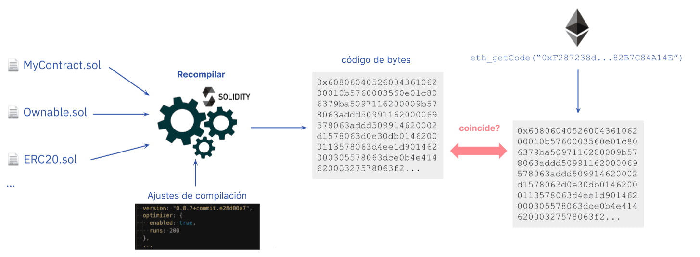

Los [contratos inteligentes](/developers/docs/smart-contracts/) están diseñados para ser "sin necesidad de confianza", lo que significa que los usuarios no deberían tener que confiar en terceros (por ejemplo, desarrolladores y empresas) antes de interactuar con un contrato. Como requisito para la ausencia de necesidad de confianza, los usuarios y otros desarrolladores deben poder verificar el código fuente de un contrato inteligente. La verificación del código fuente asegura a los usuarios y desarrolladores que el código del contrato publicado es el mismo código que se ejecuta en la dirección del contrato en la cadena de bloques de Ethereum.

Es importante hacer la distinción entre la "verificación del código fuente" y la "[verificación formal](/developers/docs/smart-contracts/formal-verification/)". La verificación del código fuente, que se explicará en detalle a continuación, se refiere a verificar que el código fuente dado de un contrato inteligente en un lenguaje de alto nivel (por ejemplo, Solidity) se compila en el mismo código de bytes que se ejecutará en la dirección del contrato. Sin embargo, la verificación formal describe la verificación de la corrección de un contrato inteligente, lo que significa que el contrato se comporta como se espera. Aunque depende del contexto, la verificación de contratos generalmente se refiere a la verificación del código fuente.

## ¿Qué es la verificación del código fuente? {#what-is-source-code-verification}

Antes de desplegar un contrato inteligente en la [Máquina Virtual de Ethereum (EVM)](/developers/docs/evm/), los desarrolladores [compilan](/developers/docs/smart-contracts/compiling/) el código fuente del contrato (instrucciones [escritas en Solidity](/developers/docs/smart-contracts/languages/) u otro lenguaje de programación de alto nivel) a código de bytes. Como la EVM no puede interpretar instrucciones de alto nivel, la compilación del código fuente a código de bytes (es decir, instrucciones de máquina de bajo nivel) es necesaria para ejecutar la lógica del contrato en la EVM.

La verificación del código fuente consiste en comparar el código fuente de un contrato inteligente y el código de bytes compilado utilizado durante la creación del contrato para detectar cualquier diferencia. La verificación de contratos inteligentes es importante porque el código del contrato anunciado puede ser diferente de lo que se ejecuta en la cadena de bloques.

La verificación de contratos inteligentes permite investigar qué hace un contrato a través del lenguaje de alto nivel en el que está escrito, sin tener que leer código de máquina. Las funciones, los valores y, por lo general, los nombres de las variables y los comentarios siguen siendo los mismos que en el código fuente original que se compila y despliega. Esto hace que leer el código sea mucho más fácil. La verificación de la fuente también prevé la documentación del código, para que los usuarios finales sepan para qué está diseñado un contrato inteligente.

### ¿Qué es la verificación completa? {#full-verification}

Hay algunas partes del código fuente que no afectan al código de bytes compilado, como los comentarios o los nombres de las variables. Eso significa que dos códigos fuente con diferentes nombres de variables y diferentes comentarios podrían verificar el mismo contrato. Con eso, un actor malintencionado puede agregar comentarios engañosos o dar nombres de variables engañosos dentro del código fuente y lograr que el contrato se verifique con un código fuente diferente al código fuente original.

Es posible evitar esto agregando datos adicionales al código de bytes para que sirvan como una _garantía criptográfica_ de la exactitud del código fuente y como una _huella digital_ de la información de compilación. La información necesaria se encuentra en los [metadatos del contrato de Solidity](https://docs.soliditylang.org/en/v0.8.15/metadata.html), y el hash de este archivo se agrega al código de bytes de un contrato. Puede verlo en acción en el [entorno de pruebas de metadatos](https://playground.sourcify.dev)

El archivo de metadatos contiene información sobre la compilación del contrato, incluidos los archivos fuente y sus hashes. Es decir, si cambia alguna de las configuraciones de compilación o incluso un byte en uno de los archivos fuente, el archivo de metadatos cambia. En consecuencia, el hash del archivo de metadatos, que se agrega al código de bytes, también cambia. Eso significa que si el código de bytes de un contrato + el hash de metadatos agregado coinciden con el código fuente y la configuración de compilación dados, podemos estar seguros de que este es exactamente el mismo código fuente utilizado en la compilación original, ni siquiera un solo byte es diferente.

Este tipo de verificación que aprovecha el hash de metadatos se denomina **"[verificación completa](https://docs.sourcify.dev/docs/full-vs-partial-match/)"** (también "verificación perfecta"). Si los hashes de metadatos no coinciden o no se consideran en la verificación, sería una "coincidencia parcial", que actualmente es la forma más común de verificar contratos. Es posible [insertar código malicioso](https://samczsun.com/hiding-in-plain-sight/) que no se reflejaría en el código fuente verificado sin una verificación completa. La mayoría de los desarrolladores no conocen la verificación completa y no conservan el archivo de metadatos de su compilación, por lo que la verificación parcial ha sido el método de facto para verificar contratos hasta ahora.

## ¿Por qué es importante la verificación del código fuente? {#importance-of-source-code-verification}

### Ausencia de necesidad de confianza {#trustlessness}

La ausencia de necesidad de confianza es posiblemente la mayor premisa para los contratos inteligentes y las [aplicaciones descentralizadas (dapps)](/developers/docs/dapps/). Los contratos inteligentes son "inmutables" y no se pueden alterar; un contrato solo ejecutará la lógica de negocio definida en el código en el momento del despliegue. Esto significa que los desarrolladores y las empresas no pueden manipular el código de un contrato después de desplegarlo en Ethereum.

Para que un contrato inteligente sea sin necesidad de confianza, el código del contrato debe estar disponible para su verificación independiente. Si bien el código de bytes compilado para cada contrato inteligente está disponible públicamente en la cadena de bloques, el lenguaje de bajo nivel es difícil de entender, tanto para los desarrolladores como para los usuarios.

Los proyectos reducen los supuestos de confianza al publicar el código fuente de sus contratos. Pero esto lleva a otro problema: es difícil verificar que el código fuente publicado coincida con el código de bytes del contrato. En este escenario, el valor de la ausencia de necesidad de confianza se pierde porque los usuarios tienen que confiar en que los desarrolladores no cambiarán la lógica de negocio de un contrato (es decir, cambiando el código de bytes) antes de desplegarlo en la cadena de bloques.

Las herramientas de verificación del código fuente brindan garantías de que los archivos de código fuente de un contrato inteligente coinciden con el código ensamblador. El resultado es un ecosistema sin necesidad de confianza, donde los usuarios no confían ciegamente en terceros y, en cambio, verifican el código antes de depositar fondos en un contrato.

### Seguridad del usuario {#user-safety}

Con los contratos inteligentes, generalmente hay mucho dinero en juego. Esto exige mayores garantías de seguridad y la verificación de la lógica de un contrato inteligente antes de usarlo. El problema es que los desarrolladores sin escrúpulos pueden engañar a los usuarios insertando código malicioso en un contrato inteligente. Sin verificación, los contratos inteligentes maliciosos pueden tener [puertas traseras](https://www.trustnodes.com/2018/11/10/concerns-rise-over-backdoored-smart-contracts), mecanismos de control de acceso controvertidos, vulnerabilidades explotables y otras cosas que ponen en peligro la seguridad del usuario y que pasarían desapercibidas.

La publicación de los archivos de código fuente de un contrato inteligente facilita a los interesados, como los auditores, la evaluación del contrato en busca de posibles vectores de ataque. Con múltiples partes verificando de forma independiente un contrato inteligente, los usuarios tienen garantías más sólidas de su seguridad.

## Cómo verificar el código fuente de los contratos inteligentes de Ethereum {#source-code-verification-for-ethereum-smart-contracts}

[Desplegar un contrato inteligente en Ethereum](/developers/docs/smart-contracts/deploying/) requiere enviar una transacción con una carga útil de datos (código de bytes compilado) a una dirección especial. La carga útil de datos se genera compilando el código fuente, más los [argumentos del constructor](https://docs.soliditylang.org/en/v0.8.14/contracts.html#constructor) de la instancia del contrato agregados a la carga útil de datos en la transacción. La compilación es determinista, lo que significa que siempre produce el mismo resultado (es decir, el código de bytes del contrato) si se utilizan los mismos archivos fuente y la misma configuración de compilación (por ejemplo, versión del compilador, optimizador).

La verificación de un contrato inteligente implica básicamente los siguientes pasos:

1. Introducir los archivos fuente y la configuración de compilación en un compilador.

2. El compilador genera el código de bytes del contrato

3. Obtener el código de bytes del contrato desplegado en una dirección determinada

4. Comparar el código de bytes desplegado con el código de bytes recompilado. Si los códigos coinciden, el contrato se verifica con el código fuente y la configuración de compilación dados.

5. Además, si los hashes de metadatos al final del código de bytes coinciden, será una coincidencia completa.

Tenga en cuenta que esta es una descripción simplista de la verificación y hay muchas excepciones que no funcionarían con esto, como tener [variables inmutables](https://docs.sourcify.dev/docs/immutables/).

## Herramientas de verificación del código fuente {#source-code-verification-tools}

El proceso tradicional de verificación de contratos puede ser complejo. Es por eso que tenemos herramientas para verificar el código fuente de los contratos inteligentes desplegados en Ethereum. Estas herramientas automatizan gran parte de la verificación del código fuente y también seleccionan contratos verificados para el beneficio de los usuarios.

### Etherscan {#etherscan}

Aunque es más conocido como un [explorador de bloques de Ethereum](/developers/docs/data-and-analytics/block-explorers/), Etherscan también ofrece un [servicio de verificación del código fuente](https://etherscan.io/verifyContract) para desarrolladores y usuarios de contratos inteligentes.

Etherscan le permite recompilar el código de bytes del contrato a partir de la carga útil de datos original (código fuente, dirección de la biblioteca, configuración del compilador, dirección del contrato, etc.). Si el código de bytes recompilado está asociado con el código de bytes (y los parámetros del constructor) del contrato en cadena, entonces [el contrato está verificado](https://info.etherscan.com/types-of-contract-verification/).

Una vez verificado, el código fuente de su contrato recibe una etiqueta de "Verificado" y se publica en Etherscan para que otros lo auditen. También se agrega a la sección de [Contratos verificados](https://etherscan.io/contractsVerified/), un repositorio de contratos inteligentes con códigos fuente verificados.

Etherscan es la herramienta más utilizada para verificar contratos. Sin embargo, la verificación de contratos de Etherscan tiene un inconveniente: no compara el **hash de metadatos** del código de bytes en cadena y el código de bytes recompilado. Por lo tanto, las coincidencias en Etherscan son coincidencias parciales.

[Más información sobre la verificación de contratos en Etherscan](https://medium.com/etherscan-blog/verifying-contracts-on-etherscan-f995ab772327).

### Blockscout {#blockscout}

[Blockscout](https://blockscout.com/) es un explorador de bloques de código abierto que también proporciona un [servicio de verificación de contratos](https://eth.blockscout.com/contract-verification) para desarrolladores y usuarios de contratos inteligentes. Como alternativa de código abierto, Blockscout ofrece transparencia en cómo se realiza la verificación y permite contribuciones de la comunidad para mejorar el proceso de verificación.

Al igual que otros servicios de verificación, Blockscout le permite verificar el código fuente de su contrato recompilando el código de bytes y comparándolo con el contrato desplegado. Una vez verificado, su contrato recibe el estado de verificación y el código fuente pasa a estar disponible públicamente para su auditoría e interacción. Los contratos verificados también se enumeran en el [repositorio de contratos verificados](https://eth.blockscout.com/verified-contracts) de Blockscout para facilitar su navegación y descubrimiento.

### Sourcify {#sourcify}

[Sourcify](https://sourcify.dev/#/verifier) es otra herramienta para verificar contratos que es de código abierto y descentralizada. No es un explorador de bloques y solo verifica contratos en [diferentes redes basadas en la EVM](https://docs.sourcify.dev/docs/chains). Actúa como una infraestructura pública para que otras herramientas se construyan sobre ella, y tiene como objetivo permitir interacciones de contratos más amigables para los humanos utilizando la [ABI](/developers/docs/smart-contracts/compiling/#web-applications) y los comentarios [NatSpec](https://docs.soliditylang.org/en/v0.8.15/natspec-format.html) que se encuentran en el archivo de metadatos.

A diferencia de Etherscan, Sourcify admite coincidencias completas con el hash de metadatos. Los contratos verificados se sirven en su [repositorio público](https://docs.sourcify.dev/docs/repository/) en HTTP e [IPFS](https://docs.ipfs.io/concepts/what-is-ipfs/#what-is-ipfs), que es un almacenamiento descentralizado [direccionado por contenido](https://docs.storacha.network/concepts/content-addressing/). Esto permite obtener el archivo de metadatos de un contrato a través de IPFS, ya que el hash de metadatos agregado es un hash de IPFS.

Además, también se pueden recuperar los archivos de código fuente a través de IPFS, ya que los hashes de IPFS de estos archivos también se encuentran en los metadatos. Un contrato se puede verificar proporcionando el archivo de metadatos y los archivos fuente a través de su API o la [interfaz de usuario (UI)](https://sourcify.dev/#/verifier), o utilizando los complementos. La herramienta de monitoreo de Sourcify también escucha las creaciones de contratos en nuevos bloques e intenta verificar los contratos si sus metadatos y archivos fuente están publicados en IPFS.

[Más información sobre la verificación de contratos en Sourcify](https://soliditylang.org/blog/2020/06/25/sourcify-faq/).

### Tenderly {#tenderly}

La [plataforma Tenderly](https://tenderly.co/) permite a los desarrolladores de Web3 construir, probar, monitorear y operar contratos inteligentes. Al combinar herramientas de depuración con observabilidad y bloques de construcción de infraestructura, Tenderly ayuda a los desarrolladores a acelerar el desarrollo de contratos inteligentes. Para habilitar completamente las funciones de Tenderly, los desarrolladores deben [realizar la verificación del código fuente](https://docs.tenderly.co/monitoring/contract-verification) utilizando varios métodos.

Es posible verificar un contrato de forma privada o pública. Si se verifica de forma privada, el contrato inteligente solo es visible para usted (y otros miembros de su proyecto). Verificar un contrato públicamente lo hace visible para todos los que usan la plataforma Tenderly.

Puede verificar sus contratos utilizando el [Panel de control](https://docs.tenderly.co/contract-verification), el [complemento Tenderly Hardhat](https://docs.tenderly.co/contract-verification/hardhat) o la [CLI](https://docs.tenderly.co/monitoring/smart-contract-verification/verifying-contracts-using-cli).

Al verificar contratos a través del Panel de control, debe importar el archivo fuente o el archivo de metadatos generado por el compilador de Solidity, la dirección/red y la configuración del compilador.

El uso del complemento Tenderly Hardhat permite un mayor control sobre el proceso de verificación con menos esfuerzo, lo que le permite elegir entre la verificación automática (sin código) y manual (basada en código).

## Más información {#further-reading}

- [Verificación del código fuente del contrato](https://programtheblockchain.com/posts/2018/01/16/verifying-contract-source-code/)