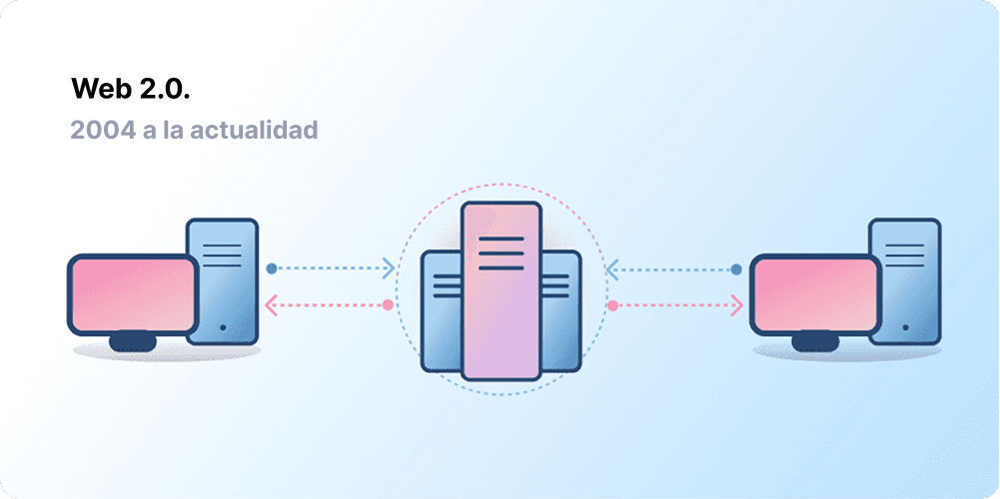
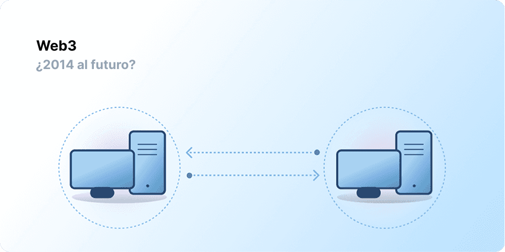

La centralización ha ayudado a incorporar a miles de millones de personas a la World Wide Web y ha creado la infraestructura estable y robusta en la que habita. Al mismo tiempo, un puñado de entidades centralizadas tienen un bastión en grandes extensiones de la World Wide Web, decidiendo unilateralmente qué debería y qué no debería estar permitido.

Web3 es la respuesta a este dilema. En lugar de una Web monopolizada por grandes empresas tecnológicas, Web3 adopta la descentralización y está siendo construida, operada y es propiedad de sus usuarios. Web3 pone el poder en manos de los individuos en lugar de las corporaciones.
Antes de hablar sobre Web3, exploremos cómo llegamos hasta aquí.

<Divider />

## Los inicios de la Web {#early-internet}

La mayoría de las personas piensan en la Web como un pilar continuo de la vida moderna: se inventó y simplemente ha existido desde entonces. Sin embargo, la Web que la mayoría de nosotros conocemos hoy en día es bastante diferente de lo que se imaginó originalmente. Para entender esto mejor, es útil dividir la corta historia de la Web en períodos generales: Web 1.0 y Web 2.0.

### Web 1.0: Solo lectura (1990-2004) {#web1}

En 1989, en el CERN, Ginebra, Tim Berners-Lee estaba ocupado desarrollando los protocolos que se convertirían en la World Wide Web. ¿Su idea? Crear protocolos abiertos y descentralizados que permitieran compartir información desde cualquier lugar de la Tierra.

La primera concepción de la creación de Berners-Lee, ahora conocida como "Web 1.0", ocurrió aproximadamente entre 1990 y 2004. La Web 1.0 consistía principalmente en sitios web estáticos propiedad de empresas, y había casi cero interacción entre los usuarios (los individuos rara vez producían contenido), lo que llevó a que se la conociera como la web de solo lectura.

### Web 2.0: Lectura y escritura (2004-actualidad) {#web2}

El período de la Web 2.0 comenzó en 2004 con la aparición de las plataformas de redes sociales. En lugar de ser de solo lectura, la web evolucionó para ser de lectura y escritura. En lugar de que las empresas proporcionaran contenido a los usuarios, también comenzaron a proporcionar plataformas para compartir contenido generado por los usuarios y participar en interacciones entre usuarios. A medida que más personas se conectaban, un puñado de las principales empresas comenzó a controlar una cantidad desproporcionada del tráfico y el valor generado en la web. La Web 2.0 también dio a luz al modelo de ingresos impulsado por la publicidad. Si bien los usuarios podían crear contenido, no eran dueños de él ni se beneficiaban de su monetización.

<Divider />

## Web 3.0: Lectura, escritura y propiedad {#web3}

La premisa de la "Web 3.0" fue acuñada por el cofundador de [Ethereum](/), Gavin Wood, poco después del lanzamiento de Ethereum en 2014. Gavin expresó con palabras una solución para un problema que muchos de los primeros en adoptar la tecnología cripto sentían: la Web requería demasiada confianza. Es decir, la mayor parte de la Web que las personas conocen y usan hoy en día se basa en confiar en que un puñado de empresas privadas actuarán en el mejor interés del público.

### ¿Qué es Web3? {#what-is-web3}

Web3 se ha convertido en un término general para la visión de una internet nueva y mejor. En su núcleo, Web3 utiliza cadenas de bloques, criptomonedas y NFT para devolver el poder a los usuarios en forma de propiedad. [Una publicación de 2020 en Twitter](https://twitter.com/himgajria/status/1266415636789334016) lo expresó mejor: la Web1 era de solo lectura, la Web2 es de lectura y escritura, la Web3 será de lectura, escritura y propiedad.

#### Ideas centrales de Web3 {#core-ideas}

Aunque es un desafío proporcionar una definición rígida de lo que es Web3, algunos principios centrales guían su creación.

- **Web3 es descentralizado:** en lugar de que grandes extensiones de internet sean controladas y propiedad de entidades centralizadas, la propiedad se distribuye entre sus constructores y usuarios.
- **Web3 es sin permisos:** todos tienen el mismo acceso para participar en Web3 y nadie queda excluido.
- **Web3 tiene pagos nativos:** utiliza criptomonedas para gastar y enviar dinero en línea en lugar de depender de la infraestructura obsoleta de bancos y procesadores de pagos.
- **Web3 es sin necesidad de confianza:** opera utilizando incentivos y mecanismos económicos en lugar de depender de terceros de confianza.

### ¿Por qué es importante Web3? {#why-is-web3-important}

Aunque las características más destacadas de Web3 no están aisladas y no encajan en categorías ordenadas, por simplicidad hemos intentado separarlas para que sean más fáciles de entender.

#### Propiedad {#ownership}

Web3 le otorga la propiedad de sus activos digitales de una manera sin precedentes. Por ejemplo, supongamos que está jugando a un juego de Web2. Si compra un artículo dentro del juego, este se vincula directamente a su cuenta. Si los creadores del juego eliminan su cuenta, perderá estos artículos. O, si deja de jugar, pierde el valor que invirtió en sus artículos del juego.

Web3 permite la propiedad directa a través de [tokens no fungibles (NFT)](/glossary/#nft). Nadie, ni siquiera los creadores del juego, tiene el poder de quitarle su propiedad. Y, si deja de jugar, puede vender o intercambiar sus artículos del juego en mercados abiertos y recuperar su valor. Explore los [juegos en cadena](/gaming/) para ver esto en acción.

<Alert variant="update">
<AlertEmoji text=":eyes:"/>
<AlertContent className="flex-row items-center justify-between">
  
Obtenga más información sobre los NFT

  <ButtonLink href="/nft/">
    Más sobre los NFT
  </ButtonLink>
</AlertContent>
</Alert>

#### Resistencia a la censura {#censorship-resistance}

La dinámica de poder entre las plataformas y los creadores de contenido está enormemente desequilibrada.

OnlyFans es un sitio de contenido para adultos generado por usuarios con más de 1 millón de creadores de contenido, muchos de los cuales utilizan la plataforma como su principal fuente de ingresos. En agosto de 2021, OnlyFans anunció planes para prohibir el contenido sexualmente explícito. El anuncio provocó indignación entre los creadores de la plataforma, quienes sintieron que les estaban robando sus ingresos en una plataforma que ayudaron a crear. Tras la reacción negativa, la decisión se revirtió rápidamente. A pesar de que los creadores ganaron esta batalla, esto resalta un problema para los creadores de la Web 2.0: pierde la reputación y los seguidores que acumuló si abandona una plataforma.

En Web3, sus datos viven en la cadena de bloques. Cuando decide abandonar una plataforma, puede llevarse su reputación consigo, conectándola a otra interfaz que se alinee más claramente con sus valores.

La Web 2.0 requiere que los creadores de contenido confíen en que las plataformas no cambiarán las reglas, pero la resistencia a la censura es una característica nativa de una plataforma Web3.

#### Organizaciones autónomas descentralizadas (DAO) {#daos}

Además de ser dueño de sus datos en Web3, puede ser dueño de la plataforma como colectivo, utilizando tokens que actúan como acciones en una empresa. Las DAO le permiten coordinar la propiedad descentralizada de una plataforma y tomar decisiones sobre su futuro.

Las DAO se definen técnicamente como [contratos inteligentes](/glossary/#smart-contract) acordados que automatizan la toma de decisiones descentralizada sobre un conjunto de recursos (tokens). Los usuarios con tokens emiten su voto sobre cómo se gastan los recursos, y el código ejecuta automáticamente el resultado de la votación.

Sin embargo, las personas definen muchas comunidades de Web3 como DAO. Todas estas comunidades tienen diferentes niveles de descentralización y automatización mediante código. Actualmente, estamos explorando qué son las DAO y cómo podrían evolucionar en el futuro.

<Alert variant="update">
<AlertEmoji text=":eyes:"/>
<AlertContent className="flex-row items-center justify-between">
  
Obtenga más información sobre las DAO

  <ButtonLink href="/dao/">
    Más sobre las DAO
  </ButtonLink>
</AlertContent>
</Alert>

### Identidad {#identity}

Tradicionalmente, crearía una cuenta para cada plataforma que utiliza. Por ejemplo, podría tener una cuenta de Twitter, una cuenta de YouTube y una cuenta de Reddit. ¿Desea cambiar su nombre para mostrar o su foto de perfil? Tiene que hacerlo en cada cuenta. Puede utilizar inicios de sesión sociales en algunos casos, pero esto presenta un problema familiar: la censura. Con un solo clic, estas plataformas pueden bloquearle el acceso a toda su vida en línea. Peor aún, muchas plataformas requieren que les confíe información de identificación personal para crear una cuenta.

Web3 resuelve estos problemas al permitirle controlar su identidad digital con una dirección de Ethereum y un perfil del [Servicio de Nombres de Ethereum (ENS)](/glossary/#ens). El uso de una dirección de Ethereum proporciona un inicio de sesión único en todas las plataformas que es seguro, resistente a la censura y anónimo.

### Pagos nativos {#native-payments}

La infraestructura de pagos de la Web2 depende de bancos y procesadores de pagos, excluyendo a las personas sin cuentas bancarias o a aquellas que casualmente viven dentro de las fronteras del país equivocado.
Web3 utiliza tokens como [ETH](/glossary/#ether) para enviar dinero directamente en el navegador y no requiere de un tercero de confianza.

<ButtonLink href="/what-is-ether/">
  Más sobre ETH
</ButtonLink>

## Limitaciones de Web3 {#web3-limitations}

A pesar de los numerosos beneficios de Web3 en su forma actual, todavía existen muchas limitaciones que el ecosistema debe abordar para que prospere.

### Accesibilidad {#accessibility}

Las características importantes de Web3, como Iniciar sesión con Ethereum, ya están disponibles para que cualquiera las use sin costo alguno. Pero, el costo relativo de las transacciones sigue siendo prohibitivo para muchos. Es menos probable que Web3 se utilice en naciones en desarrollo menos ricas debido a las altas tarifas de transacción. En Ethereum, estos desafíos se están resolviendo a través de [la hoja de ruta](/roadmap/) y las [soluciones de escalado de capa 2 (l2)](/glossary/#layer-2). La tecnología está lista, pero necesitamos mayores niveles de adopción en la capa 2 para que Web3 sea accesible para todos.

### Experiencia de usuario {#user-experience}

La barrera técnica de entrada para usar Web3 es actualmente demasiado alta. Los usuarios deben comprender los problemas de seguridad, entender la documentación técnica compleja y navegar por interfaces de usuario poco intuitivas. Los [proveedores de billeteras](/wallets/find-wallet/), en particular, están trabajando para resolver esto, pero se necesita más progreso antes de que Web3 se adopte en masa.

### Educación {#education}

Web3 introduce nuevos paradigmas que requieren aprender modelos mentales diferentes a los utilizados en la Web 2.0. Un impulso educativo similar ocurrió cuando la Web 1.0 estaba ganando popularidad a fines de la década de 1990; los defensores de la World Wide Web utilizaron una gran cantidad de técnicas educativas para educar al público, desde metáforas simples (la autopista de la información, navegadores, navegar por la web) hasta [transmisiones de televisión](https://www.youtube.com/watch?v=SzQLI7BxfYI). Web3 no es difícil, pero es diferente. Las iniciativas educativas que informan a los usuarios de la Web2 sobre estos paradigmas de Web3 son vitales para su éxito.

Ethereum.org contribuye a la educación sobre Web3 a través de nuestro [Programa de traducción](/contributing/translation-program/), con el objetivo de traducir contenido importante de Ethereum a la mayor cantidad de idiomas posible.

### Infraestructura centralizada {#centralized-infrastructure}

El ecosistema de Web3 es joven y evoluciona rápidamente. Como resultado, actualmente depende principalmente de infraestructura centralizada (GitHub, Twitter, Discord, etc.). Muchas empresas de Web3 se apresuran a llenar estos vacíos, pero construir una infraestructura confiable y de alta calidad lleva tiempo.

## Un futuro descentralizado {#decentralized-future}

Web3 es un ecosistema joven y en evolución. Gavin Wood acuñó el término en 2014, pero muchas de estas ideas se han convertido en realidad recientemente. Solo en el último año, ha habido un aumento considerable en el interés por las criptomonedas, mejoras en las soluciones de escalado de capa 2 (l2), experimentos masivos con nuevas formas de gobernanza y revoluciones en la identidad digital.

Solo estamos en el comienzo de la creación de una Web mejor con Web3, pero a medida que continuamos mejorando la infraestructura que la respaldará, el futuro de la Web parece brillante.

## ¿Cómo puedo participar? {#get-involved}

- [Obtener una billetera](/wallets/)
- [Encontrar una comunidad](/community/)
- [Explorar aplicaciones de Web3](/apps/)
- [Unirse a una DAO](/dao/)
- [Construir en Web3](/developers/)

## Lecturas adicionales {#further-reading}

Web3 no está rígidamente definido. Varios participantes de la comunidad tienen diferentes perspectivas al respecto. Aquí hay algunas de ellas:

- [¿Qué es Web3? La internet descentralizada del futuro explicada](https://www.freecodecamp.org/news/what-is-web3) – _Nader Dabit_
- [Dando sentido a la Web 3](https://medium.com/l4-media/making-sense-of-web-3-c1a9e74dcae) – _Josh Stark_
- [Por qué es importante Web3](https://a16zcrypto.com/posts/article/why-web3-matters/) — _Chris Dixon_
- [Por qué es importante la descentralización](https://onezero.medium.com/why-decentralization-matters-5e3f79f7638e) - _Chris Dixon_
- [El panorama de Web3](https://a16z.com/wp-content/uploads/2021/10/The-web3-Readlng-List.pdf) – _a16z_
- [El debate sobre Web3](https://www.notboring.co/p/the-web3-debate) – _Packy McCormick_

<QuizWidget quizKey="web3" />
