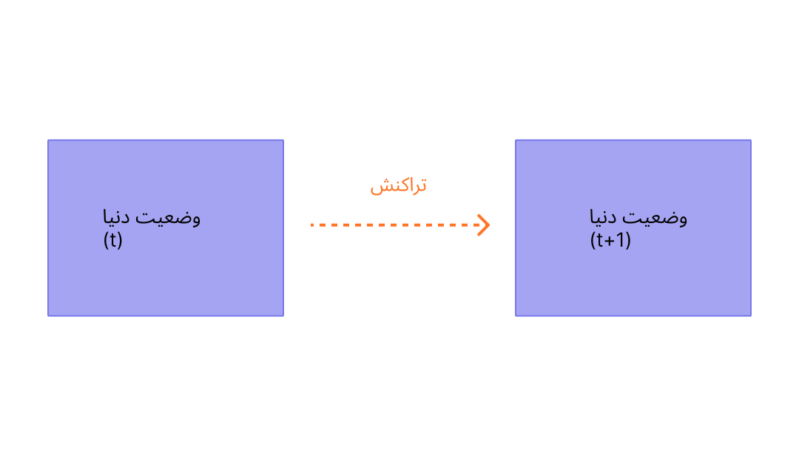
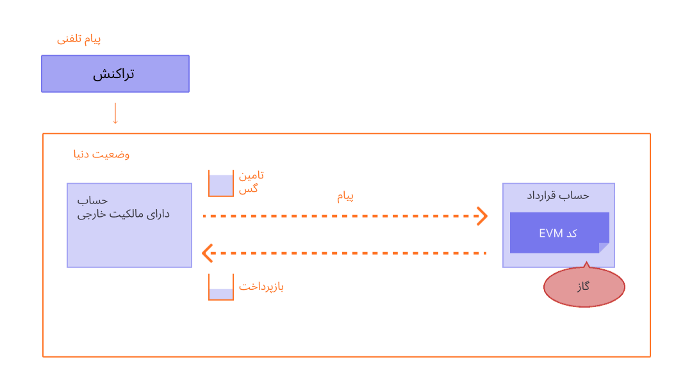

تراکنش‌ها شامل دستورالعمل‌هایی از حساب‌ها هستند که به صورت رمزنگاری‌شده امضا شده‌اند. یک حساب برای به‌روزرسانی وضعیت شبکه اتریوم، تراکنشی را آغاز می‌کند. ساده‌ترین تراکنش، انتقال اتر از یک حساب به حساب دیگر است.

## پیش‌نیازها {#prerequisites}

برای کمک به فهمیدن این صفحه، بهتر است [حساب های کاربری](/developers/docs/accounts/) و [مقدمه‌ای بر اتریوم](/developers/docs/intro-to-ethereum/) را مطالعه کنید.

## تراکنش چیست؟ {#whats-a-transaction}

تراکنش اتریوم به اقدامی اشاره دارد که توسط یک حساب تحت مالکیت خارجی آغاز می‌شود، به عبارت دیگر حسابی که توسط یک انسان مدیریت می‌شود، نه یک قرارداد. به‌عنوان مثال، اگر باب به آلیس 1 اتر ارسال کند، حساب باب باید بدهکار شود و حساب آلیس باید بستانکار شود. این عمل تغییر وضعیت توسط یک تراکنش صورت می‌گیرد.

 _نمودار برگرفته از [Ethereum EVM illustrated](https://takenobu-hs.github.io/downloads/ethereum_evm_illustrated.pdf)_

تراکنش‌هایی که وضعیت EVM را تغییر می‌دهند، باید در کل شبکه پخش شوند. هر گره‌ می‌تواند اجرای تراکنش در ماشین مجازی اتریوم (EVM) را درخواست کند؛ پس از این اتفاق، یک اعتبارسنج تراکنش را اجرا می‌کند و تغییر حالت حاصل را در بقیه شبکه تکثیر می‌کند.

تراکنش ها نیاز به کارمزد دارند و باید در یک بلوک تأیید شده قرار گیرند. برای ساده‌تر کردن این نمای کلی، کارمزدهای گاز و اعتبارسنجی را در جای دیگری پوشش خواهیم داد.

تراکنش ارسالی شامل اطلاعات زیر است:

- `از` - آدرس فرستنده که تراکنش را امضا خواهد کرد. این یک حساب مالکیت خارجی خواهد بود، چون حساب قرارداد نمیتواند تراکنش ارسال کنند.
- `به` - آدرس دریافت کننده (اگر یک حساب با مالکیت خارجی باشد، تراکنش یک مقدار را منتقل خواهد کرد. اگر یک حساب قرارداد باشد، تراکنش کد قرارداد را اجرا می‌کند)
- `امضاء` - شناسه‌ فرستنده. زمانی ایجاد می‌شود که کلید خصوصی فرستنده تراکنش را امضا کند و تأیید کند که فرستنده این تراکنش را مجاز کرده است
- `Nonce` - یک شمارنده که به شکل متوالی افزایش می یابد و تعداد تراکنش های حساب را نشان میدهد
- `ارزش` - مقدار اتر فرستاده شده از آدرس فرستنده تراکنش به گیرنده (این مقدار در واحد اندازه گیری WEI نمایش داده میشود، که هر اتر برابر با 1e+18 wei است)
- `داده ورودی(input data)` - قسمتی اختیاری برای قراردادن هر داده دلخواه
- `gasLimit` - حداکثر مقدار واحدهای گازی که می‌تواند توسط تراکنش مصرف شود. [ماشین مجازی اتریوم (EVM)](/developers/docs/evm/opcodes) واحدهای گاز لازم برای انجام هر مرحله محاسباتی تراکنش را مشخص می کند
- `حداکثر انعام به ازای هر گاز (maxPriorityFeePerGas)` - حداکثر قیمت گازهایی که به‌عنوان انعام به اعتبارسنج پرداخت میشود
- `حداکثر کارمزد به ازای هر گاز (maxFeePerGas)` - حداکثر قیمتی که کاربر به ازای هر واحد گاز مایل به پرداخت است (شامل `قیمت پایه به ازای هر گاز (baseFeePerGas)`و`حداکثر قیمت اولویت به ازای هر گاز (maxPriorityFeePerGas)`)

گاز به محاسبات لازم برای پردازش تراکنش توسط اعتبارسنج اشاره میکند. کاربران برای این محاسبه باید هزینه‌ای بپردازند. `محدوده گاز (gasLimit)`، و`حداکثر قیمت اولویت به ازای هر گاز (maxPriorityFeePerGas)` نشان دهنده بیشترین کارمزد تراکنش پرداخت شده به اعتبارسنج می باشد. [درباره‌ی گاز بیشتر بدانید](/developers/docs/gas/).

شی‌ء تراکنش کمی شبیه به این خواهد بود:

```js
{
  from: "0xEA674fdDe714fd979de3EdF0F56AA9716B898ec8",
  to: "0xac03bb73b6a9e108530aff4df5077c2b3d481e5a",
  gasLimit: "21000",
  maxFeePerGas: "300",
  maxPriorityFeePerGas: "10",
  nonce: "0",
  value: "10000000000"
}
```

اما یک شیء تراکنش باید با استفاده از کلید خصوصی فرستنده امضا شود. این کار ثابت می‌کند که تراکنش فقط می‌تواند از طرف فرستنده انجام شود و به صورت تقلبی ارسال نشده است.

یک کلاینت اتریوم مانند Geth این فرایند امضا را انجام می‌دهد.

نمونه‌ فراخوانی [JSON-RPC](/developers/docs/apis/json-rpc):

```json
{
  "id": 2,
  "jsonrpc": "2.0",
  "method": "account_signTransaction",
  "params": [
    {
      "from": "0x1923f626bb8dc025849e00f99c25fe2b2f7fb0db",
      "gas": "0x55555",
      "maxFeePerGas": "0x1234",
      "maxPriorityFeePerGas": "0x1234",
      "input": "0xabcd",
      "nonce": "0x0",
      "to": "0x07a565b7ed7d7a678680a4c162885bedbb695fe0",
      "value": "0x1234"
    }
  ]
}
```

نمونه‌ی پاسخ:

```json
{
  "jsonrpc": "2.0",
  "id": 2,
  "result": {
    "raw": "0xf88380018203339407a565b7ed7d7a678680a4c162885bedbb695fe080a44401a6e4000000000000000000000000000000000000000000000000000000000000001226a0223a7c9bcf5531c99be5ea7082183816eb20cfe0bbc322e97cc5c7f71ab8b20ea02aadee6b34b45bb15bc42d9c09de4a6754e7000908da72d48cc7704971491663",
    "tx": {
      "nonce": "0x0",
      "maxFeePerGas": "0x1234",
      "maxPriorityFeePerGas": "0x1234",
      "gas": "0x55555",
      "to": "0x07a565b7ed7d7a678680a4c162885bedbb695fe0",
      "value": "0x1234",
      "input": "0xabcd",
      "v": "0x26",
      "r": "0x223a7c9bcf5531c99be5ea7082183816eb20cfe0bbc322e97cc5c7f71ab8b20e",
      "s": "0x2aadee6b34b45bb15bc42d9c09de4a6754e7000908da72d48cc7704971491663",
      "hash": "0xeba2df809e7a612a0a0d444ccfa5c839624bdc00dd29e3340d46df3870f8a30e"
    }
  }
}
```

- `raw` تراکنشی امضا شده است در فرم کدگذاری شده [Recursive Length Prefix (RLP)](/developers/docs/data-structures-and-encoding/rlp)
- `tx` تراکنش امضاشده به شکل JSON است

با هش امضا، می‌توان به صورت رمزنگاری ثابت کرد که تراکنش از فرستنده آمده و به شبکه ارسال شده است.

### فیلد داده‌ها {#the-data-field}

اکثریت قریب‌به‌اتفاق تراکنش‌ها از طریق یک حساب دارای مالکیت خارجی به یک قرارداد دسترسی دارند. اکثر قراردادها در Solidity نوشته شده‌اند و فیلد داده‌های آن‌ها را مطابق با [رابط باینری برنامه (ABI)](/glossary/#abi) تفسیر می‌کنند.

چهار بایت اول با استفاده از هش نام تابع و آرگومان‌ها مشخص می‌کند که کدام تابع را فراخوانی کند. گاهی اوقات می‌توانید تابع را از انتخابگر با استفاده از [این پایگاه داده](https://www.4byte.directory/signatures/) شناسایی کنید.

بقیه فراخوان‌داده‌ها (calldata) آرگومان هستند، که [مطابق با مشخصات ABI مشخص شده‌اند](https://docs.soliditylang.org/en/latest/abi-spec.html#formal-specification-of-the-encoding).

برای مثال، بیایید به [این تراکنش](https://etherscan.io/tx/0xd0dcbe007569fcfa1902dae0ab8b4e078efe42e231786312289b1eee5590f6a1) نگاه کنیم. از **برای مشاهده‌ی بیشتر کلیک کنید** برای دیدن فراخوان‌داده‌ها استفاده کنید.

انتخابگر تابع `0xa9059cbb` است. چندین [تابع شناخته‌شده با این امضا وجود دارد](https://www.4byte.directory/signatures/?bytes4_signature=0xa9059cbb). در این مورد [کد منبع قرارداد](https://etherscan.io/address/0xa0b86991c6218b36c1d19d4a2e9eb0ce3606eb48#code) در Etherscan آپلود شده است، بنابراین می‌دانیم که این تابع `transfer(address, uint256)` است.

بقیه داده‌ها عبارتند از:

```
0000000000000000000000004f6742badb049791cd9a37ea913f2bac38d01279
000000000000000000000000000000000000000000000000000000003b0559f4
```

با توجه به مشخصات ABI، مقادیر صحیح (مانند آدرس‌ها که اعداد صحیح 20 بایتی هستند) در ABI به صورت کلمات 32 بایتی ظاهر می‌شوند که ممکن است یک یا چند صفر در ابتدای آن‌ها قرار داده شود. بنابراین ما می‌دانیم که آدرس `«to»‏`
`4f6742badb049791cd9a302791cd9a302791cd99a32791cd99a310.com است.
مقدار` 0x3b0559f4 = 990206452 است.

## انواع تراکنش‌ها {#types-of-transactions}

در اتریوم چند نوع تراکنش مختلف وجود دارد:

- تراکنش های منظم: تراکنش از یک حساب به حساب دیگر.
- تراکنش‌های استقرار قرارداد: تراکنش بدون آدرس «to»، که در آن از فیلد داده‌ها برای کد قرارداد استفاده می‌شود.
- اجرای قرارداد: تراکنشی که با یک قرارداد هوشمند مستقر تعامل دارد. در این مورد، آدرس «to»، آدرس قرارداد هوشمند است.

### درباره‌ی گاز {#on-gas}

همان‌طور که گفته شد، انجام تراکنش‌ها [گاز](/developers/docs/gas/) مصرف می‌کند. تراکنش‌های انتقال ساده به 21000 واحد گاز نیاز دارند.

بنابراین برای اینکه باب 1 اتر را به آلیس با `baseFeePerGas` به میزان 190 gwei و `maxPriorityFeePerGas` به میزان 10 gwei ارسال کند، باب باید هزینه‌ی زیر را بپردازد:

```
(190 + 10) * 21000 = 4,200,000 gwei
--یا--
0.0042 اتر
```

مقدار **1.0042 اتر** از حساب باب کسر خواهد شد (1 اتر برای آلیس + 0.0042 اتر برای هزینه گاز)

به حساب آلیس **1.0+ اتر** بستانکار خواهد شد

کارمزد پایه **0.00399- اتر** خواهد شد

اعتبارسنج انعام **+0.000210 ETH** را نگه می دارد

 _نمودار برگرفته از [Ethereum EVM illustrated](https://takenobu-hs.github.io/downloads/ethereum_evm_illustrated.pdf)_

هر گازی که در تراکنش استفاده نشده باشد به حساب کاربری مسترد می‌شود.

### تعاملات قرارداد هوشمند {#smart-contract-interactions}

گاز برای هر تراکنشی که شامل یک قرارداد هوشمند است، لازم است.

قراردادهای هوشمند همچنین می‌توانند دارای عملکردهایی باشند که به‌عنوان عملکردهای [`نما`](https://docs.soliditylang.org/en/latest/contracts.html#view-functions) یا [`خالص`](https://docs.soliditylang.org/en/latest/contracts.html#pure-functions) شناخته می‌شوند، که وضعیت قرارداد را تغییر نمی‌دهند. به این ترتیب، فراخوانی این توابع از یک EOA نیازی به گاز ندارد. فراخوان RPC اصلی برای این سناریو [`eth_call`](/developers/docs/apis/json-rpc#eth_call) است

برخلاف زمانی که با استفاده از `eth_call` قابل دسترسی است، این توابع `نما` یا `خالص` معمولاً به صورت داخلی نیز فراخوانده می شوند (یعنی از خود قرارداد یا از قرارداد دیگری) که کارمزد گس را به همراه دارد.

## چرخه‌ی حیات تراکنش {#transaction-lifecycle}

هنگامی که تراکنش ارسال شد، موارد زیر اتفاق می‌افتد:

1. یک هشِ تراکنش به صورت رمزنگاری شده تولید میشود: `0x97d99bc7729211111a21b12c933c949d4f31684f1d6954ff477d0477538ff017`

2. سپس تراکنش شما در شبکه مخابره می شود و به استخری که شامل تمامی تراکنش های شبکه است که در حال انتظار می باشند اضافه می شود.

3. به منظور تایید و "موفقیت آمیز" در نظر گرفته شدن تراکنش شما، یک اعتبارسنج باید تراکنش شما را انتخاب کرده و داخل یک بلوک قرار دهد.
4. با گذر زمان بلوکی که حامل تراکنش شما است به وضعیت "مشروع" و سپس "نهایی" برروز رسانی می شود. این ارتقاها موجب می شوند که کاملا مطمئن شوید که تراکنش شما موفقیت آمیز بوده و هرگز تغییر نخواهد کرد. زمانی که یک بلوک "نهایی" شد فقط تنها زمانی که مورد یک حمله در حد و سطح شبکه قرار بگیرد می تواند تغییر یابد که چندین میلیارد دلار هزینه به بار خواهد آورد.

## یک نسخه‌ی آزمایشی تصویری {#a-visual-demo}

آستین را تماشا کنید که شما را درباره‌ی تراکنش‌ها، گاز و استخراج راهنمایی می‌کند.

<YouTube id="er-0ihqFQB0" />

## پاکت تراکنش تایپ‌شده {#typed-transaction-envelope}

اتریوم در ابتدا یک قالب برای تراکنش‌ها داشت. هر تراکنش حاوی نانس (nonce)، قیمت گاز، حد گاز، آدرس گیرنده، مقدار، داده، v، r و s بود. این فیلد ها [کدگذاری شده RLP](/developers/docs/data-structures-and-encoding/rlp/) هستند، تا چیزی شبیه این به نظر برسند:

`RLP([nonce, gasPrice, gasLimit, to, value, data, v, r, s])`

اتریوم به گونه‌ای تکامل یافته است که از چندین نوع تراکنش پشتیبانی می‌کند تا پیاده‌سازی ویژگی‌های جدیدی مانند لیست‌های دسترسی و [EIP-1559](https://eips.ethereum.org/EIPS/eip-1559) را بدون تأثیر بر قالب‌های تراکنش قدیمی امکان‌پذیر سازد.

[EIP-2718](https://eips.ethereum.org/EIPS/eip-2718) چیزی است که به این رفتار اجازه می دهد. تراکنش ها به صورت زیر تفسیر می شوند:

`نوع معامله || TransactionPayload`

که در آن فیلدها به صورت زیر تعریف می‌شوند:

- `TransactionType` - عددی بین 0 و 0x7f، برای مجموع 128 نوع تراکنش ممکن.
- `TransactionPayload` - یک آرایه‌ی بایت دلخواه که توسط نوع تراکنش تعریف شده است.

بر اساس مقدار `TransactionType`، تراکنش را می توان به موارد زیر طبقه‌بندی کرد

1. **تراکنش های نوع صفر (قدیمی):** فرمت تراکنش اصلی که از زمان راه‌اندازی اتریوم استفاده شده است. اینها شامل ویژگی‌های [EIP-1559](https://eips.ethereum.org/EIPS/eip-1559) مانند محاسبات دینامیک هزینه گس یا لیست دسترسی برای قراردادهای هوشمند نمی‌شوند. تراکنش‌های قدیمی فاقد پیشوند خاصی هستند که نوع آن‌ها را به صورت سریالی نشان می‌دهد، و با بایت `0xf8` هنگام استفاده از رمزگذاری [پیشوند طول بازگشتی (RLP)](/developers/docs/data-structures-and-encoding/rlp) شروع می‌شوند. مقدار TransactionType برای این تراکنش‌ها `0x0` است.

2. **تراکنش‌های نوع یک:**در [پیشنهاد EIP-2930](https://eips.ethereum.org/EIPS/eip-2930) به‌عنوان بخشی از [ارتقای برلین](/history/#berlin) اتریوم معرفی شدند، این تراکنش‌ها شامل پارامتر `accessList` هستند. این فهرست اقدام به مشخص‌کردن آدرس‌ها و کلیدهای ذخیره‌سازی می‌کند که تراکنش انتظار دارد به آنها دسترسی داشته باشد، و به کاهش بالقوه هزینه‌های [گس](/developers/docs/gas/) برای تراکنش‌های پیچیده شامل قراردادهای هوشمند کمک می‌کند. تغییرات بازار کارمزد EIP-1559 در تراکنش‌های نوع یک گنجانده نشده‌اند. تراکنش‌های نوع 1 همچنین شامل یک پارامتر `yParity` هستند که می‌تواند `0x0` یا `0x1` باشد که نشان‌دهنده برابری مقدار y امضای secp256k1 است. تشخیص آنها اینطور است که با بایت `0x01` شناسایی می شوند و مقدار TransactionType آنها `0x1` است.

3. **تراکنش‌های نوع 2** که معمولاً به تراکنش‌های EIP-1559 گفته می‌شوند، تراکنش‌هایی هستند که در [EIP-1559](https://eips.ethereum.org/EIPS/eip-1559)، در [به‌روزرسانی لندن](/history/#london) اتریوم معرفی شده‌اند. آنها به مدل تراکنش استاندارد در شبکه اتریوم تبدیل شده‌اند. این تراکنش‌ها یک مکانیزم جدید بازار کارمزد را معرفی می‌کنند که با تفکیک کارمزد معامله به کارمزد پایه و کارمزد اولویت، قابلیت پیش‌بینی را بهبود می‌بخشد. آنها با بایت `0x02` شروع می شوند و شامل فیلدهایی مانند `maxPriorityFeePerGas` و `maxFeePerGas` می‌شوند. تراکنش‌های نوع 2 اکنون به دلیل انعطاف‌پذیری و کارایی، پیش‌فرض هستند، به‌ویژه در دوره‌های شلوغی بالای شبکه به دلیل توانایی آن‌ها در کمک به کاربران در مدیریت قابل پیش‌بینی‌تر کارمزد تراکنش‌ها مورد توجه قرار می‌گیرند. مقدار TransactionType برای این تراکنش ها `0x2` است.

## بیشتر بخوانید {#further-reading}

- [EIP-2718: پاکت تراکنش تایپ‌شده](https://eips.ethereum.org/EIPS/eip-2718)

_آیا منبعی اجتماعی می‌شناسید که به شما کمک کرده باشد؟ این صفحه را ویرایش کنید و به آن اضافه کنید!_

## موضوعات مرتبط {#related-topics}

- [حساب‌ها](/developers/docs/accounts/)
- [ماشین مجازی اتریوم (EVM)](/developers/docs/evm/)
- [گاز](/developers/docs/gas/)
