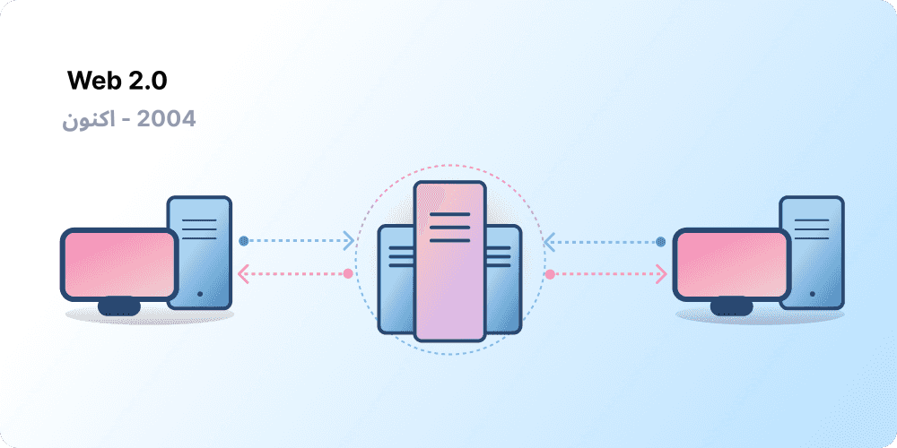
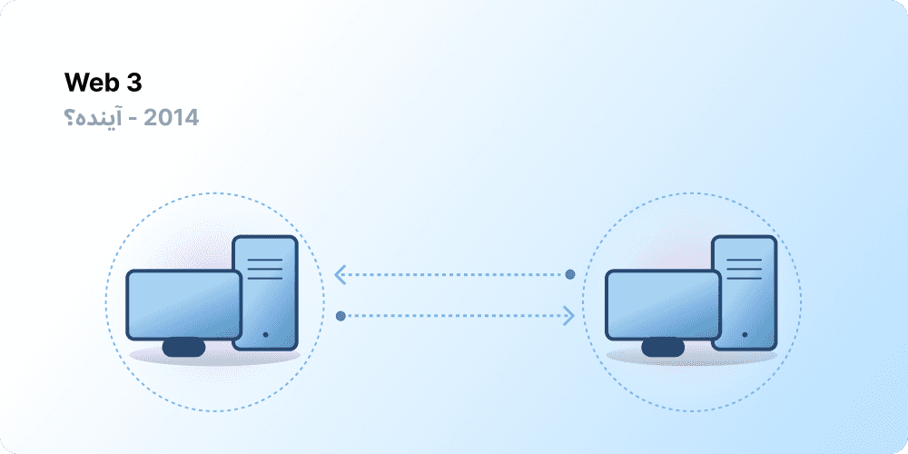

# مقدمه ای بر وب 3 {#introduction}

متمرکزسازی به فراهم‌سازی امکان حضور میلیاردها نفر در اینترنت کمک کرده است و زیرساخت پایدار و مستحکمی را ایجاد کرده است که بر بستر آن بنا شده است. در عین حال، تعداد انگشت‌شماری از نهادهای متمرکز کنترل بخش‌های وسیعی از اینترنت را در دست دارند و به طور یکجانبه تصمیم می‌گیرند که چه چیزی باید مجاز باشد و چه چیزی نباید مجاز باشد.

وب 3 پاسخی به این معضل است. به جای شبکه‌ای که در انحصار شرکت‌های بزرگ فناوری است، Web3 از تمرکززدایی استقبال می‌کند و توسط کاربرانش ساخته می‌شود، گردانده می‌شود و تحت مالکیت آن‌ها است. وب 3 قدرت را به‌جای شرکت‌ها در دست افراد قرار می‌دهد. قبل از اینکه در مورد وب 3 صحبت کنیم، بیایید ببینیم که چطور به اینجا رسیدیم.

<Divider />

## وب اولیه {#early-internet}

بیشتر مردم اینترنت را چیزی تصور می‌کنند که همیشه همراه زندگی مدرن بوده است – اینترنت اختراع شد و از آن زمان تاکنون وجود داشته است. با این حال، اینترنتی که امروزه می‌شناسیم کاملاً متفاوت از تصور اولیه است. برای درک بهتر این موضوع، خوب است که تاریخچه‌ کوتاه اینترنت را به دوره‌های کوچکتر تقسیم کنیم - وب 1.0 و وب 2.0.

### وب 1.0: صرفاً خواندنی (2004-1990) {#web1}

در سال 1989، در سرن، ژنو، تیم برنرز-لی مشغول توسعه‌ پروتکل‌هایی بود که به اینترنت تبدیل شدند. ایده‌ی او چه بود؟ برای ایجاد پروتکل‌های باز و غیرمتمرکز که امکان اشتراک‌گذاری اطلاعات را از هر نقطه روی زمین فراهم می‌کند.

پیدایش اولیه اینترنت که اکنون با نام «وب 1.0» شناخته می‌شود، تقریباً بین سال‌های 1990 تا 2004 رخ داد. وب 1.0 عمدتاً وب‌سایت‌های ثابت متعلق به شرکت‌ها بود و تقریباً هیچ تعاملی بین کاربران - افرادی که به ندرت محتوا تولید می‌کردند- وجود نداشت، که باعث شد به‌عنوان وبِ صرفاً خواندنی شناخته شود.

### وب 2.0: خواندنی-نوشتنی (از 2004 تاکنون) {#web2}

دوره‌ی وب 2.0 در سال 2004 با ظهور پلتفرم‌های رسانه‌های اجتماعی آغاز شد. برخلاف صرفاً خواندنی بودن، وب به شکل خواندنی-نوشتنی تکامل یافت. شرکت‌ها در کنار ارائه‌ی محتوا به کاربران، شروع به ارائه‌ی پلتفرم‌هایی برای اشتراک‌گذاری محتوای تولید شده توسط کاربران و تعامل کاربر با کاربر کردند. با ورود افراد بیشتری به اینترنت، تعداد انگشت‌شماری از شرکت‌های برتر شروع به کنترل مقدار بسیار زیادی از ترافیک و ارزش تولید شده در وب کردند. وب 2.0 همچنین مدل درآمد مبتنی بر تبلیغات را ایجاد کرد. کاربران می‌توانستند محتوا ایجاد کنند، اما مالک آن نبودند یا از درآمدزایی آن سود نمی‌بردند.

<Divider />

## وب 3.0: خواندنی-نوشتنی-داشتنی {#web3}

مفهوم «وب 3.0» توسط گاوین وود، یکی از بنیانگذاران [اتریوم](/what-is-ethereum/) اندکی پس از راه‌اندازی اتریوم در سال 2014 ابداع شد. گاوین راه‌حلی را برای مشکلی که بسیاری از پذیرندگان اولیه رمزارزها احساس می‌کردند به زبان آورد: وب بیش از حد به اعتماد کردن نیاز داشت. به عبارت دیگر، بیشتر فضای اینترنتی که امروزه مردم می‌شناسند و از آن استفاده می‌کنند، متکی به اعتماد به تعداد انگشت‌شماری از شرکت‌های خصوصی است تا در راستای منافع عمومی عمل کنند.

### وب 3 چیست؟ {#what-is-web3}

وب 3 بدل به یک اصطلاح کلی برای چشم‌انداز اینترنت جدید و بهتر شده است. وب 3 در هسته‌ی خود از زنجیره‌‌ی بلوکی، ارزهای دیجیتال و توکن‌های غیرقابل معاوضه برای بازگرداندن قدرت به کاربران در قالب مالکیت استفاده می‌کند. [مطلبی که یک کاربر در سال 2020 در توییتر نوشته شده بود](https://twitter.com/j1mmyeth/status/1459003044067258370) به بهترین نحو این موضوع را بیان می‌کند: وب 1 فقط خواندنی بود، وب 2 خواندنی/نوشتنی؛ وب 3 خواندنی/ نوشتنی/داشتنی خواهد بود.

#### ایده‌های اصلی وب 3 {#core-ideas}

اگرچه ارائه یک تعریف دقیق از چیستی وب 3 چالش برانگیز است، اما چند اصل بنیادین در ساخت آن ایفای نقش می‌کنند.

- **وب 3 غیرمتمرکز است:** به‌جای اینکه بخش‌های وسیعی از اینترنت تحت کنترل و مالکیت نهادهای متمرکز باشد، مالکیت بین سازندگان و کاربران آن توزیع می‌شود.
- **وب 3 بدون مجوز است:** همه دسترسی یکسانی برای شرکت در وب 3 دارند و هیچ‌کس مستثنی نمی‌شود.
- **وب 3 پرداخت‌های بومی دارد:** از ارز دیجیتال برای خرج کردن و ارسال پول آنلاین به‌جای تکیه بر زیرساخت‌های قدیمی بانک‌ها و پردازشگرهای پرداخت استفاده می‌کند.
- **وب 3 بی‌نیاز از اعتماد کردن است:** وب 3 از مشوق‌ها و سازوکارهای اقتصادی به جای تکیه بر اشخاص ثالث قابل اعتماد استفاده می‌کند.

### چرا وب 3 مهم است؟ {#why-is-web3-important}

اگرچه ویژگی‌های برتر وب 3 مجزا نیستند و در دسته‌بندی‌های منظمی قرار نمی‌گیرند، برای سادگی، سعی کرده‌ایم آن‌ها را از هم جدا کنیم تا درک آن‌ها آسان‌تر شود.

#### مالکیت {#ownership}

وب 3 مالکیت دارایی‌های دیجیتال خود را به روشی بی‌سابقه به شما می‌دهد. به‌عنوان مثال، فرض کنیم که در حال انجام یک بازی وب 2 هستید. اگر یک آیتم درون بازی خریداری کنید، مستقیماً به حساب شما مرتبط خواهد بود. اگر سازندگان بازی حساب کاربری شما را حذف کنند، این موارد را از دست خواهید داد. یا اگر بازی را متوقف کنید، ارزشی را که روی آیتم‌های درون بازی خود سرمایه‌گذاری کرده‌اید از دست می‌دهید.

Web3 امکان مالکیت مستقیم را از طریق [توکن‌های غیرقابل معاوضه (NFTها)](/glossary/#nft) فراهم می کند. هیچ‌کس، حتی سازندگان بازی، قدرت سلب مالکیت شما را ندارند. و اگر بازی را متوقف کنید، می‌توانید آیتم‌های درون بازی خود را در بازارهای آزاد بفروشید یا معامله کنید و ارزش آن‌ها را بازپس بگیرید.

<InfoBanner shouldSpaceBetween emoji=":eyes:">
  
درباره‌ی NFTها بیشتر بدانید

  <ButtonLink href="/nft/">
    اطلاعات بیشتر درباره NTFها
  </ButtonLink>
</InfoBanner>

#### مقاومت در برابر سانسور {#censorship-resistance}

سازوکار قدرت بین پلتفرم‌ها و سازندگان محتوا به شدت نامتعادل است.

OnlyFans یک سایت محتوای ویژه‌ی بزرگسالان است که توسط کاربران تولید می‌شود و بیش از 1 میلیون سازنده محتوا دارد که بسیاری از آن‌ها از این پلتفرم به‌عنوان منبع درآمد اصلی خود استفاده می‌کنند. در آگوست 2021، OnlyFans برنامه‌هایی را برای ممنوعیت محتوای جنسی آشکار اعلام کرد. این اعلامیه خشم سازندگان روی پلتفرم را برانگیخت، زیرا احساس کردند درآمدشان از پلتفرمی که به ایجاد آن کمک کرده‌اند از دست می‌رود. پس از واکنش شدید، این تصمیم به سرعت پس گرفته شد. علیرغم اینکه سازندگان در این نبرد پیروز شدند، مشکلی را برای سازندگان وب 2.0 برجسته می‌کند: اگر پلتفرمی را ترک کنید، شهرت و دنبال‌کنندگان را از دست می‌دهید.

در وب 3، داده های شما روی زنجیره‌‌ی بلوکی قرار دارند. هنگامی که تصمیم به ترک یک پلتفرم می‌گیرید، می‌توانید شهرت خود را همراه خود ببرید و آن را به رابط دیگری متصل کنید که با ارزش‌های شما همسوتر است.

وب 2.0 از سازندگان محتوا می‌خواهد که به پلتفرم‌ها اعتماد کنند تا قوانین را تغییر ندهند، اما مقاومت در برابر سانسور ویژگی اصلی یک پلتفرم وب 3 است.

#### سازمان‌های خودمختار غیرمتمرکز (DAOها) {#daos}

علاوه بر مالکیت داده‌های خود در Web3، می‌توانید با استفاده از توکن‌هایی که مانند سهام یک شرکت عمل می‌کنند، پلتفرم را به‌ عنوان یک گروه در اختیار داشته باشید. DAO به شما امکان می دهد مالکیت غیرمتمرکز یک پلتفرم را هماهنگ کنید و در مورد آینده آن تصمیم بگیرید.

DAOها از نظر فنی با عنوان [قراردادهای هوشمند](/glossary/#smart-contract) توافق شده تعریف می‌شوند که تصمیم‌گیری غیرمتمرکز را بر روی مجموعه‌ای از منابع (توکن‌ها)، خودکار می‌کنند. کاربران دارای توکن در مورد نحوه مصرف منابع رای می دهند و کد به طور خودکار نتیجه رای‌گیری را اجرا می‌کند.

با این حال، مردم، بسیاری از جوامع Web3 را به عنوان DAO تعریف می کنند. همه این جوامع، سطوح مختلفی از تمرکززدایی و اتوماسیون با کد دارند. در حال حاضر، ما در حال بررسی این هستیم که DAO چیست و چگونه ممکن است در آینده تکامل یابد.

<InfoBanner shouldSpaceBetween emoji=":eyes:">
  
درباره DAO ها بیشتر بیاموزید

  <ButtonLink href="/dao/">
    اطلاعات بیشتر درباره DAO ها
  </ButtonLink>
</InfoBanner>

### هویت {#identity}

به‌طور سنتی، شما در هر پلتفرمی که استفاده می‌کنید یک حساب کاربری می‌سازید. برای مثال، ممکن است یک حساب توییتر، یک حساب یوتیوب و یک حساب ردیت داشته باشید. می‌خواهید نام نمایش‌داده‌شده یا تصویر نمایه‌ خود را تغییر دهید؟ باید این کار را برای هر حساب انجام دهید. در برخی موارد می‌توانید از حساب‌های خود در شبکه‌های اجتماعی برای ورود استفاده کنید، اما این موضوع یک مشکل آشنا را به همراه دارد - سانسور. با یک کلیک، این پلتفرم‌ها می‌توانند شما را از کل زندگی آنلاین‌تان محروم کنند. حتی بدتر از آن، بسیاری از پلتفرم‌ها از شما می‌خواهند که برای ایجاد یک حساب کاربری به آن‌ها اعتماد کنید و اطلاعات هویتی خود را در اختیارشان قرار دهید.

Web3 با اجازه دادن به شما برای کنترل هویت دیجیتال خود از طریق یک آدرس اتریوم و پروفایل [Ethereum Name Service (ENS)](/glossary/#ens) این مشکلات را حل می‌کند. استفاده از یک آدرس اتریوم، یک حساب کاربری واحد برای ورود را در سراسر پلتفرم ها فراهم می‌کند که امن، مقاوم در برابر سانسور و ناشناس است.

### پرداخت‌های بومی {#native-payments}

زیرساخت پرداخت Web2 به بانک‌ها و پردازشگرهای پرداخت متکی است، به استثنای افرادی که حساب بانکی ندارند یا کسانی که درون مرزهای کشور اشتباهی زندگی می‌کنند. Web3 از توکن‌هایی مانند [اتر](/glossary/#ether) برای ارسال مستقیم پول در مرورگر استفاده می‌کند و به طرف ثالث قابل‌اعتماد نیاز ندارد.

<ButtonLink href="/eth/">
  اطلاعات بیشتر درباره‌ی اتر
</ButtonLink>

## محدودیت‌های وب 3 {#web3-limitations}

علی‌رغم مزایای بی‌شمار Web3 در شکل فعلی‌اش، هنوز محدودیت‌های زیادی وجود دارد که اکوسیستم باید آن‌ها را برطرف کند تا شکوفا شود.

### قابلیت دسترسی {#accessibility}

ویژگی‌های مهم Web3، مانند ورود به سیستم با اتریوم، در حال حاضر برای همه بدون هزینه در دسترس است. اما، هزینه‌ نسبی تراکنش‌ها هنوز برای بسیاری گران است. به دلیل کارمزدهای بالای تراکنش، احتمال کمتری وجود دارد که Web3 در کشورهای کمتر ثروتمند و در حال توسعه مورد استفاده قرار گیرد. در اتریوم، این چالش‌ها از طریق پیاده‌سازی [نقشه راه](/roadmap/) و [راه‌حل‌های مقیاس‌پذیری لایه 2](/glossary/#layer-2) حل می‌شوند. این فناوری آماده است، اما ما به سطوح بالاتری از پذیرش در لایه 2 نیاز داریم تا Web3 را برای همه در دسترس قرار دهیم.

### تجربه‌ی کاربری {#user-experience}

موانع فنی برای ورود به استفاده از Web3 در حال حاضر بسیار زیاد است. کاربران باید نگرانی‌های امنیتی را درک کنند، اسناد فنی پیچیده را درک کنند و با رابط‌های کاربری غیرمعمول کار کنند. [ارائه‌دهندگان کیف پول](/wallets/find-wallet/)، به‌ویژه، برای حل این مشکل تلاش می‌کنند، اما قبل از پذیرش انبوه Web3 به پیشرفت بیشتری نیاز است.

### آموزشی {#education}

Web3 پارادایم‌های جدیدی را معرفی می‌کند که نیازمند یادگیری مدل‌های ذهنی متفاوتی نسبت به مدل‌های استفاده شده در Web2.0 هستند. هنگامی که Web1.0 در اواخر دهه‌ 1990 رفته‌رفته محبوبیت پیدا کرد، نیاز به یادگیری به شکلی مشابه به وجود آمد. طرفداران شبکه‌ جهانی وب از تعداد زیادی تکنیک آموزشی برای آموزش مردم استفاده کردند؛ از استعاره‌های ساده (بزرگراه اطلاعات، مرورگرها، گشت و گذار در وب) گرفته تا [برنامه‌های تلویزیونی](https://www.youtube.com/watch?v=SzQLI7BxfYI). Web3 سخت نیست، اما متفاوت است. ابتکارات آموزشی که کاربران Web2 را از این پارادایم‌های Web3 آگاه می‌کند برای موفقیت آن حیاتی هستند.

Ethereum.org از طریق [برنامه‌ ترجمه](/contributing/translation-program/) ما با هدف ترجمه‌ محتوای مهم اتریوم به زبان‌های هر چه بیشتر، به آموزش Web3 کمک می‌کند.

### زیرساخت متمرکز {#centralized-infrastructure}

اکوسیستم Web3 جوان است و به سرعت در حال تکامل است. در نتیجه، در حال حاضر عمدتاً به زیرساخت‌های متمرکز (گیت‌هاب، توییتر، دیسکورد و غیره) متکی است. بسیاری از شرکت‌های Web3 به سرعت در حال تلاش برای پر کردن این شکاف‌ها هستند، اما ایجاد زیرساخت‌های باکیفیت و قابل اعتماد زمان می‌برد.

## آینده‌ای غیرمتمرکز {#decentralized-future}

Web3 یک اکوسیستم جوان و در حال تکامل است. گاوین وود این اصطلاح را در سال 2014 ابداع کرد، اما بسیاری از این ایده‌ها به تازگی به واقعیت تبدیل شده‌اند. تنها در سال گذشته، افزایش قابل‌توجهی در علاقه به ارزهای دیجیتال، بهبود راه‌حل‌های مقیاس‌‌پذیری لایه 2، آزمایش‌های عظیم با اشکال جدید حاکمیت و انقلاب‌هایی در هویت دیجیتال وجود داشته است.

ما تنها در ابتدای ایجاد وب بهتر با Web3 هستیم، اما با ادامه‌ بهبود زیرساخت‌هایی که از آن پشتیبانی می‌کند، آینده‌ اینترنت روشن به نظر می‌رسد.

## چطور می‌توانم مشارکت کنم {#get-involved}

- [یک کیف پول بگیرید](/wallets/)
- [افزودن جامعه](/community/)
- [برنامه‌های وب 3 را کاوش کنید](/dapps/)
- [پیوستن به یک DAO](/dao/)
- [ساختن در وب 3](/developers/)

## بیشتر بخوانید {#further-reading}

Web3 تعریف سفت و محکمی ندارد. شرکت‌کنندگان مختلف جامعه، دیدگاه‌های متفاوتی در مورد آن دارند. چند نمونه از آن‌ها در ادامه ذکر شده است:

- [وب 3 چیست؟ توضیح تعامل غیرمتمرکز آینده](https://www.freecodecamp.org/news/what-is-web3/) – _نادر دبیت_
- [درک وب 3](https://medium.com/l4-media/making-sense-of-web-3-c1a9e74dcae) – _ جاش استارک_
- [چرا وب 3 مهم است](https://future.a16z.com/why-web3-matters/) – _کریس دیکسون_
- [چرا تمرکززدایی مهم است](https://onezero.medium.com/why-decentralization-matters-5e3f79f7638e) - _کریس دیکسون_
- [فضای وب 3](https://a16z.com/wp-content/uploads/2021/10/The-web3-Readlng-List.pdf) – _a16z_
- [بحث وب ۳](https://www.notboring.co/p/the-web3-debate?s=r) - _پکی مک‌کورمیک_

<QuizWidget quizKey="web3" />
