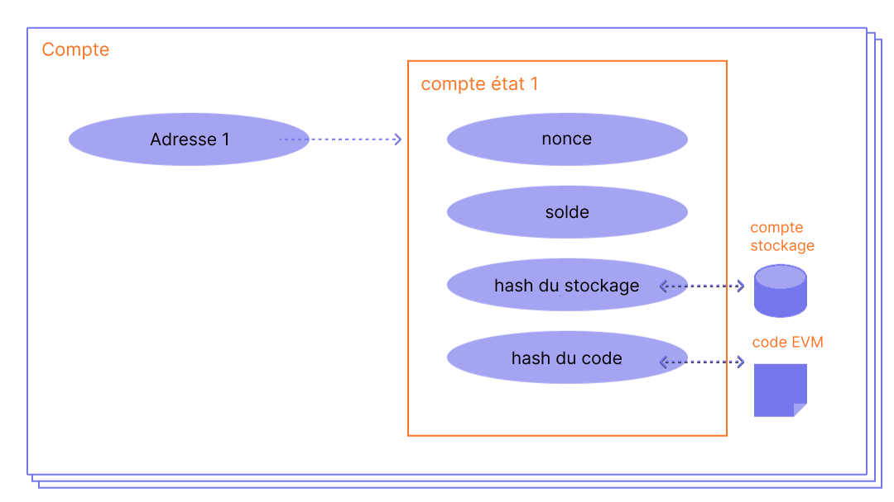

Un compte [Ethereum](/) est une entité avec un solde en ether (ETH) qui peut envoyer des messages sur Ethereum. Les comptes peuvent être contrôlés par des utilisateurs ou déployés sous forme de contrats intelligents.

## Prérequis {#prerequisites}

Pour vous aider à mieux comprendre cette page, nous vous recommandons de lire d'abord notre [introduction à Ethereum](/developers/docs/intro-to-ethereum/).

## Types de comptes {#types-of-account}

Ethereum possède deux types de comptes :

- Compte détenu par un tiers (EOA) – contrôlé par quiconque possède les clés privées
- Compte de contrat – un contrat intelligent déployé sur le réseau, contrôlé par du code. En savoir plus sur les [contrats intelligents](/developers/docs/smart-contracts/)

Les deux types de comptes ont la capacité de :

- Recevoir, détenir et envoyer des ETH et des jetons
- Interagir avec des contrats intelligents déployés

### Différences clés {#key-differences}

**Détenu par un tiers**

- La création d'un compte ne coûte rien
- Peut initier des transactions
- Les transactions entre des comptes détenus par des tiers ne peuvent être que des transferts d'ETH ou de jetons
- Composé d'une paire de clés cryptographiques : des clés publiques et privées qui contrôlent les activités du compte

**Contrat**

- La création d'un contrat a un coût car vous utilisez le stockage du réseau
- Ne peut envoyer des messages qu'en réponse à la réception d'une transaction
- Les transactions d'un compte externe vers un compte de contrat peuvent déclencher du code qui peut exécuter de nombreuses actions différentes, telles que le transfert de jetons ou même la création d'un nouveau contrat
- Les comptes de contrat n'ont pas de clés privées. Au lieu de cela, ils sont contrôlés par la logique du code du contrat intelligent

## Examen d'un compte {#an-account-examined}

Les comptes Ethereum comportent quatre champs :

- `nonce` – Un compteur qui indique le nombre de transactions envoyées depuis un compte détenu par un tiers ou le nombre de contrats créés par un compte de contrat. Une seule transaction avec un nonce donné peut être exécutée pour chaque compte, ce qui protège contre les attaques par rejeu où des transactions signées sont diffusées et réexécutées à plusieurs reprises.
- `balance` – Le nombre de Wei possédés par cette adresse. Le Wei est une dénomination de l'ETH et il y a 1e+18 Wei par ETH.
- `codeHash` – Ce hash fait référence au _code_ d'un compte sur la machine virtuelle Ethereum (EVM). Les comptes de contrat ont des fragments de code programmés qui peuvent effectuer différentes opérations. Ce code EVM est exécuté si le compte reçoit un appel de message. Il ne peut pas être modifié, contrairement aux autres champs du compte. Tous ces fragments de code sont contenus dans la base de données d'état sous leurs hashs correspondants pour une récupération ultérieure. Cette valeur de hash est connue sous le nom de codeHash. Pour les comptes détenus par des tiers, le champ codeHash est le hash d'une chaîne vide.
- `storageRoot` – Parfois connu sous le nom de hash de stockage. Un hash de 256 bits du nœud racine d'un [trie de Merkle Patricia](/developers/docs/data-structures-and-encoding/patricia-merkle-trie/) qui encode le contenu de stockage du compte (un mappage entre des valeurs entières de 256 bits), encodé dans le trie comme un mappage du hash Keccak-256 des clés entières de 256 bits vers les valeurs entières de 256 bits encodées en RLP. Ce trie encode le hash du contenu de stockage de ce compte, et est vide par défaut.


_Schéma adapté de [Ethereum EVM illustrated](https://takenobu-hs.github.io/downloads/ethereum_evm_illustrated.pdf)_

## Comptes détenus par des tiers et paires de clés {#externally-owned-accounts-and-key-pairs}

Un compte est composé d'une paire de clés cryptographiques : publique et privée. Elles aident à prouver qu'une transaction a réellement été signée par l'expéditeur et empêchent les falsifications. Votre clé privée est ce que vous utilisez pour signer des transactions, elle vous accorde donc la garde des fonds associés à votre compte. Vous ne détenez jamais vraiment de cryptomonnaie, vous détenez des clés privées – les fonds sont toujours sur le registre d'Ethereum.

Cela empêche les acteurs malveillants de diffuser de fausses transactions car vous pouvez toujours vérifier l'expéditeur d'une transaction.

Si Alice veut envoyer de l'ether de son propre compte vers le compte de Bob, Alice doit créer une demande de transaction et l'envoyer au réseau pour vérification. L'utilisation par Ethereum de la cryptographie à clé publique garantit qu'Alice peut prouver qu'elle a initialement initié la demande de transaction. Sans mécanismes cryptographiques, un adversaire malveillant, Eve, pourrait simplement diffuser publiquement une demande ressemblant à « envoyer 5 ETH du compte d'Alice au compte d'Eve », et personne ne serait en mesure de vérifier que cela ne venait pas d'Alice.

## Création de compte {#account-creation}

Lorsque vous souhaitez créer un compte, la plupart des bibliothèques vous généreront une clé privée aléatoire.

Une clé privée est composée de 64 caractères hexadécimaux et peut être chiffrée avec un mot de passe.

Exemple :

`fffffffffffffffffffffffffffffffebaaedce6af48a03bbfd25e8cd036415f`

La clé publique est générée à partir de la clé privée en utilisant l'[algorithme de signature numérique à courbe elliptique](https://wikipedia.org/wiki/Elliptic_Curve_Digital_Signature_Algorithm). Vous obtenez une adresse publique pour votre compte en prenant les 20 derniers octets du hash Keccak-256 de la clé publique et en ajoutant `0x` au début.

Cela signifie qu'un compte détenu par un tiers (EOA) a une adresse de 42 caractères (un segment de 20 octets qui correspond à 40 caractères hexadécimaux plus le préfixe `0x`).

Exemple :

`0x5e97870f263700f46aa00d967821199b9bc5a120`

L'exemple suivant montre comment utiliser un outil de signature appelé [Clef](https://geth.ethereum.org/docs/tools/clef/introduction) pour générer un nouveau compte. Clef est un outil de gestion de compte et de signature qui est fourni avec le client Ethereum, [Geth](https://geth.ethereum.org). La commande `clef newaccount` crée une nouvelle paire de clés et les enregistre dans un magasin de clés chiffré.

```
> clef newaccount --keystore <path>

Veuillez entrer un mot de passe pour le nouveau compte à créer :
> <password>

------------
INFO [10-28|16:19:09.156] Votre nouvelle clé a été générée       address=0x5e97870f263700f46aa00d967821199b9bc5a120
WARN [10-28|16:19:09.306] Veuillez sauvegarder votre fichier de clé      path=/home/user/go-ethereum/data/keystore/UTC--2022-10-28T15-19-08.000825927Z--5e97870f263700f46aa00d967821199b9bc5a120
WARN [10-28|16:19:09.306] N'oubliez pas votre mot de passe !
Compte généré 0x5e97870f263700f46aa00d967821199b9bc5a120
```

[Documentation de Geth](https://geth.ethereum.org/docs)

Il est possible de dériver de nouvelles clés publiques à partir de votre clé privée, mais vous ne pouvez pas dériver une clé privée à partir de clés publiques. Il est vital de garder vos clés privées en sécurité et, comme leur nom l'indique, **PRIVÉES**.

Vous avez besoin d'une clé privée pour signer des messages et des transactions qui produisent une signature. D'autres peuvent ensuite prendre la signature pour dériver votre clé publique, prouvant ainsi l'auteur du message. Dans votre application, vous pouvez utiliser une bibliothèque JavaScript pour envoyer des transactions au réseau.

## Comptes de contrat {#contract-accounts}

Les comptes de contrat ont également une adresse hexadécimale de 42 caractères :

Exemple :

`0x06012c8cf97bead5deae237070f9587f8e7a266d`

L'adresse du contrat est généralement donnée lorsqu'un contrat est déployé sur la chaîne de blocs Ethereum. L'adresse provient de l'adresse du créateur et du nombre de transactions envoyées depuis cette adresse (le « nonce »).

## Clés de validateur {#validators-keys}

Il existe également un autre type de clé dans Ethereum, introduit lorsqu'Ethereum est passé d'un consensus basé sur la preuve de travail (PoW) à la preuve d'enjeu (PoS). Ce sont les clés « BLS » et elles sont utilisées pour identifier les validateurs. Ces clés peuvent être agrégées efficacement pour réduire la bande passante requise pour que le réseau parvienne à un consensus. Sans cette agrégation de clés, la mise minimale pour un validateur serait beaucoup plus élevée.

[En savoir plus sur les clés de validateur](/developers/docs/consensus-mechanisms/pos/keys/).

## Une note sur les portefeuilles {#a-note-on-wallets}

Un compte n'est pas un portefeuille. Un portefeuille est une interface ou une application qui vous permet d'interagir avec votre compte Ethereum, qu'il s'agisse d'un compte détenu par un tiers ou d'un compte de contrat.

## Une démo visuelle {#a-visual-demo}

Regardez Austin vous guider à travers les fonctions de hash et les paires de clés.

<VideoWatch slug="hash-function-eth-build" />

<VideoWatch slug="key-pair-eth-build" />

## Lectures complémentaires {#further-reading}

- [Comprendre les comptes Ethereum](https://info.etherscan.com/understanding-ethereum-accounts/) - Etherscan

_Vous connaissez une ressource communautaire qui vous a aidé ? Modifiez cette page et ajoutez-la !_

## Sujets connexes {#related-topics}

- [Contrats intelligents](/developers/docs/smart-contracts/)
- [Transactions](/developers/docs/transactions/)