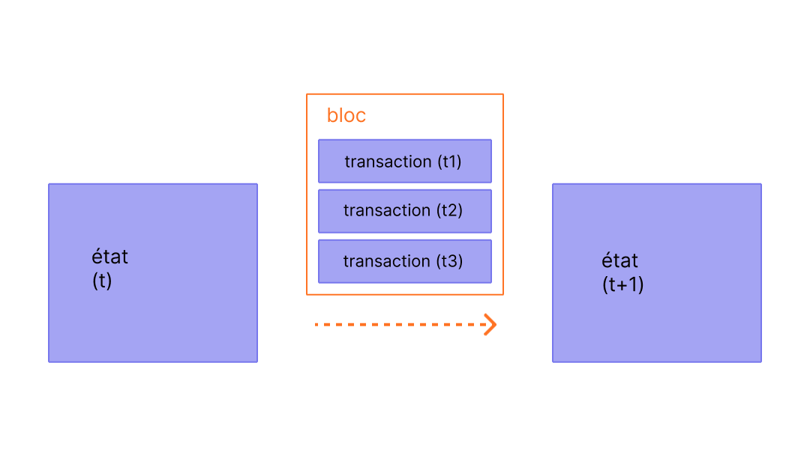

Les blocs sont des lots de transactions avec un hash du bloc précédent dans la chaîne. Cela relie les blocs entre eux (dans une chaîne) car les hashs sont dérivés cryptographiquement des données du bloc. Cela empêche la fraude, car une modification dans n'importe quel bloc de l'historique invaliderait tous les blocs suivants, puisque tous les hashs ultérieurs changeraient et que tous ceux qui exécutent la chaîne de blocs s'en rendraient compte.

## Prérequis {#prerequisites}

Les blocs sont un sujet très accessible aux débutants. Mais pour vous aider à mieux comprendre cette page, nous vous recommandons de lire d'abord [Comptes](/developers/docs/accounts/), [Transactions](/developers/docs/transactions/), et notre [introduction à Ethereum](/developers/docs/intro-to-ethereum/).

## Pourquoi des blocs ? {#why-blocks}

Pour s'assurer que tous les participants du réseau [Ethereum](/) maintiennent un état synchronisé et s'accordent sur l'historique précis des transactions, nous regroupons les transactions en blocs. Cela signifie que des dizaines (ou des centaines) de transactions sont engagées, approuvées et synchronisées en une seule fois.

_Schéma adapté de [Ethereum EVM illustrated](https://takenobu-hs.github.io/downloads/ethereum_evm_illustrated.pdf)_

En espaçant les engagements, nous donnons à tous les participants du réseau suffisamment de temps pour parvenir à un consensus : même si les requêtes de transaction se produisent des dizaines de fois par seconde, les blocs ne sont créés et engagés sur Ethereum qu'une fois toutes les douze secondes.

## Comment fonctionnent les blocs {#how-blocks-work}

Pour préserver l'historique des transactions, les blocs sont strictement ordonnés (chaque nouveau bloc créé contient une référence à son bloc parent), et les transactions au sein des blocs sont également strictement ordonnées. Sauf dans de rares cas, à tout moment, tous les participants du réseau sont d'accord sur le nombre exact et l'historique des blocs, et travaillent à regrouper les requêtes de transactions en direct actuelles dans le bloc suivant.

Une fois qu'un bloc est assemblé par un validateur sélectionné aléatoirement sur le réseau, il est propagé au reste du réseau ; tous les nœuds ajoutent ce bloc à la fin de leur chaîne de blocs, et un nouveau validateur est sélectionné pour créer le bloc suivant. Le processus exact d'assemblage des blocs et le processus d'engagement/consensus sont actuellement spécifiés par le protocole de « preuve d'enjeu (PoS) » d'Ethereum.

## Protocole de preuve d'enjeu (PoS) {#proof-of-stake-protocol}

La preuve d'enjeu (PoS) implique ce qui suit :

- Les nœuds de validation doivent staker 32 ETH dans un contrat de dépôt en tant que collatéral contre les mauvais comportements. Cela aide à protéger le réseau car une activité manifestement malhonnête entraîne la destruction d'une partie ou de la totalité de cette mise.
- Dans chaque créneau (espacé de douze secondes), un validateur est sélectionné aléatoirement pour être le proposeur de bloc. Il regroupe les transactions, les exécute et détermine un nouvel « état ». Il enveloppe ces informations dans un bloc et le transmet aux autres validateurs.
- Les autres validateurs qui entendent parler du nouveau bloc réexécutent les transactions pour s'assurer qu'ils sont d'accord avec la modification proposée de l'état global. En supposant que le bloc soit valide, ils l'ajoutent à leur propre base de données.
- Si un validateur entend parler de deux blocs en conflit pour le même créneau, il utilise son algorithme de choix de fork pour choisir celui soutenu par le plus d'ETH stakés.

[En savoir plus sur la preuve d'enjeu](/developers/docs/consensus-mechanisms/pos)

## Que contient un bloc ? {#block-anatomy}

Un bloc contient beaucoup d'informations. Au niveau le plus élevé, un bloc contient les champs suivants :

| Champ            | Description                                           |
| :--------------- | :---------------------------------------------------- |
| `slot`           | le créneau auquel appartient le bloc                         |
| `proposer_index` | l'ID du validateur proposant le bloc           |
| `parent_root`    | le hash du bloc précédent                       |
| `state_root`     | le hash racine de l'objet d'état                     |
| `body`           | un objet contenant plusieurs champs, tels que définis ci-dessous |

Le `body` du bloc contient lui-même plusieurs champs :

| Champ                | Description                                      |
| :------------------- | :----------------------------------------------- |
| `randao_reveal`      | une valeur utilisée pour sélectionner le prochain proposeur de bloc   |
| `eth1_data`          | informations sur le contrat de dépôt           |
| `graffiti`           | données arbitraires utilisées pour marquer les blocs                |
| `proposer_slashings` | liste des validateurs devant subir une réduction                 |
| `attester_slashings` | liste des attestateurs devant subir une réduction                  |
| `attestations`       | liste des attestations faites par rapport aux créneaux précédents |
| `deposits`           | liste des nouveaux dépôts vers le contrat de dépôt     |
| `voluntary_exits`    | liste des validateurs quittant le réseau           |
| `sync_aggregate`     | sous-ensemble de validateurs utilisés pour servir les clients légers |
| `execution_payload`  | transactions transmises par le client d'exécution    |

Le champ `attestations` contient une liste de toutes les attestations dans le bloc. Les attestations ont leur propre type de données qui contient plusieurs éléments d'information. Chaque attestation contient :

| Champ              | Description                                                    |
| :----------------- | :------------------------------------------------------------- |
| `aggregation_bits` | une liste des validateurs ayant participé à cette attestation    |
| `data`             | un conteneur avec plusieurs sous-champs                            |
| `signature`        | signature agrégée d'un ensemble de validateurs pour la partie `data` |

Le champ `data` dans `attestation` contient ce qui suit :

| Champ               | Description                                                     |
| :------------------ | :-------------------------------------------------------------- |
| `slot`              | le créneau auquel l'attestation se rapporte                             |
| `index`             | indices des validateurs attestant                                |
| `beacon_block_root` | le hash racine du bloc phare considéré comme la tête de la chaîne |
| `source`            | le dernier point de contrôle justifié                                   |
| `target`            | le dernier bloc limite d'époque                                 |

L'exécution des transactions dans `execution_payload` met à jour l'état global. Tous les clients réexécutent les transactions dans `execution_payload` pour s'assurer que le nouvel état correspond à celui du champ `state_root` du nouveau bloc. C'est ainsi que les clients peuvent déterminer qu'un nouveau bloc est valide et peut être ajouté en toute sécurité à leur chaîne de blocs. Le `execution payload` lui-même est un objet avec plusieurs champs. Il y a aussi un `execution_payload_header` qui contient des informations de résumé importantes sur les données d'exécution. Ces structures de données sont organisées comme suit :

Le `execution_payload_header` contient les champs suivants :

| Champ               | Description                                                         |
| :------------------ | :------------------------------------------------------------------ |
| `parent_hash`       | hash du bloc parent                                            |
| `fee_recipient`     | adresse du compte pour le paiement des frais de transaction                      |
| `state_root`        | hash racine de l'état global après application des modifications dans ce bloc |
| `receipts_root`     | hash du trie des reçus de transaction                               |
| `logs_bloom`        | structure de données contenant les journaux d'événements                                |
| `prev_randao`       | valeur utilisée dans la sélection aléatoire des validateurs                            |
| `block_number`      | le numéro du bloc actuel                                     |
| `gas_limit`         | limite de gaz autorisée dans ce bloc                                   |
| `gas_used`          | la quantité réelle de gaz utilisée dans ce bloc                         |
| `timestamp`         | le temps de bloc                                                      |
| `extra_data`        | données supplémentaires arbitraires sous forme d'octets bruts                              |
| `base_fee_per_gas`  | la valeur des frais de base                                                  |
| `block_hash`        | hash du bloc d'exécution                                             |
| `transactions_root` | hash racine des transactions dans la charge utile                        |
| `withdrawal_root`   | hash racine des retraits dans la charge utile                         |

Le `execution_payload` lui-même contient ce qui suit (remarquez que c'est identique à l'en-tête, sauf qu'au lieu du hash racine des transactions, il inclut la liste réelle des transactions et les informations de retrait) :

| Champ              | Description                                                         |
| :----------------- | :------------------------------------------------------------------ |
| `parent_hash`      | hash du bloc parent                                            |
| `fee_recipient`    | adresse du compte pour le paiement des frais de transaction                      |
| `state_root`       | hash racine de l'état global après application des modifications dans ce bloc |
| `receipts_root`    | hash du trie des reçus de transaction                               |
| `logs_bloom`       | structure de données contenant les journaux d'événements                                |
| `prev_randao`      | valeur utilisée dans la sélection aléatoire des validateurs                            |
| `block_number`     | le numéro du bloc actuel                                     |
| `gas_limit`        | limite de gaz autorisée dans ce bloc                                   |
| `gas_used`         | la quantité réelle de gaz utilisée dans ce bloc                         |
| `timestamp`        | le temps de bloc                                                      |
| `extra_data`       | données supplémentaires arbitraires sous forme d'octets bruts                              |
| `base_fee_per_gas` | la valeur des frais de base                                                  |
| `block_hash`       | hash du bloc d'exécution                                             |
| `transactions`     | liste des transactions à exécuter                                 |
| `withdrawals`      | liste des objets de retrait                                          |

La liste `withdrawals` contient des objets `withdrawal` structurés de la manière suivante :

| Champ            | Description                        |
| :--------------- | :--------------------------------- |
| `address`        | adresse du compte qui a effectué le retrait |
| `amount`         | montant du retrait                  |
| `index`          | valeur de l'indice de retrait             |
| `validatorIndex` | valeur de l'indice du validateur              |

## Temps de bloc {#block-time}

Le temps de bloc fait référence au temps séparant les blocs. Dans Ethereum, le temps est divisé en unités de douze secondes appelées « créneaux ». Dans chaque créneau, un seul validateur est sélectionné pour proposer un bloc. En supposant que tous les validateurs soient en ligne et pleinement fonctionnels, il y aura un bloc dans chaque créneau, ce qui signifie que le temps de bloc est de 12 s. Cependant, il arrive parfois que des validateurs soient hors ligne lorsqu'ils sont appelés à proposer un bloc, ce qui signifie que les créneaux peuvent parfois rester vides.

Cette implémentation diffère des systèmes basés sur la preuve de travail (PoW) où les temps de bloc sont probabilistes et ajustés par la difficulté de minage cible du protocole. Le [temps de bloc moyen](https://etherscan.io/chart/blocktime) d'Ethereum en est un parfait exemple, où la transition de la preuve de travail à la preuve d'enjeu peut être clairement déduite en fonction de la régularité du nouveau temps de bloc de 12 s.

## Taille de bloc {#block-size}

Une dernière remarque importante est que les blocs eux-mêmes ont une taille limitée. Chaque bloc a une taille cible de 30 millions de gaz, mais la taille des blocs augmentera ou diminuera en fonction des demandes du réseau, jusqu'à la limite de bloc de 60 millions de gaz (2x la taille cible du bloc). La limite de gaz du bloc peut être ajustée à la hausse ou à la baisse d'un facteur de 1/1024 par rapport à la limite de gaz du bloc précédent. Par conséquent, les validateurs peuvent modifier la limite de gaz du bloc par consensus. La quantité totale de gaz dépensée par toutes les transactions du bloc doit être inférieure à la limite de gaz du bloc. C'est important car cela garantit que les blocs ne peuvent pas être arbitrairement grands. Si les blocs pouvaient être arbitrairement grands, les nœuds complets moins performants cesseraient progressivement de pouvoir suivre le réseau en raison des exigences d'espace et de vitesse. Plus le bloc est grand, plus la puissance de calcul requise pour les traiter à temps pour le créneau suivant est importante. Il s'agit d'une force centralisatrice, à laquelle on résiste en plafonnant la taille des blocs.

## Complément d'information {#further-reading}

_Vous connaissez une ressource communautaire qui vous a aidé ? Modifiez cette page et ajoutez-la !_

## Sujets connexes {#related-topics}

- [Transactions](/developers/docs/transactions/)
- [Gaz](/developers/docs/gas/)
- [Preuve d'enjeu (PoS)](/developers/docs/consensus-mechanisms/pos)