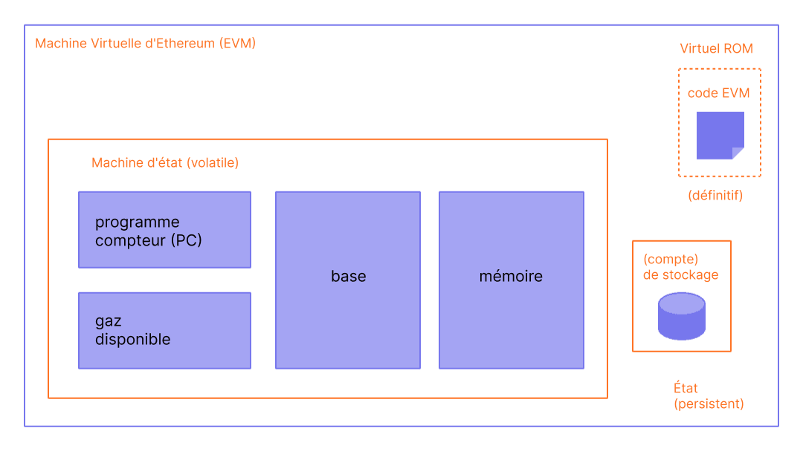
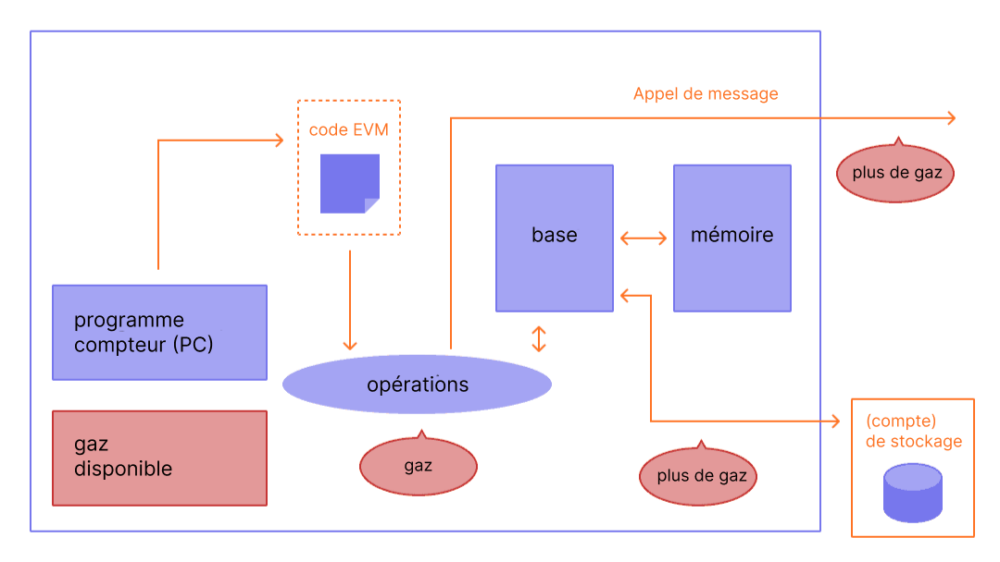

La machine virtuelle Ethereum (EVM) est un environnement virtuel décentralisé qui exécute le code de manière cohérente et sécurisée sur tous les nœuds Ethereum. Les nœuds exécutent l'EVM pour exécuter des contrats intelligents, en utilisant le "[gaz](/developers/docs/gas/)" pour mesurer l'effort de calcul requis pour les [opérations](/developers/docs/evm/opcodes/), assurant ainsi une allocation efficace des ressources et la sécurité du réseau.

## Prérequis {#prerequisites}

Une certaine familiarité avec la terminologie courante en informatique, telle que les [octets](https://wikipedia.org/wiki/Byte), la [mémoire](https://wikipedia.org/wiki/Computer_memory) et une [pile](https://wikipedia.org/wiki/Stack_\(abstract_data_type\)), est nécessaire pour comprendre l'EVM. Il serait également utile d'être à l'aise avec les concepts de la cryptographie et de la blockchain, comme les [fonctions de hachage](https://wikipedia.org/wiki/Cryptographic_hash_function) et l'[arbre de Merkle](https://wikipedia.org/wiki/Merkle_tree).

## Du registre à la machine d'état {#from-ledger-to-state-machine}

L'analogie avec un « registre distribué » est souvent utilisée pour décrire les blockchains comme Bitcoin, qui permettent l'existence d'une monnaie décentralisée utilisant des outils de cryptographie fondamentaux. Le registre tient un enregistrement des activités devant se conformer à un ensemble de règles, celles-ci régissant ce que quelqu'un peut, ou ne peut pas faire, pour modifier le registre. Par exemple, une adresse Bitcoin ne peut pas dépenser plus de Bitcoin qu'elle n'en a reçu. Ces règles sont appliquées à toutes les transactions sur Bitcoin et de nombreuses autres blockchains.

Alors qu'Ethereum dispose de sa propre cryptomonnaie native (l'éther) qui suit presque exactement les mêmes règles intuitives, il offre également une fonction beaucoup plus puissante : les [contrats intelligents](/developers/docs/smart-contracts/). Pour cette fonctionnalité plus complexe, une analogie plus sophistiquée est nécessaire. Au lieu d'être un registre distribué, Ethereum est une [machine d'état](https://wikipedia.org/wiki/Finite-state_machine) distribuée. L'état d'Ethereum est une grande structure de données qui contient non seulement tous les comptes et les soldes, mais aussi un _état de la machine_, qui peut changer de bloc en bloc selon un ensemble de règles prédéfinies, et qui peut exécuter du code machine arbitraire. Les règles spécifiques de changement d'état d'un bloc à l'autre sont définies par l'EVM.


_Diagramme adapté de [Ethereum EVM illustrated](https://takenobu-hs.github.io/downloads/ethereum_evm_illustrated.pdf)_

## La fonction de transition d'état d'Ethereum {#the-ethereum-state-transition-function}

L'EVM se comporte comme une fonction mathématique : avec des données en entrée, elle produit une sortie déterministe. Il est donc très utile de décrire plus formellement Ethereum comme ayant une **fonction de transition d'état** :

```
Y(S, T) = S'
```

Étant donné un ancien état valide `(S)` et un nouvel ensemble de transactions valides `(T)`, la fonction de transition d'état d'Ethereum `Y(S, T)` produit un nouvel état de sortie valide `S'`

### État {#state}

Dans le contexte d'Ethereum, l'état est une énorme structure de données appelée [arbre de Merkle-Patricia modifié](/developers/docs/data-structures-and-encoding/patricia-merkle-trie/), qui conserve tous les [comptes](/developers/docs/accounts/) liés par des hachages et réductibles à un unique hachage racine stocké sur la blockchain.

### Transactions {#transactions}

Les transactions sont des instructions signées cryptographiquement provenant des comptes. Il existe deux types de transactions : celles qui donnent lieu à appels de messages et celles qui débouchent sur la création de contrats.

La création de contrat entraîne la création d'un nouveau compte de contrat contenant le bytecode du [contrat intelligent](/developers/docs/smart-contracts/anatomy/) compilé. Chaque fois qu'un autre compte effectue un appel de message à ce contrat, il exécute son bytecode.

## Instructions de l'EVM {#evm-instructions}

L'EVM s'exécute comme une [machine à pile](https://wikipedia.org/wiki/Stack_machine) avec une profondeur de 1024 éléments. Chaque élément est un mot de 256 bits qui a été choisi pour la facilité d'utilisation avec la cryptographie 256 bits (comme les hachages Keccak-256 ou les signatures secp256k1).

Pendant l'exécution, l'EVM maintient une _mémoire_ transitoire (sous la forme d'un tableau d'octets adressé par mot), qui ne persiste pas entre les transactions.

### Stockage transitoire

Le stockage transitoire est un magasin clé-valeur par transaction accessible via les codes d'opérations `TSTORE` et `TLOAD`. Il persiste à travers tous les appels internes au cours de la même transaction, mais il est effacé à la fin de celle-ci. Contrairement à la mémoire, le stockage transitoire est modélisé comme faisant partie de l'état de l'EVM plutôt que du cadre d'exécution, mais il n'est pas enregistré dans l'état global. Le stockage transitoire permet un partage d'état temporaire économe en gaz entre les appels internes au cours d'une transaction.

### Stockage

Les contrats contiennent un arbre de Merkle-Patricia de _stockage_ (sous la forme d'un tableau de mots adressables par mot), associé au compte en question et faisant partie de l'état global. Ce stockage persistant diffère du stockage transitoire, qui n'est disponible que pour la durée d'une seule transaction et ne fait pas partie de l'arbre de stockage persistant du compte.

### Codes d'opérations

Le bytecode de contrat intelligent compilé s'exécute sous la forme d'un certain nombre de [codes d'opérations](/developers/docs/evm/opcodes) de l'EVM, qui effectuent des opérations de pile standard comme `XOR`, `AND`, `ADD`, `SUB`, etc. L'EVM met également en œuvre un certain nombre d'opérations de pile spécifiques à la blockchain, telles que `ADDRESS`, `BALANCE`, `BLOCKHASH`, etc. L'ensemble de codes d'opérations inclut également `TSTORE` et `TLOAD`, qui donnent accès au stockage transitoire.


_Diagrammes adaptés de [Ethereum EVM illustrated](https://takenobu-hs.github.io/downloads/ethereum_evm_illustrated.pdf)_

## Implémentations de l'EVM {#evm-implementations}

Toutes les implémentations de l'EVM doivent respecter les spécifications décrites dans les pages jaunes Ethereum.

Au cours des dix ans d'histoire d'Ethereum, l'EVM a fait l'objet de plusieurs révisions et il existe plusieurs implémentations de l'EVM dans divers langages de programmation.

Les [clients d'exécution d'Ethereum](/developers/docs/nodes-and-clients/#execution-clients) incluent une implémentation de l'EVM. Il existe également plusieurs implémentations autonomes, telles que :

- [Py-EVM](https://github.com/ethereum/py-evm) - _Python_
- [evmone](https://github.com/ethereum/evmone) - _C++_
- [ethereumjs-vm](https://github.com/ethereumjs/ethereumjs-vm) - _JavaScript_
- [revm](https://github.com/bluealloy/revm) - _Rust_

## En savoir plus {#further-reading}

- [Le Yellowpaper d'Ethereum](https://ethereum.github.io/yellowpaper/paper.pdf)
- [Jellopaper alias KEVM : Sémantique de l'EVM en K](https://jellopaper.org/)
- [Le Beigepaper](https://github.com/chronaeon/beigepaper)
- [Codes d'opérations de la Machine Virtuelle Ethereum](https://www.ethervm.io/)
- [Référence interactive des codes d'opérations de la Machine Virtuelle Ethereum](https://www.evm.codes/)
- [Une brève introduction dans la documentation de Solidity](https://docs.soliditylang.org/en/latest/introduction-to-smart-contracts.html#index-6)
- [Mastering Ethereum - La Machine Virtuelle Ethereum](https://github.com/ethereumbook/ethereumbook/blob/openedition/13evm.asciidoc)

## Sujets connexes {#related-topics}

- [Gaz](/developers/docs/gas/)
