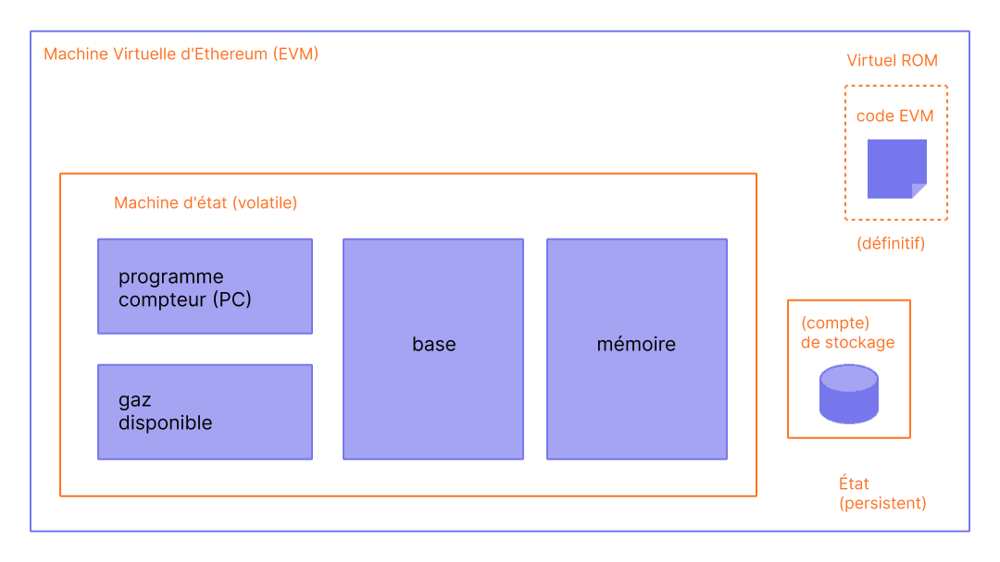

La machine virtuelle Ethereum (EVM) est un environnement virtuel décentralisé qui exécute du code de manière cohérente et sécurisée sur tous les nœuds [Ethereum](/). Les nœuds exécutent l'EVM pour exécuter des contrats intelligents, en utilisant du « [gaz](/developers/docs/gas/) » pour mesurer l'effort de calcul requis pour les [opérations](/developers/docs/evm/opcodes/), garantissant ainsi une allocation efficace des ressources et la sécurité du réseau.

## Prérequis {#prerequisites}

Une certaine familiarité avec la terminologie courante en informatique, telle que les [octets](https://wikipedia.org/wiki/Byte), la [mémoire](https://wikipedia.org/wiki/Computer_memory) et une [pile](<https://wikipedia.org/wiki/Stack_(abstract_data_type)>), est nécessaire pour comprendre l'EVM. Il serait également utile d'être à l'aise avec les concepts de cryptographie et de chaîne de blocs tels que les [fonctions de hash](https://wikipedia.org/wiki/Cryptographic_hash_function) et l'[arbre de Merkle](https://wikipedia.org/wiki/Merkle_tree).

## Du registre à la machine à états {#from-ledger-to-state-machine}

L'analogie d'un « registre distribué » est souvent utilisée pour décrire les chaînes de blocs comme Bitcoin, qui permettent une cryptomonnaie décentralisée en utilisant des outils fondamentaux de cryptographie. Le registre conserve un historique d'activité qui doit respecter un ensemble de règles régissant ce que quelqu'un peut et ne peut pas faire pour modifier le registre. Par exemple, une adresse Bitcoin ne peut pas dépenser plus de Bitcoin qu'elle n'en a reçu précédemment. Ces règles sous-tendent toutes les transactions sur Bitcoin et de nombreuses autres chaînes de blocs.

Bien qu'Ethereum possède sa propre cryptomonnaie native (l'ether) qui suit presque exactement les mêmes règles intuitives, il permet également une fonction beaucoup plus puissante : les [contrats intelligents](/developers/docs/smart-contracts/). Pour cette fonctionnalité plus complexe, une analogie plus sophistiquée est requise. Au lieu d'un registre distribué, Ethereum est une [machine à états](https://wikipedia.org/wiki/Finite-state_machine) distribuée. L'état d'Ethereum est une vaste structure de données qui contient non seulement tous les comptes et soldes, mais aussi un _état de la machine_, qui peut changer de bloc en bloc selon un ensemble de règles prédéfinies, et qui peut exécuter du code machine arbitraire. Les règles spécifiques de changement d'état de bloc en bloc sont définies par l'EVM.


_Schéma adapté de [Ethereum EVM illustrated](https://takenobu-hs.github.io/downloads/ethereum_evm_illustrated.pdf)_

## La fonction de transition d'état d'Ethereum {#the-ethereum-state-transition-function}

L'EVM se comporte comme le ferait une fonction mathématique : étant donné une entrée, elle produit une sortie déterministe. Il est donc très utile de décrire plus formelnellement Ethereum comme ayant une **fonction de transition d'état** :

```
Y(S, T)= S'
```

Étant donné un ancien état valide `(S)` et un nouvel ensemble de transactions valides `(T)`, la fonction de transition d'état d'Ethereum `Y(S, T)` produit un nouvel état de sortie valide `S'`

### État {#state}

Dans le contexte d'Ethereum, l'état est une énorme structure de données appelée [trie de Merkle Patricia modifié](/developers/docs/data-structures-and-encoding/patricia-merkle-trie/), qui maintient tous les [comptes](/developers/docs/accounts/) liés par des hashs et réductibles à un seul hash racine stocké sur la chaîne de blocs.

### Transactions {#transactions}

Les transactions sont des instructions signées cryptographiquement provenant de comptes. Il existe deux types de transactions : celles qui aboutissent à des appels de message et celles qui aboutissent à la création de contrat.

La création de contrat aboutit à la création d'un nouveau compte de contrat contenant le bytecode compilé du [contrat intelligent](/developers/docs/smart-contracts/anatomy/). Chaque fois qu'un autre compte effectue un appel de message vers ce contrat, il exécute son bytecode.

## Instructions de l'EVM {#evm-instructions}

L'EVM s'exécute comme une [machine à pile](https://wikipedia.org/wiki/Stack_machine) d'une profondeur de 1024 éléments. Chaque élément est un mot de 256 bits, ce qui a été choisi pour la facilité d'utilisation avec la cryptographie 256 bits (comme les hashs Keccak-256 ou les signatures secp256k1).

Pendant l'exécution, l'EVM maintient une _mémoire_ transitoire (sous forme de tableau d'octets adressé par mot), qui ne persiste pas entre les transactions.

### Stockage transitoire {#transient-storage}

Le stockage transitoire est un magasin clé-valeur par transaction accessible via les codes d'opération `TSTORE` et `TLOAD`. Il persiste à travers tous les appels internes au cours de la même transaction, mais est effacé à la fin de la transaction. Contrairement à la mémoire, le stockage transitoire est modélisé comme faisant partie de l'état de l'EVM plutôt que du cadre d'exécution, mais il n'est pas validé dans l'état global. Le stockage transitoire permet un partage d'état temporaire économe en gaz entre les appels internes lors d'une transaction.

### Stockage {#storage}

Les contrats contiennent un trie de _stockage_ de Merkle Patricia (sous forme de tableau de mots adressable par mot), associé au compte en question et faisant partie de l'état global. Ce stockage persistant diffère du stockage transitoire, qui n'est disponible que pour la durée d'une seule transaction et ne fait pas partie du trie de stockage persistant du compte.

### Codes d'opération {#opcodes}

Le bytecode de contrat intelligent compilé s'exécute sous la forme d'un certain nombre de [codes d'opération](/developers/docs/evm/opcodes) de l'EVM, qui effectuent des opérations de pile standard telles que `XOR`, `AND`, `ADD`, `SUB`, etc. L'EVM implémente également un certain nombre d'opérations de pile spécifiques à la chaîne de blocs, telles que `ADDRESS`, `BALANCE`, `BLOCKHASH`, etc. L'ensemble de codes d'opération comprend également `TSTORE` et `TLOAD`, qui fournissent un accès au stockage transitoire.


_Schémas adaptés de [Ethereum EVM illustrated](https://takenobu-hs.github.io/downloads/ethereum_evm_illustrated.pdf)_

## Implémentations de l'EVM {#evm-implementations}

Toutes les implémentations de l'EVM doivent respecter les spécifications décrites dans le livre jaune d'Ethereum.

Au cours des dix années d'histoire d'Ethereum, l'EVM a subi plusieurs révisions, et il existe plusieurs implémentations de l'EVM dans divers langages de programmation.

Les [clients d'exécution Ethereum](/developers/docs/nodes-and-clients/#execution-clients) incluent une implémentation de l'EVM. De plus, il existe de multiples implémentations autonomes, notamment :

- [Py-EVM](https://github.com/ethereum/py-evm) - _Python_
- [evmone](https://github.com/ethereum/evmone) - _C++_
- [ethereumjs-vm](https://github.com/ethereumjs/ethereumjs-vm) - _JavaScript_
- [revm](https://github.com/bluealloy/revm) - _Rust_

## Complément d'information {#further-reading}

- [Livre jaune d'Ethereum](https://ethereum.github.io/yellowpaper/paper.pdf)
- [Jellopaper alias KEVM : Sémantique de l'EVM en K](https://jellopaper.org/)
- [Le Beigepaper](https://github.com/chronaeon/beigepaper)
- [Codes d'opération de la machine virtuelle Ethereum](https://www.ethervm.io/)
- [Référence interactive des codes d'opération de la machine virtuelle Ethereum](https://www.evm.codes/)
- [Une brève introduction dans la documentation de Solidity](https://docs.soliditylang.org/en/latest/introduction-to-smart-contracts.html#index-6)
- [Mastering Ethereum - La machine virtuelle Ethereum](https://github.com/ethereumbook/ethereumbook/blob/openedition/13evm.asciidoc)

## Sujets connexes {#related-topics}

- [Gaz](/developers/docs/gas/)

## Tutoriels : Machine virtuelle Ethereum (EVM) / Codes d'opération sur Ethereum {#tutorials}

- [Comprendre les spécifications de l'EVM du livre jaune](/developers/tutorials/yellow-paper-evm/) _– Une visite guidée des spécifications formelles de l'EVM issues du livre jaune d'Ethereum._
- [Rétro-ingénierie d'un contrat](/developers/tutorials/reverse-engineering-a-contract/) _– Comment faire de la rétro-ingénierie sur un contrat intelligent compilé en utilisant les codes d'opération de l'EVM._