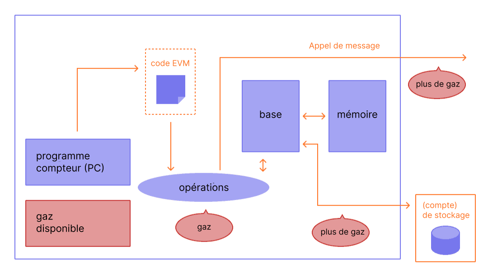
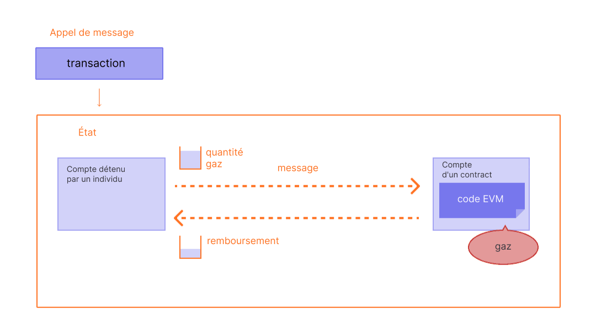

Le gaz est essentiel au réseau [Ethereum](/). C'est le carburant qui lui permet de fonctionner, de la même manière qu'une voiture a besoin d'essence pour rouler.

## Prérequis {#prerequisites}

Pour mieux comprendre cette page, nous vous recommandons de lire d'abord ce qui concerne les [transactions](/developers/docs/transactions/) et l'[EVM](/developers/docs/evm/).

## Qu'est-ce que le gaz ? {#what-is-gas}

Le gaz désigne l'unité qui mesure la quantité d'effort de calcul nécessaire pour exécuter des opérations spécifiques sur le réseau Ethereum.

Étant donné que chaque transaction Ethereum nécessite des ressources de calcul pour s'exécuter, ces ressources doivent être payées pour garantir qu'Ethereum n'est pas vulnérable au spam et ne peut pas rester bloqué dans des boucles de calcul infinies. Le paiement du calcul s'effectue sous la forme de frais de gaz.

Les frais de gaz correspondent à **la quantité de gaz utilisée pour effectuer une opération, multipliée par le coût par unité de gaz**. Les frais sont payés, que la transaction réussisse ou échoue.

_Schéma adapté de [Ethereum EVM illustrated](https://takenobu-hs.github.io/downloads/ethereum_evm_illustrated.pdf)_

Les frais de gaz doivent être payés dans la monnaie native d'Ethereum, l'ether (ETH). Les prix du gaz sont généralement indiqués en gwei, qui est une dénomination de l'ETH. Chaque gwei est égal à un milliardième d'ETH (0,000000001 ETH ou 10-9 ETH).

Par exemple, au lieu de dire que votre gaz coûte 0,000000001 ether, vous pouvez dire que votre gaz coûte 1 gwei.

Le mot « gwei » est une contraction de « giga-wei », signifiant « un milliard de Wei ». Un gwei est égal à un milliard de Wei. Le Wei lui-même (nommé d'après [Wei Dai](https://wikipedia.org/wiki/Wei_Dai), créateur de [b-money](https://www.investopedia.com/terms/b/bmoney.asp)) est la plus petite unité d'ETH.

## Comment les frais de gaz sont-ils calculés ? {#how-are-gas-fees-calculated}

Vous pouvez définir la quantité de gaz que vous êtes prêt à payer lorsque vous soumettez une transaction. En offrant une certaine quantité de gaz, vous enchérissez pour que votre transaction soit incluse dans le prochain bloc. Si vous offrez trop peu, les validateurs sont moins susceptibles de choisir votre transaction pour l'inclure, ce qui signifie que votre transaction peut s'exécuter en retard ou pas du tout. Si vous offrez trop, vous risquez de gaspiller des ETH. Alors, comment savoir combien payer ?

Le gaz total que vous payez est divisé en deux composantes : les `base fee` (frais de base) et les `priority fee` (frais de priorité).

Les `base fee` sont définis par le protocole — vous devez payer au moins ce montant pour que votre transaction soit considérée comme valide. Les `priority fee` sont des frais de priorité que vous ajoutez aux frais de base pour rendre votre transaction attrayante pour les validateurs afin qu'ils la choisissent pour l'inclure dans le prochain bloc.

Une transaction qui ne paie que les `base fee` est techniquement valide mais peu susceptible d'être incluse car elle n'offre aucune incitation aux validateurs à la choisir plutôt qu'une autre transaction. Les « bons » `priority` sont déterminés par l'utilisation du réseau au moment où vous envoyez votre transaction — s'il y a beaucoup de demande, vous devrez peut-être définir vos `priority` plus haut, mais lorsqu'il y a moins de demande, vous pouvez payer moins.

Par exemple, disons que Jordan doit payer 1 ETH à Taylor. Un transfert d'ETH nécessite 21 000 unités de gaz, et les frais de base sont de 10 gwei. Jordan inclut des frais de priorité de 2 gwei.

Les frais totaux seraient désormais égaux à :

`units of gas used * (base fee + priority fee)`

où les `base fee` sont une valeur définie par le protocole et les `priority fee` sont une valeur définie par l'utilisateur comme frais de priorité pour le validateur.

par ex., `21,000 * (10 + 2) = 252,000 gwei` (0,000252 ETH).

Lorsque Jordan envoie l'argent, 1,000252 ETH seront déduits du compte de Jordan. Taylor sera crédité de 1,0000 ETH. Le validateur reçoit les frais de priorité de 0,000042 ETH. Les `base fee` de 0,00021 ETH sont brûlés.

### Frais de base {#base-fee}

Chaque bloc a des frais de base qui agissent comme un prix de réserve. Pour être éligible à l'inclusion dans un bloc, le prix offert par gaz doit au moins être égal aux frais de base. Les frais de base sont calculés indépendamment du bloc actuel et sont plutôt déterminés par les blocs qui le précèdent, ce qui rend les frais de transaction plus prévisibles pour les utilisateurs. Lorsque le bloc est créé, ces **frais de base sont « brûlés »**, les retirant de la circulation.

Les frais de base sont calculés par une formule qui compare la taille du bloc précédent (la quantité de gaz utilisée pour toutes les transactions) avec la taille cible (la moitié de la limite de gaz). Les frais de base augmenteront ou diminueront d'un maximum de 12,5 % par bloc si la taille du bloc cible est respectivement supérieure ou inférieure à la cible. Cette croissance exponentielle rend économiquement non viable le maintien d'une taille de bloc élevée indéfiniment.

| Numéro de bloc | Gaz inclus | Augmentation des frais | Frais de base actuels |
| ------------ | -----------: | -----------: | ---------------: |
| 1            |          18M |           0% |         100 gwei |
| 2            |          36M |           0% |         100 gwei |
| 3            |          36M |        12,5 % |       112,5 gwei |
| 4            |          36M |        12,5 % |       126,6 gwei |
| 5            |          36M |        12,5 % |       142,4 gwei |
| 6            |          36M |        12,5 % |       160,2 gwei |
| 7            |          36M |        12,5 % |       180,2 gwei |
| 8            |          36M |        12,5 % |       202,7 gwei |

Dans le tableau ci-dessus, un exemple est présenté en utilisant 36 millions comme limite de gaz. En suivant cet exemple, pour créer une transaction sur le bloc numéro 9, un portefeuille fera savoir à l'utilisateur avec certitude que les **frais de base maximum** à ajouter au prochain bloc sont de `current base fee * 112.5%` ou `202.7 gwei * 112.5% = 228.1 gwei`.

Il est également important de noter qu'il est peu probable que nous observions des pics prolongés de blocs pleins en raison de la vitesse à laquelle les frais de base augmentent avant un bloc plein.

| Numéro de bloc | Gaz inclus | Augmentation des frais | Frais de base actuels |
| ------------ | -----------: | -----------: | ---------------: |
| 30           |          36M |        12,5 % |      2705,6 gwei |
| ...          |          ... |        12,5 % |              ... |
| 50           |          36M |        12,5 % |     28531,3 gwei |
| ...          |          ... |        12,5 % |              ... |
| 100          |          36M |        12,5 % |  10302608,6 gwei |

### Frais de priorité {#priority-fee}

Les frais de priorité incitent les validateurs à maximiser le nombre de transactions dans un bloc, contraints uniquement par la limite de gaz du bloc. Sans frais de priorité, un validateur rationnel pourrait inclure moins de transactions — voire aucune — sans aucune pénalité directe sur la couche d'exécution ou la couche de consensus, car les récompenses de staking sont indépendantes du nombre de transactions dans un bloc. De plus, les frais de priorité permettent aux utilisateurs de surenchérir sur les autres pour obtenir la priorité au sein du même bloc, signalant ainsi efficacement l'urgence. 

### Frais maximum {#maxfee}

Pour exécuter une transaction sur le réseau, les utilisateurs peuvent spécifier une limite maximale qu'ils sont prêts à payer pour que leur transaction soit exécutée. Ce paramètre facultatif est connu sous le nom de `maxFeePerGas` (frais maximum). Pour qu'une transaction soit exécutée, les frais maximum doivent dépasser la somme des frais de base et des frais de priorité. L'expéditeur de la transaction est remboursé de la différence entre les frais maximum et la somme des frais de base et des frais de priorité.

### Taille de bloc {#block-size}

Chaque bloc a une taille cible correspondant à la moitié de la limite de gaz actuelle, mais la taille des blocs augmentera ou diminuera en fonction de la demande du réseau, jusqu'à ce que la limite du bloc soit atteinte (2x la taille de bloc cible). Le protocole atteint une taille de bloc moyenne d'équilibre à la cible grâce au processus de _tâtonnement_. Cela signifie que si la taille du bloc est supérieure à la taille de bloc cible, le protocole augmentera les frais de base pour le bloc suivant. De même, le protocole diminuera les frais de base si la taille du bloc est inférieure à la taille de bloc cible.

Le montant dont les frais de base sont ajustés est proportionnel à l'écart entre la taille du bloc actuel et la cible. Il s'agit d'un calcul linéaire allant de -12,5 % pour un bloc vide, 0 % à la taille cible, jusqu'à +12,5 % pour un bloc atteignant la limite de gaz. La limite de gaz peut fluctuer au fil du temps en fonction des signaux des validateurs, ainsi que via les mises à niveau du réseau. Vous pouvez [consulter l'évolution de la limite de gaz au fil du temps ici](https://eth.blockscout.com/stats/averageGasLimit?interval=threeMonths).

[En savoir plus sur les blocs](/developers/docs/blocks/)

### Calculer les frais de gaz en pratique {#calculating-fees-in-practice}

Vous pouvez indiquer explicitement combien vous êtes prêt à payer pour faire exécuter votre transaction. Cependant, la plupart des fournisseurs de portefeuilles définiront automatiquement des frais de transaction recommandés (frais de base + frais de priorité recommandés) pour réduire la complexité imposée à leurs utilisateurs.

## Pourquoi les frais de gaz existent-ils ? {#why-do-gas-fees-exist}

En bref, les frais de gaz aident à maintenir la sécurité du réseau Ethereum. En exigeant des frais pour chaque calcul exécuté sur le réseau, nous empêchons les acteurs malveillants de spammer le réseau. Afin d'éviter les boucles infinies accidentelles ou hostiles ou tout autre gaspillage de calcul dans le code, chaque transaction est tenue de définir une limite au nombre d'étapes de calcul d'exécution de code qu'elle peut utiliser. L'unité fondamentale de calcul est le « gaz ».

Bien qu'une transaction inclue une limite, tout gaz non utilisé dans une transaction est restitué à l'utilisateur (par ex., `max fee - (base fee + tip)` est restitué).

_Schéma adapté de [Ethereum EVM illustrated](https://takenobu-hs.github.io/downloads/ethereum_evm_illustrated.pdf)_

## Qu'est-ce que la limite de gaz ? {#what-is-gas-limit}

La limite de gaz désigne la quantité maximale de gaz que vous êtes prêt à consommer pour une transaction. Les transactions plus complexes impliquant des [contrats intelligents](/developers/docs/smart-contracts/) nécessitent plus de travail de calcul, elles requièrent donc une limite de gaz plus élevée qu'un simple paiement. Un transfert d'ETH standard nécessite une limite de gaz de 21 000 unités de gaz.

Par exemple, si vous fixez une limite de gaz de 50 000 pour un simple transfert d'ETH, l'EVM consommera 21 000, et vous récupérerez les 29 000 restants. Cependant, si vous spécifiez trop peu de gaz, par exemple, une limite de gaz de 20 000 pour un simple transfert d'ETH, la transaction échouera pendant la phase de validation. Elle sera rejetée avant d'être incluse dans un bloc, et aucun gaz ne sera consommé. D'un autre côté, si une transaction manque de gaz pendant l'exécution (par ex., un contrat intelligent utilise tout le gaz à mi-chemin), l'EVM annulera toutes les modifications, mais tout le gaz fourni sera quand même consommé pour le travail effectué.

## Pourquoi les frais de gaz peuvent-ils devenir si élevés ? {#why-can-gas-fees-get-so-high}

Les frais de gaz élevés sont dus à la popularité d'Ethereum. S'il y a trop de demande, les utilisateurs doivent offrir des montants de frais de priorité plus élevés pour essayer de surenchérir sur les transactions des autres utilisateurs. Des frais de priorité plus élevés peuvent augmenter les chances que votre transaction soit incluse dans le prochain bloc. De plus, les applications de contrats intelligents plus complexes peuvent effectuer de nombreuses opérations pour prendre en charge leurs fonctions, ce qui leur fait consommer beaucoup de gaz.

## Initiatives pour réduire les coûts du gaz {#initiatives-to-reduce-gas-costs}

Les [mises à niveau de mise à l'échelle](/roadmap/) d'Ethereum devraient à terme résoudre certains des problèmes de frais de gaz, ce qui permettra à son tour à la plateforme de traiter des milliers de transactions par seconde et de passer à l'échelle mondiale.

La mise à l'échelle de couche 2 (l2) est une initiative principale pour grandement améliorer les coûts du gaz, l'expérience utilisateur et la mise à l'échelle.

[En savoir plus sur la mise à l'échelle de couche 2 (l2)](/developers/docs/scaling/#layer-2-scaling)

## Surveiller les frais de gaz {#monitoring-gas-fees}

Si vous souhaitez surveiller les prix du gaz, afin de pouvoir envoyer vos ETH pour moins cher, vous pouvez utiliser de nombreux outils différents tels que :

- [Etherscan](https://etherscan.io/gastracker) _Estimateur de prix du gaz de transaction_
- [Blockscout](https://eth.blockscout.com/gas-tracker) _Estimateur open source de prix du gaz de transaction_
- [ETH Gas Tracker](https://www.ethgastracker.com/) _Surveillez et suivez les prix du gaz sur Ethereum et les L2 pour réduire les frais de transaction et économiser de l'argent_
- [Blocknative ETH Gas Estimator](https://chrome.google.com/webstore/detail/blocknative-eth-gas-estim/ablbagjepecncofimgjmdpnhnfjiecfm) _Extension Chrome d'estimation de gaz prenant en charge à la fois les transactions héritées de Type 0 et les transactions EIP-1559 de Type 2._
- [Cryptoneur Gas Fees Calculator](https://www.cryptoneur.xyz/gas-fees-calculator) _Calculez les frais de gaz dans votre devise locale pour différents types de transactions sur le Réseau principal, Arbitrum et Polygon._

## Outils connexes {#related-tools}

- [Plateforme de gaz de Blocknative](https://www.blocknative.com/gas) _API d'estimation de gaz alimentée par la plateforme mondiale de données de mempool de Blocknative_
- [Gas Network](https://gas.network) Oracles de gaz onchain. Prise en charge de plus de 35 chaînes. 

## Complément d'information {#further-reading}

- [Le gaz Ethereum expliqué](https://defiprime.com/gas)
- [Réduire la consommation de gaz de vos contrats intelligents](https://medium.com/coinmonks/8-ways-of-reducing-the-gas-consumption-of-your-smart-contracts-9a506b339c0a)
- [Stratégies d'optimisation du gaz pour les développeurs](https://www.alchemy.com/overviews/solidity-gas-optimization)
- [Documentation de l'EIP-1559](https://eips.ethereum.org/EIPS/eip-1559).
- [Ressources EIP-1559 de Tim Beiko](https://hackmd.io/@timbeiko/1559-resources)
- [EIP-1559 : Séparer les mécanismes des mèmes](https://web.archive.org/web/20241126205908/https://research.2077.xyz/eip-1559-separating-mechanisms-from-memes)