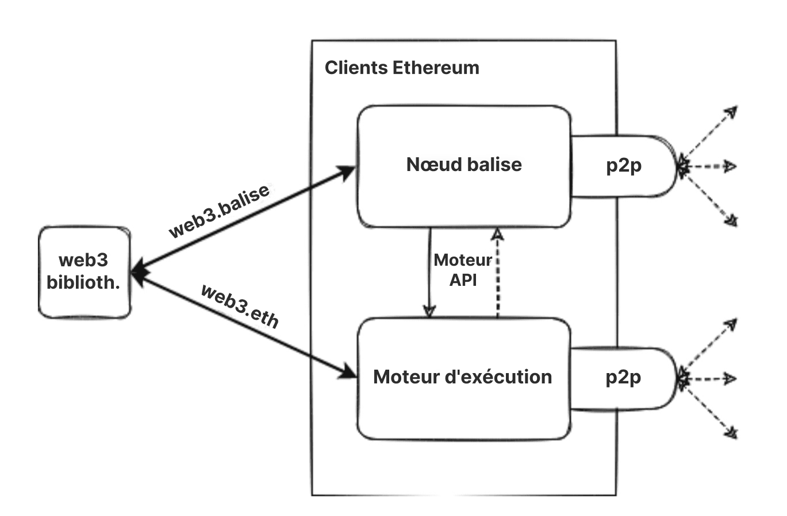
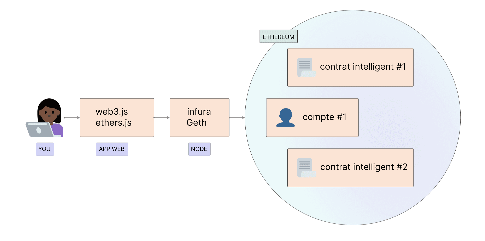

[Ethereum](/) est un réseau distribué d'ordinateurs (appelés nœuds) exécutant des logiciels capables de vérifier les blocs et les données de transaction. Le logiciel doit être exécuté sur votre ordinateur pour le transformer en un nœud Ethereum. Deux logiciels distincts (appelés « clients ») sont nécessaires pour former un nœud.

## Prérequis {#prerequisites}

Vous devez comprendre le concept de réseau pair à pair et les [bases de l'EVM](/developers/docs/evm/) avant d'aller plus loin et d'exécuter votre propre instance d'un client Ethereum. Jetez un œil à notre [introduction à Ethereum](/developers/docs/intro-to-ethereum/).

Si vous découvrez le sujet des nœuds, nous vous recommandons de consulter d'abord notre introduction accessible sur [l'exécution d'un nœud Ethereum](/run-a-node).

## Que sont les nœuds et les clients ? {#what-are-nodes-and-clients}

Un « nœud » est toute instance de logiciel client Ethereum connectée à d'autres ordinateurs exécutant également le logiciel Ethereum, formant ainsi un réseau. Un client est une implémentation d'Ethereum qui vérifie les données par rapport aux règles du protocole et maintient la sécurité du réseau. Un nœud doit exécuter deux clients : un client de consensus et un client d'exécution.

- Le client d'exécution (également connu sous le nom de moteur d'exécution, client EL ou anciennement client Eth1) écoute les nouvelles transactions diffusées sur le réseau, les exécute dans l'EVM et conserve le dernier état ainsi que la base de données de toutes les données Ethereum actuelles.
- Le client de consensus (également connu sous le nom de nœud balise, client CL ou anciennement client Eth2) implémente l'algorithme de consensus de preuve d'enjeu (PoS), qui permet au réseau de parvenir à un accord basé sur les données validées par le client d'exécution. Il existe également un troisième logiciel, appelé « validateur », qui peut être ajouté au client de consensus, permettant à un nœud de participer à la sécurisation du réseau.

Ces clients travaillent ensemble pour garder une trace de la tête de la chaîne Ethereum et permettre aux utilisateurs d'interagir avec le réseau Ethereum. La conception modulaire avec plusieurs logiciels fonctionnant ensemble est appelée [complexité encapsulée](https://vitalik.eth.limo/general/2022/02/28/complexity.html). Cette approche a facilité l'exécution de [La Fusion](/roadmap/merge) de manière transparente, rend les logiciels clients plus faciles à maintenir et à développer, et permet la réutilisation de clients individuels, par exemple, dans l'écosystème de [couche 2 (l2)](/layer-2/).

Schéma simplifié d'un client d'exécution et de consensus couplés.

### Diversité des clients {#client-diversity}

Les [clients d'exécution](/developers/docs/nodes-and-clients/#execution-clients) et les [clients de consensus](/developers/docs/nodes-and-clients/#consensus-clients) existent dans une variété de langages de programmation développés par différentes équipes.

De multiples implémentations de clients peuvent rendre le réseau plus fort en réduisant sa dépendance à une seule base de code. L'objectif idéal est d'atteindre la diversité sans qu'aucun client ne domine le réseau, éliminant ainsi un point de défaillance unique potentiel.
La variété des langages invite également une communauté de développeurs plus large et leur permet de créer des intégrations dans leur langage préféré.

En savoir plus sur la [diversité des clients](/developers/docs/nodes-and-clients/client-diversity/).

Ce que ces implémentations ont en commun, c'est qu'elles suivent toutes une spécification unique. Les spécifications dictent le fonctionnement du réseau et de la chaîne de blocs Ethereum. Chaque détail technique est défini et les spécifications peuvent être trouvées sous la forme de :

- À l'origine, le [livre jaune d'Ethereum](https://ethereum.github.io/yellowpaper/paper.pdf)
- [Spécifications d'exécution](https://github.com/ethereum/execution-specs/)
- [Spécifications de consensus](https://github.com/ethereum/consensus-specs)
- [EIP](https://eips.ethereum.org/) implémentées dans diverses [mises à jour du réseau](/ethereum-forks/)

### Suivi des nœuds sur le réseau {#network-overview}

Plusieurs outils de suivi offrent un aperçu en temps réel des nœuds sur le réseau Ethereum. Notez qu'en raison de la nature des réseaux décentralisés, ces robots d'exploration ne peuvent fournir qu'une vue limitée du réseau et peuvent rapporter des résultats différents.

- [Carte des nœuds](https://etherscan.io/nodetracker) par Etherscan
- [Ethernodes](https://ethernodes.org/) par Bitfly
- [Nodewatch](https://www.nodewatch.io/) par Chainsafe, explorant les nœuds de consensus
- [Monitoreth](https://monitoreth.io/) - par MigaLabs, un outil de surveillance de réseau distribué
- [Rapports hebdomadaires sur la santé du réseau](https://probelab.io) - par ProbeLab, utilisant le [robot d'exploration Nebula](https://github.com/dennis-tra/nebula) et d'autres outils

## Types de nœuds {#node-types}

Si vous souhaitez [exécuter votre propre nœud](/developers/docs/nodes-and-clients/run-a-node/), vous devez comprendre qu'il existe différents types de nœuds qui consomment les données différemment. En fait, les clients peuvent exécuter trois types de nœuds différents : léger, complet et d'archive. Il existe également des options de différentes stratégies de synchronisation qui permettent un temps de synchronisation plus rapide. La synchronisation fait référence à la rapidité avec laquelle il peut obtenir les informations les plus récentes sur l'état d'Ethereum.

### Nœud complet {#full-node}

Les nœuds complets effectuent une validation de bloc par bloc de la chaîne de blocs, y compris le téléchargement et la vérification du corps du bloc et des données d'état pour chaque bloc. Il existe différentes classes de nœuds complets - certains partent du bloc genèse et vérifient chaque bloc de toute l'histoire de la chaîne de blocs. D'autres commencent leur vérification à un bloc plus récent qu'ils considèrent comme valide (par exemple, la « synchronisation snap » de Geth). Quel que soit l'endroit où commence la vérification, les nœuds complets ne conservent qu'une copie locale des données relativement récentes (généralement les 128 blocs les plus récents), ce qui permet de supprimer les données plus anciennes pour économiser de l'espace disque. Les données plus anciennes peuvent être régénérées lorsqu'elles sont nécessaires.

- Stocke les données complètes de la chaîne de blocs (bien que celles-ci soient périodiquement élaguées afin qu'un nœud complet ne stocke pas toutes les données d'état jusqu'au bloc genèse)
- Participe à la validation de bloc, vérifie tous les blocs et états.
- Tous les états peuvent être soit récupérés à partir du stockage local, soit régénérés à partir d'« instantanés » par un nœud complet.
- Sert le réseau et fournit des données sur demande.

### Nœud d'archive {#archive-node}

Les nœuds d'archive sont des nœuds complets qui vérifient chaque bloc depuis le bloc genèse et ne suppriment jamais aucune des données téléchargées.

- Stocke tout ce qui est conservé dans le nœud complet et construit une archive des états historiques. C'est nécessaire si vous souhaitez interroger quelque chose comme le solde d'un compte au bloc n° 4 000 000, ou simplement et de manière fiable tester votre propre ensemble de transactions sans les valider en utilisant le traçage.
- Ces données représentent des téraoctets, ce qui rend les nœuds d'archive moins attrayants pour les utilisateurs moyens, mais ils peuvent être pratiques pour des services tels que les explorateurs de blocs, les fournisseurs de portefeuilles et l'analyse de chaîne.

La synchronisation des clients dans n'importe quel mode autre que l'archive entraînera des données de chaîne de blocs élaguées. Cela signifie qu'il n'y a pas d'archive de tous les états historiques, mais le nœud complet est capable de les construire à la demande.

En savoir plus sur les [nœuds d'archive](/developers/docs/nodes-and-clients/archive-nodes).

### Nœud léger {#light-node}

Au lieu de télécharger chaque bloc, les nœuds légers ne téléchargent que les en-têtes de bloc. Ces en-têtes contiennent des informations résumées sur le contenu des blocs. Toute autre information dont le nœud léger a besoin est demandée à un nœud complet. Le nœud léger peut alors vérifier indépendamment les données qu'il reçoit par rapport aux racines d'état dans les en-têtes de bloc. Les nœuds légers permettent aux utilisateurs de participer au réseau Ethereum sans le matériel puissant ou la bande passante élevée requis pour exécuter des nœuds complets. À terme, les nœuds légers pourraient fonctionner sur des téléphones mobiles ou des appareils embarqués. Les nœuds légers ne participent pas au consensus (c'est-à-dire qu'ils ne peuvent pas être des validateurs), mais ils peuvent accéder à la chaîne de blocs Ethereum avec les mêmes fonctionnalités et garanties de sécurité qu'un nœud complet.

Les clients légers sont un domaine de développement actif pour Ethereum et nous nous attendons à voir bientôt de nouveaux clients légers pour la couche de consensus et la couche d'exécution.
Il existe également des voies potentielles pour fournir des données de client léger via le [réseau de diffusion (gossip)](https://www.ethportal.net/). C'est avantageux car le réseau de diffusion pourrait prendre en charge un réseau de nœuds légers sans nécessiter de nœuds complets pour répondre aux requêtes.

Ethereum ne prend pas encore en charge une grande population de nœuds légers, mais la prise en charge des nœuds légers est un domaine qui devrait se développer rapidement dans un avenir proche. En particulier, des clients comme [Nimbus](https://nimbus.team/), [Helios](https://github.com/a16z/helios) et [Lodestar](https://lodestar.chainsafe.io/) sont actuellement fortement axés sur les nœuds légers.

## Pourquoi devrais-je exécuter un nœud Ethereum ? {#why-should-i-run-an-ethereum-node}

L'exécution d'un nœud vous permet d'utiliser Ethereum directement, sans tiers de confiance et en toute confidentialité, tout en soutenant le réseau en le gardant plus robuste et décentralisé.

### Avantages pour vous {#benefits-to-you}

L'exécution de votre propre nœud vous permet d'utiliser Ethereum de manière privée, autonome et sans tiers de confiance. Vous n'avez pas besoin de faire confiance au réseau car vous pouvez vérifier les données vous-même avec votre client. « Ne faites pas confiance, vérifiez » est un mantra populaire de la chaîne de blocs.

- Votre nœud vérifie lui-même toutes les transactions et tous les blocs par rapport aux règles de consensus. Cela signifie que vous n'avez pas à dépendre d'autres nœuds du réseau ni à leur faire entièrement confiance.
- Vous pouvez utiliser un portefeuille Ethereum avec votre propre nœud. Vous pouvez utiliser des applications décentralisées (dapps) de manière plus sécurisée et confidentielle, car vous n'aurez pas à divulguer vos adresses et vos soldes à des intermédiaires. Tout peut être vérifié avec votre propre client. [MetaMask](https://metamask.io), [Frame](https://frame.sh/) et de [nombreux autres portefeuilles](/wallets/find-wallet/) offrent l'importation RPC, leur permettant d'utiliser votre nœud.
- Vous pouvez exécuter et auto-héberger d'autres services qui dépendent des données d'Ethereum. Par exemple, il peut s'agir d'un validateur de la chaîne balise, de logiciels comme la couche 2 (l2), d'infrastructures, d'explorateurs de blocs, de processeurs de paiement, etc.
- Vous pouvez fournir vos propres [points de terminaison RPC](/developers/docs/apis/json-rpc/) personnalisés. Vous pourriez même offrir ces points de terminaison publiquement à la communauté pour l'aider à éviter les grands fournisseurs centralisés.
- Vous pouvez vous connecter à votre nœud en utilisant les **communications inter-processus (IPC)** ou réécrire le nœud pour charger votre programme en tant que plugin. Cela accorde une faible latence, ce qui aide beaucoup, par exemple, lors du traitement de nombreuses données à l'aide de bibliothèques Web3 ou lorsque vous devez remplacer vos transactions aussi vite que possible (c'est-à-dire le frontrunning).
- Vous pouvez directement staker des ETH pour sécuriser le réseau et gagner des récompenses. Consultez le [staking en solo](/staking/solo/) pour commencer.

### Avantages pour le réseau {#network-benefits}

Un ensemble diversifié de nœuds est important pour la santé, la sécurité et la résilience opérationnelle d'Ethereum.

- Les nœuds complets appliquent les règles de consensus afin de ne pas être trompés en acceptant des blocs qui ne les respectent pas. Cela offre une sécurité supplémentaire au réseau, car si tous les nœuds étaient des nœuds légers, qui n'effectuent pas de vérification complète, les validateurs pourraient attaquer le réseau.
- En cas d'attaque qui surmonte les défenses crypto-économiques de la [preuve d'enjeu (PoS)](/developers/docs/consensus-mechanisms/pos/#what-is-pos), une récupération sociale peut être effectuée par les nœuds complets choisissant de suivre la chaîne honnête.
- Plus de nœuds sur le réseau se traduisent par un réseau plus diversifié et robuste, l'objectif ultime de la décentralisation, ce qui permet un système résistant à la censure et fiable.
- Les nœuds complets fournissent un accès aux données de la chaîne de blocs pour les clients légers qui en dépendent. Les nœuds légers ne stockent pas toute la chaîne de blocs, ils vérifient plutôt les données via les [racines d'état dans les en-têtes de bloc](/developers/docs/blocks/#block-anatomy). Ils peuvent demander plus d'informations aux nœuds complets s'ils en ont besoin.

Si vous exécutez un nœud complet, l'ensemble du réseau Ethereum en bénéficie, même si vous n'exécutez pas de validateur.

## Exécuter votre propre nœud {#running-your-own-node}

Vous souhaitez exécuter votre propre client Ethereum ?

Pour une introduction accessible aux débutants, visitez notre page [exécuter un nœud](/run-a-node) pour en savoir plus.

Si vous êtes plutôt un utilisateur technique, plongez dans plus de détails et d'options sur la façon de [lancer votre propre nœud](/developers/docs/nodes-and-clients/run-a-node/).

## Alternatives {#alternatives}

La configuration de votre propre nœud peut vous coûter du temps et des ressources, mais vous n'avez pas toujours besoin d'exécuter votre propre instance. Dans ce cas, vous pouvez utiliser un fournisseur d'API tiers. Pour un aperçu de l'utilisation de ces services, consultez les [nœuds en tant que service](/developers/docs/nodes-and-clients/nodes-as-a-service/).

Si quelqu'un exécute un nœud Ethereum avec une API publique dans votre communauté, vous pouvez pointer vos portefeuilles vers un nœud communautaire via un RPC personnalisé et gagner plus de confidentialité qu'avec un tiers de confiance aléatoire.

D'un autre côté, si vous exécutez un client, vous pouvez le partager avec vos amis qui pourraient en avoir besoin.

## Clients d'exécution {#execution-clients}

La communauté Ethereum maintient plusieurs clients d'exécution open source (précédemment connus sous le nom de « clients Eth1 », ou simplement « clients Ethereum »), développés par différentes équipes utilisant différents langages de programmation. Cela rend le réseau plus fort et plus [diversifié](/developers/docs/nodes-and-clients/client-diversity/). L'objectif idéal est d'atteindre la diversité sans qu'aucun client ne domine afin de réduire tout point de défaillance unique.

Ce tableau résume les différents clients. Tous passent les [tests de clients](https://github.com/ethereum/tests) et sont activement maintenus pour rester à jour avec les mises à jour du réseau.

| Client                                                                   | Langage    | Systèmes d'exploitation | Réseaux                 | Stratégies de synchronisation                              | Élagage d'état  |
| ------------------------------------------------------------------------ | ---------- | ----------------------- | ----------------------- | ---------------------------------------------------------- | --------------- |
| [Geth](https://geth.ethereum.org/)                                       | Go         | Linux, Windows, macOS   | Réseau principal, Sepolia, Hoodi | [Snap](#snap-sync), [Complet](#full-sync)                     | Archive, Élagué |
| [Nethermind](https://www.nethermind.io/)                                 | C#, .NET   | Linux, Windows, macOS   | Réseau principal, Sepolia, Hoodi | [Snap](#snap-sync), Rapide, [Complet](#full-sync)               | Archive, Élagué |
| [Besu](https://besu.hyperledger.org/en/stable/)                          | Java       | Linux, Windows, macOS   | Réseau principal, Sepolia, Hoodi | [Snap](#snap-sync), [Rapide](#fast-sync), [Complet](#full-sync) | Archive, Élagué |
| [Erigon](https://github.com/ledgerwatch/erigon)                          | Go         | Linux, Windows, macOS   | Réseau principal, Sepolia, Hoodi | [Complet](#full-sync)                                         | Archive, Élagué |
| [Reth](https://reth.rs/)                                                 | Rust       | Linux, Windows, macOS   | Réseau principal, Sepolia, Hoodi | [Complet](#full-sync)                                         | Archive, Élagué |
| [EthereumJS](https://github.com/ethereumjs/ethereumjs-monorepo) _(bêta)_ | TypeScript | Linux, Windows, macOS   | Sepolia, Hoodi          | [Complet](#full-sync)                                         | Élagué          |

Pour en savoir plus sur les réseaux pris en charge, lisez la section sur les [réseaux Ethereum](/developers/docs/networks/).

Chaque client a des cas d'utilisation et des avantages uniques, vous devez donc en choisir un en fonction de vos propres préférences. La diversité permet aux implémentations de se concentrer sur différentes fonctionnalités et publics d'utilisateurs. Vous voudrez peut-être choisir un client en fonction des fonctionnalités, du support, du langage de programmation ou des licences.

### Besu {#besu}

Hyperledger Besu est un client Ethereum de niveau entreprise pour les réseaux publics et à permission. Il exécute toutes les fonctionnalités du réseau principal Ethereum, du traçage à GraphQL, dispose d'une surveillance approfondie et est soutenu par ConsenSys, à la fois dans les canaux communautaires ouverts et via des SLA commerciaux pour les entreprises. Il est écrit en Java et sous licence Apache-2.0.

La [documentation](https://besu.hyperledger.org/en/stable/) complète de Besu vous guidera à travers tous les détails sur ses fonctionnalités et ses configurations.

### Erigon {#erigon}

Erigon, anciennement connu sous le nom de Turbo-Geth, a commencé comme un fork de Go Ethereum orienté vers la vitesse et l'efficacité de l'espace disque. Erigon est une implémentation d'Ethereum entièrement repensée, actuellement écrite en Go mais avec des implémentations dans d'autres langages en cours de développement. L'objectif d'Erigon est de fournir une implémentation d'Ethereum plus rapide, plus modulaire et plus optimisée. Il peut effectuer une synchronisation complète de nœud d'archive en utilisant environ 2 To d'espace disque, en moins de 3 jours.

### Go Ethereum {#geth}

Go Ethereum (Geth en abrégé) est l'une des implémentations originales du protocole Ethereum. Actuellement, c'est le client le plus répandu avec la plus grande base d'utilisateurs et la plus grande variété d'outils pour les utilisateurs et les développeurs. Il est écrit en Go, entièrement open source et sous licence GNU LGPL v3.

En savoir plus sur Geth dans sa [documentation](https://geth.ethereum.org/docs).

### Nethermind {#nethermind}

Nethermind est une implémentation d'Ethereum créée avec la pile technologique C# .NET, sous licence LGPL-3.0, fonctionnant sur toutes les principales plateformes, y compris ARM. Il offre d'excellentes performances avec :

- une machine virtuelle optimisée
- un accès à l'état
- une mise en réseau et des fonctionnalités riches telles que les tableaux de bord Prometheus/Grafana, la prise en charge de la journalisation d'entreprise seq, le traçage JSON-RPC et des plugins d'analyse.

Nethermind dispose également d'une [documentation détaillée](https://docs.nethermind.io), d'un solide support pour les développeurs, d'une communauté en ligne et d'un support 24/7 disponible pour les utilisateurs premium.

### Reth {#reth}

Reth (abréviation de Rust Ethereum) est une implémentation de nœud complet Ethereum qui se concentre sur la convivialité, la modularité, la rapidité et l'efficacité. Reth a été initialement construit et propulsé par Paradigm, et est sous licences Apache et MIT.

Reth est prêt pour la production et convient à une utilisation dans des environnements critiques tels que le staking ou les services à haute disponibilité. Il est performant dans les cas d'utilisation où des performances élevées avec de grandes marges sont requises, tels que le RPC, la MEV, l'indexation, les simulations et les activités P2P.

En savoir plus en consultant le [livre Reth](https://reth.rs/) ou le [dépôt GitHub de Reth](https://github.com/paradigmxyz/reth?tab=readme-ov-file#reth).

### En développement {#execution-in-development}

Ces clients sont encore aux premiers stades de développement et ne sont pas encore recommandés pour une utilisation en production.

#### EthereumJS {#ethereumjs}

Le client d'exécution EthereumJS (EthereumJS) est écrit en TypeScript et composé d'un certain nombre de paquets, y compris les primitives de base d'Ethereum représentées par les classes Block, Transaction et Merkle-Patricia Trie, ainsi que les composants de base du client, y compris une implémentation de la machine virtuelle Ethereum (EVM), une classe de chaîne de blocs et la pile réseau devp2p.

Apprenez-en plus à ce sujet en lisant sa [documentation](https://github.com/ethereumjs/ethereumjs-monorepo/tree/master)

## Clients de consensus {#consensus-clients}

Il existe plusieurs clients de consensus (précédemment connus sous le nom de clients « Eth2 ») pour prendre en charge les [mises à jour de consensus](/roadmap/beacon-chain/). Ils sont responsables de toute la logique liée au consensus, y compris l'algorithme de choix de fork, le traitement des attestations et la gestion des récompenses et des pénalités de la [preuve d'enjeu (PoS)](/developers/docs/consensus-mechanisms/pos).

| Client                                                        | Langage    | Systèmes d'exploitation | Réseaux                                                 |
| ------------------------------------------------------------- | ---------- | ----------------------- | ------------------------------------------------------- |
| [Lighthouse](https://lighthouse.sigmaprime.io/)               | Rust       | Linux, Windows, macOS   | Chaîne balise, Hoodi, Pyrmont, Sepolia, et plus         |
| [Lodestar](https://lodestar.chainsafe.io/)                    | TypeScript | Linux, Windows, macOS   | Chaîne balise, Hoodi, Sepolia, et plus                  |
| [Nimbus](https://nimbus.team/)                                | Nim        | Linux, Windows, macOS   | Chaîne balise, Hoodi, Sepolia, et plus                  |
| [Prysm](https://prysm.offchainlabs.com/docs/)                 | Go         | Linux, Windows, macOS   | Chaîne balise, Gnosis, Hoodi, Pyrmont, Sepolia, et plus |
| [Teku](https://consensys.net/knowledge-base/ethereum-2/teku/) | Java       | Linux, Windows, macOS   | Chaîne balise, Gnosis, Hoodi, Sepolia, et plus          |
| [Grandine](https://docs.grandine.io/)                         | Rust       | Linux, Windows, macOS   | Chaîne balise, Hoodi, Sepolia, et plus                  |

### Lighthouse {#lighthouse}

Lighthouse est une implémentation de client de consensus écrite en Rust sous licence Apache-2.0. Il est maintenu par Sigma Prime et est stable et prêt pour la production depuis le bloc genèse de la chaîne balise. Diverses entreprises, pools de staking et particuliers s'appuient sur lui. Il vise à être sécurisé, performant et interopérable dans un large éventail d'environnements, des PC de bureau aux déploiements automatisés sophistiqués.

La documentation se trouve dans le [livre Lighthouse](https://lighthouse-book.sigmaprime.io/)

### Lodestar {#lodestar}

Lodestar est une implémentation de client de consensus prête pour la production, écrite en TypeScript sous licence LGPL-3.0. Il est maintenu par ChainSafe Systems et est le plus récent des clients de consensus pour les stakers en solo, les développeurs et les chercheurs. Lodestar se compose d'un nœud balise et d'un client validateur alimentés par des implémentations JavaScript des protocoles Ethereum. Lodestar vise à améliorer la convivialité d'Ethereum avec des clients légers, à élargir l'accessibilité à un plus grand groupe de développeurs et à contribuer davantage à la diversité de l'écosystème.

Plus d'informations peuvent être trouvées sur le [site Web de Lodestar](https://lodestar.chainsafe.io/)

### Nimbus {#nimbus}

Nimbus est une implémentation de client de consensus écrite en Nim sous licence Apache-2.0. C'est un client prêt pour la production utilisé par les stakers en solo et les pools de staking. Nimbus est conçu pour l'efficacité des ressources, ce qui le rend facile à exécuter sur des appareils aux ressources limitées et sur des infrastructures d'entreprise avec la même facilité, sans compromettre la stabilité ou les performances des récompenses. Une empreinte de ressources plus légère signifie que le client a une plus grande marge de sécurité lorsque le réseau est sous pression.

En savoir plus dans la [documentation de Nimbus](https://nimbus.guide/)

### Prysm {#prysm}

Prysm est un client de consensus open source complet écrit en Go sous licence GPL-3.0. Il dispose d'une interface utilisateur d'application Web facultative et donne la priorité à l'expérience utilisateur, à la documentation et à la configurabilité pour les utilisateurs institutionnels et ceux qui stakent à domicile.

Visitez la [documentation de Prysm](https://prysm.offchainlabs.com/docs/) pour en savoir plus.

### Teku {#teku}

Teku est l'un des clients originaux du bloc genèse de la chaîne balise. Outre les objectifs habituels (sécurité, robustesse, stabilité, convivialité, performances), Teku vise spécifiquement à se conformer pleinement à toutes les différentes normes des clients de consensus.

Teku offre des options de déploiement très flexibles. Le nœud balise et le client validateur peuvent être exécutés ensemble en tant que processus unique, ce qui est extrêmement pratique pour les stakers en solo, ou les nœuds peuvent être exécutés séparément pour des opérations de staking sophistiquées. De plus, Teku est entièrement interopérable avec [Web3Signer](https://github.com/ConsenSys/web3signer/) pour la sécurité des clés de signature et la protection contre les réductions (slashing).

Teku est écrit en Java et sous licence Apache-2.0. Il est développé par l'équipe Protocoles de ConsenSys qui est également responsable de Besu et Web3Signer. En savoir plus dans la [documentation de Teku](https://docs.teku.consensys.net/en/latest/).

### Grandine {#grandine}

Grandine est une implémentation de client de consensus, écrite en Rust sous licence GPL-3.0. Il est maintenu par la Grandine Core Team et est rapide, performant et léger. Il convient à un large éventail de stakers, des stakers en solo fonctionnant sur des appareils à faibles ressources tels que le Raspberry Pi aux grands stakers institutionnels exécutant des dizaines de milliers de validateurs.

La documentation se trouve dans le [livre Grandine](https://docs.grandine.io/)

## Modes de synchronisation {#sync-modes}

Pour suivre et vérifier les données actuelles sur le réseau, le client Ethereum doit se synchroniser avec le dernier état du réseau. Cela se fait en téléchargeant des données à partir de pairs, en vérifiant cryptographiquement leur intégrité et en construisant une base de données locale de la chaîne de blocs.

Les modes de synchronisation représentent différentes approches de ce processus avec divers compromis. Les clients varient également dans leur implémentation des algorithmes de synchronisation. Référez-vous toujours à la documentation officielle du client de votre choix pour les spécificités de l'implémentation.

### Modes de synchronisation de la couche d'exécution {#execution-layer-sync-modes}

La couche d'exécution peut être exécutée dans différents modes pour s'adapter à différents cas d'utilisation, de la réexécution de l'état mondial de la chaîne de blocs à la synchronisation uniquement avec la pointe de la chaîne à partir d'un point de contrôle de confiance.

#### Synchronisation complète {#full-sync}

Une synchronisation complète télécharge tous les blocs (y compris les en-têtes et les corps de bloc) et régénère l'état de la chaîne de blocs de manière incrémentielle en exécutant chaque bloc depuis le bloc genèse.

- Minimise la confiance et offre la plus haute sécurité en vérifiant chaque transaction.
- Avec un nombre croissant de transactions, le traitement de toutes les transactions peut prendre des jours, voire des semaines.

Les [nœuds d'archive](#archive-node) effectuent une synchronisation complète pour construire (et conserver) un historique complet des changements d'état effectués par chaque transaction dans chaque bloc.

#### Synchronisation rapide {#fast-sync}

Comme une synchronisation complète, une synchronisation rapide télécharge tous les blocs (y compris les en-têtes, les transactions et les reçus). Cependant, au lieu de retraiter les transactions historiques, une synchronisation rapide s'appuie sur les reçus jusqu'à ce qu'elle atteigne une tête récente, moment auquel elle passe à l'importation et au traitement des blocs pour fournir un nœud complet.

- Stratégie de synchronisation rapide.
- Réduit la demande de traitement au profit de l'utilisation de la bande passante.

#### Synchronisation snap {#snap-sync}

Les synchronisations snap vérifient également la chaîne bloc par bloc. Cependant, au lieu de commencer au bloc genèse, une synchronisation snap commence à un point de contrôle « de confiance » plus récent qui est connu pour faire partie de la véritable chaîne de blocs. Le nœud enregistre des points de contrôle périodiques tout en supprimant les données antérieures à un certain âge. Ces instantanés sont utilisés pour régénérer les données d'état selon les besoins, plutôt que de les stocker pour toujours.

- Stratégie de synchronisation la plus rapide, actuellement par défaut sur le réseau principal Ethereum.
- Économise beaucoup d'utilisation du disque et de bande passante réseau sans sacrifier la sécurité.

[En savoir plus sur la synchronisation snap](https://github.com/ethereum/devp2p/blob/master/caps/snap.md).

#### Synchronisation légère {#light-sync}

Le mode client léger télécharge tous les en-têtes de bloc, les données de bloc et en vérifie certains de manière aléatoire. Ne synchronise que la pointe de la chaîne à partir du point de contrôle de confiance.

- N'obtient que le dernier état tout en s'appuyant sur la confiance envers les développeurs et le mécanisme de consensus.
- Client prêt à l'emploi avec l'état actuel du réseau en quelques minutes.

**NB** La synchronisation légère ne fonctionne pas encore avec la preuve d'enjeu (PoS) d'Ethereum - de nouvelles versions de la synchronisation légère devraient être disponibles bientôt !

[En savoir plus sur les clients légers](/developers/docs/nodes-and-clients/light-clients/)

### Modes de synchronisation de la couche de consensus {#consensus-layer-sync-modes}

#### Synchronisation optimiste {#optimistic-sync}

La synchronisation optimiste est une stratégie de synchronisation post-fusion conçue pour être facultative et rétrocompatible, permettant aux nœuds d'exécution de se synchroniser via des méthodes établies. Le moteur d'exécution peut importer _de manière optimiste_ des blocs balises sans les vérifier entièrement, trouver la dernière tête, puis commencer à synchroniser la chaîne avec les méthodes ci-dessus. Ensuite, une fois que le client d'exécution a rattrapé son retard, il informera le client de consensus de la validité des transactions dans la chaîne balise.

[En savoir plus sur la synchronisation optimiste](https://github.com/ethereum/consensus-specs/blob/master/sync/optimistic.md)

#### Synchronisation par point de contrôle {#checkpoint-sync}

Une synchronisation par point de contrôle, également connue sous le nom de synchronisation à subjectivité faible, crée une expérience utilisateur supérieure pour la synchronisation d'un nœud balise. Elle est basée sur des hypothèses de [subjectivité faible](/developers/docs/consensus-mechanisms/pos/weak-subjectivity/) qui permettent de synchroniser la chaîne balise à partir d'un point de contrôle de subjectivité faible récent au lieu du bloc genèse. Les synchronisations par point de contrôle rendent le temps de synchronisation initial considérablement plus rapide avec des hypothèses de confiance similaires à la synchronisation depuis le [bloc genèse](/glossary/#genesis-block).

En pratique, cela signifie que votre nœud se connecte à un service distant pour télécharger les états finalisés récents et continue de vérifier les données à partir de ce point. Le tiers fournissant les données est de confiance et doit être choisi avec soin.

En savoir plus sur la [synchronisation par point de contrôle](https://notes.ethereum.org/@djrtwo/ws-sync-in-practice)

## Complément d'information {#further-reading}

- [Ethereum 101 - Partie 2 - Comprendre les nœuds](https://kauri.io/ethereum-101-part-2-understanding-nodes/48d5098292fd4f11b251d1b1814f0bba/a) _– Wil Barnes, 13 février 2019_
- [Exécuter des nœuds complets Ethereum : un guide pour les moins motivés](https://medium.com/@JustinMLeroux/running-ethereum-full-nodes-a-guide-for-the-barely-motivated-a8a13e7a0d31) _– Justin Leroux, 7 novembre 2019_

## Sujets connexes {#related-topics}

- [Blocs](/developers/docs/blocks/)
- [Réseaux](/developers/docs/networks/)

## Tutoriels connexes {#related-tutorials}

- [Transformez votre Raspberry Pi 4 en nœud validateur simplement en flashant la carte MicroSD – Guide d'installation](/developers/tutorials/run-node-raspberry-pi/) _– Flashez votre Raspberry Pi 4, branchez un câble Ethernet, connectez le disque SSD et allumez l'appareil pour transformer le Raspberry Pi 4 en un nœud complet Ethereum exécutant la couche d'exécution (réseau principal) et/ou la couche de consensus (chaîne balise / validateur)._