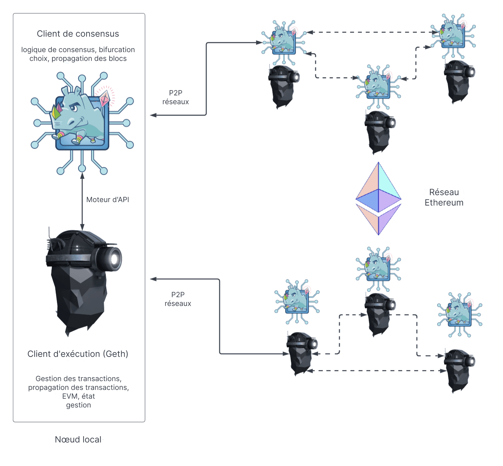

Un nœud Ethereum est composé de deux clients : un [client d'exécution](/developers/docs/nodes-and-clients/#execution-clients) et un [client de consensus](/developers/docs/nodes-and-clients/#consensus-clients). Pour qu'un nœud puisse proposer un nouveau bloc, il doit également exécuter un [client validateur](#validators).

Lorsqu'Ethereum utilisait la [preuve de travail (PoW)](/developers/docs/consensus-mechanisms/pow/), un client d'exécution suffisait pour exécuter un nœud Ethereum complet. Cependant, depuis la mise en œuvre de la [preuve d'enjeu (PoS)](/developers/docs/consensus-mechanisms/pos/), le client d'exécution doit être utilisé avec un autre logiciel appelé [client de consensus](/developers/docs/nodes-and-clients/#consensus-clients).

Le diagramme ci-dessous montre la relation entre les deux clients Ethereum. Les deux clients se connectent à leurs propres réseaux pair à pair (P2P) respectifs. Des réseaux P2P distincts sont nécessaires car les clients d'exécution diffusent les transactions sur leur réseau P2P, ce qui leur permet de gérer leur pool de transactions local, tandis que les clients de consensus diffusent les blocs sur leur réseau P2P, permettant le consensus et la croissance de la chaîne.

_Il existe plusieurs options pour le client d'exécution, notamment Erigon, Nethermind et Besu_.

Pour que cette structure à deux clients fonctionne, les clients de consensus doivent transmettre des lots de transactions au client d'exécution. Le client d'exécution exécute les transactions localement pour valider qu'elles ne violent aucune règle d'Ethereum et que la mise à jour proposée de l'état d'Ethereum est correcte. Lorsqu'un nœud est sélectionné pour être un producteur de blocs, son instance de client de consensus demande des lots de transactions au client d'exécution pour les inclure dans le nouveau bloc et les exécuter afin de mettre à jour l'état global. Le client de consensus pilote le client d'exécution via une connexion RPC locale en utilisant l'[API Engine](https://github.com/ethereum/execution-apis/blob/main/src/engine/common.md).

## Que fait le client d'exécution ? {#execution-client}

Le client d'exécution est responsable de la validation, du traitement et de la diffusion des transactions, ainsi que de la gestion de l'état et de la prise en charge de la machine virtuelle Ethereum ([EVM](/developers/docs/evm/)). Il n'est **pas** responsable de la construction des blocs, de la diffusion des blocs ou de la gestion de la logique de consensus. Ces tâches relèvent de la compétence du client de consensus.

Le client d'exécution crée des charges utiles d'exécution - la liste des transactions, le trie d'état mis à jour et d'autres données liées à l'exécution. Les clients de consensus incluent la charge utile d'exécution dans chaque bloc. Le client d'exécution est également responsable de la réexécution des transactions dans les nouveaux blocs pour s'assurer qu'elles sont valides. L'exécution des transactions se fait sur l'ordinateur intégré du client d'exécution, connu sous le nom de [Machine Virtuelle Ethereum (EVM)](/developers/docs/evm).

Le client d'exécution offre également une interface utilisateur à Ethereum via des [méthodes RPC](/developers/docs/apis/json-rpc) qui permettent aux utilisateurs d'interroger la chaîne de blocs Ethereum, de soumettre des transactions et de déployer des contrats intelligents. Il est courant que les appels RPC soient gérés par une bibliothèque comme [Web3js](https://docs.web3js.org/), [Web3py](https://web3py.readthedocs.io/en/v5/), ou par une interface utilisateur telle qu'un portefeuille de navigateur.

En résumé, le client d'exécution est :

- une passerelle utilisateur vers Ethereum
- le foyer de la machine virtuelle Ethereum, de l'état d'Ethereum et du pool de transactions.

## Que fait le client de consensus ? {#consensus-client}

Le client de consensus gère toute la logique qui permet à un nœud de rester synchronisé avec le réseau Ethereum. Cela inclut la réception de blocs de la part des pairs et l'exécution d'un algorithme de choix de fourche pour s'assurer que le nœud suit toujours la chaîne avec la plus grande accumulation d'attestations (pondérée par les soldes effectifs des validateurs). À l'instar du client d'exécution, les clients de consensus disposent de leur propre réseau P2P par lequel ils partagent des blocs et des attestations.

Le client de consensus ne participe pas à l'attestation ou à la proposition de blocs - cela est fait par un validateur, un module complémentaire optionnel à un client de consensus. Un client de consensus sans validateur se contente de suivre la tête de la chaîne, ce qui permet au nœud de rester synchronisé. Cela permet à un utilisateur d'effectuer des transactions avec Ethereum en utilisant son client d'exécution, en étant sûr d'être sur la bonne chaîne.

## Validateurs {#validators}

Le staking et l'exécution du logiciel validateur rendent un nœud éligible pour être sélectionné afin de proposer un nouveau bloc. Les opérateurs de nœuds peuvent ajouter un validateur à leurs clients de consensus en déposant 32 ETH dans le contrat de dépôt. Le client validateur est fourni avec le client de consensus et peut être ajouté à un nœud à tout moment. Le validateur gère les attestations et les propositions de blocs. Il permet également à un nœud d'accumuler des récompenses ou de perdre des ETH via des pénalités ou une réduction.

[En savoir plus sur le staking](/staking/).

## Comparaison des composants d'un nœud {#node-comparison}

| Client d'exécution                                 | Client de consensus                                                                                                                                       | Validateur                   |
| -------------------------------------------------- | --------------------------------------------------------------------------------------------------------------------------------------------------------- | ---------------------------- |
| Diffuse les transactions sur son réseau P2P        | Diffuse les blocs et les attestations sur son réseau P2P                                                                                                  | Propose des blocs            |
| Exécute/réexécute les transactions                 | Exécute l'algorithme de choix de fourche                                                                                                                  | Accumule des récompenses/pénalités |
| Vérifie les changements d'état entrants            | Garde une trace de la tête de la chaîne                                                                                                                   | Fait des attestations        |
| Gère les tries d'état et de reçus                  | Gère l'état de la chaîne phare (contient les informations de consensus et d'exécution)                                                                    | Nécessite de staker 32 ETH   |
| Crée la charge utile d'exécution                   | Garde une trace du caractère aléatoire accumulé dans RANDAO (un algorithme qui fournit un caractère aléatoire vérifiable pour la sélection des validateurs et d'autres opérations de consensus) | Peut subir une réduction     |
| Expose l'API JSON-RPC pour interagir avec Ethereum | Garde une trace de la justification et de la finalisation                                                                                                 |                              |

## Complément d'information {#further-reading}

- [Preuve d'enjeu (PoS)](/developers/docs/consensus-mechanisms/pos)
- [Proposition de bloc](/developers/docs/consensus-mechanisms/pos/block-proposal)
- [Récompenses et pénalités des validateurs](/developers/docs/consensus-mechanisms/pos/rewards-and-penalties)