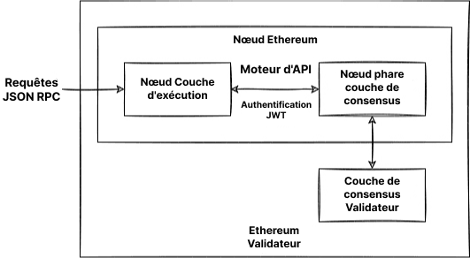

La gestion de votre propre nœud vous offre divers avantages, ouvre de nouvelles possibilités et aide à soutenir l'écosystème. Cette page vous guidera en faisant tourner votre propre nœud et en participant à la validation des transactions Ethereum.

Notez que depuis [La Fusion](/roadmap/merge), deux clients sont requis pour l'exécution d'un nœud Ethereum ; un client de **couche d'exécution (EL - Execution Layer)** et un client de **couche de consensus (CL - Consensus Layer)**. Cette page va vous montrer comment installer, configurer et connecter ces deux logiciels pour constituer un nœud Ethereum.

## Prérequis {#prerequisites}

Il est important de comprendre ce qu'est un nœud Ethereum et pourquoi vous pourriez vouloir exécuter un client. Cette section est couverte dans le chapitre [Clients et nœuds](/developers/docs/nodes-and-clients/).

Si vous êtes novice quant au sujet de l'exécution d'un nœud, ou si vous cherchez une explication moins technique, nous vous recommandons de consulter en premier lieu notre introduction facile sur [l'exécution d'un nœud Ethereum](/run-a-node).

## Choisir une approche {#choosing-approach}

La première étape pour faire tourner votre nœud est de choisir votre approche. En se basant sur les exigences et les différentes possibilités, vous devez sélectionner l'implémentation du client (à la fois d'exécution et de consensus), l'environnement (matériel, système) et les paramètres de configuration du client.

Cette page vous guidera à travers ces décisions et vous aidera à trouver le moyen le plus approprié quant à l'exécution de votre instance Ethereum.

Pour choisir parmi les clients d'implémentations, vous pouvez consulter l'ensemble des [clients d'exécution](/developers/docs/nodes-and-clients/#execution-clients) ainsi que les [clients de consensus](/developers/docs/nodes-and-clients/#consensus-clients) prêts sur le réseau principal, mais également découvrir les [clients de diversité](/developers/docs/nodes-and-clients/client-diversity).

Décidez si vous devez exécuter le logiciel sur votre propre [matériel ou dans le cloud](#local-vs-cloud), en tenant compte des [exigences des clients](#requirements).

Après avoir préparé l'environnement, installez les clients choisis soit avec [l'interface conviviale pour débutants](#automatized-setup) ou [manuellement](#manual-setup) en utilisant un terminal avec options avancées.

Lorsque le nœud est en cours d'exécution et de synchronisation, vous êtes prêt à [l'utiliser](#using-the-node), mais assurez-vous de garder un œil sur sa [maintenance](#operating-the-node).



### Environnement et matériel {#environment-and-hardware}

#### En local ou dans le cloud {#local-vs-cloud}

Les clients Ethereum peuvent fonctionner sur des ordinateurs grand public et ne nécessitent aucun matériel spécial, comme pour le minage par exemple. Vous disposez donc de différentes options pour le déploiement d'un nœud en fonction de vos besoins. Pour simplifier, considérons l'exécution d'un nœud à la fois sur une machine physique locale et sur un serveur cloud :

- Cloud
  - Les fournisseurs offrent un temps de disponibilité élevé des serveurs et des adresses IP publiques statiques
  - Obtenir un serveur dédié ou virtuel peut être plus confortable que de construire le vôtre
  - L'échange fait confiance à un tiers - fournisseur du serveur
  - En raison de la taille de stockage requise pour un nœud complet, le prix d'un serveur loué pourrait être élevé
- Son propre matériel
  - Une approche plus digne de confiance et souveraine
  - Investissement ponctuel
  - Une option pour acheter des machines préconfigurées
  - Vous devez paramétrer la machine physique, la maintenir et potentiellement résoudre les problèmes

Les deux options ont différents avantages résumés plus haut. Si vous cherchez une solution cloud, outre les nombreux fournisseurs traditionnels de cloud computing, il existe également des services axés sur le déploiement de nœuds. Consultez les [nœuds en tant que service](/developers/docs/nodes-and-clients/nodes-as-a-service/) pour plus d'options sur les nœuds hébergés.

#### Matériel {#hardware}

Cependant, un réseau décentralisé et résistant à la censure ne devrait pas reposer sur des fournisseurs de cloud. À l'inverse, faire tourner votre nœud avec votre propre matériel local est plus sain pour l'écosystème. [Les estimations](https://www.ethernodes.org/networkType/Hosting) montrent qu'une grande proportion de nœuds tournent dans le cloud, susceptibles de constituer un point de défaillance unique.

Les clients Ethereum peuvent être exécutés sur votre ordinateur, votre ordinateur portable, votre serveur ou même un ordinateur mono-carte. Bien que vous puissiez faire tourner des clients sur votre ordinateur personnel, utiliser une machine dédiée uniquement à votre nœud permet de grandement améliorer les performances et la sécurité tout en minimisant l'impact sur votre ordinateur principal.

Utiliser votre propre matériel peut être très facile. Il existe de nombreuses options simples ainsi que des configurations avancées pour les personnes plus techniques. Examinons donc les exigences et les moyens pour exécuter des clients Ethereum sur votre machine.

#### Prérequis {#requirements}

Les exigences matérielles diffèrent selon le client, mais ne sont en général pas si élevées puisque le nœud doit simplement rester synchronisé. Attention à ne pas confondre avec le minage, qui nécessite beaucoup plus de puissance de calcul. Le temps de synchronisation et les performances s'améliorent toutefois avec un matériel plus puissant.

Avant d'installer un client, assurez-vous que votre ordinateur dispose de suffisamment de ressources pour l'exécuter. Vous trouverez ci-dessous les conditions minimales recommandées.

Le facteur limitant de votre matériel est généralement le stockage. La synchronisation de la blockchain Ethereum est très intense en lecture/écriture et nécessite beaucoup d'espace. Il est recommandé d'utiliser un **disque dur SSD** contenant des centaines de Go d'espace libre, même après la synchronisation.

La taille de la base de données et la vitesse de la synchronisation initiale dépendent du client choisi, de sa configuration et de sa [stratégie de synchronisation](/developers/docs/nodes-and-clients/#sync-modes).

Assurez-vous également que votre [bande passante](https://wikipedia.org/wiki/Data_cap) vers Internet ne soit pas limitée. Il est recommandé d'utiliser une connexion illimitée car la synchronisation initiale et les données diffusées sur le réseau pourraient dépasser votre limite.

##### Système d'exploitation

Tous les clients prennent en charge les principaux systèmes d'exploitation - Linux, MacOS, Windows. Cela signifie que vous pouvez exécuter des nœuds sur des ordinateurs de bureau ou des serveurs classiques avec le système d'exploitation (OS) qui vous convient le mieux. Assurez-vous que votre système d'exploitation est à jour pour éviter les problèmes potentiels et les failles de sécurité.

##### Configuration minimale requise

- CPU avec 2 cœurs et +
- 8 GB de RAM
- SSD de 2 To
- Bande passante de 10 Mbps

##### Spécifications recommandées

- CPU rapide avec 4 cœurs et +
- 16 Go+ de RAM
- SSD rapide avec 2 To+
- Bande passante de 25 Mbps

Le mode de synchronisation et le client que vous choisissez aura une incidence sur l'espace nécessaire, mais nous avons estimé ci-dessous l'espace disque dont vous aurez besoin pour chaque client.

| Client     | Taille du disque (synchro. snap) | Taille du disque (archive complète) |
| ---------- | -------------------------------- | ----------------------------------- |
| Besu       | 800 Go+                          | 12 To+                              |
| Erigon     | N/A                              | 2,5 To+                             |
| Geth       | 500 Go+                          | 12 To+                              |
| Nethermind | 500 Go+                          | 12 To+                              |
| Reth       | N/A                              | 2.2TB+                              |

- Remarque : Erigon et Reth ne proposent pas de synchronisation instantanée, mais l'élagage complet est possible (~2 To pour Erigon, ~1,2 To pour Reth)

Pour les clients de consensus, les besoins d'espace dépendent également de l'implémentation du client et des fonctionnalités activées (par exemple, validator slasher) mais comptez généralement 200 Go supplémentaires pour les données de la chaîne phare. Avec un grand nombre de validateurs, la charge de bande passante augmente également. Vous trouverez [des détails sur les exigences concernant les clients de consensus dans cette analyse](https://mirror.xyz/0x934e6B4D7eee305F8C9C42b46D6EEA09CcFd5EDc/b69LBy8p5UhcGJqUAmT22dpvdkU-Pulg2inrhoS9Mbc).

#### Les solutions Plug-and-Play {#plug-and-play}

L'option la plus simple pour exécuter un nœud avec votre propre matériel est d'utiliser des boites plug-and-play. Les machines préconfigurées des fournisseurs offrent l'expérience la plus simple qui soit : commande, connexion, exécution. Tout est préconfiguré et s'exécute automatiquement avec un guide intuitif et un tableau de bord pour surveiller et contrôler le logiciel.

- [DappNode](https://dappnode.io/)
- [Avado](https://ava.do/)

#### Ethereum sur un ordinateur monocarte {#ethereum-on-a-single-board-computer}

Un moyen facile et bon marché de faire fonctionner un nœud Ethereum est d'utiliser un seul ordinateur de bord, même avec une architecture ARM comme le Raspberry Pi. [Ethereum sur ARM](https://ethereum-on-arm-documentation.readthedocs.io/en/latest/) fournit des images faciles à exécuter de multiples exécutions et du client de consensus pour Raspberry Pi et d'autres cartes ARM.

Les petits appareils, abordables et efficaces comme ceux-ci, sont parfaits pour faire tourner un nœud à la maison. Néanmoins, gardez à l'esprit leur performance limitée.

## Faire tourner le nœud {#spinning-up-node}

La configuration actuelle du client peut être effectuée soit avec des lanceurs automatisés, soit manuellement, en configurant directement le logiciel client.

Pour les utilisateurs moins avancés, l'approche recommandée est d'utiliser un lanceur automatique, c'est-à-dire un logiciel qui vous guide à travers l'installation et automatise le processus d'installation du client. Cependant, si vous avez une certaine expérience de l'utilisation d'un terminal, les étapes de la configuration manuelle devraient être simples à suivre.

### Configuration guidée {#automatized-setup}

Plusieurs projets conviviaux visent à améliorer l'expérience de la mise en place d'un client. Ces lanceurs fournissent l'installation et la configuration automatiques du client, certains offrant même une interface graphique pour la configuration guidée et la surveillance des clients.

Voici quelques projets qui peuvent vous aider à installer et à contrôler vos clients en quelques clics :

- [DappNode](https://docs.dappnode.io/docs/user/getting-started/choose-your-path) - DappNode ne se limite pas à une machine provenant d'un fournisseur. Le logiciel, le véritable lanceur de nœuds et le centre de contrôle offrant de nombreuses fonctionnalités peuvent être utilisés sur du matériel divers.
- [eth-docker](https://eth-docker.net/) - Configuration automatisée à l'aide de Docker et axée sur une mise en jeu facile et sécurisée. Requiert des connaissances de base sur le terminal et Docker. Recommandée pour des utilisateurs plus aguerris.
- [Stereum](https://stereum.net/ethereum-node-setup/) - Lanceur automatisé pour installer des clients sur un serveur à distance via une connexion SSH comprenant un guide de configuration GUI, un centre de contrôle et bien d'autres fonctionnalités.
- [NiceNode](https://www.nicenode.xyz/) - Lanceur offrant une expérience utilisateur simple pour exécuter un nœud sur votre ordinateur. Il vous suffit de choisir vos clients et de les démarrer en quelques clics. Toujours en développement.
- [Sedge](https://docs.sedge.nethermind.io/docs/intro) - Outil de configuration de nœud qui génère automatiquement une configuration Docker à l'aide de l'assistant CLI. Écrit en Go par Nethermind.

### Configuration manuelle des clients {#manual-setup}

L'autre option est de télécharger, vérifier et configurer le logiciel client manuellement. Même si certains clients offrent une interface graphique, une configuration manuelle nécessite toujours des compétences de base concernant le terminal mais offre beaucoup plus de polyvalence.

Comme expliqué précédemment, la mise en place de votre propre nœud Ethereum nécessitera l'exécution de deux clients, un de consensus et un d'exécution. Certains clients peuvent inclure un client léger de l'autre type et se synchroniser sans autre logiciel nécessaire. Cependant, une vérification totale de confiance nécessite les deux implémentations.

#### Obtenir le logiciel client {#getting-the-client}

Tout d'abord, vous devez obtenir vos logiciels [client d'exécution](/developers/docs/nodes-and-clients/#execution-clients) ainsi que [client de consensus](/developers/docs/nodes-and-clients/#consensus-clients) préférés.

Vous pouvez simplement télécharger une application exécutable ou un pack d'installation qui convient à votre système d'exploitation et à votre architecture. Vérifiez toujours les signatures et les sommes de contrôle des packs téléchargés. Certains clients proposent également des répertoires ou des images Docker pour faciliter l'installation et les mises à jour. Tous les clients sont Open source, vous pouvez donc également les compiler à partir de leur source. C'est une méthode plus avancée, mais dans certains cas, elle peut être requise.

Les instructions d'installation de chaque client sont fournies dans la documentation liée aux listes de clients ci-dessus.

Voici les pages de publication des clients sur lesquelles vous pouvez trouver les binaires pré-compilés ou les instructions sur l'installation :

##### Clients d'exécution

- [Besu](https://github.com/hyperledger/besu/releases)
- [Erigon](https://github.com/ledgerwatch/erigon/releases)
- [Geth](https://geth.ethereum.org/downloads/)
- [Nethermind](https://downloads.nethermind.io/)
- [Reth](https://reth.rs/installation/installation.html)

Il convient également de noter que la diversité de clients est un problème [pour la couche d'exécution](/developers/docs/nodes-and-clients/client-diversity/#execution-layer). Il est recommandé aux lecteurs d'envisager d'exécuter un client d'exécution minoritaire.

##### Clients de consensus

- [Lighthouse](https://github.com/sigp/lighthouse/releases/latest)
- [Lodestar](https://chainsafe.github.io/lodestar/install/source/) (ne fournit pas de binaire pré-compilé, seulement une image Docker ou à construire à partir de la source)
- [Nimbus](https://github.com/status-im/nimbus-eth2/releases/latest)
- [Prysm](https://github.com/prysmaticlabs/prysm/releases/latest)
- [Teku](https://github.com/ConsenSys/teku/releases)

[La diversité des clients](/developers/docs/nodes-and-clients/client-diversity/) est critique pour les nœuds de consensus exécutés par des validateurs. Si la majorité des validateurs exécute un unique client d'implémentation, la sécurité du réseau est menacée. Il est donc recommandé d'envisager de choisir un client minoritaire.

[Voir les dernières utilisations de clients réseau](https://clientdiversity.org/) et en apprendre plus sur [la diversité des clients](/developers/docs/nodes-and-clients/client-diversity).

##### Vérification du logiciel

Lorsque vous téléchargez des logiciels depuis Internet, il est recommandé de vérifier leur intégrité. Cette étape est facultative, mais avec une infrastructure cruciale comme le client Ethereum, Il est important d'être conscient des vecteurs d'attaque potentiels et de les éviter. Si vous avez téléchargé un binaire pré-compilé, vous devez avoir confiance en la source et courir le risque qu'un attaquant puisse avoir échangé l'exécutable contre un exécutable malveillant.

Les développeurs signent les binaires publiés avec leurs clés PGP afin de pouvoir vérifier cryptographiquement que vous exécutez exactement le logiciel qu'ils ont créé. Il vous suffit d'obtenir les clés publiques utilisées par les développeurs : celles-ci peuvent être trouvées sur les pages de publication du client ou dans la documentation. Après avoir téléchargé la version client et sa signature, vous pouvez utiliser une implémentation PGP, par exemple [GnuPG](https://gnupg.org/download/index.html) pour les vérifier facilement. Consultez un tutoriel sur la vérification de logiciels open-source avec `gpg` sur [linux](https://www.tecmint.com/verify-pgp-signature-downloaded-software/) ou [Windows/MacOS](https://freedom.press/training/verifying-open-source-software/).

Une autre forme de vérification est de s'assurer que le hachage, une empreinte cryptographique unique du logiciel que vous avez téléchargé, correspond à celle fournie par les développeurs. C'est encore plus simple que d'utiliser PGP, et certains clients n'offrent que cette option. Il vous suffit d'exécuter la fonction de hachage sur le logiciel téléchargé et de la comparer à celle de la page de publication. Par exemple :

```sh
sha256sum teku-22.6.1.tar.gz

9b2f8c1f8d4dab0404ce70ea314ff4b3c77e9d27aff9d1e4c1933a5439767dde
```

#### Configuration du client {#client-setup}

Après avoir installé, téléchargé ou compilé le logiciel client, vous êtes prêt à l'exécuter. Cela signifie seulement qu'il doit être exécuté avec la configuration appropriée. Les clients offrent de riches options de configuration, qui permettent d'activer diverses fonctionnalités.

Commençons par les options susceptibles d'influencer de manière significative la performance du client et l'utilisation de données. [Les modes de synchronisation](/developers/docs/nodes-and-clients/#sync-modes) représentent différentes méthodes de téléchargement et de validation des données blockchain. Avant de commencer le nœud, vous devez décider du réseau et du mode de synchronisation à utiliser. Les choses les plus importantes à considérer sont l'espace disque et le temps de synchronisation dont le client a besoin. Lisez attentivement la documentation du client pour connaître le mode de synchronisation par défaut. Choisissez celui qui vous convient le mieux en fonction du niveau de sécurité, des données disponibles et du coût. En dehors de l'algorithme de synchronisation, vous pouvez configurer l'élagage de différents types de données anciennes. L'élagage permet de supprimer les données obsolètes, par exemple supprimer les nœuds d'arborescence d'état qui ne sont pas joignables depuis des blocs récents.

Parmi les autres options de configuration de base, citons, par exemple, le choix du réseau - réseau principal ou réseau de test - l'activation d'un point de terminaison HTTP pour RPC ou WebSockets, etc. Vous pouvez trouver toutes les fonctionnalités et options dans la documentation du client. Diverses configurations de client peuvent être définies en exécutant le client avec les options correspondantes directement dans le CLI ou le fichier de configuration. Chaque client est un peu différent ; veuillez toujours vous référer à sa documentation officielle ou à sa page d'aide pour plus de détails sur les options de configuration.

À des fins de test, vous pouvez exécuter un client sur un des réseaux de test. [Voir l'aperçu des réseaux pris en charge](/developers/docs/nodes-and-clients/#execution-clients).

Des exemples de clients d'exécution dotés d'une configuration de base peuvent être trouvés dans la section suivante.

#### Démarrer le client d'exécution {#starting-the-execution-client}

Avant de démarrer le logiciel client Ethereum, vérifiez une dernière fois que votre environnement est prêt. Par exemple, assurez-vous que :

- Il y a suffisamment d'espace disque compte tenu du réseau et du mode de synchronisation choisis.
- La mémoire et le processeur ne sont pas déjà utilisés par d'autres programmes.
- Votre système d'exploitation est à jour.
- La date et l'heure de votre système sont corrects.
- Votre routeur et votre pare-feu acceptent les connexions sur les ports d'écoute. Par défaut, les clients Ethereum utilisent un port listener (TCP) et un port discovery (UDP), tous deux sur 30303.

Exécutez d'abord votre client sur un réseau de test pour vous assurer que tout fonctionne correctement.

Au démarrage, vous devez déclarer tous les paramètres du client qui ne sont pas par défaut. Vous pouvez utiliser les drapeaux ou le fichier de configuration pour indiquer votre configuration préférée. Le jeu de fonctionnalités et la syntaxe de configuration de chaque client diffèrent. Consultez la documentation de votre client pour plus de détails.

Les clients d'exécution et de consensus communiquent par l'intermédiaire d'un point de terminaison authentifié spécifié dans [l'API Moteur](https://github.com/ethereum/execution-apis/tree/main/src/engine). Afin de se connecter à un client de consensus, le client d'exécution doit générer un [`jwtsecret`](https://jwt.io/) à un chemin connu. Pour des raisons de sécurité et de stabilité, les clients doivent être exécutés sur la même machine, et les deux clients doivent connaître ce chemin dans la mesure où il est utilisé pour authentifier une connexion RPC locale. Le client d'exécution doit aussi définir un port d'écoute pour les API authentifiées.

Ce jeton est généré automatiquement par le logiciel client, mais dans certains cas, vous pourriez avoir besoin de le faire vous-même. Vous pouvez le générer à l'aide d'[OpenSSL](https://www.openssl.org/):

```sh
openssl rand -hex 32 > jwtsecret
```

#### Démarrer le client d'exécution {#running-an-execution-client}

Cette section vous guidera dans le démarrage des clients d'exécution. Elle sert uniquement d'exemple de configuration de base, qui démarrera le client avec ces paramètres :

- Spécifie le réseau auquel se connecter, le Réseau principal dans nos exemples
  - Vous pouvez à la place choisir [l'un des réseaux de test](/developers/docs/networks/) pour faire un premier test de votre configuration
- Définit le répertoire de données, où toutes les données, y compris la blockchain, seront enregistrées
  - Assurez-vous de remplacer le chemin par un chemin réel, par exemple pointant vers votre disque externe
- Active les interfaces pour communiquer avec le client
  - Y compris JSON-RPC et Engine API pour la communication avec le client de consensus
- Définit le chemin vers `jwtsecret` pour l'API authentifiée
  - Assurez-vous de remplacer le chemin exemple par un chemin réel accessible par les clients, par exemple `/tmp/jwtsecret`

Gardez à l'esprit que ce n'est qu'un exemple de base, tous les autres paramètres seront définis par défaut. Référez-vous à la documentation de chaque client pour en savoir plus sur les valeurs par défaut, les paramètres et les fonctionnalités. Pour plus de fonctionnalités, par exemple concernant l'exécution des validateurs, la surveillance, etc., veuillez vous référer à la documentation du client spécifique.

> Veuillez noter que les antislashes `\` visibles dans les exemples ne sont présents qu'à des fins de formatage ; les options de configuration peuvent être définies en une seule ligne.

##### Exécuter Besu

Cet exemple fait démarrer Besu sur le Réseau principal, stocke les données blockchain au format par défaut dans `/data/ethereum`, active JSON RPC et Engine RPC pour connecter le client de consensus. Engine API est authentifié avec le jeton `jwtsecret` et seuls les appels de `localhost` sont autorisés.

```sh
besu --network=mainnet \
    --data-path=/data/ethereum \
    --rpc-http-enabled=true \
    --engine-rpc-enabled=true \
    --engine-host-allowlist="*" \
    --engine-jwt-enabled=true \
    --engine-jwt-secret=/path/to/jwtsecret
```

Besu est également fourni avec un lanceur optionnel qui posera une série de questions et générera le fichier de configuration. Exécutez le lanceur interactif en utilisant :

```sh
besu --Xlauncher
```

[La documentation de Besu](https://besu.hyperledger.org/en/latest/HowTo/Get-Started/Starting-node/) contient des options supplémentaires et des détails de configuration.

##### Exécuter Erigon

Cet exemple fait démarrer Erigon sur le Réseau principal, stocke les données blockchain dans `/data/ethereum`, active JSON-RPC, définit les espaces de noms autorisés et active l'authentification pour connecter le client de consensus défini par le chemin `jwtsecret`.

```sh
erigon --chain mainnet \
    --datadir /data/ethereum  \
    --http --http.api=engine,eth,web3,net \
    --authrpc.jwtsecret=/path/to/jwtsecret
```

Erigon effectue par défaut une synchronisation complète avec un disque dur de 8 Go qui se traduira par plus de 2 To de données d'archivage. Assurez-vous que `datadir` pointe sur un disque avec assez d'espace libre ou utilisez le drapeau `--prune` pour réduire différents types de données. Consultez la documentation d'Erigon `--help` pour en savoir plus.

##### Exécuter Geth

Cet exemple fait démarrer Geth sur le Réseau principal, stocke les données blockchain dans `/data/ethereum`, active JSON RPC et définit les espaces de noms autorisés. Il active également l'authentification pour connecter le client de consensus qui nécessite le chemin vers `jwtsecret` ainsi que l'option définissant les connexions autorisées, dans notre exemple uniquement à partir de `localhost`.

```sh
geth --mainnet \
    --datadir "/data/ethereum" \
    --http --authrpc.addr localhost \
    --authrpc.vhosts="localhost" \
    --authrpc.port 8551
    --authrpc.jwtsecret=/path/to/jwtsecret
```

Vérifiez la documentation [pour toutes les options de configuration](https://geth.ethereum.org/docs/fundamentals/command-line-options) et apprenez-en plus sur [l'exécution de Geth avec un client de consensus](https://geth.ethereum.org/docs/getting-started/consensus-clients).

##### Exécuter Nethermind

Nethermind offre diverses [options d'installation](https://docs.nethermind.io/nethermind/first-steps-with-nethermind/getting-started). Le paquet est fourni avec divers binaires, y compris un lanceur doté d'une installation guidée, qui vous aidera à créer votre configuration de manière interactive. Autrement, vous trouverez Runner, qui est l'exécutable lui-même, et pouvez simplement l'exécuter en utilisant des options de configuration. JSON-RPC est activé par défaut.

```sh
Nethermind.Runner --config mainnet \
    --datadir /data/ethereum \
    --JsonRpc.JwtSecretFile=/path/to/jwtsecret
```

La documentation de Nethermind offre un [guide complet](https://docs.nethermind.io/nethermind/first-steps-with-nethermind/running-nethermind-post-merge) sur le fonctionnement de Nethermind avec un client de consensus.

Un client d'exécution initiera ses fonctions principales, ses points de terminaison choisis, et commencera à rechercher des pairs. Après avoir réussi à trouver des pairs, le client débute la synchronisation. Le client d'exécution attendra une connexion du client de consensus. Les données actuelles de la blockchain seront disponibles une fois le client correctement synchronisé avec l'état actuel.

##### Exécuter Reth

Cet exemple fait démarrer Reth sur le réseau principal, en utilisant l'emplacement de données par défaut. Active l'authentification JSON-RPC et Engine RPC pour la connexion au client de consensus, qui est définie par le chemin `jwtsecret`, seuls les appels provenant de `localhost` étant autorisés.

```sh
nœud reth \
    --authrpc.jwtsecret /path/to/jwtsecret \
    --authrpc.addr 127.0.0.1 \
    --authrpc.port 8551
```

Consultez [Configurer Reth](https://reth.rs/run/config.html?highlight=data%20directory#configuring-reth) pour en savoir plus sur les répertoires de données par défaut. [La documentation de Reth](https://reth.rs/run/mainnet.html) contient des options supplémentaires et des détails de configuration.

#### Démarrer le client de consensus {#starting-the-consensus-client}

Le client de consensus doit être démarré avec la bonne configuration de port pour établir une connexion RPC locale avec le client d'exécution. Le client de consensus doit être exécuté avec le port du client d'exécution exposé en tant qu'argument de configuration.

Le client de consensus a également besoin du chemin vers le `jwt-secret` du client d'exécution afin d'authentifier la connexion RPC entre eux. Comme pour les exemples d'exécution ci-dessus, chaque client de consensus possède une option de configuration qui prend le chemin du fichier jwt token comme argument. Celui-ci doit être compatible avec le chemin `jwtsecret` fourni au client d'exécution.

Si vous prévoyez d'exécuter un validateur, assurez-vous d'ajouter une option de configuration spécifiant l'adresse Ethereum du destinataire des frais. C'est là que s'accumulent les récompenses en ether de votre validateur. Chaque client de consensus a une option, par exemple `--suggested-fee-recipient=0xabcd1`, qui prend une adresse Ethereum comme argument.

Lorsque vous démarrez un nœud phare sur un réseau de test, vous pouvez gagner un temps de synchronisation significatif en utilisant un point de terminaison public pour [la synchronisation Checkpoint](https://notes.ethereum.org/@launchpad/checkpoint-sync).

#### Exécuter un client de consensus {#running-a-consensus-client}

##### Exécuter Lighthouse

Avant d'exécuter Lighthouse, apprenez-en plus sur la façon de l'installer et de le configurer dans [la documentation Lighthouse](https://lighthouse-book.sigmaprime.io/installation.html).

```sh
lighthouse beacon_node \
    --network mainnet \
    --datadir /data/ethereum \
    --http \
    --execution-endpoint http://127.0.0.1:8551 \
    --execution-jwt /path/to/jwtsecret
```

##### Exécuter Lodestar

Installez le logiciel Lodestar en le compilant ou en téléchargeant l'image Docker. Apprenez-en plus dans [la documentation](https://chainsafe.github.io/lodestar/) et le [guide d'installation](https://hackmd.io/@philknows/rk5cDvKmK) approfondi.

```sh
lodestar beacon \
    --rootDir="/data/ethereum" \
    --network=mainnet \
    --eth1.enabled=true \
    --execution.urls="http://127.0.0.1:8551" \
    --jwt-secret="/path/to/jwtsecret"
```

##### Exécuter Nimbus

Nimbus est fourni avec les clients de consensus et d'exécution. Il peut être exécuté sur différents appareils, même avec une puissance informatique très modeste. Après [avoir installé les dépendances et Nimbus lui-même](https://nimbus.guide/quick-start.html), vous pouvez exécuter son client de consensus :

```sh
nimbus_beacon_node \
    --network=mainnet \
    --web3-url=http://127.0.0.1:8551 \
    --rest \
    --jwt-secret="/path/to/jwtsecret"
```

##### Exécuter Prysm

Prysm est livré avec un script qui permet une installation automatique facile. Les détails peuvent être trouvés dans [la documentation Prysm](https://docs.prylabs.network/docs/install/install-with-script).

```sh
./prysm.sh beacon-chain \
    --mainnet \
    --datadir /data/ethereum  \
    --execution-endpoint=http://localhost:8551  \
    --jwt-secret=/path/to/jwtsecret
```

##### Exécuter Teku

```sh
teku --network mainnet \
    --data-path "/data/ethereum" \
    --ee-endpoint http://localhost:8551 \
    --ee-jwt-secret-file "/path/to/jwtsecret"
```

Lorsqu'un client de consensus se connecte au client d'exécution pour lire le contrat de dépôt et identifier les validateurs, il se connecte également à d'autres nœuds phares et commence à synchroniser les créneaux de consensus à partir de la genèse. Une fois la période actuelle atteinte par le nœud phare, l'API phare devient utilisable pour vos validateurs. En savoir plus sur [l'API des nœuds phares](https://eth2docs.vercel.app/).

### Ajouter des Validateurs {#adding-validators}

Un client de consensus joue le rôle de nœud phare pour que les validateurs puissent se connecter. Chaque client de consensus a son propre logiciel de validateur décrit en détail dans sa documentation respective.

Exécuter votre propre validateur permet la [mise en jeu individuelle](/staking/solo/), la méthode la plus efficace et la plus fiable pour soutenir le réseau Ethereum. Cependant, cela nécessite un dépôt de 32 ETH. Pour exécuter un validateur sur votre propre nœud avec un montant moindre, un groupe d'enjeu décentralisé comportant des opérateurs de nœuds sans intermédiaire de confiance, comme [Rocket Pool](https://rocketpool.net/node-operators), pourrait vous intéresser.

La façon la plus simple de commencer avec la mise en jeu et la génération de clés de validateur est d'utiliser [la plateforme de lancement de mise en jeu du réseau de test Holesky](https://holesky.launchpad.ethereum.org/), qui vous permet de tester votre configuration en [exécutant des nœuds sur Holesky](https://notes.ethereum.org/@launchpad/holesky). Lorsque vous êtes prêt pour le réseau principal, vous pouvez répéter ces étapes en utilisant la [plateforme de lancement de mise en jeu du réseau principal](https://launchpad.ethereum.org/).

Consultez la page [de mise en jeu](/staking) pour obtenir un aperçu des options de mise en jeu.

### Utiliser le nœud {#using-the-node}

Les clients d'exécution offrent des [terminaux RPC API](/developers/docs/apis/json-rpc/) que vous pouvez utiliser pour soumettre des transactions, interagir avec des contrats intelligents ou les déployer sur le réseau Ethereum de différentes manières :

- Les appeler manuellement avec un protocole approprié (par exemple en utilisant `curl`)
- Attacher une console fournie (par exemple `geth attach`)
- Les implémenter dans des applications utilisant des bibliothèques web3, par exemple [web3.py](https://web3py.readthedocs.io/en/stable/overview.html#overview), [ethers](https://github.com/ethers-io/ethers.js/)

Chaque client dispose d'une implémentation différente des points de terminaison RPC. Mais il existe un standard JSON-RPC que vous pouvez utiliser avec chaque client. Pour une vue d'ensemble [lisez la documentation JSON-RPC](/developers/docs/apis/json-rpc/). Les applications ayant besoin d'informations du réseau Ethereum peuvent utiliser ce RPC. Par exemple, le portefeuille populaire MetaMask vous permet [de vous connecter à votre propre terminal RPC](https://metamask.zendesk.com/hc/en-us/articles/360015290012-Using-a-Local-Node), celui-ci offrant de solides avantages en termes de confidentialité et de sécurité.

Les clients de consensus exposent tous une [API phare](https://ethereum.github.io/beacon-APIs) qui peut être utilisée pour vérifier l'état du client de consensus ou télécharger des blocs et des données de consensus en envoyant des requêtes à l'aide d'outils tels que [Curl](https://curl.se). Vous trouverez plus d'informations à ce sujet dans la documentation de chaque client de consensus.

#### Atteindre le RPC {#reaching-rpc}

Le port par défaut pour l'exécution du client JSON-RPC est `8545`, mais vous pouvez modifier les ports des terminaux locaux dans la configuration. Par défaut, l'interface RPC n'est accessible que sur l'hôte local de votre ordinateur. Pour le rendre accessible à distance, vous pourriez vouloir le montrer au public en modifiant l'adresse en `0.0.0.0`. Cela le rendra accessible via les adresses IP locales et publiques. Dans la plupart des cas, vous devrez également configurer la redirection de port sur votre routeur.

Soyez vigilant lorsque vous rendez les ports accessibles à distance, car cela permettra à quiconque sur Internet de contrôler votre nœud. Des acteurs malveillants pourraient accéder à votre nœud pour neutraliser votre système ou voler vos fonds si vous utilisez votre client comme portefeuille.

Un moyen de contourner ce problème est d'éviter que des méthodes RPC potentiellement dangereuses ne soient modifiables. Par exemple, avec Geth, vous pouvez indiquer des méthodes modifiables via une option : `--http.api web3,eth,txpool`.

L'accès à l'interface RPC peut être étendu via le développement d'API de couche périphérique ou d'applications de serveur web, comme Nginx, et en les connectant à l'adresse locale et au port de votre client. L'utilisation d'une couche intermédiaire peut également permettre aux développeurs de configurer un certificat pour les connexions `https` sécurisées sur l'interface RPC.

Configurer un serveur web, un proxy, ou l'API Rest externe n'est pas le seul moyen de fournir un accès au point de terminaison RPC de votre nœud. Une façon respectueuse de la vie privée de créer un point de terminaison accessible au public est de l'héberger sur votre propre service d'oignon [Tor](https://www.torproject.org/). Cela vous permettra d'atteindre le RPC en dehors de votre réseau local sans adresse IP publique statique ni ports ouverts. Cependant, utiliser cette configuration peut ne permettre l'accès au point de terminaison RPC que via le réseau Tor, qui n'est pas supporté par toutes les applications et peut entraîner des problèmes de connexion.

Pour cela, vous devez créer votre propre [service d'oignon](https://community.torproject.org/onion-services/). Consultez [la documentation](https://community.torproject.org/onion-services/setup/) sur la configuration du service oignon pour héberger la vôtre. Vous pouvez le diriger vers un serveur web avec un proxy vers le port RPC ou simplement directement vers le RPC.

Enfin, l'un des moyens les plus populaires de fournir un accès aux réseaux internes est d'utiliser une connexion VPN. Selon les cas d'utilisation et la quantité d'utilisateurs ayant besoin d'accéder à votre nœud, une connexion VPN sécurisée pourrait être une option. [OpenVPN](https://openvpn.net/) est un VPN SSL complet qui implémente l'extension réseau sécurisée OSI de couche 2 ou 3 en utilisant le protocole standard SSL/TLS, supporte les méthodes d'authentification client flexibles basées sur des certificats, cartes à puce, et/ou identifiants d’utilisateur/mot de passe, et admet des politiques de contrôle d’accès spécifiques à l’utilisateur ou au groupe en utilisant les règles de pare-feu appliquées à l’interface virtuelle VPN.

### Maintenir le nœud {#operating-the-node}

Vous devriez surveiller régulièrement votre nœud pour vous assurer qu'il fonctionne correctement. Vous devrez peut-être effectuer un entretien occasionnel.

#### Garder le nœud en ligne {#keeping-node-online}

Votre nœud ne doit pas rester en ligne en permanence, mais vous devriez le maintenir en ligne le plus souvent possible pour qu'il reste synchronisé avec le réseau. Vous pouvez l'éteindre pour le redémarrer, mais gardez en tête que :

- L'arrêt peut prendre quelques minutes si le dernier état est toujours en cours d'écriture sur le disque.
- L'arrêt forcé peut endommager la base de données, vous obligeant à resynchroniser le nœud entier.
- Votre client sera désynchronisé du réseau et devra donc rétablir sa synchronisation lors du redémarrage. Bien que le nœud puisse commencer à synchroniser là où il a été éteint, le processus peut prendre un certain temps selon la durée passée hors ligne.

_Ceci ne s'applique pas pour les nœuds de validateur de couche de consensus._ Mettre votre nœud hors ligne affectera tous les services qui en dépendent. Si vous exécutez un nœud pour _miser_, vous devriez essayer de minimiser le temps d'arrêt autant que possible.

#### Créer des services client {#creating-client-services}

Envisagez de créer un service pour exécuter automatiquement vos clients au démarrage. Par exemple, sur les serveurs Linux, la bonne pratique consisterait à créer un service, par exemple avec `systemd`, qui exécute le client avec une configuration appropriée, sous un utilisateur aux privilèges limités, et redémarre automatiquement.

#### Mettre à jour les clients {#updating-clients}

Vous devez conserver votre logiciel client à jour avec les derniers patchs de sécurité, les dernières fonctionnalités et les [EIP](/eips/). Tout particulièrement avant [les fourches majeures](/history/), assurez-vous d'utiliser les bonnes versions client.

> Avant les mises à jour importantes du réseau, EF publie un message sur son [blog](https://blog.ethereum.org). Vous pouvez [vous abonner à ces annonces](https://blog.ethereum.org/category/protocol#subscribe) pour recevoir une notification par email lorsque votre nœud a besoin d'une mise à jour.

La mise à jour des clients est très simple. Chaque client a des instructions spécifiques dans sa documentation, mais le processus consiste généralement à simplement télécharger la dernière version et à redémarrer le client avec le nouvel exécutable. Le client devrait reprendre là où il s'est arrêté, mais avec les mises à jour appliquées.

Chaque implémentation client dispose d'un identifiant de version lisible par un humain et utilisé dans le protocole de pair-à-pair, mais également accessible depuis la ligne de commande. Cet identifiant permet aux utilisateurs de vérifier qu'ils utilisent la bonne version et aux explorateurs de blocs et autres outils d'analyse de mesurer la distribution des différents clients sur le réseau. Veuillez vous référer à la documentation de chaque client pour plus d'informations sur les chaînes de version.

#### Faire fonctionner des services supplémentaires {#running-additional-services}

Exécuter votre propre nœud vous permet d'utiliser des services qui nécessitent un accès direct au client RPC Ethereum. Ce sont des services construits sur Ethereum comme les [solutions de couche 2](/developers/docs/scaling/#layer-2-scaling), de backend pour les portefeuilles, des explorateurs de blocs, des outils de développement et d'autre infrastructure Ethereum.

#### Surveiller le nœud {#monitoring-the-node}

Pour bien surveiller votre nœud, envisagez de collecter des mesures. Les clients fournissent des points de terminaison métriques pour que vous puissiez obtenir des données complètes sur votre nœud. Utilisez des outils comme [InfluxDB](https://www.influxdata.com/get-influxdb/) ou [Prometheus](https://prometheus.io/) pour créer des bases de données susceptibles d'être transformées en visualisations et graphiques dans des logiciels tels que [Grafana](https://grafana.com/). Il existe de nombreuses configurations pour utiliser ce logiciel et différents tableaux de bord Grafana pour visualiser votre nœud et le réseau dans son ensemble. Par exemple, consultez le tutoriel [sur la surveillance de Geth](/developers/tutorials/monitoring-geth-with-influxdb-and-grafana/).

Dans le cadre de votre surveillance, assurez-vous de garder un œil sur les performances de votre machine. Lors de la synchronisation initiale de votre nœud, le logiciel client peut être très lourd en CPU et en RAM. Pour ce faire, outre Grafana, vous pouvez utiliser les outils proposés par votre système d'exploitation comme `htop` ou `uptime`.

## Complément d'information {#further-reading}

- [Ethereum Staking Guides](https://github.com/SomerEsat/ethereum-staking-guides) - _Somer Esat, régulièrement mis à jour_
- [Guide | How to setup a validator for Ethereum staking on mainnet](https://www.coincashew.com/coins/overview-eth/guide-or-how-to-setup-a-validator-on-eth2-mainnet) _– CoinCashew, régulièrement mis à jour_
- [ETHStaker guides on running validators on testnets](https://github.com/remyroy/ethstaker#guides) – _ETHStaker, régulièrement mis à jour_
- [The Merge FAQ for node operators](https://notes.ethereum.org/@launchpad/node-faq-merge) - _Juillet 2022_
- [Analyzing the hardware requirements to be an Ethereum full validated node](https://medium.com/coinmonks/analyzing-the-hardware-requirements-to-be-an-ethereum-full-validated-node-dc064f167902) _– Albert Palau, 24 Septembre 2018_
- [Running Ethereum Full Nodes: A Guide for the Barely Motivated](https://medium.com/@JustinMLeroux/running-ethereum-full-nodes-a-guide-for-the-barely-motivated-a8a13e7a0d31) _– Justin Leroux, 7 novembre 2019_
- [Running a Hyperledger Besu Node on the Ethereum Mainnet: Benefits, Requirements, and Setup](https://pegasys.tech/running-a-hyperledger-besu-node-on-the-ethereum-mainnet-benefits-requirements-and-setup/) _- Felipe Faraggi, 7 mai 2020_
- [Déploiement du client Nethermind Ethereum avec la pile de surveillance](https://medium.com/nethermind-eth/deploying-nethermind-ethereum-client-with-monitoring-stack-55ce1622edbd) _– Nethermind.eth, 8 juillet 2020_

## Sujets connexes {#related-topics}

- [ Nœuds et clients](/developers/docs/nodes-and-clients/)
- [Blocs](/developers/docs/blocks/)
- [Réseaux](/developers/docs/networks/)
