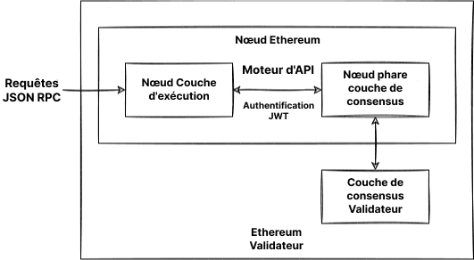

Exécuter votre propre nœud vous offre divers avantages, ouvre de nouvelles possibilités et aide à soutenir l'écosystème. Cette page vous guidera pour lancer votre propre nœud et participer à la validation des transactions [Ethereum](/).

Notez qu'après [La Fusion](/roadmap/merge), deux clients sont nécessaires pour exécuter un nœud Ethereum ; un client de **couche d'exécution (EL)** et un client de **couche de consensus (CL)**. Cette page montrera comment installer, configurer et connecter ces deux clients pour exécuter un nœud Ethereum.

## Prérequis {#prerequisites}

Vous devez comprendre ce qu'est un nœud Ethereum et pourquoi vous pourriez vouloir exécuter un client. Cela est couvert dans [Nœuds et clients](/developers/docs/nodes-and-clients/).

Si vous êtes novice en matière d'exécution de nœud, ou si vous recherchez une approche moins technique, nous vous recommandons de consulter d'abord notre introduction conviviale sur [l'exécution d'un nœud Ethereum](/run-a-node).

## Choisir une approche {#choosing-approach}

La première étape pour lancer votre nœud est de choisir votre approche. En fonction des exigences et des diverses possibilités, vous devez sélectionner l'implémentation du client (à la fois pour les clients d'exécution et de consensus), l'environnement (matériel, système) et les paramètres de configuration du client.

Cette page vous guidera à travers ces décisions et vous aidera à trouver la manière la plus appropriée d'exécuter votre instance Ethereum.

Pour choisir parmi les implémentations de clients, consultez tous les [clients d'exécution](/developers/docs/nodes-and-clients/#execution-clients) et [clients de consensus](/developers/docs/nodes-and-clients/#consensus-clients) prêts pour le Réseau principal et apprenez-en plus sur la [diversité des clients](/developers/docs/nodes-and-clients/client-diversity).

Décidez si vous souhaitez exécuter le logiciel sur votre propre [matériel ou dans le cloud](#local-vs-cloud), en tenant compte des [exigences](#requirements) des clients.

Après avoir préparé l'environnement, installez les clients choisis soit avec une [interface adaptée aux débutants](#automatized-setup), soit [manuellement](#manual-setup) en utilisant un terminal avec des options avancées.

Lorsque le nœud est en cours d'exécution et de synchronisation, vous êtes prêt à [l'utiliser](#using-the-node), mais assurez-vous de garder un œil sur sa [maintenance](#operating-the-node).



### Environnement et matériel {#environment-and-hardware}

#### Local ou cloud {#local-vs-cloud}

Les clients Ethereum peuvent fonctionner sur des ordinateurs grand public et ne nécessitent aucun matériel spécial, comme des machines de minage par exemple. Par conséquent, vous disposez de diverses options pour déployer le nœud en fonction de vos besoins.
Pour simplifier, envisageons l'exécution d'un nœud à la fois sur une machine physique locale et sur un serveur cloud :

- Cloud
  - Les fournisseurs offrent une haute disponibilité des serveurs et des adresses IP publiques statiques
  - Obtenir un serveur dédié ou virtuel peut être plus confortable que de construire le sien
  - Le compromis est de faire confiance à un tiers - le fournisseur de serveur
  - En raison de la taille de stockage requise pour un nœud complet, le prix d'un serveur loué peut devenir élevé
- Propre matériel
  - Approche plus souveraine et sans tiers de confiance
  - Investissement ponctuel
  - Une option pour acheter des machines préconfigurées
  - Vous devez préparer physiquement, entretenir et potentiellement dépanner la machine et le réseau

Les deux options présentent différents avantages résumés ci-dessus. Si vous recherchez une solution cloud, en plus de nombreux fournisseurs de cloud computing traditionnels, il existe également des services axés sur le déploiement de nœuds. Consultez les [nœuds en tant que service](/developers/docs/nodes-and-clients/nodes-as-a-service/) pour plus d'options sur les nœuds hébergés.

#### Matériel {#hardware}

Cependant, un réseau décentralisé et résistant à la censure ne devrait pas s'appuyer sur des fournisseurs de cloud. Au lieu de cela, exécuter votre nœud sur votre propre matériel local est plus sain pour l'écosystème. Les [estimations](https://www.ethernodes.org/networkType/cl/Hosting) montrent qu'une grande partie des nœuds s'exécutent sur le cloud, ce qui pourrait devenir un point de défaillance unique.

Les clients Ethereum peuvent s'exécuter sur votre ordinateur, ordinateur portable, serveur ou même un ordinateur à carte unique. Bien qu'il soit possible d'exécuter des clients sur votre ordinateur personnel, avoir une machine dédiée uniquement à votre nœud peut considérablement améliorer ses performances et sa sécurité tout en minimisant l'impact sur votre ordinateur principal.

Utiliser votre propre matériel peut être très facile. Il existe de nombreuses options simples ainsi que des configurations avancées pour les personnes plus techniques. Examinons donc les exigences et les moyens d'exécuter des clients Ethereum sur votre machine.

#### Exigences {#requirements}

Les exigences matérielles diffèrent selon le client mais ne sont généralement pas si élevées puisque le nœud a juste besoin de rester synchronisé. Ne confondez pas cela avec le minage, qui nécessite beaucoup plus de puissance de calcul. Le temps de synchronisation et les performances s'améliorent cependant avec un matériel plus puissant.

Avant d'installer un client, veuillez vous assurer que votre ordinateur dispose de suffisamment de ressources pour l'exécuter. Vous pouvez trouver les exigences minimales et recommandées ci-dessous.

Le goulot d'étranglement pour votre matériel est principalement l'espace disque. La synchronisation de la chaîne de blocs Ethereum est très intensive en entrées/sorties et nécessite beaucoup d'espace. Il est préférable d'avoir un **disque à semi-conducteurs (SSD)** avec des centaines de Go d'espace libre à revendre même après la synchronisation.

La taille de la base de données et la vitesse de la synchronisation initiale dépendent du client choisi, de sa configuration et de sa [stratégie de synchronisation](/developers/docs/nodes-and-clients/#sync-modes).

Assurez-vous également que votre connexion Internet n'est pas limitée par un [plafond de bande passante](https://wikipedia.org/wiki/Data_cap). Il est recommandé d'utiliser une connexion non mesurée car la synchronisation initiale et les données diffusées sur le réseau pourraient dépasser votre limite.

##### Système d'exploitation

Tous les clients prennent en charge les principaux systèmes d'exploitation - Linux, macOS, Windows. Cela signifie que vous pouvez exécuter des nœuds sur des machines de bureau ou des serveurs classiques avec le système d'exploitation (OS) qui vous convient le mieux. Assurez-vous que votre système d'exploitation est à jour pour éviter les problèmes potentiels et les failles de sécurité.

##### Exigences minimales

- CPU avec 2 cœurs ou plus
- 8 Go de RAM
- SSD de 2 To
- Bande passante de 10+ MBit/s

##### Spécifications recommandées

- CPU rapide avec 4 cœurs ou plus
- 16 Go de RAM ou plus
- SSD rapide de 2 To ou plus
- Bande passante de 25+ MBit/s

Le mode de synchronisation et le client que vous choisissez affecteront les exigences d'espace, mais nous avons estimé l'espace disque dont vous aurez besoin pour chaque client ci-dessous.

| Client     | Taille du disque (synchronisation snap) | Taille du disque (archive complète) |
| ---------- | --------------------------------------- | ----------------------------------- |
| Besu       | 800 Go+                                 | 12 To+                              |
| Erigon     | N/A                                     | 2,5 To+                             |
| Geth       | 500 Go+                                 | 12 To+                              |
| Nethermind | 500 Go+                                 | 12 To+                              |
| Reth       | N/A                                     | 2,2 To+                             |

- Remarque : Erigon et Reth n'offrent pas de synchronisation snap, mais un élagage complet (Full Pruning) est possible (\~2 To pour Erigon, ~1,2 To pour Reth)

Pour les clients de consensus, l'espace requis dépend également de l'implémentation du client et des fonctionnalités activées (par exemple, le sanctionneur de validateur) mais comptez généralement sur 200 Go supplémentaires nécessaires pour les données de la chaîne balise. Avec un grand nombre de validateurs, la charge de la bande passante augmente également. Vous pouvez trouver des [détails sur les exigences des clients de consensus dans cette analyse](https://mirror.xyz/0x934e6B4D7eee305F8C9C42b46D6EEA09CcFd5EDc/b69LBy8p5UhcGJqUAmT22dpvdkU-Pulg2inrhoS9Mbc).

#### Solutions prêtes à l'emploi (Plug-and-play) {#plug-and-play}

L'option la plus simple pour exécuter un nœud avec votre propre matériel est d'utiliser des boîtiers prêts à l'emploi. Les machines préconfigurées par les fournisseurs offrent l'expérience la plus directe : commandez, connectez, exécutez. Tout est préconfiguré et s'exécute automatiquement avec un guide intuitif et un tableau de bord pour surveiller et contrôler le logiciel.

- [DAppNode](https://dappnode.io/)
- [Avado](https://ava.do/)

#### Ethereum sur un ordinateur à carte unique {#ethereum-on-a-single-board-computer}

Un moyen simple et peu coûteux d'exécuter un nœud Ethereum est d'utiliser un ordinateur à carte unique, même avec une architecture ARM comme le Raspberry Pi. [Ethereum on ARM](https://ethereum-on-arm-documentation.readthedocs.io/en/latest/) fournit des images faciles à exécuter de plusieurs clients d'exécution et de consensus pour Raspberry Pi et d'autres cartes ARM.

Des appareils petits, abordables et efficaces comme ceux-ci sont idéaux pour exécuter un nœud à la maison, mais gardez à l'esprit leurs performances limitées.

## Lancer le nœud {#spinning-up-node}

La configuration réelle du client peut être effectuée soit avec des lanceurs automatisés, soit manuellement, en configurant directement le logiciel client.

Pour les utilisateurs moins avancés, l'approche recommandée est d'utiliser un lanceur, un logiciel qui vous guide tout au long de l'installation et automatise le processus de configuration du client. Cependant, si vous avez une certaine expérience de l'utilisation d'un terminal, les étapes de configuration manuelle devraient être simples à suivre.

### Configuration guidée {#automatized-setup}

Plusieurs projets conviviaux visent à améliorer l'expérience de configuration d'un client. Ces lanceurs fournissent une installation et une configuration automatiques du client, certains offrant même une interface graphique pour la configuration guidée et la surveillance des clients.

Voici quelques projets qui peuvent vous aider à installer et contrôler des clients en quelques clics seulement :

- [DAppNode](https://docs.dappnode.io/docs/user/getting-started/choose-your-path) - DAppNode ne se limite pas à une machine fournie par un vendeur. Le logiciel, le lanceur de nœud proprement dit et le centre de contrôle doté de nombreuses fonctionnalités peuvent être utilisés sur n'importe quel matériel.
- [EthPillar](https://www.coincashew.com/coins/overview-eth/ethpillar) - Le moyen le plus rapide et le plus simple de configurer un nœud complet. Outil de configuration en une ligne et interface utilisateur textuelle (TUI) de gestion de nœud. Gratuit. Open source. Biens publics pour Ethereum par des stakers en solo. Prise en charge ARM64 et AMD64.
- [eth-docker](https://eth-docker.net/) - Configuration automatisée utilisant Docker axée sur un staking facile et sécurisé, nécessite des connaissances de base du terminal et de Docker, recommandée pour les utilisateurs un peu plus avancés.
- [Stereum](https://stereum-dev.github.io/ethereum-node-web-docs) - Lanceur pour installer des clients sur un serveur distant via une connexion SSH avec un guide de configuration GUI, un centre de contrôle et de nombreuses autres fonctionnalités.
- [Sedge](https://docs.sedge.nethermind.io/docs/intro) - Outil de configuration de nœud qui génère automatiquement une configuration Docker à l'aide d'un assistant CLI. Écrit en Go par Nethermind.
- [Chainstack Self-Hosted](https://docs.chainstack.com/docs/self-hosted/introduction) - Interface utilisateur Web et CLI pour déployer des clients d'exécution et de consensus sur Kubernetes. Amorçage par snapshot et surveillance intégrée inclus. Gratuit. Aucun compte Chainstack requis. Créé par Chainstack.

### Configuration manuelle des clients {#manual-setup}

L'autre option consiste à télécharger, vérifier et configurer le logiciel client manuellement. Même si certains clients offrent une interface graphique, une configuration manuelle nécessite toujours des compétences de base avec le terminal mais offre beaucoup plus de polyvalence.

Comme expliqué précédemment, la configuration de votre propre nœud Ethereum nécessitera l'exécution d'une paire de clients de consensus et d'exécution. Certains clients peuvent inclure un client léger de l'autre type et se synchroniser sans aucun autre logiciel nécessaire. Cependant, une vérification complète et sans tiers de confiance nécessite les deux implémentations.

#### Obtenir le logiciel client {#getting-the-client}

Tout d'abord, vous devez obtenir votre logiciel de [client d'exécution](/developers/docs/nodes-and-clients/#execution-clients) et de [client de consensus](/developers/docs/nodes-and-clients/#consensus-clients) préféré.

Vous pouvez simplement télécharger une application exécutable ou un package d'installation qui convient à votre système d'exploitation et à votre architecture. Vérifiez toujours les signatures et les sommes de contrôle des packages téléchargés. Certains clients proposent également des référentiels ou des images Docker pour faciliter l'installation et les mises à jour. Tous les clients sont open source, vous pouvez donc également les compiler à partir des sources. Il s'agit d'une méthode plus avancée, mais dans certains cas, elle peut être requise.

Les instructions d'installation de chaque client sont fournies dans la documentation liée dans les listes de clients ci-dessus.

Voici les pages de publication des clients où vous pouvez trouver leurs binaires précompilés ou des instructions d'installation :

##### Clients d'exécution

- [Besu](https://github.com/hyperledger/besu/releases)
- [Erigon](https://github.com/ledgerwatch/erigon/releases)
- [Geth](https://geth.ethereum.org/downloads)
- [Nethermind](https://downloads.nethermind.io/)
- [Reth](https://reth.rs/installation/installation.html)

Il convient également de noter que la diversité des clients est un [problème sur la couche d'exécution](/developers/docs/nodes-and-clients/client-diversity/#execution-layer). Il est recommandé aux lecteurs d'envisager d'exécuter un client d'exécution minoritaire.

##### Clients de consensus

- [Lighthouse](https://github.com/sigp/lighthouse/releases/latest)
- [Lodestar](https://chainsafe.github.io/lodestar/run/getting-started/installation#build-from-source/) (Ne fournit pas de binaire précompilé, uniquement une image Docker ou à compiler à partir des sources)
- [Nimbus](https://github.com/status-im/nimbus-eth2/releases/latest)
- [Prysm](https://github.com/prysmaticlabs/prysm/releases/latest)
- [Teku](https://github.com/ConsenSys/teku/releases)

La [diversité des clients](/developers/docs/nodes-and-clients/client-diversity/) est essentielle pour les nœuds de consensus exécutant des validateurs. Si la majorité des validateurs exécutent une seule implémentation de client, la sécurité du réseau est menacée. Il est donc recommandé d'envisager de choisir un client minoritaire.

[Consultez l'utilisation récente des clients sur le réseau](https://clientdiversity.org/) et apprenez-en plus sur la [diversité des clients](/developers/docs/nodes-and-clients/client-diversity).

##### Vérification du logiciel

Lors du téléchargement de logiciels sur Internet, il est recommandé de vérifier leur intégrité. Cette étape est facultative, mais particulièrement avec une pièce d'infrastructure cruciale comme le client Ethereum, il est important d'être conscient des vecteurs d'attaque potentiels et de les éviter. Si vous avez téléchargé un binaire précompilé, vous devez lui faire confiance et prendre le risque qu'un attaquant ait pu échanger l'exécutable contre un exécutable malveillant.

Les développeurs signent les binaires publiés avec leurs clés PGP afin que vous puissiez vérifier cryptographiquement que vous exécutez exactement le logiciel qu'ils ont créé. Il vous suffit d'obtenir les clés publiques utilisées par les développeurs, qui se trouvent sur les pages de publication des clients ou dans la documentation. Après avoir téléchargé la version du client et sa signature, vous pouvez utiliser une implémentation PGP, par exemple [GnuPG](https://gnupg.org/download/index.html), pour les vérifier facilement. Consultez un tutoriel sur la vérification des logiciels open source à l'aide de `gpg` sur [Linux](https://www.tecmint.com/verify-pgp-signature-downloaded-software/) ou [Windows/macOS](https://freedom.press/training/verifying-open-source-software/).

Une autre forme de vérification consiste à s'assurer que le hash, une empreinte cryptographique unique, du logiciel que vous avez téléchargé correspond à celui fourni par les développeurs. C'est encore plus facile que d'utiliser PGP, et certains clients n'offrent que cette option. Exécutez simplement la fonction de hachage sur le logiciel téléchargé et comparez-la à celle de la page de publication. Par exemple :

```sh
sha256sum teku-22.6.1.tar.gz

9b2f8c1f8d4dab0404ce70ea314ff4b3c77e9d27aff9d1e4c1933a5439767dde
```

#### Configuration du client {#client-setup}

Après avoir installé, téléchargé ou compilé le logiciel client, vous êtes prêt à l'exécuter. Cela signifie seulement qu'il doit être exécuté avec la configuration appropriée. Les clients offrent de riches options de configuration, qui peuvent activer diverses fonctionnalités.

Commençons par les options qui peuvent influencer considérablement les performances du client et l'utilisation des données. Les [modes de synchronisation](/developers/docs/nodes-and-clients/#sync-modes) représentent différentes méthodes de téléchargement et de validation des données de la chaîne de blocs. Avant de démarrer le nœud, vous devez décider quel réseau et quel mode de synchronisation utiliser. Les éléments les plus importants à prendre en compte sont l'espace disque et le temps de synchronisation dont le client aura besoin. Faites attention à la documentation du client pour déterminer quel mode de synchronisation est défini par défaut. Si cela ne vous convient pas, choisissez-en un autre en fonction du niveau de sécurité, des données disponibles et du coût. Outre l'algorithme de synchronisation, vous pouvez également définir l'élagage de différents types d'anciennes données. L'élagage permet de supprimer les données obsolètes, c'est-à-dire de supprimer les nœuds du trie d'état qui sont inaccessibles à partir des blocs récents.

D'autres options de configuration de base sont, par exemple, le choix d'un réseau - Réseau principal ou réseaux de test, l'activation du point de terminaison HTTP pour RPC ou WebSockets, etc. Vous pouvez trouver toutes les fonctionnalités et options dans la documentation du client. Diverses configurations de client peuvent être définies en exécutant le client avec les indicateurs correspondants directement dans la CLI ou le fichier de configuration. Chaque client est un peu différent ; veuillez toujours vous référer à sa documentation officielle ou à sa page d'aide pour plus de détails sur les options de configuration.

À des fins de test, vous préférerez peut-être exécuter un client sur l'un des réseaux de test. [Voir l'aperçu des réseaux pris en charge](/developers/docs/nodes-and-clients/#execution-clients).

Des exemples d'exécution de clients d'exécution avec une configuration de base se trouvent dans la section suivante.

#### Démarrage du client d'exécution {#starting-the-execution-client}

Avant de démarrer le logiciel client Ethereum, effectuez une dernière vérification pour vous assurer que votre environnement est prêt. Par exemple, assurez-vous que :

- Il y a suffisamment d'espace disque compte tenu du réseau et du mode de synchronisation choisis.
- La mémoire et le processeur ne sont pas accaparés par d'autres programmes.
- Le système d'exploitation est mis à jour vers la dernière version.
- Le système a l'heure et la date correctes.
- Votre routeur et votre pare-feu acceptent les connexions sur les ports d'écoute. Par défaut, les clients Ethereum utilisent un port d'écoute (TCP) et un port de découverte (UDP), tous deux sur 30303 par défaut.

Exécutez d'abord votre client sur un réseau de test pour vous assurer que tout fonctionne correctement.

Vous devez déclarer tous les paramètres du client qui ne sont pas par défaut au démarrage. Vous pouvez utiliser des indicateurs ou le fichier de configuration pour déclarer votre configuration préférée. L'ensemble des fonctionnalités et la syntaxe de configuration de chaque client diffèrent. Consultez la documentation de votre client pour plus de détails.

Les clients d'exécution et de consensus communiquent via un point de terminaison authentifié spécifié dans l'[API Engine](https://github.com/ethereum/execution-apis/tree/main/src/engine). Afin de se connecter à un client de consensus, le client d'exécution doit générer un [`jwtsecret`](https://jwt.io/) à un chemin connu. Pour des raisons de sécurité et de stabilité, les clients doivent s'exécuter sur la même machine, et les deux clients doivent connaître ce chemin car il est utilisé pour authentifier une connexion RPC locale entre eux. Le client d'exécution doit également définir un port d'écoute pour les API authentifiées.

Ce jeton est généré automatiquement par le logiciel client, mais dans certains cas, vous devrez peut-être le faire vous-même. Vous pouvez le générer à l'aide d'[OpenSSL](https://www.openssl.org/) :

```sh
openssl rand -hex 32 > jwtsecret
```

#### Exécution d'un client d'exécution {#running-an-execution-client}

Cette section vous guidera dans le démarrage des clients d'exécution. Elle ne sert que d'exemple de configuration de base, qui démarrera le client avec ces paramètres :

- Spécifie le réseau auquel se connecter, le Réseau principal dans nos exemples
  - Vous pouvez plutôt choisir [l'un des réseaux de test](/developers/docs/networks/) pour des tests préliminaires de votre configuration
- Définit le répertoire de données, où toutes les données, y compris la chaîne de blocs, seront stockées
  - Assurez-vous de remplacer le chemin par un chemin réel, par exemple, pointant vers votre disque externe
- Active les interfaces pour communiquer avec le client
  - Y compris JSON-RPC et l'API Engine pour la communication avec le client de consensus
- Définit le chemin vers `jwtsecret` pour l'API authentifiée
  - Assurez-vous de remplacer le chemin d'exemple par un chemin réel accessible par les clients, par exemple, `/tmp/jwtsecret`

Veuillez garder à l'esprit qu'il ne s'agit que d'un exemple de base, tous les autres paramètres seront définis par défaut. Faites attention à la documentation de chaque client pour en savoir plus sur les valeurs par défaut, les paramètres et les fonctionnalités. Pour plus de fonctionnalités, par exemple pour l'exécution de validateurs, la surveillance, etc., veuillez vous référer à la documentation du client spécifique.

> Notez que les barres obliques inverses `\` dans les exemples ne sont là qu'à des fins de formatage ; les indicateurs de configuration peuvent être définis sur une seule ligne.

##### Exécution de Besu

Cet exemple démarre Besu sur le Réseau principal, stocke les données de la chaîne de blocs au format par défaut dans `/data/ethereum`, active JSON-RPC et Engine RPC pour connecter le client de consensus. L'API Engine est authentifiée avec le jeton `jwtsecret` et seuls les appels provenant de `localhost` sont autorisés.

```sh
besu --network=mainnet \
    --data-path=/data/ethereum \
    --rpc-http-enabled=true \
    --engine-rpc-enabled=true \
    --engine-host-allowlist="*" \
    --engine-jwt-enabled=true \
    --engine-jwt-secret=/path/to/jwtsecret
```

Besu est également livré avec une option de lanceur qui posera une série de questions et générera le fichier de configuration. Exécutez le lanceur interactif en utilisant :

```sh
besu --Xlauncher
```

La [documentation de Besu](https://besu.hyperledger.org/public-networks/get-started/start-node/) contient des options supplémentaires et des détails de configuration.

##### Exécution d'Erigon

Cet exemple démarre Erigon sur le Réseau principal, stocke les données de la chaîne de blocs dans `/data/ethereum`, active JSON-RPC, définit quels espaces de noms sont autorisés et active l'authentification pour connecter le client de consensus qui est défini par le chemin `jwtsecret`.

```sh
erigon --chain mainnet \
    --datadir /data/ethereum  \
    --http --http.api=engine,eth,web3,net \
    --authrpc.jwtsecret=/path/to/jwtsecret
```

Erigon effectue par défaut une synchronisation complète avec un disque dur de 8 Go, ce qui entraînera plus de 2 To de données d'archive. Assurez-vous que `datadir` pointe vers un disque avec suffisamment d'espace libre ou examinez l'indicateur `--prune` qui peut élaguer différents types de données. Consultez le `--help` d'Erigon pour en savoir plus.

##### Exécution de Geth

Cet exemple démarre Geth sur le Réseau principal, stocke les données de la chaîne de blocs dans `/data/ethereum`, active JSON-RPC et définit quels espaces de noms sont autorisés. Il active également l'authentification pour connecter le client de consensus qui nécessite le chemin vers `jwtsecret` et également l'option définissant quelles connexions sont autorisées, dans notre exemple uniquement à partir de `localhost`.

```sh
geth --mainnet \
    --datadir "/data/ethereum" \
    --http --authrpc.addr localhost \
    --authrpc.vhosts="localhost" \
    --authrpc.port 8551
    --authrpc.jwtsecret=/path/to/jwtsecret
```

Consultez la [documentation pour toutes les options de configuration](https://geth.ethereum.org/docs/fundamentals/command-line-options) et apprenez-en plus sur [l'exécution de Geth avec un client de consensus](https://geth.ethereum.org/docs/getting-started/consensus-clients).

##### Exécution de Nethermind

Nethermind offre diverses [options d'installation](https://docs.nethermind.io/get-started/installing-nethermind). Le package est livré avec divers binaires, y compris un lanceur avec une configuration guidée, qui vous aidera à créer la configuration de manière interactive. Alternativement, vous trouverez Runner qui est l'exécutable lui-même et vous pouvez simplement l'exécuter avec des indicateurs de configuration. JSON-RPC est activé par défaut.

```sh
Nethermind.Runner --config mainnet \
    --datadir /data/ethereum \
    --JsonRpc.JwtSecretFile=/path/to/jwtsecret
```

La documentation de Nethermind offre un [guide complet](https://docs.nethermind.io/get-started/running-node/) sur l'exécution de Nethermind avec un client de consensus.

Un client d'exécution initiera ses fonctions de base, les points de terminaison choisis et commencera à rechercher des pairs. Après avoir découvert des pairs avec succès, le client commence la synchronisation. Le client d'exécution attendra une connexion du client de consensus. Les données actuelles de la chaîne de blocs seront disponibles une fois que le client sera synchronisé avec succès à l'état actuel.

##### Exécution de Reth

Cet exemple démarre Reth sur le Réseau principal, en utilisant l'emplacement de données par défaut. Active l'authentification JSON-RPC et Engine RPC pour connecter le client de consensus qui est défini par le chemin `jwtsecret`, avec uniquement les appels provenant de `localhost` autorisés.

```sh
reth node \
    --authrpc.jwtsecret /path/to/jwtsecret \
    --authrpc.addr 127.0.0.1 \
    --authrpc.port 8551
```

Consultez [Configuration de Reth](https://reth.rs/run/config.html?highlight=data%20directory#configuring-reth) pour en savoir plus sur les répertoires de données par défaut. La [documentation de Reth](https://reth.rs/run/mainnet.html) contient des options supplémentaires et des détails de configuration.

#### Démarrage du client de consensus {#starting-the-consensus-client}

Le client de consensus doit être démarré avec la bonne configuration de port pour établir une connexion RPC locale avec le client d'exécution. Les clients de consensus doivent être exécutés avec le port exposé du client d'exécution comme argument de configuration.

Le client de consensus a également besoin du chemin vers le `jwt-secret` du client d'exécution afin d'authentifier la connexion RPC entre eux. À l'instar des exemples d'exécution ci-dessus, chaque client de consensus possède un indicateur de configuration qui prend le chemin du fichier de jeton jwt comme argument. Cela doit être cohérent avec le chemin `jwtsecret` fourni au client d'exécution.

Si vous prévoyez d'exécuter un validateur, assurez-vous d'ajouter un indicateur de configuration spécifiant l'adresse Ethereum du destinataire des frais. C'est là que s'accumulent les récompenses en ether pour votre validateur. Chaque client de consensus a une option, par exemple `--suggested-fee-recipient=0xabcd1`, qui prend une adresse Ethereum comme argument.

Lors du démarrage d'un nœud balise sur un réseau de test, vous pouvez gagner un temps de synchronisation important en utilisant un point de terminaison public pour la [synchronisation par point de contrôle](https://notes.ethereum.org/@launchpad/checkpoint-sync).

#### Exécution d'un client de consensus {#running-a-consensus-client}

##### Exécution de Lighthouse

Avant d'exécuter Lighthouse, apprenez-en plus sur la façon de l'installer et de le configurer dans le [Lighthouse Book](https://lighthouse-book.sigmaprime.io/installation.html).

```sh
lighthouse beacon_node \
    --network mainnet \
    --datadir /data/ethereum \
    --http \
    --execution-endpoint http://127.0.0.1:8551 \
    --execution-jwt /path/to/jwtsecret
```

##### Exécution de Lodestar

Installez le logiciel Lodestar en le compilant ou en téléchargeant l'image Docker. Apprenez-en plus dans la [documentation](https://chainsafe.github.io/lodestar/) et le [guide de configuration](https://hackmd.io/@philknows/rk5cDvKmK) plus complet.

```sh
lodestar beacon \
    --dataDir="/data/ethereum" \
    --network=mainnet \
    --eth1.enabled=true \
    --execution.urls="http://127.0.0.1:8551" \
    --jwt-secret="/path/to/jwtsecret"
```

##### Exécution de Nimbus

Nimbus est livré avec des clients de consensus et d'exécution. Il peut être exécuté sur divers appareils, même avec une puissance de calcul très modeste.
Après avoir [installé les dépendances et Nimbus lui-même](https://nimbus.guide/quick-start.html), vous pouvez exécuter son client de consensus :

```sh
nimbus_beacon_node \
    --network=mainnet \
    --web3-url=http://127.0.0.1:8551 \
    --rest \
    --jwt-secret="/path/to/jwtsecret"
```

##### Exécution de Prysm

Prysm est livré avec un script qui permet une installation automatique facile. Les détails peuvent être trouvés dans la [documentation de Prysm](https://prysm.offchainlabs.com/docs/install-prysm/install-with-script/).

```sh
./prysm.sh beacon-chain \
    --mainnet \
    --datadir /data/ethereum  \
    --execution-endpoint=http://localhost:8551  \
    --jwt-secret=/path/to/jwtsecret
```

##### Exécution de Teku

```sh
teku --network mainnet \
    --data-path "/data/ethereum" \
    --ee-endpoint http://localhost:8551 \
    --ee-jwt-secret-file "/path/to/jwtsecret"
```

Lorsqu'un client de consensus se connecte au client d'exécution pour lire le contrat de dépôt et identifier les validateurs, il se connecte également à d'autres pairs de nœud balise et commence à synchroniser les créneaux de consensus à partir de la genèse. Une fois que le nœud balise atteint l'époque actuelle, l'API Beacon devient utilisable pour vos validateurs. Apprenez-en plus sur les [API de nœud balise](https://ethereum.github.io/beacon-APIs).

### Ajout de validateurs {#adding-validators}

Un client de consensus sert de nœud balise auquel les validateurs peuvent se connecter. Chaque client de consensus possède son propre logiciel de validateur décrit en détail dans sa documentation respective.

L'exécution de votre propre validateur permet le [staking en solo](/staking/solo/), la méthode la plus percutante et sans tiers de confiance pour soutenir le réseau Ethereum. Cependant, cela nécessite un dépôt de 32 ETH. Pour exécuter un validateur sur votre propre nœud avec un montant plus petit, un pool décentralisé avec des opérateurs de nœuds sans permission, tel que [Rocket Pool](https://rocketpool.net/node-operators), pourrait vous intéresser.

Le moyen le plus simple de commencer avec le staking et la génération de clés de validateur est d'utiliser le [Hoodi Testnet Staking Launchpad](https://hoodi.launchpad.ethereum.org/), qui vous permet de tester votre configuration en [exécutant des nœuds sur Hoodi](https://notes.ethereum.org/@launchpad/hoodi). Lorsque vous êtes prêt pour le Réseau principal, vous pouvez répéter ces étapes en utilisant le [Mainnet Staking Launchpad](https://launchpad.ethereum.org/).

Consultez la [page de staking](/staking) pour un aperçu des options de staking.

### Utilisation du nœud {#using-the-node}

Les clients d'exécution offrent des [points de terminaison d'API RPC](/developers/docs/apis/json-rpc/) que vous pouvez utiliser pour soumettre des transactions, interagir avec ou déployer des contrats intelligents sur le réseau Ethereum de diverses manières :

- En les appelant manuellement avec un protocole approprié (par exemple, en utilisant `curl`)
- En attachant une console fournie (par exemple, `geth attach`)
- En les implémentant dans des applications utilisant des bibliothèques Web3, par exemple, [Web3.py](https://web3py.readthedocs.io/en/stable/overview.html#overview), [ethers](https://github.com/ethers-io/ethers.js/)

Différents clients ont différentes implémentations des points de terminaison RPC. Mais il existe un JSON-RPC standard que vous pouvez utiliser avec chaque client. Pour un aperçu, [lisez la documentation JSON-RPC](/developers/docs/apis/json-rpc/). Les applications qui ont besoin d'informations du réseau Ethereum peuvent utiliser ce RPC. Par exemple, le portefeuille populaire MetaMask vous permet de vous [connecter à votre propre point de terminaison RPC](https://metamask.zendesk.com/hc/en-us/articles/360015290012-Using-a-Local-Node), ce qui présente de solides avantages en matière de confidentialité et de sécurité.

Les clients de consensus exposent tous une [API Beacon](https://ethereum.github.io/beacon-APIs) qui peut être utilisée pour vérifier l'état du client de consensus ou télécharger des blocs et des données de consensus en envoyant des requêtes à l'aide d'outils tels que [Curl](https://curl.se). Plus d'informations à ce sujet peuvent être trouvées dans la documentation de chaque client de consensus.

#### Atteindre le RPC {#reaching-rpc}

Le port par défaut pour le JSON-RPC du client d'exécution est `8545` mais vous pouvez modifier les ports des points de terminaison locaux dans la configuration. Par défaut, l'interface RPC n'est accessible que sur le localhost de votre ordinateur. Pour la rendre accessible à distance, vous souhaiterez peut-être l'exposer au public en remplaçant l'adresse par `0.0.0.0`. Cela la rendra accessible sur le réseau local et les adresses IP publiques. Dans la plupart des cas, vous devrez également configurer la redirection de port sur votre routeur.

Abordez l'exposition des ports à Internet avec prudence, car cela permettra à quiconque sur Internet de contrôler votre nœud. Des acteurs malveillants pourraient accéder à votre nœud pour faire tomber votre système ou voler vos fonds si vous utilisez votre client comme portefeuille.

Un moyen de contourner ce problème consiste à empêcher la modification des méthodes RPC potentiellement dangereuses. Par exemple, avec Geth, vous pouvez déclarer des méthodes modifiables avec un indicateur : `--http.api web3,eth,txpool`.

L'accès à l'interface RPC peut être étendu grâce au développement d'API de couche périphérique ou d'applications de serveur Web, comme Nginx, et en les connectant à l'adresse et au port locaux de votre client. L'exploitation d'une couche intermédiaire peut également permettre aux développeurs de configurer un certificat pour des connexions `https` sécurisées à l'interface RPC.

La configuration d'un serveur Web, d'un proxy ou d'une API Rest orientée vers l'extérieur n'est pas le seul moyen de fournir un accès au point de terminaison RPC de votre nœud. Une autre façon de configurer un point de terminaison accessible au public tout en préservant la confidentialité consiste à héberger le nœud sur votre propre service onion [Tor](https://www.torproject.org/). Cela vous permettra d'atteindre le RPC en dehors de votre réseau local sans adresse IP publique statique ni ports ouverts. Cependant, l'utilisation de cette configuration peut ne permettre l'accès au point de terminaison RPC que via le réseau Tor, ce qui n'est pas pris en charge par toutes les applications et peut entraîner des problèmes de connexion.

Pour ce faire, vous devez créer votre propre [service onion](https://community.torproject.org/onion-services/). Consultez [la documentation](https://community.torproject.org/onion-services/setup/) sur la configuration du service onion pour héberger le vôtre. Vous pouvez le faire pointer vers un serveur Web avec un proxy vers le port RPC ou simplement directement vers le RPC.

Enfin, l'un des moyens les plus populaires de fournir un accès aux réseaux internes est via une connexion VPN. Selon votre cas d'utilisation et la quantité d'utilisateurs ayant besoin d'accéder à votre nœud, une connexion VPN sécurisée peut être une option. [OpenVPN](https://openvpn.net/) est un VPN SSL complet qui implémente une extension de réseau sécurisée de couche OSI 2 ou 3 à l'aide du protocole SSL/TLS standard de l'industrie, prend en charge des méthodes d'authentification client flexibles basées sur des certificats, des cartes à puce et/ou des informations d'identification nom d'utilisateur/mot de passe, et permet des politiques de contrôle d'accès spécifiques à l'utilisateur ou au groupe à l'aide de règles de pare-feu appliquées à l'interface virtuelle VPN.

### Exploitation du nœud {#operating-the-node}

Vous devez surveiller régulièrement votre nœud pour vous assurer qu'il fonctionne correctement. Vous devrez peut-être effectuer une maintenance occasionnelle.

#### Maintenir un nœud en ligne {#keeping-node-online}

Votre nœud n'a pas besoin d'être en ligne tout le temps, mais vous devez le garder en ligne autant que possible pour le maintenir synchronisé avec le réseau. Vous pouvez l'éteindre pour le redémarrer, mais gardez à l'esprit que :

- L'arrêt peut prendre quelques minutes si l'état récent est toujours en cours d'écriture sur le disque.
- Les arrêts forcés peuvent endommager la base de données, vous obligeant à resynchroniser l'intégralité du nœud.
- Votre client se désynchronisera du réseau et devra se resynchroniser lorsque vous le redémarrerez. Bien que le nœud puisse commencer à se synchroniser à partir de son dernier arrêt, le processus peut prendre du temps en fonction de la durée pendant laquelle il a été hors ligne.

_Cela ne s'applique pas aux nœuds de validateur de la couche de consensus._ Mettre votre nœud hors ligne affectera tous les services qui en dépendent. Si vous exécutez un nœud à des fins de _staking_, vous devez essayer de minimiser les temps d'arrêt autant que possible.

#### Création de services client {#creating-client-services}

Envisagez de créer un service pour exécuter vos clients automatiquement au démarrage. Par exemple, sur les serveurs Linux, une bonne pratique consisterait à créer un service, par exemple avec `systemd`, qui exécute le client avec la configuration appropriée, sous un utilisateur avec des privilèges limités et redémarre automatiquement.

#### Mise à jour des clients {#updating-clients}

Vous devez maintenir votre logiciel client à jour avec les derniers correctifs de sécurité, fonctionnalités et [EIP](/eips/). Surtout avant les [hard forks](/ethereum-forks/), assurez-vous d'exécuter les bonnes versions de client.

> Avant les mises à jour importantes du réseau, l'EF publie un article sur son [blog](https://blog.ethereum.org). Vous pouvez vous [abonner à ces annonces](https://blog.ethereum.org/category/protocol#subscribe) pour recevoir une notification par e-mail lorsque votre nœud a besoin d'une mise à jour.

La mise à jour des clients est très simple. Chaque client a des instructions spécifiques dans sa documentation, mais le processus consiste généralement à télécharger la dernière version et à redémarrer le client avec le nouvel exécutable. Le client devrait reprendre là où il s'était arrêté, mais avec les mises à jour appliquées.

Chaque implémentation de client possède une chaîne de version lisible par l'homme utilisée dans le protocole pair à pair, mais qui est également accessible à partir de la ligne de commande. Cette chaîne de version permet aux utilisateurs de vérifier qu'ils exécutent la bonne version et permet aux explorateurs de blocs et autres outils analytiques intéressés de quantifier la distribution de clients spécifiques sur le réseau. Veuillez vous référer à la documentation individuelle du client pour plus d'informations sur les chaînes de version.

#### Exécution de services supplémentaires {#running-additional-services}

L'exécution de votre propre nœud vous permet d'utiliser des services qui nécessitent un accès direct au RPC du client Ethereum. Ce sont des services construits sur Ethereum comme les [solutions de couche 2 (l2)](/developers/docs/scaling/#layer-2-scaling), le backend pour les portefeuilles, les explorateurs de blocs, les outils de développement et d'autres infrastructures Ethereum.

#### Surveillance du nœud {#monitoring-the-node}

Pour surveiller correctement votre nœud, envisagez de collecter des métriques. Les clients fournissent des points de terminaison de métriques afin que vous puissiez obtenir des données complètes sur votre nœud. Utilisez des outils comme [InfluxDB](https://www.influxdata.com/get-influxdb/) ou [Prometheus](https://prometheus.io/) pour créer des bases de données que vous pouvez transformer en visualisations et graphiques dans des logiciels comme [Grafana](https://grafana.com/). Il existe de nombreuses configurations pour utiliser ce logiciel et différents tableaux de bord Grafana pour vous permettre de visualiser votre nœud et le réseau dans son ensemble. Par exemple, consultez le [tutoriel sur la surveillance de Geth](/developers/tutorials/monitoring-geth-with-influxdb-and-grafana/).

Dans le cadre de votre surveillance, assurez-vous de garder un œil sur les performances de votre machine. Lors de la synchronisation initiale de votre nœud, le logiciel client peut être très lourd pour le processeur et la RAM. En plus de Grafana, vous pouvez utiliser les outils proposés par votre système d'exploitation comme `htop` ou `uptime` pour ce faire.

## Complément d'information {#further-reading}

- [Guides de staking Ethereum](https://github.com/SomerEsat/ethereum-staking-guides) - _Somer Esat, mis à jour fréquemment_
- [Guide | Comment configurer un validateur pour le staking Ethereum sur le réseau principal](https://www.coincashew.com/coins/overview-eth/guide-or-how-to-setup-a-validator-on-eth2-mainnet) _– CoinCashew, mis à jour fréquemment_
- [Guides EthStaker sur l'exécution de validateurs sur les réseaux de test](https://github.com/remyroy/ethstaker#guides) – _EthStaker, mis à jour régulièrement_
- [Exemple d'application AWS Blockchain Node Runner pour les nœuds Ethereum](https://aws-samples.github.io/aws-blockchain-node-runners/docs/blueprints/ethereum) - _AWS, mis à jour fréquemment_
- [FAQ sur La Fusion pour les opérateurs de nœuds](https://notes.ethereum.org/@launchpad/node-faq-merge) - _Juillet 2022_
- [Analyse des exigences matérielles pour être un nœud Ethereum complet validé](https://medium.com/coinmonks/analyzing-the-hardware-requirements-to-be-an-ethereum-full-validated-node-dc064f167902) _– Albert Palau, 24 septembre 2018_
- [Exécution de nœuds complets Ethereum : un guide pour les personnes à peine motivées](https://medium.com/@JustinMLeroux/running-ethereum-full-nodes-a-guide-for-the-barely-motivated-a8a13e7a0d31) _– Justin Leroux, 7 novembre 2019_
- [Exécution d'un nœud Hyperledger Besu sur le réseau principal Ethereum : avantages, exigences et configuration](https://pegasys.tech/running-a-hyperledger-besu-node-on-the-ethereum-mainnet-benefits-requirements-and-setup/) _– Felipe Faraggi, 7 mai 2020_
- [Déploiement du client Ethereum Nethermind avec la pile de surveillance](https://medium.com/nethermind-eth/deploying-nethermind-ethereum-client-with-monitoring-stack-55ce1622edbd) _– Nethermind.eth, 8 juillet 2020_

## Sujets connexes {#related-topics}

- [Nœuds et clients](/developers/docs/nodes-and-clients/)
- [Blocs](/developers/docs/blocks/)
- [Réseaux](/developers/docs/networks/)
