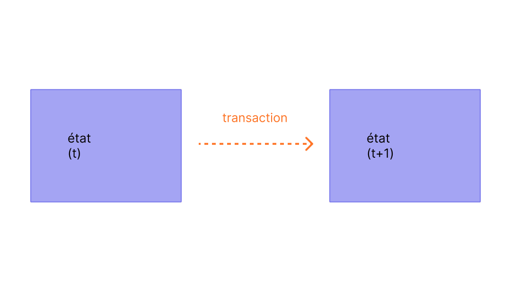
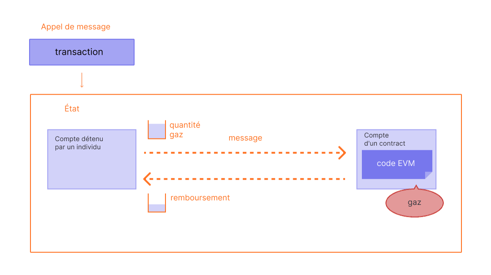

Les transactions sont des instructions signées cryptographiquement depuis des comptes. Un compte va initier une transaction pour mettre à jour l'état du réseau Ethereum. La transaction la plus simple consiste à transférer de l'ETH d'un compte à un autre.

## Prérequis {#prerequisites}

Pour vous aider à mieux comprendre cet article, nous vous recommandons de commencer par lire les pages [Comptes](/developers/docs/accounts/) et notre [Introduction à Ethereum](/developers/docs/intro-to-ethereum/).

## Qu'est-ce qu'une transaction ? {#whats-a-transaction}

Une transaction Ethereum est une action initiée par un compte externe, c'est-à-dire un compte géré par un être humain et non par un contrat. Par exemple, si Marc envoie 1 ETH à Alice, le compte de Marc doit être débité et celui d'Alice doit être crédité. Cette action, qui modifie l'état, se produit dans le cadre d'une transaction.

 _Schéma adapté à partir du document [Ethereum EVM illustrated](https://takenobu-hs.github.io/downloads/ethereum_evm_illustrated.pdf)_

Les transactions, qui modifient l'état de l'EVM, doivent être diffusées sur l'ensemble du réseau. N'importe quel nœud peut diffuser une demande pour qu'une transaction soit exécutée sur l'EVM. Un validateur exécutera ensuite la transaction et diffusera au reste du réseau le changement d'état qui en résultera.

Les transactions requièrent des frais et doivent être incluses dans un bloc validé. Pour simplifier ce chapitre, nous aborderons les frais de gaz et la validation dans d'autres sections.

Une transaction soumise comprend les informations suivantes :

- `depuis` - l'adresse de l'expéditeur qui signera la transaction. On aura donc une adresse émettrice, car les contrats et les adresses (Accounts) ne vous permettront pas d'envoyer des transactions.
- `to` : l'adresse de réception (S'il s'agit d'un compte externe, la transaction va transférer la valeur. S'il s'agit d'un compte de contrat, la transaction exécutera le code du contrat.)
- `signature` : identifiant de l'expéditeur. Cette signature est générée lorsque la clé privée de l'expéditeur signe la transaction, et confirme que l'expéditeur a autorisé cette transaction.
- `nonce` -, il s'agit d'une machine à travers laquelle un nombre maximum d'essais consécutifs est réalisé, il qualifie aussi le numéro de transactions dans la liste des transactions sortantes depuis votre adresse
- `valeur` - montants de l'Ether (ETH) à transférer de l'expéditeur au destinataire (libellé en WEI parallèlement à la valeur de l'Ether, qui atteint les 1e+18wei)
- `input data` – champ facultatif permettant d'inclure des données arbitraires
- `gasLimit` : Quantité maximum d’unités de gaz pouvant être consommée par la transaction. La [machine virtuelle d'Ethereum (EVM)](/developers/docs/evm/opcodes) donne une estimation de la quantité de gaz (unité virtuelle) nécessaire à une opération, ce qui permet de représenter les coûts informatiques d'une opération sur le réseau
- `maxPriorityFeePerGas` : la quantité maximale de gaz à inclure comme pourboire pour le validateur
- `maxFeePerGas` : montant maximum de gaz prêt à être payé pour la transaction (y compris `baseFeePerGas` et `maxPriorityFeePerGas`)

Le gaz est une référence au calcul nécessaire au traitement de la transaction par un validateur. Les utilisateurs doivent payer des frais pour ce calcul. `gasLimit` et `gasPrice` déterminent les frais de transaction maximum payés au validateur. [Plus d'infos sur le gaz](/developers/docs/gas/)

L'objet de transaction ressemblera un peu à ceci :

```js
{
  from: "0xEA674fdDe714fd979de3EdF0F56AA9716B898ec8",
  to: "0xac03bb73b6a9e108530aff4df5077c2b3d481e5a",
  gasLimit: "21000",
  maxFeePerGas: "300"
  maxPriorityFeePerGas: "10"
  nonce: "0",
  value: "10000000000",
}
```

Un objet de transaction doit être signé avec la clé privée de l'expéditeur. Cela prouve que la transaction ne pouvait venir que de l'expéditeur et n'a pas été envoyée de façon frauduleuse.

Un client Ethereum comme Geth gérera ce processus de signature.

Exemple d'appel [JSON-RPC](/developers/docs/apis/json-rpc) :

```json
{
  "id": 2,
  "jsonrpc": "2.0",
  "method": "account_signTransaction",
  "params": [
    {
      "from": "0x1923f626bb8dc025849e00f99c25fe2b2f7fb0db",
      "gas": "0x55555",
      "maxFeePerGas": "0x1234",
      "maxPriorityFeePerGas": "0x1234",
      "input": "0xabcd",
      "nonce": "0x0",
      "to": "0x07a565b7ed7d7a678680a4c162885bedbb695fe0",
      "value": "0x1234"
    }
  ]
}
```

Exemple de réponse :

```json
{
  "jsonrpc": "2.0",
  "id": 2,
  "result": {
    "raw": "0xf88380018203339407a565b7ed7d7a678680a4c162885bedbb695fe080a44401a6e4000000000000000000000000000000000000000000000000000000000000001226a0223a7c9bcf5531c99be5ea7082183816eb20cfe0bbc322e97cc5c7f71ab8b20ea02aadee6b34b45bb15bc42d9c09de4a6754e7000908da72d48cc7704971491663",
    "tx": {
      "nonce": "0x0",
      "maxFeePerGas": "0x1234",
      "maxPriorityFeePerGas": "0x1234",
      "gas": "0x55555",
      "to": "0x07a565b7ed7d7a678680a4c162885bedbb695fe0",
      "value": "0x1234",
      "input": "0xabcd",
      "v": "0x26",
      "r": "0x223a7c9bcf5531c99be5ea7082183816eb20cfe0bbc322e97cc5c7f71ab8b20e",
      "s": "0x2aadee6b34b45bb15bc42d9c09de4a6754e7000908da72d48cc7704971491663",
      "hash": "0xeba2df809e7a612a0a0d444ccfa5c839624bdc00dd29e3340d46df3870f8a30e"
    }
  }
}
```

- dans la Structure de Données Récursives (SDR), la transaction signée prend essentiellement la forme d'une séquence d'instructions codées`` [rlp](/developers/docs/data-structures-and-encoding/rlp)
- `tx` est la transaction signée sous la forme JSON

Grâce au hachage de la signature, il est possible de prouver de façon cryptographique que la transaction provient de l'expéditeur et qu'elle a été soumise au réseau.

### Le champ de données {#the-data-field}

La grande majorité des transactions accèdent à un contrat provenant d'un compte externe. La plupart des contrats sont écrits en Solidity et interprètent leur champ de données conformément à l'[interface binaire-programme (ABI)](/glossary/#abi).

Les quatre premiers octets indiquent la fonction à appeler, en utilisant les hachages de son nom et de ses arguments. Vous pouvez parfois identifier la fonction depuis le sélecteur à l'aide de [cette base de données](https://www.4byte.directory/signatures/).

Le reste des calldata est constitué des arguments, [encodés comme indiqué dans les spécifications ABI](https://docs.soliditylang.org/en/latest/abi-spec.html#formal-specification-of-the-encoding).

Par exemple, prenons [cette transaction](https://etherscan.io/tx/0xd0dcbe007569fcfa1902dae0ab8b4e078efe42e231786312289b1eee5590f6a1). Utilisez **Cliquer pour en voir plus** pour voir les calldata.

Le sélecteur de fonction est `0xa9059cbb`. Il existe plusieurs [fonctions connues avec cette signature](https://www.4byte.directory/signatures/?bytes4_signature=0xa9059cbb). Dans ce cas, [le code source du contrat](https://etherscan.io/address/0xa0b86991c6218b36c1d19d4a2e9eb0ce3606eb48#code) a été chargé sur Etherscan, nous savons donc que la fonction est `transfer(address,uint256)`.

Le reste des données est :

```
0000000000000000000000004f6742badb049791cd9a37ea913f2bac38d01279
000000000000000000000000000000000000000000000000000000003b0559f4
```

Selon les spécifications ABI, les valeurs entières (comme les adresses, qui sont des entiers de 20 octets) apparaissent dans l'ABI sous forme de mots de 32 octets, complétées de zéros au début. Nous savons donc que l'adresse `to` est [`4f6742badb049791cd9a37ea913f2bac38d01279`](https://etherscan.io/address/0x4f6742badb049791cd9a37ea913f2bac38d01279). La valeur `value` est 0x3b0559f4 = 990206452.

## Type de transaction {#types-of-transactions}

Sur Ethereum, il existe plusieurs types de transactions :

- Transactions ordinaires : une transaction d'un portefeuille vers un autre.
- Transactions de déploiement de contrats : une transaction sans adresse « to », où le champ de données est utilisé pour le code du contrat.
- Exécution d'un contrat : une transaction qui interagit avec un contrat intelligent déployé. Dans ce cas précis, l'adresse "to" est celle du contrat intelligent.

### À propos du gaz {#on-gas}

Comme mentionné, les transactions ont un coût en [gaz](/developers/docs/gas/) pour être exécutées. Les transactions simples de transfert requièrent 21 000 unités de gaz.

Ainsi, pour envoyer 1 ETH à Alice avec un `baseFeePerGas` de 190 gwei et `maxPriorityFeePerGas` de 10 gwei, Bob devra payer les frais suivants :

```
(190 + 10) * 21000 = 4 200 000 gwei
-- soit --
0,0042 ETH
```

Le compte de Bob sera débité de **-1,0042 ETH** (1 ETH pour Alice + 0,0042 ETH en frais de gaz)

Celui d'Alice sera crédité de **+1,0 ETH**.

Les frais de base seront brûlés **-0.00399 ETH**

Le validateur conserve le pourboire de **+0,000210 ETH**

Du gaz est également requis pour toute interaction avec un contrat intelligent.

 _Schéma adapté à partir du document [Ethereum EVM illustrated](https://takenobu-hs.github.io/downloads/ethereum_evm_illustrated.pdf)_

Tout gaz non utilisé dans une transaction est remboursé sur le compte de l'utilisateur.

## Cycle de vie des transactions {#transaction-lifecycle}

Voici ce qui se passe une fois qu'une transaction a été soumise :

1. Le hash de la transaction vient d'être généré grâce aux fonctions de hachage (suite d'opérations mathématiques et cryptographiques) : `0x97d99bc7729211111a21b12c933c949d4f31684f1d6954ff477d0477538ff017`
2. La transaction est ensuite diffusée sur le réseau et ajoutée à un pool de transactions composé de toutes les autres transactions réseau en attente.
3. Un validateur doit sélectionner votre transaction et l'inclure dans un bloc pour la vérifier et la considérer comme « réussie ».
4. Au fur et à mesure que le temps passe, le bloc contenant votre transaction sera mis à niveau vers « justifié » puis « finalisé ». Grâce à ces mises à niveau, vous êtes davantage assuré que votre transaction a été réussie et qu'elle ne sera jamais altérée. Une fois qu'un bloc est "finalisé", il ne peut plus être modifié par une attaque au niveau du réseau qui coûterait plusieurs milliards de dollars.

## Démonstration visuelle {#a-visual-demo}

Regardez Austin vous guider à travers les transactions, le gaz et le minage.

<YouTube id="er-0ihqFQB0" />

## Enveloppe de transaction saisie {#typed-transaction-envelope}

Ethereum avait à l'origine un unique format pour les transactions. Chaque transaction contenait une nonce, le prix du gaz, la limite de gaz, l'adresse de destination, la valeur, les données, v, r et s. Il s'agit de champs d'application [d'un RLP](/developers/docs/data-structures-and-encoding/rlp/), qui pourraient ressembler à ceci :

`RLP([nonce, gasPrice, gasLimit, to, value, data, v, r, s])`

Ethereum a évolué pour prendre en charge plusieurs types de transactions afin de permettre l'implémentation de nouvelles fonctionnalités telles que les listes d'accès [EIP-1559](https://eips.ethereum.org/EIPS/eip-1559) sans affecter les formats de transactions existants.

[EIP-2718](https://eips.ethereum.org/EIPS/eip-2718) spécifie la façon dont cela est géré. Les transactions sont interprétées comme :

`TransactionType || TransactionPayload`

Où les champs sont définis comme :

- `TransactionType` : un nombre compris entre 0 et 0x7f, pour un total de 128 types de transactions possibles.
- `TransactionPayload` : une table arbitraire d'octets définie par le type de transaction.

## Complément d'information {#further-reading}

- [EIP-2718 : Enveloppe de Transaction Saisie](https://eips.ethereum.org/EIPS/eip-2718)

_Une ressource communautaire vous a aidé ? Modifiez cette page et ajoutez-la !_

## Sujets connexes {#related-topics}

- [Comptes](/developers/docs/accounts/)
- [Machine Virtuelle d'Ethereum (EVM)](/developers/docs/evm/)
- [Gaz](/developers/docs/gas/)
