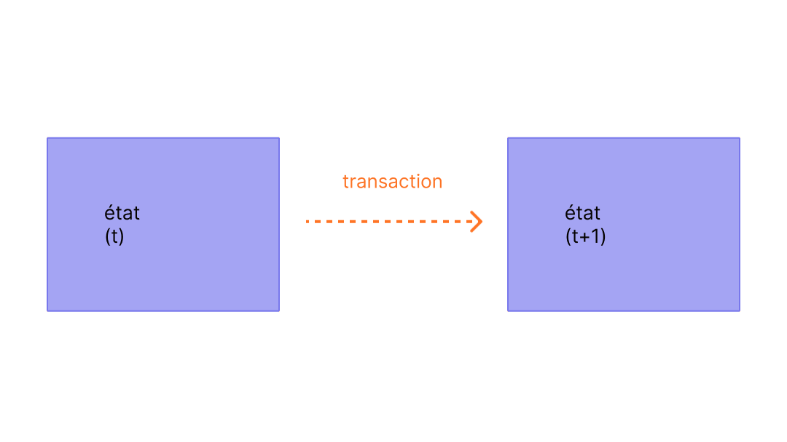

Les transactions sont des instructions signées cryptographiquement provenant de comptes. Un compte initiera une transaction pour mettre à jour l'état du réseau [Ethereum](/). La transaction la plus simple est le transfert d'ETH d'un compte à un autre.

## Prérequis {#prerequisites}

Pour vous aider à mieux comprendre cette page, nous vous recommandons de lire d'abord [Comptes](/developers/docs/accounts/) et notre [introduction à Ethereum](/developers/docs/intro-to-ethereum/).

## Qu'est-ce qu'une transaction ? {#whats-a-transaction}

Une transaction Ethereum fait référence à une action initiée par un compte détenu par un tiers (externally-owned account), c'est-à-dire un compte géré par un humain, et non par un contrat. Par exemple, si Bob envoie 1 ETH à Alice, le compte de Bob doit être débité et celui d'Alice doit être crédité. Cette action modifiant l'état a lieu au sein d'une transaction.


_Schéma adapté de [Ethereum EVM illustrated](https://takenobu-hs.github.io/downloads/ethereum_evm_illustrated.pdf)_

Les transactions, qui modifient l'état de l'EVM, doivent être diffusées à l'ensemble du réseau. N'importe quel nœud peut diffuser une requête pour qu'une transaction soit exécutée sur l'EVM ; après cela, un validateur exécutera la transaction et propagera le changement d'état résultant au reste du réseau.

Les transactions nécessitent des frais et doivent être incluses dans un bloc validé. Pour simplifier cet aperçu, nous aborderons les frais de gaz et la validation ailleurs.

Une transaction soumise comprend les informations suivantes :

- `from` – l'adresse de l'expéditeur, qui signera la transaction. Il s'agira d'un compte détenu par un tiers, car les comptes de contrat ne peuvent pas envoyer de transactions
- `to` – l'adresse de réception (s'il s'agit d'un compte détenu par un tiers, la transaction transférera de la valeur. S'il s'agit d'un compte de contrat, la transaction exécutera le code du contrat)
- `signature` – l'identifiant de l'expéditeur. Il est généré lorsque la clé privée de l'expéditeur signe la transaction et confirme que l'expéditeur a autorisé cette transaction
- `nonce` - un compteur s'incrémentant séquentiellement qui indique le numéro de la transaction depuis le compte
- `value` – le montant d'ETH à transférer de l'expéditeur au destinataire (libellé en Wei, où 1 ETH équivaut à 1e+18 Wei)
- `input data` – champ optionnel pour inclure des données arbitraires
- `gasLimit` – la quantité maximale d'unités de gaz pouvant être consommées par la transaction. L'[EVM](/developers/docs/evm/opcodes) spécifie les unités de gaz requises par chaque étape de calcul
- `maxPriorityFeePerGas` - le prix maximum du gaz consommé à inclure comme frais de priorité pour le validateur
- `maxFeePerGas` - les frais maximums par unité de gaz que l'on est prêt à payer pour la transaction (incluant `baseFeePerGas` et `maxPriorityFeePerGas`)

Le gaz est une référence au calcul requis pour traiter la transaction par un validateur. Les utilisateurs doivent payer des frais pour ce calcul. La `gasLimit` et les `maxPriorityFeePerGas` déterminent les frais de transaction maximums payés au validateur. [En savoir plus sur le gaz](/developers/docs/gas/).

L'objet de la transaction ressemblera un peu à ceci :

```js
{
  from: "0xEA674fdDe714fd979de3EdF0F56AA9716B898ec8",
  to: "0xac03bb73b6a9e108530aff4df5077c2b3d481e5a",
  gasLimit: "21000",
  maxFeePerGas: "300",
  maxPriorityFeePerGas: "10",
  nonce: "0",
  value: "10000000000"
}
```

Mais un objet de transaction doit être signé à l'aide de la clé privée de l'expéditeur. Cela prouve que la transaction ne pouvait provenir que de l'expéditeur et n'a pas été envoyée frauduleusement.

Un client Ethereum comme Geth gérera ce processus de signature.

Exemple d'appel [JSON-RPC](/developers/docs/apis/json-rpc) :

```json
{
  "id": 2,
  "jsonrpc": "2.0",
  "method": "account_signTransaction",
  "params": [
    {
      "from": "0x1923f626bb8dc025849e00f99c25fe2b2f7fb0db",
      "gas": "0x55555",
      "maxFeePerGas": "0x1234",
      "maxPriorityFeePerGas": "0x1234",
      "input": "0xabcd",
      "nonce": "0x0",
      "to": "0x07a565b7ed7d7a678680a4c162885bedbb695fe0",
      "value": "0x1234"
    }
  ]
}
```

Exemple de réponse :

```json
{
  "jsonrpc": "2.0",
  "id": 2,
  "result": {
    "raw": "0xf88380018203339407a565b7ed7d7a678680a4c162885bedbb695fe080a44401a6e4000000000000000000000000000000000000000000000000000000000000001226a0223a7c9bcf5531c99be5ea7082183816eb20cfe0bbc322e97cc5c7f71ab8b20ea02aadee6b34b45bb15bc42d9c09de4a6754e7000908da72d48cc7704971491663",
    "tx": {
      "nonce": "0x0",
      "maxFeePerGas": "0x1234",
      "maxPriorityFeePerGas": "0x1234",
      "gas": "0x55555",
      "to": "0x07a565b7ed7d7a678680a4c162885bedbb695fe0",
      "value": "0x1234",
      "input": "0xabcd",
      "v": "0x26",
      "r": "0x223a7c9bcf5531c99be5ea7082183816eb20cfe0bbc322e97cc5c7f71ab8b20e",
      "s": "0x2aadee6b34b45bb15bc42d9c09de4a6754e7000908da72d48cc7704971491663",
      "hash": "0xeba2df809e7a612a0a0d444ccfa5c839624bdc00dd29e3340d46df3870f8a30e"
    }
  }
}
```

- le `raw` est la transaction signée sous forme encodée [Recursive Length Prefix (RLP)](/developers/docs/data-structures-and-encoding/rlp)
- la `tx` est la transaction signée au format JSON

Avec le hash de la signature, il peut être prouvé cryptographiquement que la transaction provient de l'expéditeur et a été soumise au réseau.

### Le champ de données {#the-data-field}

La grande majorité des transactions accèdent à un contrat depuis un compte détenu par un tiers.
La plupart des contrats sont écrits en Solidity et interprètent leur champ de données conformément à l'[interface binaire d'application (ABI)](/glossary/#abi).

Les quatre premiers octets spécifient quelle fonction appeler, en utilisant le hash du nom de la fonction et de ses arguments.
Vous pouvez parfois identifier la fonction à partir du sélecteur en utilisant [cette base de données](https://www.4byte.directory/signatures/).

Le reste des données d'appel correspond aux arguments, [encodés comme spécifié dans les spécifications de l'ABI](https://docs.soliditylang.org/en/latest/abi-spec.html#formal-specification-of-the-encoding).

Par exemple, regardons [cette transaction](https://etherscan.io/tx/0xd0dcbe007569fcfa1902dae0ab8b4e078efe42e231786312289b1eee5590f6a1).
Utilisez **Click to see More** pour voir les données d'appel.

Le sélecteur de fonction est `0xa9059cbb`. Il existe plusieurs [fonctions connues avec cette signature](https://www.4byte.directory/signatures/?bytes4_signature=0xa9059cbb).
Dans ce cas, [le code source du contrat](https://etherscan.io/address/0xa0b86991c6218b36c1d19d4a2e9eb0ce3606eb48#code) a été téléchargé sur Etherscan, nous savons donc que la fonction est `transfer(address,uint256)`.

Le reste des données est :

```
0000000000000000000000004f6742badb049791cd9a37ea913f2bac38d01279
000000000000000000000000000000000000000000000000000000003b0559f4
```

Selon les spécifications de l'ABI, les valeurs entières (telles que les adresses, qui sont des entiers de 20 octets) apparaissent dans l'ABI sous forme de mots de 32 octets, complétés par des zéros au début.
Nous savons donc que l'adresse `to` est [`4f6742badb049791cd9a37ea913f2bac38d01279`](https://etherscan.io/address/0x4f6742badb049791cd9a37ea913f2bac38d01279).
Le `value` est 0x3b0559f4 = 990206452.

### Descripteurs de transaction {#transaction-descriptors}

Étant donné que le champ de données contient des octets hexadécimaux opaques, il peut être extrêmement difficile de vérifier quelle action une transaction va réellement effectuer. Cette vulnérabilité de « signature à l'aveugle » (blind signing) est traitée par la **[signature en clair](https://clearsigning.org/)** (Clear Signing) grâce à l'utilisation de [descripteurs de transaction](https://eips.ethereum.org/EIPS/eip-7730) (définis par l'ERC-7730).  

La spécification ERC-7730 utilise des descripteurs de transaction (souvent structurés sous forme de fichiers JSON) pour enrichir les données trouvées dans les ABI et les messages structurés, comme les données d'appel de transaction EVM, les messages EIP-712 et les opérations utilisateur EIP-4337. Les développeurs utilisent ces descripteurs pour mapper des variables de transaction spécifiques directement dans des modèles de formatage, garantissant que les données sous-jacentes restent lisibles par machine pour les applications.

Sur le frontend, les portefeuilles utilisent ce contexte de formatage pour traduire le bytecode opaque en informations claires et lisibles par l'homme. En résolvant automatiquement des valeurs telles que les adresses de jetons en symboles boursiers reconnus, ou les montants en décimales, les utilisateurs se voient présenter un résumé en langage clair de l'intention exacte de la transaction (par exemple, 'Échanger 1000 USDC contre au moins 0,25 WETH') avant de signer.

## Types de transactions {#types-of-transactions}

Sur Ethereum, il existe quelques types de transactions différents :

- Transactions régulières : une transaction d'un compte à un autre.
- Transactions de déploiement de contrat : une transaction sans adresse 'to' (destinataire), où le champ de données est utilisé pour le code du contrat.
- Exécution d'un contrat : une transaction qui interagit avec un contrat intelligent déployé. Dans ce cas, l'adresse 'to' est l'adresse du contrat intelligent.

### À propos du gaz {#on-gas}

Comme mentionné, l'exécution des transactions coûte du [gaz](/developers/docs/gas/). Les transactions de transfert simples nécessitent 21000 unités de gaz.

Donc, pour que Bob envoie 1 ETH à Alice avec des `baseFeePerGas` de 190 gwei et des `maxPriorityFeePerGas` de 10 gwei, Bob devra payer les frais suivants :

```
(190 + 10) * 21000 = 4,200,000 gwei
--ou--
0.0042 ETH
```

Le compte de Bob sera débité de **-1,0042 ETH** (1 ETH pour Alice + 0,0042 ETH de frais de gaz)

Le compte d'Alice sera crédité de **+1,0 ETH**

Les frais de base seront brûlés **-0,00399 ETH**

Le validateur conserve les frais de priorité **+0,000210 ETH**


_Schéma adapté de [Ethereum EVM illustrated](https://takenobu-hs.github.io/downloads/ethereum_evm_illustrated.pdf)_

Tout gaz non utilisé dans une transaction est remboursé sur le compte de l'utilisateur.

### Interactions avec les contrats intelligents {#smart-contract-interactions}

Du gaz est requis pour toute transaction impliquant un contrat intelligent.

Les contrats intelligents peuvent également contenir des fonctions appelées fonctions [`view`](https://docs.soliditylang.org/en/latest/contracts.html#view-functions) ou [`pure`](https://docs.soliditylang.org/en/latest/contracts.html#pure-functions), qui ne modifient pas l'état du contrat. En tant que tel, l'appel de ces fonctions depuis un compte détenu par un tiers (EOA) ne nécessitera aucun gaz. L'appel RPC sous-jacent pour ce scénario est [`eth_call`](/developers/docs/apis/json-rpc#eth_call).

Contrairement à un accès via `eth_call`, ces fonctions `view` ou `pure` sont aussi couramment appelées en interne (c'est-à-dire depuis le contrat lui-même ou depuis un autre contrat), ce qui coûte du gaz.

## Cycle de vie d'une transaction {#transaction-lifecycle}

Une fois la transaction soumise, les événements suivants se produisent :

1. Un hachage de transaction est généré cryptographiquement :
   `0x97d99bc7729211111a21b12c933c949d4f31684f1d6954ff477d0477538ff017`
2. La transaction est ensuite diffusée sur le réseau et ajoutée à un pool de transactions composé de toutes les autres transactions réseau en attente.
3. Un validateur doit choisir votre transaction et l'inclure dans un bloc afin de vérifier la transaction et de la considérer comme « réussie ».
4. Au fil du temps, le bloc contenant votre transaction passera au statut « justifié » puis « finalisé ». Ces mises à jour garantissent avec beaucoup
   plus de certitude que votre transaction a réussi et ne sera jamais modifiée. Une fois qu'un bloc est « finalisé », il ne pourrait être modifié
   que par une attaque au niveau du réseau qui coûterait plusieurs milliards de dollars.

## Une démonstration visuelle {#a-visual-demo}

Regardez Austin vous expliquer les transactions, le gaz et le minage.

<VideoWatch slug="transactions-eth-build" />

## Enveloppe de transaction typée {#typed-transaction-envelope}

À l'origine, Ethereum n'avait qu'un seul format pour les transactions. Chaque transaction contenait un nonce, un prix du gaz, une limite de gaz, une adresse de destination (to), une valeur, des données, v, r et s. Ces champs sont [encodés en RLP](/developers/docs/data-structures-and-encoding/rlp/), pour ressembler à ceci :

`RLP([nonce, gasPrice, gasLimit, to, value, data, v, r, s])`

Ethereum a évolué pour prendre en charge plusieurs types de transactions afin de permettre l'implémentation de nouvelles fonctionnalités telles que les listes d'accès et l'[EIP-1559](https://eips.ethereum.org/EIPS/eip-1559) sans affecter les formats de transaction hérités.

L'[EIP-2718](https://eips.ethereum.org/EIPS/eip-2718) est ce qui permet ce comportement. Les transactions sont interprétées comme suit :

`TransactionType || TransactionPayload`

Où les champs sont définis comme suit :

- `TransactionType` - un nombre entre 0 et 0x7f, pour un total de 128 types de transactions possibles.
- `TransactionPayload` - un tableau d'octets arbitraire défini par le type de transaction.

En fonction de la valeur `TransactionType`, une transaction peut être classée comme suit :

1. **Transactions de type 0 (héritées) :** Le format de transaction original utilisé depuis le lancement d'Ethereum. Elles n'incluent pas les fonctionnalités de l'[EIP-1559](https://eips.ethereum.org/EIPS/eip-1559) telles que les calculs dynamiques des frais de gaz ou les listes d'accès pour les contrats intelligents. Les transactions héritées n'ont pas de préfixe spécifique indiquant leur type dans leur forme sérialisée, commençant par l'octet `0xf8` lors de l'utilisation de l'encodage [Recursive Length Prefix (RLP)](/developers/docs/data-structures-and-encoding/rlp). La valeur TransactionType pour ces transactions est `0x0`.

2. **Transactions de type 1 :** Introduites dans l'[EIP-2930](https://eips.ethereum.org/EIPS/eip-2930) dans le cadre de la mise à jour [Berlin](/ethereum-forks/#berlin) d'Ethereum, ces transactions incluent un paramètre `accessList`. Cette liste spécifie les adresses et les clés de stockage auxquelles la transaction prévoit d'accéder, ce qui permet de réduire potentiellement les coûts de [gaz](/developers/docs/gas/) pour les transactions complexes impliquant des contrats intelligents. Les modifications du marché des frais de l'EIP-1559 ne sont pas incluses dans les transactions de type 1. Les transactions de type 1 incluent également un paramètre `yParity`, qui peut être soit `0x0` soit `0x1`, indiquant la parité de la valeur y de la signature secp256k1. Elles sont identifiées en commençant par l'octet `0x01`, et leur valeur TransactionType est `0x1`.

3. **Transactions de type 2**, communément appelées transactions EIP-1559, sont des transactions introduites dans l'[EIP-1559](https://eips.ethereum.org/EIPS/eip-1559), lors de la mise à jour [London](/ethereum-forks/#london) d'Ethereum. Elles sont devenues le type de transaction standard sur le réseau Ethereum. Ces transactions introduisent un nouveau mécanisme de marché des frais qui améliore la prévisibilité en séparant les frais de transaction en frais de base et en frais de priorité. Elles commencent par l'octet `0x02` et incluent des champs tels que `maxPriorityFeePerGas` et `maxFeePerGas`. Les transactions de type 2 sont désormais la valeur par défaut en raison de leur flexibilité et de leur efficacité, particulièrement appréciées pendant les périodes de forte congestion du réseau pour leur capacité à aider les utilisateurs à gérer les frais de transaction de manière plus prévisible. La valeur TransactionType pour ces transactions est `0x2`.

4. **Transactions de type 3 (Blob)** ont été introduites dans l'[EIP-4844](https://eips.ethereum.org/EIPS/eip-4844) dans le cadre de la [mise à jour Dencun](/ethereum-forks/#dencun) d'Ethereum. Ces transactions sont conçues pour gérer les données « blob » (Binary Large Objects) plus efficacement, bénéficiant particulièrement aux rollup de couche 2 (l2) en fournissant un moyen de publier des données sur le réseau Ethereum à un coût inférieur. Les transactions blob incluent des champs supplémentaires tels que `blobVersionedHashes`, `maxFeePerBlobGas` et `blobGasPrice`. Elles commencent par l'octet `0x03`, et leur valeur TransactionType est `0x3`. Les transactions blob représentent une amélioration significative de la disponibilité des données et des capacités de mise à l'échelle d'Ethereum.

5. **Transactions de type 4** ont été introduites dans l'[EIP-7702](https://eips.ethereum.org/EIPS/eip-7702) dans le cadre de la mise à jour [Pectra](/roadmap/pectra/) d'Ethereum. Ces transactions sont conçues pour être compatibles de manière ascendante avec l'abstraction de compte. Elles permettent aux comptes détenus par des tiers (EOA) de se comporter temporairement comme des comptes de contrat intelligent sans compromettre leur fonctionnalité d'origine. Elles incluent un paramètre `authorization_list`, qui spécifie le contrat intelligent auquel l'EOA délègue son autorité. Après la transaction, le champ de code de l'EOA contiendra l'adresse du contrat intelligent délégué.

## Complément d'information {#further-reading}

- [EIP-2718 : Enveloppe de transaction typée](https://eips.ethereum.org/EIPS/eip-2718)

_Vous connaissez une ressource communautaire qui vous a aidé ? Modifiez cette page et ajoutez-la !_

## Sujets connexes {#related-topics}

- [Comptes](/developers/docs/accounts/)
- [Machine virtuelle Ethereum (EVM)](/developers/docs/evm/)
- [Gaz](/developers/docs/gas/)