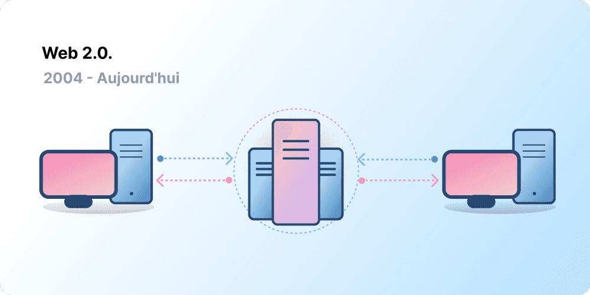
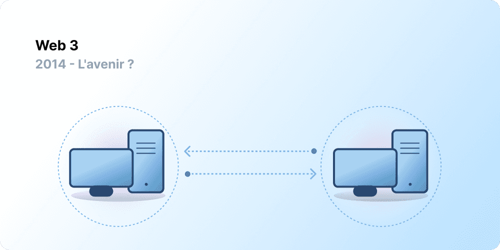

La centralisation a permis d'intégrer des milliards de personnes au World Wide Web et a créé l'infrastructure stable et robuste sur laquelle il repose. Dans le même temps, une poignée d'entités centralisées ont la mainmise sur de vastes pans du World Wide Web, décidant unilatéralement de ce qui devrait ou ne devrait pas être autorisé.

Le Web3 est la réponse à ce dilemme. Au lieu d'un Web monopolisé par de grandes entreprises technologiques, le Web3 adopte la décentralisation et est construit, exploité et possédé par ses utilisateurs. Le Web3 remet le pouvoir entre les mains des individus plutôt que des entreprises.
Avant de parler du Web3, explorons comment nous en sommes arrivés là.

<Divider />

## Les débuts du Web {#early-internet}

La plupart des gens considèrent le Web comme un pilier continu de la vie moderne : il a été inventé et a simplement existé depuis. Cependant, le Web que la plupart d'entre nous connaissent aujourd'hui est très différent de ce qui avait été imaginé à l'origine. Pour mieux comprendre cela, il est utile de diviser la courte histoire du Web en grandes périodes : le Web 1.0 et le Web 2.0.

### Web 1.0 : Lecture seule (1990-2004) {#web1}

En 1989, au CERN, à Genève, Tim Berners-Lee était occupé à développer les protocoles qui allaient devenir le World Wide Web. Son idée ? Créer des protocoles ouverts et décentralisés permettant le partage d'informations depuis n'importe où sur Terre.

La première version de la création de Berners-Lee, aujourd'hui connue sous le nom de « Web 1.0 », a vu le jour approximativement entre 1990 et 2004. Le Web 1.0 était principalement constitué de sites web statiques appartenant à des entreprises, et il n'y avait pratiquement aucune interaction entre les utilisateurs - les individus produisaient rarement du contenu - ce qui lui a valu le nom de web en lecture seule.

### Web 2.0 : Lecture-Écriture (2004-aujourd'hui) {#web2}

La période du Web 2.0 a commencé en 2004 avec l'émergence des plateformes de médias sociaux. Au lieu d'être en lecture seule, le web a évolué vers la lecture-écriture. Au lieu que les entreprises fournissent du contenu aux utilisateurs, elles ont également commencé à fournir des plateformes pour partager du contenu généré par les utilisateurs et s'engager dans des interactions entre utilisateurs. À mesure que de plus en plus de personnes se connectaient, une poignée de grandes entreprises a commencé à contrôler une part disproportionnée du trafic et de la valeur générés sur le web. Le Web 2.0 a également donné naissance au modèle de revenus basé sur la publicité. Bien que les utilisateurs puissent créer du contenu, ils n'en étaient pas propriétaires et ne profitaient pas de sa monétisation.

<Divider />

## Web 3.0 : Lecture-Écriture-Propriété {#web3}

Le concept de « Web 3.0 » a été inventé par le cofondateur d'[Ethereum](/), Gavin Wood, peu après le lancement d'Ethereum en 2014. Gavin a mis des mots sur une solution à un problème ressenti par de nombreux premiers adeptes de la crypto : le Web exigeait trop de confiance. C'est-à-dire que la majeure partie du Web que les gens connaissent et utilisent aujourd'hui repose sur la confiance accordée à une poignée d'entreprises privées pour agir dans le meilleur intérêt du public.

### Qu'est-ce que le Web3 ? {#what-is-web3}

Le Web3 est devenu un terme fourre-tout pour désigner la vision d'un nouvel internet, meilleur. À la base, le Web3 utilise les chaînes de blocs, les cryptomonnaies et les NFT pour redonner le pouvoir aux utilisateurs sous forme de propriété. [Une publication de 2020 sur Twitter](https://twitter.com/himgajria/status/1266415636789334016) l'a très bien résumé : le Web1 était en lecture seule, le Web2 est en lecture-écriture, le Web3 sera en lecture-écriture-propriété.

#### Idées fondamentales du Web3 {#core-ideas}

Bien qu'il soit difficile de fournir une définition rigide de ce qu'est le Web3, quelques principes fondamentaux guident sa création.

- **Le Web3 est décentralisé :** au lieu que de vastes pans d'internet soient contrôlés et possédés par des entités centralisées, la propriété est répartie entre ses constructeurs et ses utilisateurs.
- **Le Web3 est sans permission :** tout le monde a un accès égal pour participer au Web3, et personne n'est exclu.
- **Le Web3 dispose de paiements natifs :** il utilise la cryptomonnaie pour dépenser et envoyer de l'argent en ligne au lieu de s'appuyer sur l'infrastructure obsolète des banques et des processeurs de paiement.
- **Le Web3 est sans tiers de confiance :** il fonctionne à l'aide d'incitations et de mécanismes économiques au lieu de s'appuyer sur des tiers de confiance.

### Pourquoi le Web3 est-il important ? {#why-is-web3-important}

Bien que les fonctionnalités phares du Web3 ne soient pas isolées et ne rentrent pas dans des catégories bien définies, par souci de simplicité, nous avons essayé de les séparer pour les rendre plus faciles à comprendre.

#### Propriété {#ownership}

Le Web3 vous donne la propriété de vos actifs numériques d'une manière sans précédent. Par exemple, disons que vous jouez à un jeu Web2. Si vous achetez un objet dans le jeu, il est directement lié à votre compte. Si les créateurs du jeu suppriment votre compte, vous perdrez ces objets. Ou, si vous arrêtez de jouer au jeu, vous perdez la valeur que vous avez investie dans vos objets en jeu.

Le Web3 permet une propriété directe grâce aux [jetons non fongibles (NFT)](/glossary/#nft). Personne, pas même les créateurs du jeu, n'a le pouvoir de vous retirer votre propriété. Et, si vous arrêtez de jouer, vous pouvez vendre ou échanger vos objets en jeu sur des marchés ouverts et récupérer leur valeur. Explorez les [jeux onchain](/gaming/) pour voir cela en action.

<Alert variant="update">
<AlertEmoji text=":eyes:"/>
<AlertContent className="flex-row items-center justify-between">
  
En savoir plus sur les NFT

  <ButtonLink href="/nft/">
    Plus d'infos sur les NFT
  </ButtonLink>
</AlertContent>
</Alert>

#### Résistance à la censure {#censorship-resistance}

La dynamique de pouvoir entre les plateformes et les créateurs de contenu est massivement déséquilibrée.

OnlyFans est un site de contenu pour adultes généré par les utilisateurs qui compte plus d'un million de créateurs de contenu, dont beaucoup utilisent la plateforme comme principale source de revenus. En août 2021, OnlyFans a annoncé son intention d'interdire le contenu sexuellement explicite. L'annonce a suscité l'indignation parmi les créateurs de la plateforme, qui ont eu le sentiment de se faire voler un revenu sur une plateforme qu'ils avaient contribué à créer. Après les vives réactions, la décision a été rapidement annulée. Bien que les créateurs aient gagné cette bataille, cela met en évidence un problème pour les créateurs du Web 2.0 : vous perdez la réputation et les abonnés que vous avez accumulés si vous quittez une plateforme.

Sur le Web3, vos données résident sur la chaîne de blocs. Lorsque vous décidez de quitter une plateforme, vous pouvez emporter votre réputation avec vous, en la connectant à une autre interface qui correspond plus clairement à vos valeurs.

Le Web 2.0 exige des créateurs de contenu qu'ils fassent confiance aux plateformes pour ne pas changer les règles, mais la résistance à la censure est une fonctionnalité native d'une plateforme Web3.

#### Organisations autonomes décentralisées (DAO) {#daos}

En plus de posséder vos données dans le Web3, vous pouvez posséder la plateforme en tant que collectif, en utilisant des jetons qui agissent comme des actions dans une entreprise. Les DAO vous permettent de coordonner la propriété décentralisée d'une plateforme et de prendre des décisions concernant son avenir.

Les DAO sont définies techniquement comme des [contrats intelligents](/glossary/#smart-contract) convenus qui automatisent la prise de décision décentralisée sur un ensemble de ressources (jetons). Les utilisateurs possédant des jetons votent sur la façon dont les ressources sont dépensées, et le code exécute automatiquement le résultat du vote.

Cependant, les gens définissent de nombreuses communautés Web3 comme des DAO. Ces communautés ont toutes des niveaux différents de décentralisation et d'automatisation par le code. Actuellement, nous explorons ce que sont les DAO et comment elles pourraient évoluer à l'avenir.

<Alert variant="update">
<AlertEmoji text=":eyes:"/>
<AlertContent className="flex-row items-center justify-between">
  
En savoir plus sur les DAO

  <ButtonLink href="/dao/">
    Plus d'infos sur les DAO
  </ButtonLink>
</AlertContent>
</Alert>

### Identité {#identity}

Traditionnellement, vous créeriez un compte pour chaque plateforme que vous utilisez. Par exemple, vous pourriez avoir un compte Twitter, un compte YouTube et un compte Reddit. Vous voulez changer votre nom d'affichage ou votre photo de profil ? Vous devez le faire sur chaque compte. Vous pouvez utiliser les connexions sociales dans certains cas, mais cela présente un problème familier : la censure. En un seul clic, ces plateformes peuvent vous bloquer l'accès à toute votre vie en ligne. Pire encore, de nombreuses plateformes exigent que vous leur fassiez confiance avec des informations personnellement identifiables pour créer un compte.

Le Web3 résout ces problèmes en vous permettant de contrôler votre identité numérique avec une adresse Ethereum et un profil [Ethereum Name Service (ENS)](/glossary/#ens). L'utilisation d'une adresse Ethereum fournit une connexion unique sur toutes les plateformes qui est sécurisée, résistante à la censure et anonyme.

### Paiements natifs {#native-payments}

L'infrastructure de paiement du Web2 repose sur les banques et les processeurs de paiement, excluant les personnes sans compte bancaire ou celles qui se trouvent vivre à l'intérieur des frontières du mauvais pays.
Le Web3 utilise des jetons comme l'[ETH](/glossary/#ether) pour envoyer de l'argent directement dans le navigateur et ne nécessite aucun tiers de confiance.

<ButtonLink href="/what-is-ether/">
  Plus d'infos sur l'ETH
</ButtonLink>

## Limites du Web3 {#web3-limitations}

Malgré les nombreux avantages du Web3 dans sa forme actuelle, il existe encore de nombreuses limites que l'écosystème doit surmonter pour qu'il puisse prospérer.

### Accessibilité {#accessibility}

Des fonctionnalités importantes du Web3, comme la connexion avec Ethereum, sont déjà disponibles pour tous et ce, gratuitement. Mais le coût relatif des transactions reste prohibitif pour beaucoup. Le Web3 est moins susceptible d'être utilisé dans les pays en développement moins riches en raison des frais de transaction élevés. Sur Ethereum, ces défis sont en cours de résolution grâce à [la feuille de route](/roadmap/) et aux [solutions de mise à l'échelle de couche 2 (l2)](/glossary/#layer-2). La technologie est prête, mais nous avons besoin de niveaux d'adoption plus élevés sur la couche 2 (l2) pour rendre le Web3 accessible à tous.

### Expérience utilisateur {#user-experience}

La barrière technique à l'entrée pour utiliser le Web3 est actuellement trop élevée. Les utilisateurs doivent appréhender les problèmes de sécurité, comprendre une documentation technique complexe et naviguer dans des interfaces utilisateur peu intuitives. Les [fournisseurs de portefeuilles](/wallets/find-wallet/), en particulier, s'efforcent de résoudre ce problème, mais davantage de progrès sont nécessaires avant que le Web3 ne soit adopté en masse.

### Éducation {#education}

Le Web3 introduit de nouveaux paradigmes qui nécessitent l'apprentissage de modèles mentaux différents de ceux utilisés dans le Web2. Une campagne d'éducation similaire a eu lieu lorsque le Web 1.0 gagnait en popularité à la fin des années 1990 ; les partisans du World Wide Web ont utilisé une multitude de techniques éducatives pour éduquer le public, allant de simples métaphores (l'autoroute de l'information, les navigateurs, surfer sur le web) aux [émissions de télévision](https://www.youtube.com/watch?v=SzQLI7BxfYI). Le Web3 n'est pas difficile, mais il est différent. Les initiatives éducatives informant les utilisateurs du Web2 de ces paradigmes du Web3 sont vitales pour son succès.

Ethereum.org contribue à l'éducation au Web3 par le biais de notre [Programme de traduction](/contributing/translation-program/), visant à traduire le contenu important d'Ethereum dans autant de langues que possible.

### Infrastructure centralisée {#centralized-infrastructure}

L'écosystème Web3 est jeune et évolue rapidement. Par conséquent, il dépend actuellement principalement d'infrastructures centralisées (GitHub, Twitter, Discord, etc.). De nombreuses entreprises du Web3 se précipitent pour combler ces lacunes, mais la construction d'une infrastructure fiable et de haute qualité prend du temps.

## Un avenir décentralisé {#decentralized-future}

Le Web3 est un écosystème jeune et en évolution. Gavin Wood a inventé le terme en 2014, mais beaucoup de ces idées ne sont devenues réalité que récemment. Rien qu'au cours de la dernière année, il y a eu une augmentation considérable de l'intérêt pour la cryptomonnaie, des améliorations des solutions de mise à l'échelle de couche 2 (l2), des expériences massives avec de nouvelles formes de gouvernance et des révolutions dans l'identité numérique.

Nous n'en sommes qu'au début de la création d'un Web meilleur avec le Web3, mais à mesure que nous continuons d'améliorer l'infrastructure qui le soutiendra, l'avenir du Web s'annonce prometteur.

## Comment puis-je m'impliquer ? {#get-involved}

- [Obtenir un portefeuille](/wallets/)
- [Trouver une communauté](/community/)
- [Explorer les applications Web3](/apps/)
- [Rejoindre une DAO](/dao/)
- [Construire sur le Web3](/developers/)

## Lectures complémentaires {#further-reading}

Le Web3 n'est pas défini de manière rigide. Divers participants de la communauté ont des perspectives différentes à son sujet. En voici quelques-unes :

- [Qu'est-ce que le Web3 ? L'Internet décentralisé du futur expliqué](https://www.freecodecamp.org/news/what-is-web3) – _Nader Dabit_
- [Donner du sens au Web 3](https://medium.com/l4-media/making-sense-of-web-3-c1a9e74dcae) – _Josh Stark_
- [Pourquoi le Web3 est important](https://a16zcrypto.com/posts/article/why-web3-matters/) — _Chris Dixon_
- [Pourquoi la décentralisation est importante](https://onezero.medium.com/why-decentralization-matters-5e3f79f7638e) - _Chris Dixon_
- [Le paysage du Web3](https://a16z.com/wp-content/uploads/2021/10/The-web3-Readlng-List.pdf) – _a16z_
- [Le débat sur le Web3](https://www.notboring.co/p/the-web3-debate) – _Packy McCormick_

<QuizWidget quizKey="web3" />