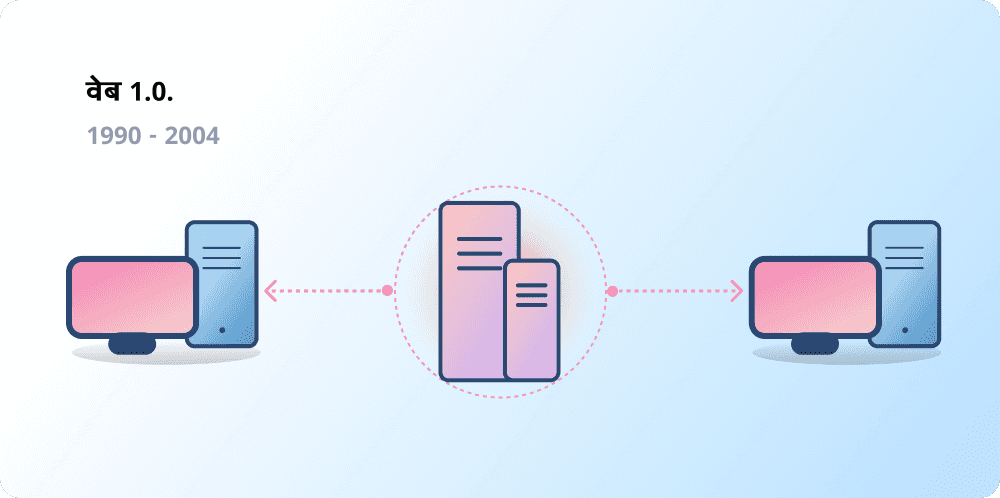
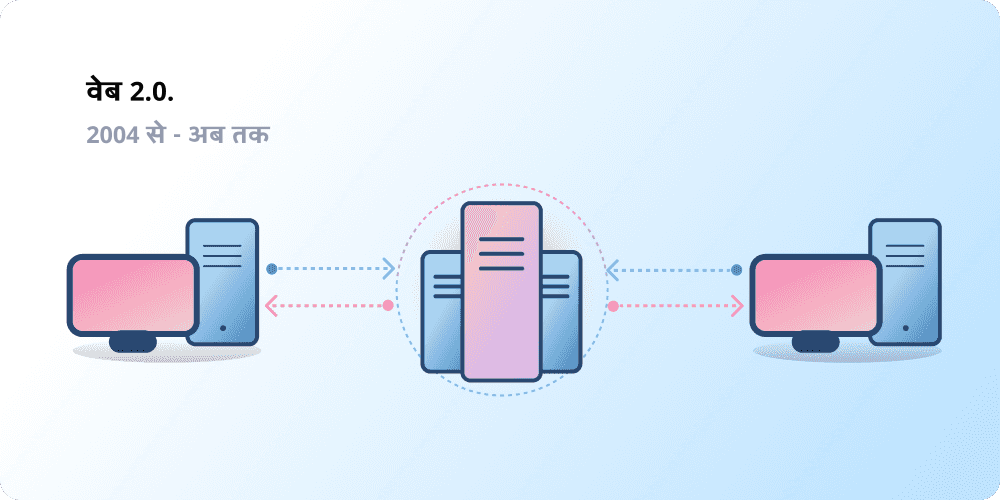
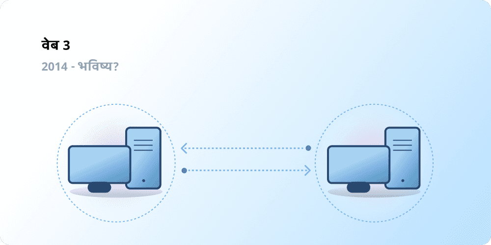

केंद्रीकरण ने अरबों लोगों को वर्ल्ड वाइड वेब से जोड़ने में मदद की है और एक स्थिर, मजबूत बुनियादी ढांचा तैयार किया है जिस पर यह टिका है। साथ ही, मुट्ठी भर केंद्रीकृत संस्थाओं का वर्ल्ड वाइड वेब के बड़े हिस्से पर मजबूत नियंत्रण है, जो एकतरफा रूप से यह तय करते हैं कि क्या अनुमति दी जानी चाहिए और क्या नहीं।

Web3 इस दुविधा का उत्तर है। बड़ी प्रौद्योगिकी कंपनियों के एकाधिकार वाले वेब के बजाय, Web3 विकेंद्रीकरण को अपनाता है और इसे इसके उपयोगकर्ताओं द्वारा बनाया, संचालित और स्वामित्व में रखा जा रहा है। Web3 निगमों के बजाय व्यक्तियों के हाथों में शक्ति देता है।
Web3 के बारे में बात करने से पहले, आइए जानें कि हम यहां तक कैसे पहुंचे।

<Divider />

## शुरुआती वेब {#early-internet}

अधिकांश लोग वेब को आधुनिक जीवन का एक निरंतर स्तंभ मानते हैं—इसका आविष्कार हुआ और तब से यह बस मौजूद है। हालाँकि, आज हम जिस वेब को जानते हैं, वह मूल रूप से सोचे गए वेब से काफी अलग है। इसे बेहतर ढंग से समझने के लिए, वेब के छोटे इतिहास को अलग-अलग अवधियों—वेब 1.0 और वेब 2.0 में विभाजित करना मददगार है।

### वेब 1.0: रीड-ओनली (1990-2004) {#web1}

1989 में, जिनेवा के CERN में, टिम बर्नर्स-ली उन प्रोटोकॉल को विकसित करने में व्यस्त थे जो आगे चलकर वर्ल्ड वाइड वेब बनने वाले थे। उनका विचार क्या था? ऐसे खुले, विकेंद्रीकृत प्रोटोकॉल बनाना जो पृथ्वी पर कहीं से भी जानकारी साझा करने की अनुमति दें।

बर्नर्स-ली की रचना की पहली शुरुआत, जिसे अब 'वेब 1.0' के रूप में जाना जाता है, लगभग 1990 से 2004 के बीच हुई थी। वेब 1.0 मुख्य रूप से कंपनियों के स्वामित्व वाली स्थिर वेबसाइटें थीं, और उपयोगकर्ताओं के बीच लगभग शून्य बातचीत थी - व्यक्ति शायद ही कभी सामग्री बनाते थे - जिसके कारण इसे रीड-ओनली वेब के रूप में जाना जाने लगा।

### वेब 2.0: रीड-राइट (2004-अब तक) {#web2}

वेब 2.0 की अवधि 2004 में सोशल मीडिया प्लेटफॉर्म के उभरने के साथ शुरू हुई। रीड-ओनली के बजाय, वेब रीड-राइट के रूप में विकसित हुआ। कंपनियों द्वारा उपयोगकर्ताओं को सामग्री प्रदान करने के बजाय, उन्होंने उपयोगकर्ता-जनित सामग्री साझा करने और उपयोगकर्ता-से-उपयोगकर्ता बातचीत में शामिल होने के लिए प्लेटफॉर्म प्रदान करना भी शुरू कर दिया। जैसे-जैसे अधिक लोग ऑनलाइन आए, मुट्ठी भर शीर्ष कंपनियों ने वेब पर उत्पन्न ट्रैफ़िक और मूल्य के एक बड़े हिस्से को नियंत्रित करना शुरू कर दिया। वेब 2.0 ने विज्ञापन-संचालित राजस्व मॉडल को भी जन्म दिया। हालाँकि उपयोगकर्ता सामग्री बना सकते थे, लेकिन वे इसके स्वामी नहीं थे या इसके मुद्रीकरण से लाभान्वित नहीं होते थे।

<Divider />

## वेब 3.0: रीड-राइट-ओन {#web3}

'वेब 3.0' का आधार 2014 में इथेरियम के लॉन्च होने के कुछ ही समय बाद [इथेरियम](/) के सह-संस्थापक गैविन वुड द्वारा गढ़ा गया था। गैविन ने एक ऐसी समस्या के समाधान को शब्दों में पिरोया जिसे कई शुरुआती क्रिप्टो अपनाने वालों ने महसूस किया था: वेब को बहुत अधिक विश्वास की आवश्यकता थी। यानी, आज लोग जिस वेब को जानते हैं और उपयोग करते हैं, उसका अधिकांश हिस्सा जनता के सर्वोत्तम हित में कार्य करने के लिए मुट्ठी भर निजी कंपनियों पर भरोसा करने पर निर्भर करता है।

### Web3 क्या है? {#what-is-web3}

Web3 एक नए, बेहतर इंटरनेट के दृष्टिकोण के लिए एक सर्वव्यापी शब्द बन गया है। इसके मूल में, Web3 स्वामित्व के रूप में उपयोगकर्ताओं को शक्ति वापस देने के लिए ब्लॉकचेन, क्रिप्टोकरेंसी और NFT का उपयोग करता है। [ट्विटर पर 2020 की एक पोस्ट](https://twitter.com/himgajria/status/1266415636789334016) ने इसे सबसे अच्छी तरह से कहा: वेब1 रीड-ओनली था, वेब2 रीड-राइट है, Web3 रीड-राइट-ओन होगा।

#### Web3 के मुख्य विचार {#core-ideas}

हालाँकि Web3 क्या है, इसकी एक कठोर परिभाषा प्रदान करना चुनौतीपूर्ण है, लेकिन कुछ मुख्य सिद्धांत इसके निर्माण का मार्गदर्शन करते हैं।

- **Web3 विकेंद्रीकृत है:** केंद्रीकृत संस्थाओं द्वारा नियंत्रित और स्वामित्व वाले इंटरनेट के बड़े हिस्से के बजाय, स्वामित्व इसके निर्माताओं और उपयोगकर्ताओं के बीच वितरित हो जाता है।
- **Web3 अनुमति-रहित है:** Web3 में भाग लेने के लिए सभी की समान पहुंच है, और किसी को भी बाहर नहीं किया जाता है।
- **Web3 में मूल भुगतान हैं:** यह बैंकों और भुगतान प्रोसेसर के पुराने बुनियादी ढांचे पर निर्भर रहने के बजाय ऑनलाइन पैसे खर्च करने और भेजने के लिए क्रिप्टोकरेंसी का उपयोग करता है।
- **Web3 विश्वासहीन है:** यह विश्वसनीय तृतीय-पक्षों पर निर्भर रहने के बजाय प्रोत्साहन और आर्थिक तंत्र का उपयोग करके काम करता है।

### Web3 क्यों महत्वपूर्ण है? {#why-is-web3-important}

हालाँकि Web3 की बेहतरीन विशेषताएं अलग-थलग नहीं हैं और साफ-सुथरी श्रेणियों में फिट नहीं होती हैं, लेकिन सरलता के लिए हमने उन्हें समझने में आसान बनाने के लिए अलग करने की कोशिश की है।

#### स्वामित्व {#ownership}

Web3 आपको अभूतपूर्व तरीके से आपकी डिजिटल संपत्तियों का स्वामित्व देता है। उदाहरण के लिए, मान लें कि आप एक वेब2 गेम खेल रहे हैं। यदि आप कोई इन-गेम आइटम खरीदते हैं, तो यह सीधे आपके खाते से जुड़ जाता है। यदि गेम निर्माता आपका खाता हटा देते हैं, तो आप इन आइटम को खो देंगे। या, यदि आप गेम खेलना बंद कर देते हैं, तो आप अपने इन-गेम आइटम में निवेश किए गए मूल्य को खो देते हैं।

Web3 [नॉन-फंजिबल टोकन (NFT)](/glossary/#nft) के माध्यम से सीधे स्वामित्व की अनुमति देता है। किसी के पास भी, यहाँ तक कि गेम के निर्माताओं के पास भी, आपका स्वामित्व छीनने की शक्ति नहीं है। और, यदि आप खेलना बंद कर देते हैं, तो आप खुले बाजारों में अपने इन-गेम आइटम बेच सकते हैं या उनका व्यापार कर सकते हैं और उनका मूल्य वसूल कर सकते हैं। इसे व्यवहार में देखने के लिए [ऑनचेन गेमिंग](/gaming/) का अन्वेषण करें।

<Alert variant="update">
<AlertEmoji text=":eyes:"/>
<AlertContent className="flex-row items-center justify-between">
  
NFT के बारे में अधिक जानें

  <ButtonLink href="/nft/">
    NFT पर अधिक जानकारी
  </ButtonLink>
</AlertContent>
</Alert>

#### सेंसरशिप प्रतिरोध {#censorship-resistance}

प्लेटफॉर्म और सामग्री निर्माताओं के बीच शक्ति की गतिशीलता बड़े पैमाने पर असंतुलित है।

OnlyFans एक उपयोगकर्ता-जनित वयस्क सामग्री साइट है जिसमें 1 मिलियन से अधिक सामग्री निर्माता हैं, जिनमें से कई प्लेटफॉर्म का उपयोग अपनी आय के प्राथमिक स्रोत के रूप में करते हैं। अगस्त 2021 में, OnlyFans ने यौन रूप से स्पष्ट सामग्री पर प्रतिबंध लगाने की योजना की घोषणा की। इस घोषणा ने प्लेटफॉर्म पर रचनाकारों के बीच आक्रोश पैदा कर दिया, जिन्हें लगा कि उन्हें उस प्लेटफॉर्म पर आय से वंचित किया जा रहा है जिसे बनाने में उन्होंने मदद की थी। प्रतिक्रिया के बाद, निर्णय को जल्दी ही उलट दिया गया। रचनाकारों के इस लड़ाई को जीतने के बावजूद, यह वेब 2.0 रचनाकारों के लिए एक समस्या को उजागर करता है: यदि आप कोई प्लेटफॉर्म छोड़ते हैं तो आप अपनी अर्जित प्रतिष्ठा और फॉलोअर्स खो देते हैं।

Web3 पर, आपका डेटा ब्लॉकचेन पर रहता है। जब आप किसी प्लेटफॉर्म को छोड़ने का निर्णय लेते हैं, तो आप अपनी प्रतिष्ठा अपने साथ ले जा सकते हैं, इसे किसी अन्य इंटरफ़ेस में प्लग कर सकते हैं जो आपके मूल्यों के साथ अधिक स्पष्ट रूप से संरेखित हो।

वेब 2.0 में सामग्री निर्माताओं को यह भरोसा करने की आवश्यकता होती है कि प्लेटफॉर्म नियम नहीं बदलेंगे, लेकिन सेंसरशिप प्रतिरोध Web3 प्लेटफॉर्म की एक मूल विशेषता है।

#### विकेंद्रीकृत स्वायत्त संगठन (DAO) {#daos}

Web3 में अपने डेटा के स्वामित्व के साथ-साथ, आप एक कंपनी में शेयर की तरह काम करने वाले टोकन का उपयोग करके सामूहिक रूप से प्लेटफॉर्म के मालिक हो सकते हैं। DAO आपको किसी प्लेटफॉर्म के विकेंद्रीकृत स्वामित्व का समन्वय करने और उसके भविष्य के बारे में निर्णय लेने की अनुमति देते हैं।

DAO को तकनीकी रूप से सहमत [स्मार्ट कॉन्ट्रैक्ट](/glossary/#smart-contract) के रूप में परिभाषित किया गया है जो संसाधनों (टोकन) के एक पूल पर विकेंद्रीकृत निर्णय लेने को स्वचालित करते हैं। टोकन वाले उपयोगकर्ता इस बात पर वोट करते हैं कि संसाधन कैसे खर्च किए जाते हैं, और कोड स्वचालित रूप से वोटिंग परिणाम निष्पादित करता है।

हालाँकि, लोग कई Web3 समुदायों को DAO के रूप में परिभाषित करते हैं। इन सभी समुदायों में कोड द्वारा विकेंद्रीकरण और स्वचालन के विभिन्न स्तर हैं। वर्तमान में, हम यह पता लगा रहे हैं कि DAO क्या हैं और वे भविष्य में कैसे विकसित हो सकते हैं।

<Alert variant="update">
<AlertEmoji text=":eyes:"/>
<AlertContent className="flex-row items-center justify-between">
  
DAO के बारे में अधिक जानें

  <ButtonLink href="/dao/">
    DAO पर अधिक जानकारी
  </ButtonLink>
</AlertContent>
</Alert>

### पहचान {#identity}

पारंपरिक रूप से, आप अपने द्वारा उपयोग किए जाने वाले प्रत्येक प्लेटफॉर्म के लिए एक खाता बनाते हैं। उदाहरण के लिए, आपके पास एक ट्विटर खाता, एक यूट्यूब खाता और एक रेडिट खाता हो सकता है। अपना प्रदर्शन नाम या प्रोफ़ाइल चित्र बदलना चाहते हैं? आपको इसे हर खाते में करना होगा। आप कुछ मामलों में सोशल साइन-इन का उपयोग कर सकते हैं, लेकिन यह एक परिचित समस्या प्रस्तुत करता है—सेंसरशिप। एक ही क्लिक में, ये प्लेटफॉर्म आपको आपके पूरे ऑनलाइन जीवन से बाहर कर सकते हैं। इससे भी बदतर, कई प्लेटफॉर्म को खाता बनाने के लिए व्यक्तिगत रूप से पहचान योग्य जानकारी के साथ उन पर भरोसा करने की आवश्यकता होती है।

Web3 आपको एक इथेरियम पता और [इथेरियम नेम सर्विस (ENS)](/glossary/#ens) प्रोफ़ाइल के साथ अपनी डिजिटल पहचान को नियंत्रित करने की अनुमति देकर इन समस्याओं को हल करता है। इथेरियम पता का उपयोग करने से सभी प्लेटफॉर्म पर एक ही लॉगिन मिलता है जो सुरक्षित, सेंसरशिप-प्रतिरोधी और गुमनाम है।

### मूल भुगतान {#native-payments}

वेब2 का भुगतान बुनियादी ढांचा बैंकों और भुगतान प्रोसेसर पर निर्भर करता है, जिसमें बिना बैंक खाते वाले लोगों या गलत देश की सीमाओं के भीतर रहने वाले लोगों को बाहर रखा जाता है।
Web3 सीधे ब्राउज़र में पैसे भेजने के लिए [ETH](/glossary/#ether) जैसे टोकन का उपयोग करता है और इसके लिए किसी विश्वसनीय तृतीय पक्ष की आवश्यकता नहीं होती है।

<ButtonLink href="/what-is-ether/">
  ETH पर अधिक जानकारी
</ButtonLink>

## Web3 की सीमाएँ {#web3-limitations}

अपने वर्तमान स्वरूप में Web3 के कई लाभों के बावजूद, अभी भी कई सीमाएँ हैं जिन्हें पारिस्थितिकी तंत्र को फलने-फूलने के लिए संबोधित करना चाहिए।

### पहुँच {#accessibility}

महत्वपूर्ण Web3 सुविधाएँ, जैसे इथेरियम के साथ साइन-इन, पहले से ही किसी के भी शून्य लागत पर उपयोग करने के लिए उपलब्ध हैं। लेकिन, लेन-देन की सापेक्ष लागत अभी भी कई लोगों के लिए निषेधात्मक है। उच्च लेन-देन शुल्क के कारण कम धनी, विकासशील देशों में Web3 का उपयोग होने की संभावना कम है। इथेरियम पर, इन चुनौतियों को [रोडमैप](/roadmap/) और [लेयर 2 (l2) स्केलिंग समाधानों](/glossary/#layer-2) के माध्यम से हल किया जा रहा है। तकनीक तैयार है, लेकिन Web3 को सभी के लिए सुलभ बनाने के लिए हमें लेयर 2 (l2) पर उच्च स्तर के अपनाने की आवश्यकता है।

### उपयोगकर्ता अनुभव {#user-experience}

Web3 का उपयोग करने के लिए प्रवेश की तकनीकी बाधा वर्तमान में बहुत अधिक है। उपयोगकर्ताओं को सुरक्षा चिंताओं को समझना चाहिए, जटिल तकनीकी दस्तावेज़ों को समझना चाहिए, और गैर-सहज उपयोगकर्ता इंटरफ़ेस को नेविगेट करना चाहिए। विशेष रूप से [वॉलेट प्रदाता](/wallets/find-wallet/) इसे हल करने के लिए काम कर रहे हैं, लेकिन Web3 को बड़े पैमाने पर अपनाए जाने से पहले और अधिक प्रगति की आवश्यकता है।

### शिक्षा {#education}

Web3 नए प्रतिमान पेश करता है जिनके लिए वेब 2.0 में उपयोग किए जाने वाले मानसिक मॉडल से अलग मानसिक मॉडल सीखने की आवश्यकता होती है। 1990 के दशक के अंत में जब वेब 1.0 लोकप्रियता हासिल कर रहा था, तब भी इसी तरह का शिक्षा अभियान चलाया गया था; वर्ल्ड वाइड वेब के समर्थकों ने जनता को शिक्षित करने के लिए सरल रूपकों (सूचना राजमार्ग, ब्राउज़र, वेब सर्फिंग) से लेकर [टेलीविज़न प्रसारण](https://www.youtube.com/watch?v=SzQLI7BxfYI) तक कई शैक्षिक तकनीकों का उपयोग किया। Web3 मुश्किल नहीं है, लेकिन यह अलग है। वेब2 उपयोगकर्ताओं को इन Web3 प्रतिमानों के बारे में सूचित करने वाली शैक्षिक पहल इसकी सफलता के लिए महत्वपूर्ण हैं।

Ethereum.org हमारे [अनुवाद कार्यक्रम](/contributing/translation-program/) के माध्यम से Web3 शिक्षा में योगदान देता है, जिसका लक्ष्य महत्वपूर्ण इथेरियम सामग्री का अधिक से अधिक भाषाओं में अनुवाद करना है।

### केंद्रीकृत बुनियादी ढांचा {#centralized-infrastructure}

Web3 पारिस्थितिकी तंत्र युवा है और तेजी से विकसित हो रहा है। परिणामस्वरूप, यह वर्तमान में मुख्य रूप से केंद्रीकृत बुनियादी ढांचे (GitHub, ट्विटर, डिस्कॉर्ड, आदि) पर निर्भर करता है। कई Web3 कंपनियाँ इन कमियों को भरने के लिए दौड़ रही हैं, लेकिन उच्च-गुणवत्ता, विश्वसनीय बुनियादी ढांचा बनाने में समय लगता है।

## एक विकेंद्रीकृत भविष्य {#decentralized-future}

Web3 एक युवा और विकसित होने वाला पारिस्थितिकी तंत्र है। गैविन वुड ने 2014 में यह शब्द गढ़ा था, लेकिन इनमें से कई विचार हाल ही में वास्तविकता बने हैं। अकेले पिछले वर्ष में, क्रिप्टोकरेंसी में रुचि में काफी वृद्धि हुई है, लेयर 2 (l2) स्केलिंग समाधानों में सुधार हुआ है, शासन के नए रूपों के साथ बड़े पैमाने पर प्रयोग हुए हैं, और डिजिटल पहचान में क्रांतियां हुई हैं।

हम Web3 के साथ एक बेहतर वेब बनाने की शुरुआत में ही हैं, लेकिन जैसे-जैसे हम इसका समर्थन करने वाले बुनियादी ढांचे में सुधार करना जारी रखते हैं, वेब का भविष्य उज्ज्वल दिखता है।

## मैं कैसे शामिल हो सकता हूँ {#get-involved}

- [एक वॉलेट प्राप्त करें](/wallets/)
- [एक समुदाय खोजें](/community/)
- [Web3 एप्लिकेशन एक्सप्लोर करें](/apps/)
- [एक DAO से जुड़ें](/dao/)
- [Web3 पर निर्माण करें](/developers/)

## आगे की पढ़ाई {#further-reading}

Web3 को कठोरता से परिभाषित नहीं किया गया है। विभिन्न समुदाय के प्रतिभागियों का इस पर अलग-अलग दृष्टिकोण है। यहाँ उनमें से कुछ हैं:

- [Web3 क्या है? भविष्य के विकेंद्रीकृत इंटरनेट की व्याख्या](https://www.freecodecamp.org/news/what-is-web3) – _नादेर डबिट_
- [वेब 3 को समझना](https://medium.com/l4-media/making-sense-of-web-3-c1a9e74dcae) – _जोश स्टार्क_
- [Web3 क्यों मायने रखता है](https://a16zcrypto.com/posts/article/why-web3-matters/) — _क्रिस डिक्सन_
- [विकेंद्रीकरण क्यों मायने रखता है](https://onezero.medium.com/why-decentralization-matters-5e3f79f7638e) - _क्रिस डिक्सन_
- [Web3 परिदृश्य](https://a16z.com/wp-content/uploads/2021/10/The-web3-Readlng-List.pdf) – _a16z_
- [Web3 बहस](https://www.notboring.co/p/the-web3-debate) – _पैकी मैककॉर्मिक_

<QuizWidget quizKey="web3" />
