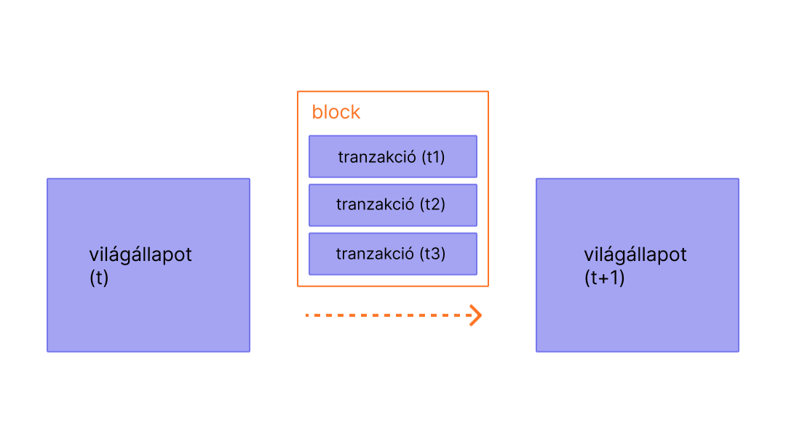

A blokkok tranzakciókból álló csoportosítások a láncban lévő előző blokk hash-ével ellátva. Ez összeköti a blokkokat (egy lánccá), mivel a hasheket kriptográfiailag származtatjuk a blokk adatból. Ez megelőzi a csalásokat, mivel bármely blokkon történő változtatás érvénytelenítené az összes következő blokkot, mivel az összes többi hash megváltozna és bárki aki a blokkláncot futtatja észrevenné.

## Előfeltételek {#prerequisites}

A blokkok könnyen feldolgozhatók még a legkezdőbb felhasználóknak is. De ennek az oldalnak a jobb megértése érdekében javasoljuk, hogy először olvasd el a [Számlák](/developers/docs/accounts/), [Tranzakciók](/developers/docs/transactions/), és a [Bevezetés az Ethereumba](/developers/docs/intro-to-ethereum/) cikkeinket.

## Miért kellenek a blokkok? {#why-blocks}

Hogy biztosítsuk azt, hogy az Ethereum hálózat minden résztvevője egy szinkronizált állapotot tart fenn és megegyezik a pontos tranzakciós történetben, a tranzakciókat blokkokba rendezzük. Ez azt jelenti, hogy tucatnyi (vagy több száz) tranzakció felett van elköteleződés, egyetértés és szinkronizáció egyszerre.

 _Diagram átvéve az [Ethereum EVM illusztrálva](https://takenobu-hs.github.io/downloads/ethereum_evm_illustrated.pdf)_ anyagból

Az elkötelezettségek elosztásával elegendő időt adunk az összes hálózati résztvevőnek konszenzusra jutni: annak ellenére, hogy a tranzakciós kérelmek másodpercenként több tucatszor fordulnak elő, az Ethereum blokkjai körülbelül tizenöt másodpercenként köteleződnek el.

## Hogy működnek a blokkok {#how-blocks-work}

Hogy megőrizzük a tranzakciós történetet, a blokkoknak szigorú sorrendet kell betartaniuk (minden létrejövő új blokk tartalmaz egy referenciát a szülő blokkjára), és a blokkokban lévő tranzakciók is szigorú sorrendet követnek. Ritka esetek kivételével bármikor amikor a hálózat összes résztvevője egyetért a blokkok pontos számában és előzményeiben, és azon dolgozik, hogy az aktuális élő tranzakciós kérelmeket a következő blokkba csomagolja.

Amint egy blokk össze van állítva (ki van bányászva) egy bányász által a hálózaton, tovább terjed a hálózat többi része számára; az összes csomópont hozzáfűzi ezt a blokkot a blokkláncukra és folytatódik a bányászat. A pontos blokk összeállítási (bányászati) folyamatot és az elköteleződés/konszenzus folyamatot jelenleg az Ethereum “proof-of-work” protokollja specifikálja.

### Egy vizuális bemutató {#a-visual-demo}

<YouTube id="_160oMzblY8" />

## A proof-of-work protokoll {#proof-of-work-protocol}

A proof-of-work a következőket jelenti:

- A bányászó csomópontoknak változó, de jelentős mértékű energiát, időt és számítási kapacitást kell fordítaniuk, hogy előállítsanak egy "törvényességi igazolást" egy adott blokkra, melyet a hálózatra terjesztenek. Ez segít megvédeni a hálózatot többek között \* a spam/szolgáltatás megtagadási támadásoktól, mivel az igazolásokat drága előállítani.
- A többi bányásznak, aki hall az érvényes igazolással rendelkező új blokkról, muszáj elfogadni az új blokkot, mint egy kanonikus következő blokkot a blokkláncon.
- A pontos idő, mely egy adott bányász számára szükséges, hogy előteremtse az igazolást, egy random változó nagy varianciával. Ez biztosítja azt, hogy valószínűtlen*, hogy két bányász egyszerre teremti meg az igazolást a következő felterjesztett blokkra; amikor egy bányász elkészít és tovább terjeszt egy igazolt blokkot, szinte teljesen biztosak lehetnek abban, hogy a hálózat elfogadja ezt a blokkot, mint egy következő kanonikus blokkok a blokkláncban, konfliktus nélkül* (habár van egy protokoll a nézeteltérések megoldására, arra az esetre amikor két igazolt blokkokból álló lánc egy időben elkészül).

[Többet a bányászatról](/developers/docs/consensus-mechanisms/pow/mining/)

## Mi van egy blokkban? {#block-anatomy}

- Időbélyeg – a blokk kibányászásának ideje.
- Blokkszám – blokklánc hossza blokkokban.
- Nehézség – a blokk kibányászásához szükséges erőfeszítés.
- mixHash – a blokk egyedi azonosítója.
- Egy szülő hash – az előző blokk egyedi azonosítója (így kapcsolódnak össze a blokkok egy lánccá).
- Tranzakciós lista – a blokkban lévő tranzakciók listája.
- Állapot gyökér – a rendszer teljes állapota: számla egyenlegek, szerződés tárhely, szerződés kód és számla nonce-ok vannak benne.
- Nonce – egy hash, melyet ha kombinálunk a mixHash-sel, akkor be tudjuk bizonyítani, hogy végig ment a [proof-of-work](/developers/docs/consensus-mechanisms/pow/) folyamaton.

## Blokkméret {#block-size}

Utolsó fontos megjegyzés, hogy a blokkok maguk is korlátozott méretűek. Minden blokknak van egy blokk gáz limite, melyet a hálózat és a bányászok állítanak be közösen: az összes tranzakció által teljesen felhasznált gáznak a blokkban kevesebbnek kell lennie, mint a gáz limitnek. Ez fontos, mert ez azt jelenti, hogy a blokkok nem lehetnek tetszőlegesen nagyok. Ha a blokkok tetszőlegesen nagyok lehetnének, akkor a kevésbé teljesítőképes teljes csomópontok egyre kevésbé tudnának lépést tartani a hálózattal a tárhely és sebesség igények miatt. A blokk gáz limit a nulladik blokkban (block 0) 5,000-ről indult; bármely új blokkot bányászó bányász módosíthatja a gáz limitet 0,1%-ig bármely irányba a szülő blokk gáz limitétől. A gáz limit jelenleg 2018 Novemberében 8,000,000 körül mozog.

## További olvasnivaló {#further-reading}

_Ismersz olyan közösségi anyagot, amely segített neked? Módosítsd az oldalt és add hozzá!_

## Kapcsolódó témák {#related-topics}

- [Bányászat](/developers/docs/consensus-mechanisms/pow/mining/)
- [Tranzakciók](/developers/docs/transactions/)
- [Gáz](/developers/docs/gas/)
