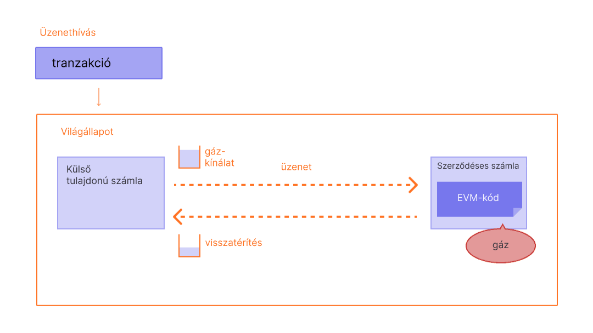

Az gáz nélkülözhetetlen az Ethereum hálózaton. Ez az üzemanyag, amitől működik, ahogyan az autóknak is szükségük van benzinre, hogy menjenek.

## Előfeltételek {#prerequisites}

Hogy jobban megértse ezt az oldalt, javasoljuk, hogy olvassa el a [tranzakciókról](/developers/docs/transactions/) és az [EVM-ről](/developers/docs/evm/) szóló oldalakat.

## Mi az a gáz? {#what-is-gas}

A gáz a számítási erőfeszítés mértékegységét jelenti, mely bizonyos műveletek végrehajtásához szükséges az Ethereum hálózaton.

Mivel az Ethereum-tranzakciók számítási kapacitást igényelnek a végrehajtáshoz, ezeket ki kell fizetni, hogy a hálózat ne legyen sebezhető a szemeteléssel vagy a végtelen ciklusokat indító logikákkal szemben. A számításokért gázdíj formájában kell fizetni.

A gázdíj **a művelet végrehajtásához szükséges gáz mennyisége, szorozva a gázegység költségével**. A díjat a tranzakció sikerességétől függetlenül is ki kell fizetni.

 _Diagram átvéve az [Ethereum EVM illusztrálva](https://takenobu-hs.github.io/downloads/ethereum_evm_illustrated.pdf)_ anyagból

A gázdíjakat az Ethereum saját valutájában, etherben (ETH) kell kifizetni. A gázdíjakat általában gwei-ben adják meg, ami az ETH címlete. Egy gwei az ETH egymilliárdnyi részével (0,000000001 ETH vagy 10-9 ETH) egyenlő.

Például ahelyett, hogy azt mondanánk, hogy a gáz 0,000000001 ether-be kerül, azt mondjuk, hogy a gáz ára 1 gwei.

A gwei a giga-wei-ből ered, ami milliárd weit jelent. Egy gwei az egy milliárd wei. A wei (amit [Wei Dai](https://wikipedia.org/wiki/Wei_Dai) után neveztek el, aki a [b-pénz feltalálója](https://www.investopedia.com/terms/b/bmoney.asp)) az ETH legkisebb egysége.

## Hogyan kerül kiszámításra a gázdíj? {#how-are-gas-fees-calculated}

Amikor a felhasználó egy tranzakciót indít, akkor ki tudja választani, hogy mennyi gázdíjat hajlandó fizetni a végrehajtásért. Bizonyos gázmennyiség felajánlásával ajánlatot tesz, hogy az adott tranzakció bekerüljön a következő blokkba. Ha túl kicsi az összeg, akkor a validátorok kisebb valószínűséggel kapják fel a tranzakciót, így az később vagy esetleg egyáltalán nem kerül feldolgozásra. Ha túl sokat ajánl valaki, akkor talán elveszíti az ETH-összeg egy részét. Hogyan érdemes meghatározni a fizetendő díjat?

A teljes gázdíj két komponensből áll: az `alapdíj` és az `elsőbbségi díj` (borravaló).

Az `alapdíjat` a protokoll állapítja meg – ahhoz, hogy a tranzakció érvényes legyen, legalább ennyit ki kell érte fizetni. Az `elsőbbségi díj` egy borravaló az alapdíjon felül, amely miatt a tranzakció vonzóvá válhat a validátorok szemében, ezért felveszik azt a következő blokkba.

Az a tranzakció, amely csak az `alapdíjat` fizeti meg, technikailag érvényes, de kevéssé valószínű, hogy bekerül, mert nem jelent motivációt a validátoroknak, hogy egy másik tranzakció helyett ezt válasszák. A „megfelelő” `elsőbbségi díjat` a hálózat használata határozza meg abban az időpontban, amikor a felhasználó a tranzakciót elküldi – ha nagy a kereslet, akkor magasabb `elsőbbségi díjat` kell fizetni, kisebb keresletnél pedig kevesebb is elég lehet.

Például Jordannek ki kell fizetnie 1 ETH-t Taylornak. Az ETH transzferhez 21 000 egységnyi gázra van szükség, az alapdíj pedig 10 gwei. Jordan 2 gwei borravalót ad hozzá.

A teljes díj így néz ki:

`a felhasznált gáz mennyisége * (alapdíj + elsőbbségi díj)`

ahol az `alapdíjat` a protokoll határozza meg, az `elsőbbségi díjat` pedig a felhasználó adja, hogy a validátort díjazza.

pl. `21 000 * (10 + 2) = 252 000 gwei` (0,000252 ETH).

Amikor Jordan elküldi a pénzt, akkor a számlájáról 1,000252 ETH-t fognak levonni. Taylornak pedig jóváírnak 1,0000 ETH-t. A validátor megkapja 0,000042 ETH borravalót. A 0,00021 ETH `alapdíjat` elégetik.

### Alapdíj {#base-fee}

Minden blokk rendelkezik alapdíjjal, ami egyfajta foglalási díjként működik. A blokkba csak úgy lehet bekerülni, hogy a gázért felajánlott ár eléri az alapdíjat. Az alapdíj az aktuális blokktól függetlenül kerül kiszámításra, inkább az előző blokk határozza meg, hogy a tranzakciós illeték kiszámíthatóbb legyen a felhasználók számára. Amikor a blokk létrejön, akkor ez az **alapdíj „elég”**, vagyis kivonják a körforgásból.

Az alapdíj egy olyan képlettel kerül kiszámításra, amely összeveti az előző blokk méretét (a benne lévő tranzakciók által felhasznált gáz mennyisége) a célmérettel. Ha a blokk meghaladja a célméretet, akkor az alapdíj legfeljebb 12,5%-kal emelkedik blokkonként. Ez az exponenciális növekedés gazdasági szempontból eléri, hogy a blokkméret ne maradhasson ilyen nagy a végtelenségig.

| Blokkszám | Benne lévő gáz | Díjnövekedés | Jelenlegi alapdíj |
| --------- | --------------:| ------------:| -----------------:|
| 1         |            15M |           0% |          100 gwei |
| 2         |            30M |           0% |          100 gwei |
| 3         |            30M |        12,5% |        112,5 gwei |
| 4         |            30M |        12,5% |        126,6 gwei |
| 5         |            30M |        12,5% |        142,4 gwei |
| 6         |            30M |        12,5% |        160,2 gwei |
| 7         |            30M |        12,5% |        180,2 gwei |
| 8         |            30M |        12,5% |        202,7 gwei |

A táblázatot folytatva a 9. blokkba kerülő tranzakcióra a tárca megadja a felhasználónak, hogy a **maximális alapdíj**, amivel bekerülhet a következő blokkba, az `a jelenlegi alapdíj * 112,5%` vagy `202,7 gwei * 112,5% = 228,1 gwei`.

Fontos megjegyezni, hogy nem valószínű, hogy egymás után sok teljes blokk készül, mert az alapdíj gyorsan növekszik a teljes blokk előtt.

| Blokkszám | Benne lévő gáz | Díjnövekedés | Jelenlegi alapdíj |
| --------- | --------------:| ------------:| -----------------:|
| 30        |            30M |        12,5% |       2705,6 gwei |
| ...       |            ... |        12,5% |               ... |
| 50        |            30M |        12,5% |     28 531,3 gwei |
| ...       |            ... |        12,5% |               ... |
| 100       |            30M |        12,5% | 10 302 608,6 gwei |

### Elsőbbségi díj (borravaló) {#priority-fee}

Az elsőbbségi díj (borravaló) motiválja a validátorokat, hogy bevegyék a tranzakciót a blokkba. A borravaló nélkül a validátoroknak gazdaságilag ugyanolyan értékű, ha üresen marad a blokk, mint ha felvesznek bele tranzakciókat, mert a blokkért megkapják a díjazásukat. A kis értékű borravaló egy minimális ösztönzést ad a validátoroknak, hogy felvegyenek egy tranzakciót. Azokért a tételekért, amelyeket ugyanabban a blokkban, de a többi tétel előtt szeretnénk végrehajtatni, magasabb borravalót érdemes fizetni, hogy lekörözze a többi tranzakció ajánlatát.

### Maximális díj {#maxfee}

Ahhoz, hogy a hálózaton végre legyen hajtva egy tranzakció, a felhasználók meghatározhatnak egy maximális határt, amit még hajlandók kifizetni érte. Ennek az opcionális paraméternek a neve `maxFeePerGas`. A tranzakció végrehajtásához a maximális díjnak meg kell haladnia az alapdíj és a borravaló összegét. A tranzakció küldője visszakapja azt a különbözetet, ami a maximális díj, valamint az alapdíj és a borravaló összege között van.

### Blokkméret {#block-size}

Minden blokk 15 millió gáz célmérettel rendelkezik, de a blokk mérete a hálózati kereslet függvényében, egészen a 30 millió gáz határig (amely a célméret kétszerese) változik. A protokoll úgy éri el az egyensúlyi, átlagos 15 milliós blokkméretet, hogy a _tâtonnement_, vagyis a közelítés módszerét alkalmazza. Tehát, ha a blokkméret meghaladja a célértéket, akkor a protokoll megnöveli az alapdíjat a következő blokknál. Ugyanígy csökkenti az alapdíjat, ha a blokkméret kisebb, mint a célérték. Az alapdíj mértéke arányosan változik annak függvényében, hogy a jelenlegi blokkméret hogyan viszonyul a célmérethez. [Bővebben a blokkokról](/developers/docs/blocks/).

### A gázdíjak kiszámítása a gyakorlatban {#calculating-fees-in-practice}

A felhasználó egyértelműen kijelentheti, hogy mennyit hajlandó fizetni azért, hogy a tranzakciót végrehajtsák. Emellett a legtöbb tárcaszolgáltató automatikusan beállít egy javasolt tranzakciós illetéket (alapdíj + a javasolt elsőbbségi díj), hogy csökkentse a használat komplexitását.

## Miért léteznek a gázdíjak? {#why-do-gas-fees-exist}

Röviden, a gázdíjak tartják fenn a Ethereum hálózat biztonságát. Azzal, hogy a hálózaton végrehajtott minden számítás egy díjat von maga után, megelőzzük, hogy rosszhiszemű személyek túlterheljék a hálózatot. Azért, hogy megelőzzük a véletlen vagy ártó szándékú végtelen ciklusokat vagy más számítási pazarlással járó kódot, minden egyes tranzakciónak be kell állítani egy határt, hogy mennyi számítási lépést hajthat végre a kód futtatása. A számítás alapmértékegysége a „gáz”.

Habár a tranzakció tartalmaz egy határt, a fel nem használt gázdíj visszakerül a felhasználóhoz. Például a `maximális díj – (alapdíj + borravaló)` visszatérítésre kerül.

 _Diagram átvéve az [Ethereum EVM illusztrálva](https://takenobu-hs.github.io/downloads/ethereum_evm_illustrated.pdf)_ anyagból

## Mit jelent a gázkorlátozás? {#what-is-gas-limit}

A gázkorlátozás arra utal, hogy egy tranzakció során legfeljebb mennyi gázra lesz szükség. A bonyolultabb tranzakciók, mint az [okosszerződések](/developers/docs/smart-contracts/), több számítási kapacitást igényelnek, ezért magasabb gázkorlátozásra van szükségük, mint egy egyszerű átutalásnál. Egy általános ETH-transzfer 21 000 egységi gázkorlátozást igényel.

Például, ha egy egyszerű ETH transzferre azt állítjuk be, hogy a gázkorlátozás 50 000 legyen, az EVM felhasznál 21 000-et, a felhasználó pedig visszakapja a maradék 29 000-et. Ha viszont túl kevés gázt határozunk meg, például a gázkorlátozás 20 000 lesz egy egyszerű ETH transzferhez, akkor az EVM elfogyasztja a 20 000 egységet, és megpróbálja végrehajtani a tranzakciót, de nem tudja azt teljesíteni. Ekkor az EVM visszaforgatja a változtatásokat, de mivel a validátor már elvégzett 20 000 gáz mennyiségű munkát, ezért ez el lett fogyasztva.

## Miért lehetnek olyan magasak a gázdíjak? {#why-can-gas-fees-get-so-high}

A magas gázdíjak oka az Ethereum népszerűsége. Amikor nagy a kereslet, akkor a felhasználóknak magasabb borravalót kell ajánlaniuk, hogy lekörözzék a többi tranzakciót. A magasabb borravaló miatt az adott tranzakció valószínűleg bekerül a következő blokkba. Emellett a sokkal összetettebb okosszerződéses alkalmazások sok műveletet végezhetnek funkcióik támogatása érdekében, amivel sok gázt fogyasztanak el.

## Kezdeményezések a gázköltségek csökkentésére {#initiatives-to-reduce-gas-costs}

Az Ethereum [skálázhatósági fejlesztései](/roadmap/) meg fogják oldani a gázdíjak körüli problémák egy részét, így lehetővé teszik, hogy a platform ezernyi tranzakciót dolgozzon fel másodpercenként és globálisan skálázható legyen.

A második blokkláncréteggel (L2) kialakított skálázás a fő kezdeményezés arra, hogy nagy mértékben javuljanak a gázköltségek, a felhasználói élmény és a skálázhatóság. [Bővebben az L2 skálázásról](/developers/docs/scaling/#layer-2-scaling).

## A gázdíjak felügyelete {#monitoring-gas-fees}

Ha Ön szeretné felügyelni a gázdíjakat azért, hogy kevesebbet kelljen fizetnie az ETH-tranzakciókért, akkor számos eszköz áll rendelkezésre:

- [Etherscan](https://etherscan.io/gastracker) _ Tranzakció gázdíjának becslése_
- [ETH Gas Tracker](https://www.ethgastracker.com/) _Figyeli és kövesti az Ethereum és az L2 gázárakat a tranzakciós díjak csökkentése és a pénzmegtakarítás érdekében_
- [Blocknative ETH gázbecslés](https://chrome.google.com/webstore/detail/blocknative-eth-gas-estim/ablbagjepecncofimgjmdpnhnfjiecfm) _Gázbecslő Chrome-kiterjesztés, amely támogatja az eredeti (0. típusú) és az EIP-1559 (2. típusú) tranzakciókat._
- [Cryptoneur gázdíjkalkulátor](https://www.cryptoneur.xyz/gas-fees-calculator) _Számolja ki a gázdíjat a saját pénznemében a különféle tranzakciókra az Ethereum főhálózatán, az Arbitrumon és a Polygonon._

## Kapcsolódó eszközök {#related-tools}

- [Blocknative gázplatform](https://www.blocknative.com/gas) _Gázbecslő API, amelyet a Blocknative globális memóriakészlet adatplatformja támogat_

## További olvasnivaló {#further-reading}

- [Az Ethereum gázdíjról részletesen](https://defiprime.com/gas)
- [Csökkentse az okosszerződésének gázfogyasztását](https://medium.com/coinmonks/8-ways-of-reducing-the-gas-consumption-of-your-smart-contracts-9a506b339c0a)
- [A proof-of-stake és a proof-of-work összehasonlítása](https://blockgeeks.com/guides/proof-of-work-vs-proof-of-stake/)
- [Gázoptimalizáló stratégiák fejlesztők számára](https://www.alchemy.com/overviews/solidity-gas-optimization)
- [EIP-1559-dokumentumok](https://eips.ethereum.org/EIPS/eip-1559).
- [Tim Beiko EIP-1559 forrásai](https://hackmd.io/@timbeiko/1559-resources).
