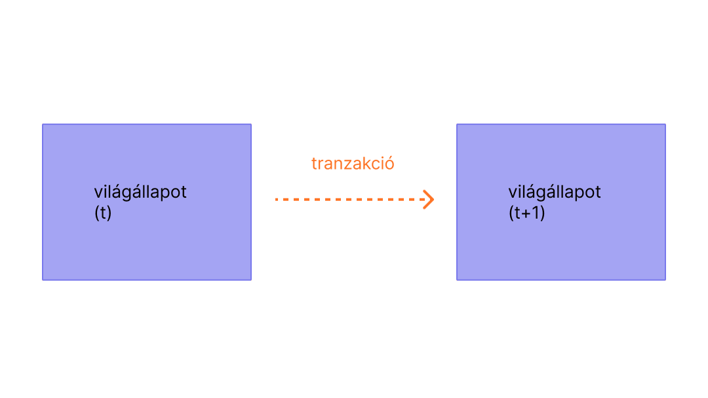

A tranzakciók számlákból származó kriptográfiailag aláírt instrukciók. Egy számla tranzakciót indíthat, hogy frissítse az Ethereum hálózat állapotát. A legegyszerűbb tranzakció az ETH átutalása egyik számláról a másikra.

## Előfeltételek {#prerequisites}

Ennek az oldalnak a jobb megértése érdekében javasoljuk, hogy először olvasd el a [Számlák](/developers/docs/accounts/) és a [bevezetés az Ethereumba](/developers/docs/intro-to-ethereum/) című cikkeinket.

## Mi az a tranzakció? {#whats-a-transaction}

Az Ethereum tranzakció egy külső tulajdonú számla által kezdeményezett tevékenységre utal, más szóval egy számla, melyet egy ember kezel, nem pedig egy szerződés. Például ha Bob elküld Alice-nek 1 ETH-et, akkor Bob számláját terhelni kell, Alice számlájára pedig jóvá kell írni az összeget. Ez az állapotot megváltoztató művelet egy tranzakción belül történik.

 _Diagram átvéve az [Ethereum EVM illusztrálva](https://takenobu-hs.github.io/downloads/ethereum_evm_illustrated.pdf)_ anyagból

A tranzakciókat, melyek megváltoztatják az EVM állapotát, a teljes hálózat számára közvetíteni kell. Bármely csomópont kérvényezheti egy tranzakció végrehajtását az EVM-en; miután ez megtörténik, egy bányász végrehajtja a tranzakciót és továbbterjeszti az eredményül kapott állapotot a hálózat többi része számára.

A tranzakcióknak van egy díja, és ki kell bányászni őket, hogy érvényessé váljanak. Hogy egyszerűbb legyen ez az áttekintő, a gáz díjak és a bányászat témaköröket máshol taglaljuk.

Az elküldött tranzakció a következő információkat tartalmazza:

- `recipient` – a fogadó cím (ha egy külső tulajdonú számla, akkor a tranzakció értéket továbbít. Ha egy szerződéses számla, akkor a tranzakció szerződés kódot fog végrehajtani)
- `signature` – a küldő azonosítója. Ez akkor jön létre, amikor a feladó privát kulcsa aláírja a tranzakciót, és megerősíti, hogy a küldő engedélyezte ezt a tranzakciót
- `value` – az átküldendő ETH mennyiség a küldőtől a címzettnek (WEI-ben, az ETH egységében megadva)
- `data` – opcionális mező tetszőleges adat megadására
- `gasLimit` – a maximális gáz egység, melyet a tranzakció elfogyaszthat. A gáz egységek számítási lépéseket reprezentálnak
- `gasPrice` – a díj, melyet a küldő fizet gáz egységenként

A gáz a bányász által a tranzakció feldolgozásához szükséges számításra utal. A felhasználóknak egy díjat kell fizetniük ezért a számításért. A `gasLimit` és a `gasPrice` meghatározza a bányásznak fizetett maximális tranzakciós díjat. [Többet a gázról](/developers/docs/gas/).

A tranzakció objektum nagyjából így néz ki:

```js
{
  from: "0xEA674fdDe714fd979de3EdF0F56AA9716B898ec8",
  to: "0xac03bb73b6a9e108530aff4df5077c2b3d481e5a",
  gasLimit: "21000",
  gasPrice: "200",
  nonce: "0",
  value: "10000000000",
}
```

De a tranzakció objektumot alá kell írni a küldő privát kulcsával. Ez bizonyítja, hogy a tranzakció kizárólag a küldőtől jöhetett és nem történt csalás.

Egy Ethereum kliens, mint a Geth, fogja kezelni az aláírási folyamatot.

Példa [JSON-RPC](https://eth.wiki/json-rpc/API) hívás:

```json
{
  "id": 2,
  "jsonrpc": "2.0",
  "method": "account_signTransaction",
  "params": [
    {
      "from": "0x1923f626bb8dc025849e00f99c25fe2b2f7fb0db",
      "gas": "0x55555",
      "gasPrice": "0x1234",
      "input": "0xabcd",
      "nonce": "0x0",
      "to": "0x07a565b7ed7d7a678680a4c162885bedbb695fe0",
      "value": "0x1234"
    }
  ]
}
```

Példa válasz:

```json
{
  "jsonrpc": "2.0",
  "id": 2,
  "result": {
    "raw": "0xf88380018203339407a565b7ed7d7a678680a4c162885bedbb695fe080a44401a6e4000000000000000000000000000000000000000000000000000000000000001226a0223a7c9bcf5531c99be5ea7082183816eb20cfe0bbc322e97cc5c7f71ab8b20ea02aadee6b34b45bb15bc42d9c09de4a6754e7000908da72d48cc7704971491663",
    "tx": {
      "nonce": "0x0",
      "gasPrice": "0x1234",
      "gas": "0x55555",
      "to": "0x07a565b7ed7d7a678680a4c162885bedbb695fe0",
      "value": "0x1234",
      "input": "0xabcd",
      "v": "0x26",
      "r": "0x223a7c9bcf5531c99be5ea7082183816eb20cfe0bbc322e97cc5c7f71ab8b20e",
      "s": "0x2aadee6b34b45bb15bc42d9c09de4a6754e7000908da72d48cc7704971491663",
      "hash": "0xeba2df809e7a612a0a0d444ccfa5c839624bdc00dd29e3340d46df3870f8a30e"
    }
  }
}
```

- a `raw` az aláírt tranzakció rekurzív hosszúságú prefixumban (RLP) enkódolva
- a `tx` az aláírt tranzakció JSON-ban

A szignatúra hash-sel a tranzakcióról kriptográfiailag be lehet bizonyítani, hogy a küldőtől jött és továbbították a hálózatra.

### A gázról {#on-gas}

Ahogy korábban említettük, a tranzakciók [gáz](/developers/docs/gas/) költséget igényelnek a lefutáshoz. Egy egyszerű átutalás 21000 gáz egységet igényel.

Így ahhoz, hogy Bob 1 ETH-et küldjön Alice-nek 200 Gwei `gasPrice` értékkel, a következő díjat kell kifizetnie:

```
200*21000 = 4,200,000 GWEI
--vagy--
0.0042 ETH
```

Bob számláját **-1.0042 ETH** terhelés éri

Alice számlájára **+1.0 ETH**-et írnak jóvá

A bányász, aki feldolgozta a tranzakciót **+0.0042 ETH**-et fog kapni

Az okosszerződés interakciók is gázt igényelnek.

 _Diagram átvéve az [Ethereum EVM illusztrálva](https://takenobu-hs.github.io/downloads/ethereum_evm_illustrated.pdf)_ anyagból

Minden fel nem használt gáz visszakerül a felhasználó számlájára.

## Tranzakció életciklus {#transaction-lifecycle}

Amikor elküld valaki egy tranzakciót, a következő történik:

1. Amikor elküldesz egy tranzakciót, egy kriptográfiai hash jön létre: `0x97d99bc7729211111a21b12c933c949d4f31684f1d6954ff477d0477538ff017`
2. A tranzakciót ezután közvetítik a hálózatra, és sok más tranzakcióval rendelkező készletbe foglalják.
3. Egy bányásznak ki kell választania a tranzakciódat és belefoglalnia egy blokkba, hogy hitelesítse és "sikeresnek" minősítse.
   - Lehet, hogy ennél a résznél várnod kell, ha a hálózaton nagy a forgalom és a bányászok nem tudnak lépést tartani. A bányászok, mindig a nagyobb `GASPRICE` értékű tranzakciót veszik előre, mivel megtarthatják a tranzakciós díjakat.
4. A tranzakciód kap egy blokk megerősítési számot is. Ez azoknak a blokkoknak a mennyisége, melyek azután jöttek létre, miután te tranzakciódat blokkba foglalták. Minél nagyobb ez a szám, annál nagyobb bizonyossággal lehet kimondani, hogy a tranzakciót feldolgozták és a hálózat elismeri. Ez azért van, mert néha a blokk, mely befoglalja a tranzakciódat, nem mindig jut el a láncig.
   - Minél nagyobb a blokk megerősítési szám, annál nehezebb megváltoztatni a tranzakciót. Így nagyobb értékű tranzakcióknál, nagyobb blokk megerősítési szám az elvárt.

## Egy vizuális bemutató {#a-visual-demo}

Nézd meg, ahogy Austin átvezet a tranzakciókon, a gázon és a bányászaton.

<YouTube id="er-0ihqFQB0" />

## További olvasnivaló {#further-reading}

_Ismersz olyan közösségi anyagot, amely segített neked? Módosítsd az oldalt és add hozzá!_

## Kapcsolódó témák {#related-topics}

- [Számlák](/developers/docs/accounts/)
- [Ethereum virtuális gép (EVM)](/developers/docs/evm/)
- [Üzemanyag](/developers/docs/gas/)
- [Bányászat](/developers/docs/consensus-mechanisms/pow/mining/)
