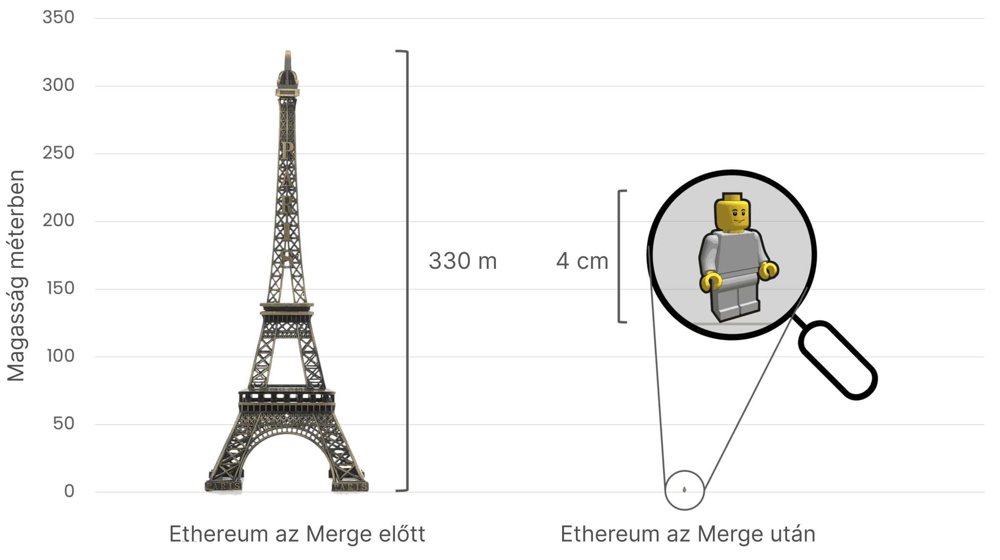

# Az Ethereum energiafogyasztása {#proof-of-stake-energy}

Az Ethereum egy környezetbarát blokklánc. Az Ethereum [proof-of-stake](/developers/docs/consensus-mechanisms/pos) konszenzus mechanizmusa ETH-t használ [az energia helyett, hogy biztosítsa a hálózatot](/developers/docs/consensus-mechanisms/pow). Az Ethereum energiafogyasztása [~0,0026 TWh/év](https://carbon-ratings.com/eth-report-2022) a teljes globális hálózaton.

Az Ethereum energiafogyasztásának becsült adata egy [CCRI (Crypto Carbon Ratings Institute)](https://carbon-ratings.com) tanulmányból származik. Ez egy lentről felfelé építkező becslés az Ethereum-hálózat áramfogyasztásáról és karbonlábnyomáról ([nézze meg a reportot](https://carbon-ratings.com/eth-report-2022)). A különféle csomópontok áramfogyasztását mérték, melyek különböző hardverekkel és kliensszoftverekkel működnek. A becsült **2601 MWh** (0,0026 TWh), mint a hálózat teljes éves áramfogyasztása, megfelel **870 tonna CO2e** szén-dioxid kibocsátásnak, regionális tényezőket figyelembe véve. Ez az érték változik, ahogy a csomópontok belépnek a hálózatra és kilépnek a hálózatról – Ön is ellenőrizheti egy gördülő 7 napos átlagbecsléssel: [Cambridge-blokklánchálózat fenntarthatósági index](https://ccaf.io/cbnsi/ethereum) (a módszer kicsit más, nézze meg a részleteket az oldalukon).

Ethereum energiafogyasztását vesszük össze más iparágak éves becsléseivel, hogy kontextusban lássuk azt. Így jobban megértjük, hogy Ethereum fogyasztása magas vagy alacsony.

<EnergyConsumptionChart />

Az ábra a becsült éves fogyasztást mutatja TWh/év formájában. A becslések nyilvános adatokból származnak 2023. májusában, a forrásokat megtalálja a táblázat alatt:

|                            | Éves energiafogyasztás (TWh) | Összevetve a PoS Ethereummal | Forrás                                                                                                                                                                            |
| :------------------------- | :--------------------------: | :--------------------------: | --------------------------------------------------------------------------------------------------------------------------------------------------------------------------------- |
| Globális adatközpontok     |             200              |           77 000x            | [forrás](https://www.iea.org/commentaries/data-centres-and-energy-from-global-headlines-to-local-headaches)                                                                       |
| Aranybányászat             |             131              |           50 000x            | [forrás](https://ccaf.io/cbnsi/cbeci/comparisons)                                                                                                                                 |
| Bitcoin                    |             131              |           50 000x            | [forrás](https://ccaf.io/cbnsi/cbeci/comparisons)                                                                                                                                 |
| PoW Ethereum               |              78              |           30 000x            | [forrás](https://digiconomist.net/ethereum-energy-consumption)                                                                                                                    |
| Youtube (csak a közvetlen) |              12              |            4600x             | [forrás](https://www.gstatic.com/gumdrop/sustainability/google-2020-environmental-report.pdf)                                                                                     |
| Számítógépes játékok (USA) |              34              |           13 000x            | [forrás](https://www.researchgate.net/publication/336909520_Toward_Greener_Gaming_Estimating_National_Energy_Use_and_Energy_Efficiency_Potential)                                 |
| Netflix                    |            0,451             |             173x             | [forrás](https://assets.ctfassets.net/4cd45et68cgf/7B2bKCqkXDfHLadrjrNWD8/e44583e5b288bdf61e8bf3d7f8562884/2021_US_EN_Netflix_EnvironmentalSocialGovernanceReport-2021_Final.pdf) |
| PayPal                     |             0,26             |             100x             | [forrás](https://app.impaakt.com/analyses/paypal-consumed-264100-mwh-of-energy-in-2020-24-from-non-renewable-sources-27261)                                                       |
| AirBnB                     |             0,02             |              8x              | [forrás](<https://s26.q4cdn.com/656283129/files/doc_downloads/governance_doc_updated/Airbnb-ESG-Factsheet-(Final).pdf>)                                                           |
| PoS Ethereum               |            0,0026            |              1x              | [forrás](https://carbon-ratings.com/eth-report-2022)                                                                                                                              |

Bonyolult pontos becsléseket készíteni az energiafogyasztásról, főleg ha a vizsgált entitás összetett ellátási lánccal bír, ami befolyásolja a hatékonyságát. Vegyük a Netflixet vagy Youtube-ot példaként. A fogyasztásuk becslése attól függően változik, hogy a rendszer fenntartását és a tartalomnak a felhasználóhoz való eljutását nézik (_közvetlen fogyasztás_) vagy beleveszik azt is, amit a tartalom előállítása, irodák fenntartása, reklámozás stb. jelent (_közvetett fogyasztás_). A közvetlen fogyasztás azt is felölelheti, hogy mennyi energia kell a felhasználónak, hogy a tartalmat megnézze a tévében, számítógépen és mobilon, ami ezektől az eszközöktől is nagyban függ.

Egy erről szóló beszélgetés: [Carbon Brief](https://www.carbonbrief.org/factcheck-what-is-the-carbon-footprint-of-streaming-video-on-netflix). A táblázat a Netflix által közölt _közvetlen_ és _közvetett_ használatot mutatja. A Youtube csak a _közvetlen_ fogyasztást adta meg, ami [12 TWh/év](https://www.gstatic.com/gumdrop/sustainability/google-2020-environmental-report.pdf).

Az összehasonlítás a Bitcoint és a proof-of-work Ethereumot feltünteti. Fontos megérteni, hogy a proof-of-work hálózatok fogyasztása nem statikus, napról napra változik. A proof-of-work Ethereumra vonatkozó érték pontosan [az egyesítés (The Merge)](/roadmap/merge/) előtti állapotot mutatja, ami a proof-of-stake mechanizmusra váltotta át a rendszert, és a [Digiconomist](https://digiconomist.net/ethereum-energy-consumption) jelezte. Más források, mint a [Cambridge-blokklánchálózat fenntartási index](https://ccaf.io/cbnsi/ethereum/1) sokkal kevesebbre becsülik (20 TWh/évhez közelebb). A Bitcoin fogyasztása is más a különböző források szerint, ami sok [vitát](https://www.coindesk.com/business/2020/05/19/the-last-word-on-bitcoins-energy-consumption/) generál, nemcsak a felhasznált energia mennyiségéről, hanem annak forrásáról és etikájáról. Az energiafogyasztás nem feltétlenül pontosan kapcsolódik a környezeti hatásokhoz, mert különböző projektek különféle energiaforrásokat használnak, például kisebb vagy nagyobb arányú megújuló forrásokat. Például a [Cambridge Bitcoin elektromosáram-fogyasztási index](https://ccaf.io/cbnsi/cbeci/comparisons) azt mutatja, hogy a Bitcoin hálózati igénye elméletileg kielégíthető lenne abból a gázból vagy áramból, ami a szállítás során amúgy is elveszne. Az Ethereum a fenntarthatóság miatt cserélte le a rendszer energiaéhes részét egy környezetbarát alternatívára.

Számtalan iparág energiafogyasztását és szén-dioxid-kibocsátását megtekintheti a [Cambridge-blokklánchálózat fenntarthatósági index oldalán](https://ccaf.io/cbnsi/ethereum).

## Tranzakciónkénti becslés {#per-transaction-estimates}

Számos cikk tranzakciónkénti becslésről beszél a blokkláncok esetén. Ez félrevezető, mert a blokkjavaslat és validálás független a benne található tranzakciók számától. A tranzakciónkénti felhasználás azt jelentené, hogy kevesebb tranzakció kevesebb energiát fogyaszt és fordítva, de ez nem igaz. Emellett a tranzakciónkénti becslés érzékeny arra, hogy a blokklánc tranzakcióátvitelét hogyan definiálják, melynek megcsavarásával látszólag nagyobb vagy kisebb érték jön ki.

Például az Ethereumon a tranzakcióátvitel nemcsak az alapréteget tartalmazza, hanem a [második blokkláncréteg (L2)](/layer-2/) rollupjait is. Az L2 általában nincs benne a kalkulációkban, de ha hozzávennénk a szekvenszer általi fogyasztást (kevés) és a kezelt tranzakciókat (sok), akkor jelentősen lecsökkenne a tranzakciónkénti becslés. Ez az egyik oka annak, hogy a platformok tranzakciónkénti energiafogyasztásának összehasonlítása félrevezető lehet.

## Az Ethereum karbonadóssága {#carbon-debt}

Az Ethereum energiafelhasználása igen alacsony, de nem mindig volt így. Eredetileg a proof-of-work mechanizmust használta, ami nagyobb környezeti költségekkel járt, mint a jelenlegi proof-of-stake.

Az Ethereum eleve a proof-of-stake alapú konszenzusmechanizmust tervezte, anélkül hogy feláldozná a biztonságot vagy a decentralizálást, és ezért többéves fókuszált kutatás és fejlesztés kellett hozzá. Emiatt a hálózat felállításához a proof-of-work mechanizmusra volt szükség. Ennél a bányászok a számítógépeiket használják az érték kiszámolására, energiát fogyasztva eközben.

A CCRI becslése szerint a Merge több mint **99,988%-kal** lecsökkentette az éves áramfogyasztást. Ugyanígy a karbonlábnyoma is csökkent **99,992%-kal** (11 016 000 tonna helyett 870 tonna CO2e lett). Ez a változás olyan, mint az Eiffel torony magaságáról egy kis bábu méretére csökkent fogyasztás, ahogy az ábra illusztrálja. Ennek következtében a hálózat biztosításának környezeti költsége drasztikusan lecsökkent. A hálózat biztonsága pedig növekedett.

## Környezetbarát alkalmazási réteg {#green-applications}

Miközben az Ethereum energiafogyasztása nagyon alacsony, egy jelentős, fejlődő és igen aktív [**regeneratív pénzügyek (ReFi)**](/refi/) közösség épült a hálózaton. A ReFi alkalmazások a decentralizált pénzügyek (DeFi) komponenseit használják, hogy olyan pénzügyi alkalmazásokat építsenek, melyek pozitív externáliákat teremtenek. A ReFi része egy kiterjedtebb[„solarpunk”](https://en.wikipedia.org/wiki/Solarpunk) mozgalomnak, ami szorosan kötődik az Ethereumhoz, és a technológiai fejlődést a környezetről való gondoskodással párosítja. Az Ethereum decentralizált, engedélymentes és egymásra építhető jellege miatt ideális alap a ReFi és a solarpunk közösségeknek.

A web3 közjó-finanszírozási platformjai, mint a [Gitcoin](https://gitcoin.co) klímaköröket működtetnek, hogy elősegítsék az Ethereum alkalmazási rétegének környezettudatos építését. Ezen kezdeményezések (és mások, mint a [decentralizált tudomány / DeSci](/desci/)) kialakulása által az Ethereum egy környezeti és közösségi szempontból pozitív technológia.

<InfoBanner emoji=":evergreen_tree:">
  Ha szeretne az oldallal kapcsolatban fejlesztést javasolni, akkor naplózzon egy kérést (issue) vagy PR-t. A statisztikák nyilvánosan elérhető adatokból készült becslések, nem hivatalos állítások vagy ígéretek az ethereum.org csapat vagy az Ethereum Alapítvány részéről.
</InfoBanner>

## További olvasnivaló {#further-reading}

- [Cambridge-blokklánchálózat fenntarthatósági indexe](https://ccaf.io/cbnsi/ethereum)
- [Fehérházi jelentése a proof-of-work alapú blokkláncokról](https://www.whitehouse.gov/wp-content/uploads/2022/09/09-2022-Crypto-Assets-and-Climate-Report.pdf)
- [Ethereum-kibocsátás: egy alulról építkező becslés](https://kylemcdonald.github.io/ethereum-emissions/) – _Kyle McDonald_
- [Ethereum energiafelhasználási index](https://digiconomist.net/ethereum-energy-consumption/) – _Digiconomist_
- [ETHMerge.com](https://ethmerge.com/) – _[@InsideTheSim](https://twitter.com/InsideTheSim)_
- [Az egyesítés (The Merge) – az Ethereum-hálózat áramfogyasztására és karbonlábnyomára gyakorolt hatása](https://carbon-ratings.com/eth-report-2022) – _CCRI_
- [Az Ethereum energiafogyasztása](https://mirror.xyz/jmcook.eth/ODpCLtO4Kq7SCVFbU4He8o8kXs418ZZDTj0lpYlZkR8)

## Kapcsolódó témák {#related-topics}

- [Az Ethereum jövőképe](/roadmap/vision/)
- [A Beacon Chain](/roadmap/beacon-chain)
- [Az egyesítés](/roadmap/merge/)
