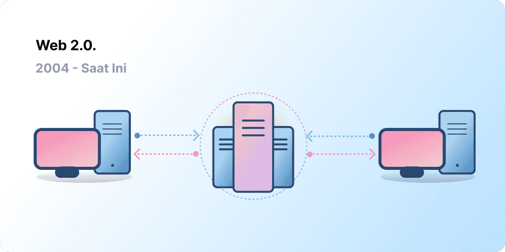
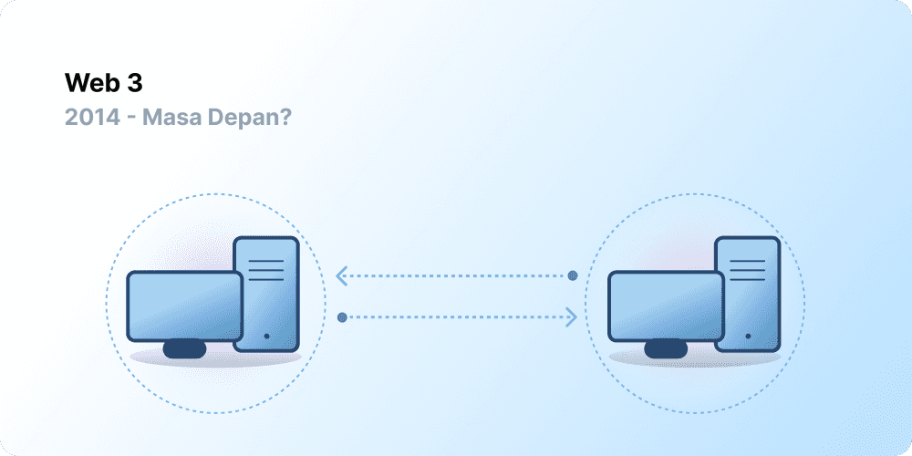

# Pengenalan kepada Web3 {#introduction}

Sentralisasi telah membantu memasukkan miliaran orang ke World Wide Web dan menciptakan infrastruktur yang stabil serta kuat di mana ia hidup. Namun pada saat yang bersamaan, sebagian entitas sentralisasi memiliki kekuasaan yang luar biasa pada World Wide Web, memungkinkan mereka untuk secara sepihak memutuskan apa yang boleh dan yang tidak diizinkan.

Web3 adalah jawaban untuk dilema ini. Alih-alih Web yang dimonopoli oleh perusahaan teknologi besar, Web3 merangkul desentralisasi dan dibangun, dioperasikan, dan dimiliki oleh para penggunanya. Web3 menempatkan kekuatan di tangan individu daripada perusahaan. Sebelum kita berbicara tentang Web3, mari kita jelajahi bagaimana kita sampai sini.

<Divider />

## Web Terdahulu {#early-internet}

Kebanyakan orang menganggap Web sebagai pilar kehidupan modern yang berkesinambungan - Web diciptakan dan terus ada sejak saat itu. Namun, Web yang sebagian besar dari kita tahu hari ini sangat berbeda dari yang awalnya dibayangkan. Untuk memahami hal ini dengan lebih baik, akan sangat membantu jika kita membagi sejarah singkat Web ke dalam beberapa periode - Web 1.0 dan Web 2.0.

### Web 1.0: Hanya Bisa-Dibaca (1990-2004) {#web1}

Pada tahun 1989, di CERN, Jenewa, Tim Berners-Lee sibuk mengembangkan protokol yang kelak menjadi World Wide Web. Ide dia? Untuk membuat protokol-protokol yang terbuka, terdesentralisasi yang memperbolehkan pembagian informasi dari mana saja di Bumi.

Penciptaan pertama dari Berners-Lee, yang sekarang dikenal sebagai 'Web 1.0', terjadi sekitar tahun 1990 dan 2004. Web 1.0 sebagian besar merupakan situs web statis yang dimiliki oleh perusahaan, dan hampir tidak ada interaksi antara pengguna - individu yang jarang menghasilkan konten - sehingga dikenal sebagai web yang hanya bisa dibaca.

### Web 2.0: Baca Bisa-Ditulis (2004-sekarang) {#web2}

Periode Web 2.0 mulai pada tahun 2004 dengan munculnya platform media sosial. Alih-alih hanya bisa dibaca, web telah berkembang menjadi bisa dibaca-ditulis. Alih-alih perusahaan yang menyediakan konten kepada pengguna, mereka juga mulai menyediakan platform untuk membagi konten yang dihasilkan oleh pengguna dan terlibat dalam interaksi pengguna-ke-pengguna. Semakin banyak orang yang daring, sekumpulan perusahaan top mulai untuk mengontrol jumlah pemasukan dan nilai yang dihasilkan oleh web secara tidak proposional. Web 2.0 juga melahirkan model pendapatan yang didorong oleh iklan. Ketika pengguna bisa membuat konten, mereka tidak memilikinya atau mendapat manfaat dari monetisasinya.

<Divider />

## Web 3.0: Baca-Tulis-Miliki {#web3}

Premis 'Web 3.0' diciptakan oleh salah satu co-founder [Ethereum](/what-is-ethereum/), Gavin Wood, tidak lama setelah Ethereum diluncurkan pada tahun 2014. Gavin mencurahkan sebuah solusi untuk masalah yang dirasakan oleh banyak pengadopsi kripto awal: Web membutuhkan terlalu banyak kepercayaan. Artinya, sebagian besar Web yang dikenal dan digunakan orang saat ini bergantung pada kepercayaan segelintir perusahaan swasta untuk bertindak demi kepentingan terbaik publik.

### Apa itu Web3? {#what-is-web3}

Web3 telah menjadi istilah umum untuk visi internet baru yang lebih baik. Pada intinya, Web3 menggunakan rantai blok, mata uang kripto, dan NFT untuk memberikan kekuatan kembali kepada pengguna dalam bentuk kepemilikan. [Sebuah postingan pada tahun 2020 di Twitter](https://twitter.com/himgajria/status/1266415636789334016) menjelaskan dengan sangat baik: Web1 hanya bisa-dibaca, Web2 bisa dibaca-ditulis, Web3 akan bisa dibaca/ditulis/dimiliki.

#### Inti ide Web3 {#core-ideas}

Meskipun sulit untuk memberikan definisi yang kaku tentang apa itu Web3, ada beberapa prinsip inti yang memandu pembuatannya.

- **Web3 terdesentralisasi:** alih-alih sebagian besar internet dikontrol dan dimiliki oleh entitas yang tersentralisasi, kepemilikannya didistribusikan antara pembuat dan penggunanya.
- **Web3 tidak memiliki izin:** setiap orang memiliki akses yang sama untuk berpartisipasi di Web3, dan tidak ada yang dikecualikan.
- **Web3 memiliki pembayaran asli:** menggunakan mata uang kripto untuk menghabiskan dan mengirimkan uang secara daring daripada mengandalkan pada infrastruktur bank dan pemrosesan pembayaran yang sudah ketinggalan zaman.
- **Web3 tidak dapat dipercaya:** ia beroperasi menggunakan mekanisme insentif dan ekonomis daripada mengandalkan pihak ketiga yang dipercaya.

### Mengapa Web3 itu penting? {#why-is-web3-important}

Meskipun fitur-fitur terbaik Web3 tidak terisolasi dan tidak sesuai dengan kategori yang rapi, untuk mempermudah, kami telah mencoba untuk memisahkannya agar lebih mudah dipahami.

#### Kepemilikan {#ownership}

Web3 memberikan Anda kepemilikan atas aset digital dengan cara yang belum pernah terjadi sebelumnya. Katakanlah misalnya Anda sedang bermain sebuah game web2. Jika Anda membeli sebuah barang in-game, itu dapat dihubungkan secara langsung ke akun Anda. Jika pembuat game menghapuskan akun Anda, Anda akan kehilangan barang-barang tersebut. Atau, jika Anda berhenti bermain game itu, Anda kehilangan nilai yang Anda investasikan barang in-game Anda.

Web3 memperbolehkan kepemilikan langsung melalui [Token yang tidak dapat dipertukarkan (NFTs)](/nft/). Tidak ada satu pun, bahkan pembuat game, mempunyai kekuatan untuk mengambil kepemilikan Anda. Dan, jika Anda berhenti bermain, Anda dapat menjual atau memperdagangkan barang in-game di pasar terbuka dan menurunkan nilainya.

<InfoBanner shouldSpaceBetween emoji=":eyes:">
  
Pelajari lebih lanjut tentang NFT

  <ButtonLink to="/nft/">
    Selengkapnya tentang NFT
  </ButtonLink>
</InfoBanner>

#### Tahan Penyensoran {#censorship-resistance}

Kekuatan dinamis antara platform dan kreator konten sangat tidak seimbang.

OnlyFans adalah situs konten dewasa buatan pengguna dengan lebih dari 1 juta pembuat konten, banyak di antaranya menggunakan platform ini sebagai sumber penghasilan utama mereka. Pada Agustus 2021, OnlyFans mengumumkan rencana untuk melarang konten seksual vulgar. Pengumuman tersebut memicu kemarahan di antara para kreator di platform, yang merasa pendapatan mereka dirampok di platform yang mereka bantu buat. Setelah serangan balik tersebut, keputusan itu dengan cepat dibatalkan. Meskipun para kreator memenangkan perseteruan ini, hal ini menunjukkan sebuah masalah bagi kreator Web 2.0: Anda kehilangan reputasi dan pengikut yang telah Anda dapatkan jika Anda meninggalkan sebuah platform.

Di Web3, data Anda berada di rantai blok. Saat Anda memutuskan untuk meninggalkan platform, reputasi Anda dapat Anda bawa, menghubungkannya ke antarmuka lain yang lebih jelas selaras dengan nilai-nilai Anda.

Web 2.0 mewajibkan kreator konten untuk memercayai platform untuk tidak mengubah aturan, tetapi resistensi sensor merupakan fitur asli dari platform Web3.

#### Organisasi otonom terdesentralisasi (DAO) {#daos}

Selain memiliki data Anda di Web3, Anda juga dapat memiliki platform ini secara kolektif, dengan menggunakan token yang berfungsi seperti saham di sebuah perusahaan. DAO memungkinkan Anda untuk mengoordinasikan kepemilikan terdesentralisasi dari sebuah platform dan membuat keputusan tentang masa depannya.

DAO secara teknis didefinisikan sebagai kontrak pintar yang disepakati yang mengotomatisasi pengambilan keputusan yang terdesentralisasi atas kumpulan sumber daya (token). Pengguna dengan token memberikan suara tentang bagaimana sumber daya dihabiskan, dan kode secara otomatis melakukan hasil pemungutan suara.

Namun, orang-orang mendefinisikan banyak komunitas Web3 sebagai DAO. Semua komunitas-komunitas ini memiliki tingkat desentralisasi dan otomatisasi yang berbeda berdasarkan kode. Saat ini, kami sedang mengeksplorasi apa itu DAO dan bagaimana mereka dapat berkembang di masa depan.

<InfoBanner shouldSpaceBetween emoji=":eyes:">
  
Pelajari lebih lanjut tentang DAO

  <ButtonLink to="/dao/">
    Pelajari lebih lanjut tentang DAO
  </ButtonLink>
</InfoBanner>

### Identitas {#identity}

Biasanya, Anda dapat membuat akun untuk setiap platform yang Anda gunakan. Sebagai contoh, Anda mungkin memiliki akun Twitter, akun YouTube, dan akun Reddit. Ingin mengubah nama tampilan atau gambar profil Anda? Anda harus melakukannya di setiap akun. Anda dapat menggunakan proses masuk jejaring sosial dalam beberapa kasus, tetapi hal ini menghadirkan masalah yang sudah tidak asing lagi—sensor. Dengan sekali klik, platform-platform ini dapat mengunci Anda dari seluruh kehidupan daring Anda. Lebih buruk lagi, banyak platform mengharuskan Anda untuk memercayai mereka dengan informasi identitas pribadi untuk membuat akun.

Web3 memecahkan masalah-masalah ini dengan memungkinkan Anda untuk mengontrol identitas digital Anda dengan alamat Ethereum dan profil ENS. Menggunakan alamat Ethereum menyediakan login tunggal di seluruh platform yang aman, tahan sensor, dan anonim.

<ButtonLink to="https://login.xyz/">
  Masuk dengan Ethereum
</ButtonLink>

### Pembayaran asli {#native-payments}

Infrastruktur pembayaran Web2 bergantung pada bank dan pemroses pembayaran, tidak termasuk orang tanpa rekening bank atau mereka yang kebetulan tinggal di perbatasan negara yang salah. Web3 menggunakan token seperti [ETH](/eth/) untuk kirim uang secara langsung di browser dan tidak memerlukan pihak ketiga yang tepercaya.

<ButtonLink to="/eth/">
  Selengkapnya tentang ETH
</ButtonLink>

## Keterbatasan Web3 {#web3-limitations}

Meskipun ada beberapa keuntungan Web3 pada bentuk saat ini, masih ada banyak keterbatasan bahwa ekosistem harus mengatasi hal itu untuk berkembang.

### Aksesibilitas {#accessibility}

Fitur-fitur penting Web3, seperti Masuk dengan Ethereum, sudah tersedia bagi siapa saja untuk digunakan dengan biaya nol. Tetapi, biaya transaksi relatif masih menjadi penghalang bagi banyak orang. Web3 cenderung tidak digunakan di negara-negara berkembang yang kurang makmur karena biaya transaksi yang tinggi. Di Ethereum, tantangan-tantangan ini sedang diselesaikan melalui [peta perjalanan](/roadmap/) dan [solusi penskalaan lapisan ke-2](/developers/docs/scaling/). Teknologinya sudah siap, tetapi kami membutuhkan tingkat adopsi yang lebih tinggi pada lapisan ke-2 untuk membuat Web3 dapat diakses oleh semua orang.

### Pengalaman Pengguna {#user-experience}

Kendala teknis untuk masuk menggunakan Web3 saat ini terlalu tinggi. Pengguna harus memahami masalah keamanan, memahami dokumentasi teknis yang rumit, dan menavigasi antarmuka pengguna yang tidak intuitif. [Penyedia dompet](/wallets/find-wallet/), khususnya, yang sedang bekerja untuk mengatasi hal ini, tetapi diperlukan lebih banyak kemajuan sebelum Web3 diadopsi secara massal.

### Pendidikan {#education}

Web3 memperkenalkan paradigma baru yang membutuhkan pembelajaran mental model yang berbeda dari yang digunakan di Web2.0. Dorongan pendidikan serupa terjadi ketika Web1.0 mulai populer di akhir tahun 1990-an; pemrakarsa world wide web menggunakan serangkaian teknik pendidikan untuk mengedukasi masyarakat, mulai dari metafora sederhana (jalan raya informasi, browser, berselancar di web) hingga [siaran televisi](https://www.youtube.com/watch?v=SzQLI7BxfYI). Web3 tidaklah sulit, tetapi itu berbeda. Inisiatif pendidikan yang menginformasikan pengguna Web2 tentang paradigma Web3 ini sangat penting untuk keberhasilannya.

Ethereum.org berkontribusi pada pendidikan Web3 melalui [Program Penerjemahan](/contributing/translation-program/) kami, yang bertujuan untuk menerjemahkan konten penting dari Ethereum ke dalam berbagai bahasa sebanyak mungkin.

### Infrastruktur Tersentralisasi {#centralized-infrastructure}

Ekosistem Web3 masih muda dan berkembang pesat. Sebagai hasilnya, saat ini terutama bergantung pada infrastruktur tersentralisasi (GitHub, Twitter, Discord, dll). Banyak perusahaan-perusahaan Web3 bergegas mengisi celah tersebut, tetapi membangun infrastuktur yang dapat diandalkan dan berkualitas tinggi membutuhkan waktu.

## Masa depan terdesentralisasi {#decentralized-future}

Web3 adalah ekosistem yang masih muda dan berkembang. Gavin Wood menciptakan istilah ini pada tahun 2014, tetapi banyak dari ide ini baru saja menjadi kenyataan. Pada tahun lalu saja, telah terjadi lonjakan yang cukup besar dalam minat terhadap mata uang kripto, peningkatan solusi penskalaan lapisan ke-2, eksperimen besar-besaran dengan bentuk-bentuk pemerintahan baru, dan revolusi dalam identitas digital.

Kami baru berada pada permulaan untuk menciptakan Web yang lebih baik dengan Web3, tetapi karena kami terus meningkatkan infrastruktur yang akan mendukungnya, masa depan Web terlihat cerah.

## Bagaimana saya dapat terlibat {#get-involved}

- [Dapatkan dompet](/wallets/)
- [Mencari komunitas](/community/)
- [Menjelajahi aplikasi-aplikasi Web3](/dapps/)
- [Bergabung dengan DAO](/dao/)
- [Bangun di Web3](/developers/)

## Bacaan lebih lanjut {#further-reading}

Web3 tidak didefinisikan secara kaku. Berbagai peserta komunitas memiliki sudut pandang yang berbeda mengenai ini. Berikut adalah beberapa di antaranya:

- [Apa itu Web3? Penjelasan Masa Depan Internet yang Terdesentralisasi](https://www.freecodecamp.org/news/what-is-web3/) – _Nader Dabit_
- [Memahami Pengertian Web 3](https://medium.com/l4-media/making-sense-of-web-3-c1a9e74dcae) – _Josh Stark_
- [Mengapa Web3 Penting](https://future.a16z.com/why-web3-matters/) — _Chris Dixon_
- [Mengapa Desentralisasi Penting](https://onezero.medium.com/why-decentralization-matters-5e3f79f7638e) - _Chris Dixon_
- [Lanskap Web3](https://a16z.com/wp-content/uploads/2021/10/The-web3-Readlng-List.pdf) – _a16z_
- [Debat Web3](https://www.notboring.co/p/the-web3-debate?s=r) – _Packy McCormick_

<QuizWidget quizKey="web3" />
