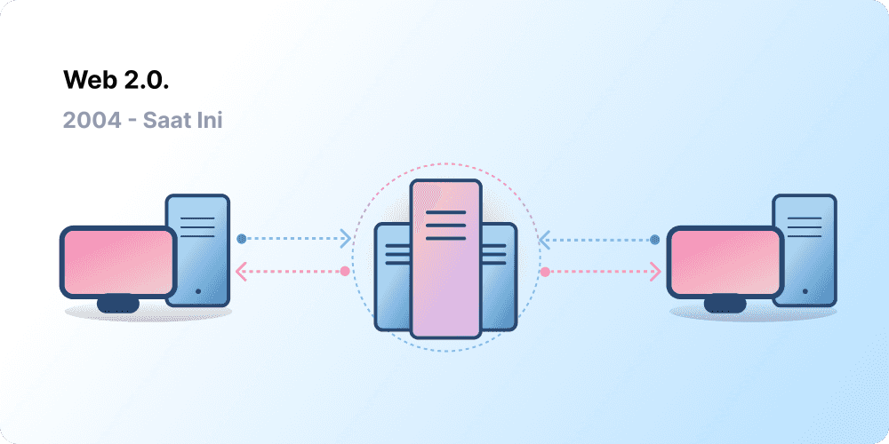
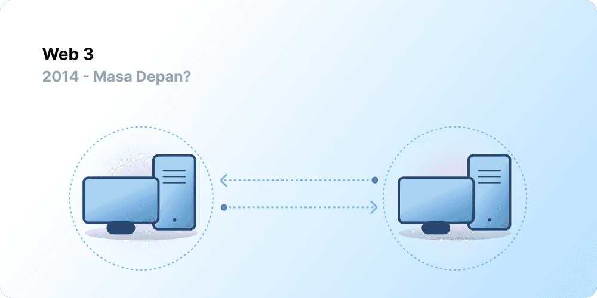

# Pengantar tentang Web3 {#introduction}

<ListenToPlayer slug="/web3/" />

Sentralisasi telah membantu membawa miliaran orang ke World Wide Web dan menciptakan infrastruktur yang stabil dan kuat sebagai tempatnya bernaung. Pada saat yang sama, segelintir entitas terpusat memiliki cengkeraman kuat pada sebagian besar World Wide Web, secara sepihak memutuskan apa yang seharusnya dan tidak seharusnya diizinkan.

Web3 adalah jawaban untuk dilema ini. Alih-alih Web yang dimonopoli oleh perusahaan teknologi besar, Web3 merangkul desentralisasi dan sedang dibangun, dioperasikan, serta dimiliki oleh para penggunanya. Web3 meletakkan kekuasaan di tangan individu, bukan korporasi.
Sebelum kita berbicara tentang Web3, mari kita telusuri bagaimana kita bisa sampai di sini.

<Divider />

## Web awal {#early-internet}

Sebagian besar orang menganggap Web sebagai pilar kehidupan modern yang berkelanjutan—diciptakan dan terus ada sejak saat itu. Namun, Web yang sebagian besar dari kita kenal saat ini cukup berbeda dari yang dibayangkan pada awalnya. Untuk memahaminya dengan lebih baik, akan sangat membantu jika kita membagi sejarah singkat Web ke dalam periode-periode yang longgar—Web 1.0 dan Web 2.0.

### Web 1.0: Hanya-Baca (1990-2004) {#web1}

Pada tahun 1989, di CERN, Jenewa, Tim Berners-Lee sibuk mengembangkan protokol yang akan menjadi World Wide Web. Idenya? Untuk menciptakan protokol terbuka dan terdesentralisasi yang memungkinkan berbagi informasi dari mana saja di Bumi.

Awal mula ciptaan Berners-Lee, yang kini dikenal sebagai 'Web 1.0', terjadi kira-kira antara tahun 1990 hingga 2004. Web 1.0 sebagian besar adalah situs web statis yang dimiliki oleh perusahaan, dan hampir tidak ada interaksi antar pengguna - individu jarang memproduksi konten - sehingga dikenal sebagai web hanya-baca.

### Web 2.0: Baca-Tulis (2004-sekarang) {#web2}

Periode Web 2.0 dimulai pada tahun 2004 dengan munculnya platform media sosial. Alih-alih hanya-baca, web berevolusi menjadi baca-tulis. Alih-alih perusahaan menyediakan konten kepada pengguna, mereka juga mulai menyediakan platform untuk berbagi konten yang dibuat pengguna dan terlibat dalam interaksi antar pengguna. Seiring dengan semakin banyaknya orang yang daring, segelintir perusahaan teratas mulai mengendalikan jumlah lalu lintas dan nilai yang dihasilkan di web secara tidak proporsional. Web 2.0 juga melahirkan model pendapatan yang didorong oleh iklan. Meskipun pengguna dapat membuat konten, mereka tidak memilikinya atau mendapatkan keuntungan dari monetisasinya.

<Divider />

## Web 3.0: Baca-Tulis-Miliki {#web3}

Premis 'Web 3.0' diciptakan oleh salah satu pendiri [Ethereum](/) Gavin Wood tak lama setelah Ethereum diluncurkan pada tahun 2014. Gavin merumuskan solusi untuk masalah yang dirasakan oleh banyak pengadopsi kripto awal: Web membutuhkan terlalu banyak kepercayaan. Artinya, sebagian besar Web yang dikenal dan digunakan orang saat ini bergantung pada kepercayaan terhadap segelintir perusahaan swasta untuk bertindak demi kepentingan terbaik publik.

### Apa itu Web3? {#what-is-web3}

Web3 telah menjadi istilah umum untuk visi internet baru yang lebih baik. Pada intinya, Web3 menggunakan blockchain, mata uang kripto, dan NFT untuk mengembalikan kekuasaan kepada pengguna dalam bentuk kepemilikan. [Sebuah postingan tahun 2020 di Twitter](https://twitter.com/himgajria/status/1266415636789334016) menyatakannya dengan sangat baik: Web1 adalah hanya-baca, Web2 adalah baca-tulis, Web3 akan menjadi baca-tulis-miliki.

#### Ide inti dari Web3 {#core-ideas}

Meskipun menantang untuk memberikan definisi yang kaku tentang apa itu Web3, beberapa prinsip inti memandu penciptaannya.

- **Web3 terdesentralisasi:** alih-alih sebagian besar internet dikendalikan dan dimiliki oleh entitas terpusat, kepemilikan didistribusikan di antara para pembangun dan penggunanya.
- **Web3 tanpa izin:** setiap orang memiliki akses yang sama untuk berpartisipasi dalam Web3, dan tidak ada yang dikecualikan.
- **Web3 memiliki pembayaran asli:** ia menggunakan mata uang kripto untuk membelanjakan dan mengirim uang secara daring alih-alih mengandalkan infrastruktur bank dan pemroses pembayaran yang sudah ketinggalan zaman.
- **Web3 tanpa kepercayaan (trustless):** ia beroperasi menggunakan insentif dan mekanisme ekonomi alih-alih mengandalkan pihak ketiga yang dipercaya.

### Mengapa Web3 penting? {#why-is-web3-important}

Meskipun fitur-fitur andalan Web3 tidak terisolasi dan tidak masuk ke dalam kategori yang rapi, demi kesederhanaan kami telah mencoba memisahkannya agar lebih mudah dipahami.

#### Kepemilikan {#ownership}

Web3 memberi Anda kepemilikan atas aset digital Anda dengan cara yang belum pernah ada sebelumnya. Misalnya, katakanlah Anda sedang memainkan game web2. Jika Anda membeli item di dalam game, item tersebut terikat langsung ke akun Anda. Jika pembuat game menghapus akun Anda, Anda akan kehilangan item-item ini. Atau, jika Anda berhenti memainkan game tersebut, Anda kehilangan nilai yang Anda investasikan ke dalam item di dalam game Anda.

Web3 memungkinkan kepemilikan langsung melalui [non-fungible token (NFT)](/glossary/#nft). Tidak ada seorang pun, bahkan pembuat game sekalipun, yang memiliki kekuasaan untuk mengambil kepemilikan Anda. Dan, jika Anda berhenti bermain, Anda dapat menjual atau memperdagangkan item di dalam game Anda di pasar terbuka dan mendapatkan kembali nilainya. Jelajahi [game onchain](/gaming/) untuk melihat aksinya.

<Alert variant="update">
<AlertEmoji text=":eyes:"/>
<AlertContent className="flex-row items-center justify-between">
  
Pelajari lebih lanjut tentang NFT

  <ButtonLink href="/nft/">
    Lebih lanjut tentang NFT
  </ButtonLink>
</AlertContent>
</Alert>

#### Ketahanan terhadap sensor {#censorship-resistance}

Dinamika kekuasaan antara platform dan pembuat konten sangat tidak seimbang.

OnlyFans adalah situs konten dewasa yang dibuat pengguna dengan lebih dari 1 juta pembuat konten, banyak di antaranya menggunakan platform ini sebagai sumber pendapatan utama mereka. Pada bulan Agustus 2021, OnlyFans mengumumkan rencana untuk melarang konten seksual eksplisit. Pengumuman tersebut memicu kemarahan di antara para pembuat konten di platform tersebut, yang merasa mereka dirampok pendapatannya di platform yang mereka bantu ciptakan. Setelah mendapat reaksi keras, keputusan tersebut dengan cepat dibatalkan. Meskipun para pembuat konten memenangkan pertempuran ini, hal ini menyoroti masalah bagi pembuat konten Web 2.0: Anda kehilangan reputasi dan pengikut yang Anda kumpulkan jika Anda meninggalkan sebuah platform.

Di Web3, data Anda hidup di blockchain. Ketika Anda memutuskan untuk meninggalkan sebuah platform, Anda dapat membawa reputasi Anda, menyambungkannya ke antarmuka lain yang lebih selaras dengan nilai-nilai Anda.

Web 2.0 mengharuskan pembuat konten untuk memercayai platform agar tidak mengubah aturan, tetapi ketahanan terhadap sensor adalah fitur asli dari platform Web3.

#### Organisasi otonom terdesentralisasi (DAO) {#daos}

Selain memiliki data Anda di Web3, Anda dapat memiliki platform sebagai sebuah kolektif, menggunakan token yang bertindak seperti saham di sebuah perusahaan. DAO memungkinkan Anda mengoordinasikan kepemilikan terdesentralisasi dari sebuah platform dan membuat keputusan tentang masa depannya.

DAO didefinisikan secara teknis sebagai [kontrak pintar](/glossary/#smart-contract) yang disepakati yang mengotomatiskan pengambilan keputusan terdesentralisasi atas sekumpulan sumber daya (token). Pengguna dengan token memberikan suara tentang bagaimana sumber daya dihabiskan, dan kode secara otomatis menjalankan hasil pemungutan suara tersebut.

Namun, orang-orang mendefinisikan banyak komunitas Web3 sebagai DAO. Komunitas-komunitas ini semuanya memiliki tingkat desentralisasi dan otomatisasi oleh kode yang berbeda. Saat ini, kami sedang mengeksplorasi apa itu DAO dan bagaimana mereka mungkin berevolusi di masa depan.

<Alert variant="update">
<AlertEmoji text=":eyes:"/>
<AlertContent className="flex-row items-center justify-between">
  
Pelajari lebih lanjut tentang DAO

  <ButtonLink href="/dao/">
    Lebih lanjut tentang DAO
  </ButtonLink>
</AlertContent>
</Alert>

### Identitas {#identity}

Secara tradisional, Anda akan membuat akun untuk setiap platform yang Anda gunakan. Misalnya, Anda mungkin memiliki akun Twitter, akun YouTube, dan akun Reddit. Ingin mengubah nama tampilan atau gambar profil Anda? Anda harus melakukannya di setiap akun. Anda dapat menggunakan proses masuk sosial dalam beberapa kasus, tetapi ini menghadirkan masalah yang sudah dikenal—sensor. Dalam satu klik, platform-platform ini dapat mengunci Anda dari seluruh kehidupan daring Anda. Lebih buruk lagi, banyak platform mengharuskan Anda untuk memercayai mereka dengan informasi identitas pribadi untuk membuat akun.

Web3 memecahkan masalah ini dengan memungkinkan Anda mengontrol identitas digital Anda dengan alamat Ethereum dan profil [Ethereum Name Service (ENS)](/glossary/#ens). Menggunakan alamat Ethereum menyediakan proses masuk tunggal di seluruh platform yang aman, tahan sensor, dan anonim.

### Pembayaran asli {#native-payments}

Infrastruktur pembayaran Web2 bergantung pada bank dan pemroses pembayaran, mengecualikan orang-orang tanpa akun bank atau mereka yang kebetulan tinggal di dalam perbatasan negara yang salah.
Web3 menggunakan token seperti [ETH](/glossary/#ether) untuk mengirim uang secara langsung di peramban dan tidak memerlukan pihak ketiga yang dipercaya.

<ButtonLink href="/eth/">
  Lebih lanjut tentang ETH
</ButtonLink>

## Keterbatasan Web3 {#web3-limitations}

Meskipun banyak manfaat Web3 dalam bentuknya saat ini, masih ada banyak keterbatasan yang harus diatasi oleh ekosistem agar dapat berkembang.

### Aksesibilitas {#accessibility}

Fitur-fitur penting Web3, seperti Masuk dengan Ethereum, sudah tersedia untuk digunakan siapa saja tanpa biaya. Namun, biaya transaksi relatif masih sangat mahal bagi banyak orang. Web3 lebih kecil kemungkinannya untuk dimanfaatkan di negara-negara berkembang yang kurang makmur karena biaya transaksi yang tinggi. Di Ethereum, tantangan-tantangan ini sedang diselesaikan melalui [peta jalan](/roadmap/) dan [solusi peningkatan layer 2](/glossary/#layer-2). Teknologinya sudah siap, tetapi kita membutuhkan tingkat adopsi yang lebih tinggi pada layer 2 untuk membuat Web3 dapat diakses oleh semua orang.

### Pengalaman pengguna {#user-experience}

Hambatan teknis untuk masuk menggunakan Web3 saat ini terlalu tinggi. Pengguna harus memahami masalah keamanan, memahami dokumentasi teknis yang kompleks, dan menavigasi antarmuka pengguna yang tidak intuitif. [Penyedia dompet](/wallets/find-wallet/), khususnya, sedang berupaya untuk menyelesaikan ini, tetapi lebih banyak kemajuan diperlukan sebelum Web3 diadopsi secara massal.

### Edukasi {#education}

Web3 memperkenalkan paradigma baru yang membutuhkan pembelajaran model mental yang berbeda dari yang digunakan di Web 2.0. Dorongan edukasi serupa terjadi ketika Web 1.0 mendapatkan popularitas di akhir tahun 1990-an; para pendukung world wide web menggunakan serangkaian teknik edukasi untuk mendidik publik mulai dari metafora sederhana (jalan raya informasi, peramban, berselancar di web) hingga [siaran televisi](https://www.youtube.com/watch?v=SzQLI7BxfYI). Web3 tidaklah sulit, tetapi berbeda. Inisiatif edukasi yang menginformasikan pengguna Web2 tentang paradigma Web3 ini sangat penting untuk keberhasilannya.

Ethereum.org berkontribusi pada edukasi Web3 melalui [Program Terjemahan](/contributing/translation-program/) kami, yang bertujuan untuk menerjemahkan konten penting Ethereum ke sebanyak mungkin bahasa.

### Infrastruktur terpusat {#centralized-infrastructure}

Ekosistem Web3 masih muda dan berkembang dengan cepat. Akibatnya, saat ini ia bergantung terutama pada infrastruktur terpusat (GitHub, Twitter, Discord, dll.). Banyak perusahaan Web3 bergegas untuk mengisi celah ini, tetapi membangun infrastruktur yang berkualitas tinggi dan andal membutuhkan waktu.

## Masa depan yang terdesentralisasi {#decentralized-future}

Web3 adalah ekosistem yang masih muda dan terus berkembang. Gavin Wood menciptakan istilah ini pada tahun 2014, tetapi banyak dari ide-ide ini baru saja menjadi kenyataan. Pada tahun lalu saja, telah terjadi lonjakan minat yang cukup besar terhadap mata uang kripto, perbaikan pada solusi peningkatan layer 2, eksperimen besar-besaran dengan bentuk tata kelola baru, dan revolusi dalam identitas digital.

Kita baru berada di awal penciptaan Web yang lebih baik dengan Web3, tetapi seiring kita terus meningkatkan infrastruktur yang akan mendukungnya, masa depan Web terlihat cerah.

## Bagaimana saya bisa terlibat {#get-involved}

- [Dapatkan dompet](/wallets/)
- [Temukan komunitas](/community/)
- [Jelajahi aplikasi Web3](/apps/)
- [Bergabung dengan DAO](/dao/)
- [Membangun di Web3](/developers/)

## Bacaan lebih lanjut {#further-reading}

Web3 tidak didefinisikan secara kaku. Berbagai peserta komunitas memiliki perspektif yang berbeda tentang hal itu. Berikut adalah beberapa di antaranya:

- [What is Web3? The Decentralized Internet of the Future Explained](https://www.freecodecamp.org/news/what-is-web3) – _Nader Dabit_
- [Making Sense of Web 3](https://medium.com/l4-media/making-sense-of-web-3-c1a9e74dcae) – _Josh Stark_
- [Why Web3 Matters](https://a16zcrypto.com/posts/article/why-web3-matters/) — _Chris Dixon_
- [Why Decentralization Matters](https://onezero.medium.com/why-decentralization-matters-5e3f79f7638e) - _Chris Dixon_
- [The Web3 Landscape](https://a16z.com/wp-content/uploads/2021/10/The-web3-Readlng-List.pdf) – _a16z_
- [The Web3 Debate](https://www.notboring.co/p/the-web3-debate) – _Packy McCormick_

<QuizWidget quizKey="web3" />