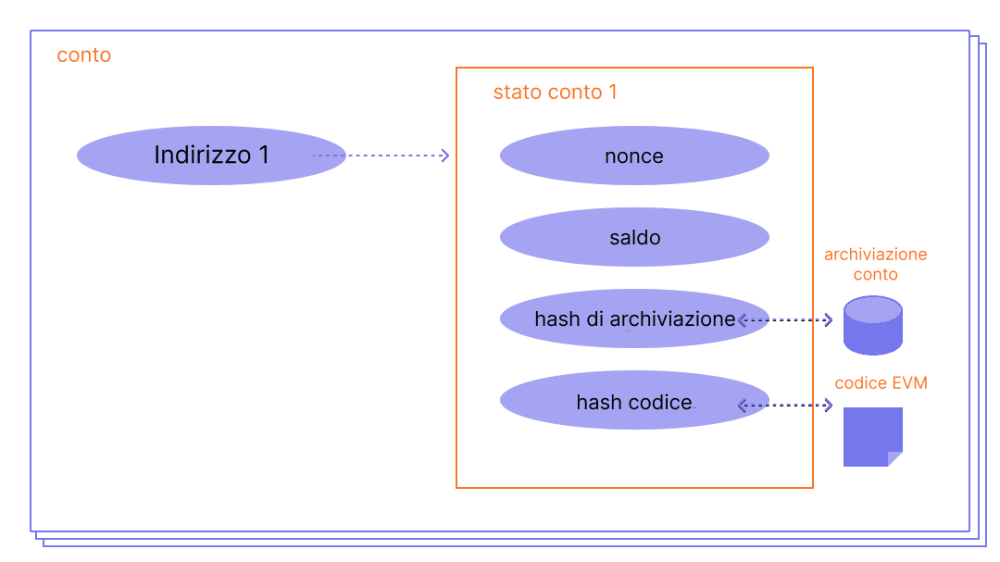

Un account di [Ethereum](/) è un'entità con un saldo in ether (ETH) che può inviare messaggi su Ethereum. Gli account possono essere controllati dagli utenti o distribuiti come contratti intelligenti.

## Prerequisiti {#prerequisites}

Per aiutarti a comprendere meglio questa pagina, ti consigliamo di leggere prima la nostra [introduzione a Ethereum](/developers/docs/intro-to-ethereum/).

## Tipi di account {#types-of-account}

Ethereum ha due tipi di account:

- Account controllato esternamente (EOA) – controllato da chiunque possieda le chiavi private
- Account di contratto – un contratto intelligente distribuito sulla rete, controllato dal codice. Scopri di più sui [contratti intelligenti](/developers/docs/smart-contracts/)

Entrambi i tipi di account hanno la capacità di:

- Ricevere, detenere e inviare ETH e token
- Interagire con i contratti intelligenti distribuiti

### Differenze chiave {#key-differences}

**Controllato esternamente**

- La creazione di un account non costa nulla
- Può avviare transazioni
- Le transazioni tra account controllati esternamente possono essere solo trasferimenti di ETH/token
- Composto da una coppia di chiavi crittografiche: chiavi pubbliche e private che controllano le attività dell'account

**Di contratto**

- La creazione di un contratto ha un costo perché si utilizza l'archiviazione della rete
- Può inviare messaggi solo in risposta alla ricezione di una transazione
- Le transazioni da un account esterno a un account di contratto possono attivare codice che può eseguire molte azioni diverse, come il trasferimento di token o persino la creazione di un nuovo contratto
- Gli account di contratto non hanno chiavi private. Sono invece controllati dalla logica del codice del contratto intelligente

## Esame di un account {#an-account-examined}

Gli account di Ethereum hanno quattro campi:

- `nonce` – Un contatore che indica il numero di transazioni inviate da un account controllato esternamente o il numero di contratti creati da un account di contratto. Solo una transazione con un dato nonce può essere eseguita per ogni account, proteggendo dagli attacchi di replay in cui le transazioni firmate vengono ripetutamente trasmesse e rieseguite.
- `balance` – Il numero di wei posseduti da questo indirizzo. Il wei è una denominazione di ETH e ci sono 1e+18 wei per ETH.
- `codeHash` – Questo hash si riferisce al _codice_ di un account sulla macchina virtuale di Ethereum (EVM). Gli account di contratto hanno frammenti di codice programmati al loro interno che possono eseguire diverse operazioni. Questo codice EVM viene eseguito se l'account riceve una chiamata di messaggio. Non può essere modificato, a differenza degli altri campi dell'account. Tutti questi frammenti di codice sono contenuti nel database di stato sotto i loro hash corrispondenti per un recupero successivo. Questo valore hash è noto come codeHash. Per gli account controllati esternamente, il campo codeHash è l'hash di una stringa vuota.
- `storageRoot` – A volte noto come hash di archiviazione. Un hash a 256 bit del nodo radice di un [Merkle Patricia Trie](/developers/docs/data-structures-and-encoding/patricia-merkle-trie/) che codifica i contenuti di archiviazione dell'account (una mappatura tra valori interi a 256 bit), codificato nel trie come una mappatura dall'hash Keccak a 256 bit delle chiavi intere a 256 bit ai valori interi a 256 bit codificati in RLP. Questo trie codifica l'hash dei contenuti di archiviazione di questo account ed è vuoto per impostazione predefinita.


_Diagramma adattato da [Ethereum EVM illustrated](https://takenobu-hs.github.io/downloads/ethereum_evm_illustrated.pdf)_

## Account controllati esternamente e coppie di chiavi {#externally-owned-accounts-and-key-pairs}

Un account è composto da una coppia di chiavi crittografiche: pubblica e privata. Aiutano a dimostrare che una transazione è stata effettivamente firmata dal mittente e prevengono le falsificazioni. La tua chiave privata è ciò che usi per firmare le transazioni, quindi ti garantisce la custodia dei fondi associati al tuo account. Non possiedi mai veramente criptovaluta, possiedi chiavi private: i fondi sono sempre sul registro di Ethereum.

Questo impedisce ad attori malintenzionati di trasmettere transazioni false perché puoi sempre verificare il mittente di una transazione.

Se Alice vuole inviare ether dal proprio account all'account di Bob, Alice deve creare una richiesta di transazione e inviarla alla rete per la verifica. L'uso della crittografia a chiave pubblica da parte di Ethereum garantisce che Alice possa dimostrare di aver originariamente avviato la richiesta di transazione. Senza meccanismi crittografici, un avversario malintenzionato, Eve, potrebbe semplicemente trasmettere pubblicamente una richiesta simile a "invia 5 ETH dall'account di Alice all'account di Eve" e nessuno sarebbe in grado di verificare che non provenga da Alice.

## Creazione dell'account {#account-creation}

Quando desideri creare un account, la maggior parte delle librerie genererà per te una chiave privata casuale.

Una chiave privata è composta da 64 caratteri esadecimali e può essere crittografata con una password.

Esempio:

`fffffffffffffffffffffffffffffffebaaedce6af48a03bbfd25e8cd036415f`

La chiave pubblica viene generata dalla chiave privata utilizzando l'[Algoritmo per la Firma Digitale a Curva Ellittica](https://wikipedia.org/wiki/Elliptic_Curve_Digital_Signature_Algorithm). Ottieni un indirizzo pubblico per il tuo account prendendo gli ultimi 20 byte dell'hash Keccak-256 della chiave pubblica e aggiungendo `0x` all'inizio.

Ciò significa che un account controllato esternamente (EOA) ha un indirizzo di 42 caratteri (segmento di 20 byte che corrisponde a 40 caratteri esadecimali più il prefisso `0x`).

Esempio:

`0x5e97870f263700f46aa00d967821199b9bc5a120`

L'esempio seguente mostra come utilizzare uno strumento di firma chiamato [Clef](https://geth.ethereum.org/docs/tools/clef/introduction) per generare un nuovo account. Clef è uno strumento di gestione e firma degli account fornito in bundle con il client di Ethereum, [Geth](https://geth.ethereum.org). Il comando `clef newaccount` crea una nuova coppia di chiavi e le salva in un keystore crittografato.

```
> clef newaccount --keystore <path>

Please enter a password for the new account to be created:
> <password>

------------
INFO [10-28|16:19:09.156] Your new key was generated       address=0x5e97870f263700f46aa00d967821199b9bc5a120
WARN [10-28|16:19:09.306] Please backup your key file      path=/home/user/go-ethereum/data/keystore/UTC--2022-10-28T15-19-08.000825927Z--5e97870f263700f46aa00d967821199b9bc5a120
WARN [10-28|16:19:09.306] Please remember your password!
Generated account 0x5e97870f263700f46aa00d967821199b9bc5a120
```

[Documentazione di Geth](https://geth.ethereum.org/docs)

È possibile derivare nuove chiavi pubbliche dalla tua chiave privata, ma non puoi derivare una chiave privata dalle chiavi pubbliche. È vitale mantenere le tue chiavi private al sicuro e, come suggerisce il nome, **PRIVATE**.

Hai bisogno di una chiave privata per firmare messaggi e transazioni che producono una firma. Altri possono quindi prendere la firma per derivare la tua chiave pubblica, dimostrando l'autore del messaggio. Nella tua applicazione, puoi utilizzare una libreria JavaScript per inviare transazioni alla rete.

## Account di contratto {#contract-accounts}

Anche gli account di contratto hanno un indirizzo esadecimale di 42 caratteri:

Esempio:

`0x06012c8cf97bead5deae237070f9587f8e7a266d`

L'indirizzo del contratto viene solitamente fornito quando un contratto viene distribuito sulla blockchain di Ethereum. L'indirizzo deriva dall'indirizzo del creatore e dal numero di transazioni inviate da quell'indirizzo (il "nonce").

## Chiavi dei validatori {#validators-keys}

C'è anche un altro tipo di chiave in Ethereum, introdotto quando Ethereum è passato dal consenso basato sulla prova di lavoro alla prova di stake. Queste sono le chiavi 'BLS' e vengono utilizzate per identificare i validatori. Queste chiavi possono essere aggregate in modo efficiente per ridurre la larghezza di banda richiesta alla rete per raggiungere il consenso. Senza questa aggregazione di chiavi, lo stake minimo per un validatore sarebbe molto più alto.

[Maggiori informazioni sulle chiavi dei validatori](/developers/docs/consensus-mechanisms/pos/keys/).

## Una nota sui portafogli {#a-note-on-wallets}

Un account non è un portafoglio. Un portafoglio è un'interfaccia o un'applicazione che ti consente di interagire con il tuo account di Ethereum, che sia un account controllato esternamente o un account di contratto.

## Una demo visiva {#a-visual-demo}

Guarda Austin guidarti attraverso le funzioni di hash e le coppie di chiavi.

<YouTube id="QJ010l-pBpE" />

<YouTube id="9LtBDy67Tho" />

## Letture di approfondimento {#further-reading}

- [Comprendere gli account di Ethereum](https://info.etherscan.com/understanding-ethereum-accounts/) - etherscan

_Conosci una risorsa della community che ti è stata utile? Modifica questa pagina e aggiungila!_

## Argomenti correlati {#related-topics}

- [Contratti intelligenti](/developers/docs/smart-contracts/)
- [Transazioni](/developers/docs/transactions/)