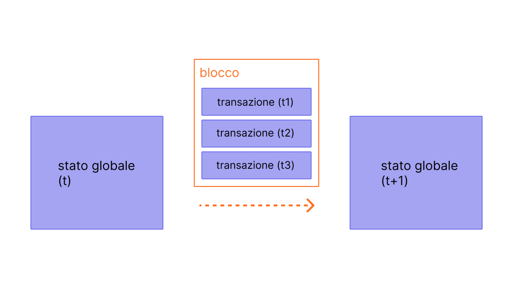

I blocchi sono lotti di transazioni con un hash del blocco precedente nella catena. Questo collega i blocchi insieme (in una catena) perché gli hash sono derivati crittograficamente dai dati del blocco. Ciò previene le frodi, perché una modifica in qualsiasi blocco nella storia invaliderebbe tutti i blocchi successivi, poiché tutti gli hash successivi cambierebbero e chiunque esegua la blockchain se ne accorgerebbe.

## Prerequisiti {#prerequisites}

I blocchi sono un argomento molto accessibile ai principianti. Ma per aiutarti a comprendere meglio questa pagina, ti consigliamo di leggere prima [Account](/developers/docs/accounts/), [Transazioni](/developers/docs/transactions/) e la nostra [introduzione a Ethereum](/developers/docs/intro-to-ethereum/).

## Perché i blocchi? {#why-blocks}

Per garantire che tutti i partecipanti sulla rete [Ethereum](/) mantengano uno stato sincronizzato e concordino sulla cronologia precisa delle transazioni, raggruppiamo le transazioni in blocchi. Ciò significa che dozzine (o centinaia) di transazioni vengono confermate, concordate e sincronizzate tutte in una volta.

_Diagramma adattato da [Ethereum EVM illustrated](https://takenobu-hs.github.io/downloads/ethereum_evm_illustrated.pdf)_

Distanziando le conferme, diamo a tutti i partecipanti della rete abbastanza tempo per raggiungere il consenso: anche se le richieste di transazione si verificano dozzine di volte al secondo, i blocchi vengono creati e confermati su Ethereum solo una volta ogni dodici secondi.

## Come funzionano i blocchi {#how-blocks-work}

Per preservare la cronologia delle transazioni, i blocchi sono rigorosamente ordinati (ogni nuovo blocco creato contiene un riferimento al suo blocco genitore) e anche le transazioni all'interno dei blocchi sono rigorosamente ordinate. Tranne in rari casi, in qualsiasi momento, tutti i partecipanti sulla rete concordano sul numero esatto e sulla cronologia dei blocchi e stanno lavorando per raggruppare le attuali richieste di transazione in tempo reale nel blocco successivo.

Una volta che un blocco viene assemblato da un validatore selezionato casualmente sulla rete, viene propagato al resto della rete; tutti i nodi aggiungono questo blocco alla fine della loro blockchain e un nuovo validatore viene selezionato per creare il blocco successivo. L'esatto processo di assemblaggio dei blocchi e il processo di conferma/consenso sono attualmente specificati dal protocollo "prova di stake" di Ethereum.

## Protocollo di prova di stake {#proof-of-stake-protocol}

La prova di stake significa quanto segue:

- I nodi di validazione devono mettere in stake 32 ETH in un contratto di deposito come garanzia contro comportamenti scorretti. Questo aiuta a proteggere la rete perché un'attività palesemente disonesta porta alla distruzione di parte o di tutto quello stake.
- In ogni slot (distanziati di dodici secondi l'uno dall'altro) un validatore viene selezionato casualmente per essere il proponente del blocco. Raggruppa le transazioni, le esegue e determina un nuovo 'stato'. Racchiude queste informazioni in un blocco e lo trasmette agli altri validatori.
- Gli altri validatori che vengono a conoscenza del nuovo blocco rieseguono le transazioni per assicurarsi di concordare con la modifica proposta allo stato globale. Supponendo che il blocco sia valido, lo aggiungono al proprio database.
- Se un validatore viene a conoscenza di due blocchi in conflitto per lo stesso slot, utilizza il proprio algoritmo di scelta della biforcazione per scegliere quello supportato dalla maggior quantità di ETH in stake.

[Maggiori informazioni sulla prova di stake](/developers/docs/consensus-mechanisms/pos)

## Cosa c'è in un blocco? {#block-anatomy}

Ci sono molte informazioni contenute all'interno di un blocco. Al livello più alto, un blocco contiene i seguenti campi:

| Campo            | Descrizione                                           |
| :--------------- | :---------------------------------------------------- |
| `slot`           | lo slot a cui appartiene il blocco                    |
| `proposer_index` | l'ID del validatore che propone il blocco             |
| `parent_root`    | l'hash del blocco precedente                          |
| `state_root`     | l'hash radice dell'oggetto di stato                   |
| `body`           | un oggetto contenente diversi campi, come definito di seguito |

Il `body` del blocco contiene a sua volta diversi campi:

| Campo                | Descrizione                                      |
| :------------------- | :----------------------------------------------- |
| `randao_reveal`      | un valore utilizzato per selezionare il prossimo proponente del blocco |
| `eth1_data`          | informazioni sul contratto di deposito           |
| `graffiti`           | dati arbitrari utilizzati per etichettare i blocchi |
| `proposer_slashings` | elenco di validatori da punire                   |
| `attester_slashings` | elenco di attestatori da punire                  |
| `attestations`       | elenco di attestazioni fatte contro gli slot precedenti |
| `deposits`           | elenco di nuovi depositi al contratto di deposito |
| `voluntary_exits`    | elenco di validatori che escono dalla rete       |
| `sync_aggregate`     | sottoinsieme di validatori utilizzati per servire i client leggeri |
| `execution_payload`  | transazioni passate dal client di esecuzione     |

Il campo `attestations` contiene un elenco di tutte le attestazioni nel blocco. Le attestazioni hanno il proprio tipo di dati che contiene diverse informazioni. Ogni attestazione contiene:

| Campo              | Descrizione                                                    |
| :----------------- | :------------------------------------------------------------- |
| `aggregation_bits` | un elenco di quali validatori hanno partecipato a questa attestazione |
| `data`             | un contenitore con più sottocampi                              |
| `signature`        | firma aggregata di un insieme di validatori rispetto alla parte `data` |

Il campo `data` nell'`attestation` contiene quanto segue:

| Campo               | Descrizione                                                     |
| :------------------ | :-------------------------------------------------------------- |
| `slot`              | lo slot a cui si riferisce l'attestazione                       |
| `index`             | indici per i validatori attestanti                              |
| `beacon_block_root` | l'hash radice del blocco della beacon chain visto come testa della catena |
| `source`            | l'ultimo checkpoint giustificato                                |
| `target`            | l'ultimo blocco di confine dell'epoca                           |

L'esecuzione delle transazioni nell'`execution_payload` aggiorna lo stato globale. Tutti i client rieseguono le transazioni nell'`execution_payload` per assicurarsi che il nuovo stato corrisponda a quello nel campo `state_root` del nuovo blocco. È così che i client possono stabilire che un nuovo blocco è valido e sicuro da aggiungere alla loro blockchain. L'`execution payload` stesso è un oggetto con diversi campi. C'è anche un `execution_payload_header` che contiene importanti informazioni riassuntive sui dati di esecuzione. Queste strutture di dati sono organizzate come segue:

L'`execution_payload_header` contiene i seguenti campi:

| Campo               | Descrizione                                                         |
| :------------------ | :------------------------------------------------------------------ |
| `parent_hash`       | hash del blocco genitore                                            |
| `fee_recipient`     | indirizzo dell'account a cui pagare le commissioni della transazione |
| `state_root`        | hash radice per lo stato globale dopo aver applicato le modifiche in questo blocco |
| `receipts_root`     | hash del trie delle ricevute delle transazioni                      |
| `logs_bloom`        | struttura dati contenente i log degli eventi                        |
| `prev_randao`       | valore utilizzato nella selezione casuale dei validatori            |
| `block_number`      | il numero del blocco corrente                                       |
| `gas_limit`         | limite del gas massimo consentito in questo blocco                  |
| `gas_used`          | la quantità effettiva di gas utilizzata in questo blocco            |
| `timestamp`         | il tempo del blocco                                                 |
| `extra_data`        | dati aggiuntivi arbitrari come byte grezzi                          |
| `base_fee_per_gas`  | il valore della commissione di base                                 |
| `block_hash`        | Hash del blocco di esecuzione                                       |
| `transactions_root` | hash radice delle transazioni nel payload                           |
| `withdrawal_root`   | hash radice dei prelievi nel payload                                |

L'`execution_payload` stesso contiene quanto segue (nota che questo è identico all'intestazione tranne per il fatto che invece dell'hash radice delle transazioni include l'elenco effettivo delle transazioni e le informazioni sui prelievi):

| Campo              | Descrizione                                                         |
| :----------------- | :------------------------------------------------------------------ |
| `parent_hash`      | hash del blocco genitore                                            |
| `fee_recipient`    | indirizzo dell'account a cui pagare le commissioni della transazione |
| `state_root`       | hash radice per lo stato globale dopo aver applicato le modifiche in questo blocco |
| `receipts_root`    | hash del trie delle ricevute delle transazioni                      |
| `logs_bloom`       | struttura dati contenente i log degli eventi                        |
| `prev_randao`      | valore utilizzato nella selezione casuale dei validatori            |
| `block_number`     | il numero del blocco corrente                                       |
| `gas_limit`        | limite del gas massimo consentito in questo blocco                  |
| `gas_used`         | la quantità effettiva di gas utilizzata in questo blocco            |
| `timestamp`        | il tempo del blocco                                                 |
| `extra_data`       | dati aggiuntivi arbitrari come byte grezzi                          |
| `base_fee_per_gas` | il valore della commissione di base                                 |
| `block_hash`       | Hash del blocco di esecuzione                                       |
| `transactions`     | elenco di transazioni da eseguire                                   |
| `withdrawals`      | elenco di oggetti di prelievo                                       |

L'elenco `withdrawals` contiene oggetti `withdrawal` strutturati nel seguente modo:

| Campo            | Descrizione                        |
| :--------------- | :--------------------------------- |
| `address`        | indirizzo dell'account che ha prelevato |
| `amount`         | importo del prelievo               |
| `index`          | valore dell'indice di prelievo     |
| `validatorIndex` | valore dell'indice del validatore  |

## Tempo di blocco {#block-time}

Il tempo di blocco si riferisce al tempo che separa i blocchi. In Ethereum, il tempo è diviso in unità di dodici secondi chiamate 'slot'. In ogni slot viene selezionato un singolo validatore per proporre un blocco. Supponendo che tutti i validatori siano online e perfettamente funzionanti, ci sarà un blocco in ogni slot, il che significa che il tempo di blocco è di 12s. Tuttavia, occasionalmente i validatori potrebbero essere offline quando chiamati a proporre un blocco, il che significa che gli slot a volte possono rimanere vuoti.

Questa implementazione differisce dai sistemi basati sulla prova di lavoro in cui i tempi di blocco sono probabilistici e regolati dalla difficoltà di mining target del protocollo. Il [tempo medio di blocco](https://etherscan.io/chart/blocktime) di Ethereum è un perfetto esempio di ciò, in cui la transizione dalla prova di lavoro alla prova di stake può essere chiaramente dedotta in base alla coerenza del nuovo tempo di blocco di 12s.

## Dimensione del blocco {#block-size}

Un'ultima nota importante è che i blocchi stessi hanno dimensioni limitate. Ogni blocco ha una dimensione target di 30 milioni di gas, ma la dimensione dei blocchi aumenterà o diminuirà in base alle richieste della rete, fino al limite del gas del blocco di 60 milioni di gas (2 volte la dimensione target del blocco). Il limite del gas del blocco può essere regolato verso l'alto o verso il basso di un fattore di 1/1024 rispetto al limite del gas del blocco precedente. Di conseguenza, i validatori possono modificare il limite del gas del blocco attraverso il consenso. La quantità totale di gas spesa da tutte le transazioni nel blocco deve essere inferiore al limite del gas del blocco. Questo è importante perché garantisce che i blocchi non possano essere arbitrariamente grandi. Se i blocchi potessero essere arbitrariamente grandi, i nodi completi meno performanti smetterebbero gradualmente di essere in grado di tenere il passo con la rete a causa dei requisiti di spazio e velocità. Più grande è il blocco, maggiore è la potenza di calcolo richiesta per elaborarli in tempo per lo slot successivo. Questa è una forza centralizzante, a cui si resiste limitando le dimensioni dei blocchi.

## Letture consigliate {#further-reading}

_Conosci una risorsa della community che ti è stata utile? Modifica questa pagina e aggiungila!_

## Argomenti correlati {#related-topics}

- [Transazioni](/developers/docs/transactions/)
- [Gas](/developers/docs/gas/)
- [Prova di stake](/developers/docs/consensus-mechanisms/pos)