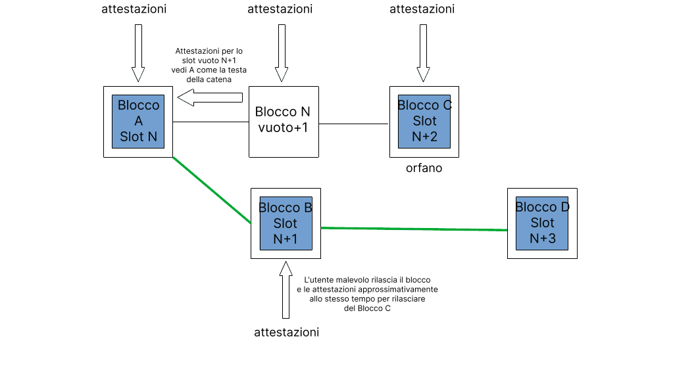

Ladri e sabotatori sono costantemente alla ricerca di opportunità per attaccare i software client di Ethereum. Questa pagina illustra i vettori di attacco noti sul livello del consenso di Ethereum e come è possibile difendersi da tali attacchi. Il contenuto di questa pagina è adattato da una [versione più lunga](https://mirror.xyz/jmcook.eth/YqHargbVWVNRQqQpVpzrqEQ8IqwNUJDIpwRP7SS5FXs).

## Prerequisiti {#prerequisites}

Sono necessarie conoscenze minime sul [proof-of-stake](/developers/docs/consensus-mechanisms/pos/). Sarà inoltre utile possedere una comprensione basilare del [livello di incentivo](/developers/docs/consensus-mechanisms/pos/rewards-and-penalties) di Ethereum, nonché dell'algoritmo di scelta della biforcazione, [LMD-GHOST](/developers/docs/consensus-mechanisms/pos/gasper).

## Cosa vogliono gli utenti malevoli? {#what-do-attackers-want}

Spesso si crede erroneamente che, in caso di successo, un utente malevolo possa generare nuovo ether o drenarlo da qualsiasi conto desideri. Nessuna delle due cose è possibile, poiché tutte le transazioni sono eseguite da tutti i client di esecuzione sulla rete. Se non soddisfano le condizioni di validità di base (es. sono firmate dalla chiave privata del mittente, il mittente ha un saldo sufficiente ecc.) vengono semplicemente annullate. Esistono tre classi di risultati a cui un utente malevolo può realisticamente mirare: riorganizzazioni, doppia finalità o ritardo di finalità.

Una **"riorganizzazione"** è un rimescolamento dei blocchi in un nuovo ordine, a volte con l'aggiunta o sottrazione di blocchi nella catena canonica. Una riorganizzazione malevola può portare all'inclusione o esclusione di blocchi specifici, consentendo una doppia spesa o l'estrazione di valore da transazioni di front-running e back-running (MEV). Le riorganizzazioni, inoltre, possono essere utilizzate per impedire l'inclusione di determinate transazioni nella catena canonica: una forma di censura. La forma più estrema di riorganizzazione è detta "inversione di finalità", che rimuove o sostituisce dei blocchi precedentemente finalizzati. Essa è possibile soltanto se più di ⅓ dell'ether totale in staking è distrutto dall'utente malevolo; questa garanzia è detta "finalità economica" (argomento che affronteremo in maggior dettaglio più avanti).

La **doppia finalità** è l'improbabile ma grave situazione in cui due biforcazioni riescano a finalizzarsi simultaneamente, creando uno scisma permanente nella catena. Ciò è teoricamente possibile per un utente malevolo disposto a rischiare il 34% dell'ether totale in staking. La community sarebbe costretta a coordinarsi fuori dalla catena e ad accordarsi su quale catena seguire, il che richiederebbe forza al livello sociale.

Un attacco di **ritardo di finalità** impedisce alla rete di raggiungere le condizioni necessarie per finalizzare le sezioni della catena. Senza finalità è difficile fidarsi delle applicazioni finanziarie basate su Ethereum. L'obiettivo di un attacco di ritardo di finalità è in genere semplicemente quello di compromettere il corretto funzionamento di Ethereum piuttosto che di trarne direttamente profitto, a meno che l'utente malevolo non detenga qualche posizione corta strategica.

Un attacco al livello sociale potrebbe mirare a minare la fiducia pubblica in Ethereum, svalutare l'ether, ridurne l'adozione o indebolire la community di Ethereum per rendere più difficile il coordinamento fuori banda.

Abbiamo dunque visto perché un utente malevolo potrebbe attaccare Ethereum; le sezioni seguenti esaminano _come_ potrebbero farlo.

## Metodi di attacco {#methods-of-attack}

### Attacchi al livello 0 {#layer-0}

Innanzitutto chi non partecipa attivamente a Ethereum (eseguendo un software client) può attaccarlo prendendo di mira il livello sociale (livello 0). Il livello 0 è la base su cui è costruito Ethereum e, come tale, rappresenta una potenziale superficie per gli attacchi, con conseguenze che si propagano sul resto dello stack. Alcuni esempi potrebbero includere:

- Una campagna di disinformazione in grado di erodere la fiducia della community nella tabella di marcia di Ethereum, nei team di sviluppatori, nelle app ecc. Questo potrebbe ridurre il numero di persone desiderose di partecipare alla protezione della rete, peggiorando sia la decentralizzazione che la sicurezza cripto-economica.

- Attacchi mirati e/o intimidazioni dirette alla community degli sviluppatori. Questo potrebbe indurre all'uscita volontaria degli sviluppatori e rallentare il progresso di Ethereum.

- Anche una regolamentazione troppo rigida può essere considerata un attacco al livello 0, dal momento che potrebbe disincentivare rapidamente la partecipazione e l'adozione.

- L'infiltrazione di utenti esperti ma malevoli nella community di sviluppatori il cui obiettivo è rallentare il progresso con discussioni futili, ritardare le decisioni fondamentali, creare spam ecc.

- Tangenti agli attori principali nell'ecosistema di Ethereum per influenzare il processo decisionale.

Ciò che rende particolarmente pericolosi questi attacchi è che in molti casi è necessario disporre di pochissimo capitale o conoscenze tecniche. Un attacco al livello 0 potrebbe essere un moltiplicatore di un attacco cripto-economico. Ad esempio, se la censura o l'inversione di finalità fossero ottenute da uno stakeholder di maggioranza malevolo, minare il livello sociale potrebbe rendere più difficile il coordinamento di una risposta fuori banda da parte della community.

Difendersi dagli attacchi al livello 0 probabilmente non è semplice, ma possono essere stabiliti dei principi fondamentali. Uno di questi è mantenere un rapporto complessivamente elevato tra segnale e rumore per le informazioni pubbliche su Ethereum, create e diffuse da membri onesti della community tramite blog, server Discord, specifiche annotate, libri, podcast e YouTube. Qui su ethereum.org ci impegniamo a fondo per far sì che le informazioni restino accurate e per tradurle in quante più lingue possibili. Inondare uno spazio di informazioni e meme di alta qualità è un modo efficace per difendersi dalla disinformazione.

Un'altra protezione importante contro gli attacchi al livello sociale è rappresentata da una chiara espressione della propria mission e da un chiaro protocollo di governance. Ethereum si è posizionato come il campione di decentralizzazione e sicurezza tra i livelli 1 dei contratti intelligenti, attribuendo anche un elevato valore a scalabilità e sostenibilità. A prescindere dall'insorgere di divergenze nella community di Ethereum, questi principi essenziali restano sostanzialmente integri. Elaborare una narrativa basata su tali principi fondamentali ed esaminarli tramite round successivi di revisioni nel processo di EIP (Ethereum Improvement Proposal, proposta di miglioramento di Ethereum) può aiutare la community a distinguere gli utenti buoni da quelli "cattivi" e a limitare i margini di influenza di utenti malevoli nella direzione futura di Ethereum.

Infine è fondamentale che la community di Ethereum resti aperta e accogliente per tutti i partecipanti. Una community con al suo interno dei "gatekeeper" ed esclusiva è una community particolarmente vulnerabile ad attacchi sociali data la facilità di sviluppare narrative del tipo "noi contro loro". Il tribalismo e il massimalismo tossico fanno male alla community ed erodono la sicurezza del livello 0. Gli utenti di Ethereum interessati personalmente dalla sicurezza della rete dovrebbero vedere la propria condotta online e nel mondo reale come un contributo diretto alla sicurezza del livello 0 di Ethereum.

### Attacco del protocollo {#attacking-the-protocol}

Chiunque può eseguire un software client di Ethereum. Per aggiungere un validatore a un client, un utente deve mettere 32 ether in staking nel contratto di deposito. Un validatore consente a un utente di partecipare attivamente alla sicurezza della rete di Ethereum proponendo e attestando nuovi blocchi. In tal modo il validatore ha una voce che può usare per influenzare i contenuti futuri della blockchain; può farlo onestamente, accrescendo i propri ether tramite le ricompense, o può provare a manipolare il processo a proprio vantaggio, rischiando il proprio stake. Un metodo per intraprendere un attacco è accumulare una quota maggiore dello stake totale e utilizzarla per superare i voti dei validatori onesti. Maggiore è la quota dello stake controllata dall'utente malevolo, maggiore è il suo potere di voto, specialmente a determinate soglie in termini economici che vedremo più avanti. Tuttavia gran parte degli utenti malevoli non riuscirà ad accumulare abbastanza ether da riuscire ad intraprendere un tale attacco, quindi dovrà utilizzare delle tecniche subdole per manipolare la maggioranza onesta perché agisca in un certo modo.

Fondamentalmente tutti gli attacchi con pochi ether in staking sono lievi variazioni di due tipi di comportamenti scorretti dei validatori: ipoattività (mancata o ritardata attestazione/proposta) o iperattività (attestazioni/proposte eccessive in uno slot). Nelle loro forme più basilari, queste azioni sono gestite facilmente dall'algoritmo di scelta della biforcazione e dal livello d'incentivazione, ma esistono metodi più intelligenti per imbrogliare il sistema a proprio vantaggio.

### Attacchi che consumano pochi ETH {#attacks-by-small-stakeholders}

#### Riorganizzazioni {#reorgs}

Svariati articoli hanno illustrato attacchi a Ethereum che hanno ottenuto riorganizzazioni o ritardi di finalità con soltanto una piccola quota dell'ether in staking totale. Questi, generalmente, prevedono che l'utente malevolo si rifiuti di fornire determinate informazioni ad altri validatori per poi fornirle in modo vago e/o al momento opportuno. Solitamente mirano a spostare alcuni blocchi onesti dalla catena canonica. [Neuder et al 2020](https://arxiv.org/pdf/2102.02247.pdf) ha dimostrato come un validatore malevolo possa creare e attestare un blocco ("B") per uno specifico slot "n+1" impedendogli però di propagarsi ad altri nodi sulla rete e trattenendolo fino allo slot successivo ("n+2"). Un validatore onesto propone un blocco ("C") per lo slot "n+2". Quasi simultaneamente, l'utente malevolo può rilasciare il proprio blocco trattenuto ("B") e le relative attestazioni, nonché attestare "B" come la testa della catena con i propri voti per lo slot "n+2", negando a tutti gli effetti l'esistenza del blocco onesto ("C"). Al rilascio del blocco onesto "D", l'algoritmo di scelta della biforcazione vede la costruzione di "D" su "B" come di maggiore rilevanza rispetto a "D" su "C". L'utente malevolo è dunque riuscito a rimuovere il blocco onesto "C" nello slot "n+2" dalla catena canonica tramite la riorganizzazione ex ante di un blocco. [Un utente malevolo con il 34%](https://www.youtube.com/watch?v=6vzXwwk12ZE) dello stake ha un'alta probabilità di successo tramite questo attacco, come spiegato [in questa nota](https://notes.ethereum.org/plgVdz-ORe-fGjK06BZ_3A#Fork-choice-by-block-slot-pair). In teoria, però, questo attacco potrebbe essere tentato anche con stake inferiori. [Neuder et al 2020](https://arxiv.org/pdf/2102.02247.pdf) ha descritto il funzionamento di questo attacco con uno stake del 30%, sebbene sia stato poi dimostrato che sia fattibile con il [2% dello stake totale](https://arxiv.org/pdf/2009.04987.pdf) e in seguito per un [solo validatore](https://arxiv.org/abs/2110.10086#) utilizzando tecniche di bilanciamento che esamineremo nella sezione successiva.

Un diagramma concettuale dell'attacco di riorganizzazione di un blocco descritto sopra (adattato da https://notes.ethereum.org/plgVdz-ORe-fGjK06BZ_3A#Fork-choice-by-block-slot-pair)

Un attacco più sofisticato può consistere nel dividere l'insieme di validatori onesti in gruppi discreti aventi visioni diverse della testa della catena. Questo è noto come un **attacco di bilanciamento**. L'utente malevolo attende la propria chance di proporre un blocco e, quando arriva, fa finta di niente e ne propone due, inviando un blocco a metà dell'insieme dei validatori onesti e l'altro blocco all'altra metà. L'equivoco sarebbe rilevato dall'algoritmo di scelta della diramazione e il responsabile della proposta verrebbe sottoposto a slashing ed espulso dalla rete, ma i due blocchi continuerebbero a esistere e sarebbero attestati da circa metà dell'insieme dei validatori per ogni biforcazione. Nel frattempo i validatori malevoli rimanenti si rifiuterebbero di fornire le proprie attestazioni. Quindi, rilasciando selettivamente attestazioni a favore dell'una o dell'altra biforcazione al numero sufficiente di validatori man mano che viene eseguito l'algoritmo di scelta della biforcazione, tali validatori portano il peso accumulato delle attestazioni a favore di una o dell'altra biforcazione. Questo processo può proseguire indefinitamente, con i validatori malevoli che mantengono una divisione equa dei validatori tra le due biforcazioni. Poiché nessuna biforcazione è in grado di ottenere una supermaggioranza dei 2/3 del totale, la rete non viene finalizzata.

Gli **attacchi di rimbalzo** sono simili. Anche in questo caso i voti sono trattenuti dai validatori malevoli. Invece di rilasciarli per mantenere una divisione equa tra le due biforcazioni, questi utilizzano i propri voti al momento opportuno per giustificare punti di controllo che si alternano tra la biforcazione A e la biforcazione B. Questo tira e molla di giustificazioni tra le due biforcazioni impedisce che si arrivi a coppie di punti di controllo di origine e di destinazione giustificati finalizzabili su una delle due catene, interrompendo la finalità.

<YouTube id="xcPxwhrg3Ao"/>

Sia gli attacchi di rimbalzo che quelli di bilanciamento si basano sul fatto che l'utente malevolo abbia un controllo molto preciso sulle tempistiche dei messaggi attraverso la rete, il che è improbabile. Il protocollo incorpora tuttavia alcune difese sotto forma di ponderazione aggiuntiva attribuita ai messaggi immediati rispetto a quelli lenti. Ciò è noto come [potenziamento del peso del propositore](https://github.com/ethereum/consensus-specs/pull/2730). Per difendersi dagli attacchi di rimbalzo, l'algoritmo di scelta della biforcazione è stato aggiornato affinché l'ultimo punto di controllo giustificato possa passare a quello di una catena alternativa solamente durante il [primo terzo degli slot in ogni epoca](https://ethresear.ch/t/prevention-of-bouncing-attack-on-ffg/6114). Questa condizione impedisce all'utente malevolo di risparmiare voti da utilizzare in seguito: l'algoritmo di scelta della biforcazione, semplicemente, resta leale al punto di controllo che ha scelto nel primo terzo dell'epoca in cui avrebbero votato i validatori più onesti.

Nel loro insieme queste misure creano uno scenario in cui un propositore di blocchi onesto emette il proprio blocco molto rapidamente dopo l'inizio dello slot e poi c'è un periodo di circa 1/3 di slot (4 secondi) in cui quel nuovo blocco potrebbe causare il passaggio dell'algoritmo di scelta della biforcazione a un'altra catena. Dopo quello stesso termine le attestazioni provenienti dai validatori lenti sono deponderate rispetto a quelle arrivate prima. Ciò favorisce fortemente i propositori e validatori rapidi nel determinare la testa della catena, riducendo significativamente la probabilità di riuscita di un attacco di bilanciamento o di rimbalzo.

Vale la pena notare che il solo potenziamento del propositore difende solamente dalle "riorganizzazioni a basso costo", cioè quelle tentate da un utente malevolo con uno stake ridotto. Di fatto il potenziamento del propositore è raggirabile da detentori di stake maggiori. Gli autori di [questo post](https://ethresear.ch/t/change-fork-choice-rule-to-mitigate-balancing-and-reorging-attacks/11127) descrivono come un utente malevolo avente il 7% dello stake possa utilizzare i propri voti strategicamente per convincere i validatori onesti a proseguire la sua biforcazione, riorganizzando un blocco onesto. Questo attacco è stato concepito supponendo condizioni di latenza ideali, che sono molto improbabili. Le probabilità sono comunque fortemente a sfavore dell'utente malevolo, e uno stake più elevato comporta anche un maggiore capitale a rischio e un disincentivo economico più forte.

È stato proposto anche un [attacco di bilanciamento specificamente indirizzato alla regola LMD](https://ethresear.ch/t/balancing-attack-lmd-edition/11853), ritenuto praticabile a prescindere dal potenziamento del propositore. Un utente malevolo configura due catene in competizione equivocando la proposta di blocchi e propagando ogni blocco a circa metà della rete, creando così un bilanciamento approssimativo tra le due biforcazioni. Poi i validatori collusi equivocano i propri voti facendo sì che soltanto metà della rete li riceva prima per la biforcazione "A" mentre l'altra metà riceve prima i loro voti per la biforcazione "B". Poiché la regola LMD scarta la seconda attestazione e mantiene soltanto la prima per ogni validatore, metà della rete visualizza i voti per "A" e nessun voto per "B"; viceversa per l'altra metà della rete. Secondo gli autori la regola LMD fornisce all'avversario un "notevole potere" di effettuare un attacco di bilanciamento.

Questo vettore d'attacco LMD è stato chiuso [aggiornando l'algoritmo di scelta della biforcazione](https://github.com/ethereum/consensus-specs/pull/2845) così che escluda completamente i validatori equivocanti dalla partecipazione alla scelta della biforcazione. L'algoritmo di scelta della biforcazione, inoltre, ignorerà l'influenza futura dei validatori equivocanti. Ciò impedisce l'attacco di bilanciamento delineato sopra mantenendo allo stesso tempo la resilienza contro gli attacchi a valanga.

Un'altra classe di attacchi, quella degli [**attacchi a valanga**](https://ethresear.ch/t/avalanche-attack-on-proof-of-stake-ghost/11854/3) è stata descritta in un [articolo di marzo 2022](https://arxiv.org/pdf/2203.01315.pdf). Per intraprendere quest'attacco l'utente malevolo deve controllare diversi propositori di blocchi consecutivi. In ognuno degli slot di proposta dei blocchi, l'utente malevolo trattiene il proprio blocco, raccogliendo blocchi finché la catena onesta non raggiunge un peso dell'albero secondario equivalente ai blocchi trattenuti. Poi i blocchi trattenuti vengono rilasciati per il massimo effetto equivoco possibile. Gli autori suggeriscono che il potenziamento del propositore (la prima difesa contro gli attacchi di bilanciamento e di rimbalzo) non protegga da alcune varianti dell'attacco valanga. Tuttavia gli autori hanno anche dimostrato l'attacco soltanto su una versione altamente idealizzata dell'algoritmo di scelta della biforcazione di Ethereum (utilizzando GHOST senza LMD).

L'attacco a valanga è mitigato dalla porzione LMD dell'algoritmo di scelta della biforcazione LMD-GHOST. LMD sta per "latest-message-driven" ("guidato dall'ultimo messaggio") e si riferisce a una tabella tenuta da ogni validatore contenente l'ultimo messaggio ricevuto da altri validatori. Tale campo viene aggiornato soltanto se il nuovo messaggio proviene da uno slot successivo a quello già nella tabella per uno specifico validatore. In pratica, ciò significa che in ogni slot, il primo messaggio ricevuto è quello che ha accettato e qualsiasi altro messaggio è un equivoco da ignorare. In altre parole i client di consenso non contano gli equivoci, bensì utilizzano il primo messaggio in arrivo da ogni validatore e gli equivoci sono semplicemente scartati, impedendo gli attacchi a valanga.

Esistono diversi altri potenziali aggiornamenti futuri alla regola di scelta della biforcazione in grado di rafforzare la sicurezza fornita dal potenziamento del propositore. Uno di essi, detto [visualizzazione-fusione](https://ethresear.ch/t/view-merge-as-a-replacement-for-proposer-boost/13739), prevede che gli attestatori congelino il proprio punto di vista sulla scelta della biforcazione "n" secondi prima dell'inizio di uno slot, dopo di che il propositore aiuta a sincronizzare il punto di vista sulla catena in tutta la rete. Un altro possibile aggiornamento è la [finalità a slot singolo](https://notes.ethereum.org/@vbuterin/single_slot_finality), che protegge dagli attacchi basati sulle tempistiche dei messaggi, finalizzando la catena dopo solo uno slot.

#### Ritardo di finalità {#finality-delay}

[Lo stesso articolo](https://econcs.pku.edu.cn/wine2020/wine2020/Workshop/GTiB20_paper_8.pdf) che ha descritto per primo l'attacco di riorganizzazione di un singolo blocco a basso costo, descrive anche un attacco di ritardo di finalità (anche noto come "guasto della liveness") che prevede che l'utente malevolo proponga il blocco al confine di un'epoca. Questo è fondamentale perché questi blocchi di confine dell'epoca diventano i punti di controllo che Casper FFG utilizza per finalizzare porzioni della catena. L'utente malevolo, semplicemente, trattiene il blocco finché abbastanza validatori onesti non utilizzano i propri voti FFC a favore del precedente blocco di confine dell'epoca come target di finalizzazione attuale. Quindi rilascia il blocco trattenuto, attestando il proprio blocco così come i validatori onesti rimanenti e creando biforcazioni con punti di controllo target differenti. Se le tempistiche sono corrette l'utente malevolo impedirà la finalità perché non ci sarà una supermaggioranza dei 2/3 che attesti entrambe le biforcazioni. Minore è lo stake, più precisa deve essere la tempistica, poiché l'utente malevolo controlla meno attestazioni direttamente, e minori sono le probabilità che l'utente malevolo controlli il validatore che propone un dato blocco di confine dell'epoca.

#### Attacchi a lunga portata {#long-range-attacks}

Esiste inoltre una classe di attacchi specifica delle blockchain proof-of-stake che prevede che un validatore che ha partecipato al blocco di genesi mantenga una biforcazione separata della blockchain insieme a quella onesta, convincendo alla fine il gruppo di validatori onesti a passare ad essa in un dato momento opportuno molto successivo. Questo tipo di attacco non è possibile su Ethereum per via del dispositivo di finalità che assicura che tutti i validatori concordino sullo stato della catena onesta a intervalli regolari ("punti di controllo"). Questo semplice meccanismo neutralizza gli attacchi a lungo raggio poiché i client di Ethereum semplicemente non riorganizzeranno i blocchi finalizzati. I nuovi nodi che si uniscono alla rete lo fanno trovando uno hash dello stato recente affidabile (un "punto di controllo della [soggettività debole](https://blog.ethereum.org/2014/11/25/proof-stake-learned-love-weak-subjectivity/)"), utilizzandolo come un blocco di pseudo-genesi per costruire su di esso. Questo crea un "gateway di fiducia" per un nuovo nodo che accede alla rete prima che possa iniziare a verificare le informazioni da solo.

#### Negazione del servizio {#denial-of-service}

Il meccanismo di PoS di Ethereum seleziona un unico validatore dall'insieme di validatori totali perché sia un propositore di blocchi in ogni slot. Questo è calcolabile utilizzando una funzione pubblicamente nota ed è possibile, per un avversario, identificare il propositore di blocco successivo lievemente in anticipo rispetto alla sua proposta di blocco. In seguito l'utente malevolo può spammare il propositore del blocco per impedirgli di scambiare informazioni con i suoi pari. Al resto della rete sembrerà che il propositore del blocco sia offline e lo slot resterà semplicemente vuoto. Questa potrebbe essere una forma di censura contro specifici validatori, impedendo loro di aggiungere informazioni alla blockchain. L'implementazione di elezioni segrete di un singolo capo (single secret leader elections, SSLE) o di elezioni segrete di un capo non singolo mitigheranno il rischi di attacchi di negazione del servizio poiché soltanto il propositore del blocco potrà sapere di essere stato selezionato e la selezione non è nota in anticipo. Questo meccanismo non è stato ancora implementato, ma è un'area attiva di [ricerca e sviluppo](https://ethresear.ch/t/secret-non-single-leader-election/11789).

Tutto ciò indica come sia davvero difficile attaccare Ethereum con successo con uno stake ridotto. Gli attacchi praticabili qui descritti richiedono un algoritmo di scelta della biforcazione idealizzato, condizioni di rete improbabili, oppure che i vettori d'attacco siano già stati chiusi con correzioni di entità relativamente lieve al software client. Questo, ovviamente, non esclude la possibilità che si verifichino zero day, ma dimostra l'asticella estremamente elevata dal punto di vista di capacità tecniche, conoscenza del livello di consenso e fortuna necessaria perché un utente malevolo con uno stake di minoranza abbia successo. Dalla prospettiva di un utente malevolo, la cosa migliore da fare sarebbe accumulare quanto più ether possibile e tornare armato di una maggiore quota dello stake totale.

### Utenti malevoli che utilizzano una quota dello stake totale pari o superiore al 33% {#attackers-with-33-stake}

Tutti gli attacchi menzionati precedentemente in questo articolo raggiungono una maggiore probabilità di riuscita quando l'utente malevolo dispone di più ether in staking con cui votare e di più validatori che potrebbero essere scelti per proporre i blocchi in ogni slot. Un validatore malevolo potrebbe dunque mirare a controllare quanto più ether in staking possibile.

Il 33% dell'ether in staking rappresenta una soglia di riferimento per un utente malevolo poiché, superando tale soglia, può impedire la finalizzazione della catena senza dover controllare in maniera precisa le azioni di altri validatori. Una volta portato a termine l'attacco l'utente malevolo può semplicemente dileguarsi. Se 1/3 o più dell'ether in staking attesta malevolmente o non riesce ad attestare, allora non può esistere una supermaggioranza dei 2/3 e la catena non può essere finalizzata. La difesa in questo caso è detta "fuoriuscita per inattività". La fuoriuscita per inattività identifica quei validatori che non attestano o che attestano diversamente dalla maggioranza. L'ether in staking posseduto da tali validatori non attestanti è gradualmente disperso finché non rappresenterà complessivamente meno di 1/3 del totale, così che la catena possa nuovamente essere finalizzata.

Lo scopo della fuoriuscita per inattività è consentire nuovamente la finalizzazione della catena. Tuttavia l'utente malevolo perde anche una porzione del proprio ether in staking. L'inattività persistente tra validatori che rappresentano il 33% dell'ether in staking totale è molto costosa anche se i validatori non vengono sottoposti a slashing.

Supponendo che la rete di Ethereum sia asincrona (ovvero che ci siano ritardi tra i messaggi inviati e ricevuti), un utente malevolo che controlli il 34% dello stake totale potrebbe causare una doppia finalità. Ciò è dovuto al fatto che l'utente malevolo può equivocare quando è scelto come propositore di blocchi per poi votare due volte con tutti i suoi validatori. Questo crea una situazione in cui esiste una biforcazione della blockchain, ciascuna votata dal 34% dell'ether in staking. Ogni biforcazione richiede soltanto il 50% dei voti dei validatori rimanenti affinché entrambe le biforcazioni siano sostenute da una supermaggioranza, nel qual caso entrambe le catene possono essere finalizzate (poiché il 34% dei validatori malevoli + metà dei rimanenti 66% = 67% su ogni biforcazione). Ogni blocco concorrente dovrebbe essere ricevuto all'incirca dal 50% dei validatori onesti, quindi questo attacco è praticabile soltanto quando l'utente malevolo ha un certo grado di controllo sulla tempistica dei messaggi che si propagano nella rete così da poter convincere metà dei validatori onesti a proseguire su ogni catena. L'utente malevolo dovrebbe necessariamente distruggere tutto il proprio stake (34% di circa 10 milioni di ether in base all'attuale insieme di validatori) per ottenere tale doppia finalità, poiché il 34% dei validatori voterebbe due volte simultaneamente; un'infrazione punibile con la sanzione di correlazione massima. La difesa contro questo attacco è il costo molto elevato della distruzione del 34% dell'ether in staking totale. Riprendersi da tale attacco richiederebbe alla community di Ethereum di coordinarsi "fuori banda" e di accordarsi sul seguire una delle due biforcazioni ignorando l'altra.

### Utenti malevoli che utilizzano approssimativamente il 50% dello stake totale {#attackers-with-50-stake}

Al 50% dell'ether in staking, un gruppo malevolo di validatori potrebbe teoricamente dividere la catena in due biforcazioni di pari dimensioni e quindi semplicemente utilizzare tutto il proprio 50% dello stake per votare diversamente dal gruppo di validatori onesti, mantenendo così le due biforcazioni e impedendo la finalità. La fuoriuscita per inattività su entrambe le biforcazioni condurrebbe infine alla finalizzazione di entrambe le catene. A questo punto l'unica opzione sarebbe fare affidamento su un recupero sociale.

È molto improbabile che un gruppo malevolo di validatori possa controllare sistematicamente e con precisione il 50% dello stake totale, grazie al flusso di validatori onesti, alla latenza della rete ecc.; il costo enorme di organizzare un simile attacco, insieme alla sua bassa probabilità di successo, sembrano essere forti deterrenti per un utente malevolo razionale, specialmente quando un piccolo investimento aggiuntivo per ottenere _oltre il_ 50% consentirebbe di ottenere molto più potere.

Con più del 50% dello stake totale l'utente malevolo potrebbe dominare l'algoritmo di scelta della biforcazione. In questo caso sarebbe in grado di attestare con il voto di maggioranza, ottenendo controllo sufficiente per effettuare brevi riorganizzazioni senza dover ingannare i client onesti. I validatori onesti farebbero lo stesso perché anche il loro algoritmo di scelta della biforcazione vedrebbe la catena preferita dall'utente malevolo come la più pesante, quindi la catena potrebbe essere finalizzata. Ciò consentirebbe all'utente malevolo di censurare certe transazioni, apportare riorganizzazioni a breve raggio ed estrarre il MEV massimo riordinando i blocchi a proprio favore. La difesa contro tale attacco è l'enorme costo di uno stake di maggioranza (attualmente di poco inferiore a 19 miliardi di USD) messo a rischio da un utente malevolo, poiché il livello sociale potrebbe intervenire e creare una biforcazione di minoranza onesta svalutando drasticamente lo stake dell'utente malevolo.

### Utenti malevoli che utilizzano una quota dello stake totale pari o superiore al 66% {#attackers-with-66-stake}

Un utente malevolo con il 66% o più dell'ether in staking totale potrebbe finalizzare la propria catena preferita senza dover costringere alcun validatore onesto. L'utente potrebbe semplicemente votare la propria biforcazione preferita per poi finalizzarla, per il semplice fatto che sarebbe in grado di votare con una supermaggioranza disonesta. Come detentore della supermaggioranza, l'utente malevolo controllerebbe sempre i contenuti dei blocchi finalizzati, con il potere di spendere, riavvolgere e rispendere, censurare certe transazioni e riorganizzare a proprio piacimento la catena. Acquistando ulteriore ether per controllarne il 66% invece del 51%, l'utente malevolo acquisisce di fatto l'abilità di effettuare riorganizzazioni a posteriori e inversioni di finalità (cioè modificare il passato e allo stesso tempo controllare il futuro). Le sole vere difese sono il costo enorme del 66% dell'ether in staking totale e la possibilità di fare affidamento sul livello sociale per coordinare l'adozione di una biforcazione alternativa. Affronteremo quest'argomento in maggior dettaglio nella prossima sezione.

## L'ultima linea di difesa: le persone {#people-the-last-line-of-defense}

Se i validatori disonesti riuscissero a finalizzare la propria versione preferita della catena, la community di Ethereum si ritroverebbe in una situazione difficile. La catena canonica includerebbe una sezione disonesta fusa nel suo storico, mentre i validatori onesti potrebbero ritrovarsi puniti per aver attestato una catena (onesta) alternativa. Si noti che una catena finalizzata ma errata potrebbe sorgere anche da un bug in un client di maggioranza. In ultima analisi il rimedio è affidarsi al livello sociale, ovvero il livello 0.

Uno dei punti di forza del consenso del PoS di Ethereum è che esistono [numerose strategie difensive](https://youtu.be/1m12zgJ42dI?t=1712) che la community può adoperare di fronte a un attacco. Una risposta minima potrebbe essere l'uscita forzata dei validatori malevoli dalla rete senza alcuna sanzione aggiuntiva. Per rientrare nella rete, l'utente malevolo dovrebbe unirsi a una coda di attivazione che assicuri una crescita graduale dell'insieme di validatori. Ad esempio per aggiungere abbastanza validatori da raddoppiare la quantità di ether in staking occorrono circa 200 giorni, dando a tutti i validatori onesti 200 giorni di anticipo prima che l'utente malevolo possa tentare un altro attacco con il 51% dello stake. Tuttavia la community potrebbe anche decidere di penalizzare l'utente malevolo più duramente, revocando le ricompense passate o bruciando una certa porzione (fino al 100%) del suo capitale in staking.

Qualsiasi sia la sanzione imposta all'utente malevolo, la community dovrebbe anche decidere se la catena disonesta, pur essendo quella preferita dall'algoritmo di scelta della biforcazione codificato nei client di Ethereum, è di fatto non valida e se proseguire al suo posto la catena onesta. I validatori onesti potrebbero decidere collettivamente di proseguire una biforcazione accettata dalla community della blockchain di Ethereum che potrebbe, ad esempio, essersi separata dalla catena canonica prima dell'inizio dell'attacco o far rimuovere forzatamente i validatori malevoli. I validatori onesti sarebbero incentivati a proseguire tale catena evitando le sanzioni loro applicate per non aver attestato (giustamente) la catena dell'utente malevolo. Le borse, on-ramp e applicazioni basate su Ethereum preferirebbero presumibilmente rimanere sulla catena onesta e seguirebbero i validatori onesti nella blockchain onesta.

Si tratterebbe tuttavia di una situazione decisamente complessa dal punto di vista della governance. A causa del ritorno alla catena onesta alcuni utenti e validatori andrebbero senza dubbio in perdita, le transazioni nei blocchi convalidati dopo l'attacco potrebbero essere potenzialmente annullate, disturbando il livello d'applicazione, e, semplicemente, l'etica di alcuni utenti che tendono a credere che "il codice è legge" ne risulterebbe minata. Le borse e le applicazioni avrebbero molto probabilmente azioni esterne alla catena collegate alle transazioni sulla catena che ora potrebbero essere ripristinate, creando una cascata di ritrattazioni e revisioni che sarebbero difficili da disfare correttamente, specialmente se mischiate con guadagni disonesti, depositati nella DeFi o altri derivati con effetti secondari per gli utenti onesti. Indubbiamente alcuni utenti, forse persino istituzionali, potrebbero aver già beneficiato dalla catena disonesta, per scaltrezza o fortuna, e opporsi a una biforcazione per proteggere i propri guadagni. La possibilità di simulare la risposta della community a un attacco basato su uno stake superiore al 51% per una mitigazione coordinata, precisa e rapida è già stata proposta in passato. Esistono delle discussioni utili di Vitalik su ethresear.ch [qui](https://ethresear.ch/t/timeliness-detectors-and-51-attack-recovery-in-blockchains/6925) e [qui](https://ethresear.ch/t/responding-to-51-attacks-in-casper-ffg/6363), nonché su X.com qui. L'obiettivo di una risposta sociale coordinata dovrebbe essere molto mirato e concentrarsi sulla punizione dell'utente malevolo e sulla minimizzazione degli effetti per gli altri utenti.

La governance è di per sé un argomento complicato. Gestire una risposta d'emergenza di livello 0 a una catena in finalizzazione disonesta sarebbe indubbiamente difficoltoso per la community di Ethereum, ma questo scenario [si è già verificato](/ethereum-forks/#dao-fork-summary) ([due volte](/ethereum-forks/#tangerine-whistle)) nella storia di Ethereum.

Tuttavia c'è qualcosa di piuttosto soddisfacente nel fatto che il rimedio finale a un tale attacco chiama in causa il mondo reale. In definitiva, anche con questo fenomenale stack tecnologico sopra di noi, se il peggio dovesse verificarsi le persone in carne ed ossa dovrebbero coordinarsi per uscirne.

## Riepilogo {#summary}

In questa pagina abbiamo esplorato alcuni dei metodi con cui gli utenti malevoli potrebbero tentare di sfruttare il protocollo di consenso proof-of-stake di Ethereum. Abbiamo esaminato le riorganizzazioni e i ritardi di finalità ipotizzando che gli utenti malevoli dispongano di una quota crescente dell'ether in staking totale. In generale un utente malevolo più ricco ha maggiori possibilità di successo perché il suo stake si traduce in potere di voto che può utilizzare per influenzare i contenuti dei blocchi futuri. A certi importi soglia di ether in staking il potere dell'utente malevolo aumenta:

33%: ritardo di finalità

34%: ritardo di finalità, doppia finalità

51%: ritardo di finalità, doppia finalità, censura, controllo sul futuro della blockchain

66%: ritardo di finalità, doppia finalità, censura, controllo sul futuro e sul passato della blockchain

Esiste anche una serie di attacchi più sofisticati che richiedono piccoli importi di ether in staking ma che si basano sul fatto che l'utente malevolo sia molto sofisticato e abbia pieno controllo sulla tempistica dei messaggi per influenzare l'insieme di validatori a proprio favore.

In generale, nonostante questi potenziali vettori d'attacco, il rischio che un attacco abbia successo è basso, certamente inferiore a equivalenti proof-of-work. Questo perché l'elevato costo dell'ether in staking è messo a rischio da un utente malevolo che mira a sopraffare i validatori onesti con il proprio potere di voto. Il livello di incentivazione integrato basato sul concetto di "bastone e carota" protegge contro gran parte degli abusi, specialmente qualora gli utenti malevoli dispongano di uno stake ridotto. Anche i più subdoli attacchi di rimbalzo e di bilanciamento hanno poca probabilità di successo poiché le vere condizioni di rete rendono molto difficile ottenere il pieno controllo della consegna dei messaggi a sottoinsiemi specifici di validatori, e i team dei client hanno rapidamente eliminato i vettori degli attacchi di rimbalzo, bilanciamento e valanga con semplici patch.

La risoluzione degli attacchi basati sul 34%, 51% o 66% dello stake richiederebbe verosimilmente un coordinamento fuori banda. Benché ciò sarebbe probabilmente doloroso per la community, la capacità di quest'ultima di rispondere fuori banda rappresenta un forte disincentivo per un utente malevolo. Il livello sociale di Ethereum è l'ultima rete di protezione: un attacco tecnicamente riuscito potrebbe comunque essere neutralizzato dalla community accordandosi per adottare una biforcazione onesta. Quella che si verificherebbe è una gara tra l'utente malevolo e la community di Ethereum: i miliardi di dollari spesi per un attacco basato sul 66% dello stake sarebbero probabilmente annientati da un attacco di coordinamento sociale con esito positivo rapido a sufficienza, lasciando all'utente malevolo ingenti importi di ether in staking illiquido su una catena notoriamente disonesta ignorata dalla community di Ethereum. La probabilità che un tale attacco risulti redditizio per l'utente malevolo è sufficientemente bassa da far sì che questo sia un deterrente efficace. Per questo l'investimento nel mantenere un livello sociale coeso con valori strettamente allineati è così importante.

## Ulteriori letture {#further-reading}

- [Versione più dettagliata di questa pagina](https://mirror.xyz/jmcook.eth/YqHargbVWVNRQqQpVpzrqEQ8IqwNUJDIpwRP7SS5FXs)
- [Vitalik sul carattere definitivo del regolamento](https://blog.ethereum.org/2016/05/09/on-settlement-finality/)
- [Documentazione su LMD GHOST](https://arxiv.org/abs/2003.03052)
- [Documento Casper-FFG](https://arxiv.org/abs/1710.09437)
- [Articolo su Gasper](https://arxiv.org/pdf/2003.03052.pdf)
- [Specifiche del consenso basato sul potenziamento del peso del propositore](https://github.com/ethereum/consensus-specs/pull/2730)
- [Attacchi di rimbalzo su ethresear.ch](https://ethresear.ch/t/prevention-of-bouncing-attack-on-ffg/6114)
- [Articolo sulla SSLE](https://ethresear.ch/t/secret-non-single-leader-election/11789)
