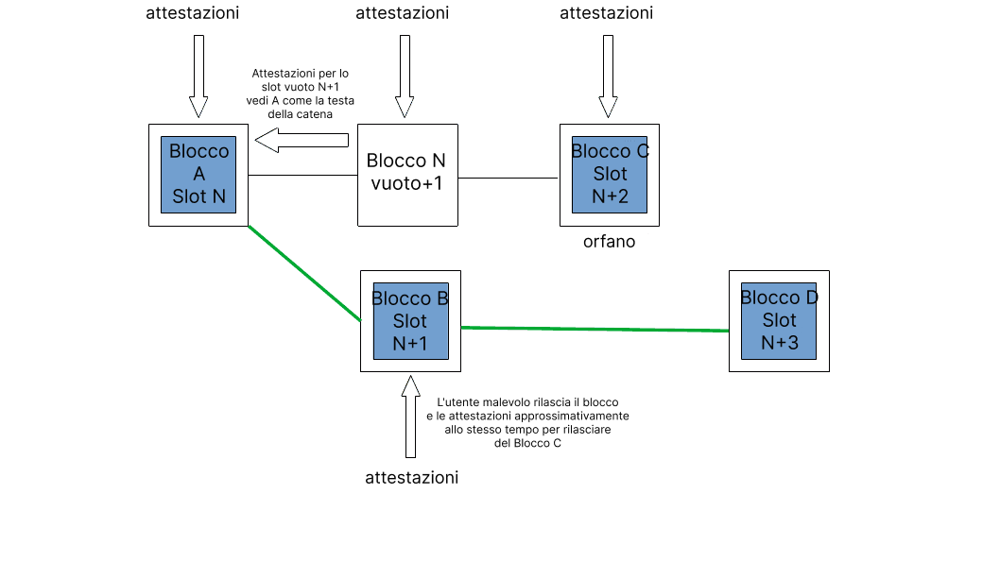

Ladri e sabotatori sono costantemente alla ricerca di opportunità per attaccare il software del client di [Ethereum](/). Questa pagina delinea i vettori di attacco noti sul livello di consenso di Ethereum e illustra come tali attacchi possano essere difesi. Le informazioni in questa pagina sono adattate da una [versione più estesa](https://mirror.xyz/jmcook.eth/YqHargbVWVNRQqQpVpzrqEQ8IqwNUJDIpwRP7SS5FXs).

## Prerequisiti {#prerequisites}

È richiesta una conoscenza di base della [prova di stake](/developers/docs/consensus-mechanisms/pos/). Inoltre, sarà utile avere una comprensione di base del livello degli incentivi di Ethereum e dell'algoritmo di scelta della biforcazione, [LMD-GHOST](/developers/docs/consensus-mechanisms/pos/gasper).

## Cosa vogliono gli aggressori? {#what-do-attackers-want}

Un malinteso comune è che un aggressore di successo possa generare nuovi ether o prosciugare ether da account arbitrari. Nessuna di queste due cose è possibile perché tutte le transazioni vengono eseguite da tutti i client di esecuzione sulla rete. Devono soddisfare le condizioni di base di validità (ad es., le transazioni sono firmate dalla chiave privata del mittente, il mittente ha un saldo sufficiente, ecc.) altrimenti vengono semplicemente annullate. Ci sono tre classi di risultati a cui un aggressore potrebbe realisticamente mirare: reorg, doppia finalità o ritardo della finalità.

Un **"reorg"** (riorganizzazione) è un rimescolamento dei blocchi in un nuovo ordine, forse con qualche aggiunta o sottrazione di blocchi nella catena canonica. Un reorg malevolo potrebbe garantire che blocchi specifici vengano inclusi o esclusi, consentendo la doppia spesa o l'estrazione di valore tramite transazioni di front-running e back-running (MEV - valore massimo estraibile). I reorg potrebbero anche essere utilizzati per impedire che determinate transazioni vengano incluse nella catena canonica: una forma di censura. La forma più estrema di reorg è la "reversione della finalità", che rimuove o sostituisce i blocchi che sono stati precedentemente finalizzati. Questo è possibile solo se più di ⅓ degli ether totali in stake viene distrutto dall'aggressore; questa garanzia è nota come "finalità economica" (ne parleremo più avanti).

La **doppia finalità** è la condizione improbabile ma grave in cui due biforcazioni sono in grado di finalizzare simultaneamente, creando uno scisma permanente nella catena. Questo è teoricamente possibile per un aggressore disposto a rischiare il 34% degli ether totali in stake. La comunità sarebbe costretta a coordinarsi fuori catena e a raggiungere un accordo su quale catena seguire, il che richiederebbe forza nel livello sociale.

Un attacco di **ritardo della finalità** impedisce alla rete di raggiungere le condizioni necessarie per finalizzare sezioni della catena. Senza finalità, è difficile fidarsi delle applicazioni finanziarie costruite su Ethereum. Lo scopo di un attacco di ritardo della finalità è probabilmente solo quello di interrompere Ethereum piuttosto che trarne un profitto diretto, a meno che l'aggressore non abbia delle posizioni corte strategiche.

Un attacco al livello sociale potrebbe mirare a minare la fiducia del pubblico in Ethereum, svalutare l'ether, ridurre l'adozione o indebolire la comunità di Ethereum per rendere più difficile il coordinamento fuori banda.

Avendo stabilito perché un avversario potrebbe attaccare Ethereum, le sezioni seguenti esaminano _come_ potrebbe farlo.

## Metodi di attacco {#methods-of-attack}

### Attacchi di Livello 0 {#layer-0}

Prima di tutto, gli individui che non partecipano attivamente a Ethereum (eseguendo il software del client) possono attaccare prendendo di mira il livello sociale (Livello 0). Il Livello 0 è la base su cui è costruito Ethereum e, in quanto tale, rappresenta una potenziale superficie per attacchi con conseguenze che si ripercuotono sul resto dello stack. Alcuni esempi potrebbero includere:

- Una campagna di disinformazione potrebbe erodere la fiducia che la comunità ha nel piano d'azione di Ethereum, nei team di sviluppatori, nelle app, ecc. Questo potrebbe quindi diminuire il numero di individui disposti a partecipare alla messa in sicurezza della rete, degradando sia la decentralizzazione che la sicurezza criptoeconomica.
- Attacchi mirati e/o intimidazioni dirette alla comunità degli sviluppatori. Questo potrebbe portare all'uscita volontaria degli sviluppatori e rallentare i progressi di Ethereum.

- Anche una regolamentazione eccessivamente zelante potrebbe essere considerata un attacco al Livello 0, poiché potrebbe disincentivare rapidamente la partecipazione e l'adozione.
- Infiltrazione di attori esperti ma malintenzionati nella comunità degli sviluppatori il cui scopo è rallentare i progressi perdendosi in discussioni futili (bike-shedding), ritardando decisioni chiave, creando spam, ecc.
- Tangenti pagate ad attori chiave nell'ecosistema di Ethereum per influenzare il processo decisionale.

Ciò che rende questi attacchi particolarmente pericolosi è che in molti casi è richiesto pochissimo capitale o know-how tecnico. Un attacco di Livello 0 potrebbe essere un moltiplicatore di un attacco criptoeconomico. Ad esempio, se la censura o la reversione della finalità venissero ottenute da un azionista di maggioranza malintenzionato, minare il livello sociale potrebbe rendere più difficile coordinare una risposta della comunità fuori banda.

Difendersi dagli attacchi di Livello 0 probabilmente non è semplice, ma si possono stabilire alcuni principi di base. Uno è mantenere un rapporto segnale/rumore complessivamente elevato per le informazioni pubbliche su Ethereum, create e propagate da membri onesti della comunità attraverso blog, server Discord, specifiche annotate, libri, podcast e YouTube. Qui su ethereum.org ci impegniamo a fondo per mantenere informazioni accurate e tradurle nel maggior numero di lingue possibile. Inondare uno spazio con informazioni e meme di alta qualità è una difesa efficace contro la disinformazione.

Un'altra importante fortificazione contro gli attacchi al livello sociale è una chiara dichiarazione di intenti e un protocollo di governance. Ethereum si è posizionato come il campione della decentralizzazione e della sicurezza tra i livelli 1 dei contratti intelligenti, pur valutando molto la scalabilità e la sostenibilità. Qualunque disaccordo sorga nella comunità di Ethereum, questi principi fondamentali sono minimamente compromessi. Valutare una narrazione rispetto a questi principi fondamentali ed esaminarli attraverso successivi cicli di revisione nel processo EIP (proposta di miglioramento di ethereum), potrebbe aiutare la comunità a distinguere i buoni dai cattivi attori e limita il margine di manovra per gli attori malintenzionati di influenzare la direzione futura di Ethereum.

Infine, è fondamentale che la comunità di Ethereum rimanga aperta e accogliente per tutti i partecipanti. Una comunità con guardiani (gatekeeper) ed esclusività è particolarmente vulnerabile agli attacchi sociali perché è facile costruire narrazioni del tipo "noi e loro". Il tribalismo e il massimalismo tossico danneggiano la comunità ed erodono la sicurezza del Livello 0. Gli Etherean con un interesse acquisito nella sicurezza della rete dovrebbero considerare la loro condotta online e nel mondo reale (meatspace) come un contributo diretto alla sicurezza del Livello 0 di Ethereum.

### Attaccare il protocollo {#attacking-the-protocol}

Chiunque può eseguire il software del client di Ethereum. Per aggiungere un validatore a un client, a un utente è richiesto di mettere in stake 32 ether nel contratto di deposito. Un validatore consente a un utente di partecipare attivamente alla sicurezza della rete di Ethereum proponendo e attestando nuovi blocchi. Il validatore ora ha una voce che può usare per influenzare i contenuti futuri della blockchain: può farlo onestamente e far crescere la sua scorta di ether tramite ricompense oppure può cercare di manipolare il processo a proprio vantaggio, rischiando il proprio stake. Un modo per sferrare un attacco è accumulare una percentuale maggiore dello stake totale e poi usarla per superare i voti dei validatori onesti. Maggiore è la percentuale dello stake controllata dall'aggressore, maggiore è il suo potere di voto, specialmente in corrispondenza di determinati traguardi economici che esploreremo in seguito. Tuttavia, la maggior parte degli aggressori non sarà in grado di accumulare ether sufficienti per attaccare in questo modo, quindi devono invece usare tecniche subdole per manipolare la maggioranza onesta affinché agisca in un certo modo.

Fondamentalmente, tutti gli attacchi con piccoli stake sono sottili variazioni di due tipi di comportamento scorretto del validatore: sotto-attività (mancata attestazione/proposta o farlo in ritardo) o sovra-attività (proporre/attestare troppe volte in uno slot). Nelle loro forme più semplici, queste azioni sono facilmente gestite dall'algoritmo di scelta della biforcazione e dal livello degli incentivi, ma ci sono modi intelligenti per aggirare il sistema a vantaggio di un aggressore.

### Attacchi utilizzando piccole quantità di ETH {#attacks-by-small-stakeholders}

#### reorg {#reorgs}

Diversi documenti hanno spiegato attacchi a Ethereum che ottengono reorg o ritardi della finalità con solo una piccola percentuale degli ether totali in stake. Questi attacchi si basano generalmente sul fatto che l'aggressore nasconda alcune informazioni agli altri validatori per poi rilasciarle in modo sfumato e/o in un momento opportuno. Di solito mirano a rimuovere alcuni blocchi onesti dalla catena canonica. [Neuder et al 2020](https://arxiv.org/pdf/2102.02247.pdf) hanno mostrato come un validatore aggressore possa creare e attestare un blocco (`B`) per un particolare slot `n+1` ma astenersi dal propagarlo ad altri nodi sulla rete. Invece, trattengono quel blocco attestato fino allo slot successivo `n+2`. Un validatore onesto propone un blocco (`C`) per lo slot `n+2`. Quasi simultaneamente, l'aggressore può rilasciare il blocco trattenuto (`B`) e le relative attestazioni trattenute, e anche attestare che `B` è la testa della catena con i propri voti per lo slot `n+2`, negando di fatto l'esistenza del blocco onesto `C`. Quando viene rilasciato il blocco onesto `D`, l'algoritmo di scelta della biforcazione vede che `D` costruito sopra `B` è più pesante di `D` costruito su `C`. L'aggressore è quindi riuscito a rimuovere il blocco onesto `C` nello slot `n+2` dalla catena canonica utilizzando un reorg ex ante di 1 blocco. [Un aggressore con il 34%](https://www.youtube.com/watch?v=6vzXwwk12ZE) dello stake ha ottime probabilità di riuscire in questo attacco, come spiegato [in questa nota](https://notes.ethereum.org/plgVdz-ORe-fGjK06BZ_3A#Fork-choice-by-block-slot-pair). In teoria, però, questo attacco potrebbe essere tentato con stake inferiori. [Neuder et al 2020](https://arxiv.org/pdf/2102.02247.pdf) hanno descritto questo attacco funzionante con uno stake del 30%, ma in seguito è stato dimostrato che è fattibile con il [2% dello stake totale](https://arxiv.org/pdf/2009.04987.pdf) e poi di nuovo per un [singolo validatore](https://arxiv.org/abs/2110.10086#) utilizzando tecniche di bilanciamento che esamineremo nella prossima sezione.

Un diagramma concettuale dell'attacco di reorg di un blocco descritto sopra (adattato da https://notes.ethereum.org/plgVdz-ORe-fGjK06BZ_3A#Fork-choice-by-block-slot-pair)

Un attacco più sofisticato può dividere l'insieme dei validatori onesti in gruppi discreti che hanno visioni diverse della testa della catena. Questo è noto come **attacco di bilanciamento** (balancing attack). L'aggressore aspetta la sua occasione per proporre un blocco e, quando arriva, equivoca e ne propone due. Invia un blocco a metà dell'insieme dei validatori onesti e l'altro blocco all'altra metà. L'equivoco verrebbe rilevato dall'algoritmo di scelta della biforcazione e il proponente del blocco verrebbe punito (slashed) ed espulso dalla rete, ma i due blocchi esisterebbero ancora e avrebbero circa metà dell'insieme dei validatori che attesta ciascuna biforcazione. Nel frattempo, i restanti validatori malintenzionati trattengono le loro attestazioni. Quindi, rilasciando selettivamente le attestazioni a favore dell'una o dell'altra biforcazione a un numero appena sufficiente di validatori proprio mentre viene eseguito l'algoritmo di scelta della biforcazione, fanno pendere il peso accumulato delle attestazioni a favore dell'una o dell'altra biforcazione. Questo può continuare all'infinito, con i validatori aggressori che mantengono una divisione uniforme dei validatori tra le due biforcazioni. Poiché nessuna delle due biforcazioni può attrarre una supermaggioranza di 2/3, la rete non finalizzerebbe.

Gli **attacchi di rimbalzo** (bouncing attacks) sono simili. I voti vengono nuovamente trattenuti dai validatori aggressori. Invece di rilasciare i voti per mantenere una divisione uniforme tra due biforcazioni, usano i loro voti nei momenti opportuni per giustificare i checkpoint che si alternano tra la biforcazione A e la biforcazione B. Questo continuo capovolgimento della giustificazione tra due biforcazioni impedisce che ci siano coppie di checkpoint di origine e di destinazione giustificati che possono essere finalizzati su entrambe le catene, arrestando la finalità.

<YouTube id="xcPxwhrg3Ao"/>

Sia gli attacchi di rimbalzo che quelli di bilanciamento si basano sul fatto che l'aggressore abbia un controllo molto preciso sulla tempistica dei messaggi attraverso la rete, il che è improbabile. Tuttavia, le difese sono integrate nel protocollo sotto forma di ponderazione aggiuntiva data ai messaggi tempestivi rispetto a quelli lenti. Questo è noto come [potenziamento del peso del proponente](https://github.com/ethereum/consensus-specs/pull/2730) (proposer-weight boosting). Per difendersi dagli attacchi di rimbalzo, l'algoritmo di scelta della biforcazione è stato aggiornato in modo che l'ultimo checkpoint giustificato possa passare a quello di una catena alternativa solo durante il [primo 1/3 degli slot in ogni epoca](https://ethresear.ch/t/prevention-of-bouncing-attack-on-ffg/6114). Questa condizione impedisce all'aggressore di risparmiare voti per distribuirli in seguito: l'algoritmo di scelta della biforcazione rimane semplicemente fedele al checkpoint che ha scelto nel primo 1/3 dell'epoca, durante il quale la maggior parte dei validatori onesti avrebbe votato.

Insieme, queste misure creano uno scenario in cui un proponente del blocco onesto emette il proprio blocco molto rapidamente dopo l'inizio dello slot, quindi c'è un periodo di ~1/3 di slot (4 secondi) in cui quel nuovo blocco potrebbe far sì che l'algoritmo di scelta della biforcazione passi a un'altra catena. Dopo la stessa scadenza, le attestazioni che arrivano da validatori lenti vengono declassate rispetto a quelle arrivate prima. Questo favorisce fortemente i proponenti e i validatori tempestivi nel determinare la testa della catena e riduce sostanzialmente la probabilità di un attacco di bilanciamento o di rimbalzo riuscito.

Vale la pena notare che il potenziamento del proponente da solo difende solo dai "reorg economici", ovvero quelli tentati da un aggressore con un piccolo stake. In effetti, il potenziamento del proponente stesso può essere aggirato dagli staker più grandi. Gli autori di [questo post](https://ethresear.ch/t/change-fork-choice-rule-to-mitigate-balancing-and-reorging-attacks/11127) descrivono come un aggressore con il 7% dello stake possa distribuire i propri voti in modo strategico per indurre i validatori onesti a costruire sulla propria biforcazione, rimuovendo un blocco onesto tramite reorg. Questo attacco è stato ideato ipotizzando condizioni di latenza ideali che sono molto improbabili. Le probabilità sono ancora molto basse per l'aggressore e lo stake maggiore significa anche più capitale a rischio e un disincentivo economico più forte.

È stato anche proposto un [attacco di bilanciamento mirato specificamente alla regola LMD](https://ethresear.ch/t/balancing-attack-lmd-edition/11853), che è stato suggerito essere fattibile nonostante il potenziamento del proponente. Un aggressore imposta due catene concorrenti equivocando la propria proposta di blocco e propagando ciascun blocco a circa metà della rete ciascuno, stabilendo un equilibrio approssimativo tra le biforcazioni. Quindi, i validatori collusi equivocano i loro voti, calcolando i tempi in modo che metà della rete riceva prima i loro voti per la Biforcazione `A` e l'altra metà riceva prima i loro voti per la Biforcazione `B`. Poiché la regola LMD scarta la seconda attestazione e mantiene solo la prima per ogni validatore, metà della rete vede i voti per `A` e nessuno per `B`, l'altra metà vede i voti per `B` e nessuno per `A`. Gli autori descrivono la regola LMD come un elemento che conferisce all'avversario un "potere notevole" per sferrare un attacco di bilanciamento.

Questo vettore di attacco LMD è stato chiuso [aggiornando l'algoritmo di scelta della biforcazione](https://github.com/ethereum/consensus-specs/pull/2845) in modo che scarti del tutto i validatori equivocanti dalla considerazione della scelta della biforcazione. I validatori equivocanti vedono anche la loro influenza futura scontata dall'algoritmo di scelta della biforcazione. Questo previene l'attacco di bilanciamento descritto sopra, mantenendo al contempo la resilienza contro gli attacchi a valanga.

Un'altra classe di attacchi, chiamata [**attacchi a valanga**](https://ethresear.ch/t/avalanche-attack-on-proof-of-stake-ghost/11854/3) (avalanche attacks), è stata descritta in un [documento del marzo 2022](https://arxiv.org/pdf/2203.01315.pdf). Per sferrare un attacco a valanga, l'aggressore deve controllare diversi proponenti del blocco consecutivi. In ciascuno degli slot di proposta del blocco, l'aggressore trattiene il proprio blocco, raccogliendoli fino a quando la catena onesta non raggiunge un peso del sottoalbero uguale a quello dei blocchi trattenuti. Quindi, i blocchi trattenuti vengono rilasciati in modo che equivochino al massimo. Gli autori suggeriscono che il potenziamento del proponente, la difesa principale contro gli attacchi di bilanciamento e di rimbalzo, non protegge da alcune varianti dell'attacco a valanga. Tuttavia, gli autori hanno anche dimostrato l'attacco solo su una versione altamente idealizzata dell'algoritmo di scelta della biforcazione di Ethereum (hanno usato GHOST senza LMD).

L'attacco a valanga è mitigato dalla porzione LMD dell'algoritmo di scelta della biforcazione LMD-GHOST. LMD significa "latest-message-driven" (guidato dall'ultimo messaggio) e si riferisce a una tabella tenuta da ogni validatore contenente l'ultimo messaggio ricevuto da altri validatori. Quel campo viene aggiornato solo se il nuovo messaggio proviene da uno slot successivo rispetto a quello già presente nella tabella per un particolare validatore. In pratica, questo significa che in ogni slot, il primo messaggio ricevuto è quello che viene accettato e qualsiasi messaggio aggiuntivo è un equivoco da ignorare. In altre parole, i client di consenso non contano gli equivoci: usano il primo messaggio in arrivo da ogni validatore e gli equivoci vengono semplicemente scartati, prevenendo gli attacchi a valanga.

Ci sono molti altri potenziali aggiornamenti futuri alla regola di scelta della biforcazione che potrebbero aumentare la sicurezza fornita dal potenziamento del proponente. Uno è il [view-merge](https://ethresear.ch/t/view-merge-as-a-replacement-for-proposer-boost/13739), in cui gli attestatori congelano la loro visione della scelta della biforcazione `n` secondi prima dell'inizio di uno slot e il proponente aiuta quindi a sincronizzare la visione della catena attraverso la rete. Un altro potenziale aggiornamento è la [finalità a slot singolo](https://notes.ethereum.org/@vbuterin/single_slot_finality), che protegge dagli attacchi basati sulla tempistica dei messaggi finalizzando la catena dopo un solo slot.

#### Ritardo della finalità {#finality-delay}

[Lo stesso documento](https://econcs.pku.edu.cn/wine2020/wine2020/Workshop/GTiB20_paper_8.pdf) che ha descritto per primo l'attacco di reorg a basso costo di un singolo blocco ha anche descritto un attacco di ritardo della finalità (noto anche come "fallimento della vitalità" o liveness failure) che si basa sul fatto che l'aggressore sia il proponente del blocco per un blocco di confine dell'epoca. Questo è fondamentale perché questi blocchi di confine dell'epoca diventano i checkpoint che Casper FFG utilizza per finalizzare porzioni della catena. L'aggressore trattiene semplicemente il proprio blocco finché un numero sufficiente di validatori onesti non usa i propri voti FFG a favore del precedente blocco di confine dell'epoca come attuale obiettivo di finalizzazione. Quindi rilasciano il blocco trattenuto. Attestano il loro blocco e lo fanno anche i restanti validatori onesti, creando biforcazioni con checkpoint di destinazione diversi. Se hanno calcolato bene i tempi, impediranno la finalità perché non ci sarà una supermaggioranza di 2/3 che attesta nessuna delle due biforcazioni. Più piccolo è lo stake, più precisa deve essere la tempistica perché l'aggressore controlla direttamente meno attestazioni e minori sono le probabilità che l'aggressore controlli il validatore che propone un determinato blocco di confine dell'epoca.

#### Attacchi a lungo raggio {#long-range-attacks}

Esiste anche una classe di attacchi specifica per le blockchain prova di stake che coinvolge un validatore che ha partecipato al blocco genesi mantenendo una biforcazione separata della blockchain insieme a quella onesta, convincendo infine l'insieme dei validatori onesti a passare ad essa in un momento opportuno molto più tardi. Questo tipo di attacco non è possibile su Ethereum a causa del gadget di finalità che assicura che tutti i validatori concordino sullo stato della catena onesta a intervalli regolari ("checkpoint"). Questo semplice meccanismo neutralizza gli aggressori a lungo raggio perché i client di Ethereum semplicemente non riorganizzeranno (reorg) i blocchi finalizzati. I nuovi nodi che si uniscono alla rete lo fanno trovando un hash di stato recente e affidabile (un checkpoint di "[soggettività debole](https://blog.ethereum.org/2014/11/25/proof-stake-learned-love-weak-subjectivity)") e usandolo come blocco pseudo-genesi su cui costruire. Questo crea un "gateway di fiducia" per un nuovo nodo che entra nella rete prima che possa iniziare a verificare le informazioni da solo.

#### Denial of Service {#denial-of-service}

Il meccanismo PoS di Ethereum sceglie un singolo validatore dall'insieme totale dei validatori per essere un proponente del blocco in ogni slot. Questo può essere calcolato utilizzando una funzione nota pubblicamente ed è possibile per un avversario identificare il successivo proponente del blocco con un leggero anticipo rispetto alla sua proposta di blocco. Quindi, l'aggressore può spammare il proponente del blocco per impedirgli di scambiare informazioni con i suoi pari. Al resto della rete, sembrerebbe che il proponente del blocco fosse offline e lo slot rimarrebbe semplicemente vuoto. Questa potrebbe essere una forma di censura contro validatori specifici, impedendo loro di aggiungere informazioni alla blockchain. L'implementazione di elezioni segrete del leader singolo (SSLE) o elezioni segrete del leader non singolo mitigherà i rischi di DoS perché solo il proponente del blocco sa di essere stato selezionato e la selezione non è conoscibile in anticipo. Questo non è ancora implementato, ma è un'area attiva di [ricerca e sviluppo](https://ethresear.ch/t/secret-non-single-leader-election/11789).

Tutto ciò indica il fatto che è molto difficile attaccare con successo Ethereum con un piccolo stake. Gli attacchi fattibili che sono stati descritti qui richiedono un algoritmo di scelta della biforcazione idealizzato, condizioni di rete improbabili, oppure i vettori di attacco sono già stati chiusi con patch relativamente minori al software del client. Questo, ovviamente, non esclude la possibilità che esistano zero-day in circolazione, ma dimostra l'asticella estremamente alta di attitudine tecnica, conoscenza del livello di consenso e fortuna richiesta affinché un aggressore con uno stake di minoranza sia efficace. Dal punto di vista di un aggressore, la scommessa migliore potrebbe essere quella di accumulare quanto più ether possibile e tornare armato con una percentuale maggiore dello stake totale.

### Aggressori che utilizzano >= 33% dello stake totale {#attackers-with-33-stake}

Tutti gli attacchi menzionati in precedenza in questo articolo hanno maggiori probabilità di successo quando l'aggressore ha più ether in stake con cui votare e più validatori che potrebbero essere scelti per proporre blocchi in ogni slot. Un validatore malintenzionato potrebbe quindi mirare a controllare quanti più ether in stake possibile.

Il 33% degli ether in stake è un punto di riferimento per un aggressore perché con qualsiasi importo superiore a questo ha la capacità di impedire alla catena di finalizzare senza dover controllare finemente le azioni degli altri validatori. Possono semplicemente scomparire tutti insieme. Se 1/3 o più degli ether in stake attesta in modo malevolo o non attesta, allora non può esistere una supermaggioranza di 2/3 e la catena non può finalizzare. La difesa contro questo è la perdita per inattività (inactivity leak). La perdita per inattività identifica quei validatori che non riescono ad attestare o che attestano contrariamente alla maggioranza. Gli ether in stake di proprietà di questi validatori non attestanti vengono gradualmente prosciugati fino a quando non rappresentano collettivamente meno di 1/3 del totale, in modo che la catena possa finalizzare di nuovo.

Lo scopo della perdita per inattività è far sì che la catena finalizzi di nuovo. Tuttavia, l'aggressore perde anche una parte dei propri ether in stake. L'inattività persistente tra i validatori che rappresentano il 33% degli ether totali in stake è molto costosa anche se i validatori non vengono puniti (slashed).

Supponendo che la rete di Ethereum sia asincrona (ovvero, ci sono ritardi tra l'invio e la ricezione dei messaggi), un aggressore che controlla il 34% dello stake totale potrebbe causare una doppia finalità. Questo perché l'aggressore può equivocare quando viene scelto per essere un produttore di blocchi, quindi votare due volte con tutti i suoi validatori. Questo crea una situazione in cui esiste una biforcazione della blockchain, ciascuna con il 34% degli ether in stake che vota per essa. Ogni biforcazione richiede solo che il 50% dei restanti validatori voti a suo favore affinché entrambe le biforcazioni siano supportate da una supermaggioranza, nel qual caso entrambe le catene possono finalizzare (perché il 34% dei validatori degli aggressori + metà del restante 66% = 67% su ogni biforcazione). I blocchi concorrenti dovrebbero essere ricevuti ciascuno da circa il 50% dei validatori onesti, quindi questo attacco è fattibile solo quando l'aggressore ha un certo grado di controllo sulla tempistica dei messaggi che si propagano sulla rete in modo da poter spingere metà dei validatori onesti su ciascuna catena. L'aggressore distruggerebbe necessariamente il suo intero stake (il 34% di ~10 milioni di ether con l'attuale insieme di validatori) per ottenere questa doppia finalità perché il 34% dei suoi validatori voterebbe due volte simultaneamente: un'offesa punibile (slashable) con la massima penalità di correlazione. La difesa contro questo attacco è il costo molto elevato della distruzione del 34% degli ether totali in stake. Il recupero da questo attacco richiederebbe alla comunità di Ethereum di coordinarsi "fuori banda" e concordare di seguire l'una o l'altra delle biforcazioni e ignorare l'altra.

### Aggressori che utilizzano ~50% dello stake totale {#attackers-with-50-stake}

Al 50% degli ether in stake, un gruppo malintenzionato di validatori potrebbe teoricamente dividere la catena in due biforcazioni di uguali dimensioni e quindi utilizzare semplicemente il proprio intero stake del 50% per votare contrariamente all'insieme dei validatori onesti, mantenendo così le due biforcazioni e impedendo la finalità. La perdita per inattività su entrambe le biforcazioni porterebbe alla fine entrambe le catene a finalizzare. A questo punto, l'unica opzione è ripiegare su un recupero sociale.

È molto improbabile che un gruppo avversario di validatori possa controllare costantemente e con precisione il 50% dello stake totale, dato un certo grado di fluttuazione nel numero di validatori onesti, nella latenza di rete, ecc. L'enorme costo per sferrare un simile attacco combinato con la bassa probabilità di successo sembra essere un forte disincentivo per un aggressore razionale, specialmente quando un piccolo investimento aggiuntivo per ottenere _più del_ 50% sblocca molto più potere.

A >50% dello stake totale l'aggressore potrebbe dominare l'algoritmo di scelta della biforcazione. In questo caso, l'aggressore sarebbe in grado di attestare con il voto di maggioranza, dandogli un controllo sufficiente per fare brevi reorg senza dover ingannare i client onesti. I validatori onesti seguirebbero l'esempio perché anche il loro algoritmo di scelta della biforcazione vedrebbe la catena favorita dall'aggressore come la più pesante, quindi la catena potrebbe finalizzare. Questo consente all'aggressore di censurare determinate transazioni, fare reorg a corto raggio ed estrarre il valore massimo estraibile (MEV) riordinando i blocchi a proprio favore. La difesa contro questo è l'enorme costo di uno stake di maggioranza (attualmente poco meno di 19 miliardi di dollari USA) che viene messo a rischio da un aggressore perché è probabile che il livello sociale intervenga e adotti una biforcazione di minoranza onesta, svalutando drasticamente lo stake dell'aggressore.

### Aggressori che utilizzano >=66% dello stake totale {#attackers-with-66-stake}

Un aggressore con il 66% o più degli ether totali in stake può finalizzare la propria catena preferita senza dover costringere alcun validatore onesto. L'aggressore può semplicemente votare per la sua biforcazione preferita e poi finalizzarla, semplicemente perché può votare con una supermaggioranza disonesta. In qualità di staker di supermaggioranza, l'aggressore controllerebbe sempre i contenuti dei blocchi finalizzati, con il potere di spendere, riavvolgere e spendere di nuovo, censurare determinate transazioni e riorganizzare (reorg) la catena a piacimento. Acquistando ether aggiuntivi per controllare il 66% anziché il 51%, l'aggressore sta effettivamente acquistando la capacità di fare reorg ex post e reversioni della finalità (ovvero, cambiare il passato oltre a controllare il futuro). Le uniche vere difese qui sono l'enorme costo del 66% degli ether totali in stake e l'opzione di ripiegare sul livello sociale per coordinare l'adozione di una biforcazione alternativa. Possiamo esplorare questo aspetto in modo più dettagliato nella prossima sezione.

## Le persone: l'ultima linea di difesa {#people-the-last-line-of-defense}

Se i validatori disonesti riescono a finalizzare la loro versione preferita della catena, la comunità di Ethereum viene messa in una situazione difficile. La catena canonica include una sezione disonesta integrata nella sua storia, mentre i validatori onesti possono finire per essere puniti per aver attestato una catena alternativa (onesta). Si noti che una catena finalizzata ma errata potrebbe anche derivare da un bug in un client di maggioranza. Alla fine, il ripiego finale è fare affidamento sul livello sociale (Livello 0) per risolvere la situazione.

Uno dei punti di forza del consenso PoS di Ethereum è che c'è una [serie di strategie difensive](https://youtu.be/1m12zgJ42dI?t=1712) che la comunità può impiegare di fronte a un attacco. Una risposta minima potrebbe essere quella di far uscire forzatamente i validatori degli aggressori dalla rete senza alcuna penalità aggiuntiva. Per rientrare nella rete, l'aggressore dovrebbe unirsi a una coda di attivazione che assicura che l'insieme dei validatori cresca gradualmente. Ad esempio, aggiungere abbastanza validatori per raddoppiare la quantità di ether in stake richiede circa 200 giorni, facendo guadagnare di fatto ai validatori onesti 200 giorni prima che l'aggressore possa tentare un altro attacco del 51%. Tuttavia, la comunità potrebbe anche decidere di penalizzare l'aggressore più duramente, revocando le ricompense passate o bruciando una parte (fino al 100%) del suo capitale in stake.

Qualunque sia la penalità imposta all'aggressore, la comunità deve anche decidere insieme se la catena disonesta, pur essendo quella favorita dall'algoritmo di scelta della biforcazione codificato nei client di Ethereum, sia di fatto non valida e che la comunità debba invece costruire sulla catena onesta. I validatori onesti potrebbero concordare collettivamente di costruire su una biforcazione della blockchain di Ethereum accettata dalla comunità che potrebbe, ad esempio, essersi biforcata dalla catena canonica prima dell'inizio dell'attacco o aver rimosso forzatamente i validatori degli aggressori. I validatori onesti sarebbero incentivati a costruire su questa catena perché eviterebbero le penalità applicate loro per non aver (giustamente) attestato la catena dell'aggressore. Gli exchange, gli on-ramp e le applicazioni costruite su Ethereum preferirebbero presumibilmente essere sulla catena onesta e seguirebbero i validatori onesti sulla blockchain onesta.

Tuttavia, questa sarebbe una sfida di governance sostanziale. Alcuni utenti e validatori ci rimetterebbero senza dubbio a causa del ritorno alla catena onesta, le transazioni nei blocchi validati dopo l'attacco potrebbero potenzialmente essere annullate (rolled back), interrompendo il livello dell'applicazione, e molto semplicemente mina l'etica di alcuni utenti che tendono a credere che "il codice è legge" (code is law). Gli exchange e le applicazioni avranno molto probabilmente collegato azioni fuori catena a transazioni on-chain che ora potrebbero essere annullate, avviando una cascata di ritrattazioni e revisioni che sarebbe difficile districare in modo equo, specialmente se i guadagni illeciti sono stati mescolati, depositati nella DeFi o in altri derivati con effetti secondari per gli utenti onesti. Indubbiamente alcuni utenti, forse anche istituzionali, avrebbero già beneficiato della catena disonesta per scaltrezza o per serendipità, e potrebbero opporsi a una biforcazione per proteggere i loro guadagni. Ci sono state richieste di provare la risposta della comunità agli attacchi >51% in modo che una mitigazione coordinata e sensata possa essere eseguita rapidamente. C'è un'utile discussione di Vitalik su ethresear.ch [qui](https://ethresear.ch/t/timeliness-detectors-and-51-attack-recovery-in-blockchains/6925) e [qui](https://ethresear.ch/t/responding-to-51-attacks-in-casper-ffg/6363) e su Twitter [qui](https://twitter.com/skylar_eth/status/1551798684727508992?s=20&t=oHZ1xv8QZdOgAXhxZKtHEw). Lo scopo di una risposta sociale coordinata dovrebbe essere molto mirato e specifico nel punire l'aggressore e ridurre al minimo gli effetti per gli altri utenti.

La governance è già un argomento complicato. Gestire una risposta di emergenza di Livello 0 a una catena finalizzante disonesta sarebbe senza dubbio impegnativo per la comunità di Ethereum, ma [è successo](/ethereum-forks/#dao-fork-summary) ([due volte](/ethereum-forks/#tangerine-whistle)) nella storia di Ethereum.

Tuttavia, c'è qualcosa di abbastanza soddisfacente nel fatto che il ripiego finale risieda nel mondo reale (meatspace). In definitiva, anche con questo fenomenale stack di tecnologia sopra di noi, se dovesse mai accadere il peggio, persone reali dovrebbero coordinarsi per uscirne.

## Riepilogo {#summary}

Questa pagina ha esplorato alcuni dei modi in cui gli aggressori potrebbero tentare di sfruttare il protocollo di consenso prova di stake di Ethereum. I reorg e i ritardi della finalità sono stati esplorati per aggressori con proporzioni crescenti degli ether totali in stake. Nel complesso, un aggressore più ricco ha maggiori probabilità di successo perché il suo stake si traduce in potere di voto che può usare per influenzare i contenuti dei blocchi futuri. A determinate soglie di ether in stake, il potere dell'aggressore sale di livello:

33%: ritardo della finalità
34%: ritardo della finalità, doppia finalità
51%: ritardo della finalità, doppia finalità, censura, controllo sul futuro della blockchain
66%: ritardo della finalità, doppia finalità, censura, controllo sul futuro e sul passato della blockchain

Esiste anche una serie di attacchi più sofisticati che richiedono piccole quantità di ether in stake ma si basano su un aggressore molto sofisticato che ha un controllo preciso sulla tempistica dei messaggi per influenzare l'insieme dei validatori onesti a proprio favore.

Nel complesso, nonostante questi potenziali vettori di attacco, il rischio di un attacco riuscito è basso, certamente inferiore agli equivalenti della prova di lavoro. Questo a causa dell'enorme costo degli ether in stake messi a rischio da un aggressore che mira a sopraffare i validatori onesti con il proprio potere di voto. Il livello degli incentivi integrato "bastone e carota" protegge dalla maggior parte dei comportamenti illeciti, specialmente per gli aggressori con stake bassi. È anche improbabile che attacchi di rimbalzo e di bilanciamento più sottili abbiano successo perché le condizioni reali della rete rendono molto difficile ottenere il controllo preciso della consegna dei messaggi a sottoinsiemi specifici di validatori, e i team dei client hanno rapidamente chiuso i vettori di attacco noti di rimbalzo, bilanciamento e a valanga con semplici patch.

Gli attacchi del 34%, 51% o 66% richiederebbero probabilmente un coordinamento sociale fuori banda per essere risolti. Sebbene questo sarebbe probabilmente doloroso per la comunità, la capacità di una comunità di rispondere fuori banda è un forte disincentivo per un aggressore. Il livello sociale di Ethereum è l'ultimo baluardo: un attacco tecnicamente riuscito potrebbe ancora essere neutralizzato dalla comunità che accetta di adottare una biforcazione onesta. Ci sarebbe una gara tra l'aggressore e la comunità di Ethereum: i miliardi di dollari spesi per un attacco del 66% verrebbero probabilmente annientati da un attacco di coordinamento sociale riuscito se venisse sferrato abbastanza rapidamente, lasciando l'aggressore con pesanti borse di ether in stake illiquidi su una catena disonesta nota ignorata dalla comunità di Ethereum. La probabilità che questo finisca per essere redditizio per l'aggressore è sufficientemente bassa da costituire un deterrente efficace. Ecco perché l'investimento nel mantenimento di un livello sociale coeso con valori strettamente allineati è così importante.

## Letture consigliate {#further-reading}

- [Versione più dettagliata di questa pagina](https://mirror.xyz/jmcook.eth/YqHargbVWVNRQqQpVpzrqEQ8IqwNUJDIpwRP7SS5FXs)
- [Vitalik sulla finalità del regolamento](https://blog.ethereum.org/2016/05/09/on-settlement-finality)
- [Documento su LMD GHOST](https://arxiv.org/abs/2003.03052)
- [Documento su Casper-FFG](https://arxiv.org/abs/1710.09437)
- [Documento su Gasper](https://arxiv.org/pdf/2003.03052.pdf)
- [Specifiche di consenso sul potenziamento del peso del proponente](https://github.com/ethereum/consensus-specs/pull/2730)
- [Attacchi di rimbalzo su ethresear.ch](https://ethresear.ch/t/prevention-of-bouncing-attack-on-ffg/6114)
- [Ricerca su SSLE](https://ethresear.ch/t/secret-non-single-leader-election/11789)