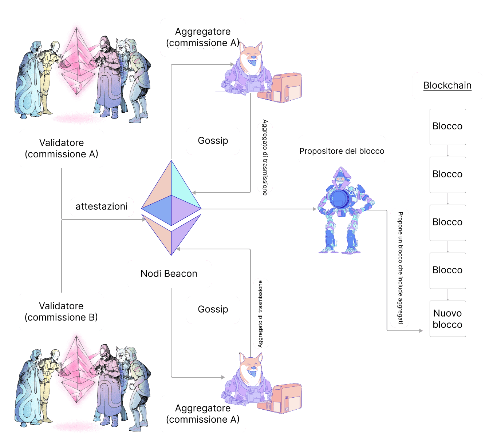

Ci si aspetta che un validatore crei, firmi e trasmetta un'attestazione durante ogni epoca. Questa pagina delinea l'aspetto di queste attestazioni e come vengono elaborate e comunicate tra i client di consenso.

## Cos'è un'attestazione? {#what-is-an-attestation}

Ogni [epoca](/glossary/#epoch) (6,4 minuti) un validatore propone un'attestazione alla rete. L'attestazione è per uno slot specifico nell'epoca. Lo scopo dell'attestazione è votare a favore della visione della catena del validatore, in particolare il blocco giustificato più recente e il primo blocco nell'epoca corrente (noti come checkpoint `source` e `target`). Queste informazioni vengono combinate per tutti i validatori partecipanti, consentendo alla rete di raggiungere il consenso sullo stato della blockchain.

L'attestazione contiene i seguenti componenti:

- `aggregation_bits`: un elenco di bit dei validatori in cui la posizione corrisponde all'indice del validatore nel proprio comitato; il valore (0/1) indica se il validatore ha firmato i `data` (cioè, se è attivo e concorda con il proponente del blocco)
- `data`: dettagli relativi all'attestazione, come definito di seguito
- `signature`: una firma BLS che aggrega le firme dei singoli validatori

Il primo compito per un validatore attestante è costruire i `data`. I `data` contengono le seguenti informazioni:

- `slot`: Il numero di slot a cui si riferisce l'attestazione
- `index`: Un numero che identifica a quale comitato appartiene il validatore in un dato slot
- `beacon_block_root`: L'hash radice del blocco che il validatore vede in cima alla catena (il risultato dell'applicazione dell'algoritmo di scelta della biforcazione)
- `source`: Parte del voto di finalità che indica ciò che i validatori vedono come il blocco giustificato più recente
- `target`: Parte del voto di finalità che indica ciò che i validatori vedono come il primo blocco nell'epoca corrente

Una volta costruiti i `data`, il validatore può invertire il bit in `aggregation_bits` corrispondente al proprio indice di validatore da 0 a 1 per mostrare di aver partecipato.

Infine, il validatore firma l'attestazione e la trasmette alla rete.

### Attestazione aggregata {#aggregated-attestation}

C'è un notevole sovraccarico associato al passaggio di questi dati attraverso la rete per ogni validatore. Pertanto, le attestazioni dei singoli validatori vengono aggregate all'interno di sottoreti prima di essere trasmesse più ampiamente. Ciò include l'aggregazione delle firme in modo che un'attestazione trasmessa includa i `data` di consenso e una singola firma formata combinando le firme di tutti i validatori che concordano con quei `data`. Questo può essere verificato utilizzando `aggregation_bits` perché fornisce l'indice di ciascun validatore nel proprio comitato (il cui ID è fornito in `data`), che può essere utilizzato per interrogare le singole firme.

In ogni epoca, 16 validatori in ciascuna sottorete vengono selezionati per essere gli `aggregators` (aggregatori). Gli aggregatori raccolgono tutte le attestazioni di cui vengono a conoscenza sulla rete gossip che hanno `data` equivalenti ai propri. Il mittente di ogni attestazione corrispondente viene registrato in `aggregation_bits`. Gli aggregatori trasmettono quindi l'aggregato di attestazioni alla rete più ampia.

Quando un validatore viene selezionato per essere un proponente del blocco, impacchetta le attestazioni aggregate dalle sottoreti fino all'ultimo slot nel nuovo blocco.

### Ciclo di vita dell'inclusione dell'attestazione {#attestation-inclusion-lifecycle}

1. Generazione
2. Propagazione
3. Aggregazione
4. Propagazione
5. Inclusione

Il ciclo di vita dell'attestazione è delineato nello schema sottostante:

## Ricompense {#rewards}

I validatori vengono ricompensati per l'invio di attestazioni. La ricompensa dell'attestazione dipende dai flag di partecipazione (source, target e head), dalla ricompensa di base e dal tasso di partecipazione.

Ciascuno dei flag di partecipazione può essere vero o falso, a seconda dell'attestazione inviata e del suo ritardo di inclusione.

Lo scenario migliore si verifica quando tutti e tre i flag sono veri, nel qual caso un validatore guadagnerebbe (per flag corretto):

`reward += base reward * flag weight * flag attesting rate / 64`

Il tasso di attestazione del flag viene misurato utilizzando la somma dei saldi effettivi di tutti i validatori attestanti per il flag dato rispetto al saldo effettivo attivo totale.

### Ricompensa di base {#base-reward}

La ricompensa di base viene calcolata in base al numero di validatori attestanti e ai loro saldi effettivi di ether in stake:

`base reward = validator effective balance x 2^6 / SQRT(Effective balance of all active validators)`

#### Ritardo di inclusione {#inclusion-delay}

Nel momento in cui i validatori hanno votato sulla cima della catena (`block n`), il `block n+1` non era ancora stato proposto. Pertanto, le attestazioni vengono naturalmente incluse **un blocco dopo**, quindi tutte le attestazioni che hanno votato per il `block n` come cima della catena sono state incluse nel `block n+1` e il **ritardo di inclusione** è 1. Se il ritardo di inclusione raddoppia a due slot, la ricompensa dell'attestazione si dimezza, perché per calcolare la ricompensa dell'attestazione la ricompensa di base viene moltiplicata per il reciproco del ritardo di inclusione.

### Scenari di attestazione {#attestation-scenarios}

#### Validatore votante mancante {#missing-voting-validator}

I validatori hanno un massimo di 1 epoca per inviare la loro attestazione. Se l'attestazione è stata persa nell'epoca 0, possono inviarla con un ritardo di inclusione nell'epoca 1.

#### Aggregatore mancante {#missing-aggregator}

Ci sono 16 Aggregatori per epoca in totale. Inoltre, validatori casuali si iscrivono a **due sottoreti per 256 epoche** e fungono da backup nel caso in cui manchino gli aggregatori.

#### Proponente del blocco mancante {#missing-block-proposer}

Nota che in alcuni casi un aggregatore fortunato può anche diventare il proponente del blocco. Se l'attestazione non è stata inclusa perché il proponente del blocco è scomparso, il proponente del blocco successivo raccoglierà l'attestazione aggregata e la includerà nel blocco successivo. Tuttavia, il **ritardo di inclusione** aumenterà di uno.

## Letture consigliate {#further-reading}

- [Attestazioni nelle specifiche di consenso annotate di Vitalik](https://github.com/ethereum/annotated-spec/blob/master/phase0/beacon-chain.md#attestationdata)
- [Attestazioni in eth2book.info](https://eth2book.info/capella/part3/containers/dependencies/#attestationdata)

_Conosci una risorsa della community che ti è stata utile? Modifica questa pagina e aggiungila!_