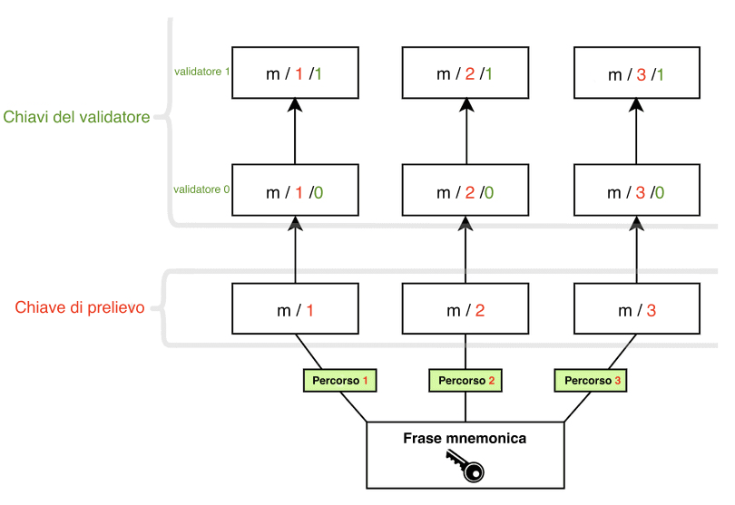

Ethereum protegge gli asset degli utenti utilizzando la crittografia a chiave pubblica-privata. La chiave pubblica è utilizzata come base per un indirizzo Ethereum, ovvero è visibile al pubblico generale e utilizzata come identificatore univoco. La chiave privata (o 'segreta') dovrebbe essere accessibile solo al proprietario di un account. La chiave privata è utilizzata per 'firmare' le transazioni e i dati in modo che la crittografia possa dimostrare che il titolare approva una determinata azione di una specifica chiave privata.

Le chiavi di Ethereum sono generate utilizzando la [crittografia a curva ellittica](https://en.wikipedia.org/wiki/Elliptic-curve_cryptography).

Tuttavia, quando Ethereum è passato dalla [prova di lavoro](/developers/docs/consensus-mechanisms/pow) alla [prova di stake](/developers/docs/consensus-mechanisms/pos), è stato aggiunto un nuovo tipo di chiave a Ethereum. Le chiavi originali funzionano ancora esattamente come prima: non ci sono state modifiche alle chiavi basate su curve ellittiche che proteggono gli account. Tuttavia, gli utenti avevano bisogno di un nuovo tipo di chiave per partecipare alla prova di stake facendo staking di ETH ed eseguendo i validatori. Questa necessità è nata dalle sfide di scalabilità associate ai molti messaggi scambiati tra un gran numero di validatori, che richiedevano un metodo crittografico facilmente aggregabile per ridurre la quantità di comunicazione necessaria affinché la rete raggiungesse il consenso.

Questo nuovo tipo di chiave utilizza lo [schema di firma **Boneh-Lynn-Shacham (BLS)**](https://wikipedia.org/wiki/BLS_digital_signature). BLS consente un'aggregazione molto efficiente delle firme, ma permette anche il reverse engineering delle chiavi aggregate dei singoli validatori ed è ideale per gestire le azioni tra i validatori.

## I due tipi di chiavi del validatore {#two-types-of-keys}

Prima del passaggio alla prova di stake, gli utenti di Ethereum avevano solo una singola chiave privata basata su curve ellittiche per accedere ai propri fondi. Con l'introduzione della prova di stake, gli utenti che desideravano essere staker solitari richiedevano anche una **chiave del validatore** e una **chiave di prelievo**.

### La chiave del validatore {#validator-key}

La chiave di firma del validatore è composta da due elementi:

- Chiave **privata** del validatore
- Chiave **pubblica** del validatore

Lo scopo della chiave privata del validatore è firmare le operazioni on-chain come le proposte di blocco e le attestazioni. Per questo motivo, queste chiavi devono essere conservate in un portafoglio caldo.

Questa flessibilità ha il vantaggio di spostare le chiavi di firma del validatore molto rapidamente da un dispositivo all'altro; tuttavia, se vengono perse o rubate, un ladro potrebbe essere in grado di **agire in modo malevolo** in alcuni modi:

- Far punire il validatore:
  - Essendo un proponente del blocco e firmando due blocchi della beacon chain diversi per lo stesso slot
  - Essendo un attestatore e firmando un'attestazione che ne "circonda" un'altra
  - Essendo un attestatore e firmando due attestazioni diverse con lo stesso bersaglio
- Forzare un'uscita volontaria, che impedisce al validatore di fare staking e concede l'accesso al suo saldo in ETH al proprietario della chiave di prelievo

La **chiave pubblica del validatore** è inclusa nei dati della transazione quando un utente deposita ETH nel contratto di deposito per lo staking. Questi sono noti come _dati di deposito_ e consentono a Ethereum di identificare il validatore.

### Credenziali di prelievo {#withdrawal-credentials}

Ogni validatore ha una proprietà nota come _credenziali di prelievo_. Il primo byte di questo campo a 32 byte identifica il tipo di account: `0x00` rappresenta le credenziali BLS originali (pre-Shapella, non prelevabili), `0x01` rappresenta le credenziali legacy che puntano a un indirizzo di esecuzione e `0x02` rappresenta il moderno tipo di credenziale composta.

I validatori con chiavi BLS `0x00` devono aggiornare queste credenziali per puntare a un indirizzo di esecuzione al fine di attivare i pagamenti del saldo in eccesso o il prelievo completo dallo staking. Questo può essere fatto fornendo un indirizzo di esecuzione nei dati di deposito durante la generazione iniziale della chiave, _OPPURE_ utilizzando la chiave di prelievo in un momento successivo per firmare e trasmettere un messaggio `BLSToExecutionChange`.

[Maggiori informazioni sulle credenziali di prelievo del validatore](/developers/docs/consensus-mechanisms/pos/withdrawal-credentials/)

### La chiave di prelievo {#withdrawal-key}

La chiave di prelievo sarà necessaria per aggiornare le credenziali di prelievo in modo che puntino a un indirizzo di esecuzione, se non impostato durante il deposito iniziale. Ciò consentirà di iniziare a elaborare i pagamenti del saldo in eccesso e permetterà inoltre agli utenti di prelevare completamente i propri ETH in staking.

Proprio come le chiavi del validatore, anche le chiavi di prelievo sono composte da due componenti:

- Chiave **privata** di prelievo
- Chiave **pubblica** di prelievo

Perdere questa chiave prima di aggiornare le credenziali di prelievo al tipo `0x01` significa perdere l'accesso al saldo del validatore. Il validatore può ancora firmare attestazioni e blocchi poiché queste azioni richiedono la chiave privata del validatore, tuttavia c'è poco o nessun incentivo se le chiavi di prelievo vengono perse.

Separare le chiavi del validatore dalle chiavi dell'account Ethereum consente a un singolo utente di eseguire più validatori.


**Nota**: Uscire dai compiti di staking e prelevare il saldo di un validatore richiede attualmente la firma di un [messaggio di uscita volontaria (VEM)](https://mirror.xyz/ladislaus.eth/wmoBbUBes2Wp1_6DvP6slPabkyujSU7MZOFOC3QpErs&1) con la chiave del validatore. Tuttavia, l'[EIP-7002](https://eips.ethereum.org/EIPS/eip-7002) è una proposta che consentirà a un utente di innescare l'uscita di un validatore e prelevare il suo saldo firmando messaggi di uscita con la chiave di prelievo in futuro. Ciò ridurrà le assunzioni di fiducia consentendo agli staker che delegano ETH ai [fornitori di staking-as-a-service](/staking/saas/#what-is-staking-as-a-service) di mantenere il controllo dei propri fondi.

## Derivare le chiavi da una frase di recupero {#deriving-keys-from-seed}

Se ogni 32 ETH in staking richiedesse un nuovo set di 2 chiavi completamente indipendenti, la gestione delle chiavi diventerebbe rapidamente ingestibile, specialmente per gli utenti che eseguono più validatori. Invece, più chiavi del validatore possono essere derivate da un singolo segreto comune e la memorizzazione di quel singolo segreto consente l'accesso a più chiavi del validatore.

Le [frasi mnemoniche](https://en.bitcoinwiki.org/wiki/Mnemonic_phrase) e i percorsi sono funzionalità importanti che gli utenti incontrano spesso quando [accedono](https://ethereum.stackexchange.com/questions/19055/what-is-the-difference-between-m-44-60-0-0-and-m-44-60-0) ai loro portafogli. La frase mnemonica è una sequenza di parole che funge da seme iniziale per una chiave privata. Se combinata con dati aggiuntivi, la frase mnemonica genera un hash noto come 'chiave principale'. Questo può essere pensato come la radice di un albero. I rami da questa radice possono quindi essere derivati utilizzando un percorso gerarchico in modo che i nodi figli possano esistere come combinazioni dell'hash del loro nodo genitore e del loro indice nell'albero. Leggi gli standard [BIP-32](https://github.com/bitcoin/bips/blob/master/bip-0032.mediawiki) e [BIP-19](https://github.com/bitcoin/bips/blob/master/bip-0039.mediawiki) per la generazione di chiavi basata su frasi mnemoniche.

Questi percorsi hanno la seguente struttura, che sarà familiare agli utenti che hanno interagito con i portafogli hardware:

```
m/44'/60'/0'/0`
```

Le barre in questo percorso separano i componenti della chiave privata come segue:

```
master_key / purpose / coin_type / account / change / address_index
```

Questa logica consente agli utenti di collegare il maggior numero possibile di validatori a una singola **frase mnemonica** perché la radice dell'albero può essere comune e la differenziazione può avvenire nei rami. L'utente può **derivare un numero qualsiasi di chiavi** dalla frase mnemonica.

```
      [m / 0]
     /
    /
[m] - [m / 1]
    \
     \
      [m / 2]
```

Ogni ramo è separato da un `/`, quindi `m/2` significa iniziare con la chiave principale e seguire il ramo 2. Nello schema sottostante, una singola frase mnemonica viene utilizzata per memorizzare tre chiavi di prelievo, ciascuna con due validatori associati.



## Letture consigliate {#further-reading}

- [Post sul blog della Ethereum Foundation di Carl Beekhuizen](https://blog.ethereum.org/2020/05/21/keys)
- [Generazione di chiavi EIP-2333 BLS12-381](https://eips.ethereum.org/EIPS/eip-2333)
- [EIP-7002: Uscite innescate dal livello di esecuzione](https://web.archive.org/web/20250125035123/https://research.2077.xyz/eip-7002-unpacking-improvements-to-staking-ux-post-merge)
- [Gestione delle chiavi su larga scala](https://docs.ethstaker.cc/ethstaker-knowledge-base/scaled-node-operators/key-management-at-scale)