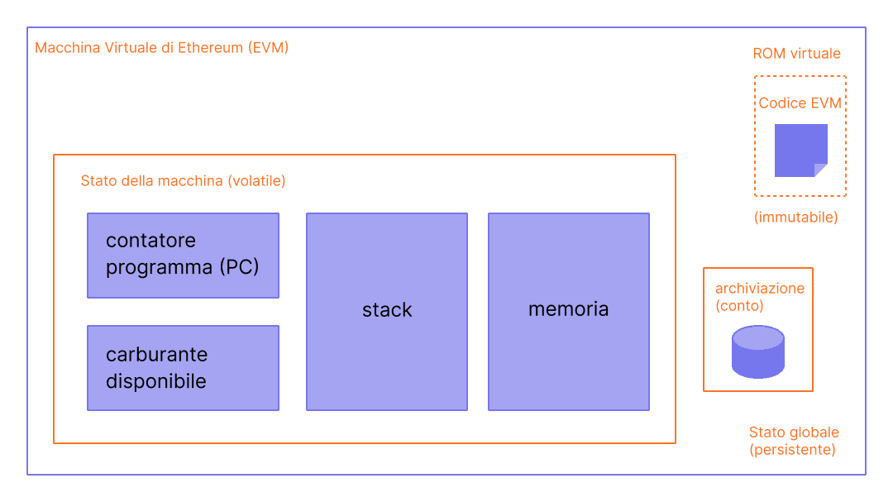

La Macchina Virtuale di Ethereum (EVM) è un ambiente virtuale decentralizzato che esegue il codice con coerenza e sicurezza su tutti i nodi di Ethereum. I nodi eseguono l'EVM per eseguire i contratti intelligenti, utilizzando il "[gas](/gas/)" per misurare lo sforzo di calcolo necessario per le [operazioni](/developers/docs/evm/opcodes/), assicurando un'efficace allocazione delle risorse e la sicurezza della rete.

## Prerequisiti {#prerequisites}

Per comprendere l'EVM, è richiesta una conoscenza di base dei termini comuni dell'informatica, come ad esempio [byte](https://wikipedia.org/wiki/Byte), [memoria](https://wikipedia.org/wiki/Computer_memory) e [stack](https://wikipedia.org/wiki/Stack_(abstract_data_type)). Sarebbe inoltre utile esser a conoscenza dei concetti crittografici e della blockchain come le [funzioni di hash](https://wikipedia.org/wiki/Cryptographic_hash_function) e l'[albero di Merkle](https://wikipedia.org/wiki/Merkle_tree).

## Dal libro mastro alla macchina a stati {#from-ledger-to-state-machine}

Per descrivere blockchain come Bitcoin, viene spesso utilizzata l'analogia con un "libro mastro distribuito", che permette l'esistenza di una valuta decentralizzata utilizzando strumenti base della crittografia. Il libro mastro mantiene un registro delle attività che deve aderire a una serie di regole che governano ciò che qualcuno può e non può fare per modificarlo. Ad esempio, un indirizzo Bitcoin non può spendere più Bitcoin di quanti ne abbia ricevuti in precedenza. Queste regole sono alla base di tutte le transazioni su Bitcoin e di molte altre blockchain.

Mentre Ethereum ha la propria criptovaluta nativa (Ether) che segue quasi esattamente le stesse regole intuitive, consente anche una funzione molto più potente: i [contratti intelligenti](/developers/docs/smart-contracts/). Per questa caratteristica più complessa, è necessaria un'analogia più complessa. Invece di essere un libro mastro distribuito, Ethereum è una [macchina di stato distribuita](https://wikipedia.org/wiki/Finite-state_machine). Lo stato di Ethereum è una grande struttura di dati che contiene non solo tutti i conti e i saldi, ma uno _stato della macchina_, che può cambiare da blocco a blocco secondo una serie predefinita di regole e che può eseguire il codice arbitrario della macchina. Le regole specifiche di cambio stato da blocco a blocco sono definite dall'EVM.

 _Diagramma adattato da [Ethereum EVM illustrated](https://takenobu-hs.github.io/downloads/ethereum_evm_illustrated.pdf)_

## La funzione di transizione di stato di Ethereum {#the-ethereum-state-transition-function}

L'EVM si comporta come una funzione matematica: dato un input, produce un output deterministico. Quindi è più utile descrivere formalmente Ethereum come avente una **funzione di transizione di stato**:

```
Y(S, T)= S'
```

Dato un vecchio stato valido `(S)` e un nuovo set di transazioni valide `(T)`, la funzione di transizione di stato di Ethereum `Y(S, T)` produce un nuovo stato di output valido `S'`

### Stato {#state}

Nel contesto di Ethereum, lo stato è un'enorme struttura di dati detta un [albero di Patricia Merkle modificato](/developers/docs/data-structures-and-encoding/patricia-merkle-trie/), che contiene tutti i [conti](/developers/docs/accounts/) collegati da hash e riducibili a un singolo hash di radice, archiviato sulla blockchain.

### Transazioni {#transactions}

Le transazioni sono istruzioni firmate crittograficamente, provenienti dai conti. Esistono due tipi di transazioni: quelle che danno luogo a chiamate di messaggio e quelle che invece danno luogo alla creazione di contratti.

La creazione del contratto risulta nella creazione di un nuovo conto del contratto, contenente bytecode compilato del [contratto intelligente](/developers/docs/smart-contracts/anatomy/). Ogni volta che un altro conto effettua una chiamata di messaggio a quel contratto, esegue il suo bytecode.

## Istruzioni dell'EVM {#evm-instructions}

L'EVM viene eseguita come una [macchina a stack](https://wikipedia.org/wiki/Stack_machine) con una profondità di 1024 elementi. Ogni elemento è una parola di 256 bit, scelta per la facilità d'uso con la crittografia a 256 bit (come gli hash Keccak-256 o le firme secp256k1).

Durante l'esecuzione, l'EVM mantiene una _memoria_ transitoria (sotto forma di array di byte con indirizzamento a parola), che non rimane persistente tra le transazioni.

I contratti, comunque, contengono un albero d'_archiviazione_ di Merkle Patricia (come un insieme indirizzabile alle parole contenute), associato al conto in questione e parte dello stato globale.

Il bytecode compilato del contratto intelligente è eseguito come un numero degli [opcode](/developers/docs/evm/opcodes) dell'EVM, che eseguono operazioni standard dello stack come `XOR`, `AND`, `ADD`, `SUB`, etc. L'EVM implementa anche una serie di operazioni di stack specifiche della blockchain, come `INDIRIZZO`, `SALDO`, `BLOCKHASH`, etc.

 _Diagramma adattato da [Ethereum EVM illustrated](https://takenobu-hs.github.io/downloads/ethereum_evm_illustrated.pdf)_

## Implementazioni dell'EVM {#evm-implementations}

Tutte le implementazioni dell'EVM devono rispettare le specifiche descritte nello Yellowpaper di Ethereum.

Nei nove anni di storia di Ethereum, l'EVM ha subito diverse revisioni, ed esistono diverse implementazioni dell'EVM in vari linguaggi di programmazione.

Tutti i [client Ethereum](/developers/docs/nodes-and-clients/#execution-clients) includono un'implementazione dell'EVM. Inoltre, esistono diverse implementazioni standalone, tra cui:

- [Py-EVM](https://github.com/ethereum/py-evm) - _Python_
- [evmone](https://github.com/ethereum/evmone) - _C++_
- [ethereumjs-vm](https://github.com/ethereumjs/ethereumjs-vm) - _JavaScript_
- [revm](https://github.com/bluealloy/revm) - _Rust_

## Letture consigliate {#further-reading}

- [Ethereum Yellowpaper](https://ethereum.github.io/yellowpaper/paper.pdf)
- [Jellopaper o KEVM: Semantica di EVM in K](https://jellopaper.org/)
- [The Beigepaper](https://github.com/chronaeon/beigepaper)
- [Ethereum Virtual Machine Opcodes](https://www.ethervm.io/)
- [Documentazione di riferimento del codice operativo della macchina virtuale di Ethereum](https://www.evm.codes/)
- [Una breve introduzione alla documentazione di Solidity](https://docs.soliditylang.org/en/latest/introduction-to-smart-contracts.html#index-6)
- [Padroneggiare Ethereum - La Macchina Virtuale di Ethereum](https://github.com/ethereumbook/ethereumbook/blob/develop/13evm.asciidoc)

## Argomenti correlati {#related-topics}

- [Gas](/developers/docs/gas/)
