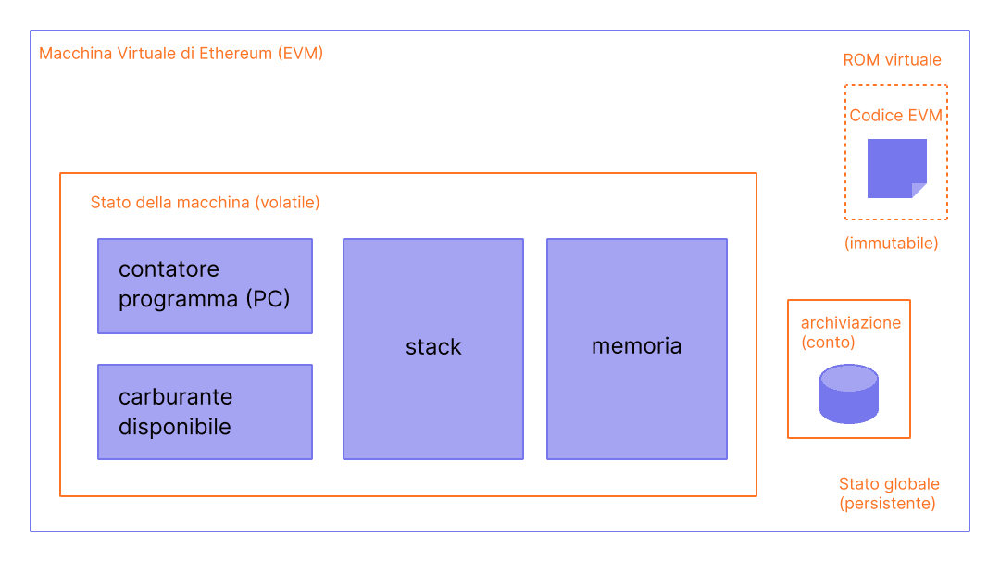

La Macchina Virtuale di Ethereum (EVM) è un ambiente virtuale decentralizzato che esegue codice in modo coerente e sicuro su tutti i nodi [Ethereum](/). I nodi eseguono l'EVM per eseguire i contratti intelligenti, utilizzando il "[gas](/developers/docs/gas/)" per misurare lo sforzo computazionale richiesto per le [operazioni](/developers/docs/evm/opcodes/), garantendo un'allocazione efficiente delle risorse e la sicurezza della rete.

## Prerequisiti {#prerequisites}

Per comprendere l'EVM è necessaria una certa familiarità di base con la terminologia comune dell'informatica, come [byte](https://wikipedia.org/wiki/Byte), [memoria](https://wikipedia.org/wiki/Computer_memory) e [stack](<https://wikipedia.org/wiki/Stack_(abstract_data_type)>). Sarebbe inoltre utile avere dimestichezza con i concetti di crittografia/blockchain come le [funzioni di hash](https://wikipedia.org/wiki/Cryptographic_hash_function) e l'[albero di Merkle](https://wikipedia.org/wiki/Merkle_tree).

## Dal registro alla macchina a stati {#from-ledger-to-state-machine}

L'analogia di un "registro distribuito" è spesso usata per descrivere blockchain come Bitcoin, che abilitano una valuta decentralizzata utilizzando strumenti fondamentali di crittografia. Il registro mantiene uno storico delle attività che deve aderire a un insieme di regole che governano ciò che qualcuno può e non può fare per modificare il registro. Ad esempio, un indirizzo Bitcoin non può spendere più Bitcoin di quanti ne abbia ricevuti in precedenza. Queste regole sono alla base di tutte le transazioni su Bitcoin e su molte altre blockchain.

Sebbene Ethereum abbia la propria criptovaluta nativa (ether) che segue quasi esattamente le stesse regole intuitive, abilita anche una funzione molto più potente: i [contratti intelligenti](/developers/docs/smart-contracts/). Per questa funzionalità più complessa, è necessaria un'analogia più sofisticata. Invece di un registro distribuito, Ethereum è una [macchina a stati](https://wikipedia.org/wiki/Finite-state_machine) distribuita. Lo stato di Ethereum è una grande struttura dati che contiene non solo tutti gli account e i saldi, ma uno _stato della macchina_, che può cambiare da blocco a blocco secondo un insieme predefinito di regole e che può eseguire codice macchina arbitrario. Le regole specifiche per il cambiamento di stato da blocco a blocco sono definite dall'EVM.


_Diagramma adattato da [Ethereum EVM illustrated](https://takenobu-hs.github.io/downloads/ethereum_evm_illustrated.pdf)_

## La funzione di transizione di stato di Ethereum {#the-ethereum-state-transition-function}

L'EVM si comporta come farebbe una funzione matematica: dato un input, produce un output deterministico. È quindi piuttosto utile descrivere più formalmente Ethereum come avente una **funzione di transizione di stato**:

```
Y(S, T)= S'
```

Dato un vecchio stato valido `(S)` e un nuovo insieme di transazioni valide `(T)`, la funzione di transizione di stato di Ethereum `Y(S, T)` produce un nuovo stato di output valido `S'`

### Stato {#state}

Nel contesto di Ethereum, lo stato è un'enorme struttura dati chiamata [Trie di Merkle Patricia modificato](/developers/docs/data-structures-and-encoding/patricia-merkle-trie/), che mantiene tutti gli [account](/developers/docs/accounts/) collegati da hash e riducibili a un singolo hash radice memorizzato sulla blockchain.

### Transazioni {#transactions}

Le transazioni sono istruzioni firmate crittograficamente dagli account. Esistono due tipi di transazioni: quelle che risultano in chiamate di messaggi e quelle che risultano nella creazione di contratti.

La creazione di un contratto risulta nella creazione di un nuovo account del contratto contenente il bytecode compilato del [contratto intelligente](/developers/docs/smart-contracts/anatomy/). Ogni volta che un altro account effettua una chiamata di messaggio a quel contratto, ne esegue il bytecode.

## Istruzioni dell'EVM {#evm-instructions}

L'EVM viene eseguita come una [macchina a stack](https://wikipedia.org/wiki/Stack_machine) con una profondità di 1024 elementi. Ogni elemento è una parola a 256 bit, scelta per la facilità d'uso con la crittografia a 256 bit (come gli hash Keccak-256 o le firme secp256k1).

Durante l'esecuzione, l'EVM mantiene una _memoria_ transitoria (come un array di byte indirizzato a parole), che non persiste tra le transazioni.

### Archiviazione transitoria

L'archiviazione transitoria è un archivio chiave-valore per transazione a cui si accede tramite gli opcode `TSTORE` e `TLOAD`. Persiste attraverso tutte le chiamate interne durante la stessa transazione, ma viene cancellata alla fine della transazione. A differenza della memoria, l'archiviazione transitoria è modellata come parte dello stato dell'EVM piuttosto che del frame di esecuzione, eppure non viene confermata nello stato globale. L'archiviazione transitoria consente la condivisione temporanea dello stato in modo efficiente in termini di gas tra le chiamate interne durante una transazione.

### Archiviazione

I contratti contengono un trie di _archiviazione_ di Merkle Patricia (come un array di parole indirizzabile a parole), associato all'account in questione e parte dello stato globale. Questa archiviazione persistente differisce dall'archiviazione transitoria, che è disponibile solo per la durata di una singola transazione e non fa parte del trie di archiviazione persistente dell'account.

### Opcode

Il bytecode compilato del contratto intelligente viene eseguito come una serie di [opcode](/developers/docs/evm/opcodes) dell'EVM, che eseguono operazioni standard di stack come `XOR`, `AND`, `ADD`, `SUB`, ecc. L'EVM implementa anche una serie di operazioni di stack specifiche per la blockchain, come `ADDRESS`, `BALANCE`, `BLOCKHASH`, ecc. Il set di opcode include anche `TSTORE` e `TLOAD`, che forniscono l'accesso all'archiviazione transitoria.


_Diagrammi adattati da [Ethereum EVM illustrated](https://takenobu-hs.github.io/downloads/ethereum_evm_illustrated.pdf)_

## Implementazioni dell'EVM {#evm-implementations}

Tutte le implementazioni dell'EVM devono aderire alle specifiche descritte nell'Ethereum Yellowpaper.

Nel corso dei dieci anni di storia di Ethereum, l'EVM ha subito diverse revisioni e ci sono diverse implementazioni dell'EVM in vari linguaggi di programmazione.

I [client di esecuzione](/developers/docs/nodes-and-clients/#execution-clients) di Ethereum includono un'implementazione dell'EVM. Inoltre, ci sono molteplici implementazioni indipendenti, tra cui:

- [Py-EVM](https://github.com/ethereum/py-evm) - _Python_
- [evmone](https://github.com/ethereum/evmone) - _C++_
- [ethereumjs-vm](https://github.com/ethereumjs/ethereumjs-vm) - _JavaScript_
- [revm](https://github.com/bluealloy/revm) - _Rust_

## Letture di approfondimento {#further-reading}

- [Ethereum Yellowpaper](https://ethereum.github.io/yellowpaper/paper.pdf)
- [Jellopaper aka KEVM: Semantics of EVM in K](https://jellopaper.org/)
- [The Beigepaper](https://github.com/chronaeon/beigepaper)
- [Opcode della Macchina Virtuale di Ethereum](https://www.ethervm.io/)
- [Riferimento interattivo agli opcode della Macchina Virtuale di Ethereum](https://www.evm.codes/)
- [Una breve introduzione nella documentazione di Solidity](https://docs.soliditylang.org/en/latest/introduction-to-smart-contracts.html#index-6)
- [Mastering Ethereum - The Ethereum Virtual Machine](https://github.com/ethereumbook/ethereumbook/blob/openedition/13evm.asciidoc)

## Argomenti correlati {#related-topics}

- [Gas](/developers/docs/gas/)

## Tutorial: Macchina Virtuale di Ethereum (EVM) / Opcode su Ethereum {#tutorials}

- [Comprendere le specifiche dell'EVM dello Yellow Paper](/developers/tutorials/yellow-paper-evm/) _– Una guida passo passo alle specifiche formali dell'EVM tratte dall'Ethereum Yellow Paper._
- [Ingegneria inversa di un contratto](/developers/tutorials/reverse-engineering-a-contract/) _– Come fare ingegneria inversa di un contratto intelligente compilato utilizzando gli opcode dell'EVM._