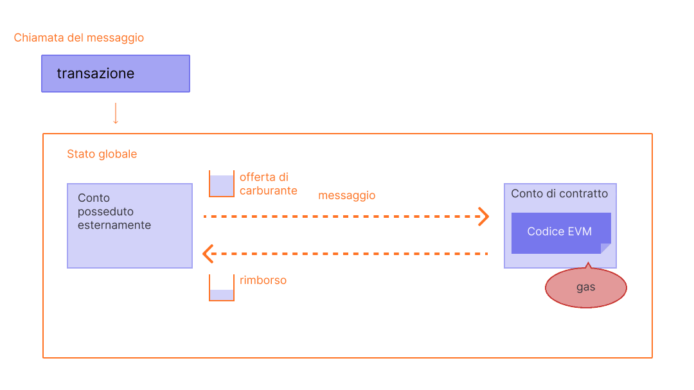

Il gas è essenziale per la rete di Ethereum. È il carburante che gli consente di operare, proprio come un'automobile lo necessita per funzionare.

## Prerequisiti {#prerequisites}

Per capire meglio questa pagina, consigliamo innanzi tutto di leggere gli argomenti su [transazioni](/developers/docs/transactions/) ed [EVM](/developers/docs/evm/).

## Cos'è il gas? {#what-is-gas}

Gas fa riferimento all'unità che misura la quantità di sforzo di calcolo necessario per eseguire operazioni specifiche sulla rete di Ethereum.

Poiché ogni transazione di Ethereum richiede risorse computazionali per essere eseguita, queste risorse devono essere pagate per assicurare che Ethereum non sia vulnerabile a spam e che non si blocchi in cicli computazionali infiniti. Il pagamento per il calcolo è fatto sotto forma di commissioni di carburante (comunemente chiamato gas).

La commissione del gas è **la quantità di gas usato per eseguire alcune operazioni, moltiplicato per il costo di una unità di gas**. La commissione viene pagata indipendentemente dal fatto che la transazione abbia successo o fallisca.

 _Diagramma adattato da [Ethereum EVM illustrato](https://takenobu-hs.github.io/downloads/ethereum_evm_illustrated.pdf)_

Le commissioni del gas devono essere pagate nella valuta nativa di Ethereum, l'ether (ETH). I prezzi del gas sono solitamente riportati in gwei, che è una sottounità di ETH. Ogni gwei equivale ad un miliardesimo di ETH (0,000000001 ETH or 10-9 ETH).

Per esempio, invece di dire che il gas costa 0,000000001 ether, puoi dire che costa 1 gwei.

La parola 'gwei' è l'abbreviazione di 'giga-wei', che significa 'miliardo di wei'. Un gwei equivale ad un miliardo di wei. Il wei (dal nome di [Wei Dai](https://wikipedia.org/wiki/Wei_Dai), creatore di [b-money](https://www.investopedia.com/terms/b/bmoney.asp)) è l'unità più piccola di ETH.

## Come sono calcolate le commissioni del gas? {#how-are-gas-fees-calculated}

Quando invii una transazione, puoi impostare la quantità di gas che sei disposto a pagare. Offrendo una certa quantità di gas, stai facendo un'offerta per includere la tua transazione nel prossimo blocco. Se offri troppo poco, i validatori saranno meno disposti a scegliere la tua transazione per includerla, il che significa che la tua transazione potrebbe essere eseguita in ritardo o non essere eseguita affatto. Se offri troppo, potresti rischiare di sprecare un po' di ETH. Quindi, come si fa a capire quanto pagare?

Il gas totale che paghi è diviso in due componenti: la `base fee` e la `priority fee` (mancia).

La `base fee` è stabilita dal protocollo - è necessario pagare almeno questo importo affinché la tua transazione sia considerata valida. La `priority fee` è una mancia che si aggiunge alla commissione base per rendere la tua transazione accattivante per i validatori in modo che la scelgano per includerla nel blocco successivo.

Una transazione che paga solo la `base fee` è tecnicamente valida ma è improbabile (che venga inclusa) perché non offre incentivi ai validatori per sceglierla rispetto ad altre transazioni. La commissione `priority` 'corretta' è determinata dall'utilizzo della rete nel momento in cui invii la transazione - se c'è molta richiesta, è possibile che tu debba impostare una commissione `priority` più alta, mentre se c'è meno domanda potrai pagare meno.

Ad esempio, ipotizziamo che Jordan debba pagare 1 ETH a Taylor. Il trasferimento di ETH richiede 21.000 unità di gas, e la commissione base è di 10 gwei. Jordan include una mancia di 2 gwei.

La commissione totale sarebbe ora pari a:

`unità di gas usato * (commissione base + commissione prioritaria)`

dove la `base fee` è il valore impostato dal protocollo e la `priority fee` è il valore impostato dall'utente come mancia per il validatore.

ovvero `21,000 * (10 + 2) = 252,000 gwei` (0,000252 ETH).

Quando Jordan invia il denaro, dal suo conto sono sottratti 1,000252 ETH. Taylor riceve un accredito di 1,0000 ETH. Il validatore riceve la mancia di 0,000042 ETH. La `base fee` di 0,00021 ETH viene bruciata.

### Commissione base {#base-fee}

Ogni blocco ha una commissione base che funge da prezzo di riserva. Per poter essere inseriti in un blocco, il prezzo offerto per il gas deve essere pari almeno alla commissione base. La commissione base è calcolata indipendentemente dal blocco corrente ed è invece determinata dai blocchi che lo precedono, il che rende le commissioni sulle transazioni più prevedibili per gli utenti. Quando il blocco viene creato questa **commissione base viene "bruciata"**, ovvero rimossa dalla circolazione.

La commissione di base è calcolata con una formula che confronta le dimensioni del blocco precedente (la quantità di gas usata per tutte le transazioni) con le dimensioni di quello corrente. La commissione base aumenta di un massimo del 12,5% per blocco se la dimensione prevista del blocco viene superata. Questa crescita esponenziale rende economicamente impensabile che la dimensione del blocco resti elevata per un tempo indefinito.

| Numero del blocco | Gas Incluso | Aumento della commissione | Tariffa base corrente |
| ----------------- | -----------:| -------------------------:| ---------------------:|
| 1                 |         15M |                        0% |              100 gwei |
| 2                 |         30M |                        0% |              100 gwei |
| 3                 |         30M |                     12,5% |            112,5 gwei |
| 4                 |         30M |                     12,5% |            126,6 gwei |
| 5                 |         30M |                     12,5% |            142,4 gwei |
| 6                 |         30M |                     12,5% |            160,2 gwei |
| 7                 |         30M |                     12,5% |            180,2 gwei |
| 8                 |         30M |                     12,5% |            202,7 gwei |

Secondo la tabella che precede, per creare una transazione sul blocco numero 9, un portafoglio indica all'utente con certezza che la **commissione base massima** da aggiungere al blocco successivo è `current base fee * 112.5%` o `202.7 gwei * 112.5% = 228.1 gwei`.

Inoltre, è importante notare che, vista la velocità con cui la commissione base aumenta mentre si avanza verso un blocco completo, è improbabile assistere a picchi prolungati di blocchi completi.

| Numero del blocco | Gas Incluso | Aumento della commissione | Tariffa base corrente |
| ----------------- | -----------:| -------------------------:| ---------------------:|
| 30                |         30M |                     12,5% |          2.705,6 gwei |
| ...               |         ... |                     12,5% |                   ... |
| 50                |         30M |                     12,5% |         28.531,3 gwei |
| ...               |         ... |                     12,5% |                   ... |
| 100               |         30M |                     12,5% |     10.302.608,6 gwei |

### Commissione prioritaria (mance) {#priority-fee}

La commissione prioritaria (mancia) incentiva i validatori ad includere una transazione nel blocco. Senza la mancia, i validatori troverebbero economicamente redditizio minare blocchi vuoti, poiché riceverebbero la stessa ricompensa per i blocchi. Mance basse offrono ai validatori un incentivo minimo ad includere una transazione. Affinché le transazioni vengano eseguite in via preferenziale prima di altre transazioni nello stesso blocco, è possibile aggiungere una mancia più alta per cercare di superare le transazioni concorrenti.

### Commissione massima {#maxfee}

Per eseguire una transazione sulla rete, gli utenti possono specificare un limite massimo che sono disposti a pagare affinché la loro transazione venga eseguita. Questo parametro facoltativo è noto come `maxFeePerGas`. Affinché una transazione venga eseguita, la commissione massima deve essere maggiore della somma della commissione base e della mancia. Il mittente della transazione riceve il rimborso della differenza tra la commissione massima e la somma della commissione base e della mancia.

### Dimensione del blocco {#block-size}

Ogni blocco ha una dimensione prevista di 15 milioni di gas, ma la dimensione dei blocchi aumenta o diminuisce in base alla domanda della rete, fino al limite massimo di 30 milioni di gas per blocco (2 volte la dimensione prevista del blocco). Il protocollo raggiunge una dimensione del blocco equilibrata di 15 milioni in media tramite il processo di _tâtonnement_. Significa che se la dimensione del blocco supera quella prevista, il protocollo aumenta la commissione base per il blocco successivo. Analogamente, il protocollo riduce la commissione base se la dimensione del blocco è inferiore a quella prevista. L'importo della commissione base si adatta proporzionalmente alla distanza della dimensione del blocco corrente rispetto a quella prevista. [Maggiori informazioni sui blocchi](/developers/docs/blocks/).

### Calcolo delle commissioni del gas in pratica {#calculating-fees-in-practice}

Puoi indicare esplicitamente quanto sei disposto a pagare per far eseguire la tua transazione. Tuttavia, la maggior parte dei fornitori di portafogli imposterà automaticamente una commissione sulla transazione consigliata (commissione base + commissione prioritaria consigliata) per ridurre la complessità che grava sui propri utenti.

## Perché esistono le commissioni del gas? {#why-do-gas-fees-exist}

In breve, le commissioni del gas aiutano a proteggere la rete di Ethereum. Richiedendo una commissione per ogni calcolo eseguito sulla rete, impediamo agli utenti malevoli di compiere spam sulla rete. Per evitare cicli infiniti accidentali od ostili oppure altri sprechi di calcolo nel codice, ogni transazione deve definire un limite al numero di passaggi di calcolo dell'esecuzione del codice che può utilizzare. L'unità fondamentale di calcolo è il "gas".

Sebbene una transazione preveda un limite, tutto il gas non utilizzato in una transazione viene rimborsato all'utente (ciò che viene restituito è: `max fee - (base fee + tip)`).

 _Diagramma adattato da [Ethereum EVM illustrato](https://takenobu-hs.github.io/downloads/ethereum_evm_illustrated.pdf)_

## Cosa è il limite del gas? {#what-is-gas-limit}

Il limite di gas si riferisce all'importo massimo di gas che sei disposto a consumare in una transazione. Le transazioni più complicate che coinvolgono i [contratti intelligenti](/developers/docs/smart-contracts/), richiedono un maggiore lavoro di calcolo e quindi un limite di gas maggiore rispetto a un semplice pagamento. Un trasferimento standard di ETH richiede un limite di gas di 21.000 unità di gas.

Ad esempio, se imposti un limite di gas di 50.000 per un semplice trasferimento di ETH, l'EVM ne consumerebbe 21.000 unità e restituirebbe le 29.000 rimanenti. Tuttavia, se specifichi troppo poco gas, ad esempio un limite di gas di 20.000 per un semplice trasferimento di ETH, l'EVM consumerà le tue 20.000 unità di gas tentando di soddisfare la transazione, ma non la completerà. A quel punto l'EVM annulla ogni modifica, ma dato che il validatore ha già eseguito un lavoro pari a 20.000 unità di gas, questo gas viene consumato.

## Perché le commissioni del gas possono essere così elevate? {#why-can-gas-fees-get-so-high}

Le commissioni del gas elevate sono dovute alla popolarità di Ethereum. Se c'è troppa domanda, gli utenti devono offrire mance più alte per cercare di superare le transazioni degli altri utenti. Una mancia più cospicua può rendere più probabile che la tua transazione troverà posto nel blocco successivo. Inoltre, le applicazioni di contratti intelligenti più complessi potrebbero dover eseguire molte operazioni per supportare le loro funzioni, consumando molto gas.

## Iniziative per ridurre i costi del gas {#initiatives-to-reduce-gas-costs}

Gli [aggiornamenti di scalabilità](/roadmap/) di Ethereum dovrebbero infine risolvere alcuni problemi delle commissioni del gas, che, a loro volta, consentiranno alla piattaforma di elaborare migliaia di transazioni al secondo e di scalare globalmente.

Il ridimensionamento del Livello 2 è un'iniziativa fondamentale per migliorare notevolmente i costi del gas, l'esperienza utente e il ridimensionamento. [Maggiori informazioni sul ridimensionamento del Livello 2](/developers/docs/scaling/#layer-2-scaling).

## Monitoraggio delle commissioni del gas {#monitoring-gas-fees}

Se desideri monitorare i prezzi del gas, così da poter inviare i tuoi ETH a un costo inferiore, puoi usare molti strumenti differenti, come:

- [Etherscan](https://etherscan.io/gastracker): _Strumento di stima del prezzo del gas delle transazioni_
- [ETH Gas Tracker](https://www.ethgastracker.com/): _Monitora e traccia i prezzi di Ethereum e del L2 per ridurre le commissioni sulle transazioni e risparmiare denaro_
- [Blocknative ETH Gas Estimator](https://chrome.google.com/webstore/detail/blocknative-eth-gas-estim/ablbagjepecncofimgjmdpnhnfjiecfm): _Estensione di stima del gas di Chrome che supporta sia transazioni ereditarie di Tipo 0 che transazioni EIP-1559 di Tipo 2._
- [Cryptoneur Gas Fees Calculator](https://www.cryptoneur.xyz/gas-fees-calculator) _Calcola le commissioni del gas nella tua valuta locale per diversi tipi di transazione sulla rete principale, su Arbitrum e su Polygon._

## Strumenti correlati {#related-tools}

- [Blocknative's Gas Platform](https://www.blocknative.com/gas): _API di stima del gas sviluppata dalla piattaforma di dati della mempool globale di Blocknative_

## Letture consigliate {#further-reading}

- [Spiegazione del Gas di Ethereum](https://defiprime.com/gas)
- [Ridurre il consumo di gas dei tuoi Contratti Intelligenti](https://medium.com/coinmonks/8-ways-of-reducing-the-gas-consumption-of-your-smart-contracts-9a506b339c0a)
- [Proof of Stake contro Proof of Work](https://blockgeeks.com/guides/proof-of-work-vs-proof-of-stake/)
- [Strategie di ottimizzazione del carburante per sviluppatori](https://www.alchemy.com/overviews/solidity-gas-optimization)
- [Documenti di EIP-1559](https://eips.ethereum.org/EIPS/eip-1559).
- [Risorse dell'EIP-1559 di Tim Beiko](https://hackmd.io/@timbeiko/1559-resources).
