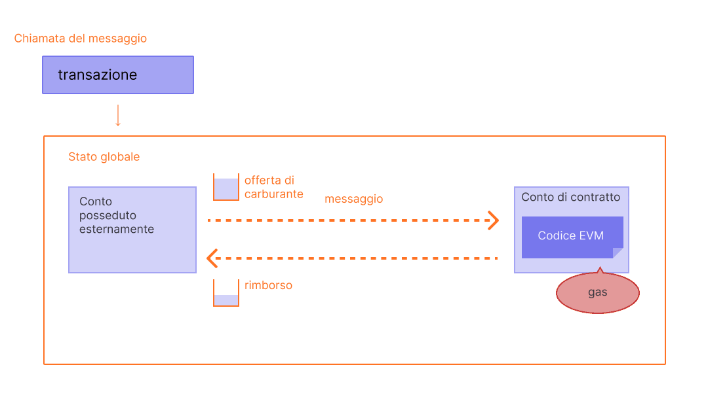

Il gas è essenziale per la rete [Ethereum](/). È il carburante che le permette di funzionare, allo stesso modo in cui un'auto ha bisogno di benzina per muoversi.

## Prerequisiti {#prerequisites}

Per comprendere meglio questa pagina, ti consigliamo di leggere prima le [transazioni](/developers/docs/transactions/) e la [EVM](/developers/docs/evm/).

## Cos'è il gas? {#what-is-gas}

Il gas si riferisce all'unità che misura la quantità di sforzo computazionale richiesto per eseguire operazioni specifiche sulla rete Ethereum.

Poiché ogni transazione di Ethereum richiede risorse computazionali per essere eseguita, tali risorse devono essere pagate per garantire che Ethereum non sia vulnerabile allo spam e non possa bloccarsi in cicli computazionali infiniti. Il pagamento per il calcolo viene effettuato sotto forma di commissione del gas.

La commissione del gas è **la quantità di gas utilizzata per eseguire un'operazione, moltiplicata per il costo per unità di gas**. La commissione viene pagata indipendentemente dal fatto che una transazione abbia successo o fallisca.

_Diagramma adattato da [Ethereum EVM illustrated](https://takenobu-hs.github.io/downloads/ethereum_evm_illustrated.pdf)_

Le commissioni del gas devono essere pagate nella valuta nativa di Ethereum, l'ether (ETH). I prezzi del gas sono solitamente quotati in gwei, che è una denominazione di ETH. Ogni gwei è pari a un miliardesimo di ETH (0,000000001 ETH o 10-9 ETH).

Ad esempio, invece di dire che il tuo gas costa 0,000000001 ether, puoi dire che il tuo gas costa 1 gwei.

La parola 'gwei' è una contrazione di 'giga-wei', che significa 'un miliardo di wei'. Un gwei è uguale a un miliardo di wei. Il wei stesso (che prende il nome da [Wei Dai](https://wikipedia.org/wiki/Wei_Dai), creatore di [b-money](https://www.investopedia.com/terms/b/bmoney.asp)) è l'unità più piccola di ETH.

## Come vengono calcolate le commissioni del gas? {#how-are-gas-fees-calculated}

Puoi impostare la quantità di gas che sei disposto a pagare quando invii una transazione. Offrendo una certa quantità di gas, fai un'offerta affinché la tua transazione venga inclusa nel blocco successivo. Se offri troppo poco, è meno probabile che i validatori scelgano la tua transazione per l'inclusione, il che significa che la tua transazione potrebbe essere eseguita in ritardo o non essere eseguita affatto. Se offri troppo, potresti sprecare degli ETH. Quindi, come fai a sapere quanto pagare?

Il gas totale che paghi è diviso in due componenti: la `commissione di base` e la `commissione di priorità` (mancia).

La `commissione di base` è impostata dal protocollo: devi pagare almeno questo importo affinché la tua transazione sia considerata valida. La `commissione di priorità` è una mancia che aggiungi alla commissione di base per rendere la tua transazione attraente per i validatori, in modo che la scelgano per l'inclusione nel blocco successivo.

Una transazione che paga solo la `commissione di base` è tecnicamente valida ma è improbabile che venga inclusa perché non offre alcun incentivo ai validatori per sceglierla rispetto a qualsiasi altra transazione. La commissione di `priorità` 'corretta' è determinata dall'utilizzo della rete nel momento in cui invii la tua transazione: se c'è molta domanda potresti dover impostare la tua commissione di `priorità` più alta, ma quando c'è meno domanda puoi pagare di meno.

Ad esempio, supponiamo che Jordan debba pagare a Taylor 1 ETH. Un trasferimento di ETH richiede 21.000 unità di gas e la commissione di base è di 10 gwei. Jordan include una mancia di 2 gwei.

La commissione totale sarebbe ora pari a:

`unità di gas utilizzate * (commissione di base + commissione di priorità)`

dove la `commissione di base` è un valore impostato dal protocollo e la `commissione di priorità` è un valore impostato dall'utente come mancia per il validatore.

es., `21.000 * (10 + 2) = 252.000 gwei` (0,000252 ETH).

Quando Jordan invia il denaro, 1,000252 ETH verranno detratti dall'account di Jordan. A Taylor verrà accreditato 1,0000 ETH. Il validatore riceve la mancia di 0,000042 ETH. La `commissione di base` di 0,00021 ETH viene bruciata.

### Commissione di base {#base-fee}

Ogni blocco ha una commissione di base che funge da prezzo di riserva. Per essere idoneo all'inclusione in un blocco, il prezzo offerto per il gas deve essere almeno pari alla commissione di base. La commissione di base è calcolata indipendentemente dal blocco corrente ed è invece determinata dai blocchi precedenti, rendendo le commissioni della transazione più prevedibili per gli utenti. Quando il blocco viene creato, questa **commissione di base viene "bruciata"**, rimuovendola dalla circolazione.

La commissione di base è calcolata da una formula che confronta la dimensione del blocco precedente (la quantità di gas utilizzata per tutte le transazioni) con la dimensione di destinazione (metà del limite del gas). La commissione di base aumenterà o diminuirà di un massimo del 12,5% per blocco se la dimensione del blocco di destinazione è rispettivamente superiore o inferiore alla destinazione. Questa crescita esponenziale rende economicamente non redditizio che la dimensione del blocco rimanga elevata a tempo indeterminato.

| Numero del Blocco | Gas Incluso | Aumento della Commissione | Commissione di Base Corrente |
| ----------------- | ----------: | ------------------------: | ---------------------------: |
| 1                 |         18M |                        0% |                     100 gwei |
| 2                 |         36M |                        0% |                     100 gwei |
| 3                 |         36M |                     12,5% |                   112,5 gwei |
| 4                 |         36M |                     12,5% |                   126,6 gwei |
| 5                 |         36M |                     12,5% |                   142,4 gwei |
| 6                 |         36M |                     12,5% |                   160,2 gwei |
| 7                 |         36M |                     12,5% |                   180,2 gwei |
| 8                 |         36M |                     12,5% |                   202,7 gwei |

Nella tabella sopra, viene dimostrato un esempio utilizzando 36 milioni come limite del gas. Seguendo questo esempio, per creare una transazione sul blocco numero 9, un portafoglio farà sapere all'utente con certezza che la **commissione di base massima** da aggiungere al blocco successivo è `commissione di base corrente * 112,5%` o `202,7 gwei * 112,5% = 228,1 gwei`.

È anche importante notare che è improbabile che vedremo picchi prolungati di blocchi pieni a causa della velocità con cui la commissione di base aumenta prima di un blocco pieno.

| Numero del Blocco | Gas Incluso | Aumento della Commissione | Commissione di Base Corrente |
| ----------------- | ----------: | ------------------------: | ---------------------------: |
| 30                |         36M |                     12,5% |                  2705,6 gwei |
| ...               |         ... |                     12,5% |                          ... |
| 50                |         36M |                     12,5% |                 28531,3 gwei |
| ...               |         ... |                     12,5% |                          ... |
| 100               |         36M |                     12,5% |              10302608,6 gwei |

### Commissione di priorità (mance) {#priority-fee}

La commissione di priorità (mancia) incentiva i validatori a massimizzare il numero di transazioni in un blocco, limitato solo dal limite del gas del blocco. Senza mance, un validatore razionale potrebbe includere meno transazioni, o persino zero, senza alcuna penalità diretta a livello di esecuzione o a livello di consenso, poiché le ricompense di staking sono indipendenti da quante transazioni ci sono in un blocco. Inoltre, le mance consentono agli utenti di superare le offerte di altri per la priorità all'interno dello stesso blocco, segnalando di fatto l'urgenza. 

### Commissione massima {#maxfee}

Per eseguire una transazione sulla rete, gli utenti possono specificare un limite massimo che sono disposti a pagare affinché la loro transazione venga eseguita. Questo parametro opzionale è noto come `maxFeePerGas`. Affinché una transazione venga eseguita, la commissione massima deve superare la somma della commissione di base e della mancia. Al mittente della transazione viene rimborsata la differenza tra la commissione massima e la somma della commissione di base e della mancia.

### Dimensione del blocco {#block-size}

Ogni blocco ha una dimensione di destinazione pari alla metà dell'attuale limite del gas, ma la dimensione dei blocchi aumenterà o diminuirà in base alla domanda della rete, fino al raggiungimento del limite del blocco (2 volte la dimensione del blocco di destinazione). Il protocollo raggiunge una dimensione media del blocco di equilibrio in corrispondenza della destinazione attraverso il processo di _tâtonnement_. Ciò significa che se la dimensione del blocco è maggiore della dimensione del blocco di destinazione, il protocollo aumenterà la commissione di base per il blocco successivo. Allo stesso modo, il protocollo diminuirà la commissione di base se la dimensione del blocco è inferiore alla dimensione del blocco di destinazione.

L'importo di cui viene adeguata la commissione di base è proporzionale a quanto la dimensione del blocco corrente si discosta dalla destinazione. Si tratta di un calcolo lineare dal -12,5% per un blocco vuoto, allo 0% alla dimensione di destinazione, fino al +12,5% per un blocco che raggiunge il limite del gas. Il limite del gas può fluttuare nel tempo in base alle segnalazioni dei validatori, nonché tramite gli aggiornamenti della rete. Puoi [visualizzare le modifiche al limite del gas nel tempo qui](https://eth.blockscout.com/stats/averageGasLimit?interval=threeMonths).

[Maggiori informazioni sui blocchi](/developers/docs/blocks/)

### Calcolare le commissioni del gas in pratica {#calculating-fees-in-practice}

Puoi dichiarare esplicitamente quanto sei disposto a pagare per far eseguire la tua transazione. Tuttavia, la maggior parte dei fornitori di portafogli imposterà automaticamente una commissione della transazione consigliata (commissione di base + commissione di priorità consigliata) per ridurre la quantità di complessità a carico dei propri utenti.

## Perché esistono le commissioni del gas? {#why-do-gas-fees-exist}

In breve, le commissioni del gas aiutano a mantenere sicura la rete Ethereum. Richiedendo una commissione per ogni calcolo eseguito sulla rete, impediamo ai malintenzionati di inviare spam sulla rete. Al fine di evitare cicli infiniti accidentali o ostili o altri sprechi computazionali nel codice, a ogni transazione è richiesto di impostare un limite a quanti passaggi computazionali di esecuzione del codice può utilizzare. L'unità fondamentale di calcolo è il "gas".

Sebbene una transazione includa un limite, qualsiasi gas non utilizzato in una transazione viene restituito all'utente (es., viene restituita la `commissione massima - (commissione di base + mancia)`).

_Diagramma adattato da [Ethereum EVM illustrated](https://takenobu-hs.github.io/downloads/ethereum_evm_illustrated.pdf)_

## Cos'è il limite del gas? {#what-is-gas-limit}

Il limite del gas si riferisce alla quantità massima di gas che sei disposto a consumare in una transazione. Le transazioni più complicate che coinvolgono [contratti intelligenti](/developers/docs/smart-contracts/) richiedono più lavoro computazionale, quindi richiedono un limite del gas più elevato rispetto a un semplice pagamento. Un trasferimento standard di ETH richiede un limite del gas di 21.000 unità di gas.

Ad esempio, se inserisci un limite del gas di 50.000 per un semplice trasferimento di ETH, la EVM ne consumerebbe 21.000 e ti verrebbero restituiti i restanti 29.000. Tuttavia, se specifichi troppo poco gas, ad esempio un limite del gas di 20.000 per un semplice trasferimento di ETH, la transazione fallirà durante la fase di convalida. Verrà rifiutata prima di essere inclusa in un blocco e non verrà consumato alcun gas. D'altra parte, se una transazione esaurisce il gas durante l'esecuzione (es., un contratto intelligente esaurisce tutto il gas a metà), la EVM annullerà qualsiasi modifica, ma tutto il gas fornito verrà comunque consumato per il lavoro svolto.

## Perché le commissioni del gas possono diventare così alte? {#why-can-gas-fees-get-so-high}

Le elevate commissioni del gas sono dovute alla popolarità di Ethereum. Se c'è troppa domanda, gli utenti devono offrire importi di mancia più elevati per cercare di superare le transazioni degli altri utenti. Una mancia più alta può rendere più probabile che la tua transazione entri nel blocco successivo. Inoltre, le app di contratti intelligenti più complesse potrebbero eseguire molte operazioni per supportare le loro funzioni, facendole consumare molto gas.

## Iniziative per ridurre i costi del gas {#initiatives-to-reduce-gas-costs}

Gli aggiornamenti per la [scalabilità](/roadmap/) di Ethereum dovrebbero in definitiva risolvere alcuni dei problemi relativi alle commissioni del gas, il che, a sua volta, consentirà alla piattaforma di elaborare migliaia di transazioni al secondo e di scalare a livello globale.

La scalabilità di livello 2 è un'iniziativa primaria per migliorare notevolmente i costi del gas, l'esperienza utente e la scalabilità.

[Maggiori informazioni sulla scalabilità di livello 2](/developers/docs/scaling/#layer-2-scaling)

## Monitorare le commissioni del gas {#monitoring-gas-fees}

Se vuoi monitorare i prezzi del gas, in modo da poter inviare i tuoi ETH a un costo inferiore, puoi utilizzare molti strumenti diversi come:

- [Etherscan](https://etherscan.io/gastracker) _Stimatore del prezzo del gas delle transazioni_
- [Blockscout](https://eth.blockscout.com/gas-tracker) _Stimatore open source del prezzo del gas delle transazioni_
- [ETH Gas Tracker](https://www.ethgastracker.com/) _Monitora e traccia i prezzi del gas di Ethereum e dei L2 per ridurre le commissioni delle transazioni e risparmiare denaro_
- [Blocknative ETH Gas Estimator](https://chrome.google.com/webstore/detail/blocknative-eth-gas-estim/ablbagjepecncofimgjmdpnhnfjiecfm) _Estensione di Chrome per la stima del gas che supporta sia le transazioni legacy di Tipo 0 che le transazioni EIP-1559 di Tipo 2._
- [Cryptoneur Gas Fees Calculator](https://www.cryptoneur.xyz/gas-fees-calculator) _Calcola le commissioni del gas nella tua valuta locale per diversi tipi di transazioni sulla rete principale, Arbitrum e Polygon._

## Strumenti correlati {#related-tools}

- [Piattaforma Gas di Blocknative](https://www.blocknative.com/gas) _API di stima del gas basata sulla piattaforma globale di dati mempool di Blocknative_
- [Gas Network](https://gas.network) Oracoli del gas on-chain. Supporto per oltre 35 catene. 

## Letture consigliate {#further-reading}

- [Spiegazione del gas di Ethereum](https://defiprime.com/gas)
- [Ridurre il consumo di gas dei tuoi contratti intelligenti](https://medium.com/coinmonks/8-ways-of-reducing-the-gas-consumption-of-your-smart-contracts-9a506b339c0a)
- [Strategie di ottimizzazione del gas per gli sviluppatori](https://www.alchemy.com/overviews/solidity-gas-optimization)
- [Documentazione EIP-1559](https://eips.ethereum.org/EIPS/eip-1559).
- [Risorse EIP-1559 di Tim Beiko](https://hackmd.io/@timbeiko/1559-resources)
- [EIP-1559: Separare i meccanismi dai meme](https://web.archive.org/web/20241126205908/https://research.2077.xyz/eip-1559-separating-mechanisms-from-memes)