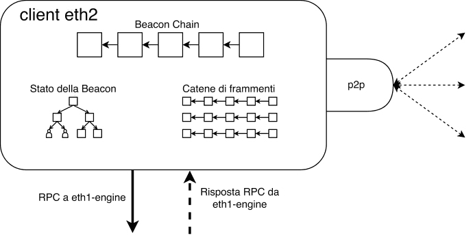

Ethereum è una rete in peer-to-peer con migliaia di nodi che devono poter comunicare gli uni con gli altri, usando dei protocolli standardizzati. Il "livello di rete" è lo stack di protocolli che consentono a quei nodi di trovarsi reciprocamente e scambiare informazioni. Questo comprende l'attività di "gossip” di informazioni (comunicazione da uno a molti) sulla rete, oltre alle richieste di scambio e le risposte tra nodi specifici (comunicazione uno a uno). Ogni nodo deve aderire a specifiche regole di rete per essere certo di inviare e ricevere le informazioni corrette.

Il software del client si compone di due parti (i client d'esecuzione e di consenso), ognuna con il proprio distinto stack di rete. Oltre a comunicare con altri nodi di Ethereum, i client d'esecuzione e di consenso devono comunicare tra loro. Questa pagina presenta una spiegazione introduttiva ai protocolli che consentono questa comunicazione.

I client d'esecuzione compiono gossip sulle transazioni sulla rete tra pari del livello d'esecuzione. Questo richiede la comunicazione crittografata tra i pari autenticati. Quando un validatore è selezionato per proporre un blocco, le transazioni dal pool di transazione locale del nodo saranno passate ai client del consenso tramite una connessione RPC locale, che sarà impacchettata in blocchi della Beacon. I client di consenso eseguiranno poi il gossip dei blocchi della Beacon Chain per la propria rete p2p. Questo richiede due reti p2p separate: una connessa ai client d'esecuzione per il gossip della transazione e una connessa ai client del consenso per il gossip del blocco.

## Prerequisiti {#prerequisites}

Per comprendere questa pagina è utile avere alcune nozioni sui [nodi e client](/developers/docs/nodes-and-clients/) di Ethereum.

## Il livello di esecuzione {#execution-layer}

I protocolli di rete del livello d'esecuzione sono divisi in due stack:

- lo stack di scoperta: basato su UDP, consente a un nuovo nodo di trovare i peer a cui connettersi

- lo stack DevP2P: basato su TCP, consente ai nodi di scambiarsi informazioni

Entrambi gli stack operano in parallelo. Lo stack di scoperta alimenta la nuova rete di partecipanti alla rete e lo stack DevP2P ne consente le interazioni.

### Scoperta {#discovery}

La scoperta è il processo con cui si trovano altri nodi nella rete. Questo processo è avviato tramite un piccolo insieme di bootnode (nodi i cui indirizzi sono [hardcoded](https://github.com/ethereum/go-ethereum/blob/master/params/bootnodes.go) nel client, in modo che possano essere trovati immediatamente e connettere il client ai peer). Questi nodi di avvio esistono solo per introdurre un nuovo nodo a una serie di peer, questo è il loro solo obiettivo, non partecipano alle normali attività del client, come la sincronizzazione della catena, e sono usati solo la primissima volta in cui il client è avviato.

Il protocollo utilizzato per le interazioni nodo-bootnode è una forma modificata di [Kademlia](https://medium.com/coinmonks/a-brief-overview-of-kademlia-and-its-use-in-various-decentralized-platforms-da08a7f72b8f) che utilizza una [tabella di hash distribuita](https://en.wikipedia.org/wiki/Distributed_hash_table) per condividere elenchi di nodi. Ogni nodo ha una versione di questa tabella, contenente le informazioni necessarie per connettersi ai propri peer più vicini. Questa “vicinanza” non è geografica: la distanza è definita dalla somiglianza dell'ID del nodo. Come funzionalità di sicurezza, ogni tabella del nodo è aggiornata regolarmente. Ad esempio, nel protocollo di scoperta [Discv5](https://github.com/ethereum/devp2p/tree/master/discv5), i nodi sono anche in grado di inviare 'annunci' che mostrano i sottoprocolli supportati dal client, consentendo ai peer di negoziare i protocolli che entrambi possono utilizzare per comunicare.

La scoperta inizia con una partita di PING-PONG. Un PING-PONG di successo "lega" il nuovo nodo a un nodo d'avvio. Il messaggio iniziale che avvisa un bootnode dell'esistenza di un nuovo nodo che entra nella rete è un `PING`. Questo `PING` include informazioni con hash sul nuovo nodo, il bootnode e una marca temporale di scadenza. Il bootnode riceve il `PING` e restituisce un `PONG` contenente l'hash del `PING`. Se gli hash di `PING` e `PONG` corrispondono, la connessione tra il nuovo nodo e il bootnode viene verificata e si dice che sono "legati".

Una volta legato, il nuovo nodo può inviare una richiesta `FIND-NEIGHBOURS` al bootnode. I dati restituiti dal nodo d'avvio includono un elenco di peer a cui il nuovo nodo può connettersi. Se i nodi non sono legati, la richiesta `FIND-NEIGHBOURS` non andrà a buon fine, quindi il nuovo nodo non potrà entrare nella rete.

Una volta che il nodo riceve un elenco di vicini dal nodo d'avvio, inizia con ognuno di essi, uno scambio di PING-PONG. I PING-PONG riusciti legano il nuovo nodo ai suoi vicini, consentendo lo scambio di messaggi.

```
avvia client --> connettiti al bootnode --> legati al bootnode --> trova vicini --> legati ai vicini
```

I client di esecuzione stanno attualmente utilizzando il protocollo di scoperta [Discv4](https://github.com/ethereum/devp2p/blob/master/discv4.md) e c'è un impegno attivo per migrare al protocollo [Discv5](https://github.com/ethereum/devp2p/tree/master/discv5).

#### ENR: Ethereum Node Record {#enr}

L'[Ethereum Node Record (ENR)](/developers/docs/networking-layer/network-addresses/) è un oggetto che contiene tre elementi di base: una firma (hash del contenuto del record creato secondo uno schema di identità concordato), un numero di sequenza che tiene traccia delle modifiche al record e un elenco arbitrario di coppie chiave:valore. Questo è un formato a prova di futuro che consente uno scambio più semplice di informazioni identificative tra nuovi peer ed è il formato di [indirizzo di rete](/developers/docs/networking-layer/network-addresses) preferito per i nodi di Ethereum.

#### Perché la scoperta è basata su UDP? Perché UDP? {#why-udp}

UDP non supporta le funzioni di controllo degli errori, reinvio di pacchetti non giunti a destinazione o apertura e chiusura dinamica delle connessioni, al contrario si limita a mandare un flusso continuo di informazioni a un destinatario, indipendentemente dal fatto che queste siano state correttamente ricevute. Questa funzionalità minima si traduce anche in overhead minimi, che rendono molto veloce questo tipo di connessione. Per la scoperta, in cui un nodo vuole solo comunicare la propria presenza per poter poi stabilire una connessione formale con un peer, UDP è sufficiente. Per il resto dello stack di rete, invece, UDP non è adatto. Lo scambio informativo tra nodi è abbastanza complesso e necessita dunque di un protocollo più completo di funzionalità, che possa supportare il reinvio, la verifica degli errori, etc. L’overhead aggiuntivo associato a TCP vale le maggiori funzionalità. Dunque, la maggioranza dello stack P2P opera su TCP.

### DevP2P {#devp2p}

DevP2P è esso stesso un intero stack di protocolli che Ethereum implementa per stabilire e mantenere la rete tra peer-to-peer. Dopo che i nuovi nodi entrano nella rete, le loro interazioni sono governate dai protocolli nello stack [DevP2P](https://github.com/ethereum/devp2p). Questi si basano tutti su TCP e includono il protocollo di trasporto RLPx, il protocollo via cavo e diversi protocolli secondari. [RLPx](https://github.com/ethereum/devp2p/blob/master/rlpx.md) è il protocollo che governa l'avvio, l'autenticazione e il mantenimento delle sessioni tra i nodi. RLPx codifica i messaggi usando il RLP (Recursive Length Prefix), un metodo molto efficiente in termini di spazio che codifica i dati in una struttura minimale per l'invio tra nodi.

Una sessione di RLPx tra due nodi inizia con un "handshaking" crittografico iniziale, in cui il nodo invia un messaggio d'autenticazione, poi verificato dal peer. Se la verifica va a buon fine, il peer genera un messaggio di riconoscimento dell'autenticazione da restituire al nodo iniziatore. Si tratta di un processo di scambio di chiavi che consente ai nodi di comunicare privatamente e in sicurezza. Un "handshaking" crittografico andato a buon fine attiva poi entrambi i nodi spingendoli a inviare un messaggio "hello" all'altro "on the wire". Il protocollo via cavo è avviato da uno scambio di messaggi di saluto andato a buon fine.

Il messaggio di saluto contiene:

- versione del protocollo
- ID del client
- porta
- ID del nodo
- elenco di protocolli secondari supportati

Queste sono le informazioni necessarie affinché l'interazione vada a buon fine, poiché definiscono quali capacità sono condivise tra entrambi i nodi e configurano la comunicazione. Esiste un processo di negoziazione secondario in cui vengono confrontati gli elenchi di protocolli secondari supportati da ogni nodo, potendo utilizzare nella sessione quelli comuni ad entrambi i nodi.

Insieme ai messaggi di saluto, il protocollo via cavo può anche inviare un messaggio "disconnect" che avvisa un peer che la connessione sarà chiusa. Il protocollo via cavo prevede anche messaggi PING e PONG, inviati periodicamente per mantenere aperta una sessione. Gli scambi dei protocolli RLPx e via cavo stabiliscono dunque le fondamenta della comunicazione tra i nodi, fornendo l'impalcatura per le informazioni utili da scambiare secondo un protocollo secondario specifico.

### Sottoprotocolli {#sub-protocols}

#### Protocollo wire {#wire-protocol}

Una volta che i pari sono connessi e che una sessione RLPx è stata avviata, il protocollo via cavo definisce come comunicano i pari. Inizialmente, il protocollo via cavo definiva tre mansioni principali: la sincronizzazione della catena, la propagazione del blocco e lo scambio di transazioni. Tuttavia, una volta che Ethereum è passato al proof-of-stake, la propagazione dei blocchi e la sincronizzazione della catena sono divenuti parte del livello di consenso. Lo scambio di transazioni è ancora di competenza dei client d'esecuzione. Lo scambio di transazioni si riferisce allo scambio di transazioni in sospeso tra nodi in modo che i costruttori di blocchi possano selezionarne alcune per includerle nel blocco successivo. Informazioni dettagliate su queste attività sono disponibili [qui](https://github.com/ethereum/devp2p/blob/master/caps/eth.md). I client che supportano questi sottoprotocolli li espongono tramite [JSON-RPC](/developers/docs/apis/json-rpc/).

#### les (sottoprotocollo leggero di Ethereum) {#les}

Si tratta di un protocollo minimale per sincronizzare i client leggeri. Tradizionalmente, questo protocollo è stato raramente usato perché i nodi completi devono servire i dati ai client leggeri senza esser incentivati. Il comportamento predefinito dei client d'esecuzione prevede di non servire i dati al client leggero tramite les. Maggiori informazioni sono disponibili nelle [specifiche](https://github.com/ethereum/devp2p/blob/master/caps/les.md) di les.

#### Snap {#snap}

Il [protocollo snap](https://github.com/ethereum/devp2p/blob/master/caps/snap.md#ethereum-snapshot-protocol-snap) è un'estensione opzionale che consente ai peer di scambiare istantanee di stati recenti, permettendo loro di verificare i dati di account e archiviazione senza dover scaricare i nodi intermedi dell'albero di Merkle.

#### Wit (protocollo testimone) {#wit}

Il [protocollo witness](https://github.com/ethereum/devp2p/blob/master/caps/wit.md#ethereum-witness-protocol-wit) è un'estensione opzionale che consente lo scambio di testimoni di stato (state witnesses) tra peer, aiutando a sincronizzare i client con la punta della catena.

#### Whisper {#whisper}

Whisper era un protocollo che mirava a consegnare messaggistica sicura tra peer senza scrivere alcuna informazione nella blockchain. Faceva parte del protocollo via cavo DevP2P, ma è ora considerato obsoleto. Esistono altri [progetti correlati](https://wakunetwork.com/) con obiettivi simili.

## Il livello di consenso {#consensus-layer}

I client di consenso partecipano a una rete peer-to-peer distinta, con specifiche differenti. I client di consenso devono partecipare al gossip dei blocchi, in modo da poter ricevere nuovi blocchi dai peer e trasmetterli quando tocca a loro proporre dei blocchi. Analogamente al livello d'esecuzione, questo richiede innanzitutto un protocollo di scoperta, così che un nodo possa trovare dei peer e stabilire sessioni sicure per lo scambio di blocchi, attestazioni, etc.

### Scoperta {#consensus-discovery}

Similmente ai client di esecuzione, i client di consenso usano [discv5](https://github.com/ethereum/consensus-specs/blob/dev/specs/phase0/p2p-interface.md#the-discovery-domain-discv5) su UDP per trovare i peer. L'implementazione di discv5 del livello di consenso si differenzia da quella dei client di esecuzione solo perché include un adattatore che connette discv5 a uno stack [libP2P](https://libp2p.io/), deprecando DevP2P. Le sessioni di RLPx del livello d'esecuzione sono deprecate in favore dell’"handshaking" protetto del canale Noise di libP2P.

### ENR {#consensus-enr}

L'ENR per i nodi di consenso include la chiave pubblica del nodo, l'indirizzo IP, le porte UDP e TCP e due campi specifici del consenso: il campo di bit della sottorete di attestazione e la chiave `eth2`. Il primo rende più semplice ai nodi trovare dei peer, partecipando a reti secondarie di gossip d'attestazione specifiche. La chiave `eth2` contiene informazioni su quale versione della biforcazione di Ethereum il nodo sta usando, garantendo che i peer si connettano all'Ethereum giusto.

### libP2P {#libp2p}

Lo stack libP2P supporta tutte le comunicazioni dopo la scoperta. I client possono chiamare e ascoltare su IPv4 e/o IPv6, come definito nel loro EVR. I protocolli sul livello di libP2P sono suddivisibili nei domini di gossip e di req/resp.

### Gossip {#gossip}

Il dominio di gossip include tutte le informazioni che devono essere diffuse rapidamente tramite la rete. Questo include i blocchi Beacon, le prove, le attestazioni, le uscite e i tagli (slashing). La trasmissione avviene tramite libP2P gossipsub v1 e si affida a vari metadati memorizzati localmente in ogni nodo, tra cui la dimensione massima dei carichi utili di gossip da ricevere e trasmettere. Informazioni dettagliate sul dominio gossip sono disponibili [qui](https://github.com/ethereum/consensus-specs/blob/dev/specs/phase0/p2p-interface.md#the-gossip-domain-gossipsub).

### Richiesta-risposta {#request-response}

Il dominio di richiesta-risposta contiene i protocolli per i client che richiedono informazioni specifiche dai propri peer. Gli esempi includono la richiesta di blocchi Beacon specifici, corrispondenti a certi hash radice o entro un intervallo di slot. Le risposte sono sempre restituite come byte codificati SSZ con compressione Snappy.

## Perché il client di consenso preferisce SSZ a RLP? {#ssz-vs-rlp}

SSZ sta per simple serialization (serializzazione semplice). Usa offset fissi che semplificano la decodifica di singole parti di un messaggio codificato senza dover decodificare l'intera struttura, funzione molto utile per il client di consenso, che può quindi estrarre efficientemente specifiche informazioni dai messaggi codificati. È anche progettato specificamente per integrarsi ai protocolli di Merkle, con i relativi guadagni in termini di efficienza per la Merkle-zzazione. Poiché tutti gli hash nel livello di consenso sono radici di Merkle, si ottiene un miglioramento complessivo significativo. SSZ garantisce anche rappresentazioni univoche dei valori.

## Connessione dei client di esecuzione e di consenso {#connecting-clients}

I client del consenso e d'esecuzione, operano in parallelo. Devono esser connessi, così che il client del consenso possa fornire istruzioni al client d'esecuzione e che il client d'esecuzione possa passare pacchetti di transazioni al client del consenso per includerli nei blocchi della Beacon. La comunicazione tra i due client è ottenibile usando una connessione RPC locale. Un'API, nota come ['Engine-API'](https://github.com/ethereum/execution-apis/blob/main/src/engine/common.md), definisce le istruzioni inviate tra i due client. Poiché entrambi i client risiedono dietro un'identità di rete singola, condividono un ENR (Registro del Nodo di Ethereum), contenente una chiave separata per ogni client (chiave eth1 e chiave eth2).

Un sommario del flusso di controllo è mostrato di seguito, con indicazione tra parentesi dello stack di rete rilevante.

### Quando il client di consenso non è un produttore di blocchi: {#when-consensus-client-is-not-block-producer}

- Il client di consenso riceve un blocco tramite il protocollo di gossip dei blocchi (consenso p2p)
- Il client di consenso pre-valida il blocco, ossia si assicura che sia arrivato da un mittente valido con metadati corretti
- Le transazioni nel blocco sono inviate al livello d'esecuzione come un payload d'esecuzione (connessione RPC locale)
- Il livello di esecuzione esegue le transazioni e convalida lo stato nell'intestazione del blocco (ossia, verifica che gli hash corrispondano)
- Il livello d'esecuzione ripassa i dati di convalida al livello di consenso, blocco ora considerato da convalidare (connessione RPC locale)
- Il livello di consenso aggiunge il blocco alla testa della propria blockchain e lo attesta, trasmettendo l'attestazione via rete (consenso p2p)

### Quando il client di consenso è un produttore di blocchi: {#when-consensus-client-is-block-producer}

- Il client di consenso riceve notifica che è il prossimo produttore di blocchi (consenso p2p)
- Il livello di consenso chiama il metodo `create block` nel client di esecuzione (RPC locale)
- Il livello d'esecuzione accede al mempool delle transazioni, popolato dal protocollo di gossip della transazione (esecuzione p2p)
- Il client d'esecuzione impacchetta le transazioni in un blocco, esegue le transazioni e genera l'hash di un blocco
- Il client del consenso prende le transazioni e l'hash del blocco dal client d'esecuzione e li aggiunge al blocco della beacon (RPC locale)
- Il client di consenso trasmette il blocco al protocollo di gossip dei blocchi (consenso p2p)
- Gli altri client ricevono il blocco proposto tramite il protocollo di gossip dei blocchi e lo convalidano come descritto sopra (consenso p2p)

Una volta che il blocco è stato attestato da sufficienti validatori, è aggiunto alla testa della catena, giustificato e, infine, finalizzato.




Schema del livello di rete per i client di consenso e di esecuzione, da [ethresear.ch](https://ethresear.ch/t/eth1-eth2-client-relationship/7248)

## Ulteriori letture {#further-reading}

[DevP2P](https://github.com/ethereum/devp2p)
[LibP2p](https://github.com/libp2p/specs)
[Specifiche di rete del livello di consenso](https://github.com/ethereum/consensus-specs/blob/dev/specs/phase0/p2p-interface.md#enr-structure)
[Da kademlia a discv5](https://vac.dev/kademlia-to-discv5)
[Paper di Kademlia](https://pdos.csail.mit.edu/~petar/papers/maymounkov-kademlia-lncs.pdf)
[Introduzione al p2p di Ethereum](https://p2p.paris/en/talks/intro-ethereum-networking/)
[Relazione tra eth1/eth2](http://ethresear.ch/t/eth1-eth2-client-relationship/7248)
[Video sui dettagli del client di The Merge ed eth2](https://www.youtube.com/watch?v=zNIrIninMgg)
