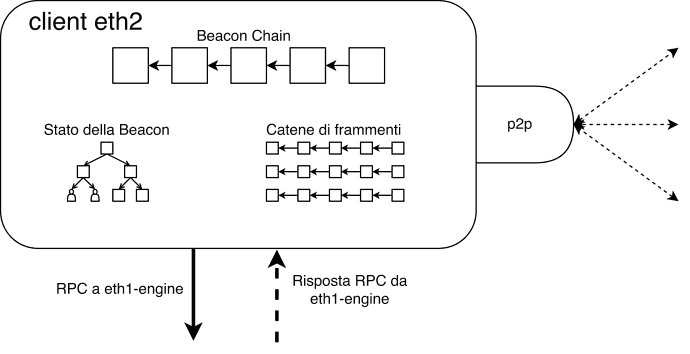

[Ethereum](/) è una rete peer-to-peer con migliaia di nodi che devono essere in grado di comunicare tra loro utilizzando protocolli standardizzati. Il "livello di rete" è lo stack di protocolli che consente a questi nodi di trovarsi a vicenda e scambiare informazioni. Ciò include il "gossiping" (pettegolezzo) di informazioni (comunicazione uno-a-molti) sulla rete, nonché lo scambio di richieste e risposte tra nodi specifici (comunicazione uno-a-uno). Ogni nodo deve aderire a regole di rete specifiche per garantire l'invio e la ricezione delle informazioni corrette.

Ci sono due parti nel software del client (client di esecuzione e client di consenso), ciascuna con il proprio stack di rete distinto. Oltre a comunicare con altri nodi di Ethereum, i client di esecuzione e di consenso devono comunicare tra loro. Questa pagina fornisce una spiegazione introduttiva dei protocolli che abilitano questa comunicazione.

I client di esecuzione diffondono (gossip) le transazioni sulla rete peer-to-peer del livello di esecuzione. Ciò richiede una comunicazione crittografata tra peer autenticati. Quando un validatore viene selezionato per proporre un blocco, le transazioni dal pool di transazioni locale del nodo verranno passate ai client di consenso tramite una connessione RPC locale, che verranno impacchettate in blocchi della Beacon chain. I client di consenso diffonderanno poi i blocchi della Beacon chain attraverso la loro rete p2p. Ciò richiede due reti p2p separate: una che collega i client di esecuzione per la diffusione delle transazioni e una che collega i client di consenso per la diffusione dei blocchi.

## Prerequisiti {#prerequisites}

Una certa conoscenza dei [nodi e client](/developers/docs/nodes-and-clients/) di Ethereum sarà utile per comprendere questa pagina.

## Il livello di esecuzione {#execution-layer}

I protocolli di rete del livello di esecuzione sono divisi in due stack:

- lo stack di scoperta (discovery): costruito su UDP e consente a un nuovo nodo di trovare peer a cui connettersi

- lo stack DevP2P: si basa su TCP e consente ai nodi di scambiare informazioni

Entrambi gli stack funzionano in parallelo. Lo stack di scoperta inserisce nuovi partecipanti nella rete e lo stack DevP2P ne abilita le interazioni.

### Scoperta (Discovery) {#discovery}

La scoperta è il processo di individuazione di altri nodi nella rete. Questo viene avviato utilizzando un piccolo set di bootnode (nodi i cui indirizzi sono [hardcoded](https://github.com/ethereum/go-ethereum/blob/master/params/bootnodes.go) nel client in modo che possano essere trovati immediatamente e connettere il client ai peer). Questi bootnode esistono solo per presentare un nuovo nodo a un set di peer: questo è il loro unico scopo, non partecipano alle normali attività del client come la sincronizzazione della catena e vengono utilizzati solo la primissima volta che un client viene avviato.

Il protocollo utilizzato per le interazioni nodo-bootnode è una forma modificata di [Kademlia](https://medium.com/coinmonks/a-brief-overview-of-kademlia-and-its-use-in-various-decentralized-platforms-da08a7f72b8f) che utilizza una [tabella di hash distribuita](https://en.wikipedia.org/wiki/Distributed_hash_table) per condividere elenchi di nodi. Ogni nodo ha una versione di questa tabella contenente le informazioni necessarie per connettersi ai suoi peer più vicini. Questa "vicinanza" non è geografica: la distanza è definita dalla somiglianza dell'ID del nodo. La tabella di ogni nodo viene regolarmente aggiornata come funzione di sicurezza. Ad esempio, in [Discv5](https://github.com/ethereum/devp2p/tree/master/discv5), i nodi del protocollo di scoperta sono anche in grado di inviare "annunci" che mostrano i sottocolli supportati dal client, consentendo ai peer di negoziare sui protocolli che entrambi possono utilizzare per comunicare.

La scoperta inizia con una partita a PING-PONG. Un PING-PONG riuscito "lega" (bond) il nuovo nodo a un bootnode. Il messaggio iniziale che avvisa un bootnode dell'esistenza di un nuovo nodo che entra nella rete è un `PING`. Questo `PING` include informazioni sottoposte a hash sul nuovo nodo, sul bootnode e su un timestamp di scadenza. Il bootnode riceve il `PING` e restituisce un `PONG` contenente l'hash del `PING`. Se gli hash di `PING` e `PONG` corrispondono, la connessione tra il nuovo nodo e il bootnode è verificata e si dice che si sono "legati".

Una volta legato, il nuovo nodo può inviare una richiesta `FIND-NEIGHBOURS` al bootnode. I dati restituiti dal bootnode includono un elenco di peer a cui il nuovo nodo può connettersi. Se i nodi non sono legati, la richiesta `FIND-NEIGHBOURS` fallirà, quindi il nuovo nodo non sarà in grado di entrare nella rete.

Una volta che il nuovo nodo riceve un elenco di vicini dal bootnode, inizia uno scambio di PING-PONG con ciascuno di essi. I PING-PONG riusciti legano il nuovo nodo ai suoi vicini, consentendo lo scambio di messaggi.

```
start client --> connect to bootnode --> bond to bootnode --> find neighbours --> bond to neighbours
```

I client di esecuzione stanno attualmente utilizzando il protocollo di scoperta [Discv4](https://github.com/ethereum/devp2p/blob/master/discv4.md) ed è in corso uno sforzo attivo per migrare al protocollo [Discv5](https://github.com/ethereum/devp2p/tree/master/discv5).

#### ENR: Record dei Nodi di Ethereum {#enr}

L'[Ethereum Node Record (ENR)](/developers/docs/networking-layer/network-addresses/) è un oggetto che contiene tre elementi di base: una firma (hash dei contenuti del record creato in base a uno schema di identità concordato), un numero di sequenza che tiene traccia delle modifiche al record e un elenco arbitrario di coppie chiave:valore. Questo è un formato a prova di futuro che consente uno scambio più semplice di informazioni identificative tra nuovi peer ed è il formato di [indirizzo di rete](/developers/docs/networking-layer/network-addresses) preferito per i nodi di Ethereum.

#### Perché la scoperta è basata su UDP? {#why-udp}

UDP non supporta alcun controllo degli errori, il reinvio di pacchetti non riusciti o l'apertura e la chiusura dinamica delle connessioni: spara semplicemente un flusso continuo di informazioni verso un bersaglio, indipendentemente dal fatto che venga ricevuto con successo. Questa funzionalità minima si traduce anche in un overhead minimo, rendendo questo tipo di connessione molto veloce. Per la scoperta, in cui un nodo vuole semplicemente far conoscere la propria presenza per poi stabilire una connessione formale con un peer, UDP è sufficiente. Tuttavia, per il resto dello stack di rete, UDP non è adatto allo scopo. Lo scambio di informazioni tra i nodi è piuttosto complesso e necessita quindi di un protocollo più completo che possa supportare il reinvio, il controllo degli errori, ecc. L'overhead aggiuntivo associato a TCP vale la funzionalità aggiuntiva. Pertanto, la maggior parte dello stack P2P opera su TCP.

### DevP2P {#devp2p}

DevP2P è di per sé un intero stack di protocolli che Ethereum implementa per stabilire e mantenere la rete peer-to-peer. Dopo che i nuovi nodi entrano nella rete, le loro interazioni sono regolate dai protocolli nello stack [DevP2P](https://github.com/ethereum/devp2p). Questi si basano tutti su TCP e includono il protocollo di trasporto RLPx, il protocollo wire e diversi sottocolli. [RLPx](https://github.com/ethereum/devp2p/blob/master/rlpx.md) è il protocollo che regola l'avvio, l'autenticazione e il mantenimento delle sessioni tra i nodi. RLPx codifica i messaggi utilizzando RLP (Recursive Length Prefix), che è un metodo molto efficiente in termini di spazio per codificare i dati in una struttura minima per l'invio tra i nodi.

Una sessione RLPx tra due nodi inizia con un handshake crittografico iniziale. Ciò comporta che il nodo invii un messaggio di autenticazione che viene poi verificato dal peer. In caso di verifica riuscita, il peer genera un messaggio di conferma dell'autenticazione da restituire al nodo iniziatore. Questo è un processo di scambio di chiavi che consente ai nodi di comunicare in modo privato e sicuro. Un handshake crittografico riuscito innesca quindi l'invio da parte di entrambi i nodi di un messaggio "hello" l'uno all'altro "on the wire" (sul cavo). Il protocollo wire viene avviato da uno scambio riuscito di messaggi hello.

I messaggi hello contengono:

- versione del protocollo
- ID del client
- porta
- ID del nodo
- elenco dei sottocolli supportati

Queste sono le informazioni necessarie per un'interazione di successo perché definiscono quali capacità sono condivise tra entrambi i nodi e configurano la comunicazione. Esiste un processo di negoziazione dei sottocolli in cui gli elenchi dei sottocolli supportati da ciascun nodo vengono confrontati e quelli comuni a entrambi i nodi possono essere utilizzati nella sessione.

Insieme ai messaggi hello, il protocollo wire può anche inviare un messaggio di "disconnessione" che avvisa un peer che la connessione verrà chiusa. Il protocollo wire include anche messaggi PING e PONG che vengono inviati periodicamente per mantenere aperta una sessione. Gli scambi RLPx e del protocollo wire stabiliscono quindi le basi della comunicazione tra i nodi, fornendo l'impalcatura per lo scambio di informazioni utili in base a uno specifico sottocollo.

### Sottocolli {#sub-protocols}

#### Protocollo wire {#wire-protocol}

Una volta che i peer sono connessi e una sessione RLPx è stata avviata, il protocollo wire definisce come comunicano i peer. Inizialmente, il protocollo wire definiva tre compiti principali: sincronizzazione della catena, propagazione dei blocchi e scambio di transazioni. Tuttavia, una volta che Ethereum è passato alla prova di stake, la propagazione dei blocchi e la sincronizzazione della catena sono diventate parte del livello di consenso. Lo scambio di transazioni è ancora di competenza dei client di esecuzione. Lo scambio di transazioni si riferisce allo scambio di transazioni in sospeso tra i nodi in modo che i costruttori di blocchi possano selezionarne alcune per l'inclusione nel blocco successivo. Informazioni dettagliate su questi compiti sono disponibili [qui](https://github.com/ethereum/devp2p/blob/master/caps/eth.md). I client che supportano questi sottocolli li espongono tramite la [JSON-RPC](/developers/docs/apis/json-rpc/).

#### les (sottocollo leggero di Ethereum) {#les}

Questo è un protocollo minimo per la sincronizzazione dei client leggeri. Tradizionalmente questo protocollo è stato usato raramente perché i nodi completi sono tenuti a servire dati ai client leggeri senza essere incentivati. Il comportamento predefinito dei client di esecuzione è di non servire i dati dei client leggeri tramite les. Maggiori informazioni sono disponibili nelle [specifiche](https://github.com/ethereum/devp2p/blob/master/caps/les.md) di les.

#### Snap {#snap}

Il [protocollo snap](https://github.com/ethereum/devp2p/blob/master/caps/snap.md#ethereum-snapshot-protocol-snap) è un'estensione opzionale che consente ai peer di scambiare istantanee degli stati recenti, permettendo ai peer di verificare i dati dell'account e di archiviazione senza dover scaricare i nodi intermedi del trie di Merkle.

#### Wit (protocollo witness) {#wit}

Il [protocollo witness](https://github.com/ethereum/devp2p/blob/master/caps/wit.md#ethereum-witness-protocol-wit) è un'estensione opzionale che consente lo scambio di testimoni (witness) di stato tra i peer, aiutando a sincronizzare i client con la punta della catena.

#### Whisper {#whisper}

Whisper era un protocollo che mirava a fornire messaggistica sicura tra i peer senza scrivere alcuna informazione sulla blockchain. Faceva parte del protocollo wire DevP2P ma ora è deprecato. Esistono altri [progetti correlati](https://wakunetwork.com/) con obiettivi simili.

## Il livello di consenso {#consensus-layer}

I client di consenso partecipano a una rete peer-to-peer separata con una specifica diversa. I client di consenso devono partecipare alla diffusione dei blocchi in modo da poter ricevere nuovi blocchi dai peer e trasmetterli quando è il loro turno di essere il proponente del blocco. Similmente al livello di esecuzione, questo richiede prima un protocollo di scoperta in modo che un nodo possa trovare peer e stabilire sessioni sicure per lo scambio di blocchi, attestazioni, ecc.

### Scoperta (Discovery) {#consensus-discovery}

Similmente ai client di esecuzione, i client di consenso utilizzano [discv5](https://github.com/ethereum/consensus-specs/blob/master/specs/phase0/p2p-interface.md#the-discovery-domain-discv5) su UDP per trovare i peer. L'implementazione del livello di consenso di discv5 differisce da quella dei client di esecuzione solo in quanto include un adattatore che collega discv5 a uno stack [libP2P](https://libp2p.io/), deprecando DevP2P. Le sessioni RLPx del livello di esecuzione sono deprecate a favore dell'handshake del canale sicuro noise di libP2P.

### ENR {#consensus-enr}

L'ENR per i nodi di consenso include la chiave pubblica del nodo, l'indirizzo IP, le porte UDP e TCP e due campi specifici del consenso: il campo di bit della sottorete di attestazione e la chiave `eth2`. Il primo rende più facile per i nodi trovare peer che partecipano a specifiche sottoreti di diffusione delle attestazioni. La chiave `eth2` contiene informazioni su quale versione della biforcazione (fork) di Ethereum sta utilizzando il nodo, assicurando che i peer si connettano all'Ethereum corretto.

### libP2P {#libp2p}

Lo stack libP2P supporta tutte le comunicazioni dopo la scoperta. I client possono comporre e ascoltare su IPv4 e/o IPv6 come definito nel loro ENR. I protocolli sul livello libP2P possono essere suddivisi nei domini gossip e req/resp (richiesta/risposta).

### Gossip {#gossip}

Il dominio gossip include tutte le informazioni che devono diffondersi rapidamente in tutta la rete. Questo include blocchi della beacon chain, prove, attestazioni, uscite e punizioni (slashings). Questo viene trasmesso utilizzando libP2P gossipsub v1 e si basa su vari metadati archiviati localmente in ciascun nodo, inclusa la dimensione massima dei payload di gossip da ricevere e trasmettere. Informazioni dettagliate sul dominio gossip sono disponibili [qui](https://github.com/ethereum/consensus-specs/blob/master/specs/phase0/p2p-interface.md#the-gossip-domain-gossipsub).

### Richiesta-risposta {#request-response}

Il dominio richiesta-risposta contiene protocolli per i client che richiedono informazioni specifiche ai loro peer. Gli esempi includono la richiesta di blocchi specifici della Beacon chain che corrispondono a determinati hash radice o all'interno di un intervallo di slot. Le risposte vengono sempre restituite come byte codificati SSZ compressi con snappy.

## Perché il client di consenso preferisce SSZ a RLP? {#ssz-vs-rlp}

SSZ sta per serializzazione semplice (simple serialization). Utilizza offset fissi che semplificano la decodifica di singole parti di un messaggio codificato senza dover decodificare l'intera struttura, il che è molto utile per il client di consenso in quanto può acquisire in modo efficiente parti specifiche di informazioni dai messaggi codificati. È inoltre progettato specificamente per integrarsi con i protocolli di Merkle, con i relativi guadagni di efficienza per la Merkleizzazione. Poiché tutti gli hash nel livello di consenso sono radici di Merkle, ciò si traduce in un miglioramento significativo. SSZ garantisce inoltre rappresentazioni univoche dei valori.

## Connessione dei client di esecuzione e di consenso {#connecting-clients}

Sia i client di consenso che quelli di esecuzione funzionano in parallelo. Devono essere connessi in modo che il client di consenso possa fornire istruzioni al client di esecuzione e il client di esecuzione possa passare pacchetti di transazioni al client di consenso da includere nei blocchi della Beacon chain. La comunicazione tra i due client può essere ottenuta utilizzando una connessione RPC locale. Un'API nota come ['Engine-API'](https://github.com/ethereum/execution-apis/blob/main/src/engine/common.md) definisce le istruzioni inviate tra i due client. Poiché entrambi i client si trovano dietro una singola identità di rete, condividono un ENR (Ethereum node record) che contiene una chiave separata per ciascun client (chiave eth1 e chiave eth2).

Di seguito è mostrato un riepilogo del flusso di controllo, con il relativo stack di rete tra parentesi.

### Quando il client di consenso non è il produttore del blocco: {#when-consensus-client-is-not-block-producer}

- Il client di consenso riceve un blocco tramite il protocollo di diffusione dei blocchi (p2p di consenso)
- Il client di consenso convalida preventivamente il blocco, ovvero si assicura che sia arrivato da un mittente valido con i metadati corretti
- Le transazioni nel blocco vengono inviate al livello di esecuzione come payload di esecuzione (connessione RPC locale)
- Il livello di esecuzione esegue le transazioni e convalida lo stato nell'intestazione del blocco (ovvero, controlla che gli hash corrispondano)
- Il livello di esecuzione passa i dati di convalida al livello di consenso, il blocco è ora considerato convalidato (connessione RPC locale)
- Il livello di consenso aggiunge il blocco alla testa della propria blockchain e lo attesta, trasmettendo l'attestazione sulla rete (p2p di consenso)

### Quando il client di consenso è il produttore del blocco: {#when-consensus-client-is-block-producer}

- Il client di consenso riceve l'avviso di essere il prossimo produttore del blocco (p2p di consenso)
- Il livello di consenso chiama il metodo `create block` nel client di esecuzione (RPC locale)
- Il livello di esecuzione accede alla mempool delle transazioni che è stata popolata dal protocollo di diffusione delle transazioni (p2p di esecuzione)
- Il client di esecuzione raggruppa le transazioni in un blocco, esegue le transazioni e genera un hash del blocco
- Il client di consenso preleva le transazioni e l'hash del blocco dal client di esecuzione e li aggiunge al blocco della beacon chain (RPC locale)
- Il client di consenso trasmette il blocco tramite il protocollo di diffusione dei blocchi (p2p di consenso)
- Gli altri client ricevono il blocco proposto tramite il protocollo di diffusione dei blocchi e lo convalidano come descritto sopra (p2p di consenso)

Una volta che il blocco è stato attestato da un numero sufficiente di validatori, viene aggiunto alla testa della catena, giustificato e infine finalizzato.




Schema del livello di rete per i client di consenso e di esecuzione, da [ethresear.ch](https://ethresear.ch/t/eth1-eth2-client-relationship/7248)

## Letture consigliate {#further-reading}

[DevP2P](https://github.com/ethereum/devp2p)
[LibP2p](https://github.com/libp2p/specs)
[Specifiche di rete del livello di consenso](https://github.com/ethereum/consensus-specs/blob/master/specs/phase0/p2p-interface.md#enr-structure)
[Da kademlia a discv5](https://vac.dev/kademlia-to-discv5)
[Documento su kademlia](https://pdos.csail.mit.edu/~petar/papers/maymounkov-kademlia-lncs.pdf)
[Introduzione al p2p di Ethereum](https://p2p.paris/en/talks/intro-ethereum-networking/)
[Relazione eth1/eth2](http://ethresear.ch/t/eth1-eth2-client-relationship/7248)
[Video sui dettagli del client eth2 e della fusione (merge)](https://www.youtube.com/watch?v=zNIrIninMgg)