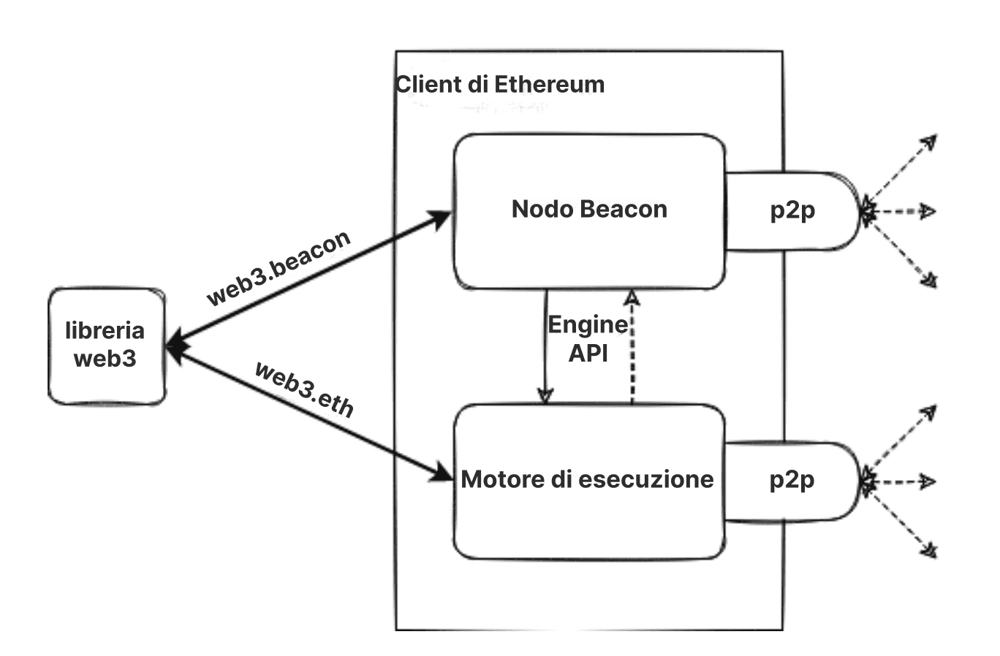
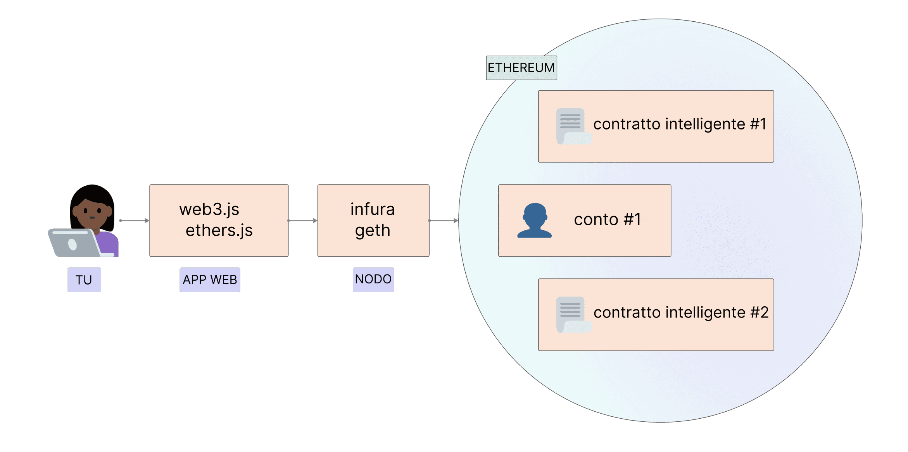

Ethereum è una rete distribuita di computer (noti come nodi) che eseguono software che possono verificare i blocchi e i dati delle transazioni. Il software deve essere eseguito sul tuo computer per trasformarlo in un nodo Ethereum. Ci sono due pezzi di software separati (chiamati "client") necessari per formare un nodo.

## Prerequisiti {#prerequisites}

Prima di approfondire ed eseguire la tua istanza di un client Ethereum dovresti comprendere il concetto di rete peer-to-peer e le [basi dell'EVM](/developers/docs/evm/). Consulta la nostra [introduzione a Ethereum](/developers/docs/intro-to-ethereum/).

Se sei nuovo al tema dei nodi, consigliamo di leggere prima la nostra introduzione user-friendly su come [eseguire un nodo di Ethereum](/run-a-node).

## Che cosa sono i nodi e i client? {#what-are-nodes-and-clients}

Un "nodo" è qualsiasi istanza del software del client di Ethereum connessa ad altri computer che stanno anch'essi eseguendo il software di Ethereum, così da formare una rete. Un client è un'implementazione di Ethereum che verifica i dati rispetto alle regole del protocollo e mantiene sicura la rete. Un nodo deve eseguire due client: un client di consenso e un client di esecuzione.

- Il client di esecuzione (noto anche come il Motore di Esecuzione, client EL o, precedentemente, client di Eth1) attende le nuove transazioni trasmesse nella rete, le esegue nell'EVM e detiene l'ultimo stato e database di tutti i dati correnti di Ethereum.
- Il client di consenso (noto anche come il Nodo Beacon, client CL o, precedentemente, client di Eth2) implementa l'algoritmo di consenso di proof-of-stake, che consente alla rete di raggiungere l'accordo secondo i dati validati dal client di esecuzione. C'è inoltre un terzo pezzo di software, chiamato "validatore" che può essere aggiunto al client di consenso, permettendo al nodo di partecipare alla messa in sicurezza della rete.

I client lavorano assieme per tenere traccia della testa della blockchain Ethereum e permettere agli utenti di interagire con la rete Ethereum. Il design modulare con molte parti di software che cooperano è detto [complessità incapsulata](https://vitalik.eth.limo/general/2022/02/28/complexity.html). Questo approccio ha semplificato l'esecuzione de [La Fusione](/roadmap/merge) senza problemi, permette di mantenere e sviluppare più facilmente il software client, e consente il riutilizzo di client individuali ad esempio nell'[ecosistema di livello 2](/layer-2/).

 Diagramma semplificato di un client di esecuzione e uno di consenso accoppiati.

### Diversità dei client {#client-diversity}

Sia i [client di esecuzione](/developers/docs/nodes-and-clients/#execution-clients) che i [client di consenso](/developers/docs/nodes-and-clients/#consensus-clients) esistono in numerosi linguaggi di programmazione sviluppati da diversi team.

Diverse implementazioni del client possono rafforzare la rete, riducendone la dipendenza da un'unica base di codice. L'obiettivo ideale è raggiungere la diversità senza che nessun client domini la rete, eliminando così eventuali un potenziale punto di errore singolo. La varietà di linguaggi invita inoltre una community di sviluppatori più ampia e consente loro di creare integrazioni nel loro linguaggio preferito.

Scopri di più sulla [diversità del client](/developers/docs/nodes-and-clients/client-diversity/).

Queste implementazioni hanno in comune il fatto di seguire una specifica unica che determina come funziona la rete Ethereum e la blockchain. Ogni dettaglio tecnico è definito e le specifiche si possono trovare come:

- In origine, lo [Yellow Paper di Ethereum](https://ethereum.github.io/yellowpaper/paper.pdf)
- [Specifiche di esecuzione](https://github.com/ethereum/execution-specs/)
- [Specifiche di consenso](https://github.com/ethereum/consensus-specs)
- [EIP](https://eips.ethereum.org/) implementati in vari [aggiornamenti di rete](/history/)

### Monitorare i nodi nella rete {#network-overview}

Diversi tracker offrono una panoramica in tempo reale dei nodi nella rete Ethereum. Si noti che a causa della natura delle reti decentralizzate, questi crawler possono fornire solo una vista limitata della rete e potrebbero riportare risultati differenti.

- [Mappa dei nodi](https://etherscan.io/nodetracker) di Etherscan
- [Ethernodes](https://ethernodes.org/) di Bitfly
- [Nodewatch](https://www.nodewatch.io/) di Chainsafe, crawling dei nodi di consenso
- [Monitoreth](https://monitoreth.io/), di MigaLabs, uno strumento di monitoraggio della rete distribuito

## Tipologie di nodo {#node-types}

Se desideri [eseguire il tuo nodo](/developers/docs/nodes-and-clients/run-a-node/), dovresti capire che ne esistono di diversi tipi che consumano i dati in maniera diversa. I client possono eseguire tre diversi tipi di nodi: leggero, completo e archivio. Esistono anche diverse strategie di sincronizzazione per velocizzare i tempi. La sincronizzazione è la velocità con cui si ottengono le informazioni più aggiornate sullo stato di Ethereum.

### Nodo completo {#full-node}

I nodi completi fanno una validazione blocco per blocco della blockchain, incluso il download e la verifica del corpo del blocco e i dati di stato per ogni blocco. Ci sono classi differenti di nodo completo - alcune iniziano dal blocco genesi e verificano ogni singolo blocco nell'intera cronologia della blockchain. Altre iniziano la loro verifica da un blocco più recente di cui confidano essere valido (ad es. "sincronizzazione snap" di Geth). Indipendentemente da dove parta la verifica, i nodi completi tengono solo una copia locale di dati relativamente recenti (tipicamente i 128 blocchi più recenti), permettendo di eliminare i dati più vecchi per risparmiare spazio sul disco. I dati più vecchi possono essere rigenerati quando è necessario.

- Memorizza i dati completi della blockchain (sebbene siano periodicamente ridotti così che un nodo completo non memorizzi tutti i dati dalla genesi)
- Partecipa alla convalida dei blocchi, verifica tutti i blocchi e gli stati.
- Tutti gli stati possono essere recuperati dalla memoria locale o rigenerati da "istantanee" da un nodo completo.
- È al servizio della rete e fornisce dati su richiesta.

### Nodo archivio {#archive-node}

I nodi archivio sono nodi completi che verificano ogni blocco da quello genesi e non eliminano mai nessuno dei dati scaricati.

- Memorizza tutto ciò che è presente nel nodo completo e crea un archivio degli stati storici. È necessario se desideri consultare qualcosa come il saldo di un conto al blocco #4.000.000 o testare in modo semplice e affidabile le tue serie di transazioni, senza minarle usando il tracciamento.
- Si tratta di terabyte e terabyte di dati, che rendono i nodi archivio meno attraenti per gli utenti medi, ma possono essere utili per servizi come block explorer, fornitori di portafogli e analisi della catena.

La sincronizzazione dei client in qualsiasi modalità diversa dall'archivio comporterà l'eliminazione dei dati della blockchain. Significa che non rimarrà un archivio di tutti gli stati storici, ma il nodo completo è in grado di ricostruirli su richiesta.

Scopri di più sui [Nodi archivio](/developers/docs/nodes-and-clients/archive-nodes).

### Nodo leggero {#light-node}

Invece di scaricare ogni blocco, i nodi leggeri scaricano solo le intestazioni dei blocchi. Queste contengono le informazioni sommarie sui contenuti dei blocchi. Ogni altra informazione di cui i nodi leggeri hanno bisogno viene richiesta a un nodo completo. Il nodo leggero può quindi verificare in modo indipendente i dati che riceve rispetto alle radici di stato nelle intestazioni dei blocchi. I nodi leggeri consentono agli utenti di partecipare alla rete Ethereum senza l'hardware potente o l'elevata larghezza di banda necessari per eseguire i nodi completi. Infine, i nodi leggeri potrebbero funzionare su telefoni cellulari o dispositivi embedded. I nodi leggeri non partecipano al consenso (es. non possono essere validatori/miner), ma possono accedere alla blockchain di Ethereum con la stessa sicurezza e avendo le stesse funzioni garantite ai nodi completi.

I client leggeri sono un'area di sviluppo attivo per Ethereum, e ci aspettiamo presto di vedere nuovi client leggeri per i livelli di consenso e i livelli di esecuzione. Esistono anche dei percorsi potenziali per fornire i dati dei client leggeri sulla [rete di gossip](https://www.ethportal.net/). Questi sono vantaggiosi perché la rete di gossip potrebbe supportare una rete di nodi leggeri senza richiedere ai nodi completi di rispondere alle richieste.

Ethereum non supporta ancora una grande popolazione di nodi leggeri, ma il supporto dei nodi leggeri è un'area in cui si prevede uno sviluppo rapido nel futuro più prossimo. In particolare, client come [Nimbus](https://nimbus.team/), [Helios](https://github.com/a16z/helios), and [LodeStar](https://lodestar.chainsafe.io/) sono attualmente fortemente focalizzati sui nodi leggeri.

## Perché si dovrebbe eseguire un nodo Ethereum? {#why-should-i-run-an-ethereum-node}

L'esecuzione di un nodo consente di utilizzare Ethereum in modo diretto, affidabile e privato, supportando la rete tenendola più solida e decentralizzata.

### Vantaggi per lo sviluppatore {#benefits-to-you}

Eseguire un nodo permette di utilizzare Ethereum in modo privato, autosufficiente e senza fiducia. Non devi fidarti della rete, perché puoi verificare i dati da solo col tuo client. "Non fidarti, verifica" è un popolare mantra della blockchain.

- Il nodo verifica in autonomia tutte le transazioni e i blocchi in base alle regole del consenso. Significa che non si deve fare affidamento su altri nodi della rete né fidarti completamente di loro.
- Puoi usare un portafoglio Ethereum col tuo nodo. Puoi usare le dapp con maggiore sicurezza e privacy, perché non dovrai comunicare i tuoi indirizzi e saldi a intermediari. Tutto può essere controllato con il tuo client. [MetaMask](https://metamask.io), [Frame](https://frame.sh/)e [molti altri portafogli](/wallets/find-wallet/) offrono l'importazione RPC, consentendo loro di usare il tuo nodo.
- Puoi eseguire e hostare tu stesso altri servizi che dipendono dai dati provenienti da Ethereum. Ad esempio, questi potrebbero essere un validatore della Beacon Chain, software come il livello 2, infrastruttura, block explorer, società di servizi di pagamento, ecc.
- Puoi fornire i tuoi [endpoint RPC](/developers/docs/apis/json-rpc/) personalizzati. Potresti anche offrire questi endpoint pubblicamente alla community per aiutarli a evitare i grandi provider centralizzati.
- Puoi connetterti al tuo nodo usando le **Comunicazioni interprecessuali (IPC)** o riscrivere il nodo per caricare il tuo programma come plugin. Ciò conferisce una bassa latenza, il che aiuta molto ad esempio quando si elaborano molti dati usando le librerie web3 o quando ti serve sostituire le tue transazioni il più velocemente possibile (frontrunning).
- Puoi mettere ETH direttamente in staking per proteggere la rete e guadagnare ricompense. Per iniziare, vedi lo [staking in autonomia](/staking/solo/).

### Vantaggi per la rete {#network-benefits}

Avere una serie diversificata di nodi è importante per l'integrità, la sicurezza e la resilienza operativa di Ethereum.

- I nodi completi applicano le regole di consenso e quindi non possono essere ingannati ad accettare blocchi che non li seguono. Questo fornisce ulteriore sicurezza nella rete, perché se tutti i nodi fossero leggeri, cioè non effettuassero una verifica completa, i validatori potrebbero attaccare la rete.
- Nel caso di un attacco che superi le difese cripto-economiche del [Proof of Stake](/developers/docs/consensus-mechanisms/pos/#what-is-pos), può essere eseguito un recupero sociale dai nodi completi che scelgono di seguire la catena onesta.
- Più nodi sulla rete risultano in una rete più diversificata e robusta, l'obiettivo ultimo della decentralizzazione, che consente un sistema resistente alla censura e affidabile.
- I nodi completi forniscono accesso ai dati della blockchain per i client leggeri che dipendono da essa. I nodi leggeri non memorizzano l'intera blockchain, bensì verificano i dati attraverso le [radici di stato nelle intestazioni dei blocchi](/developers/docs/blocks/#block-anatomy). Se ne hanno bisogno, possono richiedere ulteriori informazioni ai nodi completi.

Se si esegue un nodo completo, l'intera rete Ethereum ne beneficia, anche se non si esegue un validatore.

## Esecuzione di un nodo proprio {#running-your-own-node}

Vorresti eseguire il tuo client di Ethereum?

Per un'introduzione per principianti, visita la nostra pagina [eseguire un nodo](/run-a-node) per saperne di più.

Se sei un utente più tecnico, approfondisci i dettagli e le opzioni su come [avviare il tuo nodo](/developers/docs/nodes-and-clients/run-a-node/).

## Alternative {#alternatives}

Configurare un nodo può richiedere tempo e risorse e non sempre è necessario eseguire un'istanza propria. In questo caso, puoi usare un provider di API terzo. Per una panoramica sull'uso di questi servizi, dai un'occhiata a [nodi come servizi](/developers/docs/nodes-and-clients/nodes-as-a-service/).

Se qualcuno esegue un nodo Ethereum con un'API pubblica nella tua community, puoi puntare i tuoi portafogli a un nodo della community tramite RPC personalizzato e ottenere più privacy rispetto a terze parti casuali affidabili.

D'altro canto, se esegui un client, puoi condividerlo con i amici che potrebbero averne bisogno.

## Client di esecuzione {#execution-clients}

La community di Ethereum mantiene numerosi client di esecuzione open source (precedentemente noti come 'client di Eth1' o semplicemente 'client di Ethereum'), sviluppati da diversi team usando diversi linguaggi di programmazione. Questo rafforza la rete e la rende più [diversificata](/developers/docs/nodes-and-clients/client-diversity/). L'obiettivo ideale è raggiungere la diversità senza che nessun client prevalga, per ridurre eventuali punti di errore singoli.

Questa tabella riepiloga i diversi client. Tutti superano i [test dei client](https://github.com/ethereum/tests) e sono mantenuti attivamente per rimanere al passo con gli aggiornamenti di rete.

| Client                                                                   | Linguaggio | Sistemi operativi     | Reti                              | Strategie di sincronizzazione                                       | Cancellazione dello stato |
| ------------------------------------------------------------------------ | ---------- | --------------------- | --------------------------------- | ------------------------------------------------------------------- | ------------------------- |
| [Geth](https://geth.ethereum.org/)                                       | Vai        | Linux, Windows, macOS | Rete Principale, Sepolia, Holesky | [Snap](#snap-sync), [Completa](#full-sync)                          | Archiviata, Tagliata      |
| [Nethermind](https://www.nethermind.io/)                                 | C#, .NET   | Linux, Windows, macOS | Rete Principale, Sepolia, Holesky | [Snap](#snap-sync) (senza servizio), Veloce, [Completa](#full-sync) | Archiviata, Tagliata      |
| [Besu](https://besu.hyperledger.org/en/stable/)                          | Java       | Linux, Windows, macOS | Rete Principale, Sepolia, Holesky | [Snap](#snap-sync), [Veloce](#fast-sync), [Completa](#full-sync)    | Archiviata, Tagliata      |
| [Erigon](https://github.com/ledgerwatch/erigon)                          | Go         | Linux, Windows, macOS | Rete Principale, Sepolia, Holesky | [Completa](#full-sync)                                              | Archiviata, Tagliata      |
| [Reth](https://reth.rs/)                                                 | Rust       | Linux, Windows, macOS | Rete Principale, Sepolia, Holesky | [Completa](#full-sync)                                              | Archiviata, Tagliata      |
| [EthereumJS](https://github.com/ethereumjs/ethereumjs-monorepo) _(beta)_ | TypeScript | Linux, Windows, macOS | Sepolia, Holesky                  | [Completa](#full-sync)                                              | Tagliata                  |

Per ulteriori informazioni sulle reti supportate, consulta [reti Ethereum](/developers/docs/networks/).

Ogni client ha vantaggi e casi d'uso differenti, quindi è necessario sceglierne uno in base alle proprie preferenze. La diversità consente implementazioni in base alle diverse caratteristiche e al pubblico di utenti. È consigliabile scegliere un client in base a funzionalità, supporto, linguaggio di programmazione o licenze.

### Besu {#besu}

Hyperledger Besu è un client Ethereum di livello aziendale per le reti pubbliche e autorizzate. Esegue tutte le funzionalità della Rete principale di Ethereum, dal monitoraggio a GraphQL, ha un monitoraggio avanzato ed è supportato da ConsensSys, entrambi in canali aperti della community e tramite SLA commerciali per le imprese. È scritto in Java con licenza Apache 2.0.

L'ampia [documentazione](https://besu.hyperledger.org/en/stable/) di Besu ti guiderà verso tutti i dettagli delle sue funzioni e configurazioni.

### Erigon {#erigon}

Erigon, precedentemente noto come Turbo-Geth, è nato come una diramazione di Go Ethereum orientata alla velocità e all'efficienza dello spazio su disco. Erigon è un'implementazione completamente riprogettata di Ethereum, correntemente scritta in Go, ma con implementazioni in altri linguaggi in via di sviluppo. L'obiettivo di Erigon è fornire un'implementazione più veloce, modulare e ottimizzata di Ethereum. Può eseguire una sincronizzazione completa del nodo archivio usando circa 2TB di spazio su disco, in meno di 3 giorni.

### Go Ethereum {#geth}

Go Ethereum (abbreviato Geth) è una delle implementazioni originali del protocollo Ethereum. Attualmente, è il client più diffuso con la più grande base di utenti e varietà di strumenti per utenti e sviluppatori. È scritto in Go, completamente open source e concesso in licenza con GNU LGPL v3.

Scopri di più su Geth nella sua [documentazione](https://geth.ethereum.org/docs/).

### Nethermind {#nethermind}

Nethermind è un'implementazione di Ethereum creata con lo stack tecnologico C # .NET, concessa in licenza con LGPL-3.0, in esecuzione su tutte le principali piattaforme, incluso ARM. Offre prestazioni eccellenti con:

- una macchina virtuale ottimizzata
- accesso allo stato
- networking e funzionalità avanzate come pannelli di controllo Prometheus/Graphana, supporto per la registrazione aziendale seq, tracciamento RPC-JSON e plug-in di analisi.

Inoltre, Nethermind vanta una [documentazione dettagliata](https://docs.nethermind.io), un efficace supporto per gli sviluppatori, una community online e un supporto disponibile 24 ore al giorno, 7 giorni su 7 per gli utenti premium.

### Reth {#reth}

Reth (abbreviazione di Rust Ethereum) è un'implementazione a nodo completo su Ethereum incentrata sull'essere facile da utilizzare, altamente modulare, veloce ed efficiente. Originariamente Reth era stata costruita e portata avanti da Paradigm, ed è concessa in licenza sotto licenze Apache e MIT.

Reth è pronta per la produzione e adatta per l'utilizzo in ambienti di importanza critica come staking o servizi con tempi di attività elevati. Funziona bene nei casi d'uso in cui sono richieste prestazioni elevate con ampi margini come RPC, MEV, indicizzazione, simulazioni e attività P2P.

Scopri di più consultando il [Reth Book](https://reth.rs/) o la [repository Reth in GitHub](https://github.com/paradigmxyz/reth?tab=readme-ov-file#reth).

### In fase di sviluppo {#execution-in-development}

Questi client sono ancora nelle prime fasi di sviluppo e non sono ancora consigliate per l'utilizzo in produzione.

#### EthereumJS {#ethereumjs}

Il client di esecuzione di EthereumJS è scritto in TypeScript e composto da svariati pacchetti, inclusi i primitivi essenziali di Ethereum rappresentati dalle classi Blocco, Transazione e Albero di Merkle-Patricia, e i componenti essenziali dei client, inclusa un'implementazione della Macchina Virtuale di Ethereum (EVM), una classe della blockchain e lo stack di rete di DevP2P.

Scopri di più leggendo la sua [documentazione](https://github.com/ethereumjs/ethereumjs-monorepo/tree/master)

## Client di consenso {#consensus-clients}

Esistono diversi client di consenso (precedentemente noti come client di "Eth2") per supportare gli [aggiornamenti del consenso](/roadmap/beacon-chain/). Sono responsabili per tutta la logica collegata al consenso, incluso l'algoritmo di scelta della diramazione, l'elaborazione di attestazioni e la gestione di ricompense e sanzioni [proof-of-stake](/developers/docs/consensus-mechanisms/pos).

| Client                                                        | Lingua     | Sistemi operativi     | Reti                                                            |
| ------------------------------------------------------------- | ---------- | --------------------- | --------------------------------------------------------------- |
| [Lighthouse](https://lighthouse.sigmaprime.io/)               | Rust       | Linux, Windows, macOS | Beacon Chain, Goerli, Pyrmont, Sepolia, Ropsten e altre         |
| [Lodestar](https://lodestar.chainsafe.io/)                    | TypeScript | Linux, Windows, macOS | Beacon Chain, Goerli, Sepolia, Ropsten e altre                  |
| [Nimbus](https://nimbus.team/)                                | Nim        | Linux, Windows, macOS | Beacon Chain, Goerli, Sepolia, Ropsten e altre                  |
| [Prysm](https://docs.prylabs.network/docs/getting-started/)   | Go         | Linux, Windows, macOS | Beacon Chain, Gnosis, Goerli, Pyrmont, Sepolia, Ropsten e altre |
| [Teku](https://consensys.net/knowledge-base/ethereum-2/teku/) | Java       | Linux, Windows, macOS | Beacon Chain, Gnosis, Goerli, Sepolia, Ropsten e altre          |
| [Grandine](https://docs.grandine.io/) (beta)                  | Rust       | Linux, Windows, macOS | Beacon Chain, Goerli, Sepolia e altre                           |

### Lighthouse {#lighthouse}

Lighthouse è un'implementazione del client di consenso scritta in Rust sotto la licenza Apache-2.0. È mantenuta da Sigma Prime ed è stabile e pronta alla produzione sin dalla genesi della Beacon Chain. È affidata a varie imprese, pool di staking e singoli individui. Mira a essere sicura, performante e interoperabile in una vasta gamma di ambienti, da PC desktop a distribuzioni automatizzate sofisticate.

La documentazione è consultabile nel [Libro su Lighthouse](https://lighthouse-book.sigmaprime.io/)

### Lodestar {#lodestar}

Lodestar è un'implementazione del client di consenso pronta alla produzione, scritta in Typescript sotto la licenza LGPL-3.0. È mantenuta da ChainSafe Systems ed è il più nuovo dei client di consenso per gli staker in autonomia, gli sviluppatori e i ricercatori. Lodestar consiste in un nodo beacon e un client del validatore, alimentato dalle implementazioni in JavaScript dei protocolli di Ethereum. Lodestar mira a migliorare l'utilizzabilità di Ethereum con client leggeri, espandere l'accessibilità a un gruppo più ampio di sviluppatori e contribuire ulteriormente alla diversità dell'ecosistema.

Maggiori informazioni si possono trovare sul nostro [sito web di Lodestar](https://lodestar.chainsafe.io/)

### Nimbus {#nimbus}

Nimbus è un'implementazione del client di consenso scritta in Nim sotto la licenza Apache-2.0. È un client pronto alla produzione in uso dagli staker in autonomia e dai pool di staking. Nimbus è progettato per l'efficienza delle risorse, rendendo facile l'esecuzione sui dispositivi con risorse limitate e le infrastrutture aziendali con uguale facilità, senza compromettere la stabilità o ricompensare le prestazioni. Un'impronta di risorse più leggera fa sì che il client abbia un maggiore margine di sicurezza quando la rete è sotto stress.

Scopri di più nella [documentazione di Nimbus](https://nimbus.guide/)

### Prysm {#prysm}

Prysm è un client di consenso completo e open source scritto in Go sotto la licenza GPL-3.0. Dispone di un'UI webapp facoltativa e da' priorità all'esperienza dell'utente, alla documentazione e alla configurabilità sia per gli utenti di staking domestico che per quelli istituzionali.

Visita la [documentazione di Prysm](https://docs.prylabs.network/docs/getting-started/) per maggiori informazioni.

### Teku {#teku}

Teku è uno dei client di genesi originali della Beacon Chain. Insieme ai soliti obiettivi (sicurezza, robustezza, stabilità, utilizzabilità, prestazioni), Teku mira specificamente a conformarsi completamente a tutti i vari standard dei client di consenso.

Teku offre opzioni di sviluppo molto flessibili. Il nodo beacon e il client del validatore possono operare insieme come un singolo processo, il che è estremamente conveniente per gli staker in autonomia, o i nodi possono operare separatamente per le operazioni di staking sofisticate. Inoltre, Teku è completamente interoperabile con [Web3Signer](https://github.com/ConsenSys/web3signer/) per firmare la sicurezza della chiave e la protezione dallo slashing.

Teku è scritto in Java ed è sotto licenza Apache 2.0. È sviluppato dal team Protocols di ConsenSys, responsabile anche di Besu e Web3Signer. Scopri di più nella [documentazione di Teku](https://docs.teku.consensys.net/en/latest/).

### Grandine {#grandine}

Grandine è un'implementazione del client di consenso scritta in Rust sotto la licenza GPL-3.0. Mantenuta dal Team principale di Grandine, è veloce, leggera e ad alte prestazioni. È adatta a un'ampia gamma di staker, da quelli in solo su dispositivi a bassa potenza, come il Raspberry Pi, ai grandi staker istituzionali che eseguono decine di migliaia di validatori.

La documentazione è consultabile sul [Manuale di Grandine](https://docs.grandine.io/)

## Modalità di sincronizzazione {#sync-modes}

Per seguire e verificare i dati correnti nella rete, il client di Ethereum deve essere sincronizzato con l'ultimo stato della rete. Ciò avviene scaricando i dati dai pari, verificandone crittograficamente l'integrità e creando un database locale della blockchain.

Le modalità di sincronizzazione rappresentano diversi approcci a questo processo, con vari compromessi. I client variano anche nella loro implementazione degli algoritmi di sincronizzazione. Fai sempre riferimento alla documentazione ufficiale del client scelto per le specifiche sull'implementazione.

### Modalità di sincronizzazione del livello di esecuzione {#execution-layer-sync-modes}

Il livello di esecuzione potrebbe essere eseguito in modi diversi per adeguarsi a casi d'uso differenti, dalla ri-esecuzione dello stato globale della blockchain alla sola sincronizzazione con la testa della catena da un punto di controllo affidabile.

#### Sincronizzazione completa {#full-sync}

Una sincronizzazione completa scarica tutti i blocchi (incluse le intestazioni e i corpi dei blocchi) e rigenera lo stato della blockchain in modo incrementale eseguendo ogni blocco dalla genesi.

- Riduce al minimo la fiducia e offre la massima sicurezza verificando ogni transazione.
- Al crescere del numero di transazioni, possono volerci giorni o persino settimane per elaborare tutte le transazioni.

I [nodi Archivio](#archive-node) eseguono una sincronizzazione completa per costruire (e conservare) uno storico completo delle modifiche apportate allo stato da ogni transazione in ogni blocco.

#### Sincronizzazione veloce {#fast-sync}

Come in una sincronizzazione completa, una sincronizzazione veloce scarica tutti i blocchi (intestazioni, transazioni e ricevute incluse). Tuttavia, invece di rielaborare le transazioni storiche, una sincronizzazione veloce si affida alle ricevute fino al raggiungimento di una testa recente, quando passa all'importazione ed elaborazione dei blocchi per fornire un nodo completo.

- Strategia di sincronizzazione veloce.
- Riduce la domanda di elaborazione, in favore dell'utilizzo della larghezza di banda.

#### Sincronizzazione snap {#snap-sync}

Anche le sincronizzazioni snap verificano la catena blocco per blocco. Tuttavia, invece di iniziare dal blocco di genesi, una sincronizzazione snap si avvia da un punto di controllo 'affidabile' più recente che è noto faccia parte della vera blockchain. Il nodo salva punti di controllo periodici mentre elimina dati più vecchi di un certo periodo. Queste istantanee sono utilizzate per rigenerare i dati di stato necessari, piuttosto che per memorizzarli per sempre.

- È la strategia di sincronizzazione più veloce, attualmente quella predefinita nella Rete Principale di Ethereum.
- Risparmia molto spazio su disco e larghezza di banda di rete senza sacrificare la sicurezza.

[Maggiori informazioni sulla sincronizzazione snap](https://github.com/ethereum/devp2p/blob/master/caps/snap.md).

#### Sincronizzazione leggera {#light-sync}

La modalità leggera del client scarica tutte le intestazioni e i dati del blocco e ne verifica alcuni casualmente. Sincronizza solo la punta della catena dal punto di controllo attendibile.

- Ottiene solo l'ultimo stato basandosi sulla fiducia negli sviluppatori e nel meccanismo di consenso.
- Client pronto all'uso con lo stato corrente della rete in pochi minuti.

**NB** La sincronizzazione leggera non funziona ancora con Ethereum proof-of-stake - una nuova versione verrà rilasciata presto!

[Maggiori informazioni sui client leggeri](/developers/docs/nodes-and-clients/light-clients/)

### Modalità di sincronizzazione del livello di consenso {#consensus-layer-sync-modes}

#### Sincronizzazione ottimistica {#optimistic-sync}

La sincronizzazione ottimistica è una strategia di sincronizzazione successiva alla Fusione, progettata per essere ad accettazione e retrocompatibile, consentendo ai nodi di esecuzione di sincronizzarsi tramite metodi stabiliti. Il motore di esecuzione può importare _ottimisticamente_ i blocchi beacon senza verificarli completamente, trovare l'ultima testa e, poi, avviare la sincronizzazione della catena coi suddetti metodi. Poi, dopo essersi rimesso in pari, il client di esecuzione informerà il client di consenso della validità delle transazioni nella Beacon Chain.

[Maggiori informazioni sulla sincronizzazione ottimistica](https://github.com/ethereum/consensus-specs/blob/dev/sync/optimistic.md)

#### Sincronizzazione del punto di controllo {#checkpoint-sync}

Una sincronizzazione dal punto di controllo, anche nota come sincronizzazione a soggettività debole, crea un'esperienza utente superiore per la sincronizzazione di un Nodo Beacon. Si basa sulle ipotesi di [soggettività debole](/developers/docs/consensus-mechanisms/pos/weak-subjectivity/), che consentono la sincronizzazione della Beacon Chain da un punto di controllo a soggettività debole recente invece che dalla genesi. Le sincronizzazioni dai punti di controllo rendono significativamente più veloce la sincronizzazione iniziale, con ipotesi di fiducia simili alla sincronizzazione dalla [genesi](/glossary/#genesis-block).

In pratica, ciò significa che il tuo nodo si connette a un servizio remoto per scaricare gli stati finalizzati di recente e continua a verificare i dati da quel punto. La terza parte che fornisce i dati è affidabile e dovrebbe essere selezionata attentamente.

Maggiori informazioni sulla [sincronizzazione del punto di controllo](https://notes.ethereum.org/@djrtwo/ws-sync-in-practice)

## Letture consigliate {#further-reading}

- [Ethereum 101 - Parte 2 - Comprendere i nodi](https://kauri.io/ethereum-101-part-2-understanding-nodes/48d5098292fd4f11b251d1b1814f0bba/a) _– Wil Barnes, 13 febbraio 2019_
- [Eseguire i nodi completi di Ethereum: una guida per i poco motivati](https://medium.com/@JustinMLeroux/running-ethereum-full-nodes-a-guide-for-the-barely-motivated-a8a13e7a0d31) _– Justin Leroux, 7 novembre 2019_

## Argomenti correlati {#related-topics}

- [Blocchi](/developers/docs/blocks/)
- [Reti](/developers/docs/networks/)

## Tutorial correlati {#related-tutorials}

- [Trasforma il tuo Raspberry Pi 4 in un nodo validatore semplicemente eseguendo il flash della scheda MicroSD - Guida d'installazione](/developers/tutorials/run-node-raspberry-pi/) _ - Esegui il flash del tuo Raspberry Pi 4, collega un cavo Ethernet, connetti il disco SSD e alimenta il dispositivo per trasformare il Raspberry Pi 4 in un nodo completo di Ethereum eseguendo il livello di esecuzione (Rete principale) e/o il livello di consenso (Beacon Chain / validatore)._
