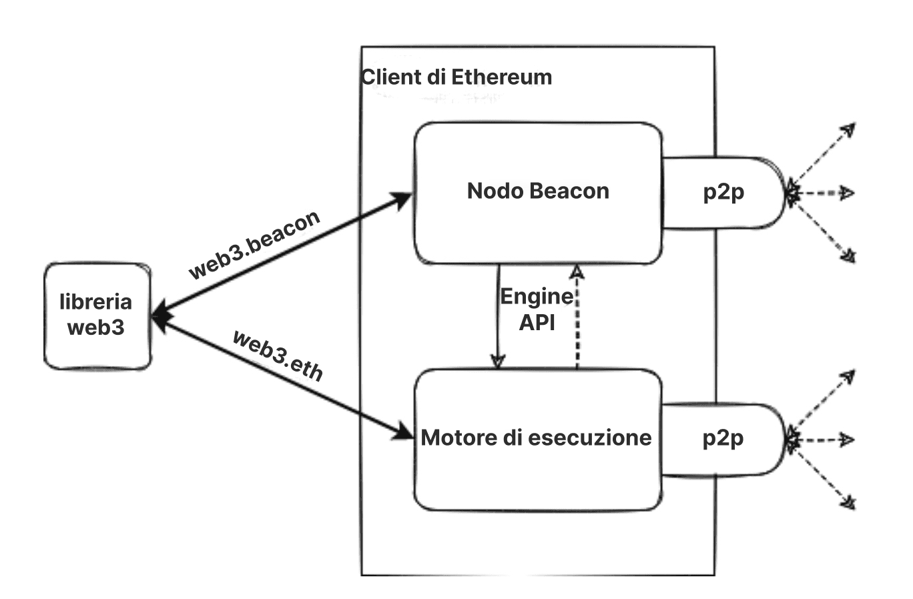
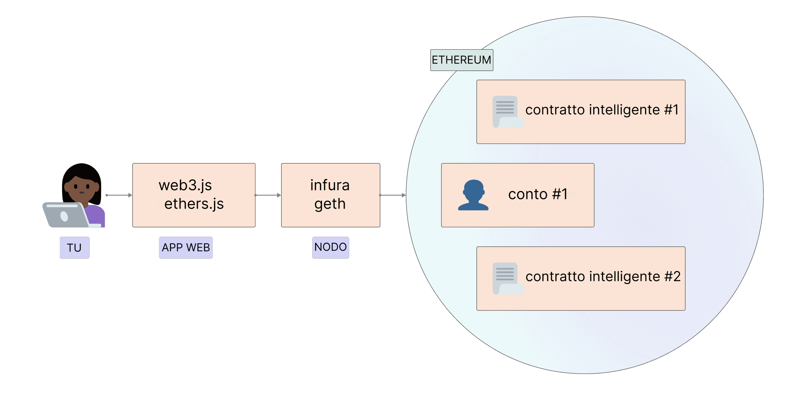

[Ethereum](/) è una rete distribuita di computer (noti come nodi) che eseguono software in grado di verificare i blocchi e i dati delle transazioni. Il software deve essere eseguito sul tuo computer per trasformarlo in un nodo di Ethereum. Sono necessari due software separati (noti come 'client') per formare un nodo.

## Prerequisiti {#prerequisites}

Dovresti comprendere il concetto di rete peer-to-peer e le [basi dell'EVM](/developers/docs/evm/) prima di approfondire ed eseguire la tua istanza di un client di Ethereum. Dai un'occhiata alla nostra [introduzione a Ethereum](/developers/docs/intro-to-ethereum/).

Se sei nuovo all'argomento dei nodi, ti consigliamo di dare prima un'occhiata alla nostra introduzione intuitiva sull'[eseguire un nodo di Ethereum](/run-a-node).

## Cosa sono i nodi e i client? {#what-are-nodes-and-clients}

Un "nodo" è qualsiasi istanza del software client di Ethereum connessa ad altri computer che eseguono a loro volta il software di Ethereum, formando una rete. Un client è un'implementazione di Ethereum che verifica i dati rispetto alle regole del protocollo e mantiene sicura la rete. Un nodo deve eseguire due client: un client di consenso e un client di esecuzione.

- Il client di esecuzione (noto anche come Motore di Esecuzione, client EL o precedentemente client Eth1) ascolta le nuove transazioni trasmesse nella rete, le esegue nell'EVM e conserva l'ultimo stato e il database di tutti i dati attuali di Ethereum.
- Il client di consenso (noto anche come Nodo Beacon, client CL o precedentemente client Eth2) implementa l'algoritmo di consenso proof-of-stake, che consente alla rete di raggiungere un accordo basato sui dati convalidati dal client di esecuzione. Esiste anche un terzo software, noto come 'validatore', che può essere aggiunto al client di consenso, consentendo a un nodo di partecipare alla messa in sicurezza della rete.

Questi client lavorano insieme per tenere traccia della testa della catena di Ethereum e consentire agli utenti di interagire con la rete di Ethereum. Il design modulare con più software che lavorano insieme è chiamato [complessità incapsulata](https://vitalik.eth.limo/general/2022/02/28/complexity.html). Questo approccio ha reso più facile eseguire [La Fusione (The Merge)](/roadmap/merge) senza interruzioni, rende il software client più facile da mantenere e sviluppare e consente il riutilizzo dei singoli client, ad esempio, nell'[ecosistema di livello 2](/layer-2/).

Diagramma semplificato di un client di esecuzione e di consenso accoppiati.

### Diversità dei client {#client-diversity}

Sia i [client di esecuzione](/developers/docs/nodes-and-clients/#execution-clients) che i [client di consenso](/developers/docs/nodes-and-clients/#consensus-clients) esistono in una varietà di linguaggi di programmazione sviluppati da team diversi.

Molteplici implementazioni di client possono rendere la rete più forte riducendo la sua dipendenza da una singola base di codice. L'obiettivo ideale è raggiungere la diversità senza che alcun client domini la rete, eliminando così un potenziale singolo punto di guasto.
La varietà di linguaggi invita anche una più ampia comunità di sviluppatori e consente loro di creare integrazioni nel loro linguaggio preferito.

Scopri di più sulla [diversità dei client](/developers/docs/nodes-and-clients/client-diversity/).

Ciò che queste implementazioni hanno in comune è che seguono tutte una singola specifica. Le specifiche dettano il funzionamento della rete e della blockchain di Ethereum. Ogni dettaglio tecnico è definito e le specifiche possono essere trovate come:

- Originariamente, l'[Ethereum Yellow Paper](https://ethereum.github.io/yellowpaper/paper.pdf)
- [Specifiche di esecuzione](https://github.com/ethereum/execution-specs/)
- [Specifiche di consenso](https://github.com/ethereum/consensus-specs)
- [EIP](https://eips.ethereum.org/) implementate in vari [aggiornamenti della rete](/ethereum-forks/)

### Tracciare i nodi nella rete {#network-overview}

Molteplici tracker offrono una panoramica in tempo reale dei nodi nella rete di Ethereum. Nota che, a causa della natura delle reti decentralizzate, questi crawler possono fornire solo una visione limitata della rete e potrebbero riportare risultati diversi.

- [Mappa dei nodi](https://etherscan.io/nodetracker) di Etherscan
- [Ethernodes](https://ethernodes.org/) di Bitfly
- [Nodewatch](https://www.nodewatch.io/) di Chainsafe, che scansiona i nodi di consenso
- [Monitoreth](https://monitoreth.io/) - di MigaLabs, uno strumento di monitoraggio della rete distribuita
- [Report settimanali sulla salute della rete](https://probelab.io) - di ProbeLab, che utilizza il [crawler Nebula](https://github.com/dennis-tra/nebula) e altri strumenti

## Tipi di nodo {#node-types}

Se desideri [eseguire il tuo nodo](/developers/docs/nodes-and-clients/run-a-node/), dovresti comprendere che esistono diversi tipi di nodo che consumano i dati in modo diverso. Infatti, i client possono eseguire tre diversi tipi di nodi: leggeri (light), completi (full) e di archivio (archive). Ci sono anche opzioni per diverse strategie di sincronizzazione che consentono tempi di sincronizzazione più rapidi. La sincronizzazione si riferisce alla rapidità con cui può ottenere le informazioni più aggiornate sullo stato di Ethereum.

### Nodo completo {#full-node}

I nodi completi eseguono una convalida blocco per blocco della blockchain, includendo il download e la verifica del corpo del blocco e dei dati di stato per ogni blocco. Esistono diverse classi di nodi completi: alcuni partono dal blocco genesi e verificano ogni singolo blocco nell'intera cronologia della blockchain. Altri iniziano la loro verifica da un blocco più recente che ritengono valido (ad es. la 'snap sync' di Geth). Indipendentemente da dove inizia la verifica, i nodi completi conservano solo una copia locale di dati relativamente recenti (in genere i 128 blocchi più recenti), consentendo l'eliminazione dei dati più vecchi per risparmiare spazio su disco. I dati più vecchi possono essere rigenerati quando necessario.

- Archivia i dati completi della blockchain (sebbene questi vengano periodicamente potati, in modo che un nodo completo non archivi tutti i dati di stato fino alla genesi).
- Partecipa alla convalida dei blocchi, verifica tutti i blocchi e gli stati.
- Tutti gli stati possono essere recuperati dall'archiviazione locale o rigenerati da 'snapshot' (istantanee) da un nodo completo.
- Serve la rete e fornisce dati su richiesta.

### Nodo di archivio {#archive-node}

I nodi di archivio sono nodi completi che verificano ogni blocco dalla genesi e non eliminano mai nessuno dei dati scaricati.

- Archivia tutto ciò che è conservato nel nodo completo e costruisce un archivio degli stati storici. È necessario se si desidera interrogare qualcosa come il saldo di un account al blocco #4.000.000, o semplicemente testare in modo affidabile il proprio set di transazioni senza convalidarle utilizzando il tracciamento.
- Questi dati rappresentano unità di terabyte, il che rende i nodi di archivio meno attraenti per gli utenti medi, ma possono essere utili per servizi come esploratori di blocchi, fornitori di portafogli e analisi della catena.

La sincronizzazione dei client in qualsiasi modalità diversa dall'archivio comporterà la potatura dei dati della blockchain. Ciò significa che non esiste un archivio di tutti gli stati storici, ma il nodo completo è in grado di costruirli su richiesta.

Scopri di più sui [Nodi di archivio](/developers/docs/nodes-and-clients/archive-nodes).

### Nodo leggero {#light-node}

Invece di scaricare ogni blocco, i nodi leggeri scaricano solo le intestazioni dei blocchi. Queste intestazioni contengono informazioni riassuntive sul contenuto dei blocchi. Qualsiasi altra informazione richiesta dal nodo leggero viene richiesta a un nodo completo. Il nodo leggero può quindi verificare in modo indipendente i dati che riceve rispetto alle radici di stato nelle intestazioni dei blocchi. I nodi leggeri consentono agli utenti di partecipare alla rete di Ethereum senza il potente hardware o l'elevata larghezza di banda richiesti per eseguire i nodi completi. In futuro, i nodi leggeri potrebbero essere eseguiti su telefoni cellulari o dispositivi integrati. I nodi leggeri non partecipano al consenso (cioè, non possono essere validatori), ma possono accedere alla blockchain di Ethereum con le stesse funzionalità e garanzie di sicurezza di un nodo completo.

I client leggeri sono un'area di sviluppo attivo per Ethereum e ci aspettiamo di vedere presto nuovi client leggeri per il livello di consenso e il livello di esecuzione.
Ci sono anche percorsi potenziali per fornire dati ai client leggeri attraverso la [rete gossip](https://www.ethportal.net/). Questo è vantaggioso perché la rete gossip potrebbe supportare una rete di nodi leggeri senza richiedere ai nodi completi di servire le richieste.

Ethereum non supporta ancora una vasta popolazione di nodi leggeri, ma il supporto per i nodi leggeri è un'area che si prevede si svilupperà rapidamente nel prossimo futuro. In particolare, client come [Nimbus](https://nimbus.team/), [Helios](https://github.com/a16z/helios) e [LodeStar](https://lodestar.chainsafe.io/) sono attualmente fortemente concentrati sui nodi leggeri.

## Perché dovrei eseguire un nodo di Ethereum? {#why-should-i-run-an-ethereum-node}

L'esecuzione di un nodo ti consente di utilizzare Ethereum in modo diretto, senza fiducia (trustless) e privato, supportando al contempo la rete mantenendola più robusta e decentralizzata.

### Vantaggi per te {#benefits-to-you}

Eseguire il tuo nodo ti consente di utilizzare Ethereum in modo privato, autosufficiente e senza fiducia. Non hai bisogno di fidarti della rete perché puoi verificare i dati tu stesso con il tuo client. "Non fidarti, verifica" è un popolare mantra della blockchain.

- Il tuo nodo verifica da solo tutte le transazioni e i blocchi rispetto alle regole di consenso. Ciò significa che non devi fare affidamento su nessun altro nodo nella rete o fidarti completamente di loro.
- Puoi utilizzare un portafoglio di Ethereum con il tuo nodo. Puoi utilizzare le dApp in modo più sicuro e privato perché non dovrai far trapelare i tuoi indirizzi e saldi agli intermediari. Tutto può essere controllato con il tuo client. [MetaMask](https://metamask.io), [Frame](https://frame.sh/) e [molti altri portafogli](/wallets/find-wallet/) offrono l'importazione RPC, consentendo loro di utilizzare il tuo nodo.
- Puoi eseguire e auto-ospitare altri servizi che dipendono dai dati di Ethereum. Ad esempio, potrebbe trattarsi di un validatore della Beacon Chain, software come il livello 2, infrastrutture, esploratori di blocchi, processori di pagamento, ecc.
- Puoi fornire i tuoi [endpoint RPC](/developers/docs/apis/json-rpc/) personalizzati. Potresti persino offrire questi endpoint pubblicamente alla comunità per aiutarli a evitare i grandi fornitori centralizzati.
- Puoi connetterti al tuo nodo utilizzando le **Comunicazioni Inter-processo (IPC)** o riscrivere il nodo per caricare il tuo programma come plugin. Questo garantisce una bassa latenza, che aiuta molto, ad es., quando si elaborano molti dati utilizzando le librerie web3 o quando è necessario sostituire le transazioni il più velocemente possibile (cioè, frontrunning).
- Puoi fare staking di ETH direttamente per proteggere la rete e guadagnare ricompense. Consulta lo [staking in solitaria](/staking/solo/) per iniziare.

### Vantaggi per la rete {#network-benefits}

Un insieme diversificato di nodi è importante per la salute, la sicurezza e la resilienza operativa di Ethereum.

- I nodi completi applicano le regole di consenso in modo da non poter essere ingannati ad accettare blocchi che non le seguono. Questo fornisce ulteriore sicurezza nella rete perché se tutti i nodi fossero nodi leggeri, che non eseguono una verifica completa, i validatori potrebbero attaccare la rete.
- In caso di un attacco che superi le difese cripto-economiche della [prova di stake (proof-of-stake)](/developers/docs/consensus-mechanisms/pos/#what-is-pos), un recupero sociale può essere eseguito dai nodi completi che scelgono di seguire la catena onesta.
- Più nodi nella rete si traducono in una rete più diversificata e robusta, l'obiettivo finale della decentralizzazione, che consente un sistema resistente alla censura e affidabile.
- I nodi completi forniscono l'accesso ai dati della blockchain per i client leggeri che ne dipendono. I nodi leggeri non archiviano l'intera blockchain, ma verificano i dati tramite le [radici di stato nelle intestazioni dei blocchi](/developers/docs/blocks/#block-anatomy). Possono richiedere maggiori informazioni ai nodi completi se ne hanno bisogno.

Se esegui un nodo completo, l'intera rete di Ethereum ne trae vantaggio, anche se non esegui un validatore.

## Eseguire il tuo nodo {#running-your-own-node}

Ti interessa eseguire il tuo client di Ethereum?

Per un'introduzione adatta ai principianti, visita la nostra pagina [eseguire un nodo](/run-a-node) per saperne di più.

Se sei un utente più tecnico, approfondisci i dettagli e le opzioni su come [avviare il tuo nodo](/developers/docs/nodes-and-clients/run-a-node/).

## Alternative {#alternatives}

Configurare il tuo nodo può costarti tempo e risorse, ma non hai sempre bisogno di eseguire la tua istanza. In questo caso, puoi utilizzare un fornitore di API di terze parti. Per una panoramica sull'utilizzo di questi servizi, dai un'occhiata ai [nodi come servizio](/developers/docs/nodes-and-clients/nodes-as-a-service/).

Se qualcuno esegue un nodo di Ethereum con un'API pubblica nella tua comunità, puoi puntare i tuoi portafogli a un nodo della comunità tramite RPC personalizzato e ottenere maggiore privacy rispetto a una terza parte fidata casuale.

D'altra parte, se esegui un client, puoi condividerlo con i tuoi amici che potrebbero averne bisogno.

## Client di esecuzione {#execution-clients}

La comunità di Ethereum mantiene molteplici client di esecuzione open source (precedentemente noti come 'client Eth1', o semplicemente 'client di Ethereum'), sviluppati da team diversi utilizzando linguaggi di programmazione diversi. Questo rende la rete più forte e più [diversificata](/developers/docs/nodes-and-clients/client-diversity/). L'obiettivo ideale è raggiungere la diversità senza che alcun client domini per ridurre eventuali singoli punti di guasto.

Questa tabella riassume i diversi client. Tutti superano i [test dei client](https://github.com/ethereum/tests) e sono attivamente mantenuti per rimanere aggiornati con gli aggiornamenti della rete.

| Client                                                                   | Linguaggio | Sistemi operativi     | Reti                      | Strategie di sincronizzazione                                  | Potatura dello stato |
| ------------------------------------------------------------------------ | ---------- | --------------------- | ------------------------- | -------------------------------------------------------------- | -------------------- |
| [Geth](https://geth.ethereum.org/)                                       | Go         | Linux, Windows, macOS | Rete principale, Sepolia, Hoodi | [Snap](#snap-sync), [Completa](#full-sync)                     | Archivio, Potato     |
| [Nethermind](https://www.nethermind.io/)                                 | C#, .NET   | Linux, Windows, macOS | Rete principale, Sepolia, Hoodi | [Snap](#snap-sync) (senza servire), Veloce, [Completa](#full-sync) | Archivio, Potato     |
| [Besu](https://besu.hyperledger.org/en/stable/)                          | Java       | Linux, Windows, macOS | Rete principale, Sepolia, Hoodi | [Snap](#snap-sync), [Veloce](#fast-sync), [Completa](#full-sync) | Archivio, Potato     |
| [Erigon](https://github.com/ledgerwatch/erigon)                          | Go         | Linux, Windows, macOS | Rete principale, Sepolia, Hoodi | [Completa](#full-sync)                                         | Archivio, Potato     |
| [Reth](https://reth.rs/)                                                 | Rust       | Linux, Windows, macOS | Rete principale, Sepolia, Hoodi | [Completa](#full-sync)                                         | Archivio, Potato     |
| [EthereumJS](https://github.com/ethereumjs/ethereumjs-monorepo) _(beta)_ | TypeScript | Linux, Windows, macOS | Sepolia, Hoodi          | [Completa](#full-sync)                                         | Potato               |

Per ulteriori informazioni sulle reti supportate, leggi le [reti di Ethereum](/developers/docs/networks/).

Ogni client ha casi d'uso e vantaggi unici, quindi dovresti sceglierne uno in base alle tue preferenze. La diversità consente alle implementazioni di concentrarsi su diverse funzionalità e segmenti di pubblico. Potresti voler scegliere un client in base a funzionalità, supporto, linguaggio di programmazione o licenze.

### Besu {#besu}

Hyperledger Besu è un client di Ethereum di livello aziendale per reti pubbliche e autorizzate. Esegue tutte le funzionalità della rete principale di Ethereum, dal tracciamento a GraphQL, dispone di un monitoraggio esteso ed è supportato da ConsenSys, sia nei canali aperti della comunità che tramite SLA commerciali per le imprese. È scritto in Java ed è concesso in licenza Apache 2.0.

L'ampia [documentazione](https://besu.hyperledger.org/en/stable/) di Besu ti guiderà attraverso tutti i dettagli sulle sue funzionalità e configurazioni.

### Erigon {#erigon}

Erigon, precedentemente noto come Turbo-Geth, è iniziato come una biforcazione (fork) di Go Ethereum orientata alla velocità e all'efficienza dello spazio su disco. Erigon è un'implementazione di Ethereum completamente riprogettata, attualmente scritta in Go ma con implementazioni in altri linguaggi in fase di sviluppo. L'obiettivo di Erigon è fornire un'implementazione di Ethereum più veloce, più modulare e più ottimizzata. Può eseguire una sincronizzazione completa del nodo di archivio utilizzando circa 2 TB di spazio su disco, in meno di 3 giorni.

### Go Ethereum {#geth}

Go Ethereum (Geth in breve) è una delle implementazioni originali del protocollo di Ethereum. Attualmente, è il client più diffuso con la più grande base di utenti e varietà di strumenti per utenti e sviluppatori. È scritto in Go, completamente open source e concesso in licenza sotto la GNU LGPL v3.

Scopri di più su Geth nella sua [documentazione](https://geth.ethereum.org/docs).

### Nethermind {#nethermind}

Nethermind è un'implementazione di Ethereum creata con lo stack tecnologico C# .NET, con licenza LGPL-3.0, in esecuzione su tutte le principali piattaforme incluso ARM. Offre ottime prestazioni con:

- una macchina virtuale ottimizzata
- accesso allo stato
- rete e ricche funzionalità come dashboard Prometheus/Grafana, supporto per la registrazione aziendale seq, tracciamento JSON-RPC e plugin di analisi.

Nethermind ha anche una [documentazione dettagliata](https://docs.nethermind.io), un forte supporto per gli sviluppatori, una comunità online e supporto 24/7 disponibile per gli utenti premium.

### Reth {#reth}

Reth (abbreviazione di Rust Ethereum) è un'implementazione di nodo completo di Ethereum incentrata sull'essere facile da usare, altamente modulare, veloce ed efficiente. Reth è stato originariamente costruito e portato avanti da Paradigm ed è concesso in licenza con le licenze Apache e MIT.

Reth è pronto per la produzione e adatto all'uso in ambienti mission-critical come lo staking o i servizi ad alto tempo di attività. Si comporta bene nei casi d'uso in cui sono richieste prestazioni elevate con ampi margini come RPC, MEV, indicizzazione, simulazioni e attività P2P.

Scopri di più consultando il [Reth Book](https://reth.rs/) o il [repository GitHub di Reth](https://github.com/paradigmxyz/reth?tab=readme-ov-file#reth).

### In fase di sviluppo {#execution-in-development}

Questi client sono ancora nelle prime fasi di sviluppo e non sono ancora raccomandati per l'uso in produzione.

#### EthereumJS {#ethereumjs}

Il client di esecuzione EthereumJS (EthereumJS) è scritto in TypeScript ed è composto da una serie di pacchetti, tra cui le primitive principali di Ethereum rappresentate dalle classi Block, Transaction e Merkle-Patricia Trie e i componenti principali del client, tra cui un'implementazione della macchina virtuale di Ethereum (EVM), una classe blockchain e lo stack di rete DevP2P.

Scopri di più leggendo la sua [documentazione](https://github.com/ethereumjs/ethereumjs-monorepo/tree/master)

## Client di consenso {#consensus-clients}

Esistono molteplici client di consenso (precedentemente noti come client 'Eth2') per supportare gli [aggiornamenti del consenso](/roadmap/beacon-chain/). Sono responsabili di tutta la logica relativa al consenso, incluso l'algoritmo di scelta della biforcazione, l'elaborazione delle attestazioni e la gestione delle ricompense e delle penalità della [prova di stake (proof-of-stake)](/developers/docs/consensus-mechanisms/pos).

| Client                                                        | Linguaggio | Sistemi operativi     | Reti                                                      |
| ------------------------------------------------------------- | ---------- | --------------------- | --------------------------------------------------------- |
| [Lighthouse](https://lighthouse.sigmaprime.io/)               | Rust       | Linux, Windows, macOS | Beacon Chain, Hoodi, Pyrmont, Sepolia e altre           |
| [Lodestar](https://lodestar.chainsafe.io/)                    | TypeScript | Linux, Windows, macOS | Beacon Chain, Hoodi, Sepolia e altre                    |
| [Nimbus](https://nimbus.team/)                                | Nim        | Linux, Windows, macOS | Beacon Chain, Hoodi, Sepolia e altre                    |
| [Prysm](https://prysm.offchainlabs.com/docs/)                 | Go         | Linux, Windows, macOS | Beacon Chain, Gnosis, Hoodi, Pyrmont, Sepolia e altre   |
| [Teku](https://consensys.net/knowledge-base/ethereum-2/teku/) | Java       | Linux, Windows, macOS | Beacon Chain, Gnosis, Hoodi, Sepolia e altre            |
| [Grandine](https://docs.grandine.io/)                         | Rust       | Linux, Windows, macOS | Beacon Chain, Hoodi, Sepolia e altre                    |

### Lighthouse {#lighthouse}

Lighthouse è un'implementazione di client di consenso scritta in Rust sotto la licenza Apache-2.0. È mantenuta da Sigma Prime ed è stabile e pronta per la produzione fin dalla genesi della Beacon Chain. È utilizzata da varie imprese, pool di staking e individui. Mira a essere sicura, performante e interoperabile in un'ampia gamma di ambienti, dai PC desktop a sofisticate distribuzioni automatizzate.

La documentazione può essere trovata nel [Lighthouse Book](https://lighthouse-book.sigmaprime.io/)

### Lodestar {#lodestar}

Lodestar è un'implementazione di client di consenso pronta per la produzione scritta in Typescript sotto la licenza LGPL-3.0. È mantenuta da ChainSafe Systems ed è il più recente dei client di consenso per staker in solitaria, sviluppatori e ricercatori. Lodestar è costituito da un nodo beacon e da un client validatore alimentati da implementazioni JavaScript dei protocolli di Ethereum. Lodestar mira a migliorare l'usabilità di Ethereum con i client leggeri, espandere l'accessibilità a un gruppo più ampio di sviluppatori e contribuire ulteriormente alla diversità dell'ecosistema.

Maggiori informazioni possono essere trovate sul [sito web di Lodestar](https://lodestar.chainsafe.io/)

### Nimbus {#nimbus}

Nimbus è un'implementazione di client di consenso scritta in Nim sotto la licenza Apache-2.0. È un client pronto per la produzione in uso da staker in solitaria e pool di staking. Nimbus è progettato per l'efficienza delle risorse, rendendo facile l'esecuzione su dispositivi con risorse limitate e infrastrutture aziendali con la stessa facilità, senza compromettere la stabilità o le prestazioni delle ricompense. Un'impronta di risorse più leggera significa che il client ha un maggiore margine di sicurezza quando la rete è sotto stress.

Scopri di più nella [documentazione di Nimbus](https://nimbus.guide/)

### Prysm {#prysm}

Prysm è un client di consenso open source completo scritto in Go sotto la licenza GPL-3.0. Dispone di un'interfaccia utente webapp opzionale e dà priorità all'esperienza utente, alla documentazione e alla configurabilità sia per gli utenti che fanno staking da casa sia per quelli istituzionali.

Visita la [documentazione di Prysm](https://prysm.offchainlabs.com/docs/) per saperne di più.

### Teku {#teku}

Teku è uno dei client originali della genesi della Beacon Chain. Oltre ai soliti obiettivi (sicurezza, robustezza, stabilità, usabilità, prestazioni), Teku mira specificamente a conformarsi pienamente a tutti i vari standard dei client di consenso.

Teku offre opzioni di distribuzione molto flessibili. Il nodo beacon e il client validatore possono essere eseguiti insieme come un singolo processo, il che è estremamente conveniente per gli staker in solitaria, oppure i nodi possono essere eseguiti separatamente per operazioni di staking sofisticate. Inoltre, Teku è completamente interoperabile con [Web3Signer](https://github.com/ConsenSys/web3signer/) per la sicurezza delle chiavi di firma e la protezione dal punire (slashing).

Teku è scritto in Java ed è concesso in licenza Apache 2.0. È sviluppato dal team Protocols di ConsenSys che è anche responsabile di Besu e Web3Signer. Scopri di più nella [documentazione di Teku](https://docs.teku.consensys.net/en/latest/).

### Grandine {#grandine}

Grandine è un'implementazione di client di consenso, scritta in Rust sotto la licenza GPL-3.0. È mantenuta dal Grandine Core Team ed è veloce, ad alte prestazioni e leggera. Si adatta a un'ampia gamma di staker, dagli staker in solitaria che eseguono su dispositivi a basse risorse come Raspberry Pi ai grandi staker istituzionali che eseguono decine di migliaia di validatori.

La documentazione può essere trovata nel [Grandine Book](https://docs.grandine.io/)

## Modalità di sincronizzazione {#sync-modes}

Per seguire e verificare i dati attuali nella rete, il client di Ethereum deve sincronizzarsi con l'ultimo stato della rete. Questo viene fatto scaricando i dati dai peer, verificandone crittograficamente l'integrità e costruendo un database blockchain locale.

Le modalità di sincronizzazione rappresentano diversi approcci a questo processo con vari compromessi. I client variano anche nella loro implementazione degli algoritmi di sincronizzazione. Fai sempre riferimento alla documentazione ufficiale del client scelto per le specifiche sull'implementazione.

### Modalità di sincronizzazione del livello di esecuzione {#execution-layer-sync-modes}

Il livello di esecuzione può essere eseguito in diverse modalità per adattarsi a diversi casi d'uso, dalla riesecuzione dello stato mondiale della blockchain alla sola sincronizzazione con la punta della catena da un checkpoint fidato.

#### Sincronizzazione completa {#full-sync}

Una sincronizzazione completa scarica tutti i blocchi (incluse le intestazioni e i corpi dei blocchi) e rigenera lo stato della blockchain in modo incrementale eseguendo ogni blocco dalla genesi.

- Riduce al minimo la fiducia e offre la massima sicurezza verificando ogni transazione.
- Con un numero crescente di transazioni, possono essere necessari da giorni a settimane per elaborare tutte le transazioni.

I [nodi di archivio](#archive-node) eseguono una sincronizzazione completa per costruire (e conservare) una cronologia completa delle modifiche di stato apportate da ogni transazione in ogni blocco.

#### Sincronizzazione veloce {#fast-sync}

Come una sincronizzazione completa, una sincronizzazione veloce scarica tutti i blocchi (incluse intestazioni, transazioni e ricevute). Tuttavia, invece di rielaborare le transazioni storiche, una sincronizzazione veloce si affida alle ricevute fino a raggiungere una testa recente, quando passa all'importazione e all'elaborazione dei blocchi per fornire un nodo completo.

- Strategia di sincronizzazione veloce.
- Riduce la domanda di elaborazione a favore dell'utilizzo della larghezza di banda.

#### Sincronizzazione snap {#snap-sync}

Anche le sincronizzazioni snap verificano la catena blocco per blocco. Tuttavia, invece di iniziare dal blocco genesi, una sincronizzazione snap inizia da un checkpoint 'fidato' più recente che è noto per far parte della vera blockchain. Il nodo salva checkpoint periodici eliminando i dati più vecchi di una certa età. Queste istantanee (snapshot) vengono utilizzate per rigenerare i dati di stato secondo necessità, piuttosto che archiviarli per sempre.

- Strategia di sincronizzazione più veloce, attualmente predefinita nella rete principale di Ethereum.
- Risparmia molto utilizzo del disco e larghezza di banda della rete senza sacrificare la sicurezza.

[Maggiori informazioni sulla sincronizzazione snap](https://github.com/ethereum/devp2p/blob/master/caps/snap.md).

#### Sincronizzazione leggera {#light-sync}

La modalità client leggero scarica tutte le intestazioni dei blocchi, i dati dei blocchi e ne verifica alcuni in modo casuale. Sincronizza solo la punta della catena dal checkpoint fidato.

- Ottiene solo l'ultimo stato affidandosi alla fiducia negli sviluppatori e nel meccanismo di consenso.
- Client pronto all'uso con lo stato attuale della rete in pochi minuti.

**NB** La sincronizzazione leggera non funziona ancora con la prova di stake (proof-of-stake) di Ethereum: le nuove versioni della sincronizzazione leggera dovrebbero essere rilasciate presto!

[Maggiori informazioni sui client leggeri](/developers/docs/nodes-and-clients/light-clients/)

### Modalità di sincronizzazione del livello di consenso {#consensus-layer-sync-modes}

#### Sincronizzazione ottimistica {#optimistic-sync}

La sincronizzazione ottimistica è una strategia di sincronizzazione post-fusione progettata per essere facoltativa e retrocompatibile, consentendo ai nodi di esecuzione di sincronizzarsi tramite metodi consolidati. Il motore di esecuzione può importare _ottimisticamente_ i blocchi beacon senza verificarli completamente, trovare l'ultima testa e quindi iniziare a sincronizzare la catena con i metodi sopra indicati. Quindi, dopo che il client di esecuzione si è aggiornato, informerà il client di consenso della validità delle transazioni nella Beacon Chain.

[Maggiori informazioni sulla sincronizzazione ottimistica](https://github.com/ethereum/consensus-specs/blob/master/sync/optimistic.md)

#### Sincronizzazione checkpoint {#checkpoint-sync}

Una sincronizzazione checkpoint, nota anche come sincronizzazione a soggettività debole, crea un'esperienza utente superiore per la sincronizzazione di un Nodo Beacon. Si basa su presupposti di [soggettività debole](/developers/docs/consensus-mechanisms/pos/weak-subjectivity/) che consentono di sincronizzare la Beacon Chain da un recente checkpoint di soggettività debole invece che dalla genesi. Le sincronizzazioni checkpoint rendono il tempo di sincronizzazione iniziale significativamente più veloce con presupposti di fiducia simili alla sincronizzazione dalla [genesi](/glossary/#genesis-block).

In pratica, ciò significa che il tuo nodo si connette a un servizio remoto per scaricare i recenti stati finalizzati e continua a verificare i dati da quel punto. La terza parte che fornisce i dati è fidata e dovrebbe essere scelta con attenzione.

Maggiori informazioni sulla [sincronizzazione checkpoint](https://notes.ethereum.org/@djrtwo/ws-sync-in-practice)

## Letture consigliate {#further-reading}

- [Ethereum 101 - Parte 2 - Comprendere i nodi](https://kauri.io/ethereum-101-part-2-understanding-nodes/48d5098292fd4f11b251d1b1814f0bba/a) _– Wil Barnes, 13 febbraio 2019_
- [Eseguire nodi completi di Ethereum: una guida per i poco motivati](https://medium.com/@JustinMLeroux/running-ethereum-full-nodes-a-guide-for-the-barely-motivated-a8a13e7a0d31) _– Justin Leroux, 7 novembre 2019_

## Argomenti correlati {#related-topics}

- [Blocchi](/developers/docs/blocks/)
- [Reti](/developers/docs/networks/)

## Tutorial correlati {#related-tutorials}

- [Trasforma il tuo Raspberry Pi 4 in un nodo validatore semplicemente flashando la scheda MicroSD – Guida all'installazione](/developers/tutorials/run-node-raspberry-pi/) _– Flasha il tuo Raspberry Pi 4, collega un cavo ethernet, connetti il disco SSD e accendi il dispositivo per trasformare il Raspberry Pi 4 in un nodo completo di Ethereum che esegue il livello di esecuzione (Rete principale) e/o il livello di consenso (Beacon Chain / validatore)._