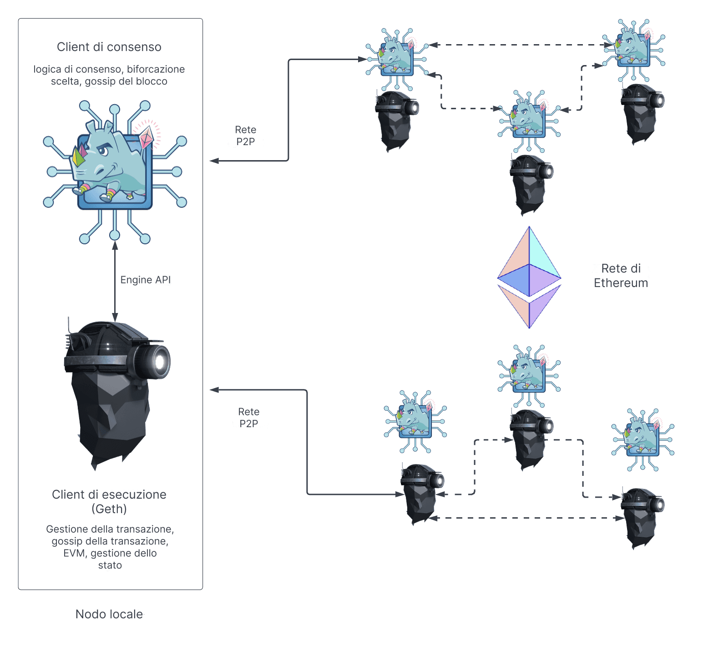

Un nodo di Ethereum si compone di due client: un [client di esecuzione](/developers/docs/nodes-and-clients/#execution-clients) e un [client di consenso](/developers/docs/nodes-and-clients/#consensus-clients).

Quando Ethereum utilizzava il [proof-of-work](/developers/docs/consensus-mechanisms/pow/), un client di esecuzione era sufficiente per eseguire un intero nodo di Ethereum. Tuttavia, dall'implementazione del [proof-of-stake](/developers/docs/consensus-mechanisms/pow/), il client di esecuzione dev'essere utilizzato insieme a un altro pezzo di software detto ["client di consenso"](/developers/docs/nodes-and-clients/#consensus-clients).

Il diagramma seguente mostra la relazione tra i due client di Ethereum. I due client si connettono alle rispettive reti peer-to-peer (P2P). Sono necessarie reti P2P separate poiché i client di esecuzione eseguono il gossip delle transazioni sulla propria rete P2P, consentendo loro di gestire il proprio pool locale di transazione, mentre i client di consenso eseguono il gossip dei blocchi sulla propria rete P2P, consentendo la crescita del consenso e della catena.

Perché questa struttura a due client funzioni, i client di consenso devono poter passare i pacchetti di transazioni al client di esecuzione. Eseguire le transazioni localmente è la modalità in cui il client convalida che le transazioni non violano alcuna regola di Ethereum e che l'aggiornamento proposto allo stato di Ethereum sia corretto. Similmente, quando il nodo è selezionato come produttore di un blocco, il client di consenso deve poter richiedere i pacchetti di transazioni da Geth da includere nel nuovo blocco ed eseguirli per aggiornare lo stato globale. Questa comunicazione tra client è gestita da una connessione RPC locale utilizzando l'[API del motore](https://github.com/ethereum/execution-apis/blob/main/src/engine/common.md).

## Cosa fa il client di esecuzione? {#execution-client}

Il client di esecuzione è responsabile della gestione e del gossip delle transazioni, della gestione dello stato e del supporto alla Macchina Virtuale di Ethereum ([EVM](/developers/docs/evm/)). Tuttavia, **non** è responsabile della costruzione e del gossip dei blocchi, o della gestione della logica di consenso. Questi sono di competenza del client di consenso.

Il client di esecuzione crea carichi utili di esecuzione: l'elenco di transazioni, l'albero di stato aggiornato e altri dati correlati all'esecuzione. I client di consenso includono il carico utile di esecuzione in ogni blocco. Il client di esecuzione è inoltre responsabile per la ri-esecuzione delle transazioni nei nuovi blocchi per assicurarsi che siano validi. L'esecuzione delle transazioni avviene sul computer incorporato del client di esecuzione, noto come [Macchina Virtuale di Ethereum (EVM)](/developers/docs/evm).

Inoltre, il client di esecuzione offre un'interfaccia utente a Ethereum tramite i [metodi RPC](/developers/docs/apis/json-rpc) che consentono agli utenti di interrogare la blockchain di Ethereum, inviare transazioni e distribuire contratti intelligenti. È comune che le chiamate RPC siano gestite da una libreria come [Web3js](https://docs.web3js.org/), [Web3py](https://web3py.readthedocs.io/en/v5/) o da un'interfaccia utente come un portafoglio su browser.

In sintesi, il client di esecuzione è:

- una porta dell'utente a Ethereum
- la casa della Macchina Virtuale di Ethereum, dello stato di Ethereum e del pool di transazione.

## Cosa fa il client di consenso? {#consensus-client}

Il client di consenso affronta tutta la logica che consente a un nodo di rimanere sincronizzato con la rete di Ethereum. Ciò include la ricezione dei blocchi dai pari e l'esecuzione di un algoritmo di scelta della diramazione per assicurare che il nodo segua sempre la catena con la massima accumulazione di attestazioni (ponderata dai saldi effettivi del validatore). Similmente al client di esecuzione, i client di consenso hanno la propria rete P2P tramite cui condividono i blocchi e le attestazioni.

Il client di consenso non partecipa all'attestazione o alla proposta di blocco; ciò è eseguito da un validatore, un componente aggiuntivo e facoltativo di un client di consenso. Un client di consenso senza un validatore tiene il passo soltanto con la testa della catena, consentendo al nodo di rimanere sincronizzato. Ciò consente a un utente di effettuare transazioni con Ethereum usando il proprio client di esecuzione, sicuro che si trovi sulla catena corretta.

## Validatori {#validators}

Gli operatori di nodi possono aggiungere un validatore ai propri client di consenso depositando 32 ETH nel contratto di deposito. Il client del validatore è raggruppato con il client di consenso e può esser aggiunto a un nodo in qualsiasi momento. Il validatore gestisce le attestazioni e le proposte dei blocchi. Consente a un nodo di maturare ricompense o perdere ETH tramite sanzioni o tagli. Eseguire un software del validatore, inoltre, rende un nodo idoneo alla selezione per proporre un nuovo blocco.

[Maggiori informazioni sullo staking](/staking/).

## Componenti di confronto di un nodo {#node-comparison}

| Client di esecuzione                                           | Client di consenso                                                                    | Validatore                    |
| -------------------------------------------------------------- | ------------------------------------------------------------------------------------- | ----------------------------- |
| Esegue il gossip delle transazioni tramite la propria rete P2P | Esegue il gossip di blocchi e attestazioni tramite la propria rete P2P                | Propone blocchi               |
| Esegue e ri-esegue le transazioni                              | Esegue l'algoritmo di scelta della diramazione                                        | Matura ricompense/sanzioni    |
| Verifica i cambiamenti di stato in entrata                     | Tiene traccia della testa della catena                                                | Effettua le attestazioni      |
| Gestisce gli alberi di stato e delle ricevute                  | Gestisce lo stato della Beacon (contenente le informazioni di consenso ed esecuzione) | Richiede lo staking di 32 ETH |
| Crea carico utile di esecuzione                                | Tiene traccia della casualità accumulata in RANDAO                                    | Può essere tagliato           |
| Espone l'API JSON-RPC per interagire con Ethereum              | Tiene traccia di giustificazione e finalizzazione                                     |                               |

## Letture consigliate {#further-reading}

- [Proof of Stake](/developers/docs/consensus-mechanisms/pos)
- [Proposta di blocco](/developers/docs/consensus-mechanisms/pos/block-proposal)
- [Ricompense e sanzioni del validatore](/developers/docs/consensus-mechanisms/pos/rewards-and-penalties)
