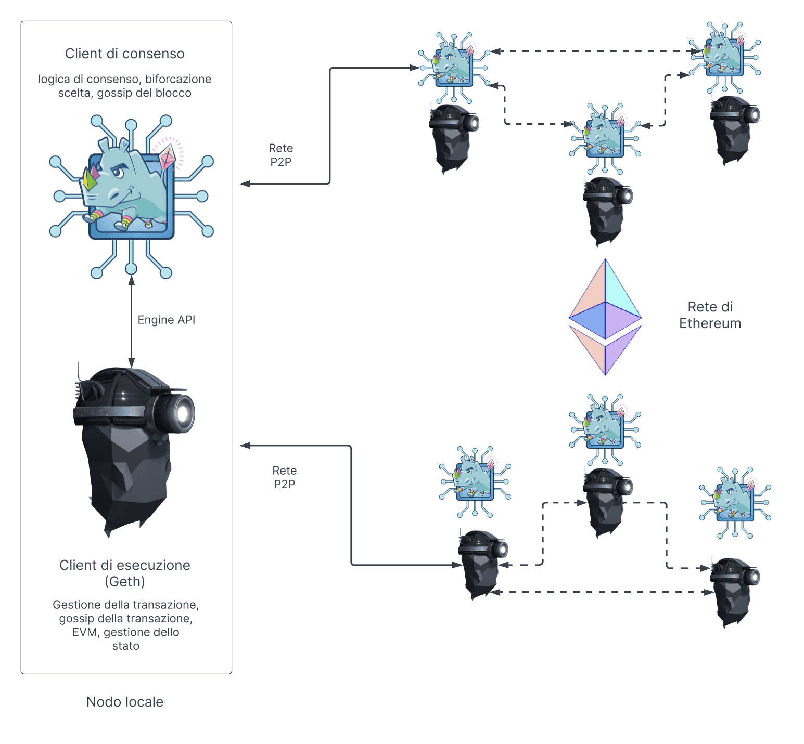

Un nodo di Ethereum è composto da due client: un [client di esecuzione](/developers/docs/nodes-and-clients/#execution-clients) e un [client di consenso](/developers/docs/nodes-and-clients/#consensus-clients). Affinché un nodo possa proporre un nuovo blocco, deve anche eseguire un [client validatore](#validators).

Quando Ethereum utilizzava la [prova di lavoro](/developers/docs/consensus-mechanisms/pow/), un client di esecuzione era sufficiente per eseguire un nodo completo di Ethereum. Tuttavia, dall'implementazione della [prova di stake](/developers/docs/consensus-mechanisms/pos/), il client di esecuzione deve essere utilizzato insieme a un altro software chiamato [client di consenso](/developers/docs/nodes-and-clients/#consensus-clients).

Il diagramma sottostante mostra la relazione tra i due client di Ethereum. I due client si connettono alle rispettive reti peer-to-peer (P2P). Sono necessarie reti P2P separate poiché i client di esecuzione diffondono le transazioni sulla loro rete P2P, consentendo loro di gestire il proprio pool di transazioni locale, mentre i client di consenso diffondono i blocchi sulla loro rete P2P, consentendo il consenso e la crescita della catena.

_Ci sono diverse opzioni per il client di esecuzione, tra cui Erigon, Nethermind e Besu_.

Affinché questa struttura a due client funzioni, i client di consenso devono passare pacchetti di transazioni al client di esecuzione. Il client di esecuzione esegue le transazioni localmente per convalidare che non violino alcuna regola di Ethereum e che l'aggiornamento proposto allo stato di Ethereum sia corretto. Quando un nodo viene selezionato per essere un produttore di blocchi, la sua istanza del client di consenso richiede pacchetti di transazioni dal client di esecuzione per includerli nel nuovo blocco ed eseguirli per aggiornare lo stato globale. Il client di consenso guida il client di esecuzione tramite una connessione RPC locale utilizzando l'[Engine API](https://github.com/ethereum/execution-apis/blob/main/src/engine/common.md).

## Cosa fa il client di esecuzione? {#execution-client}

Il client di esecuzione è responsabile della convalida, della gestione e della diffusione delle transazioni, insieme alla gestione dello stato e al supporto della macchina virtuale di Ethereum ([EVM](/developers/docs/evm/)). **Non** è responsabile della costruzione dei blocchi, della diffusione dei blocchi o della gestione della logica di consenso. Questi compiti rientrano nelle competenze del client di consenso.

Il client di esecuzione crea i payload di esecuzione: l'elenco delle transazioni, il trie dello stato aggiornato e altri dati relativi all'esecuzione. I client di consenso includono il payload di esecuzione in ogni blocco. Il client di esecuzione è anche responsabile della riesecuzione delle transazioni nei nuovi blocchi per assicurarsi che siano valide. L'esecuzione delle transazioni avviene sul computer integrato del client di esecuzione, noto come [macchina virtuale di Ethereum (EVM)](/developers/docs/evm).

Il client di esecuzione offre anche un'interfaccia utente per Ethereum attraverso i [metodi RPC](/developers/docs/apis/json-rpc) che consentono agli utenti di interrogare la blockchain di Ethereum, inviare transazioni e distribuire contratti intelligenti. È comune che le chiamate RPC vengano gestite da una libreria come [Web3js](https://docs.web3js.org/), [Web3py](https://web3py.readthedocs.io/en/v5/) o da un'interfaccia utente come un portafoglio del browser.

In sintesi, il client di esecuzione è:

- un gateway utente per Ethereum
- la sede della macchina virtuale di Ethereum, dello stato di Ethereum e del pool di transazioni.

## Cosa fa il client di consenso? {#consensus-client}

Il client di consenso si occupa di tutta la logica che consente a un nodo di rimanere sincronizzato con la rete di Ethereum. Ciò include la ricezione di blocchi dai peer e l'esecuzione di un algoritmo di scelta della biforcazione per garantire che il nodo segua sempre la catena con il maggior accumulo di attestazioni (ponderate in base ai saldi effettivi dei validatori). Similmente al client di esecuzione, i client di consenso hanno la propria rete P2P attraverso la quale condividono blocchi e attestazioni.

Il client di consenso non partecipa all'attestazione o alla proposta di blocchi: questo viene fatto da un validatore, un componente aggiuntivo opzionale per un client di consenso. Un client di consenso senza un validatore si limita a tenere il passo con la testa della catena, consentendo al nodo di rimanere sincronizzato. Ciò consente a un utente di effettuare transazioni con Ethereum utilizzando il proprio client di esecuzione, con la certezza di trovarsi sulla catena corretta.

## Validatori {#validators}

Fare staking ed eseguire il software del validatore rende un nodo idoneo a essere selezionato per proporre un nuovo blocco. Gli operatori dei nodi possono aggiungere un validatore ai loro client di consenso depositando 32 ETH nel contratto di deposito. Il client validatore viene fornito in bundle con il client di consenso e può essere aggiunto a un nodo in qualsiasi momento. Il validatore gestisce le attestazioni e le proposte di blocchi. Consente inoltre a un nodo di accumulare ricompense o perdere ETH tramite penalità o venendo punito.

[Maggiori informazioni sullo staking](/staking/).

## Confronto tra i componenti di un nodo {#node-comparison}

| Client di esecuzione                               | Client di consenso                                                                                                                                        | Validatore                   |
| -------------------------------------------------- | --------------------------------------------------------------------------------------------------------------------------------------------------------- | ---------------------------- |
| Diffonde le transazioni sulla sua rete P2P         | Diffonde blocchi e attestazioni sulla sua rete P2P                                                                                                        | Propone blocchi              |
| Esegue/riesegue le transazioni                     | Esegue l'algoritmo di scelta della biforcazione                                                                                                           | Accumula ricompense/penalità |
| Verifica le modifiche di stato in entrata          | Tiene traccia della testa della catena                                                                                                                    | Crea attestazioni            |
| Gestisce i trie dello stato e delle ricevute       | Gestisce lo stato della Beacon (contiene informazioni sul consenso e sull'esecuzione)                                                                     | Richiede lo staking di 32 ETH|
| Crea il payload di esecuzione                      | Tiene traccia della casualità accumulata in RANDAO (un algoritmo che fornisce casualità verificabile per la selezione dei validatori e altre operazioni di consenso) | Può essere punito            |
| Espone l'API JSON-RPC per interagire con Ethereum  | Tiene traccia della giustificazione e della finalizzazione                                                                                                |                              |

## Letture consigliate {#further-reading}

- [Prova di stake](/developers/docs/consensus-mechanisms/pos)
- [Proposta del blocco](/developers/docs/consensus-mechanisms/pos/block-proposal)
- [Ricompense e penalità dei validatori](/developers/docs/consensus-mechanisms/pos/rewards-and-penalties)