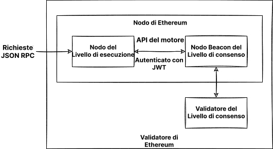

Eseguire il tuo nodo ti offre vari benefici, apre nuove possibilità e aiuta a supportare l'ecosistema. Questa pagina ti guiderà verso l'avvio del tuo nodo e la partecipazione alla convalida delle transazioni di Ethereum.

Si noti che, dopo [La Fusione](/roadmap/merge), sono necessari due client per eseguire un nodo di Ethereum; un client del **livello di esecuzione (EL)** e un client del **livello di consenso (CL)**. Questa pagina mostrerà come installare, configurare e connettere questi due client per eseguire un nodo di Ethereum.

## Prerequisiti {#prerequisites}

Dovresti sapere cos'è un nodo di Ethereum e per quali motivi potresti voler eseguire un client. Questo aspetto è trattato in [Nodi e client](/developers/docs/nodes-and-clients/).

Se sei nuovo al tema dell'esecuzione di un nodo, o stai cercando un percorso meno tecnico, ti consigliamo prima di dare un'occhiata alla nostra introduzione user-friendly su come [Eseguire un nodo di Ethereum](/run-a-node).

## Scegliere un approccio {#choosing-approach}

Il primo passo nell'avvio del tuo nodo è scegliere l’approccio che vuoi seguire. A seconda dei requisiti e delle varie possibilità, devi selezionare l'implementazione del client (sia di esecuzione che di consenso), l'ambiente (hardware, sistema) e i parametri per le impostazioni del client.

Questa pagina ti guiderà per queste decisioni e ti aiuterà a trovare il modo più adatto per eseguire la tua istanza di Ethereum.

Per scegliere tra le implementazioni del client, visualizza tutti i [client di esecuzione](/developers/docs/nodes-and-clients/#execution-clients) e i [client di consenso](/developers/docs/nodes-and-clients/#consensus-clients) pronti e disponibili della Rete Principale e scopri di più sulla [diversità dei client](/developers/docs/nodes-and-clients/client-diversity).

Decidi se eseguire il software sul tuo [hardware o nel cloud](#local-vs-cloud), considerando i [requisiti](#requirements) dei client.

Dopo aver preparato l'ambiente, installa i client scelti con l'[interfaccia per principianti](#automatized-setup) o [manualmente](#manual-setup), usando un terminale con le opzioni avanzate.

Quando il nodo è in esecuzione e sincronizzazione, sei pronto a [usarlo](#using-the-node), ma assicurati di tenerne d'occhio la [manutenzione](#operating-the-node).



### Ambiente e Hardware {#environment-and-hardware}

#### Locale o su cloud {#local-vs-cloud}

I client di Ethereum possono funzionare su computer di livelo consumer e non richiedono alcun hardware speciale, come ad esempio per le macchine di mining. Dunque, hai varie opzioni per distribuire il nodo a seconda delle tue esigenze. Per semplificare, pensiamo all'esecuzione di un nodo sia su una macchina fisica locale che su un server cloud:

- Cloud
  - I fornitori offrono tempi di disponibilità elevati del server e indirizzi IP pubblici statici
  - Ottenere un server dedicato o virtuale può esser più comodo che creare il proprio
  - Il compromesso è doversi affidare a una terza parte: il fornitore del server
  - A causa della dimensione d'archiviazione richiesta per il nodo completo, il prezzo di un server affittato potrebbe essere alto
- Hardware proprio
  - Approccio più autonomo e senza fiducia
  - Investimento una tantum
  - Possibilità di acquistare macchine pre-configurate
  - Devi preparare, mantenere e potenzialmente risolvere i problemi della macchina e di rete, fisicamente

Le due opzioni presentano vantaggi differenti, sopra riassunti. Se cerchi una soluzione su cloud, oltre a molti fornitori informatici di cloud tradizionali, esistono anche servizi incentrati sulla distribuzione dei nodi. Dai anche un'occhiata a [nodi come servizi](/developers/docs/nodes-and-clients/nodes-as-a-service/) per ulteriori opzioni sui nodi ospitati.

#### Hardware {#hardware}

Tuttavia, una rete decentralizzata e resistente alla censura non dovrebbe affidarsi ai fornitori cloud. Invece, eseguire il tuo nodo sul tuo hardware locale è più sano per l'ecosistema. Le [stime](https://www.ethernodes.org/networkType/Hosting) mostrano una grande quantità di nodi eseguiti sul cloud, che potrebbero diventare un punto di errore unico.

I client di Ethereum possono essere eseguiti sul tuo computer, laptop, server, o persino su un computer a scheda singola. Benché eseguire i client sul tuo computer fisso sia possibile, avere una macchina dedicata solo per il tuo nodo può migliorarne significativamente le prestazioni e la sicurezza, minimizzando l'impatto sul tuo computer principale.

Usare il tuo hardware può essere molto facile. Esistono molte opzioni semplici, nonché configurazioni avanzate per gli utenti più tecnici. Quindi, diamo un'occhiata ai requisiti e ai mezzi per eseguire i client di Ethereum sulla tua macchina.

#### Requisiti {#requirements}

I requisiti hardware differiscono in base al client, ma in genere non sono così elevati dal momento che il nodo deve solo rimanere sincronizzato. Non va confuso con il mining, che invece richiede molta più potenza di calcolo. Il tempo di sincronizzazione e le prestazioni naturalmente migliorano con hardware più potente.

Prima di installare qualsiasi client, assicurati che il tuo computer abbia abbastanza risorse per eseguirlo. Puoi trovare i requisiti minimi e consigliati di seguito.

L'ostacolo per il tuo hardware è principalmente lo spazio su disco. Sincronizzare la blockchain Ethereum richiede molte risorse in ingresso/uscita e richiede molto spazio. È meglio avere un **disco a stato solido (SSD)**, con centinaia di GB di spazio libero risparmiati anche dopo la sincronizzazione.

Le dimensioni del database e la velocità della sincronizzazione iniziale dipendono dal client scelto, dalla sua configurazione e dalla [strategia di sincronizzazione](/developers/docs/nodes-and-clients/#sync-modes).

Assicurati anche che la tua connessione a internet non sia limitata da un [limite di larghezza di banda](https://wikipedia.org/wiki/Data_cap). Si consiglia di non usare una connessione a consumo poiché la sincronizzazione iniziale e i dati trasmessi alla rete potrebbero superare il limite di traffico.

##### Sistema operativo

Tutti i client supportano i principali sistemi operativi: Linux, MacOS, Windows. Questo significa che puoi eseguire i nodi su macchine desktop o server ordinarie con il sistema operativo (OS) più adatto alle tue esigenze. Assicurati che il tuo OS sia aggiornato per evitare possibili problemi e vulnerabilità di sicurezza.

##### Requisiti minimi

- CPU con 2+ core
- 8 GB di RAM
- 2TB di SSD
- Larghezza di banda 10+ MBit/s

##### Specifiche raccomandate

- CPU veloce con 4+ core
- 16 GB+ di RAM
- SSD veloce con 2+ TB
- Larghezza di banda 25+ MBit/s

La modalità di sincronizzazione e il client che scegli influenzeranno i requisiti di spazio ma abbiamo stimato lo spazio su disco che ti servirà per ogni client di seguito.

| Client     | Dimensioni disco (sincronizzazione snap) | Dimensione disco (archivio completo) |
| ---------- | ---------------------------------------- | ------------------------------------ |
| Besu       | 800GB+                                   | 12TB+                                |
| Erigon     | N/A                                      | 2,5TB+                               |
| Geth       | Oltre 500GB                              | 12TB+                                |
| Nethermind | Oltre 500GB                              | 12TB+                                |
| Reth       | N/A                                      | Oltre 2,2TB                          |

- Nota: Erigon e Reth non offrono la sincronizzazione snap, ma è possibile la potatura completa (circa 2TB per Erigon, circa 1,2TB per Reth)

Per i client di consenso, i requisiti di spazio dipendono anche dall'implementazione del client e dalle funzionalità abilitate (es. slasher del validatore), ma tengono generalmente conto di altri 200GB necessari per i dati della Beacon. Con un gran numero di validatori, cresce anche il carico della larghezza di banda. Puoi trovare i [dettagli sui requisiti del client di consenso in quest'analisi](https://mirror.xyz/0x934e6B4D7eee305F8C9C42b46D6EEA09CcFd5EDc/b69LBy8p5UhcGJqUAmT22dpvdkU-Pulg2inrhoS9Mbc).

#### Soluzioni plug and play {#plug-and-play}

L'opzione più facile per eseguire un nodo con il tuo hardware è usando soluzioni plug and play. Le macchine preconfigurate dai fornitori offrono l'esperienza più semplice: ordina, connetti, esegui. Tutto è preconfigurato e funziona automaticamente con una guida e un pannello di controllo intuitivi per il monitoraggio e il controllo del software.

- [DappNode](https://dappnode.io/)
- [Avado](https://ava.do/)

#### Ethereum su un computer a scheda singola {#ethereum-on-a-single-board-computer}

Un modo facile ed economico per eseguire un nodo Ethereum è quello di utilizzare un computer a scheda singola con architettura ARM come Raspberry Pi. [Ethereum su ARM](https://ethereum-on-arm-documentation.readthedocs.io/en/latest/) fornisce immagini facili da eseguire di diversi client di esecuzione e di consenso per Raspberry Pi e altri circuiti ARM.

Dispositivi piccoli, convenienti ed efficienti come questi sono ideali per eseguire un nodo a casa, ma tieni conto delle loro prestazioni limitate.

## Avviare il nodo {#spinning-up-node}

La configurazione effettiva del client è eseguibile con launcher automatizzati o manualmente, configurando direttamente il software del client.

Per gli utenti meno avanzati, l'approccio consigliato è usare un launcher, un software che ti guida nell'installazione e automatizza il processo di configurazione del client. Tuttavia, se hai qualche esperienza nell'uso di un terminale, i passaggi per la configurazione manuale dovrebbero essere più semplici da seguire.

### Configurazione guidata {#automatized-setup}

Diversi progetti intuitivi mirano a migliorare l'esperienza di configurazione di un client. Questi launcher forniscono l'installazione e configurazione automatica del client, alcuni offrono persino un'interfaccia grafica per la configurazione guidata e il monitoraggio dei client.

Di seguito trovi alcuni progetti che possono aiutarti a installare e controllare i client in pochi click:

- [DappNode](https://docs.dappnode.io/docs/user/getting-started/choose-your-path): DappNode non è fornito soltanto con una macchina da un venditore. Il software, il launcher del nodo vero e proprio e il centro di controllo con molte funzionalità, sono utilizzabili su hardware arbitrario.
- [eth-docker](https://eth-docker.net/) - La configurazione automatizzata usando Docker, incentrata sullo staking facile e sicuro, richiede una conoscenza di base del terminale e di Docker, consigliata per gli utenti un po' più avanzati.
- [Stereum](https://stereum.net/ethereum-node-setup/) - Launcher per installare i client su un server remoto tramite connessione SSH con una guida di configurazione con GUI, un centro di controllo e molte altre funzionalità.
- [NiceNode](https://www.nicenode.xyz/) - Launcher con un'esperienza utente semplice per eseguire un nodo sul tuo computer. Basta scegliere i client e avviarli in pochi clic. Ancora in fase di sviluppo.
- [Sedge](https://docs.sedge.nethermind.io/docs/intro): Strumento di configurazione del nodo che genera automaticamente la configurazione di un Docker utilizzando la procedura guidata della CLI. Scritta in Go da Nethermind.

### Configurazione manuale dei client {#manual-setup}

L'altra opzione è scaricare, verificare e configurare manualmente il software del client. Anche se alcuni client offrono un'interfaccia grafica, una configurazione manuale richiede comunque abilità essenziali col terminale, ma offre una versatilità molto maggiore.

Come spiegato prima, configurare il tuo nodo di Ethereum richiederà l'esecuzione di una coppia di client di consenso e di esecuzione. Alcuni client potrebbero includere un client leggero dell'altro tipo e sincronizzarsi senza che sia necessario altro software. Tuttavia, la verifica senza fiducia e completa richiede entrambe le implementazioni.

#### Ottenere il software del client {#getting-the-client}

Prima di tutto devi ottenere il software dei tuoi [client di esecuzione](/developers/docs/nodes-and-clients/#execution-clients) e [client di consenso](/developers/docs/nodes-and-clients/#consensus-clients) preferiti.

Puoi semplicemente scaricare un'applicazione eseguibile o pacchetto d'installazione più adatto al tuo sistema operativo e alla tua architettura. Verifica sempre le firme e le checksum dei pacchetti scaricati. Alcuni client offrono anche repository o immagini Docker per facilitare l’installazione e gli aggiornamenti. Tutti i client sono open source, quindi puoi anche compilarli da sorgente. Questo è un metodo più avanzato ma, in alcuni casi, potrebbe esser richiesto.

Le istruzioni per installare ogni client sono fornite nella documentazione collegata nei suddetti elenchi di client.

Ecco le pagine delle release dei client, in cui puoi trovare i loro binari precompilati o le istruzioni d'installazione:

##### Client di esecuzione

- [Besu](https://github.com/hyperledger/besu/releases)
- [Erigon](https://github.com/ledgerwatch/erigon/releases)
- [Geth](https://geth.ethereum.org/downloads/)
- [Nethermind](https://downloads.nethermind.io/)
- [Reth](https://reth.rs/installation/installation.html)

Vale anche la pena notare che la diversità dei client è un [problema sul livello di esecuzione](/developers/docs/nodes-and-clients/client-diversity/#execution-layer). Si consiglia ai lettori di considerare l'esecuzione di un client di esecuzione di minoranza.

##### Client di consenso

- [Lighthouse](https://github.com/sigp/lighthouse/releases/latest)
- [Lodestar](https://chainsafe.github.io/lodestar/install/source/) (Non fornisce un binario precompilato, solo un'immagine Docker o da compilare da sorgente)
- [Nimbus](https://github.com/status-im/nimbus-eth2/releases/latest)
- [Prysm](https://github.com/prysmaticlabs/prysm/releases/latest)
- [Teku](https://github.com/ConsenSys/teku/releases)

La [diversità del client](/developers/docs/nodes-and-clients/client-diversity/) è cruciale per i nodi di consenso che eseguono validatori. Se la maggioranza dei validatori sta operando un'implementazione singola del client, la sicurezza di rete è a rischio. Si consiglia dunque di considerare la scelta di un client di minoranza.

[Visualizza l'uso più recente del client della rete](https://clientdiversity.org/) e scopri di più sulla [diversità dei client](/developers/docs/nodes-and-clients/client-diversity).

##### Verificare il software

Quando si scarica il software da Internet, si consiglia di verificarne l'integrità. Questo passaggio è facoltativo, ma specialmente con parti di infrastruttura essenziali come il client di Ethereum, è importante esser consapevoli dei potenziali vettori d'attacco ed evitarli. Se hai scaricato un binario precompilato, devi fidartene e rischiare che un utente malevolo possa scambiare l'eseguibile con un file malevolo.

Gli sviluppatori firmano i binari rilasciati con le loro chiavi PGP, così che tu possa verificare crittograficamente che stai eseguendo esattamente il software che hanno creato. Devi solo ottenere le chiavi pubbliche usate dagli sviluppatori, che si possono trovare sulle pagine di rilascio del client o nella documentazione. Dopo aver scaricato la release del client e la sua firma, puoi usare un'implementazione di PGP, es. [GnuPG](https://gnupg.org/download/index.html) per verificarli facilmente. Dai un'occhiata a un tutorial sulla verifica del software open source usando `gpg` su [linux](https://www.tecmint.com/verify-pgp-signature-downloaded-software/) o su [Windows/MacOS](https://freedom.press/training/verifying-open-source-software/).

Un'altra forma di verifica è assicurarsi che l'hash, un'impronta digitale crittografica univoca, del software scaricato corrisponda a quello fornito dagli sviluppatori. Ciò è persino più facile che usare PGP, e alcuni client offrono solo quest'opzione. Basta eseguire la funzione di hash sul software scaricato e confrontarla con quella dalla pagina di rilascio. Ad esempio:

```sh
sha256sum teku-22.6.1.tar.gz

9b2f8c1f8d4dab0404ce70ea314ff4b3c77e9d27aff9d1e4c1933a5439767dde
```

#### Configurazione del client {#client-setup}

Dopo aver installato, scaricato o compilato il software del client, sei pronto a eseguirlo. Questo significa semplicemente che deve essere eseguito con la configurazione corretta. I client offrono svariate opzioni di configurazione, che possono abilitare varie funzionalità.

Iniziamo con le opzioni che possono influenzare significativamente le prestazioni del client e l'uso dei dati. Le [modalità di sincronizzazione](/developers/docs/nodes-and-clients/#sync-modes) rappresentano metodi diversi per scaricare e convalidare i dati della blockchain. Prima di avviare il nodo, dovresti decidere quale rete e che modalità di sincronizzazione usare. Le cose più importanti da considerare sono lo spazio su disco e il tempo di sincronizzazione di cui il client avrà bisogno. Presta attenzione alla documentazione del client per stabilire quale modalità di sincronizzazione è quella predefinita. Se non è adatta a te, selezionane un'altra a seconda del livello di sicurezza, dei dati disponibili e dei costi. Oltre all'algoritmo di sincronizzazione, puoi anche impostare la potatura di vari tipi di dati ormai datati. La potatura consente l'eliminazione di dati obsoleti, ad es. la rimozione i nodi trie di stato irraggiungibili dai blocchi recenti.

Altre opzioni di configurazione di base sono, ad esempio, scegliere una rete: Rete principale o reti di prova, abilitare l'endpoint HTTP per RPC o WebSocket, ecc. Puoi trovare tutte le funzionalità e opzioni nella documentazione del client. È possibile impostare varie configurazioni del client eseguendo il client con i corrispondenti flag, direttamente nella CLI o nel file di configurazione. Ogni client è un po' diverso; fai sempre riferimento alla sua documentazione ufficiale o pagina di supporto per i dettagli sulle opzioni di configurazione.

Per scopi di prova, potrebbe essere preferibile eseguire un client su una delle reti di prova. [Visualizza la panoramica delle reti supportate](/developers/docs/nodes-and-clients/#execution-clients).

Nella prossima sezione sono riportati esempi di esecuzione dei client di esecuzione con la configurazione di base.

#### Avviare il client di esecuzione {#starting-the-execution-client}

Prima di avviare il software del client di Ethereum, verifica un'ultima volta che il tuo ambiente sia pronto. Ad esempio, assicurati che:

- Ci sia abbastanza spazio su disco considerando la rete e la modalità di sincronizzazione scelta.
- Memoria e CPU non siano bloccate da altri programmi.
- Il sistema operativo sia aggiornato all'ultima versione.
- Il sistema abbia la data e l'ora corrette.
- Il tuo router e firewall accettino le connessioni sulle porte di ascolto. Di default, i client di Ethereum usano una porta di ascolto (TCP) e una porta di scoperta (UDP), entrambe di default su 30303.

Esegui prima il tuo client su una rete di prova per assicurarti che tutto funzioni correttamente.

All'avvio devi dichiarare qualsiasi impostazione del client che non sia predefinita. Puoi usare i flag o il file di configurazione per dichiarare la tua configurazione preferita. L'insieme di funzionalità e sintassi di configurazione di ogni client è diversa. Dai un'occhiata alla documentazione del tuo client per le specifiche.

I client di esecuzione e di consenso comunicano tramite un endpoint autenticato specificato nell'[API Engine](https://github.com/ethereum/execution-apis/tree/main/src/engine). Per potersi connettere a un client di consenso, il client di esecuzione deve generare un [`jwtsecret`](https://jwt.io/) a un percorso noto. Per motivi di sicurezza e stabilità, i client dovrebbero essere eseguiti sulla stessa macchina ed entrambi i client devono conoscere tale percorso, essendo usato per autenticare una connessione RPC locale tra di essi. Il client di esecuzione deve anche definire una porta di ascolto per le API autenticate.

Questo token è generato automaticamente dal software del client ma, in alcuni casi, potresti doverlo generare tu stesso. Puoi generarlo utilizzando [OpenSSL](https://www.openssl.org/):

```sh
openssl rand -hex 32 > jwtsecret
```

#### Eseguire un client di esecuzione {#running-an-execution-client}

Questa sezione ti guiderà nell'avvio dei client di esecuzione. Serve solo da esempio per una configurazione di base, che avvierà il client con le seguenti impostazioni:

- Specifica la rete a cui connettersi, la Rete Principale nei nostri esempi
  - Puoi invece scegliere [una delle reti di prova](/developers/docs/networks/) per le prove preliminari della tua configurazione
- Definisce la cartella dei dati in cui saranno memorizzati tutti i dati, inclusa la blockchain
  - Assicurati di sostituire il percorso con quello reale, es. puntando alla tua unità esterna
- Abilita le interfacce per comunicare col client
  - Include le API di JSON-RPC ed Engine per la comunicazione con il client del consenso
- Definisce il percorso a `jwtsecret` per l'API autenticata
  - Assicurati di sostituire il percorso d'esempio con quello reale accessibile dai client, es. `/tmp/jwtsecret`

Ricordati che questo è solo un esempio di base, tutte le altre impostazioni saranno predefinite. Presta attenzione alla documentazione di ogni client per conoscere i valori predefiniti, le impostazioni e le funzionalità. Per ulteriori funzionalità, ad esempio per eseguire i validatori, per il monitoraggio, ecc., fai riferimento alla documentazione del client specifico.

> Nota che i backslash `\` negli esempi servono solo a scopi di formattazione; i flag di configurazione sono definibili in una singola riga.

##### Eseguire Besu

Questo esempio avvia Besu sulla Rete Principale, memorizza i dati della blockchain nel formato predefinito su `/data/ethereum`, abilita JSON-RPC e Engine RPC per la connessione del client di consenso. L'API Engine è autenticata con il token `jwtsecret` e solo le chiamate da `localhost` sono consentite.

```sh
besu --network=mainnet \
    --data-path=/data/ethereum \
    --rpc-http-enabled=true \
    --engine-rpc-enabled=true \
    --engine-host-allowlist="*" \
    --engine-jwt-enabled=true \
    --engine-jwt-secret=/path/to/jwtsecret
```

Besu presenta inoltre un'opzione del launcher che porrà una serie di domande e genererà il file di configurazione. Esegui il launcher interattivo usando:

```sh
besu --Xlauncher
```

La [documentazione di Besu](https://besu.hyperledger.org/en/latest/HowTo/Get-Started/Starting-node/) contiene le opzioni aggiuntive e i dettagli di configurazione.

##### Eseguire Erigon

Questo esempio avvia Erigon sulla Rete Principale, memorizza i dati della blockchain su `/data/ethereum`, abilita JSON-RPC, definisce quali spazi dei nomi sono consentiti e abilita l'autenticazione per la connessione del client di consenso definito dal percorso `jwtsecret`.

```sh
erigon --chain mainnet \
    --datadir /data/ethereum  \
    --http --http.api=engine,eth,web3,net \
    --authrpc.jwtsecret=/path/to/jwtsecret
```

Erigon esegue di default una sincronizzazione completa con 8GB di HDD, che risulterà in oltre 2TB di dati d'archivio. Assicurati che `datadir` stia puntando al disco con abbastanza spazio libero o prendi in considerazione il flag `--prune`, che può tagliare diversi tipi di dati. Dai un'occhiata all'`--help` di Erigon per scoprire di più.

##### Eseguire Geth

Questo esempio avvia Geth sulla Rete Principale, memorizza i dati della blockchain su `/data/ethereum`, abilita JSON-RPC e definisce quali spazi dei nomi sono consentiti. Inoltre, consente l'autenticazione per connettere il client di consenso, che richiede il percorso a `jwtsecret` e, inoltre, l'opzione che definisce quali connessioni sono consentite, nel nostro esempio solo da `localhost`.

```sh
geth --mainnet \
    --datadir "/data/ethereum" \
    --http --authrpc.addr localhost \
    --authrpc.vhosts="localhost" \
    --authrpc.port 8551
    --authrpc.jwtsecret=/path/to/jwtsecret
```

Controlla la [documentazione per tutte le opzioni di configurazione](https://geth.ethereum.org/docs/fundamentals/command-line-options) e scopri di più sull'[esecuzione di Geth con un client di consenso](https://geth.ethereum.org/docs/getting-started/consensus-clients).

##### Eseguire Nethermind

Nethermind offre varie [opzioni d'installazione](https://docs.nethermind.io/nethermind/first-steps-with-nethermind/getting-started). Il pacchetto presenta vari binari, incluso un Launcher con una configurazione guidata, che ti aiuterà a creare la configurazione in modo interattivo. In alternativa trovi Runner, che è l'eseguibile stesso, e puoi eseguirlo coi flag di configurazione. JSON-RPC è abilitato di default.

```sh
Nethermind.Runner --config mainnet \
    --datadir /data/ethereum \
    --JsonRpc.JwtSecretFile=/path/to/jwtsecret
```

La documentazione di Nethermind offre una [guida completa](https://docs.nethermind.io/nethermind/first-steps-with-nethermind/running-nethermind-post-merge) all'esecuzione di Nethermind con il client di consenso.

Il client di esecuzione avvierà le sue funzioni principali, gli endpoint scelti e inizierà a cercare i pari. Dopo aver scoperto correttamente i pari, il client avvia la sincronizzazione. Il client di esecuzione attenderà una connessione dal client di consenso. I dati correnti della blockchain saranno disponibili una volta che il client è sincronizzato correttamente allo stato corrente.

##### Eseguire Geth

Questo esempio avvia Reth sulla Rete Principale, utilizzando la posizione dei dati predefinita. Abilita l'autenticazione JSON-RPC e Engine RPC per la connessione del client di consenso definito dal percorso `jwtsecret`, con solo chiamate da `localhost` consentite.

```sh
reth node \
    --authrpc.jwtsecret /path/to/jwtsecret \
    --authrpc.addr 127.0.0.1 \
    --authrpc.port 8551
```

Si veda [Configurare Reth](https://reth.rs/run/config.html?highlight=data%20directory#configuring-reth) per ulteriori informazioni sulle directory di dati predefinite. La [documentazione di Reth](https://reth.rs/run/mainnet.html) contiene opzioni aggiuntive e dettagli di configurazione.

#### Avviare il client di consenso {#starting-the-consensus-client}

Il client di consenso deve essere avviato con la configurazione della porta corretta, per stabilire una connessione RPC locale al client di esecuzione. I client di consenso devono essere eseguiti con la porta del client di esecuzione esposta come argomento di configurazione.

Inoltre, il client di consenso necessita del percorso al `jwt-secret` del client di esecuzione per poter autenticare la connessione RPC tra di essi. Analogamente agli esempi di esecuzione che precedono, ogni client di consenso ha un flag di configurazione che considera il percorso del file del token jwt come un argomento. Questo deve essere coerente con il percorso `jwtsecret` fornito al client di esecuzione.

Se pianifichi di eseguire un validatore, assicurati di aggiungere un flag di configurazione che specifichi l'indirizzo di Ethereum del destinatario della commissione. È qui che sono accumulate le ricompense in ether per il tuo validatore. Ogni client di consenso ha un'opzione come `--suggested-fee-recipient=0xabcd1` che considera un indirizzo di Ethereum come un argomento.

Avviando il Nodo Beacon sulla rete di prova, puoi risparmiare parecchio tempo di sincronizzazione usando l'endpoint pubblico per la [Sincronizzazione del punto di controllo](https://notes.ethereum.org/@launchpad/checkpoint-sync).

#### Eseguire un client di consenso {#running-a-consensus-client}

##### Eseguire Lighthouse

Prima di eseguire Lighthouse, scopri di più su come installarlo e configurarlo nel [Libro su Lighthouse](https://lighthouse-book.sigmaprime.io/installation.html).

```sh
lighthouse beacon_node \
    --network mainnet \
    --datadir /data/ethereum \
    --http \
    --execution-endpoint http://127.0.0.1:8551 \
    --execution-jwt /path/to/jwtsecret
```

##### Eseguire Lodestar

Installa il software di Lodestar compilandolo o scaricando l'immagine Docker. Scopri di più nella [documentazione](https://chainsafe.github.io/lodestar/) e nella più completa [guida di configurazione](https://hackmd.io/@philknows/rk5cDvKmK).

```sh
lodestar beacon \
    --rootDir="/data/ethereum" \
    --network=mainnet \
    --eth1.enabled=true \
    --execution.urls="http://127.0.0.1:8551" \
    --jwt-secret="/path/to/jwtsecret"
```

##### Eseguire Nimbus

Nimbus include sia il client di consenso che quello di esecuzione. Può essere eseguito su vari dispositivi con una potenza di calcolo molto modesta. Dopo aver [installato le dipendenze e Nimbus stesso](https://nimbus.guide/quick-start.html), puoi eseguirne il client di consenso:

```sh
nimbus_beacon_node \
    --network=mainnet \
    --web3-url=http://127.0.0.1:8551 \
    --rest \
    --jwt-secret="/path/to/jwtsecret"
```

##### Eseguire Prysm

Prysm è dotato di uno script che consente una facile installazione automatica. I dettagli sono riportati nella [documentazione di Prysm](https://docs.prylabs.network/docs/install/install-with-script).

```sh
./prysm.sh beacon-chain \
    --mainnet \
    --datadir /data/ethereum  \
    --execution-endpoint=http://localhost:8551  \
    --jwt-secret=/path/to/jwtsecret
```

##### Eseguire Teku

```sh
teku --network mainnet \
    --data-path "/data/ethereum" \
    --ee-endpoint http://localhost:8551 \
    --ee-jwt-secret-file "/path/to/jwtsecret"
```

Quando un client di consenso si connette al client di esecuzione per leggere il contratto di deposito e identificare i validatori, si connette anche ad altri pari del Nodo Beacon e avvia la sincronizzazione degli slot di consenso dalla genesi. Una volta che il Nodo Beacon raggiunge l'epoca corrente, l'API Beacon diventa utilizzabile per i tuoi validatori. Scopri di più sulle [API del Nodo Beacon](https://eth2docs.vercel.app/).

### Aggiungere Validatori {#adding-validators}

Un client di consenso funge da Nodo Beacon a cui si connettono i validatori. Ogni client di consenso ha il proprio software del validatore, descritto nei dettagli nella rispettiva documentazione.

Eseguire il proprio validatore consente lo [staking in autonomia](/staking/solo/), il metodo più d'impatto e senza fiducia per supportare la rete di Ethereum. Tuttavia, ciò richiede un deposito di 32 ETH. Per eseguire un validatore sul tuo nodo con un importo inferiore, potrebbe interessarti un pool decentralizzato con operatori del nodo privi di autorizzazioni, come [Rocket Pool](https://rocketpool.net/node-operators).

Il modo più semplice per iniziare con lo staking e la generazione delle chiavi di validazione è utilizzare il [Launchpad di staking della rete di prova Holesky](https://holesky.launchpad.ethereum.org/), che ti consente di testare la tua configurazione [eseguendo i nodi su Holesky](https://notes.ethereum.org/@launchpad/holesky). Quando sei pronto per la Rete Principale, puoi ripetere questi passaggi usando il [Launchpad di Staking della Rete Principale](https://launchpad.ethereum.org/).

Dai un'occhiata alla [pagina sullo staking](/staking) per una panoramica sulle opzioni di staking.

### Usare il nodo {#using-the-node}

I client di esecuzione offrono gli [endpoint dell'API RPC](/developers/docs/apis/json-rpc/) che puoi usare per inviare le transazioni, interagire con o distribuire i contratti intelligenti sulla rete Ethereum in vari modi:

- Effettuare una chiamata manuale con un protocollo adatto (es. usando `curl`)
- Collegare una console fornita (es. `geth attach`)
- Implementarli nelle applicazioni usando le librerie web3, es. [web3.py](https://web3py.readthedocs.io/en/stable/overview.html#overview), [ethers](https://github.com/ethers-io/ethers.js/)

Client diversi hanno implementazioni diverse degli endpoint RPC. Ma esiste uno standard JSON-RPC che puoi utilizzare con ogni client. Per una panoramica, [leggi la documentazione di JSON-RPC](/developers/docs/apis/json-rpc/). Le applicazioni che necessitano di informazioni dalla rete Ethereum possono usare questa RPC. Ad esempio, il popolare portafoglio MetaMask ti consente di [connetterti al tuo endpoint RPC](https://metamask.zendesk.com/hc/en-us/articles/360015290012-Using-a-Local-Node), con forti vantaggi in termini di privacy e la sicurezza.

I client di consenso espongono tutti l'[API Beacon](https://ethereum.github.io/beacon-APIs) utilizzabile per verificare lo stato del client di consenso o per scaricare blocchi e dati di consenso, inviando richieste usando strumenti come [Curl](https://curl.se). Maggiori informazioni a riguardo si possono trovare nella documentazione di ogni client di consenso.

#### Raggiungere le RPC {#reaching-rpc}

La porta predefinita per il client di esecuzione JSON-RPC è `8545`, ma puoi modificare le porte degli endpoint locali nella configurazione. Di default, l'interfaccia RPC è raggiungibile solo sul localhost del tuo computer. Per renderla accessibile da remoto, dovresti esporla al pubblico cambiando l'indirizzo in `0.0.0.0`. Ciò la renderà raggiungibile sugli indirizzi IP pubblici e della rete locale. In gran parte dei casi, dovrai anche configurare il port forwarding sul router.

Approccia con cautela l'esposizione delle porte su Internet, poiché questo consentirà a chiunque su Internet di controllare il tuo nodo. Gli utenti malevoli potrebbero accedere al tuo nodo per abbattere il tuo sistema o rubare i tuoi fondi se stai usando il tuo client come un portafoglio.

Un modo per aggirare questo problema è impedire che i metodi RPC potenzialmente dannosi siano modificabili. Ad esempio, con Geth puoi dichiarare i metodi modificabili con un flag: `--http.api web3,eth,txpool`.

L'accesso all'interfaccia RPC può essere esteso tramite lo sviluppo di API del livello limite o applicazioni del server web, come Nginx, e connettendoli all'indirizzo locale e alla porta del tuo client. Sfruttare un livello centrale può inoltre consentire agli sviluppatori di configurare un certificato per connessioni `https` sicure all'interfaccia RPC.

Configurare un server web, un proxy o l'API Rest rivolta all'esterno non è il solo modo per fornire accesso all'endpoint RPC del tuo nodo. Un altro metodo a tutela della privacy per configurare un endpoint raggiungibile pubblicamente è ospitare il nodo sul tuo servizio onion di [Tor](https://www.torproject.org/). Questo ti consentirà di raggiungere l'RPC al di fuori della tua rete locale senza un indirizzo IP pubblico statico o aprire le porte. Tuttavia, utilizzare questa configurazione potrebbe rendere l'endpoint RPC accessibile solo tramite la rete di Tor, che non è supportata da tutte le applicazioni e potrebbe risultare in problemi di connessione.

Per farlo, devi creare il tuo [servizio di onion](https://community.torproject.org/onion-services/). Dai un'occhiata [alla documentazione](https://community.torproject.org/onion-services/setup/) sulla configurazione del servizio onion per ospitare il tuo. Puoi puntarlo a un server web con proxy alla porta RPC o, semplicemente, direttamente all'RPC.

Infine, uno dei metodi più popolari per fornire accesso alle reti interne è tramite una connessione VPN. A seconda del tuo caso d'uso e della quantità di utenti che devono poter accedere al tuo nodo, una connessione VPN potrebbe essere un'opzione. [OpenVPN](https://openvpn.net/) è una VPN SSL completa che implementa l'estensione di rete sicura di livello 2 o 3 OSI, utilizzando il protocollo standard SSL/TLS, supporta metodi di autenticazione flessibili del client basati su certificati, smart card e/o credenziali nome utente/password e consente politiche di controllo dell'accesso specifiche per utente o gruppo utilizzando le regole del firewall applicate all'interfaccia virtuale della VPN.

### Gestire il nodo {#operating-the-node}

Dovresti monitorare regolarmente il tuo nodo per accertarti che funzioni correttamente. Potresti dover eseguire una manutenzione occasionale.

#### Mantenere online un nodo {#keeping-node-online}

Il tuo nodo non deve necessariamente essere sempre online, ma dovresti mantenerlo online il più possibile per mantenerlo sincronizzato con la rete. Puoi arrestarlo per poi riavviarlo, ma tieni a mente che:

- L'arresto può richiedere diversi minuti se lo stato recente è ancora in fase di scrittura su disco.
- Gli arresti forzati possono danneggiare il database, obbligandoti a sincronizzare nuovamente l'intero nodo.
- Il tuo client perderà la sincronizzazione con la rete e dovrà risincronizzarsi al riavvio. Sebbene il nodo possa iniziare la sincronizzazione da dove si trovava all'ultimo arresto, il processo può richiedere tempo a seconda di quanto è stato offline.

_Ciò non si applica ai nodi del validatore del livello di consenso._ Mettere offline il tuo nodo influenzerà tutti i servizi che ne dipendono. Se stai eseguendo un nodo per scopi di _staking_, dovresti cercare di ridurre al minimo i tempi di inattività.

#### Creare i servizi del client {#creating-client-services}

Valuta la possibilità di creare un servizio per eseguire automaticamente il tuo client all'avvio. Ad esempio, sui server Linux, è buona prassi creare un servizio, ad esempio con `systemd`, che esegua il client con la configurazione corretta, sotto un utente con privilegi limitati e si riavvii automaticamente.

#### Aggiornare i client {#updating-clients}

Devi mantenere aggiornato il software del tuo client con le patch di sicurezza, funzionalità ed [EIP](/eips/) più recenti. Specialmente prima di [diramazioni permanenti](/history/), assicurati che stai eseguendo la versione del client corretta.

> Prima di importanti aggiornamenti di rete, la EF pubblica un post sul suo [blog](https://blog.ethereum.org). Puoi [iscriverti a questi annunci](https://blog.ethereum.org/category/protocol#subscribe) per ricevere una notifica nella tua mail quando il tuo nodo necessita di un aggiornamento.

Aggiornare i client è molto semplice. Ogni client ha istruzioni specifiche nella propria documentazione, ma il processo consiste generalmente solo nello scaricare l'ultima versione e riavviare il client con il nuovo eseguibile. Il client dovrebbe riprendere da dove si è fermato, ma con gli aggiornamenti applicati.

Ogni implementazione del client ha una stringa di versione leggibile dall'uomo usata nel protocollo in pari, ma è anche accessibile dalla riga di comando. Questa stringa di versione consente agli utenti di verificare che sia in esecuzione la versione corretta e consente ai block explorer e ad altri strumenti analitici interessati di quantificare la distribuzione di client specifici sulla rete. Si rimanda alla documentazione del singolo client per maggiori informazioni sulle stringhe di versione.

#### Eseguire servizi aggiuntivi {#running-additional-services}

Eseguire il tuo nodo ti consente di usare servizi che richiedono l'accesso diretto all'RPC del client di Ethereum. Questi sono servizi basati su Etherreum, come le [soluzioni di livello 2](/developers/docs/scaling/#layer-2-scaling), backend per i portafogli, block explorer, strumenti per gli sviluppatori e altre infrastrutture di Ethereum.

#### Monitorare il nodo {#monitoring-the-node}

Per monitorare correttamente il tuo nodo, valuta di raccogliere delle metriche. I client forniscono endpoint delle metriche, così che tu possa ottenere dati completi sul tuo nodo. Usa strumenti come [InfluxDB](https://www.influxdata.com/get-influxdb/) o [Prometheus](https://prometheus.io/) per creare database che puoi trasformare in visualizzazioni e grafici nel software come [Grafana](https://grafana.com/). Esistono molte configurazioni per utilizzare questo software e diversi pannelli di controllo di Grafana con cui puoi visualizzare il tuo nodo e la rete per intero. Ad esempio, dai un'occhiata al [tutorial sul monitoraggio di Geth](/developers/tutorials/monitoring-geth-with-influxdb-and-grafana/).

Nell'ambito del monitoraggio, assicurati di tenere d'occhio le prestazioni della tua macchina. Durante la sincronizzazione iniziale del tuo nodo, il software del client potrebbe gravare molto su CPU e RAM. Oltre a Grafana, per farlo puoi usare gli strumenti che offre il tuo OS, come `htop` o `uptime`.

## Letture consigliate {#further-reading}

- [Guide allo staking di Ethereum](https://github.com/SomerEsat/ethereum-staking-guides) - _Somer Esat, aggiornato spesso_
- [Guida | Come configurare un validatore per lo staking di Ethereum sulla Rete Principale](https://www.coincashew.com/coins/overview-eth/guide-or-how-to-setup-a-validator-on-eth2-mainnet) _– CoinCashew, aggiornato regolarmente_
- [Guide di ETHStaker all'esecuzione dei validatori sulle reti di prova](https://github.com/remyroy/ethstaker#guides) – _ETHStaker, aggiornato regolarmente_
- [Domande frequenti sulla Fusione per gli operatori di nodi](https://notes.ethereum.org/@launchpad/node-faq-merge) - _Luglio 2022_
- [Analizzare i requisiti hardware per essere un nodo completo e validato di Ethereum](https://medium.com/coinmonks/analyzing-the-hardware-requirements-to-be-an-ethereum-full-validated-node-dc064f167902) _– Albert Palau, 24 settembre 2018_
- [Eseguire i nodi completi di Ethereum: una guida per i poco motivati](https://medium.com/@JustinMLeroux/running-ethereum-full-nodes-a-guide-for-the-barely-motivated-a8a13e7a0d31) _– Justin Leroux, 7 novembre 2019_
- [Eseguire un nodo di Besu Hyperledger sulla Rete Principale di Ethereum: benefici, requisiti e configurazione](https://pegasys.tech/running-a-hyperledger-besu-node-on-the-ethereum-mainnet-benefits-requirements-and-setup/) _– Felipe Faraggi, 7 maggio 2020_
- [Distribuire il client di Ethereum di Nethermind con lo stack di monitoraggio](https://medium.com/nethermind-eth/deploying-nethermind-ethereum-client-with-monitoring-stack-55ce1622edbd) _– Nethermind.eth, 8 luglio 2020_

## Argomenti correlati {#related-topics}

- [ Nodi e client](/developers/docs/nodes-and-clients/)
- [Blocchi](/developers/docs/blocks/)
- [Reti](/developers/docs/networks/)
