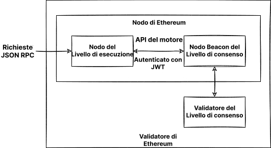

Eseguire il tuo nodo ti offre vari vantaggi, apre nuove possibilità e aiuta a supportare l'ecosistema. Questa pagina ti guiderà nell'avvio del tuo nodo e nella partecipazione alla convalida delle transazioni di [Ethereum](/).

Nota che dopo [Il Merge](/roadmap/merge), sono necessari due client per eseguire un nodo di Ethereum; un client del **livello di esecuzione (EL)** e un client del **livello di consenso (CL)**. Questa pagina mostrerà come installare, configurare e connettere questi due client per eseguire un nodo di Ethereum.

## Prerequisiti {#prerequisites}

Dovresti capire cos'è un nodo di Ethereum e perché potresti voler eseguire un client. Questo argomento è trattato in [Nodi e client](/developers/docs/nodes-and-clients/).

Se sei nuovo all'argomento dell'esecuzione di un nodo, o cerchi un percorso meno tecnico, ti consigliamo di dare prima un'occhiata alla nostra introduzione intuitiva sull'[eseguire un nodo di Ethereum](/run-a-node).

## Scegliere un approccio {#choosing-approach}

Il primo passo per avviare il tuo nodo è scegliere il tuo approccio. In base ai requisiti e alle varie possibilità, devi selezionare l'implementazione del client (sia dei client di esecuzione che di consenso), l'ambiente (hardware, sistema) e i parametri per le impostazioni del client.

Questa pagina ti guiderà attraverso queste decisioni e ti aiuterà a trovare il modo più adatto per eseguire la tua istanza di Ethereum.

Per scegliere tra le implementazioni dei client, vedi tutti i [client di esecuzione](/developers/docs/nodes-and-clients/#execution-clients) e i [client di consenso](/developers/docs/nodes-and-clients/#consensus-clients) pronti per la rete principale disponibili e scopri di più sulla [diversità dei client](/developers/docs/nodes-and-clients/client-diversity).

Decidi se eseguire il software sul tuo [hardware o nel cloud](#local-vs-cloud), considerando i [requisiti](#requirements) dei client.

Dopo aver preparato l'ambiente, installa i client scelti con un'[interfaccia adatta ai principianti](#automatized-setup) o [manualmente](#manual-setup) usando un terminale con opzioni avanzate.

Quando il nodo è in esecuzione e in sincronizzazione, sei pronto per [usarlo](#using-the-node), ma assicurati di tenere d'occhio la sua [manutenzione](#operating-the-node).



### Ambiente e hardware {#environment-and-hardware}

#### Locale o cloud {#local-vs-cloud}

I client di Ethereum sono in grado di funzionare su computer di livello consumer e non richiedono alcun hardware speciale, come ad esempio le macchine per il mining. Pertanto, hai varie opzioni per distribuire il nodo in base alle tue esigenze.
Per semplificare, pensiamo all'esecuzione di un nodo sia su una macchina fisica locale che su un server cloud:

- Cloud
  - I provider offrono un elevato tempo di attività del server e indirizzi IP pubblici statici
  - Ottenere un server dedicato o virtuale può essere più comodo che costruirne uno proprio
  - Il compromesso è fidarsi di una terza parte: il fornitore del server
  - A causa delle dimensioni di archiviazione richieste per un nodo completo, il prezzo di un server a noleggio potrebbe diventare alto
- Proprio hardware
  - Approccio più sovrano e senza bisogno di fiducia (trustless)
  - Investimento una tantum
  - Un'opzione per acquistare macchine preconfigurate
  - Devi preparare fisicamente, mantenere e potenzialmente risolvere i problemi della macchina e della rete

Entrambe le opzioni presentano diversi vantaggi riassunti sopra. Se stai cercando una soluzione cloud, oltre a molti fornitori tradizionali di cloud computing, ci sono anche servizi focalizzati sulla distribuzione di nodi. Dai un'occhiata ai [nodi come servizio](/developers/docs/nodes-and-clients/nodes-as-a-service/) per ulteriori opzioni sui nodi ospitati.

#### Hardware {#hardware}

Tuttavia, una rete decentralizzata e resistente alla censura non dovrebbe fare affidamento sui fornitori di cloud. Invece, eseguire il tuo nodo sul tuo hardware locale è più salutare per l'ecosistema. Le [stime](https://www.ethernodes.org/networkType/cl/Hosting) mostrano che un'ampia quota di nodi viene eseguita sul cloud, il che potrebbe diventare un singolo punto di guasto.

I client di Ethereum possono essere eseguiti sul tuo computer, laptop, server o persino su un computer a scheda singola. Sebbene sia possibile eseguire i client sul tuo personal computer, avere una macchina dedicata solo per il tuo nodo può migliorarne significativamente le prestazioni e la sicurezza, riducendo al minimo l'impatto sul tuo computer principale.

Usare il proprio hardware può essere molto semplice. Ci sono molte opzioni semplici così come configurazioni avanzate per persone più tecniche. Quindi esaminiamo i requisiti e i mezzi per eseguire i client di Ethereum sulla tua macchina.

#### Requisiti {#requirements}

I requisiti hardware differiscono in base al client, ma in genere non sono così elevati poiché il nodo deve solo rimanere sincronizzato. Non confonderlo con il mining, che richiede molta più potenza di calcolo. Il tempo di sincronizzazione e le prestazioni migliorano tuttavia con un hardware più potente.

Prima di installare qualsiasi client, assicurati che il tuo computer abbia risorse sufficienti per eseguirlo. Puoi trovare i requisiti minimi e consigliati di seguito.

Il collo di bottiglia per il tuo hardware è principalmente lo spazio su disco. La sincronizzazione della blockchain di Ethereum è molto intensiva in termini di input/output e richiede molto spazio. È meglio avere un'**unità a stato solido (SSD)** con centinaia di GB di spazio libero a disposizione anche dopo la sincronizzazione.

La dimensione del database e la velocità della sincronizzazione iniziale dipendono dal client scelto, dalla sua configurazione e dalla [strategia di sincronizzazione](/developers/docs/nodes-and-clients/#sync-modes).

Assicurati inoltre che la tua connessione Internet non sia limitata da un [limite di larghezza di banda](https://wikipedia.org/wiki/Data_cap). Si consiglia di utilizzare una connessione a consumo illimitato poiché la sincronizzazione iniziale e i dati trasmessi alla rete potrebbero superare il tuo limite.

##### Sistema operativo

Tutti i client supportano i principali sistemi operativi: Linux, MacOS, Windows. Ciò significa che puoi eseguire nodi su normali macchine desktop o server con il sistema operativo (OS) più adatto a te. Assicurati che il tuo sistema operativo sia aggiornato per evitare potenziali problemi e vulnerabilità di sicurezza.

##### Requisiti minimi

- CPU con 2+ core
- 8 GB di RAM
- SSD da 2TB
- Larghezza di banda di 10+ MBit/s

##### Specifiche consigliate

- CPU veloce con 4+ core
- 16 GB+ di RAM
- SSD veloce con 2+TB
- Larghezza di banda di 25+ MBit/s

La modalità di sincronizzazione e il client scelti influenzeranno i requisiti di spazio, ma abbiamo stimato lo spazio su disco di cui avrai bisogno per ciascun client di seguito.

| Client     | Dimensione del disco (sincronizzazione snap) | Dimensione del disco (archivio completo) |
| ---------- | --------------------- | ------------------------ |
| Besu       | 800GB+                | 12TB+                    |
| Erigon     | N/A                   | 2.5TB+                   |
| Geth       | 500GB+                | 12TB+                    |
| Nethermind | 500GB+                | 12TB+                    |
| Reth       | N/A                   | 2.2TB+                   |

- Nota: Erigon e Reth non offrono la sincronizzazione snap, ma è possibile il Pruning Completo (\~2TB per Erigon, ~1.2TB per Reth)

Per i client di consenso, il requisito di spazio dipende anche dall'implementazione del client e dalle funzionalità abilitate (ad es. lo slasher del validatore), ma in genere calcola altri 200GB necessari per i dati della beacon chain. Con un gran numero di validatori, cresce anche il carico della larghezza di banda. Puoi trovare [dettagli sui requisiti dei client di consenso in questa analisi](https://mirror.xyz/0x934e6B4D7eee305F8C9C42b46D6EEA09CcFd5EDc/b69LBy8p5UhcGJqUAmT22dpvdkU-Pulg2inrhoS9Mbc).

#### Soluzioni plug-and-play {#plug-and-play}

L'opzione più semplice per eseguire un nodo con il proprio hardware è utilizzare box plug-and-play. Le macchine preconfigurate dai fornitori offrono l'esperienza più semplice: ordina, connetti, esegui. Tutto è preconfigurato e funziona automaticamente con una guida intuitiva e una dashboard per il monitoraggio e il controllo del software.

- [DappNode](https://dappnode.io/)
- [Avado](https://ava.do/)

#### Ethereum su un computer a scheda singola {#ethereum-on-a-single-board-computer}

Un modo semplice ed economico per eseguire un nodo di Ethereum è utilizzare un computer a scheda singola, anche con un'architettura ARM come il Raspberry Pi. [Ethereum su ARM](https://ethereum-on-arm-documentation.readthedocs.io/en/latest/) fornisce immagini facili da eseguire di più client di esecuzione e di consenso per Raspberry Pi e altre schede ARM.

Dispositivi piccoli, convenienti ed efficienti come questi sono ideali per eseguire un nodo a casa, ma tieni presente le loro prestazioni limitate.

## Avviare il nodo {#spinning-up-node}

La configurazione effettiva del client può essere eseguita con launcher automatizzati o manualmente, configurando direttamente il software del client.

Per gli utenti meno avanzati, l'approccio consigliato è utilizzare un launcher, un software che ti guida attraverso l'installazione e automatizza il processo di configurazione del client. Tuttavia, se hai una certa esperienza nell'uso di un terminale, i passaggi per la configurazione manuale dovrebbero essere semplici da seguire.

### Configurazione guidata {#automatized-setup}

Diversi progetti intuitivi mirano a migliorare l'esperienza di configurazione di un client. Questi launcher forniscono l'installazione e la configurazione automatica del client, e alcuni offrono persino un'interfaccia grafica per la configurazione guidata e il monitoraggio dei client.

Di seguito sono riportati alcuni progetti che possono aiutarti a installare e controllare i client con pochi clic:

- [DappNode](https://docs.dappnode.io/docs/user/getting-started/choose-your-path) - DappNode non viene fornito solo con una macchina di un fornitore. Il software, il launcher del nodo vero e proprio e il centro di controllo con molte funzionalità possono essere utilizzati su hardware arbitrario.
- [EthPillar](https://www.coincashew.com/coins/overview-eth/ethpillar) - Il modo più rapido e semplice per configurare un nodo completo. Strumento di configurazione a riga singola e TUI per la gestione del nodo. Gratuito. Open source. Beni pubblici per Ethereum da parte di staker solitari. Supporto ARM64 e AMD64.
- [eth-docker](https://eth-docker.net/) - Configurazione automatizzata tramite Docker focalizzata su uno staking facile e sicuro, richiede conoscenze di base del terminale e di Docker, consigliato per utenti un po' più avanzati.
- [Stereum](https://stereum-dev.github.io/ethereum-node-web-docs) - Launcher per l'installazione di client su un server remoto tramite connessione SSH con una guida di configurazione GUI, centro di controllo e molte altre funzionalità.
- [Sedge](https://docs.sedge.nethermind.io/docs/intro) - Strumento di configurazione del nodo che genera automaticamente una configurazione Docker utilizzando una procedura guidata CLI. Scritto in Go da Nethermind.

### Configurazione manuale dei client {#manual-setup}

L'altra opzione è scaricare, verificare e configurare manualmente il software del client. Anche se alcuni client offrono un'interfaccia grafica, una configurazione manuale richiede comunque competenze di base con il terminale ma offre molta più versatilità.

Come spiegato in precedenza, la configurazione del tuo nodo di Ethereum richiederà l'esecuzione di una coppia di client di consenso e di esecuzione. Alcuni client potrebbero includere un client leggero dell'altro tipo e sincronizzarsi senza bisogno di alcun altro software. Tuttavia, la verifica completa senza bisogno di fiducia (trustless) richiede entrambe le implementazioni.

#### Ottenere il software del client {#getting-the-client}

Per prima cosa, devi ottenere il software del tuo [client di esecuzione](/developers/docs/nodes-and-clients/#execution-clients) e [client di consenso](/developers/docs/nodes-and-clients/#consensus-clients) preferito.

Puoi semplicemente scaricare un'applicazione eseguibile o un pacchetto di installazione adatto al tuo sistema operativo e alla tua architettura. Verifica sempre le firme e i checksum dei pacchetti scaricati. Alcuni client offrono anche repository o immagini Docker per un'installazione e aggiornamenti più semplici. Tutti i client sono open source, quindi puoi anche compilarli dal codice sorgente. Questo è un metodo più avanzato, ma in alcuni casi potrebbe essere necessario.

Le istruzioni per l'installazione di ciascun client sono fornite nella documentazione collegata negli elenchi dei client sopra.

Ecco le pagine di rilascio dei client dove puoi trovare i loro binari precompilati o le istruzioni sull'installazione:

##### Client di esecuzione

- [Besu](https://github.com/hyperledger/besu/releases)
- [Erigon](https://github.com/ledgerwatch/erigon/releases)
- [Geth](https://geth.ethereum.org/downloads)
- [Nethermind](https://downloads.nethermind.io/)
- [Reth](https://reth.rs/installation/installation.html)

Vale anche la pena notare che la diversità dei client è un [problema sul livello di esecuzione](/developers/docs/nodes-and-clients/client-diversity/#execution-layer). Si consiglia ai lettori di prendere in considerazione l'esecuzione di un client di esecuzione di minoranza.

##### Client di consenso

- [Lighthouse](https://github.com/sigp/lighthouse/releases/latest)
- [Lodestar](https://chainsafe.github.io/lodestar/run/getting-started/installation#build-from-source/) (Non fornisce un binario precompilato, solo un'immagine Docker o da compilare dal codice sorgente)
- [Nimbus](https://github.com/status-im/nimbus-eth2/releases/latest)
- [Prysm](https://github.com/prysmaticlabs/prysm/releases/latest)
- [Teku](https://github.com/ConsenSys/teku/releases)

La [diversità dei client](/developers/docs/nodes-and-clients/client-diversity/) è fondamentale per i nodi di consenso che eseguono validatori. Se la maggior parte dei validatori esegue una singola implementazione del client, la sicurezza della rete è a rischio. Si consiglia pertanto di prendere in considerazione la scelta di un client di minoranza.

[Vedi l'ultimo utilizzo dei client di rete](https://clientdiversity.org/) e scopri di più sulla [diversità dei client](/developers/docs/nodes-and-clients/client-diversity).

##### Verificare il software

Quando si scarica software da Internet, si consiglia di verificarne l'integrità. Questo passaggio è facoltativo ma, specialmente con un pezzo di infrastruttura cruciale come il client di Ethereum, è importante essere consapevoli dei potenziali vettori di attacco ed evitarli. Se hai scaricato un binario precompilato, devi fidarti di esso e rischiare che un utente malintenzionato possa scambiare l'eseguibile con uno dannoso.

Gli sviluppatori firmano i binari rilasciati con le loro chiavi PGP in modo da poter verificare crittograficamente che stai eseguendo esattamente il software che hanno creato. Devi solo ottenere le chiavi pubbliche utilizzate dagli sviluppatori, che possono essere trovate nelle pagine di rilascio del client o nella documentazione. Dopo aver scaricato la versione del client e la sua firma, puoi utilizzare un'implementazione PGP, ad es. [GnuPG](https://gnupg.org/download/index.html) per verificarli facilmente. Dai un'occhiata a un tutorial sulla verifica del software open source utilizzando `gpg` su [linux](https://www.tecmint.com/verify-pgp-signature-downloaded-software/) o [Windows/MacOS](https://freedom.press/training/verifying-open-source-software/).

Un'altra forma di verifica è assicurarsi che l'hash, un'impronta digitale crittografica univoca, del software scaricato corrisponda a quello fornito dagli sviluppatori. Questo è ancora più semplice dell'utilizzo di PGP e alcuni client offrono solo questa opzione. Basta eseguire la funzione di hash sul software scaricato e confrontarla con quella della pagina di rilascio. Ad esempio:

```sh
sha256sum teku-22.6.1.tar.gz

9b2f8c1f8d4dab0404ce70ea314ff4b3c77e9d27aff9d1e4c1933a5439767dde
```

#### Configurazione del client {#client-setup}

Dopo aver installato, scaricato o compilato il software del client, sei pronto per eseguirlo. Questo significa solo che deve essere eseguito con la configurazione corretta. I client offrono ricche opzioni di configurazione, che possono abilitare varie funzionalità.

Iniziamo con le opzioni che possono influenzare in modo significativo le prestazioni del client e l'utilizzo dei dati. Le [modalità di sincronizzazione](/developers/docs/nodes-and-clients/#sync-modes) rappresentano diversi metodi di download e convalida dei dati della blockchain. Prima di avviare il nodo, dovresti decidere quale rete e modalità di sincronizzazione utilizzare. Le cose più importanti da considerare sono lo spazio su disco e il tempo di sincronizzazione di cui il client avrà bisogno. Presta attenzione alla documentazione del client per determinare quale modalità di sincronizzazione è quella predefinita. Se non ti soddisfa, scegline un'altra in base al livello di sicurezza, ai dati disponibili e ai costi. Oltre all'algoritmo di sincronizzazione, puoi anche impostare il pruning (potatura) di diversi tipi di vecchi dati. Il pruning consente di eliminare i dati obsoleti, ovvero rimuovere i nodi del trie di stato che non sono raggiungibili dai blocchi recenti.

Altre opzioni di configurazione di base sono, ad es., la scelta di una rete: rete principale o reti di test, l'abilitazione dell'endpoint HTTP per RPC o WebSocket, ecc. Puoi trovare tutte le funzionalità e le opzioni nella documentazione del client. Varie configurazioni del client possono essere impostate eseguendo il client con i flag corrispondenti direttamente nella CLI o nel file di configurazione. Ogni client è un po' diverso; fai sempre riferimento alla sua documentazione ufficiale o alla pagina di aiuto per i dettagli sulle opzioni di configurazione.

A scopo di test, potresti preferire eseguire un client su una delle reti di test. [Vedi la panoramica delle reti supportate](/developers/docs/nodes-and-clients/#execution-clients).

Esempi di esecuzione di client di esecuzione con configurazione di base possono essere trovati nella sezione successiva.

#### Avviare il client di esecuzione {#starting-the-execution-client}

Prima di avviare il software del client di Ethereum, esegui un ultimo controllo per assicurarti che il tuo ambiente sia pronto. Ad esempio, assicurati che:

- Ci sia spazio su disco sufficiente considerando la rete e la modalità di sincronizzazione scelte.
- La memoria e la CPU non siano bloccate da altri programmi.
- Il sistema operativo sia aggiornato all'ultima versione.
- Il sistema abbia l'ora e la data corrette.
- Il tuo router e firewall accettino connessioni sulle porte in ascolto. Per impostazione predefinita, i client di Ethereum utilizzano una porta di ascolto (TCP) e una porta di rilevamento (UDP), entrambe sulla 30303 per impostazione predefinita.

Esegui prima il tuo client su una rete di test per assicurarti che tutto funzioni correttamente.

Devi dichiarare all'avvio tutte le impostazioni del client che non sono predefinite. Puoi utilizzare i flag o il file di configurazione per dichiarare la tua configurazione preferita. L'insieme di funzionalità e la sintassi di configurazione di ciascun client differiscono. Consulta la documentazione del tuo client per i dettagli.

I client di esecuzione e di consenso comunicano tramite un endpoint autenticato specificato nell'[API Engine](https://github.com/ethereum/execution-apis/tree/main/src/engine). Per connettersi a un client di consenso, il client di esecuzione deve generare un [`jwtsecret`](https://jwt.io/) in un percorso noto. Per motivi di sicurezza e stabilità, i client dovrebbero essere eseguiti sulla stessa macchina ed entrambi i client devono conoscere questo percorso poiché viene utilizzato per autenticare una connessione RPC locale tra di loro. Il client di esecuzione deve anche definire una porta in ascolto per le API autenticate.

Questo token viene generato automaticamente dal software del client, ma in alcuni casi potresti doverlo fare tu stesso. Puoi generarlo utilizzando [OpenSSL](https://www.openssl.org/):

```sh
openssl rand -hex 32 > jwtsecret
```

#### Eseguire un client di esecuzione {#running-an-execution-client}

Questa sezione ti guiderà nell'avvio dei client di esecuzione. Serve solo come esempio di una configurazione di base, che avvierà il client con queste impostazioni:

- Specifica la rete a cui connettersi, la rete principale nei nostri esempi
  - Puoi invece scegliere [una delle reti di test](/developers/docs/networks/) per test preliminari della tua configurazione
- Definisce la directory dei dati, dove verranno archiviati tutti i dati inclusa la blockchain
  - Assicurati di sostituire il percorso con uno reale, ad es. puntando al tuo disco esterno
- Abilita le interfacce per comunicare con il client
  - Inclusi JSON-RPC e API Engine per la comunicazione con il client di consenso
- Definisce il percorso a `jwtsecret` per l'API autenticata
  - Assicurati di sostituire il percorso di esempio con uno reale a cui i client possano accedere, ad es. `/tmp/jwtsecret`

Tieni presente che questo è solo un esempio di base, tutte le altre impostazioni verranno impostate sui valori predefiniti. Presta attenzione alla documentazione di ciascun client per conoscere i valori predefiniti, le impostazioni e le funzionalità. Per ulteriori funzionalità, ad esempio per l'esecuzione di validatori, il monitoraggio, ecc., fai riferimento alla documentazione del client specifico.

> Nota che le barre rovesciate `` negli esempi servono solo a scopo di formattazione; i flag di configurazione possono essere definiti in una singola riga.

##### Eseguire Besu

Questo esempio avvia Besu sulla rete principale, archivia i dati della blockchain nel formato predefinito in `/data/ethereum`, abilita JSON-RPC e Engine RPC per la connessione del client di consenso. L'API Engine è autenticata con il token `jwtsecret` e sono consentite solo le chiamate da `localhost`.

```sh
besu --network=mainnet \
    --data-path=/data/ethereum \
    --rpc-http-enabled=true \
    --engine-rpc-enabled=true \
    --engine-host-allowlist="*" \
    --engine-jwt-enabled=true \
    --engine-jwt-secret=/path/to/jwtsecret
```

Besu include anche un'opzione launcher che farà una serie di domande e genererà il file di configurazione. Esegui il launcher interattivo utilizzando:

```sh
besu --Xlauncher
```

La [documentazione di Besu](https://besu.hyperledger.org/public-networks/get-started/start-node/) contiene opzioni aggiuntive e dettagli di configurazione.

##### Eseguire Erigon

Questo esempio avvia Erigon sulla rete principale, archivia i dati della blockchain in `/data/ethereum`, abilita JSON-RPC, definisce quali namespace sono consentiti e abilita l'autenticazione per la connessione del client di consenso che è definita dal percorso `jwtsecret`.

```sh
erigon --chain mainnet \
    --datadir /data/ethereum  \
    --http --http.api=engine,eth,web3,net \
    --authrpc.jwtsecret=/path/to/jwtsecret
```

Erigon per impostazione predefinita esegue una sincronizzazione completa con 8GB di HDD che si tradurrà in oltre 2TB di dati di archivio. Assicurati che `datadir` punti a un disco con spazio libero sufficiente o esamina il flag `--prune` che può tagliare diversi tipi di dati. Controlla l'`--help` di Erigon per saperne di più.

##### Eseguire Geth

Questo esempio avvia Geth sulla rete principale, archivia i dati della blockchain in `/data/ethereum`, abilita JSON-RPC e definisce quali namespace sono consentiti. Abilita anche l'autenticazione per la connessione del client di consenso che richiede il percorso a `jwtsecret` e anche l'opzione che definisce quali connessioni sono consentite, nel nostro esempio solo da `localhost`.

```sh
geth --mainnet \
    --datadir "/data/ethereum" \
    --http --authrpc.addr localhost \
    --authrpc.vhosts="localhost" \
    --authrpc.port 8551
    --authrpc.jwtsecret=/path/to/jwtsecret
```

Controlla la [documentazione per tutte le opzioni di configurazione](https://geth.ethereum.org/docs/fundamentals/command-line-options) e scopri di più sull'[esecuzione di Geth con un client di consenso](https://geth.ethereum.org/docs/getting-started/consensus-clients).

##### Eseguire Nethermind

Nethermind offre varie [opzioni di installazione](https://docs.nethermind.io/get-started/installing-nethermind). Il pacchetto viene fornito con vari binari, incluso un Launcher con una configurazione guidata, che ti aiuterà a creare la configurazione in modo interattivo. In alternativa, trovi Runner che è l'eseguibile stesso e puoi semplicemente eseguirlo con i flag di configurazione. JSON-RPC è abilitato per impostazione predefinita.

```sh
Nethermind.Runner --config mainnet \
    --datadir /data/ethereum \
    --JsonRpc.JwtSecretFile=/path/to/jwtsecret
```

La documentazione di Nethermind offre una [guida completa](https://docs.nethermind.io/get-started/running-node/) sull'esecuzione di Nethermind con il client di consenso.

Un client di esecuzione avvierà le sue funzioni principali, gli endpoint scelti e inizierà a cercare peer. Dopo aver scoperto con successo i peer, il client avvia la sincronizzazione. Il client di esecuzione attenderà una connessione dal client di consenso. I dati correnti della blockchain saranno disponibili una volta che il client sarà sincronizzato con successo allo stato corrente.

##### Eseguire Reth

Questo esempio avvia Reth sulla rete principale, utilizzando la posizione dei dati predefinita. Abilita l'autenticazione JSON-RPC e Engine RPC per la connessione del client di consenso che è definita dal percorso `jwtsecret`, con solo le chiamate da `localhost` consentite.

```sh
reth node \
    --authrpc.jwtsecret /path/to/jwtsecret \
    --authrpc.addr 127.0.0.1 \
    --authrpc.port 8551
```

Vedi [Configurazione di Reth](https://reth.rs/run/config.html?highlight=data%20directory#configuring-reth) per saperne di più sulle directory dei dati predefinite. La [documentazione di Reth](https://reth.rs/run/mainnet.html) contiene opzioni aggiuntive e dettagli di configurazione.

#### Avviare il client di consenso {#starting-the-consensus-client}

Il client di consenso deve essere avviato con la corretta configurazione della porta per stabilire una connessione RPC locale al client di esecuzione. I client di consenso devono essere eseguiti con la porta esposta del client di esecuzione come argomento di configurazione.

Il client di consenso ha anche bisogno del percorso al `jwt-secret` del client di esecuzione per autenticare la connessione RPC tra di loro. Similmente agli esempi di esecuzione sopra, ogni client di consenso ha un flag di configurazione che accetta il percorso del file del token jwt come argomento. Questo deve essere coerente con il percorso `jwtsecret` fornito al client di esecuzione.

Se hai intenzione di eseguire un validatore, assicurati di aggiungere un flag di configurazione che specifichi l'indirizzo Ethereum del destinatario delle commissioni. È qui che si accumulano le ricompense in ether per il tuo validatore. Ogni client di consenso ha un'opzione, ad es. `--suggested-fee-recipient=0xabcd1`, che accetta un indirizzo Ethereum come argomento.

Quando si avvia un Nodo Beacon su una rete di test, è possibile risparmiare molto tempo di sincronizzazione utilizzando un endpoint pubblico per la [Sincronizzazione dei checkpoint](https://notes.ethereum.org/@launchpad/checkpoint-sync).

#### Eseguire un client di consenso {#running-a-consensus-client}

##### Eseguire Lighthouse

Prima di eseguire Lighthouse, scopri di più su come installarlo e configurarlo nel [Lighthouse Book](https://lighthouse-book.sigmaprime.io/installation.html).

```sh
lighthouse beacon_node \
    --network mainnet \
    --datadir /data/ethereum \
    --http \
    --execution-endpoint http://127.0.0.1:8551 \
    --execution-jwt /path/to/jwtsecret
```

##### Eseguire Lodestar

Installa il software Lodestar compilandolo o scaricando l'immagine Docker. Scopri di più nella [documentazione](https://chainsafe.github.io/lodestar/) e nella [guida di configurazione](https://hackmd.io/@philknows/rk5cDvKmK) più completa.

```sh
lodestar beacon \
    --dataDir="/data/ethereum" \
    --network=mainnet \
    --eth1.enabled=true \
    --execution.urls="http://127.0.0.1:8551" \
    --jwt-secret="/path/to/jwtsecret"
```

##### Eseguire Nimbus

Nimbus viene fornito con client sia di consenso che di esecuzione. Può essere eseguito su vari dispositivi anche con una potenza di calcolo molto modesta.
Dopo aver [installato le dipendenze e Nimbus stesso](https://nimbus.guide/quick-start.html), puoi eseguire il suo client di consenso:

```sh
nimbus_beacon_node \
    --network=mainnet \
    --web3-url=http://127.0.0.1:8551 \
    --rest \
    --jwt-secret="/path/to/jwtsecret"
```

##### Eseguire Prysm

Prysm viene fornito con uno script che consente una facile installazione automatica. I dettagli possono essere trovati nella [documentazione di Prysm](https://prysm.offchainlabs.com/docs/install-prysm/install-with-script/).

```sh
./prysm.sh beacon-chain \
    --mainnet \
    --datadir /data/ethereum  \
    --execution-endpoint=http://localhost:8551  \
    --jwt-secret=/path/to/jwtsecret
```

##### Eseguire Teku

```sh
teku --network mainnet \
    --data-path "/data/ethereum" \
    --ee-endpoint http://localhost:8551 \
    --ee-jwt-secret-file "/path/to/jwtsecret"
```

Quando un client di consenso si connette al client di esecuzione per leggere il contratto di deposito e identificare i validatori, si connette anche ad altri peer del Nodo Beacon e inizia a sincronizzare gli slot di consenso dalla genesi. Una volta che il Nodo Beacon raggiunge l'epoca corrente, l'API Beacon diventa utilizzabile per i tuoi validatori. Scopri di più sulle [API del Nodo Beacon](https://eth2docs.vercel.app/).

### Aggiungere Validatori {#adding-validators}

Un client di consenso funge da Nodo Beacon a cui i validatori possono connettersi. Ogni client di consenso ha il proprio software per validatori descritto in dettaglio nella rispettiva documentazione.

L'esecuzione del proprio validatore consente lo [staking in solitaria](/staking/solo/), il metodo più d'impatto e senza bisogno di fiducia (trustless) per supportare la rete Ethereum. Tuttavia, questo richiede un deposito di 32 ETH. Per eseguire un validatore sul tuo nodo con un importo inferiore, potrebbe interessarti una pool decentralizzata con operatori di nodi senza permessi, come [Rocket Pool](https://rocketpool.net/node-operators).

Il modo più semplice per iniziare con lo staking e la generazione delle chiavi del validatore è utilizzare l'[Hoodi Testnet Staking Launchpad](https://hoodi.launchpad.ethereum.org/), che ti consente di testare la tua configurazione [eseguendo nodi su Hoodi](https://notes.ethereum.org/@launchpad/hoodi). Quando sei pronto per la rete principale, puoi ripetere questi passaggi utilizzando il [Mainnet Staking Launchpad](https://launchpad.ethereum.org/).

Consulta la [pagina dello staking](/staking) per una panoramica sulle opzioni di staking.

### Usare il nodo {#using-the-node}

I client di esecuzione offrono [endpoint API RPC](/developers/docs/apis/json-rpc/) che puoi utilizzare per inviare transazioni, interagire con o distribuire contratti intelligenti sulla rete Ethereum in vari modi:

- Chiamandoli manualmente con un protocollo adatto (ad es. usando `curl`)
- Collegando una console fornita (ad es. `geth attach`)
- Implementandoli in applicazioni utilizzando librerie web3, ad es. [web3.py](https://web3py.readthedocs.io/en/stable/overview.html#overview), [ethers](https://github.com/ethers-io/ethers.js/)

Client diversi hanno implementazioni diverse degli endpoint RPC. Ma esiste un JSON-RPC standard che puoi utilizzare con ogni client. Per una panoramica [leggi la documentazione JSON-RPC](/developers/docs/apis/json-rpc/). Le applicazioni che necessitano di informazioni dalla rete Ethereum possono utilizzare questa RPC. Ad esempio, il popolare portafoglio MetaMask ti consente di [connetterti al tuo endpoint RPC](https://metamask.zendesk.com/hc/en-us/articles/360015290012-Using-a-Local-Node) che offre forti vantaggi in termini di privacy e sicurezza.

I client di consenso espongono tutti un'[API Beacon](https://ethereum.github.io/beacon-APIs) che può essere utilizzata per controllare lo stato del client di consenso o scaricare blocchi e dati di consenso inviando richieste utilizzando strumenti come [Curl](https://curl.se). Maggiori informazioni su questo possono essere trovate nella documentazione di ciascun client di consenso.

#### Raggiungere l'RPC {#reaching-rpc}

La porta predefinita per il JSON-RPC del client di esecuzione è `8545` ma puoi modificare le porte degli endpoint locali nella configurazione. Per impostazione predefinita, l'interfaccia RPC è raggiungibile solo sul localhost del tuo computer. Per renderla accessibile da remoto, potresti volerla esporre al pubblico modificando l'indirizzo in `0.0.0.0`. Questo la renderà raggiungibile sulla rete locale e sugli indirizzi IP pubblici. Nella maggior parte dei casi dovrai anche impostare il port forwarding sul tuo router.

Affronta l'esposizione delle porte a Internet con cautela poiché ciò consentirà a chiunque su Internet di controllare il tuo nodo. Attori malintenzionati potrebbero accedere al tuo nodo per abbattere il tuo sistema o rubare i tuoi fondi se stai utilizzando il tuo client come portafoglio.

Un modo per aggirare questo problema è impedire che metodi RPC potenzialmente dannosi siano modificabili. Ad esempio, con Geth, puoi dichiarare metodi modificabili con un flag: `--http.api web3,eth,txpool`.

L'accesso all'interfaccia RPC può essere esteso attraverso lo sviluppo di API del livello edge o applicazioni server web, come Nginx, e collegandole all'indirizzo e alla porta locali del tuo client. Sfruttare un livello intermedio può anche consentire agli sviluppatori la possibilità di configurare un certificato per connessioni `https` sicure all'interfaccia RPC.

Configurare un server web, un proxy o un'API Rest rivolta all'esterno non è l'unico modo per fornire accesso all'endpoint RPC del tuo nodo. Un altro modo per preservare la privacy per configurare un endpoint raggiungibile pubblicamente è ospitare il nodo sul tuo servizio onion [Tor](https://www.torproject.org/). Questo ti consentirà di raggiungere l'RPC al di fuori della tua rete locale senza un indirizzo IP pubblico statico o porte aperte. Tuttavia, l'utilizzo di questa configurazione potrebbe consentire l'accesso all'endpoint RPC solo tramite la rete Tor, che non è supportata da tutte le applicazioni e potrebbe causare problemi di connessione.

Per fare ciò, devi creare il tuo [servizio onion](https://community.torproject.org/onion-services/). Dai un'occhiata alla [documentazione](https://community.torproject.org/onion-services/setup/) sulla configurazione del servizio onion per ospitare il tuo. Puoi puntarlo a un server web con proxy alla porta RPC o semplicemente direttamente all'RPC.

Infine, e uno dei modi più popolari per fornire accesso alle reti interne è attraverso una connessione VPN. A seconda del tuo caso d'uso e della quantità di utenti che necessitano di accedere al tuo nodo, una connessione VPN sicura potrebbe essere un'opzione. [OpenVPN](https://openvpn.net/) è una VPN SSL completa che implementa l'estensione di rete sicura di livello OSI 2 o 3 utilizzando il protocollo SSL/TLS standard del settore, supporta metodi di autenticazione client flessibili basati su certificati, smart card e/o credenziali nome utente/password e consente criteri di controllo degli accessi specifici per utente o gruppo utilizzando regole firewall applicate all'interfaccia virtuale VPN.

### Gestire il nodo {#operating-the-node}

Dovresti monitorare regolarmente il tuo nodo per assicurarti che funzioni correttamente. Potrebbe essere necessario eseguire una manutenzione occasionale.

#### Mantenere un nodo online {#keeping-node-online}

Il tuo nodo non deve essere online tutto il tempo, ma dovresti mantenerlo online il più possibile per mantenerlo sincronizzato con la rete. Puoi spegnerlo per riavviarlo, ma tieni presente che:

- Lo spegnimento può richiedere alcuni minuti se lo stato recente è ancora in fase di scrittura su disco.
- Gli spegnimenti forzati possono danneggiare il database richiedendoti di risincronizzare l'intero nodo.
- Il tuo client non sarà più sincronizzato con la rete e dovrà risincronizzarsi quando lo riavvierai. Sebbene il nodo possa iniziare la sincronizzazione da dove era stato spento l'ultima volta, il processo può richiedere tempo a seconda di quanto tempo è stato offline.

_Questo non si applica ai nodi validatori del livello di consenso._ Portare il tuo nodo offline influenzerà tutti i servizi che dipendono da esso. Se stai eseguendo un nodo per scopi di _staking_ dovresti cercare di ridurre al minimo i tempi di inattività il più possibile.

#### Creare servizi client {#creating-client-services}

Prendi in considerazione la creazione di un servizio per eseguire i tuoi client automaticamente all'avvio. Ad esempio, sui server Linux, una buona pratica sarebbe creare un servizio, ad es. con `systemd`, che esegue il client con la configurazione corretta, sotto un utente con privilegi limitati e si riavvia automaticamente.

#### Aggiornare i client {#updating-clients}

Devi mantenere aggiornato il software del tuo client con le ultime patch di sicurezza, funzionalità ed [EIP](/eips/). Soprattutto prima delle [biforcazioni hard](/ethereum-forks/), assicurati di eseguire le versioni corrette del client.

> Prima di importanti aggiornamenti di rete, la EF pubblica un post sul suo [blog](https://blog.ethereum.org). Puoi [iscriverti a questi annunci](https://blog.ethereum.org/category/protocol#subscribe) per ricevere una notifica via e-mail quando il tuo nodo necessita di un aggiornamento.

Aggiornare i client è molto semplice. Ogni client ha istruzioni specifiche nella propria documentazione, ma il processo consiste generalmente nel scaricare l'ultima versione e riavviare il client con il nuovo eseguibile. Il client dovrebbe riprendere da dove si era interrotto, ma con gli aggiornamenti applicati.

Ogni implementazione del client ha una stringa di versione leggibile dall'uomo utilizzata nel protocollo peer-to-peer ma è anche accessibile dalla riga di comando. Questa stringa di versione consente agli utenti di verificare che stiano eseguendo la versione corretta e consente agli esploratori di blocchi e ad altri strumenti analitici interessati di quantificare la distribuzione di client specifici sulla rete. Fai riferimento alla documentazione del singolo client per ulteriori informazioni sulle stringhe di versione.

#### Eseguire servizi aggiuntivi {#running-additional-services}

L'esecuzione del tuo nodo ti consente di utilizzare servizi che richiedono l'accesso diretto all'RPC del client di Ethereum. Questi sono servizi costruitti su Ethereum come [soluzioni di livello 2](/developers/docs/scaling/#layer-2-scaling), backend per portafogli, esploratori di blocchi, strumenti per sviluppatori e altre infrastrutture di Ethereum.

#### Monitorare il nodo {#monitoring-the-node}

Per monitorare correttamente il tuo nodo, prendi in considerazione la raccolta di metriche. I client forniscono endpoint di metriche in modo da poter ottenere dati completi sul tuo nodo. Usa strumenti come [InfluxDB](https://www.influxdata.com/get-influxdb/) o [Prometheus](https://prometheus.io/) per creare database che puoi trasformare in visualizzazioni e grafici in software come [Grafana](https://grafana.com/). Ci sono molte configurazioni per l'utilizzo di questo software e diverse dashboard Grafana per visualizzare il tuo nodo e la rete nel suo insieme. Ad esempio, dai un'occhiata al [tutorial sul monitoraggio di Geth](/developers/tutorials/monitoring-geth-with-influxdb-and-grafana/).

Come parte del tuo monitoraggio, assicurati di tenere d'occhio le prestazioni della tua macchina. Durante la sincronizzazione iniziale del tuo nodo, il software del client potrebbe essere molto pesante per CPU e RAM. Oltre a Grafana, puoi utilizzare gli strumenti offerti dal tuo sistema operativo come `htop` o `uptime` per farlo.

## Letture consigliate {#further-reading}

- [Guide allo staking di Ethereum](https://github.com/SomerEsat/ethereum-staking-guides) - _Somer Esat, aggiornato di frequente_
- [Guida | Come configurare un validatore per lo staking di Ethereum sulla rete principale](https://www.coincashew.com/coins/overview-eth/guide-or-how-to-setup-a-validator-on-eth2-mainnet) _– CoinCashew, aggiornato di frequente_
- [Guide di ETHStaker sull'esecuzione di validatori su reti di test](https://github.com/remyroy/ethstaker#guides) – _ETHStaker, aggiornato regolarmente_
- [App di esempio AWS Blockchain Node Runner per nodi Ethereum](https://aws-samples.github.io/aws-blockchain-node-runners/docs/Blueprints/Ethereum) - _AWS, aggiornato di frequente_
- [FAQ sul Merge per gli operatori dei nodi](https://notes.ethereum.org/@launchpad/node-faq-merge) - _Luglio 2022_
- [Analisi dei requisiti hardware per essere un nodo validato completo di Ethereum](https://medium.com/coinmonks/analyzing-the-hardware-requirements-to-be-an-ethereum-full-validated-node-dc064f167902) _– Albert Palau, 24 settembre 2018_
- [Esecuzione di nodi completi di Ethereum: una guida per i poco motivati](https://medium.com/@JustinMLeroux/running-ethereum-full-nodes-a-guide-for-the-barely-motivated-a8a13e7a0d31) _– Justin Leroux, 7 novembre 2019_
- [Esecuzione di un nodo Hyperledger Besu sulla rete principale di Ethereum: vantaggi, requisiti e configurazione](https://pegasys.tech/running-a-hyperledger-besu-node-on-the-ethereum-mainnet-benefits-requirements-and-setup/) _– Felipe Faraggi, 7 maggio 2020_
- [Distribuzione del client Ethereum Nethermind con stack di monitoraggio](https://medium.com/nethermind-eth/deploying-nethermind-ethereum-client-with-monitoring-stack-55ce1622edbd) _– Nethermind.eth, 8 luglio 2020_

## Argomenti correlati {#related-topics}

- [Nodi e client](/developers/docs/nodes-and-clients/)
- [Blocchi](/developers/docs/blocks/)
- [Reti](/developers/docs/networks/)