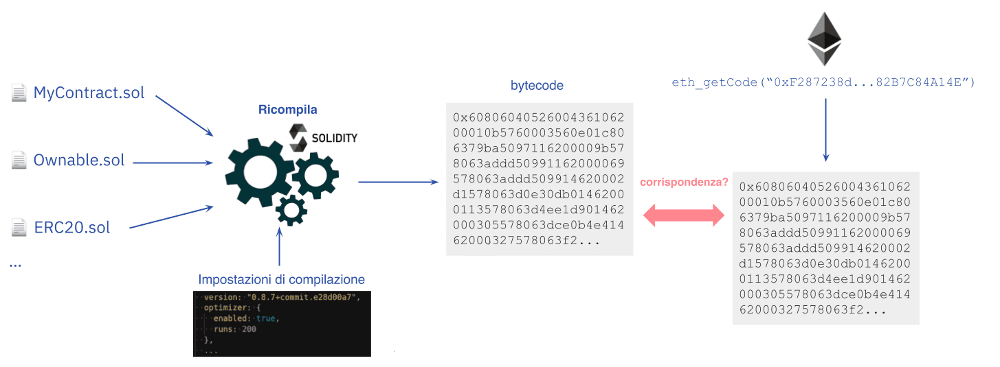

I [contratti intelligenti](/developers/docs/smart-contracts/) sono progettati per essere "senza fiducia", a significare che gli utenti non dovrebbero essere obbligati a fidarsi di terze parti (es. sviluppatori e aziende) prima di interagire con un contratto. Come requisito della mancanza di fiducia, gli utenti e gli altri sviluppatori devono poter verificare il codice sorgente di un contratto intelligente. La verifica del codice sorgente assicura agli utenti e agli sviluppatori che il codice del contratto pubblicato è lo stesso eseguito all'indirizzo del contratto sulla blockchain di Ethereum.

È importante operare una distinzione tra "verifica del codice sorgente" e "[verifica formale](/developers/docs/smart-contracts/formal-verification/)". La verifica del codice sorgente, che sarà spiegata nel dettaglio di seguito, si riferisce alla verifica che un dato codice sorgente di un contratto intelligente in un linguaggio di alto livello (es. Solidity) si compili allo stesso bytecode da eseguire all'indirizzo del contratto. Tuttavia, la verifica formale descrive la verifica della correttezza di un contratto intelligente, ossia che il contratto si comporti come previsto. Sebbene dipenda dal contesto, la verifica del contratto si riferisce solitamente alla verifica del codice sorgente.

## Cos'è la verifica del codice sorgente? {#what-is-source-code-verification}

Prima di distribuire un contratto intelligente nella [Macchina virtuale di Ethereum (EVM)](/developers/docs/evm/), gli sviluppatori [compilano](/developers/docs/smart-contracts/compiling/) il codice sorgente del contratto, ovvero le istruzioni [scritte in Solidity](/developers/docs/smart-contracts/languages/) o in un altro linguaggio di programmazione di alto livello, in bytecode. Poiché l'EVM non può interpretare le istruzioni di alto livello, compilare il codice sorgente al bytecode (cioè, al basso livello, le istruzioni macchina) è necessario per eseguire la logica del contratto nell'EVM.

La verifica del codice sorgente consiste nel confrontare il codice sorgente di un contratto intelligente e il bytecode compilato utilizzato durante la creazione del contratto per rilevare eventuali differenze. La verifica dei contratti intelligenti è importante perché il codice del contratto pubblicizzato potrebbe avere una forma differente da quello eseguito sulla blockchain.

La verifica del contratto intelligente consente di studiare cosa faccia un contratto tramite il linguaggio di livello superiore in cui è scritto senza dover leggere il codice macchina. Le funzioni, i valori e solitamente i nomi delle variabili e i commenti restano uguali al codice sorgente originale compilato e distribuito. Questo semplifica molto la lettura del codice. La verifica del codice sorgente, inoltre, prevede la documentazione del codice, così che gli utenti finali sappiano per cosa sia progettato un contratto intelligente.

### Cos'è la verifica completa? {#full-verification}

Esistono delle parti del codice sorgente che non influenzano il bytecode compilato, quali commenti o nomi delle variabili. Ciò significa che due codici sorgente con nomi delle variabili e commenti differenti sarebbero entrambi capaci di verificare lo stesso contratto. Così, un utente malevolo può aggiungere commenti ingannevoli o dare nomi di variabili fuorvianti nel codice sorgente e far verificare il contratto con un codice sorgente differente da quello originale.

È possibile evitarlo aggiungendo ulteriori dati al bytecode, che servano da _garanzia crittografica_ per l'esattezza del codice sorgente, e da _impronta digitale_ delle informazioni di compilazione. Le informazioni necessarie si trovano nei [metadati del contratto di Solidity](https://docs.soliditylang.org/en/v0.8.15/metadata.html), e l'hash di questo file è aggiunto al bytecode di un contratto. È possibile vederlo in azione nel [playground dei metadati](https://playground.sourcify.dev)

Il file dei metadati contiene le informazioni sulla compilazione del contratto, inclusi i file sorgente e i loro hash. Ciò significa che, se una delle impostazioni di compilazione o persino un byte in uno dei file sorgente cambiano, il file dei metadati cambia. Di conseguenza, anche l'hash del file dei metadati, aggiunto al bytecode, cambia. Ciò significa che se il bytecode di un contratto + l'hash dei metadati aggiunto corrisponde al codice sorgente e alle impostazioni di compilazione indicati, possiamo essere certi che sia esattamente lo stesso codice sorgente utilizzato nella compilazione originale e che nemmeno un singolo byte sia differente.

Questo tipo di verifica, che sfrutta l'hash dei metadati, è definito **"[verifica completa](https://docs.sourcify.dev/docs/full-vs-partial-match/)"** (o "verifica perfetta"). Se gli hash dei metadati non corrispondono o non sono considerati nella verifica, sarebbe una "corrispondenza parziale", attualmente il metodo più comune per verificare i contratti. È possibile [inserire codice malevolo](https://samczsun.com/hiding-in-plain-sight/) che non verrebbe riflesso nel codice sorgente verificato senza una verifica completa. Gran parte degli sviluppatori non è a conoscenza della verifica completa e non conserva il file dei metadati della propria compilazione, per cui finora la verifica parziale è stata il metodo utilizzato di fatto per la verifica dei contratti.

## Perché la verifica del codice sorgente è importante? {#importance-of-source-code-verification}

### Mancanza di fiducia {#trustlessness}

La mancanza di fiducia è senza dubbio la più grande premessa per i contratti intelligenti e le [applicazioni decentralizzate (dApp)](/developers/docs/dapps/). I contratti intelligenti sono "immutabili" e inalterabili; un contratto eseguirà la logica aziendale definita nel codice soltanto al momento della distribuzione. Ciò significa che sviluppatori e imprese non possono manomettere il codice di un contratto dopo la distribuzione su Ethereum.

Perché un contratto intelligente sia senza fiducia, il suo codice dovrebbe essere disponibile per la verifica indipendente. Mentre il bytecode compilato per ogni contratto intelligente è pubblicamente disponibile sulla blockchain, il linguaggio di basso livello è difficile da comprendere, sia per gli sviluppatori che per gli utenti.

I progetti riducono le ipotesi di fiducia pubblicando il codice sorgente dei propri contratti. Ma ciò comporta un altro problema: è difficile verificare che il codice sorgente pubblicato corrisponda al bytecode del contratto. In questo scenario, il valore di mancanza di fiducia è perduto poiché gli utenti devono fidarsi del fatto che gli sviluppatori non modifichino la logica aziendale di un contratto (modificando il bytecode) prima di distribuirlo sulla blockchain.

Gli strumenti di verifica del codice sorgente forniscono garanzie che i file del codice sorgente di un contratto intelligente corrispondano al codice assembly. Il risultato è un ecosistema senza fiducia, in cui gli utenti non si fidano ciecamente di terze parti e verificano piuttosto il codice prima di depositare fondi in un contratto.

### Sicurezza dell'utente {#user-safety}

Con i contratti intelligenti, solitamente è in gioco molto denaro. Questo richiede maggiori garanzie di sicurezza e la verifica della logica di un contratto intelligente prima del suo utilizzo. Il problema è che gli sviluppatori disonesti possono ingannare gli utenti inserendo del codice malevolo in un contratto intelligente. Senza verifica, i contratti intelligenti malevoli possono avere [backdoor](https://www.trustnodes.com/2018/11/10/concerns-rise-over-backdoored-smart-contracts), meccanismi di controllo degli accessi controversi, vulnerabilità sfruttabili e altri elementi che mettono a repentaglio la sicurezza dell'utente e che non verrebbero rilevati.

Pubblicare i file del codice sorgente di un contratto intelligente rende più semplice per coloro che sono interessati, come i revisori, valutare il contratto per individuare potenziali vettori d'attacco. Con molte parti che verificano indipendentemente un contratto intelligente, gli utenti hanno maggiori garanzie della sua sicurezza.

## Come verificare il codice sorgente dei contratti intelligenti di Ethereum {#source-code-verification-for-ethereum-smart-contracts}

La [distribuzione di un contratto intelligente su Ethereum](/developers/docs/smart-contracts/deploying/) richiede l'invio di una transazione con un payload di dati (bytecode compilato) a un indirizzo speciale. Il payload di dati è generato compilando il codice sorgente, più gli [argomenti del costruttore](https://docs.soliditylang.org/en/v0.8.14/contracts.html#constructor) dell'istanza del contratto aggiunti al payload dei dati nella transazione. La compilazione è deterministica, il che significa che produce sempre lo stesso risultato (cioè, il bytecode del contratto) se sono utilizzati gli stessi file sorgente e le stesse impostazioni di compilazione (es. versione del compilatore, ottimizzatore).

La verifica di un contratto intelligente comporta fondamentalmente i seguenti passaggi:

1. Inserimento dei file sorgente e delle impostazioni di compilazione in un compilatore.

2. Il compilatore produce il bytecode del contratto

3. Ottenimento del bytecode del contratto distribuito a un certo indirizzo

4. Confronto del bytecode distribuito con il bytecode ricompilato. Se i codici corrispondono, il contratto viene verificato con il codice sorgente e le impostazioni di compilazione indicati.

5. Inoltre, se gli hash dei metadati alla fine del bytecode corrispondono, sarà una corrispondenza completa.

Nota che questa è una descrizione semplicistica della verifica e che esistono molte eccezioni che non funzionerebbero in questo caso, come avere [variabili immutabili](https://docs.sourcify.dev/docs/immutables/).

## Strumenti per la verifica del codice sorgente {#source-code-verification-tools}

Il tradizionale processo di verifica dei contratti può essere complesso. Per questo abbiamo strumenti per la verifica del codice sorgente per i contratti intelligenti distribuiti su Ethereum. Questi automatizzano buona parte della verifica del codice sorgente, oltre a curare i contratti verificati per i benefici degli utenti.

### Etherscan {#etherscan}

Sebbene sia conosciuto principalmente come [esploratore della blockchain di Ethereum](/developers/docs/data-and-analytics/block-explorers/), Etherscan offre anche un [servizio di verifica del codice sorgente](https://etherscan.io/verifyContract) per gli sviluppatori e gli utenti di contratti intelligenti.

Etherscan ti consente di ricompilare il bytecode del contratto dal payload di dati originale (codice sorgente, indirizzo della libreria, impostazioni del compilatore, indirizzo del contratto, ecc.) Se il bytecode ricompilato è associato al bytecode (e ai parametri del costruttore) del contratto sulla catena, allora [il contratto è verificato](https://info.etherscan.com/types-of-contract-verification/).

Una volta verificato, il codice sorgente del tuo contratto riceve un'etichetta "verificato" ed è pubblicato su Etherscan per essere revisionato da altri. Viene anche aggiunto alla sezione [Contratti Verificati](https://etherscan.io/contractsVerified/), un repository di contratti intelligenti con codici sorgente verificati.

Etherscan è lo strumento più utilizzato per verificare i contratti. Tuttavia, la verifica dei contratti di Etherscan ha uno svantaggio: non riesce a confrontare l'**hash dei metadati** del bytecode sulla catena e del bytecode ricompilato. Dunque, le corrispondenze su Etherscan sono parziali.

[Maggiori informazioni sulla verifica dei contratti su Etherscan](https://medium.com/etherscan-blog/verifying-contracts-on-etherscan-f995ab772327).

### Blockscout {#blockscout}

[Blockscout](https://blockscout.com/) è un esploratore blockchain open-source che fornisce anche un [servizio di verifica dei contratti](https://eth.blockscout.com/contract-verification) per sviluppatori e utenti di contratti intelligenti. In quanto alternativa open-source, Blockscout offre trasparenza su come viene eseguita la verifica e permette i contributi della community per migliorare il processo di verifica.

Similmente ad altri servizi di verifica, Blockscout permette di verificare il codice sorgente del contratto ricompilando il bytecode e confrontandolo con il contratto distribuito. Una volta verificato, il contratto riceve uno stato di verifica e il codice sorgente diventa disponibile pubblicamente per il controllo e l'interazione. I contratti verificati sono anche elencati nel [repository dei contratti verificati](https://eth.blockscout.com/verified-contracts) di Blockscout per facilitarne la consultazione e la ricerca.

### Sourcify {#sourcify}

[Sourcify](https://sourcify.dev/#/verifier) è un altro strumento per la verifica dei contratti, open-source e decentralizzato. Non è un esploratore di blocchi e verifica i contratti soltanto su [diverse reti basate su EVM](https://docs.sourcify.dev/docs/chains). Funziona come un'infrastruttura pubblica su cui altri strumenti possono basarsi e mira a consentire interazioni con i contratti più semplici per l'utente, utilizzando i commenti [ABI](/developers/docs/smart-contracts/compiling/#web-applications) e [NatSpec](https://docs.soliditylang.org/en/v0.8.15/natspec-format.html) che si trovano nel file dei metadati.

A differenza di Etherscan, Sourcify supporta le corrispondenze complete con l'hash dei metadati. I contratti verificati sono serviti nel suo [repository pubblico](https://docs.sourcify.dev/docs/repository/) su HTTP e [IPFS](https://docs.ipfs.io/concepts/what-is-ipfs/#what-is-ipfs), che è un'archiviazione decentralizzata e a [indirizzamento tramite contenuto](https://docs.storacha.network/concepts/content-addressing/). Questo consente il recupero dei file dei metadati di un contratto via IPFS, poiché l'hash dei metadati aggiunto è un hash IPFS.

Inoltre, è anche possibile recuperare i file del codice sorgente via IPFS, poiché anche gli hash IPFS di questi file si trovano nei metadati. Un contratto può essere verificato fornendo il file dei metadati e i file sorgente tramite la sua API o l'[UI](https://sourcify.dev/#/verifier), oppure utilizzando i plugin. Lo strumento di monitoraggio di Sourcify ascolta anche le creazioni dei contratti su nuovi blocchi e prova a verificare i contratti se i loro metadati e file sorgente sono pubblicati su IPFS.

[Maggiori informazioni sulla verifica dei contratti su Sourcify](https://soliditylang.org/blog/2020/06/25/sourcify-faq/).

### Tenderly {#tenderly}

La [piattaforma Tenderly](https://tenderly.co/) consente agli sviluppatori Web3 di creare, testare, monitorare e gestire contratti intelligenti. Combinando strumenti di debug con osservabilità e blocchi di costruzione dell'infrastruttura, Tenderly aiuta gli sviluppatori ad accelerare lo sviluppo dei contratti intelligenti. Per abilitare appieno le funzionalità di Tenderly, gli sviluppatori devono [eseguire la verifica del codice sorgente](https://docs.tenderly.co/monitoring/contract-verification) utilizzando diversi metodi.

È possibile verificare un contratto sia privatamente che pubblicamente. Se verificato privatamente, il contratto intelligente è visibile soltanto a te (e agli altri membri del tuo progetto). Verificarlo pubblicamente lo rende visibile a chiunque utilizzi la piattaforma Tenderly.

È possibile verificare i contratti usando la [Dashboard](https://docs.tenderly.co/contract-verification), il [plugin Tenderly per Hardhat](https://docs.tenderly.co/contract-verification/hardhat), o la [CLI](https://docs.tenderly.co/monitoring/smart-contract-verification/verifying-contracts-using-cli).

Verificando i contratti tramite il Pannello di controllo, devi importare il file sorgente o il file dei metadati generati dal compilatore in Solidity, l'indirizzo/rete e le impostazioni del compilatore.

L'utilizzo del plugin Hardhat di Tenderly consente di avere maggiore controllo sul processo di verifica con minori sforzi, consentendoti di scegliere tra una verifica automatica (senza codice) e manuale (basata sul codice).

## Letture consigliate {#further-reading}

- [Verifica del codice sorgente del contratto](https://programtheblockchain.com/posts/2018/01/16/verifying-contract-source-code/)
