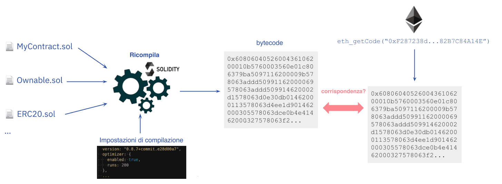

Gli [smart contract](/developers/docs/smart-contracts/) sono progettati per essere "trustless", il che significa che gli utenti non dovrebbero doversi fidare di terze parti (ad es. sviluppatori e aziende) prima di interagire con un contratto. Come requisito per l'assenza di necessità di fiducia, gli utenti e gli altri sviluppatori devono essere in grado di verificare il codice sorgente di uno smart contract. La verifica del codice sorgente assicura agli utenti e agli sviluppatori che il codice del contratto pubblicato sia lo stesso codice in esecuzione all'indirizzo del contratto sulla blockchain di Ethereum.

È importante fare la distinzione tra "verifica del codice sorgente" e "[verifica formale](/developers/docs/smart-contracts/formal-verification/)". La verifica del codice sorgente, che sarà spiegata in dettaglio di seguito, si riferisce alla verifica che il codice sorgente fornito di uno smart contract in un linguaggio di alto livello (ad es. Solidity) venga compilato nello stesso bytecode da eseguire all'indirizzo del contratto. Tuttavia, la verifica formale descrive la verifica della correttezza di uno smart contract, il che significa che il contratto si comporta come previsto. Sebbene dipenda dal contesto, la verifica del contratto di solito si riferisce alla verifica del codice sorgente.

## Cos'è la verifica del codice sorgente? {#what-is-source-code-verification}

Prima della distribuzione di uno smart contract nella [Ethereum Virtual Machine (EVM)](/developers/docs/evm/), gli sviluppatori [compilano](/developers/docs/smart-contracts/compiling/) il codice sorgente del contratto (istruzioni [scritte in Solidity](/developers/docs/smart-contracts/languages/) o in un altro linguaggio di programmazione di alto livello) in bytecode. Poiché l'EVM non può interpretare istruzioni di alto livello, la compilazione del codice sorgente in bytecode (ovvero istruzioni macchina di basso livello) è necessaria per eseguire la logica del contratto nell'EVM.

La verifica del codice sorgente consiste nel confrontare il codice sorgente di uno smart contract e il bytecode compilato utilizzato durante la creazione del contratto per rilevare eventuali differenze. Verificare gli smart contract è importante perché il codice del contratto pubblicizzato potrebbe essere diverso da quello in esecuzione sulla blockchain.

La verifica degli smart contract consente di indagare su cosa fa un contratto attraverso il linguaggio di livello superiore in cui è scritto, senza dover leggere il codice macchina. Le funzioni, i valori e di solito i nomi delle variabili e i commenti rimangono gli stessi del codice sorgente originale che viene compilato e distribuito. Questo rende la lettura del codice molto più semplice. La verifica del sorgente prevede anche la documentazione del codice, in modo che gli utenti finali sappiano per cosa è progettato uno smart contract.

### Cos'è la verifica completa? {#full-verification}

Ci sono alcune parti del codice sorgente che non influenzano il bytecode compilato, come i commenti o i nomi delle variabili. Ciò significa che due codici sorgente con nomi di variabili diversi e commenti diversi sarebbero entrambi in grado di verificare lo stesso contratto. Con questo, un attore malintenzionato può aggiungere commenti ingannevoli o dare nomi di variabili fuorvianti all'interno del codice sorgente e far verificare il contratto con un codice sorgente diverso da quello originale.

È possibile evitare questo aggiungendo dati extra al bytecode che fungano da _garanzia crittografica_ per l'esattezza del codice sorgente e come _impronta digitale_ delle informazioni di compilazione. Le informazioni necessarie si trovano nei [metadati del contratto di Solidity](https://docs.soliditylang.org/en/v0.8.15/metadata.html) e l'hash di questo file viene aggiunto al bytecode di un contratto. Puoi vederlo in azione nel [playground dei metadati](https://playground.sourcify.dev)

Il file dei metadati contiene informazioni sulla compilazione del contratto, inclusi i file sorgente e i loro hash. Ciò significa che se una qualsiasi delle impostazioni di compilazione o anche un solo byte in uno dei file sorgente cambia, il file dei metadati cambia. Di conseguenza, cambia anche l'hash del file dei metadati, che viene aggiunto al bytecode. Ciò significa che se il bytecode di un contratto + l'hash dei metadati aggiunto corrispondono al codice sorgente e alle impostazioni di compilazione forniti, possiamo essere certi che questo è esattamente lo stesso codice sorgente utilizzato nella compilazione originale, senza che nemmeno un singolo byte sia diverso.

Questo tipo di verifica che sfrutta l'hash dei metadati è indicato come **"[verifica completa](https://docs.sourcify.dev/docs/full-vs-partial-match/)"** (anche "verifica perfetta"). Se gli hash dei metadati non corrispondono o non vengono considerati nella verifica, si tratterebbe di una "corrispondenza parziale", che attualmente è il modo più comune per verificare i contratti. È possibile [inserire codice dannoso](https://samczsun.com/hiding-in-plain-sight/) che non si rifletterebbe nel codice sorgente verificato senza una verifica completa. La maggior parte degli sviluppatori non è a conoscenza della verifica completa e non conserva il file dei metadati della propria compilazione, quindi la verifica parziale è stata finora il metodo de facto per verificare i contratti.

## Perché la verifica del codice sorgente è importante? {#importance-of-source-code-verification}

### Assenza di necessità di fiducia {#trustlessness}

L'assenza di necessità di fiducia è probabilmente la premessa più grande per gli smart contract e le [applicazioni decentralizzate (dapp)](/developers/docs/dapps/). Gli smart contract sono "immutabili" e non possono essere alterati; un contratto eseguirà solo la logica di business definita nel codice al momento della distribuzione. Ciò significa che gli sviluppatori e le aziende non possono manomettere il codice di un contratto dopo averlo distribuito su Ethereum.

Affinché uno smart contract sia trustless, il codice del contratto dovrebbe essere disponibile per una verifica indipendente. Sebbene il bytecode compilato per ogni smart contract sia pubblicamente disponibile sulla blockchain, il linguaggio di basso livello è difficile da comprendere, sia per gli sviluppatori che per gli utenti.

I progetti riducono le assunzioni di fiducia pubblicando il codice sorgente dei loro contratti. Ma questo porta a un altro problema: è difficile verificare che il codice sorgente pubblicato corrisponda al bytecode del contratto. In questo scenario, il valore dell'assenza di necessità di fiducia va perso perché gli utenti devono fidarsi che gli sviluppatori non modifichino la logica di business di un contratto (ovvero, modificando il bytecode) prima di distribuirlo sulla blockchain.

Gli strumenti di verifica del codice sorgente forniscono garanzie che i file del codice sorgente di uno smart contract corrispondano al codice assembly. Il risultato è un ecosistema trustless, in cui gli utenti non si fidano ciecamente di terze parti e verificano invece il codice prima di depositare fondi in un contratto.

### Sicurezza degli utenti {#user-safety}

Con gli smart contract, di solito ci sono molti soldi in gioco. Ciò richiede maggiori garanzie di sicurezza e la verifica della logica di uno smart contract prima di utilizzarlo. Il problema è che sviluppatori senza scrupoli possono ingannare gli utenti inserendo codice dannoso in uno smart contract. Senza verifica, gli smart contract dannosi possono avere [backdoor](https://www.trustnodes.com/2018/11/10/concerns-rise-over-backdoored-smart-contracts), meccanismi di controllo degli accessi controversi, vulnerabilità sfruttabili e altre cose che mettono a repentaglio la sicurezza degli utenti e che passerebbero inosservate.

La pubblicazione dei file del codice sorgente di uno smart contract rende più facile per gli interessati, come i revisori, valutare il contratto per potenziali vettori di attacco. Con più parti che verificano in modo indipendente uno smart contract, gli utenti hanno garanzie più forti della sua sicurezza.

## Come verificare il codice sorgente per gli smart contract di Ethereum {#source-code-verification-for-ethereum-smart-contracts}

[Distribuire uno smart contract su Ethereum](/developers/docs/smart-contracts/deploying/) richiede l'invio di una transazione con un payload di dati (bytecode compilato) a un indirizzo speciale. Il payload di dati viene generato compilando il codice sorgente, più gli [argomenti del costruttore](https://docs.soliditylang.org/en/v0.8.14/contracts.html#constructor) dell'istanza del contratto aggiunti al payload di dati nella transazione. La compilazione è deterministica, il che significa che produce sempre lo stesso output (ovvero il bytecode del contratto) se vengono utilizzati gli stessi file sorgente e le stesse impostazioni di compilazione (ad es. versione del compilatore, ottimizzatore).

La verifica di uno smart contract comporta fondamentalmente i seguenti passaggi:

1. Inserire i file sorgente e le impostazioni di compilazione in un compilatore.

2. Il compilatore restituisce in output il bytecode del contratto.

3. Ottenere il bytecode del contratto distribuito a un determinato indirizzo.

4. Confrontare il bytecode distribuito con il bytecode ricompilato. Se i codici corrispondono, il contratto viene verificato con il codice sorgente e le impostazioni di compilazione forniti.

5. Inoltre, se gli hash dei metadati alla fine del bytecode corrispondono, si tratterà di una corrispondenza completa.

Nota che questa è una descrizione semplicistica della verifica e ci sono molte eccezioni che non funzionerebbero con questo, come avere [variabili immutabili](https://docs.sourcify.dev/docs/immutables/).

## Strumenti per la verifica del codice sorgente {#source-code-verification-tools}

Il processo tradizionale di verifica dei contratti può essere complesso. Questo è il motivo per cui disponiamo di strumenti per la verifica del codice sorgente per gli smart contract distribuiti su Ethereum. Questi strumenti automatizzano gran parte della verifica del codice sorgente e curano anche i contratti verificati a vantaggio degli utenti.

### Etherscan {#etherscan}

Sebbene sia noto principalmente come [block explorer di Ethereum](/developers/docs/data-and-analytics/block-explorers/), Etherscan offre anche un [servizio di verifica del codice sorgente](https://etherscan.io/verifyContract) per sviluppatori e utenti di smart contract.

Etherscan ti consente di ricompilare il bytecode del contratto dal payload di dati originale (codice sorgente, indirizzo della libreria, impostazioni del compilatore, indirizzo del contratto, ecc.). Se il bytecode ricompilato è associato al bytecode (e ai parametri del costruttore) del contratto onchain, allora [il contratto è verificato](https://info.etherscan.com/types-of-contract-verification/).

Una volta verificato, il codice sorgente del tuo contratto riceve un'etichetta "Verified" (Verificato) e viene pubblicato su Etherscan affinché altri possano controllarlo. Viene anche aggiunto alla sezione [Verified Contracts](https://etherscan.io/contractsVerified/) (Contratti verificati), un repository di smart contract con codici sorgente verificati.

Etherscan è lo strumento più utilizzato per verificare i contratti. Tuttavia, la verifica dei contratti di Etherscan ha uno svantaggio: non riesce a confrontare l'**hash dei metadati** del bytecode onchain e del bytecode ricompilato. Pertanto le corrispondenze in Etherscan sono corrispondenze parziali.

[Maggiori informazioni sulla verifica dei contratti su Etherscan](https://medium.com/etherscan-blog/verifying-contracts-on-etherscan-f995ab772327).

### Blockscout {#blockscout}

[Blockscout](https://blockscout.com/) è un block explorer open source che fornisce anche un [servizio di verifica dei contratti](https://eth.blockscout.com/contract-verification) per sviluppatori e utenti di smart contract. Come alternativa open source, Blockscout offre trasparenza su come viene eseguita la verifica e consente i contributi della community per migliorare il processo di verifica.

Similmente ad altri servizi di verifica, Blockscout ti consente di verificare il codice sorgente del tuo contratto ricompilando il bytecode e confrontandolo con il contratto distribuito. Una volta verificato, il tuo contratto riceve lo stato di verifica e il codice sorgente diventa pubblicamente disponibile per il controllo e l'interazione. I contratti verificati sono anche elencati nel [repository dei contratti verificati](https://eth.blockscout.com/verified-contracts) di Blockscout per facilitarne la navigazione e la scoperta.

### Sourcify {#sourcify}

[Sourcify](https://sourcify.dev/#/verifier) è un altro strumento per la verifica dei contratti che è open source e decentralizzato. Non è un block explorer e verifica solo i contratti su [diverse reti basate su EVM](https://docs.sourcify.dev/docs/chains). Agisce come un'infrastruttura pubblica su cui altri strumenti possono basarsi e mira a consentire interazioni con i contratti più a misura d'uomo utilizzando l'[ABI](/developers/docs/smart-contracts/compiling/#web-applications) e i commenti [NatSpec](https://docs.soliditylang.org/en/v0.8.15/natspec-format.html) presenti nel file dei metadati.

A differenza di Etherscan, Sourcify supporta le corrispondenze complete con l'hash dei metadati. I contratti verificati sono serviti nel suo [repository pubblico](https://docs.sourcify.dev/docs/repository/) su HTTP e [IPFS](https://docs.ipfs.io/concepts/what-is-ipfs/#what-is-ipfs), che è un archivio decentralizzato [indirizzato in base al contenuto](https://docs.storacha.network/concepts/content-addressing/). Ciò consente di recuperare il file dei metadati di un contratto tramite IPFS poiché l'hash dei metadati aggiunto è un hash IPFS.

Inoltre, è anche possibile recuperare i file del codice sorgente tramite IPFS, poiché anche gli hash IPFS di questi file si trovano nei metadati. Un contratto può essere verificato fornendo il file dei metadati e i file sorgente tramite la sua API o l'[interfaccia utente](https://sourcify.dev/#/verifier), oppure utilizzando i plugin. Lo strumento di monitoraggio di Sourcify ascolta anche le creazioni di contratti su nuovi blocchi e cerca di verificare i contratti se i loro metadati e file sorgente sono pubblicati su IPFS.

[Maggiori informazioni sulla verifica dei contratti su Sourcify](https://soliditylang.org/blog/2020/06/25/sourcify-faq/).

### Tenderly {#tenderly}

La [piattaforma Tenderly](https://tenderly.co/) consente agli sviluppatori Web3 di creare, testare, monitorare e gestire gli smart contract. Combinando strumenti di debug con osservabilità e blocchi di costruzione dell'infrastruttura, Tenderly aiuta gli sviluppatori ad accelerare lo sviluppo degli smart contract. Per abilitare completamente le funzionalità di Tenderly, gli sviluppatori devono [eseguire la verifica del codice sorgente](https://docs.tenderly.co/monitoring/contract-verification) utilizzando diversi metodi.

È possibile verificare un contratto privatamente o pubblicamente. Se verificato privatamente, lo smart contract è visibile solo a te (e agli altri membri del tuo progetto). Verificare un contratto pubblicamente lo rende visibile a tutti coloro che utilizzano la piattaforma Tenderly.

Puoi verificare i tuoi contratti utilizzando la [Dashboard](https://docs.tenderly.co/contract-verification), il [plugin Tenderly per Hardhat](https://docs.tenderly.co/contract-verification/hardhat) o la [CLI](https://docs.tenderly.co/monitoring/smart-contract-verification/verifying-contracts-using-cli).

Quando verifichi i contratti tramite la Dashboard, devi importare il file sorgente o il file dei metadati generato dal compilatore Solidity, l'indirizzo/rete e le impostazioni del compilatore.

L'utilizzo del plugin Tenderly per Hardhat consente un maggiore controllo sul processo di verifica con meno sforzo, permettendoti di scegliere tra la verifica automatica (senza codice) e manuale (basata sul codice).

## Letture consigliate {#further-reading}

- [Verificare il codice sorgente del contratto](https://programtheblockchain.com/posts/2018/01/16/verifying-contract-source-code/)