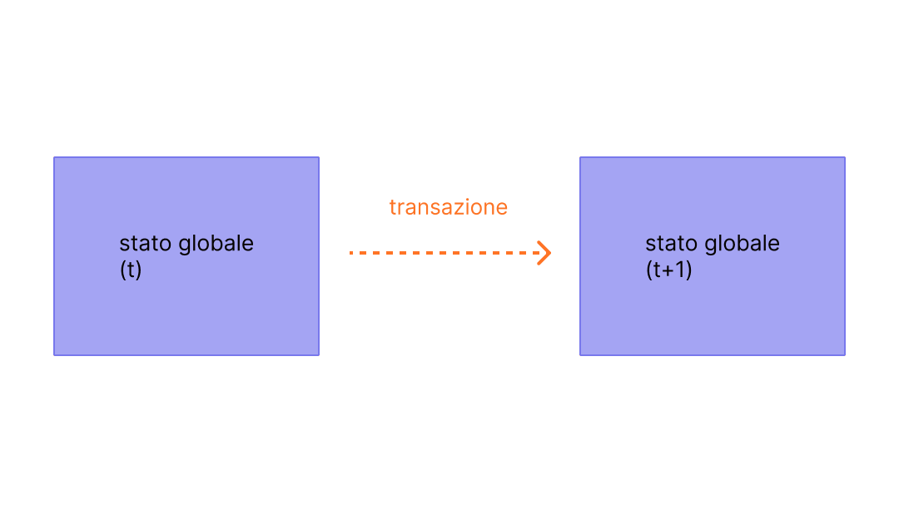

Le transazioni sono istruzioni firmate crittograficamente provenienti dagli account. Un account avvierà una transazione per aggiornare lo stato della rete [Ethereum](/). La transazione più semplice è il trasferimento di ETH da un account all'altro.

## Prerequisiti {#prerequisites}

Per aiutarti a comprendere meglio questa pagina, ti consigliamo di leggere prima [Account](/developers/docs/accounts/) e la nostra [introduzione a Ethereum](/developers/docs/intro-to-ethereum/).

## Cos'è una transazione? {#whats-a-transaction}

Una transazione di Ethereum si riferisce a un'azione avviata da un account di proprietà esterna, in altre parole un account gestito da un essere umano, non da un contratto. Ad esempio, se Bob invia ad Alice 1 ETH, l'account di Bob deve essere addebitato e quello di Alice accreditato. Questa azione che modifica lo stato avviene all'interno di una transazione.


_Diagramma adattato da [Ethereum EVM illustrated](https://takenobu-hs.github.io/downloads/ethereum_evm_illustrated.pdf)_

Le transazioni, che modificano lo stato dell'EVM, devono essere trasmesse all'intera rete. Qualsiasi nodo può trasmettere una richiesta affinché una transazione venga eseguita sull'EVM; dopo che ciò accade, un validatore eseguirà la transazione e propagherà la modifica di stato risultante al resto della rete.

Le transazioni richiedono una commissione e devono essere incluse in un blocco convalidato. Per rendere questa panoramica più semplice, tratteremo le commissioni del gas e la convalida altrove.

Una transazione inviata include le seguenti informazioni:

- `from`: l'indirizzo del mittente, che firmerà la transazione. Questo sarà un account di proprietà esterna poiché gli account di contratto non possono inviare transazioni
- `to`: l'indirizzo di ricezione (se è un account di proprietà esterna, la transazione trasferirà valore. Se è un account di contratto, la transazione eseguirà il codice del contratto)
- `signature`: l'identificatore del mittente. Questo viene generato quando la chiave privata del mittente firma la transazione e conferma che il mittente ha autorizzato questa transazione
- `nonce`: un contatore a incremento sequenziale che indica il numero della transazione dall'account
- `value`: quantità di ETH da trasferire dal mittente al destinatario (denominata in Wei, dove 1 ETH equivale a 1e+18 Wei)
- `input data`: campo opzionale per includere dati arbitrari
- `gasLimit`: la quantità massima di unità di gas che possono essere consumate dalla transazione. L'[EVM](/developers/docs/evm/opcodes) specifica le unità di gas richieste da ogni passaggio computazionale
- `maxPriorityFeePerGas`: il prezzo massimo del gas consumato da includere come commissione prioritaria al validatore
- `maxFeePerGas`: la commissione massima per unità di gas che si è disposti a pagare per la transazione (comprensiva di `baseFeePerGas` e `maxPriorityFeePerGas`)

Il gas è un riferimento al calcolo richiesto per elaborare la transazione da parte di un validatore. Gli utenti devono pagare una commissione per questo calcolo. Il `gasLimit` e la `maxPriorityFeePerGas` determinano la commissione di transazione massima pagata al validatore. [Maggiori informazioni sul gas](/developers/docs/gas/).

L'oggetto della transazione avrà un aspetto simile a questo:

```js
{
  from: "0xEA674fdDe714fd979de3EdF0F56AA9716B898ec8",
  to: "0xac03bb73b6a9e108530aff4df5077c2b3d481e5a",
  gasLimit: "21000",
  maxFeePerGas: "300",
  maxPriorityFeePerGas: "10",
  nonce: "0",
  value: "10000000000"
}
```

Ma un oggetto della transazione deve essere firmato utilizzando la chiave privata del mittente. Questo dimostra che la transazione poteva provenire solo dal mittente e non è stata inviata in modo fraudolento.

Un client Ethereum come Geth gestirà questo processo di firma.

Esempio di chiamata [JSON-RPC](/developers/docs/apis/json-rpc):

```json
{
  "id": 2,
  "jsonrpc": "2.0",
  "method": "account_signTransaction",
  "params": [
    {
      "from": "0x1923f626bb8dc025849e00f99c25fe2b2f7fb0db",
      "gas": "0x55555",
      "maxFeePerGas": "0x1234",
      "maxPriorityFeePerGas": "0x1234",
      "input": "0xabcd",
      "nonce": "0x0",
      "to": "0x07a565b7ed7d7a678680a4c162885bedbb695fe0",
      "value": "0x1234"
    }
  ]
}
```

Esempio di risposta:

```json
{
  "jsonrpc": "2.0",
  "id": 2,
  "result": {
    "raw": "0xf88380018203339407a565b7ed7d7a678680a4c162885bedbb695fe080a44401a6e4000000000000000000000000000000000000000000000000000000000000001226a0223a7c9bcf5531c99be5ea7082183816eb20cfe0bbc322e97cc5c7f71ab8b20ea02aadee6b34b45bb15bc42d9c09de4a6754e7000908da72d48cc7704971491663",
    "tx": {
      "nonce": "0x0",
      "maxFeePerGas": "0x1234",
      "maxPriorityFeePerGas": "0x1234",
      "gas": "0x55555",
      "to": "0x07a565b7ed7d7a678680a4c162885bedbb695fe0",
      "value": "0x1234",
      "input": "0xabcd",
      "v": "0x26",
      "r": "0x223a7c9bcf5531c99be5ea7082183816eb20cfe0bbc322e97cc5c7f71ab8b20e",
      "s": "0x2aadee6b34b45bb15bc42d9c09de4a6754e7000908da72d48cc7704971491663",
      "hash": "0xeba2df809e7a612a0a0d444ccfa5c839624bdc00dd29e3340d46df3870f8a30e"
    }
  }
}
```

- il `raw` è la transazione firmata in formato codificato [Recursive Length Prefix (RLP)](/developers/docs/data-structures-and-encoding/rlp)
- la `tx` è la transazione firmata in formato JSON

Con l'hash della firma, si può dimostrare crittograficamente che la transazione proviene dal mittente ed è stata inviata alla rete.

### Il campo dati {#the-data-field}

La stragrande maggioranza delle transazioni accede a un contratto da un account di proprietà esterna.
La maggior parte dei contratti è scritta in Solidity e interpreta il proprio campo dati in conformità con l'[interfaccia binaria dell'applicazione (ABI)](/glossary/#abi).

I primi quattro byte specificano quale funzione chiamare, utilizzando l'hash del nome della funzione e dei suoi argomenti.
A volte puoi identificare la funzione dal selettore utilizzando [questo database](https://www.4byte.directory/signatures/).

Il resto dei dati di chiamata sono gli argomenti, [codificati come specificato nelle specifiche ABI](https://docs.soliditylang.org/en/latest/abi-spec.html#formal-specification-of-the-encoding).

Ad esempio, diamo un'occhiata a [questa transazione](https://etherscan.io/tx/0xd0dcbe007569fcfa1902dae0ab8b4e078efe42e231786312289b1eee5590f6a1).
Usa **Click to see More** per vedere i dati di chiamata.

Il selettore della funzione è `0xa9059cbb`. Ci sono diverse [funzioni note con questa firma](https://www.4byte.directory/signatures/?bytes4_signature=0xa9059cbb).
In questo caso [il codice sorgente del contratto](https://etherscan.io/address/0xa0b86991c6218b36c1d19d4a2e9eb0ce3606eb48#code) è stato caricato su Etherscan, quindi sappiamo che la funzione è `transfer(address,uint256)`.

Il resto dei dati è:

```
0000000000000000000000004f6742badb049791cd9a37ea913f2bac38d01279
000000000000000000000000000000000000000000000000000000003b0559f4
```

Secondo le specifiche ABI, i valori interi (come gli indirizzi, che sono interi a 20 byte) appaiono nell'ABI come parole a 32 byte, riempite con zeri all'inizio.
Quindi sappiamo che l'indirizzo `to` è [`4f6742badb049791cd9a37ea913f2bac38d01279`](https://etherscan.io/address/0x4f6742badb049791cd9a37ea913f2bac38d01279).
Il `value` è 0x3b0559f4 = 990206452.

### Descrittori di transazione {#transaction-descriptors}

Poiché il campo dati contiene byte esadecimali opachi, può essere estremamente difficile verificare quale azione eseguirà effettivamente una transazione. Questa vulnerabilità della "firma alla cieca" (blind signing) viene affrontata dalla **[Firma in chiaro (Clear Signing)](https://clearsigning.org/)** attraverso l'uso di [descrittori di transazione](https://eips.ethereum.org/EIPS/eip-7730) (definiti dall'ERC-7730).  

La specifica ERC-7730 utilizza descrittori di transazione (spesso strutturati come file JSON) per arricchire i dati trovati nelle ABI e nei messaggi strutturati, come i dati di chiamata delle transazioni EVM, i messaggi EIP-712 e le Operazioni Utente EIP-4337. Gli sviluppatori utilizzano questi descrittori per mappare variabili di transazione specifiche direttamente in modelli di formattazione, garantendo che i dati sottostanti rimangano leggibili dalle macchine per le applicazioni.

Sul frontend, i portafogli utilizzano questo contesto di formattazione per tradurre il bytecode opaco in informazioni chiare e leggibili dall'uomo. Risolvendo automaticamente valori come gli indirizzi dei token in ticker riconosciuti, o gli importi in decimali, agli utenti viene presentato un riepilogo in linguaggio semplice dell'esatto intento della transazione (ad es., 'Swap 1000 USDC per almeno 0.25 ether incapsulato (weth)') prima che firmino

## Tipi di transazioni {#types-of-transactions}

Su Ethereum ci sono alcuni tipi diversi di transazioni:

- Transazioni regolari: una transazione da un account all'altro.
- Transazioni di distribuzione del contratto: una transazione senza un indirizzo 'to', in cui il campo dati viene utilizzato per il codice del contratto.
- Esecuzione di un contratto: una transazione che interagisce con uno smart contract distribuito. In questo caso, l'indirizzo 'to' è l'indirizzo dello smart contract.

### Sul gas {#on-gas}

Come accennato, l'esecuzione delle transazioni costa [gas](/developers/docs/gas/). Le semplici transazioni di trasferimento richiedono 21000 unità di gas.

Quindi, affinché Bob invii ad Alice 1 ETH a una `baseFeePerGas` di 190 Gwei e una `maxPriorityFeePerGas` di 10 Gwei, Bob dovrà pagare la seguente commissione:

```
(190 + 10) * 21000 = 4,200,000 gwei
--or--
0.0042 ETH
```

L'account di Bob verrà addebitato di **-1.0042 ETH** (1 ETH per Alice + 0.0042 ETH in commissioni del gas)

L'account di Alice verrà accreditato di **+1.0 ETH**

La commissione di base verrà bruciata **-0.00399 ETH**

Il validatore trattiene la commissione prioritaria **+0.000210 ETH**


_Diagramma adattato da [Ethereum EVM illustrated](https://takenobu-hs.github.io/downloads/ethereum_evm_illustrated.pdf)_

Qualsiasi gas non utilizzato in una transazione viene rimborsato all'account dell'utente.

### Interazioni con gli smart contract {#smart-contract-interactions}

Il gas è richiesto per qualsiasi transazione che coinvolga uno smart contract.

Gli smart contract possono anche contenere funzioni note come funzioni [`view`](https://docs.soliditylang.org/en/latest/contracts.html#view-functions) o [`pure`](https://docs.soliditylang.org/en/latest/contracts.html#pure-functions), che non alterano lo stato del contratto. Pertanto, chiamare queste funzioni da un EOA non richiederà alcun gas. La chiamata RPC sottostante per questo scenario è [`eth_call`](/developers/docs/apis/json-rpc#eth_call).

A differenza di quando vi si accede utilizzando `eth_call`, queste funzioni `view` o `pure` sono anche comunemente chiamate internamente (cioè, dal contratto stesso o da un altro contratto), il che costa gas.

## Ciclo di vita della transazione {#transaction-lifecycle}

Una volta inviata la transazione, accade quanto segue:

1. Viene generato crittograficamente un hash della transazione:
   `0x97d99bc7729211111a21b12c933c949d4f31684f1d6954ff477d0477538ff017`
2. La transazione viene quindi trasmessa alla rete e aggiunta a un pool di transazioni costituito da tutte le altre transazioni di rete in sospeso.
3. Un validatore deve prelevare la tua transazione e includerla in un blocco per verificare la transazione e considerarla "riuscita".
4. Col passare del tempo, il blocco contenente la tua transazione verrà aggiornato a "giustificato" e poi "finalizzato". Questi aggiornamenti rendono molto più certo che la tua transazione sia andata a buon fine e non verrà mai alterata. Una volta che un blocco è "finalizzato", potrebbe essere modificato solo da un attacco a livello di rete che costerebbe molti miliardi di dollari.

## Una demo visiva {#a-visual-demo}

Guarda Austin che ti guida attraverso le transazioni, il gas e il minaggio.

<VideoWatch slug="transactions-eth-build" />

## Involucro di transazione tipizzato {#typed-transaction-envelope}

In origine, Ethereum aveva un solo formato per le transazioni. Ogni transazione conteneva un nonce, un prezzo del gas, un limite di gas, un indirizzo di destinazione (to), un valore, dei dati, v, r e s. Questi campi sono [codificati in RLP](/developers/docs/data-structures-and-encoding/rlp/), per apparire in modo simile a questo:

`RLP([nonce, gasPrice, gasLimit, to, value, data, v, r, s])`

Ethereum si è evoluto per supportare più tipi di transazioni per consentire l'implementazione di nuove funzionalità come gli elenchi di accesso e l'[EIP-1559](https://eips.ethereum.org/EIPS/eip-1559) senza influire sui formati delle transazioni legacy.

L'[EIP-2718](https://eips.ethereum.org/EIPS/eip-2718) è ciò che consente questo comportamento. Le transazioni vengono interpretate come:

`TransactionType || TransactionPayload`

Dove i campi sono definiti come:

- `TransactionType`: un numero compreso tra 0 e 0x7f, per un totale di 128 possibili tipi di transazione.
- `TransactionPayload`: un array di byte arbitrario definito dal tipo di transazione.

In base al valore `TransactionType`, una transazione può essere classificata come:

1. **Transazioni di Tipo 0 (Legacy):** Il formato di transazione originale utilizzato sin dal lancio di Ethereum. Non includono funzionalità dell'[EIP-1559](https://eips.ethereum.org/EIPS/eip-1559) come i calcoli dinamici delle commissioni del gas o gli elenchi di accesso per gli smart contract. Le transazioni legacy non hanno un prefisso specifico che indichi il loro tipo nella loro forma serializzata, iniziando con il byte `0xf8` quando si utilizza la codifica [Recursive Length Prefix (RLP)](/developers/docs/data-structures-and-encoding/rlp). Il valore TransactionType per queste transazioni è `0x0`.

2. **Transazioni di Tipo 1:** Introdotte nell'[EIP-2930](https://eips.ethereum.org/EIPS/eip-2930) come parte dell'[aggiornamento Berlin](/ethereum-forks/#berlin) di Ethereum, queste transazioni includono un parametro `accessList`. Questo elenco specifica gli indirizzi e le chiavi di archiviazione a cui la transazione prevede di accedere, aiutando a ridurre potenzialmente i costi del [gas](/developers/docs/gas/) per transazioni complesse che coinvolgono smart contract. Le modifiche al mercato delle commissioni dell'EIP-1559 non sono incluse nelle transazioni di Tipo 1. Le transazioni di Tipo 1 includono anche un parametro `yParity`, che può essere `0x0` o `0x1`, indicando la parità del valore y della firma secp256k1. Sono identificate iniziando con il byte `0x01` e il loro valore TransactionType è `0x1`.

3. **Transazioni di Tipo 2**, comunemente chiamate transazioni EIP-1559, sono transazioni introdotte nell'[EIP-1559](https://eips.ethereum.org/EIPS/eip-1559), nell'[aggiornamento London](/ethereum-forks/#london) di Ethereum. Sono diventate il tipo di transazione standard sulla rete Ethereum. Queste transazioni introducono un nuovo meccanismo di mercato delle commissioni che migliora la prevedibilità separando la commissione di transazione in una commissione di base e una commissione di priorità. Iniziano con il byte `0x02` e includono campi come `maxPriorityFeePerGas` e `maxFeePerGas`. Le transazioni di Tipo 2 sono ora l'impostazione predefinita grazie alla loro flessibilità ed efficienza, particolarmente favorite durante i periodi di elevata congestione della rete per la loro capacità di aiutare gli utenti a gestire le commissioni di transazione in modo più prevedibile. Il valore TransactionType per queste transazioni è `0x2`.

4. **Transazioni di Tipo 3 (Blob)** sono state introdotte nell'[EIP-4844](https://eips.ethereum.org/EIPS/eip-4844) come parte dell'[aggiornamento Dencun](/ethereum-forks/#dencun) di Ethereum. Queste transazioni sono progettate per gestire i dati "blob" (Binary Large Objects) in modo più efficiente, avvantaggiando in particolare i rollup di layer 2 (l2) fornendo un modo per pubblicare dati sulla rete Ethereum a un costo inferiore. Le transazioni blob includono campi aggiuntivi come `blobVersionedHashes`, `maxFeePerBlobGas` e `blobGasPrice`. Iniziano con il byte `0x03` e il loro valore TransactionType è `0x3`. Le transazioni blob rappresentano un miglioramento significativo nella disponibilità dei dati e nelle capacità di ridimensionamento di Ethereum.

5. **Transazioni di Tipo 4** sono state introdotte nell'[EIP-7702](https://eips.ethereum.org/EIPS/eip-7702) come parte dell'[aggiornamento Pectra](/roadmap/pectra/) di Ethereum. Queste transazioni sono progettate per essere compatibili in avanti con l'astrazione dell'account. Consentono agli EOA di comportarsi temporaneamente come account di contratto senza compromettere la loro funzionalità originale. Includono un parametro `authorization_list`, che specifica lo smart contract a cui l'EOA delega la propria autorità. Dopo la transazione, il campo del codice dell'EOA avrà l'indirizzo dello smart contract delegato.

## Letture consigliate {#further-reading}

- [EIP-2718: Typed Transaction Envelope](https://eips.ethereum.org/EIPS/eip-2718)

_Conosci una risorsa della community che ti è stata utile? Modifica questa pagina e aggiungila!_

## Argomenti correlati {#related-topics}

- [Account](/developers/docs/accounts/)
- [Ethereum Virtual Machine (EVM)](/developers/docs/evm/)
- [Gas](/developers/docs/gas/)