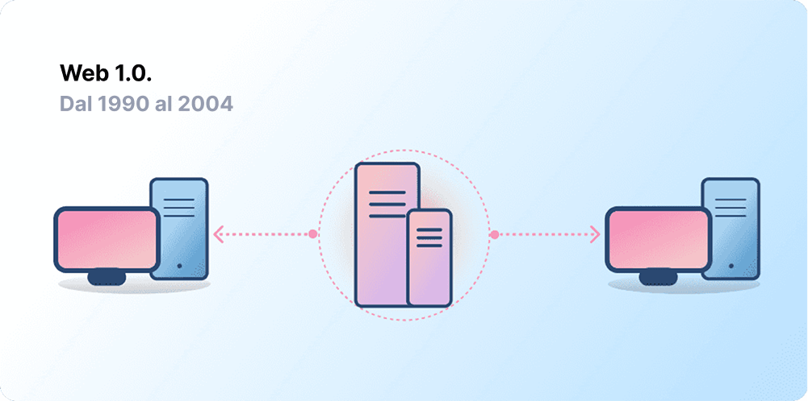
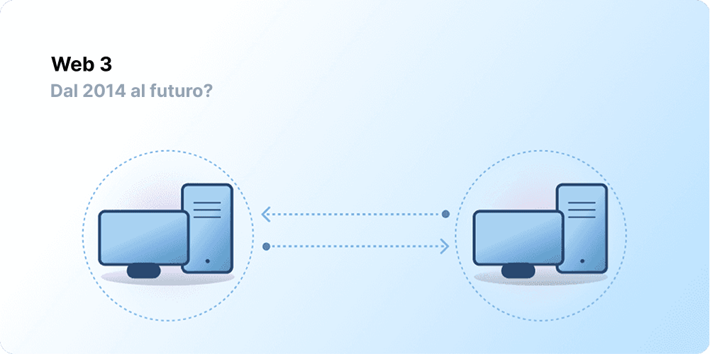

# Introduzione a Web3 {#introduction}

<ListenToPlayer slug="/web3/" />

La centralizzazione ha aiutato a integrare miliardi di persone nel World Wide Web e ha creato l'infrastruttura stabile e robusta su cui esso risiede. Allo stesso tempo, molte entità centralizzate esercitano una forte presa su grandi aree del World Wide Web, decidendo unilateralmente cosa dovrebbe e non dovrebbe esser consentito.

Web3 è la risposta a questo dilemma. Invece di un Web monopolizzato dalle grandi aziende tecnologiche, il Web3 adotta la decentralizzazione ed è in costruzione, operato e posseduto dai suoi utenti. Web3 mette il potere nelle mani degli individui piuttosto che delle grandi aziende.
Prima di parlare di Web3, vediamo come siamo arrivati qui.

<Divider />

## Il primo Web {#early-internet}

Gran parte delle persone pensano al Web come un pilastro continuo della vita moderna: è stato inventato e semplicemente esiste da allora. Tuttavia, il Web che gran parte di noi conosciamo oggi è abbastanza differente da come fu immaginato originariamente. Per comprenderlo meglio, è utile suddividere la breve storia del Web in due distinti periodi: Web 1.0 e Web 2.0.

### Web 1.0: sola lettura (1990-2004) {#web1}

Nel 1989, al CERN, Ginevra, Tim Berners-Lee era impegnato nello sviluppo dei protocolli che sarebbero diventati il World Wide Web. La sua idea? Creare protocolli aperti e decentralizzati che consentissero la condivisione di informazioni da tutta la Terra.

Il primo esordio della creazione di Berners-Lee, ora noto come 'Web 1.0', si verificò all'incirca tra il 1990 e il 2004. Web 1.0 si componeva principalmente di siti web statici posseduti da aziende e non esisteva quasi alcuna interazione tra gli utenti, i singoli individui producevano raramente i contenuti, portando a renderlo noto come il web di sola lettura.

### Web 2.0: lettura e scrittura (2004-oggi) {#web2}

L’era del Web 2.0 iniziò nel 2004 con l'emergenza delle piattaforme social. Invece che di sola lettura, il web si evolse per esser di lettura e scrittura. Invece di aziende che fornivano contenuti agli utenti, iniziarono anche a nascere piattaforme per condividere contenuti generati dagli utenti e le interazioni tra utenti. Con l’aumentare degli utilizzatori del web, una manciata di grandi aziende iniziarono a controllare una quantità sproporzionata del traffico e del valore generati sul web. Il web 2.0 ha dato vita anche al modello di ricavi generati dalla pubblicità. Sebbene gli utenti potessero creare i contenuti, non erano i proprietari e non potevano monetizzarli.

<Divider />

## Web 3.0: lettura, scrittura e possesso {#web3}

La premessa di 'Web 3.0' è stata coniata dal co-fondatore di [Ethereum](/what-is-ethereum/) Gavin Wood poco dopo il lancio di Ethereum nel 2014. Gavin ha messo in parole una soluzione per un problema sentito da molti primi utilizzatori di criptovalute: il Web richiedeva troppa fiducia. Cioè, gran parte del Web che le persone conoscono e usano oggi si basa sull'affidare a una manciata di aziende private di agire nei migliori interessi pubblici.

### Cos'è il Web3? {#what-is-web3}

Web3 è diventato un termine che indica complessivamente la visione di un'Internet nuova e migliore. Alla base, Web3 usa le blockchain, le criptovalute e gli NFT per restituire potere sotto forma di proprietà. [Un post del 2020 su Twitter](https://twitter.com/himgajria/status/1266415636789334016) lo ha espresso al meglio: il Web1 era in sola lettura, il Web2 è in lettura-scrittura, il Web3 sarà in lettura-scrittura-proprietà.

#### Idee fondamentali di Web3 {#core-ideas}

Sebbene sia impegnativo dare una definizione rigida di cosa sia il Web3, alcuni principi essenziali ne guidano la creazione.

- **Web3 è decentralizzato:** invece di grandi aree di Internet controllate e possedute da entità centralizzate, la proprietà è distribuita tra i suoi creatori e i suoi utenti.
- **Web3 è permissionless:** chiunque ha pari accesso per partecipare a Web3 e nessuno viene escluso.
- **Web3 ha pagamenti nativi:** utilizza la criptovaluta per spendere e inviare denaro online invece di affidarsi all'infrastruttura obsoleta di banche e processori di pagamento.
- **Web3 è trustless:** opera usando incentivi e meccanismi economici invece di affidarsi a terze parti fidate.

### Perché Web3 è importante? {#why-is-web3-important}

Sebbene le funzionalità caratterizzanti non siano isolate e non si adattino a categorie ordinate, per semplicità, abbiamo provato a separarle per renderle più facili da comprendere.

#### Proprietà {#ownership}

Il Web3 ti dà la proprietà delle tue risorse digitali in un modo senza precedenti. Ad esempio, ipotizziamo che stai giocando a un gioco di web2. Se acquisti un oggetto di gioco, è legato direttamente al tuo profilo. Se i creatori del gioco eliminano il tuo profilo, perderai tutti gli oggetti. Oppure, se smetti di giocare al gioco, perdi il valore che hai investito nei tuoi oggetti di gioco.

Web3 consente la proprietà diretta tramite [token non fungibili (NFT)](/glossary/#nft). Nessuno, nemmeno i creatori del gioco, ha il potere di toglierti la proprietà. E, se smetti di giocare, puoi vendere o scambiare i tuoi oggetti di gioco sui mercati aperti e recuperarne il valore. Esplora i [giochi on-chain](/gaming/) per vederlo in azione.

<Alert variant="update">
<AlertEmoji text=":eyes:"/>
<AlertContent className="flex-row items-center justify-between">
  
Maggiori informazioni sugli NFT

  <ButtonLink href="/nft/">
    Scopri di più sugli NFT
  </ButtonLink>
</AlertContent>
</Alert>

#### Resistenza alla censura {#censorship-resistance}

I rapporti di potere tra piattaforme e creatori di contenuti sono enormemente squilibrati.

OnlyFans è un sito di contenuti per adulti generati dagli utenti con oltre 1 milione di creatori di contenuti, molti dei quali usano la piattaforma come propria fonte di reddito principale. Ad agosto 2021, OnlyFans ha annunciato piani per bandire i contenuti sessualmente espliciti. L'annuncio ha scatenato la rabbia tra i creatori sulla piattaforma, che si sono sentiti derubati di un reddito su una piattaforma che avevano contribuito a creare. Dopo questa reazione negativa, la decisione è stata rapidamente ritirata. Nonostante i creatori abbiano vinto questa battaglia, ciò evidenzia un problema per i creatori del Web 2.0: abbandonando una piattaforma perdi la reputazione e i seguaci che hai accumulato.

Sul Web3, i tuoi dati risiedono sulla blockchain. Quando decidi di abbandonare una piattaforma, puoi portare con te la tua reputazione, collegandola a un'altra interfaccia che più chiaramente si allinea ai tuoi valori.

Il Web 2.0 richiede ai creatori di contenuti di fidarsi del fatto che le piattaforme non modifichino le regole, ma la resistenza alla censura è una caratteristica nativa di una piattaforma di Web3.

#### Organizzazioni autonome decentralizzate (DAO) {#daos}

Oltre a possedere i tuoi dati in Web3, puoi possedere la piattaforma come un collettivo, usando i token che agiscono da quote in un'azienda. Le DAO ti consentono di coordinare la proprietà decentralizzata di una piattaforma e di prendere decisioni sul suo futuro.

Le DAO sono tecnicamente definite come [contratti intelligenti](/glossary/#smart-contract) concordati che automatizzano il processo decisionale decentralizzato su un pool di risorse (token). Gli utenti coi token votano su come sono spese le risorse e il codice esegue automaticamente il risultato del voto.

Tuttavia, le persone definiscono molte community del Web3 come DAO. Queste community hanno tutte diversi livelli di decentralizzazione e automatizzazzione per codice. Correntemente, stiamo esplorando cosa sono le DAO e come potrebbero evolversi in futuro.

<Alert variant="update">
<AlertEmoji text=":eyes:"/>
<AlertContent className="flex-row items-center justify-between">
  
Impara di più sulle DAO

  <ButtonLink href="/dao/">
    Scopri di più sulle DAO
  </ButtonLink>
</AlertContent>
</Alert>

### Identità {#identity}

Tradizionalmente, creeresti un conto per ogni piattaforma che usi. Ad esempio, potresti avere un profilo di Twitter, un profilo di YouTube e un profilo di Reddit. Desideri cambiare il tuo nome visualizzato o la tua immagine del profilo? Devi farlo per ogni profilo. Puoi usare gli accessi social in alcuni casi, ma questo presenta un problema comune: la censura. In un solo click, queste piattaforme possono escluderti da tutta la tua vita online. Ancora peggio, molte piattaforme ti richiedono di affidare loro le tue informazioni personalmente identificabili, per creare un profilo.

Web3 risolve questi problemi consentendoti di controllare la tua identità digitale con un indirizzo Ethereum e un profilo [Ethereum Name Service (ENS)](/glossary/#ens). Usare un indirizzo di Ethereum consente di avere un solo accesso tra piattaforme che è sicuro, resistente alla censura e anonimo.

### Pagamenti nativi {#native-payments}

L'infrastruttura di pagamento del Web2 si affida a banche e processori di pagamento, escludendo le persone senza conti bancari o coloro che vivono nei confini del paese sbagliato.
Web3 utilizza token come [ETH](/glossary/#ether) per inviare denaro direttamente nel browser e non richiede alcuna terza parte fidata.

<ButtonLink href="/eth/">
  Scopri di più su ETH
</ButtonLink>

## Limitazioni del Web3 {#web3-limitations}

Nonostante i numerosi benefici di Web3 nella sua forma corrente, esistono ancora molte limitazioni che l'ecosistema deve risolvere perché possa prosperare.

### Accessibilità {#accessibility}

Importanti funzionalità di Web3, come Accedi con Ethereum, sono già disponibili per esser usati da chiunque, a costo zero. Ma, il costo relativo delle transazioni è ancora proibitivo per molti. A causa delle commissioni di transazione elevate, è meno probabile che Web3 sia usato nei paesi meno sviluppati e in via di sviluppo. Su Ethereum, queste sfide vengono risolte attraverso [la tabella di marcia](/roadmap/) e le [soluzioni di scalabilità di livello 2](/glossary/#layer-2). La tecnologia è pronta, ma necessitiamo di una maggiore adozione del livello 2 per rendere Web3 accessibile a tutti.

### Esperienza utente {#user-experience}

Correntemente, la barriera tecnica per accedere all'uso di Web3 è troppo elevata. Gli utenti devono comprendere le problematiche di sicurezza, la complessa documentazione tecnica e navigare in interfacce utente non intuitive. [I fornitori di portafogli](/wallets/find-wallet/), in particolare, stanno lavorando per risolvere questo problema, ma sono necessari ulteriori progressi prima che Web3 venga adottato in massa.

### Istruzione {#education}

Web3 introduce nuovi paradigmi che richiedono l'apprendimento di modelli mentali differenti da quelli usati nel Web 2.0. Una simile spinta all'istruzione si è verificata quando il Web1.0 stava guadagnando popolarità alla fine degli anni '90; i sostenitori del World Wide Web hanno utilizzato una serie di tecniche educative per istruire il pubblico, da semplici metafore (l'autostrada dell'informazione, i browser, navigare sul web) a [trasmissioni televisive](https://www.youtube.com/watch?v=SzQLI7BxfYI). Il Web3 non è difficile, ma è differente. Le iniziative educative che informano gli utenti di Web2 di questi paradigmi del Web3, sono vitali per il suo successo.

Ethereum.org contribuisce all'istruzione su Web3 tramite il nostro [Programma di traduzione](/contributing/translation-program/), con l'obiettivo di tradurre i contenuti importanti di Ethereum nel maggior numero di lingue possibile.

### Infrastruttura centralizzata {#centralized-infrastructure}

L'ecosistema di Web3 è giovane e in rapida evoluzione. Di conseguenza, al momento dipende principalmente dall'infrastruttura centralizzata (GitHub, Twitter, Discord, etc.). Molte aziende del Web3 si stanno affrettando a colmare queste lacune, ma costruire un'infrastruttura affidabile e d'alta qualità richiede tempo.

## Un futuro decentralizzato {#decentralized-future}

Il Web3 è un ecosistema giovane e in continua evoluzione. Gavin Wood ha coniato il termine nel 2014, ma molte di queste idee sono diventate realtà solo di recente. Solo nell'ultimo anno, è sorto un notevole interesse nelle criptovalute, vi sono stati miglioramenti alle soluzioni di ridimensionamento del livello 2, esperimenti in massa con nuove forme di governance e rivoluzioni nell'identità digitale.

Siamo solo all'inizio della creazione di un Web migliore con Web3, ma mentre continuiamo a migliorare l'infrastruttura che lo supporterà, il futuro del Web appare roseo.

## Come posso partecipare? {#get-involved}

- [Ottieni un portafoglio](/wallets/)
- [Trova una community](/community/)
- [Esplora le applicazioni Web3](/apps/)
- [Unisciti a una DAO](/dao/)
- [Sviluppa su Web3](/developers/)

## Letture consigliate {#further-reading}

Il Web3 non ha una definizione rigida. Vari partecipanti della community hanno prospettive differenti al riguardo. Eccone alcune:

- [What is Web3? The Decentralized Internet of the Future Explained](https://www.freecodecamp.org/news/what-is-web3) – _Nader Dabit_
- [Making Sense of Web 3](https://medium.com/l4-media/making-sense-of-web-3-c1a9e74dcae) – _Josh Stark_
- [Why Web3 Matters](https://a16zcrypto.com/posts/article/why-web3-matters/) — _Chris Dixon_
- [Why Decentralization Matters](https://onezero.medium.com/why-decentralization-matters-5e3f79f7638e) - _Chris Dixon_
- [The Web3 Landscape](https://a16z.com/wp-content/uploads/2021/10/The-web3-Readlng-List.pdf) – _a16z_
- [The Web3 Debate](https://www.notboring.co/p/the-web3-debate) – _Packy McCormick_

<QuizWidget quizKey="web3" />
