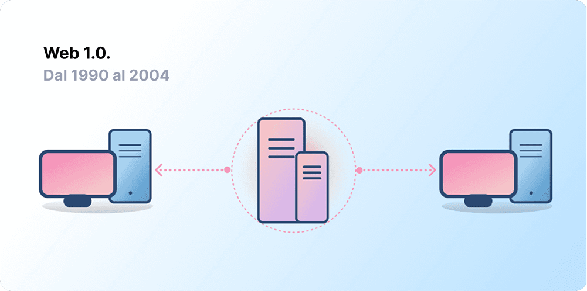
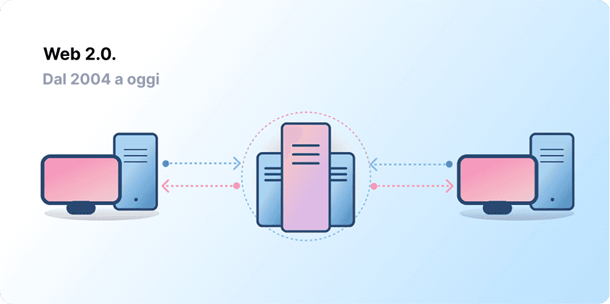
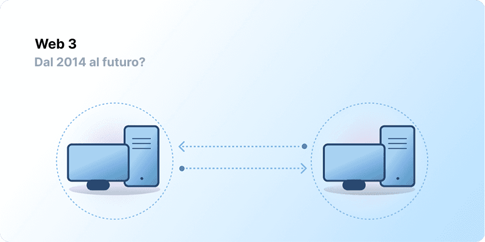

La centralizzazione ha aiutato a far avvicinare miliardi di persone al World Wide Web e ha creato l'infrastruttura stabile e robusta su cui vive. Allo stesso tempo, una manciata di entità centralizzate ha una forte presa su ampie fasce del World Wide Web, decidendo unilateralmente cosa dovrebbe e non dovrebbe essere consentito.

Il Web3 è la risposta a questo dilemma. Invece di un Web monopolizzato da grandi aziende tecnologiche, il Web3 abbraccia la decentralizzazione e viene costruito, gestito e posseduto dai suoi utenti. Il Web3 mette il potere nelle mani degli individui piuttosto che delle corporazioni.
Prima di parlare del Web3, esploriamo come siamo arrivati fin qui.

<Divider />

## Gli albori del Web {#early-internet}

La maggior parte delle persone pensa al Web come a un pilastro continuo della vita moderna: è stato inventato e da allora esiste semplicemente. Tuttavia, il Web che la maggior parte di noi conosce oggi è molto diverso da come era stato originariamente immaginato. Per capirlo meglio, è utile suddividere la breve storia del Web in periodi approssimativi: Web 1.0 e Web 2.0.

### Web 1.0: Sola lettura (1990-2004) {#web1}

Nel 1989, al CERN di Ginevra, Tim Berners-Lee era impegnato a sviluppare i protocolli che sarebbero diventati il World Wide Web. La sua idea? Creare protocolli aperti e decentralizzati che consentissero la condivisione di informazioni da qualsiasi parte della Terra.

La prima incarnazione della creazione di Berners-Lee, ora nota come "Web 1.0", si è verificata all'incirca tra il 1990 e il 2004. Il Web 1.0 era costituito principalmente da siti web statici di proprietà di aziende e c'era un'interazione quasi nulla tra gli utenti (gli individui producevano raramente contenuti), il che lo ha portato a essere noto come il web di sola lettura.

### Web 2.0: Lettura-Scrittura (2004-oggi) {#web2}

Il periodo del Web 2.0 è iniziato nel 2004 con l'emergere delle piattaforme di social media. Invece di essere di sola lettura, il web si è evoluto per essere di lettura-scrittura. Invece di aziende che fornivano contenuti agli utenti, hanno iniziato anche a fornire piattaforme per condividere contenuti generati dagli utenti e impegnarsi in interazioni tra utenti. Man mano che più persone si connettevano, una manciata di aziende leader ha iniziato a controllare una quantità sproporzionata del traffico e del valore generato sul web. Il Web 2.0 ha anche dato vita al modello di entrate basato sulla pubblicità. Sebbene gli utenti potessero creare contenuti, non ne erano proprietari né beneficiavano della loro monetizzazione.

<Divider />

## Web 3.0: Lettura-Scrittura-Proprietà {#web3}

La premessa del "Web 3.0" è stata coniata dal co-fondatore di [Ethereum](/) Gavin Wood poco dopo il lancio di Ethereum nel 2014. Gavin ha espresso a parole una soluzione per un problema che molti dei primi adottanti delle cripto sentivano: il Web richiedeva troppa fiducia. Ovvero, la maggior parte del Web che le persone conoscono e usano oggi si basa sulla fiducia in una manciata di aziende private affinché agiscano nel migliore interesse del pubblico.

### Cos'è il Web3? {#what-is-web3}

Il Web3 è diventato un termine generico per la visione di una nuova e migliore rete internet. Fondamentalmente, il Web3 utilizza blockchain, criptovalute e NFT per restituire il potere agli utenti sotto forma di proprietà. [Un post del 2020 su Twitter](https://twitter.com/himgajria/status/1266415636789334016) lo ha spiegato al meglio: il Web1 era di sola lettura, il Web2 è di lettura-scrittura, il Web3 sarà di lettura-scrittura-proprietà.

#### Idee fondamentali del Web3 {#core-ideas}

Sebbene sia difficile fornire una definizione rigida di cosa sia il Web3, alcuni principi fondamentali guidano la sua creazione.

- **Il Web3 è decentralizzato:** invece di ampie fasce di internet controllate e possedute da entità centralizzate, la proprietà viene distribuita tra i suoi costruttori e utenti.
- **Il Web3 è permissionless:** tutti hanno pari accesso per partecipare al Web3 e nessuno viene escluso.
- **Il Web3 ha pagamenti nativi:** utilizza la criptovaluta per spendere e inviare denaro online invece di fare affidamento sull'infrastruttura obsoleta di banche e processori di pagamento.
- **Il Web3 è trustless:** opera utilizzando incentivi e meccanismi economici invece di fare affidamento su terze parti fidate.

### Perché il Web3 è importante? {#why-is-web3-important}

Sebbene le funzionalità chiave del Web3 non siano isolate e non rientrino in categorie precise, per semplicità abbiamo cercato di separarle per renderle più facili da comprendere.

#### Proprietà {#ownership}

Il Web3 ti dà la proprietà dei tuoi asset digitali in un modo senza precedenti. Ad esempio, supponiamo che tu stia giocando a un gioco Web2. Se acquisti un oggetto di gioco, questo è legato direttamente al tuo account. Se i creatori del gioco eliminano il tuo account, perderai questi oggetti. Oppure, se smetti di giocare, perdi il valore che hai investito nei tuoi oggetti di gioco.

Il Web3 consente la proprietà diretta tramite [token non fungibili (NFT)](/glossary/#nft). Nessuno, nemmeno i creatori del gioco, ha il potere di portarti via la tua proprietà. E, se smetti di giocare, puoi vendere o scambiare i tuoi oggetti di gioco su mercati aperti e recuperare il loro valore. Esplora il [gaming onchain](/gaming/) per vederlo in azione.

<Alert variant="update">
<AlertEmoji text=":eyes:"/>
<AlertContent className="flex-row items-center justify-between">
  
Scopri di più sugli NFT

  <ButtonLink href="/nft/">
    Maggiori informazioni sugli NFT
  </ButtonLink>
</AlertContent>
</Alert>

#### Resistenza alla censura {#censorship-resistance}

La dinamica di potere tra le piattaforme e i creatori di contenuti è enormemente sbilanciata.

OnlyFans è un sito di contenuti per adulti generati dagli utenti con oltre 1 milione di creatori di contenuti, molti dei quali utilizzano la piattaforma come principale fonte di reddito. Nell'agosto 2021, OnlyFans ha annunciato l'intenzione di vietare i contenuti sessualmente espliciti. L'annuncio ha suscitato indignazione tra i creatori sulla piattaforma, che si sono sentiti derubati di un reddito su una piattaforma che hanno contribuito a creare. Dopo le reazioni negative, la decisione è stata rapidamente annullata. Nonostante i creatori abbiano vinto questa battaglia, ciò evidenzia un problema per i creatori del Web 2.0: perdi la reputazione e il seguito che hai accumulato se lasci una piattaforma.

Sul Web3, i tuoi dati vivono sulla blockchain. Quando decidi di lasciare una piattaforma, puoi portare con te la tua reputazione, collegandola a un'altra interfaccia che si allinea più chiaramente ai tuoi valori.

Il Web 2.0 richiede ai creatori di contenuti di fidarsi delle piattaforme affinché non cambino le regole, ma la resistenza alla censura è una funzionalità nativa di una piattaforma Web3.

#### Organizzazioni autonome decentralizzate (DAO) {#daos}

Oltre a possedere i tuoi dati nel Web3, puoi possedere la piattaforma come collettivo, utilizzando token che agiscono come azioni di una società. Le DAO ti consentono di coordinare la proprietà decentralizzata di una piattaforma e prendere decisioni sul suo futuro.

Le DAO sono definite tecnicamente come [smart contract](/glossary/#smart-contract) concordati che automatizzano il processo decisionale decentralizzato su un pool di risorse (token). Gli utenti con i token votano su come vengono spese le risorse e il codice esegue automaticamente il risultato del voto.

Tuttavia, le persone definiscono molte comunità Web3 come DAO. Queste comunità hanno tutte diversi livelli di decentralizzazione e automazione tramite codice. Attualmente, stiamo esplorando cosa sono le DAO e come potrebbero evolversi in futuro.

<Alert variant="update">
<AlertEmoji text=":eyes:"/>
<AlertContent className="flex-row items-center justify-between">
  
Scopri di più sulle DAO

  <ButtonLink href="/dao/">
    Maggiori informazioni sulle DAO
  </ButtonLink>
</AlertContent>
</Alert>

### Identità {#identity}

Tradizionalmente, creeresti un account per ogni piattaforma che utilizzi. Ad esempio, potresti avere un account Twitter, un account YouTube e un account Reddit. Vuoi cambiare il tuo nome visualizzato o l'immagine del profilo? Devi farlo su ogni account. In alcuni casi puoi utilizzare gli accessi social, ma questo presenta un problema familiare: la censura. Con un solo clic, queste piattaforme possono bloccarti fuori da tutta la tua vita online. Ancora peggio, molte piattaforme richiedono che tu ti fidi di loro fornendo informazioni di identificazione personale per creare un account.

Il Web3 risolve questi problemi consentendoti di controllare la tua identità digitale con un indirizzo Ethereum e un profilo [Ethereum Name Service (ENS)](/glossary/#ens). L'utilizzo di un indirizzo Ethereum fornisce un singolo accesso su tutte le piattaforme che è sicuro, resistente alla censura e anonimo.

### Pagamenti nativi {#native-payments}

L'infrastruttura di pagamento del Web2 si basa su banche e processori di pagamento, escludendo le persone senza conti bancari o coloro che si trovano a vivere all'interno dei confini del paese sbagliato.
Il Web3 utilizza token come [ETH](/glossary/#ether) per inviare denaro direttamente nel browser e non richiede alcuna terza parte fidata.

<ButtonLink href="/what-is-ether/">
  Maggiori informazioni su ETH
</ButtonLink>

## Limitazioni del Web3 {#web3-limitations}

Nonostante i numerosi vantaggi del Web3 nella sua forma attuale, ci sono ancora molte limitazioni che l'ecosistema deve affrontare affinché possa prosperare.

### Accessibilità {#accessibility}

Importanti funzionalità del Web3, come l'Accedi con Ethereum, sono già disponibili per chiunque a costo zero. Tuttavia, il costo relativo delle transazioni è ancora proibitivo per molti. È meno probabile che il Web3 venga utilizzato nelle nazioni in via di sviluppo meno ricche a causa delle elevate commissioni di transazione. Su Ethereum, queste sfide vengono risolte attraverso [la roadmap](/roadmap/) e le [soluzioni di ridimensionamento di layer 2 (l2)](/glossary/#layer-2). La tecnologia è pronta, ma abbiamo bisogno di livelli più elevati di adozione sul layer 2 per rendere il Web3 accessibile a tutti.

### Esperienza utente {#user-experience}

La barriera tecnica all'ingresso per l'utilizzo del Web3 è attualmente troppo alta. Gli utenti devono comprendere i problemi di sicurezza, capire la complessa documentazione tecnica e navigare in interfacce utente poco intuitive. I [fornitori di portafogli](/wallets/find-wallet/), in particolare, stanno lavorando per risolvere questo problema, ma sono necessari ulteriori progressi prima che il Web3 venga adottato in massa.

### Formazione {#education}

Il Web3 introduce nuovi paradigmi che richiedono l'apprendimento di modelli mentali diversi rispetto a quelli utilizzati nel Web 2.0. Una simile spinta educativa si è verificata quando il Web 1.0 stava guadagnando popolarità alla fine degli anni '90; i sostenitori del world wide web hanno utilizzato una serie di tecniche educative per istruire il pubblico, da semplici metafore (l'autostrada dell'informazione, i browser, navigare sul web) alle [trasmissioni televisive](https://www.youtube.com/watch?v=SzQLI7BxfYI). Il Web3 non è difficile, ma è diverso. Le iniziative educative che informano gli utenti del Web2 di questi paradigmi del Web3 sono vitali per il suo successo.

Ethereum.org contribuisce alla formazione sul Web3 attraverso il nostro [Programma di Traduzione](/contributing/translation-program/), con l'obiettivo di tradurre importanti contenuti di Ethereum nel maggior numero possibile di lingue.

### Infrastruttura centralizzata {#centralized-infrastructure}

L'ecosistema Web3 è giovane e in rapida evoluzione. Di conseguenza, attualmente dipende principalmente da infrastrutture centralizzate (GitHub, Twitter, Discord, ecc.). Molte aziende Web3 si stanno affrettando a colmare queste lacune, ma la costruzione di un'infrastruttura affidabile e di alta qualità richiede tempo.

## Un futuro decentralizzato {#decentralized-future}

Il Web3 è un ecosistema giovane e in evoluzione. Gavin Wood ha coniato il termine nel 2014, ma molte di queste idee sono diventate realtà solo di recente. Solo nell'ultimo anno, c'è stato un notevole aumento dell'interesse per la criptovaluta, miglioramenti alle soluzioni di ridimensionamento di layer 2 (l2), massicci esperimenti con nuove forme di governance e rivoluzioni nell'identità digitale.

Siamo solo all'inizio della creazione di un Web migliore con il Web3, ma mentre continuiamo a migliorare l'infrastruttura che lo supporterà, il futuro del Web sembra luminoso.

## Come posso partecipare {#get-involved}

- [Ottieni un portafoglio](/wallets/)
- [Trova una comunità](/community/)
- [Esplora le applicazioni Web3](/apps/)
- [Unisciti a una DAO](/dao/)
- [Costruisci sul Web3](/developers/)

## Letture di approfondimento {#further-reading}

Il Web3 non è definito in modo rigido. Vari partecipanti della comunità hanno prospettive diverse al riguardo. Eccone alcune:

- [Cos'è il Web3? L'Internet decentralizzato del futuro spiegato](https://www.freecodecamp.org/news/what-is-web3) – _Nader Dabit_
- [Dare un senso al Web 3](https://medium.com/l4-media/making-sense-of-web-3-c1a9e74dcae) – _Josh Stark_
- [Perché il Web3 è importante](https://a16zcrypto.com/posts/article/why-web3-matters/) — _Chris Dixon_
- [Perché la decentralizzazione è importante](https://onezero.medium.com/why-decentralization-matters-5e3f79f7638e) - _Chris Dixon_
- [Il panorama del Web3](https://a16z.com/wp-content/uploads/2021/10/The-web3-Readlng-List.pdf) – _a16z_
- [Il dibattito sul Web3](https://www.notboring.co/p/the-web3-debate) – _Packy McCormick_

<QuizWidget quizKey="web3" />
