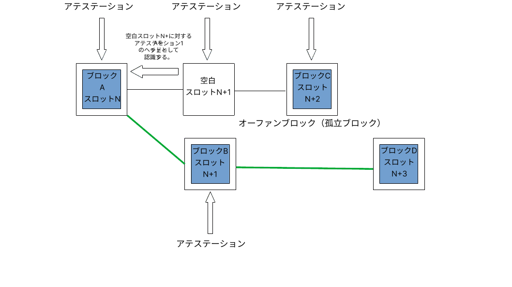

窃盗犯や破壊工作員は、常に[イーサリアム](/)のクライアントソフトウェアを攻撃する機会をうかがっています。このページでは、イーサリアムのコンセンサス・レイヤーに対する既知の攻撃ベクトルと、それらの攻撃をどのように防御できるかについて概説します。このページの情報は、[より詳細なバージョン](https://mirror.xyz/jmcook.eth/YqHargbVWVNRQqQpVpzrqEQ8IqwNUJDIpwRP7SS5FXs)を基にしています。

## 前提条件 {#prerequisites}

[プルーフ・オブ・ステーク (PoS)](/developers/docs/consensus-mechanisms/pos/)に関する基本的な知識が必要です。また、イーサリアムの[インセンティブ・レイヤー](/developers/docs/consensus-mechanisms/pos/rewards-and-penalties)とフォーク選択アルゴリズムである[LMD-GHOST](/developers/docs/consensus-mechanisms/pos/gasper)について基本的に理解していると役立ちます。

## 攻撃者の目的とは？ {#what-do-attackers-want}

よくある誤解として、攻撃に成功すれば新しいイーサを生成したり、任意のアカウントからイーサを抜き取ったりできるというものがあります。ネットワーク上のすべての実行クライアントがすべてのトランザクションを実行するため、これらはどちらも不可能です。トランザクションは有効性の基本条件（送信者の秘密鍵で署名されていること、送信者が十分な残高を持っていることなど）を満たす必要があり、そうでなければ単にリバートされます。攻撃者が現実的に目標とする結果には、リオーグ、二重ファイナリティ、ファイナリティ遅延の3つのクラスがあります。

<strong>「リオーグ」</strong>とは、ブロックを新しい順序に並べ替えることであり、正規のチェーンにおいてブロックの追加や削除を伴うこともあります。悪意のあるリオーグは、特定のブロックを確実に含めたり除外したりすることで、二重支払いや、トランザクションのフロントランニングおよびバック・ランニングによる価値の抽出 (MEV) を可能にするかもしれません。リオーグは、特定のトランザクションが正規のチェーンに含まれるのを防ぐためにも使用される可能性があり、これは一種の検閲です。リオーグの最も極端な形態は「ファイナリティの取り消し (finality reversion)」であり、これは以前にファイナライズ済みとなったブロックを削除または置き換えるものです。これは、ステークされたイーサの総量の3分の1以上が攻撃者によって破壊された場合にのみ可能です。この保証は「経済的ファイナリティ」として知られています。これについては後で詳しく説明します。

<strong>二重ファイナリティ</strong>は、可能性は低いものの深刻な状況であり、2つのフォークが同時にファイナライズ済みとなり、チェーンに永久的な分裂を引き起こすものです。これは、ステークされたイーサの総量の34%を危険にさらすことをいとわない攻撃者にとっては理論的に可能です。コミュニティはオフチェーンで調整し、どちらのチェーンに従うかについて合意に達することを余儀なくされ、これにはソーシャル・レイヤーの強さが求められます。

<strong>ファイナリティ遅延</strong>攻撃は、ネットワークがチェーンの一部をファイナライズ済みとするために必要な条件に達するのを防ぎます。ファイナリティがなければ、イーサリアム上に構築された金融アプリケーションを信頼することは困難です。ファイナリティ遅延攻撃の目的は、攻撃者が戦略的なショートポジションを持っていない限り、直接的な利益を得ることではなく、単にイーサリアムを混乱させることである可能性が高いです。

ソーシャル・レイヤーへの攻撃は、イーサリアムに対する世間の信頼を損なうこと、イーサの価値を下げること、普及を遅らせること、またはイーサリアムコミュニティを弱体化させて帯域外 (out-of-band) の調整をより困難にすることを目的とするかもしれません。

敵対者がイーサリアムを攻撃する理由を確認したところで、次のセクションでは、彼らが_どのように_攻撃を行うかについて検討します。

## 攻撃方法 {#methods-of-attack}

### レイヤー0攻撃 {#layer-0}

まず第一に、イーサリアムに（クライアントソフトウェアを実行して）積極的に参加していない個人でも、ソーシャル・レイヤー（レイヤー0）を標的にすることで攻撃できます。レイヤー0はイーサリアムが構築される基盤であり、そのため、スタックの残りの部分に波及する結果をもたらす攻撃の潜在的な表面を表しています。いくつかの例を挙げます。

- 偽情報キャンペーンは、イーサリアムのロードマップ、開発者チーム、アプリなどに対するコミュニティの信頼を損なう可能性があります。これにより、ネットワークの保護に参加しようとする個人の数が減少し、分散化と暗号経済的セキュリティの両方が低下する可能性があります。
- 開発者コミュニティに向けられた標的型攻撃や脅迫。これにより、開発者の自発的なエグジットを招き、イーサリアムの進歩が遅れる可能性があります。

- 過剰な規制も、参加や普及のインセンティブを急速に失わせる可能性があるため、レイヤー0への攻撃と見なすことができます。
- 知識はあるが悪意のあるアクターが開発者コミュニティに潜入し、些末な議論（バイクシェッディング）を行ったり、重要な決定を遅らせたり、スパムを作成したりして進歩を遅らせることを目的とするケース。
- 意思決定に影響を与えるために、イーサリアムエコシステムの主要なプレーヤーに賄賂を贈ること。

これらの攻撃を特に危険なものにしているのは、多くの場合、資本や技術的なノウハウがほとんど必要ないという点です。レイヤー0攻撃は、暗号経済的攻撃の乗数となる可能性があります。例えば、悪意のある多数派のステークホルダーによって検閲やファイナリティの取り消しが達成された場合、ソーシャル・レイヤーを弱体化させることで、帯域外でのコミュニティの対応を調整することがより困難になる可能性があります。

レイヤー0攻撃からの防御はおそらく簡単ではありませんが、いくつかの基本原則を確立することはできます。1つは、ブログ、ディスコードサーバー、注釈付きの仕様書、書籍、ポッドキャスト、ユーチューブを通じて、コミュニティの誠実なメンバーによって作成および伝播される、イーサリアムに関する公開情報の全体的なS/N比（シグナル対ノイズ比）を高く維持することです。ここethereum.orgでは、正確な情報を維持し、可能な限り多くの言語に翻訳するよう努めています。高品質な情報やミームで空間を満たすことは、偽情報に対する効果的な防御となります。

ソーシャル・レイヤー攻撃に対するもう1つの重要な防御策は、明確なミッションステートメントとガバナンス・プロトコルです。イーサリアムは、スマートコントラクトのレイヤー1 (L1) の中で分散化とセキュリティのチャンピオンとしての地位を確立しており、同時にスケーラビリティと持続可能性も高く評価しています。イーサリアムコミュニティでどのような意見の不一致が生じようとも、これらのコア原則が妥協されることは最小限に抑えられます。これらのコア原則に照らして言説を評価し、EIP（イーサリアム改善提案）プロセスにおける連続したレビューを通じてそれらを検討することは、コミュニティが善玉と悪玉を区別するのに役立ち、悪意のあるアクターがイーサリアムの将来の方向性に影響を与える余地を制限します。

最後に、イーサリアムコミュニティがすべての参加者に対してオープンで歓迎的であり続けることが重要です。ゲートキーパーや排他性を持つコミュニティは、「私たちと彼ら」という対立構造を作りやすいため、ソーシャル攻撃に対して特に脆弱です。派閥主義や有害なマキシマリズムはコミュニティを傷つけ、レイヤー0のセキュリティを損ないます。ネットワークのセキュリティに既得権益を持つイーサリアンは、オンラインおよび現実世界（ミートスペース）での自身の行動が、イーサリアムのレイヤー0のセキュリティに直接貢献するものであると見なすべきです。

### プロトコルへの攻撃 {#attacking-the-protocol}

誰でもイーサリアムのクライアントソフトウェアを実行できます。クライアントにバリデータをついかするには、ユーザーはデポジット・コントラクトに32イーサをステークする必要があります。バリデータは、新しいブロックを提案し、アテステーションを行うことで、ユーザーがイーサリアムのネットワークセキュリティに積極的に参加できるようにします。バリデータは、ブロックチェーンの将来のコンテンツに影響を与えるために使用できる発言権を持つようになります。彼らは誠実に行動して報酬を通じてイーサの蓄えを増やすこともできますし、ステークを危険にさらして自分たちの有利になるようにプロセスを操作しようとすることもできます。攻撃を仕掛ける1つの方法は、総ステークのより大きな割合を蓄積し、それを使用して誠実なバリデータを投票で打ち負かすことです。攻撃者がコントロールするステークの割合が大きいほど、特に後で探求する特定の経済的マイルストーンにおいて、彼らの投票力は大きくなります。しかし、ほとんどの攻撃者はこの方法で攻撃するのに十分なイーサを蓄積できないため、代わりに巧妙なテクニックを使用して、誠実な多数派が特定の方法で行動するように操作する必要があります。

基本的に、少額のステークによる攻撃はすべて、バリデータの2種類の不正行為の微妙なバリエーションです。活動不足（アテステーション/提案を怠る、または遅れて行う）または過剰活動（スロット内で提案/アテステーションを何度も行いすぎる）です。最も単純な形では、これらのアクションはフォーク選択アルゴリズムとインセンティブ・レイヤーによって簡単に処理されますが、攻撃者の有利になるようにシステムを悪用する巧妙な方法があります。

### 少額のETHを使用した攻撃 {#attacks-by-small-stakeholders}

#### リオーグ {#reorgs}

いくつかの論文では、ステークされたイーサの総量のわずかな割合だけでリオーグやファイナリティ遅延を達成するイーサリアムへの攻撃について説明されています。これらの攻撃は一般に、攻撃者が他のバリデータから一部の情報を隠し、その後、微妙な方法や適切なタイミングでそれを公開することに依存しています。これらは通常、正規のチェーンから誠実なブロックを排除することを目的としています。[Neuderら (2020)](https://arxiv.org/pdf/2102.02247.pdf)は、攻撃側のバリデータが特定のスロット`n+1`のブロック（`B`）を作成してアテステーションを行うものの、ネットワーク上の他のノードへの伝播を控える方法を示しました。代わりに、彼らはそのアテステーションされたブロックを次のスロット`n+2`まで保持します。誠実なバリデータがスロット`n+2`のブロック（`C`）を提案します。ほぼ同時に、攻撃者は隠し持っていたブロック（`B`）とそれに対する隠し持っていたアテステーションを公開し、さらにスロット`n+2`の投票で`B`がチェーンの先頭であるとアテステーションを行うことで、事実上、誠実なブロック`C`の存在を否定することができます。誠実なブロック`D`が公開されると、フォーク選択アルゴリズムは、`C`の上に構築された`D`よりも、`B`の上に構築された`D`の方が重いと判断します。したがって、攻撃者は1ブロックの事前のリオーグを使用して、スロット`n+2`の誠実なブロック`C`を正規のチェーンから削除することに成功したことになります。[このノート](https://notes.ethereum.org/plgVdz-ORe-fGjK06BZ_3A#Fork-choice-by-block-slot-pair)で説明されているように、ステークの[34%を持つ攻撃者](https://www.youtube.com/watch?v=6vzXwwk12ZE)は、この攻撃に成功する可能性が非常に高いです。ただし、理論上は、この攻撃はより少ないステークでも試みることができます。[Neuderら (2020)](https://arxiv.org/pdf/2102.02247.pdf)は、この攻撃が30%のステークで機能すると説明しましたが、後に[総ステークの2%](https://arxiv.org/pdf/2009.04987.pdf)で実行可能であることが示され、さらに次のセクションで検討するバランシング技術を使用することで[単一のバリデータ](https://arxiv.org/abs/2110.10086#)でも実行可能であることが示されました。

上記で説明した1ブロックのリオーグ攻撃の概念図（https://notes.ethereum.org/plgVdz-ORe-fGjK06BZ_3A#Fork-choice-by-block-slot-pair より改変）

より洗練された攻撃では、誠実なバリデータセットを、チェーンの先頭に対する見解が異なる別々のグループに分割することができます。これは**バランシング攻撃**として知られています。攻撃者はブロックを提案する機会を待ち、その機会が来るとエキボケーションを行い、2つのブロックを提案します。彼らは1つのブロックを誠実なバリデータセットの半分に送信し、もう1つのブロックを残り半分に送信します。エキボケーションはフォーク選択アルゴリズムによって検出され、ブロック・プロポーザーはスラッシングされてネットワークから追放されますが、2つのブロックは依然として存在し、バリデータセットの約半分がそれぞれのフォークにアテステーションを行うことになります。その間、残りの悪意のあるバリデータはアテステーションを保留します。そして、フォーク選択アルゴリズムが実行される直前に、一方のフォークを支持するアテステーションを選択的に十分な数のバリデータに公開することで、アテステーションの累積された重みを一方のフォークに傾けます。これは無期限に続く可能性があり、攻撃側のバリデータは2つのフォーク間でバリデータの均等な分割を維持します。どちらのフォークも2/3のスーパーマジョリティを集めることができないため、ネットワークはファイナライズ済みになりません。

<strong>バウンシング攻撃</strong>も似ています。攻撃側のバリデータによって再び投票が保留されます。2つのフォーク間で均等な分割を維持するために投票を公開する代わりに、彼らは適切なタイミングで投票を使用して、フォークAとフォークBの間で交互にチェックポイントをジャスティファイドにします。2つのフォーク間でジャスティファイドの状態が反転し続けることで、どちらのチェーンでもファイナライズ済みとなる可能性のあるジャスティファイドなソースとターゲットのチェックポイントのペアが存在しなくなり、ファイナリティが停止します。

<VideoWatch slug="pos-reorgs-attack-defense" />

バウンシング攻撃とバランシング攻撃はどちらも、攻撃者がネットワーク全体でメッセージのタイミングを非常に細かく制御できることに依存していますが、その可能性は低いです。それにもかかわらず、遅いメッセージと比較して迅速なメッセージに追加の重み付けを与えるという形で、プロトコルに防御策が組み込まれています。これは[プロポーザー・ウェイト・ブースティング](https://github.com/ethereum/consensus-specs/pull/2730)として知られています。バウンシング攻撃から防御するために、フォーク選択アルゴリズムが更新され、最新のジャスティファイドなチェックポイントは、[各エポックの最初の1/3のスロット](https://ethresear.ch/t/prevention-of-bouncing-attack-on-ffg/6114)の間にのみ代替チェーンのチェックポイントに切り替えることができるようになりました。この条件により、攻撃者が後で展開するために投票を貯めておくことができなくなります。フォーク選択アルゴリズムは、ほとんどの誠実なバリデータが投票したであろうエポックの最初の1/3の間に選択したチェックポイントに単に忠実であり続けます。

これらを組み合わせることで、誠実なブロック・プロポーザーがスロットの開始後非常に迅速にブロックを発行し、その後、その新しいブロックがフォーク選択アルゴリズムに別のチェーンへの切り替えを引き起こす可能性のある約1/3スロット（4秒）の期間が存在するというシナリオが作成されます。その同じ期限の後、遅いバリデータから到着したアテステーションは、早く到着したものと比較して重みが下げられます。これにより、チェーンの先頭を決定する際に迅速なプロポーザーとバリデータが強く有利になり、バランシング攻撃やバウンシング攻撃が成功する可能性が大幅に減少します。

プロポーザー・ブースティングだけでは、「安価なリオーグ」、つまり少額のステークを持つ攻撃者によって試みられるリオーグしか防御できないことに注意する価値があります。実際、プロポーザー・ブースティング自体が、より大きなステークホルダーによって悪用される可能性があります。[この投稿](https://ethresear.ch/t/change-fork-choice-rule-to-mitigate-balancing-and-reorging-attacks/11127)の著者は、7%のステークを持つ攻撃者が戦略的に投票を展開して、誠実なバリデータを騙して自分たちのフォーク上に構築させ、誠実なブロックをリオーグで排除する方法を説明しています。この攻撃は、非常に可能性の低い理想的なレイテンシ条件を想定して考案されました。攻撃者にとって成功の確率は依然として非常に低く、ステークが大きいほどリスクにさらされる資本も多くなり、経済的な抑止力も強くなります。

[LMDルールを特に標的としたバランシング攻撃](https://ethresear.ch/t/balancing-attack-lmd-edition/11853)も提案されており、これはプロポーザー・ブースティングにもかかわらず実行可能であることが示唆されました。攻撃者はブロック提案でエキボケーションを行い、各ブロックをネットワークの約半分ずつに伝播させることで2つの競合するチェーンを設定し、フォーク間でおおよセンバランスを構築します。次に、共謀するバリデータは投票でエキボケーションを行い、ネットワークの半分がフォーク`A`への投票を先に受け取り、残り半分がフォーク`B`への投票を先に受け取るようにタイミングを合わせます。LMDルールは各バリデータの2番目のアテステーションを破棄し、最初のものだけを保持するため、ネットワークの半分は`A`への投票を見て`B`への投票は見ず、残り半分は`B`への投票を見て`A`への投票は見ません。著者らは、LMDルールが敵対者にバランシング攻撃を仕掛けるための「驚くべき力」を与えると説明しています。

このLMD攻撃ベクトルは、エキボケーションを行うバリデータをフォーク選択の考慮から完全に除外するように[フォーク選択アルゴリズムを更新する](https://github.com/ethereum/consensus-specs/pull/2845)ことで塞がれました。エキボケーションを行うバリデータは、フォーク選択アルゴリズムによって将来の影響力も割り引かれます。これにより、上記で概説したバランシング攻撃を防ぎつつ、アバランチ攻撃に対する回復力も維持されます。

[**アバランチ攻撃**](https://ethresear.ch/t/avalanche-attack-on-proof-of-stake-ghost/11854/3)と呼ばれる別のクラスの攻撃が、[2022年3月の論文](https://arxiv.org/pdf/2203.01315.pdf)で説明されました。アバランチ攻撃を仕掛けるには、攻撃者は連続する複数のブロック・プロポーザーをコントロールする必要があります。各ブロック提案スロットにおいて、攻撃者はブロックを保留し、誠実なチェーンが保留されたブロックと等しいサブツリーの重みに達するまでそれらを集めます。その後、保留されていたブロックが最大限にエキボケーションを行うように公開されます。著者らは、バランシング攻撃やバウンシング攻撃に対する主要な防御策であるプロポーザー・ブースティングが、アバランチ攻撃のいくつかの亜種に対しては保護を提供しないことを示唆しています。しかし、著者らはイーサリアムのフォーク選択アルゴリズムの高度に理想化されたバージョン（LMDなしのGHOSTを使用）でのみ攻撃を実証しました。

アバランチ攻撃は、LMD-GHOSTフォーク選択アルゴリズムのLMD部分によって軽減されます。LMDは「最新メッセージ駆動 (latest-message-driven)」を意味し、各バリデータが保持する、他のバリデータから受信した最新のメッセージを含むテーブルを指します。そのフィールドは、新しいメッセージが特定のバリデータのテーブルにすでに存在するスロットよりも後のスロットからのものである場合にのみ更新されます。実際には、これは各スロットにおいて、最初に受信したメッセージが受け入れられ、追加のメッセージは無視されるべきエキボケーションであることを意味します。別の言い方をすれば、コンセンサスクライアントはエキボケーションをカウントしません。各バリデータから最初に到着したメッセージを使用し、エキボケーションは単に破棄されるため、アバランチ攻撃を防ぐことができます。

プロポーザー・ブーストによって提供されるセキュリティを強化できる可能性のある、フォーク選択ルールの将来のアップグレードがいくつかあります。1つは[ビューマージ (view-merge)](https://ethresear.ch/t/view-merge-as-a-replacement-for-proposer-boost/13739)であり、アテスターはスロット開始の`n`秒前にフォーク選択のビューを凍結し、その後プロポーザーがネットワーク全体でチェーンのビューを同期するのを支援します。もう1つの潜在的なアップグレードは[シングルスロット・ファイナリティ](https://notes.ethereum.org/@vbuterin/single_slot_finality)であり、わずか1スロット後にチェーンをファイナライズ済みとすることで、メッセージのタイミングに基づく攻撃から保護します。

#### ファイナリティ遅延 {#finality-delay}

低コストの単一ブロックリオーグ攻撃を最初に説明した[同じ論文](https://econcs.pku.edu.cn/wine2020/wine2020/Workshop/GTiB20_paper_8.pdf)では、攻撃者がエポック境界ブロックのブロック・プロポーザーであることに依存するファイナリティ遅延（別名「ライブネス障害」）攻撃についても説明されています。これらのエポック境界ブロックは、キャスパー・FFGがチェーンの一部をファイナライズ済みとするために使用するチェックポイントになるため、これは重要です。攻撃者は、十分な数の誠実なバリデータが現在のファイナライズのターゲットとして前のエポック境界ブロックを支持するFFG投票を使用するまで、単にブロックを保留します。その後、保留していたブロックを公開します。彼らは自分たちのブロックにアテステーションを行い、残りの誠実なバリデータも同様に行うことで、異なるターゲットチェックポイントを持つフォークが作成されます。タイミングがちょうど良ければ、どちらのフォークにも2/3のスーパーマジョリティがアテステーションを行うことがなくなるため、ファイナリティを防ぐことができます。ステークが小さいほど、攻撃者が直接コントロールするアテステーションが少なくなり、特定のエポック境界ブロックを提案するバリデータを攻撃者がコントロールする確率が低くなるため、タイミングをより正確にする必要があります。

#### 長距離攻撃 (Long range attacks) {#long-range-attacks}

プルーフ・オブ・ステーク (PoS) ブロックチェーンに特有の攻撃クラスもあり、ジェネシス・ブロックに参加したバリデータが誠実なチェーンと並行してブロックチェーンの別のフォークを維持し、最終的にずっと後の適切なタイミングで誠実なバリデータセットをそちらに切り替えるよう説得するというものです。このタイプの攻撃は、すべてのバリデータが定期的な間隔（「チェックポイント」）で誠実なチェーンの状態に合意することを保証するファイナリティ・ガジェットがあるため、イーサリアムでは不可能です。イーサリアムクライアントはファイナライズ済みとなったブロックを単にリオーグしないため、この単純なメカニズムは長距離攻撃者を無力化します。ネットワークに参加する新しいノードは、信頼できる最近の状態ハッシュ（「[弱い主観性](https://blog.ethereum.org/2014/11/25/proof-stake-learned-love-weak-subjectivity)」チェックポイント）を見つけ、それを疑似ジェネシス・ブロックとして使用してその上に構築することで参加します。これにより、ネットワークに参入する新しいノードが自分で情報を検証し始める前に、「信頼のゲートウェイ」が作成されます。

#### サービス拒否 (Denial of Service) {#denial-of-service}

イーサリアムのPoSメカニズムは、各スロットでブロック・プロポーザーとなる単一のバリデータを全バリデータセットの中から選びます。これは公知の関数を使用して計算でき、敵対者がブロック提案の少し前に次のブロック・プロポーザーを特定することが可能です。その後、攻撃者はブロック・プロポーザーにスパムを送信して、ピアと情報を交換するのを防ぐことができます。ネットワークの他の部分からは、ブロック・プロポーザーがオフラインであるように見え、スロットは単に空になります。これは特定のバリデータに対する一種の検閲となり、彼らがブロックチェーンに情報を追加するのを防ぐ可能性があります。単一秘密リーダー選出 (SSLE) または非単一秘密リーダー選出を実装することで、ブロック・プロポーザーだけが自分が選ばれたことを知り、選出を事前に知ることができなくなるため、DoSリスクが軽減されます。これはまだ実装されていませんが、[研究開発](https://ethresear.ch/t/secret-non-single-leader-election/11789)の活発な分野です。

これらすべては、少額のステークでイーサリアムを攻撃して成功させることが非常に困難であるという事実を示しています。ここで説明された実行可能な攻撃は、理想化されたフォーク選択アルゴリズムやありそうもないネットワーク条件を必要とするか、あるいはクライアントソフトウェアへの比較的マイナーなパッチによって攻撃ベクトルがすでに塞がれています。もちろん、これは実際の環境（イン・ザ・ワイルド）にゼロデイが存在する可能性を排除するものではありませんが、少数派のステークを持つ攻撃者が効果を上げるために必要な技術的適性、コンセンサス・レイヤーの知識、そして運のハードルが極めて高いことを示しています。攻撃者の観点からすれば、最善の策は可能な限り多くのイーサを蓄積し、総ステークのより大きな割合で武装して戻ってくることかもしれません。

### 総ステークの33%以上を使用する攻撃者 {#attackers-with-33-stake}

この記事で前述したすべての攻撃は、攻撃者が投票に使用できるステークされたイーサをより多く持ち、各スロットでブロックを提案するために選ばれる可能性のあるバリデータをより多く持つ場合に、成功する可能性が高くなります。したがって、悪意のあるバリデータは、可能な限り多くのステークされたイーサをコントロールすることを目指すかもしれません。

ステークされたイーサの33%は攻撃者にとってのベンチマークです。なぜなら、この量を超えると、他のバリデータの行動を細かくコントロールすることなく、チェーンがファイナライズ済みになるのを防ぐ能力を持つからです。彼らは単に全員一緒に姿を消すことができます。ステークされたイーサの1/3以上が悪意を持ってアテステーションを行っているか、アテステーションを怠っている場合、2/3のスーパーマジョリティは存在できず、チェーンはファイナライズ済みになりません。これに対する防御策はインアクティビティ・リークです。インアクティビティ・リークは、アテステーションを怠っている、または多数派に反してアテステーションを行っているバリデータを特定します。これらのアテステーションを行わないバリデータが所有するステークされたイーサは徐々に失われ、最終的に彼らが全体で総量の1/3未満になるまで減少し、チェーンが再びファイナライズ済みになれるようにします。

インアクティビティ・リークの目的は、チェーンを再びファイナライズ済みになるようにすることです。しかし、攻撃者もステークしたイーサの一部を失います。総ステークされたイーサの33%を占めるバリデータ全体での持続的な非アクティブ状態は、バリデータがスラッシングされなくても非常に高くつきます。

イーサリアムネットワークが非同期である（つまり、メッセージの送受信間に遅延がある）と仮定すると、総ステークの34%をコントロールする攻撃者は二重ファイナリティを引き起こす可能性があります。これは、攻撃者がブロックプロデューサーに選ばれたときにエキボケーションを行い、その後すべてのバリデータで二重投票できるためです。これにより、ブロックチェーンのフォークが存在し、それぞれにステークされたイーサの34%が投票している状況が作成されます。両方のフォークがスーパーマジョリティによってサポートされるためには、各フォークは残りのバリデータの50%が賛成票を投じるだけでよく、その場合、両方のチェーンがファイナライズ済みになる可能性があります（攻撃者のバリデータの34% + 残りの66%の半分 = 各フォークで67%となるため）。競合するブロックはそれぞれ誠実なバリデータの約50%に受信される必要があるため、この攻撃は、攻撃者がネットワーク上を伝播するメッセージのタイミングをある程度コントロールし、誠実なバリデータの半分を各チェーンに誘導できる場合にのみ実行可能です。攻撃者のバリデータの34%が同時に二重投票を行うことになり、これは最大の相関ペナルティを伴うスラッシング対象の違反であるため、この二重ファイナリティを達成するために攻撃者は必然的にステーク全体（現在のバリデータセットで約1,000万イーサの34%）を破壊することになります。この攻撃に対する防御策は、総ステークされたイーサの34%を破壊するという非常に大きなコストです。この攻撃から回復するには、イーサリアムコミュニティが「帯域外」で調整し、どちらか一方のフォークに従い、もう一方を無視することに合意する必要があります。

### 総ステークの約50%を使用する攻撃者 {#attackers-with-50-stake}

ステークされたイーサの50%があれば、悪意のあるバリデータグループは理論上、チェーンを2つの同じサイズのフォークに分割し、50%のステーク全体を使用して誠実なバリデータセットとは反対の投票を行うことで、2つのフォークを維持し、ファイナリティを防ぐことができます。両方のフォークでのインアクティビティ・リークにより、最終的には両方のチェーンがファイナライズ済みになります。この時点での唯一の選択肢は、ソーシャル・リカバリーに頼ることです。

誠実なバリデータ数の変動やネットワークのレイテンシなどを考慮すると、敵対的なバリデータグループが総ステークの正確に50%を一貫してコントロールできる可能性は非常に低いです。このような攻撃を仕掛けるための莫大なコストと成功の可能性の低さを組み合わせると、合理的な攻撃者にとっては強い抑止力となるようです。特に、50%_を超える_ステークを獲得するためのわずかな追加投資で、はるかに多くの力が解放されることを考えればなおさらです。

総ステークの50%を超えると、攻撃者はフォーク選択アルゴリズムを支配できます。この場合、攻撃者は多数派の投票でアテステーションを行うことができ、誠実なクライアントを騙すことなく短いリオーグを行うのに十分なコントロールを得ることができます。誠実なバリデータのフォーク選択アルゴリズムも攻撃者が支持するチェーンを最も重いと見なすため、誠実なバリデータもそれに従い、チェーンはファイナライズ済みになる可能性があります。これにより、攻撃者は特定のトランザクションを検閲し、短距離のリオーグを行い、自分たちに有利になるようにブロックを並べ替えることで最大のMEVを抽出することができます。これに対する防御策は、多数派のステーク（現在は190億米ドル弱）という莫大なコストです。ソーシャル・レイヤーが介入して誠実な少数派のフォークを採用し、攻撃者のステークの価値を劇的に下げる可能性が高いため、攻撃者はこのコストを危険にさらすことになります。

### 総ステークの66%以上を使用する攻撃者 {#attackers-with-66-stake}

総ステークされたイーサの66%以上を持つ攻撃者は、誠実なバリデータを強制することなく、自分が好むチェーンをファイナライズ済みとすることができます。攻撃者は単に自分が好むフォークに投票し、それをファイナライズ済みとすることができます。これは単に、不誠実なスーパーマジョリティで投票できるからです。スーパーマジョリティのステークホルダーとして、攻撃者は常にファイナライズ済みとなったブロックのコンテンツをコントロールし、支払い、巻き戻し、再支払いを行い、特定のトランザクションを検閲し、意のままにチェーンをリオーグする力を持つことになります。51%ではなく66%をコントロールするために追加のイーサを購入することで、攻撃者は事実上、事後のリオーグやファイナリティの取り消しを行う能力（つまり、未来をコントロールするだけでなく過去を変更する能力）を買っていることになります。ここでの唯一の現実的な防御策は、総ステークされたイーサの66%という莫大なコストと、代替フォークの採用を調整するためにソーシャル・レイヤーに頼るという選択肢です。これについては、次のセクションで詳しく探求します。

## 人々：最後の防衛線 {#people-the-last-line-of-defense}

不誠実なバリデータが自分たちの好むバージョンのチェーンをファイナライズ済みとすることに成功した場合、イーサリアムコミュニティは困難な状況に置かれます。正規のチェーンにはその歴史に不誠実なセクションが組み込まれる一方で、誠実なバリデータは代替の（誠実な）チェーンにアテステーションを行ったことで罰せられる結果になる可能性があります。ファイナライズ済みではあるが間違っているチェーンは、多数派クライアントのバグから生じる可能性もあることに注意してください。最終的に、究極のフォールバックは、状況を解決するためにソーシャル・レイヤー（レイヤー0）に頼ることです。

イーサリアムのPoSコンセンサスの強みの1つは、攻撃に直面した際にコミュニティが採用できる[さまざまな防御戦略](https://youtu.be/1m12zgJ42dI?t=1712)があることです。最小限の対応としては、追加のペナルティなしに攻撃者のバリデータをネットワークから強制的にエグジットさせることが考えられます。ネットワークに再参加するには、攻撃者はバリデータセットが徐々に成長することを保証する有効化キューに参加する必要があります。例えば、ステークされたイーサの量を2倍にするのに十分なバリデータを追加するには約200日かかり、これは事実上、攻撃者が別の51%攻撃を試みる前に誠実なバリデータに200日の猶予を与えることになります。しかし、コミュニティは、過去の報酬を取り消したり、ステークされた資本の一部（最大100%）をバーンしたりすることで、攻撃者をより厳しく罰することを決定することもできます。

攻撃者に課されるペナルティが何であれ、コミュニティはまた、イーサリアムクライアントにコード化されたフォーク選択アルゴリズムによって支持されているにもかかわらず、不誠実なチェーンが実際には無効であり、コミュニティは代わりに誠実なチェーンの上に構築すべきかどうかを共に決定しなければなりません。誠実なバリデータは、例えば攻撃が始まる前に正規のチェーンからフォークした、あるいは攻撃者のバリデータが強制的に削除された、コミュニティに受け入れられたイーサリアムブロックチェーンのフォークの上に構築することに集団で合意することができます。誠実なバリデータは、攻撃者のチェーンへのアテステーションを（正当に）怠ったために適用されるペナルティを回避できるため、このチェーン上に構築するインセンティブを与えられます。取引所、オンランプ、およびイーサリアム上に構築されたアプリケーションは、おそらく誠実なチェーン上にあることを好み、誠実なバリデータに従って誠実なブロックチェーンに移行するでしょう。

しかし、これは実質的なガバナンスの課題となるでしょう。誠実なチェーンへの切り替えの結果として、一部のユーザーやバリデータが間違いなく損失を被り、攻撃後に検証されたブロック内のトランザクションがロールバックされる可能性があり、アプリケーション・レイヤーを混乱させ、そして「コードは法である」と信じる傾向のある一部のユーザーの倫理観を単に損なうことになります。取引所やアプリケーションは、オフチェーンのアクションを、今やロールバックされる可能性のあるオンチェーンのトランザクションにリンクさせている可能性が高く、撤回と修正の連鎖が始まり、特に不正に得た利益が混合され、分散型金融 (DeFi) やその他のデリバティブに預けられ、誠実なユーザーに二次的な影響を及ぼしている場合、それを公平に解きほぐすことは困難になります。抜け目なさや偶然によって、不誠実なチェーンからすでに利益を得ているユーザー（おそらく機関投資家も含む）が間違いなく存在し、彼らは自分たちの利益を守るためにフォークに反対するかもしれません。賢明で調整された緩和策を迅速に実行できるように、51%を超える攻撃に対するコミュニティの対応をリハーサルすべきだという声もあります。ethresear.chの[こちら](https://ethresear.ch/t/timeliness-detectors-and-51-attack-recovery-in-blockchains/6925)と[こちら](https://ethresear.ch/t/responding-to-51-attacks-in-casper-ffg/6363)、およびツイッターの[こちら](https://twitter.com/skylar_eth/status/1551798684727508992?s=20&t=oHZ1xv8QZdOgAXhxZKtHEw)に、ヴィタリックによる有用な議論があります。調整されたソーシャル対応の目的は、攻撃者を罰することについて非常に的を絞り、具体的であり、他のユーザーへの影響を最小限に抑えることであるべきです。

ガバナンスはすでに複雑なトピックです。不誠実なファイナライズ済みチェーンに対するレイヤー0の緊急対応を管理することは、イーサリアムコミュニティにとって間違いなく困難ですが、イーサリアムの歴史においてそれは[起こったことがあります](/ethereum-forks/#dao-fork-summary)（[2回](/ethereum-forks/#tangerine-whistle)）。

それにもかかわらず、最終的なフォールバックが現実世界（ミートスペース）にあることには、かなり満足のいくものがあります。最終的には、私たちの頭上にこの驚異的なテクノロジースタックがあったとしても、最悪の事態が発生した場合には、生身の人間が調整してそこから抜け出す方法を見つけなければならないのです。

## まとめ {#summary}

このページでは、攻撃者がイーサリアムのプルーフ・オブ・ステーク (PoS) コンセンサス・プロトコルを悪用しようとする可能性のあるいくつかの方法を探求しました。総ステークされたイーサの割合が増加する攻撃者について、リオーグとファイナリティ遅延が探求されました。全体として、より裕福な攻撃者は成功の可能性が高くなります。なぜなら、彼らのステークは、将来のブロックのコンテンツに影響を与えるために使用できる投票力に変換されるからです。ステークされたイーサの特定のしきい値で、攻撃者の力はレベルアップします。

33%: ファイナリティ遅延

34%: ファイナリティ遅延、二重ファイナリティ

51%: ファイナリティ遅延、二重ファイナリティ、検閲、ブロックチェーンの未来のコントロール

66%: ファイナリティ遅延、二重ファイナリティ、検閲、ブロックチェーンの未来と過去のコントロール

また、少額のステークされたイーサしか必要としないものの、誠実なバリデータセットを自分たちに有利に傾けるために、非常に洗練された攻撃者がメッセージのタイミングを細かくコントロールすることに依存する、より洗練されたさまざまな攻撃もあります。

全体として、これらの潜在的な攻撃ベクトルにもかかわらず、攻撃が成功するリスクは低く、プルーフ・オブ・ワーク (PoW) の同等物よりも確実に低いです。これは、投票力で誠実なバリデータを圧倒しようとする攻撃者によって危険にさらされる、ステークされたイーサの莫大なコストのためです。組み込まれた「アメとムチ」のインセンティブ・レイヤーは、特に少額のステークを持つ攻撃者によるほとんどの不正行為から保護します。より巧妙なバウンシング攻撃やバランシング攻撃も成功する可能性は低いです。なぜなら、実際のネットワーク条件では、バリデータの特定のサブセットへのメッセージ配信を細かくコントロールすることは非常に困難であり、クライアントチームは既知のバウンシング、バランシング、アバランチ攻撃ベクトルを簡単なパッチで迅速に塞いできたからです。

34%、51%、または66%の攻撃を解決するには、おそらく帯域外のソーシャル調整が必要になるでしょう。これはコミュニティにとって痛みを伴う可能性が高いですが、コミュニティが帯域外で対応できる能力は、攻撃者にとって強い抑止力となります。イーサリアムのソーシャル・レイヤーは究極のバックストップ（安全網）です。技術的に成功した攻撃であっても、コミュニティが誠実なフォークを採用することに合意すれば無力化される可能性があります。攻撃者とイーサリアムコミュニティの間で競争になるでしょう。66%攻撃に費やされた数十億ドルは、ソーシャル調整による攻撃が十分に迅速に行われれば、おそらく消滅し、攻撃者はイーサリアムコミュニティに無視された既知の不誠実なチェーン上で、流動性のないステークされたイーサの重いバッグを抱えることになります。これが最終的に攻撃者にとって利益になる可能性は、効果的な抑止力となるほど十分に低いです。だからこそ、価値観が緊密に一致した結束力のあるソーシャル・レイヤーを維持するための投資が非常に重要なのです。

## 参考文献 {#further-reading}

- [このページのより詳細なバージョン](https://mirror.xyz/jmcook.eth/YqHargbVWVNRQqQpVpzrqEQ8IqwNUJDIpwRP7SS5FXs)
- [セトルメント・ファイナリティに関するヴィタリックの記事](https://blog.ethereum.org/2016/05/09/on-settlement-finality)
- [LMD-GHOSTの論文](https://arxiv.org/abs/2003.03052)
- [キャスパー・FFGの論文](https://arxiv.org/abs/1710.09437)
- [Gasperの論文](https://arxiv.org/pdf/2003.03052.pdf)
- [プロポーザー・ウェイト・ブースティングのコンセンサス仕様](https://github.com/ethereum/consensus-specs/pull/2730)
- [ethresear.chでのバウンシング攻撃に関する議論](https://ethresear.ch/t/prevention-of-bouncing-attack-on-ffg/6114)
- [SSLEの研究](https://ethresear.ch/t/secret-non-single-leader-election/11789)